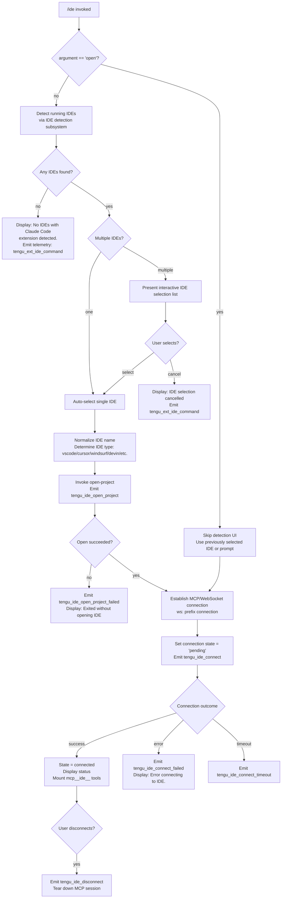

# `/ide`

> Analysis basis: CC v2.1.173 bundle.js (AST extraction + Claude interpretation)
> Minimum version: v2.1.173

---

## Overview

The `/ide` command manages IDE integrations for Claude Code. It detects running IDE instances that have the Claude Code extension installed, allows the user to select one, opens the current project in it, and establishes a live MCP/WebSocket connection between Claude Code and the chosen IDE. It also provides status information about current IDE connections and allows launching an IDE with `/ide open`.

---

## Registration

| Field | Value |
|---|---|
| type | `local-jsx` |
| name | `ide` |
| description | `Manage IDE integrations and show status` |
| argumentHint | `[open]` |
| module_id | `otq` |
| load_inline | `true` |
| loc_byte | `11790037` |
| loc_byte_end | `11790193` |
| loc_line | `7593` |
| arbor_handler.name | `fR7` |
| arbor_handler.fqn | `claude-2.1.173::fR7` |
| arbor_handler.kind | `AsyncFunction` |
| arbor_handler.resolution_path | `module_id` |
| arbor_handler.n_hits | `0` |

Analysis basis: CC v2.1.173 bundle.js:+11790037

---

## Input Branching

The command has 5+ distinct paths depending on the `[open]` argument, IDE detection results, user selection, and connection outcome.



---

## Behavioral Spec

### Entry Point — Handler `fR7`

The Arbor-resolved handler is `fR7` (AsyncFunction, resolved via `module_id` → `otq`).

```
async function ideCommandHandler(args, appState):
    emit telemetry("tengu_ext_ide_command", ...)

    subcommand = args[0]   // "open" or absent
    if subcommand == "open":
        skipDetection = true
    else:
        skipDetection = false

    if not skipDetection:
        detectedIDEs = await detectRunningIDEs()   // calls DX8 → YX8 / l0L

    if detectedIDEs is empty and not skipDetection:
        display("No IDEs with Claude Code extension detected.")
        return

    selectedIDE = await selectIDE(detectedIDEs)   // interactive list via rtq component
    if selectedIDE is null:
        display("No IDE selected.")  // or "IDE selection cancelled"
        return

    ideType   = normalizeIDEType(selectedIDE)   // Wg9: lowercase match
    openResult = await openProjectInIDE(ideType, currentWorktree)
    emit telemetry("tengu_ide_open_project", { type: ideType, context: "worktree"|"project" })

    if openResult.failed:
        emit telemetry("tengu_ide_open_project_failed", ...)
        display("Exited without opening IDE")
        if ideType requires restart:
            display("restart your IDE")
        return

    connectionResult = await connectToIDE(selectedIDE)   // via fR7 → p8 → gvH
    emit telemetry("tengu_ide_connect", ...)

    if connectionResult == "error":
        emit telemetry("tengu_ide_connect_failed", ...)
        display("Error connecting to IDE.")
        return

    if connectionResult == "timeout":
        emit telemetry("tengu_ide_connect_timeout", ...)
        return

    // Success — MCP tools under "mcp__ide__" prefix are now live
    monitorConnection(onDisconnect: emit("tengu_ide_disconnect"))
```

Analysis basis: CC v2.1.173 bundle.js:+11786153

---

### Sub-feature: IDE Detection (`DX8` / `YX8` / `l0L`)

```
async function detectRunningIDEs():
    // DX8 entry; parseInt port from environment; calls YX8 then l0L
    candidates = []

    // l0L: enumerate candidate IDE socket/lock paths
    for each candidatePath in buildSearchPaths():
        stat = fs.stat(candidatePath)
        if stat.isDirectory() or stat.isSymbolicLink():
            skip known non-user dirs:
                "/mnt/c/Users/Public", "/mnt/c/Users/Default",
                "/mnt/c/Users/Default User", "/mnt/c/Users/All Users"
            realpath = fs.realpath(candidatePath)
            if not already seen:
                candidates.push(realpath)

    // YX8: resolve each candidate to an IDE descriptor
    results = await Promise.all(candidates.map(resolveIDEDescriptor))

    // Filter lock files (.lock extension) and flatten
    return results.filter(isValid)
```

Analysis basis: CC v2.1.173 bundle.js:+6565904 (DX8), +6562458 (YX8), +6563697 (l0L)

---

### Sub-feature: IDE Name Normalisation (`Wg9`, `jX8`, `i0`)

```
function normalizeIDEName(rawName):
    lower = rawName.toLowerCase()   // Wg9

    if lower includes "windsurf":  return "windsurf"
    if lower includes "devin":     return "devin"
    if lower includes "cursor":    return "cursor"
    if lower includes "insiders":  return "insiders"
    if lower includes "vscode" or "vs code" or "visual studio code": return "vscode"
    if lower includes "vscodium" or "code - oss" or "codium":        return "vscodium"
    // jX8: basename + .cmd check for Windows
    // i0: maps binary basename to "IDE" display label
    return "vscode"  // default

function getDisplayLabel(ideType):
    // i0: toLowerCase on type, basename of executable
    if ideType contains "IDE":  return "IDE"   // JetBrains umbrella
    if ideType == "devin":      return "Devin Desktop"
    ...
```

Analysis basis: CC v2.1.173 bundle.js:+6568699 (Wg9), +6569142 (jX8), +6571523 (i0)

---

### Sub-feature: Open Project in IDE (`kH`, `bH`)

```
async function openProjectInIDE(ideType, projectPath):
    // Uses kH (feature-ok path) and bH (feature-bad path)
    // kH emits tengu_feature_ok; bH emits tengu_feature_bad
    try:
        result = await runIDEOpenCommand(ideType, projectPath)
        emit("tengu_feature_ok")
        return result
    catch error:
        emit("tengu_feature_bad")
        throw error
```

Analysis basis: CC v2.1.173 bundle.js:+1016267 (kH), +1016334 (bH)

---

### Sub-feature: MCP / WebSocket Connection (`p8`, `gvH`, React component `rtq`)

```
// rtq is the JSX component rendering the /ide UI
function IDECommandComponent(props):
    [connectionState, setConnectionState] = useState("pending")
    ideConfigRef = useRef()
    appState = useAppStateContext()   // X6 / eh_

    useEffect(() => {
        // Triggers on mount or IDE selection change
        connectToIDE()
    }, [selectedIDE])

    async function connectToIDE():
        setConnectionState("pending")
        emit("tengu_ide_connect")
        try:
            connection = await p8(selectedIDE, appState)   // p8 → gvH (core MCP client)
            setConnectionState("connected")
        catch error if timeout:
            emit("tengu_ide_connect_timeout")
            setConnectionState("error")
        catch error:
            emit("tengu_ide_connect_failed")
            setConnectionState("error")
            display("Error connecting to IDE.")

    useCallback(onDisconnect, () => {
        emit("tengu_ide_disconnect")
        if connectionURL starts with "ws:":
            // WebSocket IDE transport path
        setConnectionState("disconnected")
    })

    // Renders IDE list, connection status, and "mcp__ide__" tool availability
    return renderIDEStatusUI(connectionState, detectedIDEs, selectedIDE)
```

Analysis basis: CC v2.1.173 bundle.js:+11788039 (rtq), +11788256 (`ide_connect`), +11788343 (`ide_connect_failed`), +11788450 (`ide_connect_timeout`)

---

### Sub-feature: IDE Extension Install Hint (`pU_`, `e0L`)

```
function buildInstallHintContent(ideType, platform):
    // pU_: selects the appropriate install instructions block
    // e0L: iterates Object.entries of IDE → instruction map
    //      filters by platform ("linux", etc.)
    //      checks whether ideType is included in supported list
    // Returns UI element instructing user how to install the Claude Code extension
    for each [name, instructionSet] in Object.entries(ideInstructions):
        if ideType in instructionSet.supported:
            return formatInstructions(instructionSet, platform)
```

Analysis basis: CC v2.1.173 bundle.js:+6571155 (pU_), +6569707 (e0L)

---

### Sub-feature: MCP Server Lifecycle Called by IDE Connection (`M`, `SRH`, `oWA`)

When a WebSocket IDE connection is established, the MCP server manager (`M` → `SRH`) is invoked to register the IDE as an MCP provider. Server types observed in literals:

| Transport key | Value |
|---|---|
| `sse-ide` | SSE-based IDE transport |
| `ws-ide` | WebSocket-based IDE transport |
| `stdio` | Standard I/O transport |

The server manager applies connection results (`$n8`), emits `tengu_mcp_skills`, and exposes tools under the `mcp__ide__` namespace (literal: `"mcp__ide__"`, bundle.js:+11788846).

Analysis basis: CC v2.1.173 bundle.js:+16426611 (M / SRH), +11788846 (mcp__ide__ prefix)

---

## State & Side Effects

| Item | Detail |
|---|---|
| Telemetry — `tengu_ext_ide_command` | Fired on every `/ide` invocation (bundle.js:+11786155) |
| Telemetry — `tengu_ide_open_project` | Fired when open-in-IDE is attempted; carries `worktree`/`project` context (bundle.js:+11786706) |
| Telemetry — `tengu_ide_open_project_failed` | Fired if IDE open fails (bundle.js:+11786813) |
| Telemetry — `tengu_ide_connect` | Fired when MCP/WS connection attempt starts (bundle.js:+11788256) |
| Telemetry — `tengu_ide_connect_failed` | Fired on connection error (bundle.js:+11788343) |
| Telemetry — `tengu_ide_connect_timeout` | Fired on connection timeout (bundle.js:+11788450) |
| Telemetry — `tengu_ide_disconnect` | Fired when IDE connection is torn down (bundle.js:+11788949) |
| Telemetry — `tengu_feature_ok` / `tengu_feature_bad` / `tengu_feature_sad` | Fired from feature execution wrapper (bundle.js:+1016269, +1016336, +1016417) |
| Telemetry — `tengu_mcp_skills` | Fired when MCP server list is applied (bundle.js:+6607573) |
| MCP tool registration | On successful connection, tools under `mcp__ide__` prefix become available to the agent |
| appState changes | IDE connection state is stored in React `useState` within the `rtq` component; broader app state accessed via `AppStateProvider` context (`X6` / `eh_`) |
| Hook — `_.onInstallIDEExtension` | Called when install-extension flow is triggered (bundle.js:+11787280) |
| WebSocket transport | Connection URL begins with `"ws:"` for direct WebSocket IDE links (bundle.js:+11789066) |
| Daemon interaction | IDE sessions interact with the background daemon (`D`, `b`, `r0A`, `Q0A`) for session lifecycle, PTY management, and spawn/claim operations |
| Sound | None observed in depth-2 traversal |

---

## Version History

| Version | Change |
|---|---|
| v2.1.173 | Initial analysis |

---

## Common Mistakes

1. **Running `/ide` with no IDE extension installed**: The command will display "No IDEs with Claude Code extension detected." — install the Claude Code extension in the target IDE first.
2. **Expecting `/ide open` to discover new IDEs**: The `open` subargument skips the detection/selection step and reuses a previously identified IDE. If no IDE was previously selected, it still prompts.
3. **Cancelling the IDE selection prompt**: Produces "IDE selection cancelled" (or "No IDE selected.") and exits — no connection is established.
4. **Stale connections after IDE restart**: After restarting the IDE, the existing `mcp__ide__` tools may become unavailable. Re-run `/ide` or restart the IDE with the extension active to re-establish the connection.
5. **WSL path confusion**: On WSL, paths under `/mnt/c/Users/Public`, `/mnt/c/Users/Default`, `/mnt/c/Users/Default User`, and `/mnt/c/Users/All Users` are explicitly excluded from IDE discovery — don't install extensions under these directories.
6. **JetBrains IDE detection on Linux**: Detection uses a `ps aux` grep for a broad list of JetBrains process names; short-lived or backgrounded processes may be missed.

---

## Appendix — Identifier Mapping

> For bundle debugging only. Identifiers change across versions.

| Identifier | Role |
|---|---|
| `fR7` | Main `/ide` command handler (AsyncFunction, Arbor-resolved) |
| `rtq` | JSX React component rendering the IDE command UI and managing connection state |
| `DX8` | IDE detection orchestrator; parses port, invokes `YX8` and `l0L` |
| `YX8` | IDE descriptor resolver; maps candidate paths to IDE descriptor objects |
| `l0L` | IDE path enumerator; walks filesystem to find candidate IDE socket/lock paths |
| `Wg9` | IDE name normaliser (lowercase match against known IDE name strings) |
| `jX8` | IDE executable basename normaliser; handles `.cmd` extension for Windows |
| `i0` | IDE display-label mapper (e.g. maps type to "IDE", "Devin Desktop") |
| `pU_` | Install-hint selector; chooses per-IDE extension install instructions |
| `e0L` | Install-instruction iterator; filters by platform and IDE type |
| `p8` | MCP client connection initiator for IDE; wraps `gvH` |
| `gvH` | Core MCP client factory (connects, negotiates capabilities) |
| `kH` | Feature-ok wrapper; emits `tengu_feature_ok` on success |
| `bH` | Feature-bad wrapper; emits `tengu_feature_bad` on failure |
| `t6` | Feature-sad wrapper; emits `tengu_feature_sad` on degraded path |
| `M` | MCP server state manager; routes to `SRH` and `$n8` |
| `SRH` | MCP server registry; handles `sse-ide`, `ws-ide`, `stdio`, `claudeai-proxy` transports |
| `oWA` | MCP connection-result applier; updates server state, calls `SRH` and `$n8` |
| `$n8` | MCP connection result consumer; applies update, disposes orphaned connections |
| `r0A` | Background session / daemon session lifecycle manager |
| `D` | Background session daemon dispatcher; handles spawn, claim, kill, status |
| `b` | Daemon session controller; coordinates sub-managers `w`, `S`, `P`, `z`, etc. |
| `Q0A` | Daemon claim handler; connects via Unix socket with auth frame |
| `k7A` | IDE status formatter; slices and formats connected IDE lists for display |
| `p6` | Store accessor utility (reads from async store `Yo6`) |
| `Yo6` | Async store getter wrapping `wo6.getStore` |
| `P_` | Utility called from store accessor (`BG`) |
| `EH` | String coercion utility |
| `CH` | JSON serialisation utility |
| `SH` | Session/config persistence helper |
| `N8` | Error classifier / filesystem error handler |
| `R8` | Error re-throw / normalisation helper |
| `n6` | JSON.parse wrapper |
| `a7` | Error logging helper |
| `X6` | App-state React hook (wraps `useSyncExternalStore`) |
| `eh_` | App-state context accessor; throws `ReferenceError` outside `AppStateProvider` |
| `DA` | Secondary app-state hook variant |
| `A7` | Theme / UI context hook |
| `iM` | Internal utility called early in `fR7` |
| `Tk` | Utility called from `DX8` |
| `NO9` | Regex match helper for IDE process names |
| `Gg9` | Path/name replacement helper |
| `hg9` | Supplementary IDE detection helper |
| `jg9` | Process-kill helper (calls `process.kill`) |
| `d0L` | IDE descriptor constructor called from `DX8` |
| `GY_` | IDE info formatter (String coercion, parseInt, isNaN guard) |
| `u_` | Platform/version check utility |
| `f6` | String coercion shorthand |
| `eS7` | Post-selection UI helper called from `fR7` |
| `ot` | Utility called after install-hint in `fR7` |
| `Q2` | IDE connection client helper |
| `wX8` | UI element constructor called from `fR7` |
| `pU_` | (see above) install-hint selector |
| `s0L` | Helper within `jX8` |