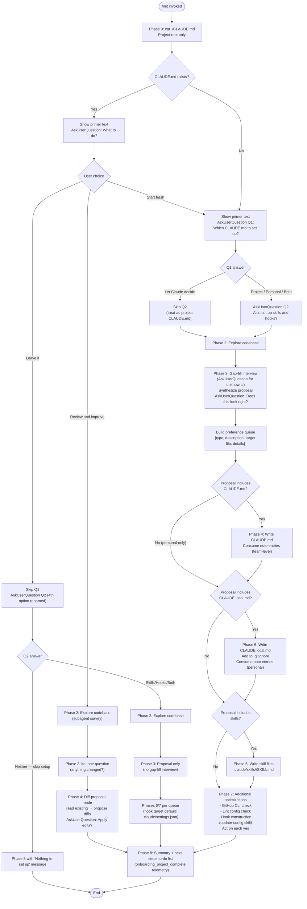

# `/init`

> Analysis basis: CC v2.1.170 bundle.js (AST extraction + Claude interpretation)
> Minimum version: v2.1.170

---

## Overview

The `/init` command bootstraps Claude Code configuration for a repository by guiding the user through a structured multi-phase interview, exploring the codebase via a subagent, and writing one or more output artifacts: a project `CLAUDE.md`, a personal `CLAUDE.local.md`, skill files under `.claude/skills/`, and lifecycle hooks in `.claude/settings.json` or `.claude/settings.local.json`. It is a `prompt`-type command — it works entirely by sending a large instructional prompt (22,519 characters, conditional branch) to the agent, which then drives all file-writing and user interaction autonomously.

---

## Registration

| Field | Value |
|---|---|
| type | `prompt` |
| name | `init` |
| description | `Initialize new CLAUDE.md file(s) and optional skills/hooks with codebase documentation \| Initialize a new CLAUDE.md file with codebase documentation` |
| loc_byte | `11750267` |
| loc_byte_end | `11750660` |
| loc_line | `7827` |
| handler_method | `getPromptForCommand` |
| handler_method_start | `11750583` |
| handler_method_end | `11750659` |
| prompt_body.length | `22519` characters |
| prompt_body.trace | `conditional; identifier→tIf (var template, 20920 chars); identifier→sIf (var template, 1592 chars)` |
| arbor_handler.name | `getPromptForCommand` |
| arbor_handler.fqn | `claude-2.1.170::getPromptForCommand` |
| arbor_handler.kind | `Method` |
| arbor_handler.resolution_path | `direct` |
| arbor_handler.n_hits | `2` |

Analysis basis: CC v2.1.170 bundle.js:+11750267

The handler is an inline `ObjectMethod` named `getPromptForCommand` on the registration object (bytes `11750583`–`11750659`). The call graph synthetic entry `__handler_init` is BFS bookkeeping; the real handler resolved by Arbor is `getPromptForCommand` (direct resolution, 2 hits). The prompt body has two conditional template branches — a long path (~20,920 chars) and a shorter path (~1,592 chars). The shorter path likely covers a legacy or simplified variant (the suffix block appended after the main phases). Analysis basis: CC v2.1.170 bundle.js:+11750583

---

## Input Branching

The command has more than three distinct control paths, spanning Phase 0 detection of an existing file through Phase 8 summary. A Mermaid flowchart is used.



Analysis basis: CC v2.1.170 bundle.js:+11750267 (prompt body phases), +4074602 (`onboarding_project_complete` telemetry at Phase 8 boundary)

---

## Behavioral Spec

### Phase 0 — Detect existing CLAUDE.md

```
function detectExistingClaudeMd():
    result = shell("cat ./CLAUDE.md")     // project root only
    if result is success:
        return EXISTS
    else:
        return ABSENT
```

The check is strictly limited to the project root; no recursive tree exploration happens at this point. Analysis basis: CC v2.1.170 bundle.js:+11750267

---

### Phase 1 — Onboarding primer and setup questions

```
function showPrimerAndAskSetupQuestions(detectionResult):
    print(PRIMER_TEXT)      // explains CLAUDE.md, Skills, Hooks to first-time users

    if detectionResult == EXISTS:
        answer = AskUserQuestion(
            question = "I found an existing CLAUDE.md. What would you like to do?",
            options  = ["Review and improve it", "Leave it, set up other things", "Start fresh (replace it)"]
        )
        route based on answer:
            "Review and improve" → skipToPhase2ReviewPath()
            "Leave it"           → askQ2WithRenamedOption()
            "Start fresh"        → continueToQ1AsIfAbsent()
    else:
        // detectionResult == ABSENT or "Start fresh" reroute
        q1Answer = AskUserQuestion(
            question = "Which CLAUDE.md files should /init set up?",
            options  = ["Project CLAUDE.md", "Personal CLAUDE.local.md",
                        "Both project + personal", "Let Claude decide"]
        )
        if q1Answer == "Let Claude decide":
            skipQ2 = true
            treat as project CLAUDE.md; no skills/hooks constraint
        else:
            q2Answer = AskUserQuestion(
                question = "Also set up skills and hooks?",
                options  = ["Skills + hooks", "Skills only", "Hooks only", "Neither, just CLAUDE.md"]
            )
            // Q2 is a hint, not a hard filter
```

Important: Q1 and Q2 are **separate** `AskUserQuestion` calls; they must never be combined into a single call. Analysis basis: CC v2.1.170 bundle.js:+11750267

---

### Phase 2 — Codebase exploration via subagent

```
function exploreCodbase():
    subagent reads:
        manifest files (package.json, Cargo.toml, pyproject.toml,
                        go.mod, pom.xml, ...)
        README, Makefile/build configs, CI config
        existing CLAUDE.md, .claude/rules/, AGENTS.md
        .cursor/rules or .cursorrules
        .github/copilot-instructions.md
        .devin/rules/, .windsurf/rules/, .windsurfrules, .clinerules
        .mcp.json

    detect:
        buildTestLintCommands   // especially non-standard
        languagesFrameworks
        projectStructure        // monorepo / multi-module / single
        codeStyleDifferences    // diverging from language defaults
        gotchasAndEnvVars
        existingClaudeSkillsAndRules
        formatterConfig         // prettier, biome, ruff, black, gofmt, rustfmt, etc.
        gitWorktreeUsage        // via `git worktree list`

    record what CANNOT be determined from code alone
        → these become gap-fill interview questions in Phase 3
```

Analysis basis: CC v2.1.170 bundle.js:+11750267

---

### Phase 3 — Gap-fill interview and proposal synthesis

```
function gapFillInterviewAndSynthesize(q1Answer, phase2Findings):
    if q1Answer in ["Project CLAUDE.md", "Both", "Let Claude decide"]:
        ask about codebase practices not already in README or manifests
        // do NOT mark options as "recommended"

    if q1Answer in ["Personal CLAUDE.local.md", "Both"]:
        ask about user role, familiarity, sandbox URLs, worktree layout, comms prefs
        if phase2Findings.multipleWorktrees:
            ask whether worktrees are nested-inside or sibling/external

    if reviewAndImprovePath:
        ask single question: "Has anything changed since this CLAUDE.md was written?"
        if yes → ask free-text follow-up
        skipTo = Phase4DiffProposal

    proposal = []
    for each finding in phase2Findings + gapFillAnswers:
        assign to:
            HOOK  if deterministic fast shell command (format/lint on edit)
            SKILL if on-demand multi-step workflow
            NOTE  if behavioral guidance without enforcement

    print proposal as bullet list (normal assistant text, not tool call)
    // "Here's what I'd set up: ..."
    if q2Hint and proposal deviates from q2Hint:
        print one-line deviation notice at top

    confirmAnswer = AskUserQuestion(
        question = "Does this look right?",
        options  = ["Looks good — proceed", "Drop the hook", "Drop the skill", ...]
        // "Other" is auto-added by the tool
    )
    // do NOT use the preview field — proposal is already in scrollback

    preferenceQueue = buildQueue(confirmedProposal)
    // each entry: {type, description, targetFile, phase2Details}
```

Analysis basis: CC v2.1.170 bundle.js:+11750267

---

### Phase 4 — Write CLAUDE.md

```
function writeClaudeMd(approvedProposal, preferenceQueue, path2Findings):
    if not approvedProposal.includesClaudeMd:
        return  // skip

    if reviewAndImprovePath:
        existing = readFile("./CLAUDE.md")
        diffs = compareAgainst(phase2Findings, phase3LiteAnswer, existing)
        print diffs with one-line reason each
        applyAnswer = AskUserQuestion("Apply these edits?",
                                      ["Apply all", "Let me pick which", "Skip"])
        if applyAnswer == "Skip":
            return
        applySelectedDiffs()
        return

    // Fresh write
    content  = HEADER_PREFIX          // "# CLAUDE.md\n\nThis file provides..."
    content += nonObviousBuildTestLintCommands
    content += codeStyleDifferencesOnly
    content += testingQuirks
    content += repoEtiquette
    content += requiredEnvVarsAndSetup
    content += nonObviousGotchasAndArchitecture
    content += importantAiToolConfigContent   // from AGENTS.md, .cursorrules, etc.

    for note in preferenceQueue where note.target == "CLAUDE.md":
        content += conciseNoteLine(note)

    // EXCLUDE: file lists, standard conventions, generic advice,
    //          verbose docs (use @path/to/import instead),
    //          frequently-changing info (reference with @path/to/import),
    //          commands obvious from manifests

    if projectHasMultipleConcerns:
        suggest ".claude/rules/" subdirectory approach
    if projectIsMonorepoOrMultiModule:
        offer to create subdirectory CLAUDE.md files

    writeFile("./CLAUDE.md", content)
```

Analysis basis: CC v2.1.170 bundle.js:+11750267; file name constant `"CLAUDE.md"` at +4074090; workspace constant at +4074128

---

### Phase 5 — Write CLAUDE.local.md

```
function writeClaudeLocalMd(approvedProposal, preferenceQueue, phase2Findings):
    if not approvedProposal.includesClaudeLocalMd:
        return

    if fileExists("./CLAUDE.local.md"):
        existing = readFile("./CLAUDE.local.md")
        proposeAdditionsOnly()           // never silently overwrite
        return

    if phase2Findings.multipleWorktrees and userConfirmedSiblingWorktrees:
        writeFile("~/.claude/<project-name>-instructions.md", personalContent)
        stubContent = "@~/.claude/<project-name>-instructions.md"
        writeFile("./CLAUDE.local.md", stubContent)
        // never place this import inside CLAUDE.md
    else:
        content = userRoleAndFamiliarity
        content += sandboxUrlsAndLocalSetup
        content += personalWorkflowPrefs
        for note in preferenceQueue where note.target == "CLAUDE.local.md":
            content += conciseNoteLine(note)
        writeFile("./CLAUDE.local.md", content)

    appendToGitignore("CLAUDE.local.md")
```

Analysis basis: CC v2.1.170 bundle.js:+11750267

---

### Phase 6 — Create skill files

```
function createSkills(approvedProposal, preferenceQueue, phase2Findings):
    if not approvedProposal.includesSkills:
        return

    // First: consume queued skill preferences
    for skillPref in preferenceQueue where skillPref.type == "skill":
        name = deriveNameFromPreference(skillPref)
        body = userWordsFromInterview + phase2CommandDetails
        if mapsToExistingBundledSkill:
            body += userSpecificConstraints
            notify user bundled skill still exists and this is additive
        if underspecified:
            AskUserQuestion(clarificationQuestion)
        writeFile(".claude/skills/" + name + "/SKILL.md", skillFrontmatter + body)

    // Then: suggest additional skills from codebase findings
    for pattern in phase2Findings.repeatableWorkflowsAndKnowledge:
        suggestSkill(name, oneLinePurpose, whyItFitsThisRepo)

    // Respect existing skills — never overwrite
    existingSkills = listDir(".claude/skills/") if exists
    only propose skills not already present
```

Skill files use YAML frontmatter with `name` and `description`. User-facing slash-command invocations use `/<skill-name>`; side-effect workflows receive `disable-model-invocation: true` and accept `$ARGUMENTS`. Analysis basis: CC v2.1.170 bundle.js:+11750267

---

### Phase 7 — Additional optimizations and hook construction

```
function suggestOptimizations(approvedProposal, preferenceQueue, phase2Findings):
    notify user: "Going to suggest a few additional optimizations..."

    // GitHub CLI check
    ghPresent = shell("which gh")  // or "where gh" on Windows
    if not ghPresent and projectUsesGitHub(gitRemote):
        AskUserQuestion("Install GitHub CLI?")
        if yes: act immediately

    // Lint config check
    if phase2Findings.noLintConfig:
        AskUserQuestion("Set up linting?")
        if yes: act immediately

    // Hook construction
    hookEntries = preferenceQueue.filter(type == "hook")
    if not hookEntries and phase2Findings.formatter:
        offer format-on-edit fallback hook

    if hookEntries:
        targetFile = resolveHookTargetFile(q1Answer)
        // project → .claude/settings.json
        // personal → .claude/settings.local.json
        // both/ambiguous → ask once for all hooks

        for each hookPref in hookEntries:
            event, matcher = mapPreferenceToEventMatcher(hookPref)
            // "after every edit"     → PostToolUse / Write|Edit
            // "when Claude finishes" → Stop
            // "before running bash"  → PreToolUse / Bash
            // "before committing"    → NOT a lifecycle hook; route to git pre-commit
            //                          or probe if they mean Stop

        // Load hook reference ONCE per /init run
        invokeSkillTool(skill="update-config",
                        args="[hooks-only] <one-line summary>")

        // Follow update-config skill's "Constructing a Hook" flow:
        //   dedup check → construct → pipe-test raw → wrap →
        //   write JSON → jq -e validate → live-proof → cleanup → handoff
```

Analysis basis: CC v2.1.170 bundle.js:+11750267; `onboarding_project_complete` telemetry at +4074602

---

### Phase 8 — Summary and next-steps

```
function summarizeAndSuggestNextSteps(phase2Findings, writtenArtifacts):
    recap(writtenArtifacts)   // which files were written, key points in each
    remind user: files are starting points; /init can be re-run anytime

    toDoList = []

    if frontendDetected(phase2Findings):
        toDoList += "/plugin install frontend-design@claude-plugins-official"
        toDoList += "/plugin install playwright@claude-plugins-official"

    if phase7Gaps.githubCliMissing and userDeclinedInPhase7:
        toDoList += "Install GitHub CLI — enables PR/issue/review workflows"

    if phase7Gaps.noLintConfig and userDeclinedInPhase7:
        toDoList += "Set up linting — gives Claude fast feedback on its own edits"

    if phase2Findings.testsAbsentOrSparse:
        toDoList += "Set up a test framework"

    // Always include:
    toDoList += "/plugin install skill-creator@claude-plugins-official"
    toDoList += "Browse official plugins with /plugin"

    print toDoList sorted by impact (most impactful first)
    emit telemetry("onboarding_project_complete")
```

Analysis basis: CC v2.1.170 bundle.js:+4074602 (`"onboarding_project_complete"` string at +4074602), +4074265 (`"Run /init to create a CLAUDE.md file..."` hint string)

---

### Handler dispatch and template selection

```
function getPromptForCommand(context):
    // Arbor-resolved handler: getPromptForCommand (direct, 2 hits)
    // loc_byte 11750583–11750659

    featureFlags = loadFeatureFlags()           // via featureFlagLoader
    experimentResult = runSlateHarborExperiment() // tengu_slate_harbor_experiment

    if featureFlags.useExtendedInitTemplate:    // tIf branch, ~20920 chars
        prompt = FULL_PHASE_PROMPT              // Phases 0–8 described above
    else:                                       // sIf branch, ~1592 chars
        prompt = LEGACY_SHORT_PROMPT            // abbreviated CLAUDE.md creation only

    return { type: "text", content: prompt }
```

The `"text"` literal at +11750631 confirms the returned content type. The `tengu_slate_harbor_experiment` telemetry event fires during handler invocation to record which experiment branch was active. Analysis basis: CC v2.1.170 bundle.js:+11750583, +11750631, +11727158

---

### Config persistence layer (called during artifact writes)

```
function saveConfigWithLock(configPath, newData):
    // Lock acquisition; warn if contention exceeds 100 ms threshold
    // Emits tengu_config_lock_contention if another process holds the lock

    reReadConfig = readFileSync(configPath, "utf-8")   // +3308022, +3308049

    if reReadConfig is missing auth that cache has:
        emit tengu_config_auth_loss_prevented           // +3306501
        throw "saveConfigWithLock: re-read config is missing auth..." // +3306349
        // Refuses write to protect ~/.claude.json (see GH #3117)

    writeWithAtomicRename(configPath, newData)
    // Uses temp file + rename for atomicity
    // Backup rotation: keeps last 5 backups (.backup.<timestamp>)
    // Max backup age: 60000 ms                         // +3306703
    // File mode: 0o600 (384 decimal)                  // +3307234
```

The `"Config accessed before allowed."` guard at +3307966 protects against early config access during startup. The `"ENOENT"` (+3308196) and `"EEXIST"` (+3308811) error codes are handled in the backup-directory creation path. Lock contention threshold is 100 ms (+3305927). Analysis basis: CC v2.1.170 bundle.js:+3308022, +3306349, +3305927, +3307234

---

## State & Side Effects

| Item | Detail |
|---|---|
| Telemetry: `tengu_slate_harbor_experiment` | Fires at handler invocation; records which prompt-template branch (long vs. short) is active. loc_byte: +11727158 |
| Telemetry: `tengu_config_lock_contention` | Fires when config lock acquisition is delayed. loc_byte: +3306022 |
| Telemetry: `tengu_config_stale_write` | Fires when a stale config write is detected. loc_byte: +3306158 |
| Telemetry: `tengu_config_auth_loss_prevented` | Fires when a write is refused because re-read config is missing auth present in cache (GH #3117 guard). loc_byte: +3306501 |
| Telemetry: `tengu_config_parse_error` | Fires when the config file cannot be parsed. loc_byte: +3308597 |
| Telemetry: `tengu_feature_ok` | Fires during feature-flag check in the dispatch path. loc_byte: +1014205 |
| Telemetry: `onboarding_project_complete` | Fires at Phase 8 (summary), marking the end of the `/init` workflow. loc_byte: +4074602 |
| Files written | `./CLAUDE.md`, `./CLAUDE.local.md`, `.claude/skills/<name>/SKILL.md`, `.claude/settings.json`, `.claude/settings.local.json` (conditionally, per approved proposal) |
| `.gitignore` mutation | `CLAUDE.local.md` is appended to `.gitignore` after Phase 5 creates it |
| Hook registration | Hooks are written to `.claude/settings.json` (project-shared) or `.claude/settings.local.json` (personal) via the `update-config` skill's construction flow |
| Config backup rotation | Up to 5 backup files (`.backup.<timestamp>`) are retained; files older than 60,000 ms are pruned. File mode 0o600 (384). |
| appState changes | `onboarding_project_complete` flag is set upon Phase 8 completion (via the telemetry path at +4074602) |
| Sound | None detected in depth-2 traversal |
| Skill tool invocation | `update-config` skill is invoked once per `/init` run when hook construction is needed (Phase 7) |
| Subagent launch | Phase 2 spawns a subagent to read manifest and config files |
| File watching | `BSL` (file-watcher utility) is reached through the config layer; watches are established and torn down around config saves via `V78.watchFile` / `V78.unwatchFile` |

---

## Version History

| Version | Change |
|---|---|
| v2.1.170 | Initial analysis. Full 8-phase prompt (22,519 chars, conditional tIf/sIf branches). Covers CLAUDE.md, CLAUDE.local.md, skills, hooks, GitHub CLI, linting, and plugin suggestions. `onboarding_project_complete` telemetry at Phase 8. |

---

## Common Mistakes

1. **Combining Q1 and Q2 into a single `AskUserQuestion` call.** The prompt explicitly forbids this — Q2 must only be asked after the Q1 answer is received, because "Let Claude decide" skips Q2 entirely.
2. **Using the `preview` field in the proposal confirmation call.** The proposal is printed as normal assistant text first; the `AskUserQuestion` call for "Does this look right?" must not duplicate it via `preview`.
3. **Placing `@~/.claude/<project-name>-instructions.md` inside the project `CLAUDE.md`.** This import stub belongs only in `CLAUDE.local.md` (or per-worktree stubs). Putting it in the shared file exposes a personal reference in version control.
4. **Overwriting existing skills.** Phase 6 must check `.claude/skills/` first and only propose new files that complement what is already there.
5. **Treating "before committing" as a lifecycle hook.** The hooks system cannot filter `Bash` by command content; a "before committing" requirement must be routed to a `git pre-commit` hook (husky, pre-commit framework, or `.git/hooks/pre-commit`). The agent should probe whether the user means "before I review Claude's output", which maps to the `Stop` event.
6. **Invoking the `update-config` skill more than once per `/init` run.** It is loaded once before the first hook; subsequent hooks in the same session reuse the already-loaded schema.
7. **Including generic or obvious content in CLAUDE.md.** The prompt is explicit: every line must pass the "would removing this cause Claude to make mistakes?" test; standard language conventions, file-structure lists, and commands obvious from manifests must be excluded.
8. **Silently overwriting `CLAUDE.local.md` if it already exists.** Phase 5 requires reading the existing file and proposing specific additions only.

---

## Appendix — Identifier Mapping

> For bundle debugging only. Identifiers change across versions.

| Identifier | Role |
|---|---|
| `__handler_init` | Synthetic BFS entry point for the `/init` command handler (bookkeeping only; real handler is `getPromptForCommand`) |
| `FoH` | Outer init workflow orchestrator; calls the file-writer, watcher setup, and onboarding-complete telemetry emitter |
| `kY` | File-watch coordinator; sets up and tears down watchers around config writes |
| `h6` | Config read/write core; manages lock acquisition and file I/O for settings files |
| `n6` | Logger / debug output utility |
| `hT_` | Config schema validator |
| `B7H` | Config file reader with ENOENT handling and backup-directory creation |
| `BSL` | File watcher lifecycle manager (watchFile / unwatchFile wrapper) |
| `v39` | CLAUDE.md path resolver entry point |
| `KI_` | CLAUDE.md target path builder (joins project root + `"CLAUDE.md"`) |
| `C6` | Workspace root resolver |
| `wr6` | Path normalization utility |
| `fj` | Config write-with-lock orchestrator (saveCurrentProjectConfig) |
| `k78` | Atomic file writer with backup rotation and lock enforcement |
| `_` | General-purpose utility / string helper |
| `L` | Async operation tracker (add/delete/finally set) |
| `JE1` | Config object merger (Object.assign wrapper) |
| `N` | Log-level formatter / message normalizer |
| `d` | Application state accessor |
| `V8` | Config cache manager |
| `liH` | Auth-loss guard (GH #3117 check; prevents wiping `~/.claude.json`) |
| `A` | String lowercaser utility |
| `CH` | JSON serializer (JSON.stringify wrapper) |
| `CT_` | Backup path constructor (joins backup dir + filename) |
| `V` | File path string (used in startsWith checks) |
| `P` | Stream/buffer reader with timeout and ETOOLARGE handling |
| `E` | Array slicer (Math.max/Math.min bounds) |
| `xO6` | Atomic file writer using temp-file + rename (with fchmod, fsync) |
| `f` | Connection/stream closer |
| `H` | Random delay / jitter utility (Math.random + setTimeout) |
| `ZJH` | Config stale-write detector |
| `QP6` | Timestamp provider (Date.now wrapper) |
| `I78` | Project-scoped config saver (saveCurrentProjectConfig fallback path) |
| `SH` | Feature-flag evaluator (emits `tengu_feature_ok`) |
| `K6` | Feature-flag record accessor |
| `ff6` | Feature-flag definition store |
| `aIf` | Experiment / A-B test runner entry point (emits `tengu_slate_harbor_experiment`) |
| `_6` | String coercion utility |
| `Y6` | Experiment variant selector and cache manager |
| `uP6` | Experiment configuration loader |
| `mP6` | Experiment result serializer |
| `Lm` | Experiment event emitter wrapper |
| `nu` | Core analytics/metrics client |
| `D78` | Experiment deduplication tracker (JT_ set + XJH map) |
| `Gw_` | GrowthBook experiment event builder (emits `growthbook_experiment`) |
| `WT_` | Experiment assignment persister |

---

Note: index built via Arbor fallback; some signals (telemetry, literals) may be missing — see arbor-fallback.js.