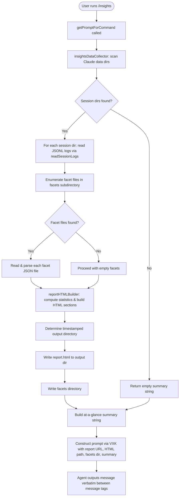

# `/insights`

> Analysis basis: CC v2.1.173 bundle.js (AST extraction + Claude interpretation)
> Minimum version: v2.1.173

---

## Overview

The `/insights` command generates a shareable HTML usage-analytics report by aggregating JSONL session logs and facet data from the user's Claude Code data directory. It then constructs a structured prompt (via `getPromptForCommand`) instructing the agent to announce the completed report's location verbatim and offer to discuss sections or suggestions. The user receives a local `report.html` file and a facets directory containing per-session breakdowns.

---

## Registration

| Field | Value |
|---|---|
| type | `prompt` |
| name | `insights` |
| description | `Generate a report analyzing your Claude Code sessions` |
| loc_byte | `13400829` |
| loc_byte_end | `13402133` |
| loc_line | `10665` |
| handler_method | `getPromptForCommand` |
| handler_method_start | `13401003` |
| handler_method_end | `13402132` |
| prompt_body.length | `513` |
| prompt_body.trace | `call→VXK(...) (1 literals)` |
| arbor_handler.name | `getPromptForCommand` |
| arbor_handler.fqn | `claude-2.1.173::getPromptForCommand` |
| arbor_handler.kind | `Method` |
| arbor_handler.resolution_path | `direct` |
| arbor_handler.n_hits | `1` |

Analysis basis: CC v2.1.173 bundle.js:+13400829

---

## Input Branching

The command involves 4+ distinct data-gathering branches (session directory scan, per-session JSONL reading, facet file enumeration, HTML report assembly), so a flowchart is used.



Analysis basis: CC v2.1.173 bundle.js:+13401009 (handler entry), +13387766 (session scan), +13476780 (facet enumeration), +13389764 (output dir creation), +13390051 (writeFile for report), +13402035 (VXK prompt builder)

---

## Behavioral Spec

### 1. Handler Entry — `getPromptForCommand`

The handler is an `ObjectMethod` inlined directly on the registration object. It is resolved by Arbor with `direct` resolution. On invocation:

```
async function getPromptForCommand(commandContext):
    // Step 1: collect insights data
    insightsResult = await insightsDataCollector(commandContext)

    // Step 2: format timestamp for output directory name
    now = new Date()
    year   = now.getFullYear()
    month  = String(now.getMonth() + 1).padStart(2, "0")
    day    = String(now.getDate()).padStart(2, "0")
    hours  = String(now.getHours()).padStart(2, "0")
    mins   = String(now.getMinutes()).padStart(2, "0")
    secs   = String(now.getSeconds()).padStart(2, "0")
    dirName = `${year}${month}${day}-${hours}${mins}${secs}`

    // Step 3: ensure output directory exists
    fs.mkdir(path.join(baseOutputPath, dirName), { recursive: true })

    // Step 4: write report.html
    reportPath = path.join(baseOutputPath, dirName, "report.html")
    fs.writeFile(reportPath, insightsResult.html)

    // Step 5: round summary value (Math.round at +13401390)
    summaryValue = Math.round(insightsResult.summaryMetric)

    // Step 6: build prompt string
    promptText = promptBuilder(
        insightsResult.fullData,
        reportURL,
        reportPath,
        facetsDir,
        summaryLine,
        atAGlanceSummary
    )

    // Step 7: serialize prompt via CH (JSON.stringify wrapper)
    return serializedPrompt(promptText)
```

Analysis basis: CC v2.1.173 bundle.js:+13401003 (method start), +13389764 (mkdir), +13390051 (writeFile), +13401390 (Math.round), +13402035 (VXK call), +13402053 (CH call), +13402099 (oF8 path helper)

---

### 2. Session Directory Scanner — `insightsDataCollector` (`ZXK`)

Collects session metadata from the Claude Code data directory:

```
async function insightsDataCollector(context):
    // Locate base data directory (path built via Tp6 + "usage-data" segment)
    baseDir = path.join(claudeDataRoot, "usage-data")  // literal: "usage-data" +13326718

    // Enumerate session subdirectories
    sessionDirs = await readdir(baseDir)
    sessionDirs = sessionDirs.filter(entry => entry.isDirectory())

    // Limit to most recent N sessions (slice at +13387839)
    recentDirs = sessionDirs.slice(-recentCount)

    // Read each session concurrently
    sessionData = await Promise.all(
        recentDirs.map(dir => readSingleSession(dir))
    )

    // Collect facet records
    facetRecords = []
    for each session in sessionData:
        facets = await enumerateFacets(session.facetDir)
        facetRecords.push(...facets)

    // Build per-session statistics map
    statsMap = buildStatisticsMap(sessionData)

    // Assemble HTML report string
    htmlReport = buildHTMLReport(statsMap, facetRecords)

    // Write facets JSON (GH5 path +13388607)
    await writeFacetsOutput(facetsOutputDir, facetRecords)

    // Write report HTML (PH5 path +13389444)
    await writeReportFile(reportOutputDir, htmlReport)

    // Produce at-a-glance summary
    summary = buildAtAGlanceSummary(statsMap)   // literal: "at_a_glance" +13340963

    return { html: htmlReport, fullData: statsMap, atAGlance: summary, facetsDir: facetsOutputDir }
```

Analysis basis: CC v2.1.173 bundle.js:+13387766 (ZXK body start), +13387839 (slice), +13387862 (Promise.all), +13388607 (GH5 facets write), +13389444 (PH5 report write), +13340963 ("at_a_glance" literal)

---

### 3. Session Log Reader — `readSingleSession` (`WH5`)

```
async function readSingleSession(sessionDir):
    // Construct session-meta path: path.join(sessionDir, "session-meta")
    // literal: "session-meta" +13326814
    metaPath = path.join(sessionDir, "session-meta")
    metaRaw  = await fs.readFile(metaPath, "utf-8")  // literal "utf-8" +13332849
    meta     = jsonParse(metaRaw)                    // n6 → JSON.parse +189746

    // Parse JSONL usage log via GXK
    usageLog = parseJSONL(metaRaw)

    return { meta, usageLog, sessionDir }
```

Analysis basis: CC v2.1.173 bundle.js:+13332782 (WH5 body), +13332825 (readFile), +13332849 ("utf-8"), +13332866 (GXK call), +13332870 (n6 JSON.parse)

---

### 4. Facet File Enumerator — `enumerateFacets` (`ML6`)

```
async function enumerateFacets(facetDir):
    // literal: "facets" +13326768 (subdirectory name)
    entries = await fs.readdir(facetDir)
    jsonlFiles = entries.filter(e => e.isFile() && e.name.endsWith(".jsonl"))
    // literal ".jsonl" +13476886

    results = []
    for each file in jsonlFiles:
        filePath = path.join(facetDir, file.name)  // N$.join +13476914
        stat     = await fs.stat(filePath)         // gK.stat +13477089
        parsed   = parseEntry(filePath)            // Ig pattern test +7189083
        results.push({ name: file.name, stat, data: parsed })

    // Resolve all file stats concurrently
    await Promise.all(results.map(r => r.statPromise))

    return results
```

Analysis basis: CC v2.1.173 bundle.js:+13476780 (ML6 readdir), +13476857 (isFile check), +13476886 (".jsonl" literal), +13476911 (Ig filter), +13476914 (basename), +13477021 (Promise.all), +13477089 (stat)

---

### 5. HTML Report Builder — `buildHTMLReport` (`kH5`)

The report builder is the largest sub-component (spans +13345570 – +13385243). It constructs an HTML string with multiple sections:

```
function buildHTMLReport(statsMap, facetRecords):
    sections = []

    // Tool usage frequency chart
    sections.push(buildToolUsageSection(statsMap.toolUsage))

    // Response-time buckets (literal bucket labels: "2-10s", "10-30s", "30s-1m",
    //   "1-2m", "2-5m", "5-15m", ">15m"  +13343936 – +13343996)
    sections.push(buildResponseTimeSection(statsMap.responseTimes))

    // Time-of-day analysis (Morning 6-12, Afternoon 12-18, Evening 18-24, Night 0-6)
    // literals +13344784, +13344831, +13344885, +13344937
    sections.push(buildTimeOfDaySection(statsMap.hourBuckets))

    // Error analysis section (chart colors: #dc2626 +13385317, #16a34a +13385566,
    //   #eab308 +13386059)
    sections.push(buildErrorSection(statsMap.toolErrors))

    // Bar chart for tool categories (colors: #2563eb +13381601, #0891b2 +13381739,
    //   #10b981 +13381911, #8b5cf6 +13382054)
    sections.push(buildToolCategoryBars(statsMap))

    // "Add to CLAUDE.md" suggestions section (literal +13349280)
    sections.push(buildSuggestionsSection(statsMap))

    // Combine into full HTML document
    htmlEscaped = escapeHTMLEntities(rawContent)
    // HTML entity map: &amp; &lt; &gt; &quot; &apos; +5117906 – +5118029

    return assembleHTMLDocument(sections, reportTitle)
```

Fallback placeholders when data is absent:
- No tool data: `<p class="empty">No data</p>` (literal +13343427)
- No response time data: `<p class="empty">No response time data</p>` (literal +13343884)
- No time data: `<p class="empty">No time data</p>` (literal +13344734)
- No tool errors: `<p class="empty">No tool errors</p>` (literal +13385328)
- No insights generated: `_No insights generated_` (literal +13401900)

Output file name: `report.html` (literal +13390023)
Maximum token budget for report content: 4096 (literal +13334667)
Long-session truncation threshold: 30,000 characters / 25,000 characters (literals +13332038, +13332059)

Analysis basis: CC v2.1.173 bundle.js:+13345570 (kH5 entry), +13334667 (4096 limit), +13343427 (empty placeholder), +13390023 ("report.html")

---

### 6. Statistics Aggregator — `buildStatisticsMap` (`EXK` / `IYA`)

```
function buildStatisticsMap(sessionData):
    toolCounts    = {}
    responseTimes = []
    hourBuckets   = { morning: 0, afternoon: 0, evening: 0, night: 0 }
    toolErrors    = {}

    for each session in sessionData:
        for each entry in session.usageLog:
            // Classify tool_use entries (literal "tool_use" +13327297)
            if entry.type == "tool_use":
                increment toolCounts[entry.name]

            // Classify response time bucket
            deltaSeconds = computeDelta(entry)
            pushToBucket(responseTimes, deltaSeconds)
            // Bucket boundary: 3600 seconds (+13328215), 60 seconds (+13329601)

            // Hour-of-day bucketing
            hour = new Date(entry.timestamp).getHours()
            if 6 <= hour <= 11:  buckets.morning++    // +13344810, +13344819
            elif 12 <= hour <= 17: buckets.afternoon++ // +13344861 – +13344873
            elif 18 <= hour <= 23: buckets.evening++   // +13344910 – +13344925
            else:                  buckets.night++     // +13344966

            // Tally errors
            if entry.exitCode != 0 or entry.rejected:
                increment toolErrors[entry.name]

    // Round percentage values (Math.round +13329542)
    return { toolCounts, responseTimes, hourBuckets, toolErrors }
```

Analysis basis: CC v2.1.173 bundle.js:+13329488 (WXK classifier), +13328215 (3600s bucket), +13329542 (Math.round), +13336554 (EXK aggregator)

---

### 7. Prompt Construction — `promptBuilder` (`VXK`)

```
function promptBuilder(fullData, reportURL, htmlFilePath, facetsDir, summaryLine, atAGlanceSummary):
    // Builds 513-character prompt string (prompt_body.length = 513)
    // Injects: fullData blob, reportURL, htmlFilePath, facetsDir, atAGlanceSummary
    // Contains a literal <message>...</message> block the agent must output verbatim
    // The <message> block includes the report URL and an offer to discuss sections
    // Instruction fragment: "Output the text between <message> tags verbatim"
    return formattedPromptString
```

The prompt body instructs the agent to:
1. Receive the full insights data as context (not shown to user yet).
2. Output **only** the text between `<message>` tags verbatim as its entire response.
3. The visible message confirms the report is ready and links to the shareable report URL.
4. Offer to dig into any section or try one of the suggestions.

Analysis basis: CC v2.1.173 bundle.js:+13402035 (VXK call site), +13401102 (ZXK call for data), prompt_body.length=513, prompt_body.trace="call→VXK(...) (1 literals)"

---

### 8. Path Helpers

| Helper | Role | Literal produced |
|---|---|---|
| `Tp6` (+13326705) | Resolves Claude Code base data directory | base path component |
| `oF8` (+13326754) | Constructs `usage-data` subdirectory path | `"usage-data"` (+13326718) |
| `NYA` (+13326800) | Constructs `session-meta` file path | `"session-meta"` (+13326814) |
| Facets path | Subdirectory under session dir | `"facets"` (+13326768) |

Analysis basis: CC v2.1.173 bundle.js:+13326705, +13326754, +13326800, +13326768

---

## State & Side Effects

| Item | Detail |
|---|---|
| Telemetry | No `tengu_*` events fire directly within the `/insights` handler or its depth-2 call graph. Telemetry events present in the broader bundle (e.g. `tengu_mcp_skills` +6607573, `tengu_daemon_control` +16797646) are in unrelated subsystems reachable only from MCP/daemon call paths. |
| File writes | Creates timestamped output directory under Claude Code data root; writes `report.html` (+13390023, +13390051); writes facets JSON files (+13388607) |
| File reads | Reads session JSONL logs from `usage-data/` subdirectory; reads `session-meta` files per session; reads facet `.jsonl` files |
| Hook registration | None observed in depth-2 traversal |
| appState changes | None observed in depth-2 traversal |
| Sound | None observed |
| Output truncation | Sessions truncated at 30,000 / 25,000 character thresholds (+13332038, +13332059) |
| Token budget | Report content capped at 4,096 tokens (+13334667) |
| Concurrent I/O | `Promise.all` used for parallel session reads (+13387862) and facet stat calls (+13477021) |

---

## Version History

| Version | Change |
|---|---|
| v2.1.173 | Initial analysis |

---

## Common Mistakes

1. **Running `/insights` in a fresh environment with no prior sessions** — The command will produce an empty or minimal report. The fallback string `_No insights generated_` (+13401900) will appear in the prompt if no data is found.
2. **Expecting live output during generation** — The agent's entire response is the verbatim `<message>` block; there is no streaming progress indicator from this command itself.
3. **Looking for the report in the current working directory** — The `report.html` file is written to a timestamped subdirectory inside the Claude Code data root, not the project directory. The report URL/path is included in the agent's response.
4. **Confusing the facets directory with the report file** — The facets directory contains raw per-session `.jsonl` analytics records; `report.html` is the human-readable HTML summary.
5. **Editing `report.html` and re-running** — Each invocation writes a fresh timestamped directory; prior runs are not overwritten.

---

## Appendix — Identifier Mapping

> For bundle debugging only. Identifiers change across versions.

| Identifier | Role |
|---|---|
| `__handler_insights` | Synthetic BFS entry point for the `/insights` command handler |
| `ZXK` | Main insights data collector; orchestrates session enumeration, stats, and report writing |
| `SH5` | Session directory scanner; reads and filters subdirectories under the data root |
| `Fn` | Path join helper for the `projects` segment (+5081396) |
| `ML6` | Facet file enumerator; reads `.jsonl` files from the facets subdirectory |
| `Ig` | Filename pattern tester (regex `.test`) for facet file filtering |
| `WH5` | Single-session log reader; reads `session-meta` and JSONL usage log |
| `NYA` | Path builder for `session-meta` file |
| `Tp6` | Base data directory path resolver |
| `GXK` | JSONL parser helper called after file read |
| `n6` | JSON.parse wrapper |
| `IYA` | Statistics round/format helper; also drives per-entry classification |
| `WXK` | Per-entry classifier; categorises tool_use, error types, time buckets |
| `EXK` | Statistics aggregator; accumulates tool counts, response times, error tallies |
| `TXK` | Numeric percentile/bucket computation helper |
| `ZH5` | HTML section assembler; calls report renderers and Promise.all |
| `kH5` | Full HTML report builder; constructs all chart sections |
| `VOH` | Tool-category bar chart section renderer |
| `NH5` | Max/values computation helper for chart scaling |
| `hH5` | Map/max helper for generating chart bar data |
| `IH5` | Inner HTML escape helper |
| `rF8` | Inline HTML formatting helper (uses `h7` for entity replacement) |
| `h7` | HTML entity replacement dispatcher |
| `J7` | String `replaceAll` wrapper for HTML entity escaping |
| `XXK` | Per-session HTML generation entry; calls `fq6` and `yf` |
| `fq6` | Individual session report generator |
| `Wb8` | Session data hash and file writer (SHA-1, randomUUID) |
| `bpH` | Report assembly step; handles assistant-message extraction |
| `GH5` | Facets JSON output writer (mkdir + writeFile) |
| `PH5` | Report HTML output writer (mkdir + writeFile) |
| `XH5` | Report file reader/unlinker (reads existing report, unlinks on update) |
| `oF8` | `usage-data` subdirectory path builder |
| `vXK` | Report cleanup/validation helper |
| `TH5` | Top-level report coordination function; chains `JH5`, `fq6`, `PXK`, `Gf` |
| `JH5` | Session batch processor; slices and maps sessions via `Promise.all` |
| `YH5` | Per-session entry formatter; calls `IYA` for classification |
| `RH5` | Object.keys-based field extractor for report data |
| `LL6` | Object.entries helper for statistics map iteration |
| `M9` | String slice/indexOf utility for text extraction |
| `ZH6` | MCP-related helper (`j2H`) — in call graph but not directly used by insights logic |
| `CH` | JSON.stringify wrapper |
| `VXK` | Prompt string builder; constructs the 513-char prompt with injected report paths and summary |
| `aF8` | App-state reader aggregating many Map/get calls for report context |
| `kqH` | Central app-state initialiser/registry (broad Map.set operations) |
| `sYA` | Text sanitiser; applies `replaceAll` and `slice` to session content |
| `ou6` | Inner sanitiser; handles array content and regex tests |
| `eYA` | Content filter; removes image/document attachment types |
| `D65` | Array/trim content validator |
| `j65` | Array.some predicate helper for content type checks |
| `Og8` | Statistics map getter/setter helper |
| `zg8` | `Array.from` + `Map.values` utility |
| `EXK` | Statistics aggregator (duplicate row — see above) |
| `zH5` | NaN check helper for numeric fields |
| `hYA` | (role not fully resolved at depth 2) <!-- TODO: not found in depth-2 traversal; needs --depth 4 --> |
| `a3` | (role not fully resolved at depth 2) <!-- TODO: not found in depth-2 traversal; needs --depth 4 --> |
| `Gp6` | (role not fully resolved at depth 2) <!-- TODO: not found in depth-2 traversal; needs --depth 4 --> |
| `OH5` | File extension extractor (`sQ.extname`) |
| `PPH` | Diff utility wrapper (`rG9.diff`) |
| `V4` | String `indexOf` utility |
| `fH5` | Path helper calling `Zj` |
| `Zj` | Renderer/platform selector (`c_`, `NL`, `v7`) |
| `Gf` | Filter helper (`H.filter`) for report section post-processing |
| `JA` | Error/String utility |
| `PXK` | Report renderer entry calling `Zj` |
| `SH` | Error logging helper (logs via `Ya.logError`, pushes to `rQH`) |
| `EH` | String coercion wrapper |
| `OL` | MCP error logger (`Ya.logMCPError`) |
| `j8` | MCP debug logger (`Ya.logMCPDebug`) |