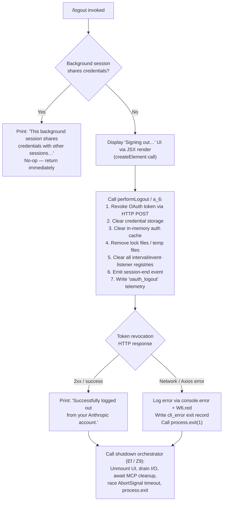

# `/logout`

> Analysis basis: CC v2.1.173 bundle.js (AST extraction + Claude interpretation)
> Minimum version: v2.1.173

---

## Overview

The `/logout` command signs the user out of their Anthropic account by revoking the OAuth token via an API call, clearing stored credentials, wiping in-memory authentication state, and then terminating the current session. It is a destructive, one-way operation that cannot be undone within the same session.

---

## Registration

| Field | Value |
|---|---|
| type | `local-jsx` |
| name | `logout` |
| description | Sign out from your Anthropic account |
| loc_byte | `11825693` |
| loc_byte_end | `11825977` |
| loc_line | `8077` |
| module_id | `uo_` |
| load_inline | `true` |
| arbor_handler.name | `HtL` |
| arbor_handler.fqn | `claude-2.1.173::HtL` |
| arbor_handler.kind | `AsyncFunction` |
| arbor_handler.resolution_path | `module_id` |
| arbor_handler.n_hits | `0` |

Analysis basis: CC v2.1.173 bundle.js:+11825693

---

## Input Branching

The handler exhibits four distinct execution paths depending on session context and the outcome of the token revocation call.



---

## Behavioral Spec

### Top-Level Handler (`HtL`)

`HtL` is an `AsyncFunction` resolved by Arbor via the `module_id` path (`uo_`). It is the command's entry point.

Analysis basis: CC v2.1.173 bundle.js:+8314298

```
async function logoutCommandHandler(context):
    sessionContext = getSessionContext(context)        // O9 → CDH

    if sessionContext.isBackgroundSession:
        // Credentials are shared; local logout would invalidate other sessions.
        // Message: "This background session shares credentials with other sessions…"
        // Analysis basis: CC v2.1.173 bundle.js:+8314408
        renderMessage(BG_SESSION_NO_LOGOUT_MESSAGE)
        return

    renderSpinner("Signing out…")                     // xo_.createElement, loc_byte 8314582
    // Analysis basis: CC v2.1.173 bundle.js:+8314761

    await performLogout(context)                      // a_6, loc_byte 8314371

    setTimeout(initiateShutdown, delay)               // loc_byte 8314670
    // HTTP 200 path only — loc_byte 8314702
```

---

### Background-Session Guard

```
function isBackgroundSession(context):
    // O9 checks process role against literals "bg", "daemon", "daemon-worker"
    // Analysis basis: CC v2.1.173 bundle.js:+8314298, +2269142, +2269152, +2269166
    role = getProcessRole()
    return role in {"bg", "daemon", "daemon-worker"}
```

If `isBackgroundSession` returns `true`, the string `"This background session shares credentials with other sessions; /logout here has no effect. Run /logout from your main terminal to sign out."` is surfaced to the user and the handler returns without performing any state change. Analysis basis: CC v2.1.173 bundle.js:+8314408

---

### OAuth Token Revocation (`aO_`)

```
async function revokeOAuthToken(credentials):
    // Analysis basis: CC v2.1.173 bundle.js:+8313293
    payload = { grant_type: "refresh_token", token: credentials.refreshToken }
    response = await httpClient.post(revokeEndpoint, payload, {
        headers: { "Content-Type": "application/json" },
        timeout: 5000                                 // loc_byte 2121246
    })
    // Telemetry event "oauth_token_revoke" emitted here — loc_byte 2121256
    if isAxiosError(response):
        classify error as "network" or other          // loc_byte 2121380
        propagate
    return response
```

The token revocation endpoint is determined by `S1`, which selects among `prod`, `staging`, `local`, and custom-OAuth configurations. Custom OAuth URLs are validated against an approved list; an unapproved URL raises `"CLAUDE_CODE_CUSTOM_OAUTH_URL is not an approved endpoint."` (Analysis basis: CC v2.1.173 bundle.js:+856784).

The 5 000 ms timeout constant applies to this request. Analysis basis: CC v2.1.173 bundle.js:+2121246

---

### Credential Storage Clearance (`performLogout` / `a_6`)

`a_6` orchestrates the full logout sequence. Analysis basis: CC v2.1.173 bundle.js:+8313084

```
async function performLogout(context):
    await Promise.resolve()                           // loc_byte 8313084 — yield to event loop

    readCurrentConfig(q)                              // loc_byte 8313135 — read auth from disk
    // q → $1 → npH (error reporter) / $X (config writer) / process.exit on failure

    checkSessionRole(O9)                              // loc_byte 8313139

    runCleanupSequence(iI6):                          // loc_byte 8313151
        clearCredentialCache(uW8)                     // loc_byte 8314156
        clearMachineIdCache(mnH)                      // loc_byte 8314162
        clearIntervalRegistry(X78 → c89.clear)        // loc_byte 8314168
        clearQueuedOperations(QDH)                    // loc_byte 8314174
        shutdownEventSystem(o_H):                     // loc_byte 8314199
            stopPrimaryEventLoop(Ym → eu → nC)
            deregisterAllListeners(yrH):
                clearIntervalStore($Z_ → clearInterval)
                process.removeListener(beforeExit, exit) // loc_bytes 3292636, 3291876
                process.off(...)                      // loc_byte 3291818
                clear registries: ajH, N78, N26, AZ_, zF
            emitSessionEnd(IrH.emit)                  // loc_byte 3291690
            logSessionErrors(SH → JA, f6, Rq, MRf)
        deleteTempLockFile(FHq → z86.unlink)          // loc_byte 7412896
        deletePidFile(Fd_ → kCH.unlink)               // loc_byte 7361525

    printOutputMessage(c_)                            // loc_byte 8313171

    readCredentialStore(hf → lV1):                   // loc_byte 8313198
        // lV1 handles read/update/delete across primary and fallback stores
        // Telemetry: secure_storage_credentials_write, primary_transient_skip_fallback,
        //            plaintext_fallback_used, primary_and_fallback_failed

    readSessionFile(f.readAsync)                      // loc_byte 8313238

    revokeOAuthToken(aO_)                            // loc_byte 8313293

    updateAuthConfig(So)                              // loc_byte 8313373

    loadConfigStore(iE_ → A_9 → YX1, E8):           // loc_byte 8313388
        // YX1 computes sha256 hex key (NFC-normalised) — loc_byte 2132586
        // E8 / Q78 handles config file write with lock acquisition (60 000 ms max) — loc_byte 3313180

    mutateGlobalState(K.mutate)                       // loc_byte 8313416

    writeEventLog(SH)                                 // loc_byte 8313571

    deleteSessionKey(K.delete)                        // loc_byte 8313590

    clearExtraState(eZH)                              // loc_byte 8313601

    writeConfigToDisk(E8)                             // loc_byte 8313623
    // Safety guard: refuses to write if re-read config is missing auth that cache has.
    // Message: "saveConfigWithLock: re-read config is missing auth…" — loc_byte 3312826
    // Telemetry: tengu_config_auth_loss_prevented — loc_byte 3312978

    writeCredentialRecord(kH)                         // loc_byte 8314076
    // Telemetry event "oauth_logout" emitted — loc_byte 8314079
```

---

### Config Write Safety Guard

The config writer (`Q78` / `E8`) enforces two integrity checks before committing credential-related changes to disk. Analysis basis: CC v2.1.173 bundle.js:+3312826

```
function saveConfigWithLock(newConfig):
    acquireLock(timeout=60000)                        // loc_byte 3313180
    // Telemetry: tengu_config_lock_contention on slow acquisition — loc_byte 3312499

    reReadConfigFromDisk()
    if reReadConfig.auth is missing AND cache.auth is present:
        // Refuses to overwrite — protects against race condition described in GH #3117
        // Telemetry: tengu_config_auth_loss_prevented — loc_byte 3312978
        logError("saveConfigWithLock: re-read config is missing auth…")
        return without writing

    up to 5 backup copies maintained                  // loc_byte 3313429
    // Backup files use ".backup." infix — loc_byte 3313296
    // File permissions: 0o600 (384 decimal) — loc_byte 3313711

    writeAtomically(Cz6):
        write to temp file → fchmod → fsync → rename  // loc_bytes 1089165, 1089223, 1089289, 1089417
    releaseLock()
```

---

### Credential Store Clear (`lV1`)

```
async function clearCredentialStore():
    // Primary store operations first; falls back to plaintext on failure
    // Telemetry paths (loc_byte source):
    //   "secure_storage_credentials_write"  — loc_byte 2297281
    //   "primary_transient_skip_fallback"   — loc_byte 2297379
    //   "plaintext_fallback_used"           — loc_byte 2297528
    //   "primary_and_fallback_failed"       — loc_byte 2297631
    deletePrimaryEntry(H.delete)
    deleteFallbackEntry(_.delete)
    // Storage write lock suffix: ".storage-write" — loc_byte 2295905
    // Retry delays (ms): 10, 100, 1000, 15000 — loc_bytes 2295953/67/82/94
```

---

### Shutdown Orchestrator (`Ef` / `Z9`)

After a successful logout response (HTTP 200), `HtL` schedules shutdown via `setTimeout`. Analysis basis: CC v2.1.173 bundle.js:+8314670

```
async function shutdown():
    // Ef → Z9
    unmountUI(uCH)                                    // nMH.writeSync, H.unmount
    renderFinalOutput(ed_)                            // writes "Successfully logged out…" — loc_byte 8314607
    // "Successfully logged out from your Anthropic account." — loc_byte 8314607

    drainWriteBuffer(ZFH → yZA.drain)                 // loc_byte 63794
    waitForMcpClients(le9 → Promise.allSettled)       // loc_byte 13511155
    raceTimeout = AbortSignal.timeout(...)            // loc_byte 7373146

    Promise.race([shutdownComplete, raceTimeout])
    // Grace period constant: 3500 ms — loc_byte 7372868
    // Additional settle constant: 2000 ms — loc_byte 7373046

    clearTimeout(pending)                             // loc_byte 7373058
    writeSessionEndMarker($6 / q56)                   // loc_byte 7373255
    // Telemetry: tengu_cache_eviction_hint — loc_byte 7373220
    // Telemetry: tengu_scroll_summary — loc_byte 7372277
    // Telemetry: session_end — loc_byte 7373258

    process.exit(0)                                   // via Hc_ — loc_byte 7371108
```

If cleanup exceeds the timeout, `Hc_` issues `process.kill(process.pid, "SIGKILL")`. Analysis basis: CC v2.1.173 bundle.js:+7371133, +7371158

---

### Error Path

```
function handleLogoutError(error):
    // npH — loc_byte 13298516
    console.error(W6.red(errorMessage))
    writeCliErrorRecord($X → iFH.writeFileSync)       // loc_byte 196283
    // Exit code "cli_error" — loc_byte 13298571
    process.exit(1)                                   // loc_byte 13298584
```

---

## State & Side Effects

| Item | Detail |
|---|---|
| Telemetry — `oauth_token_revoke` | Fired when the HTTP revocation request is dispatched (bundle.js:+2121256) |
| Telemetry — `oauth_logout` | Fired after credential record is written/cleared (bundle.js:+8314079) |
| Telemetry — `tengu_feature_ok` | Fired on successful credential store write (bundle.js:+1016269) |
| Telemetry — `tengu_feature_sad` | Fired on transient credential store failure (bundle.js:+1016417) |
| Telemetry — `tengu_feature_bad` | Fired on hard credential store failure (bundle.js:+1016336) |
| Telemetry — `tengu_config_lock_contention` | Fired when config lock acquisition is slow (bundle.js:+3312499) |
| Telemetry — `tengu_config_stale_write` | Fired on stale config write detection (bundle.js:+3312635) |
| Telemetry — `tengu_config_parse_error` | Fired on config parse failure (bundle.js:+3315074) |
| Telemetry — `tengu_config_auth_loss_prevented` | Fired when auth-loss safety guard triggers (bundle.js:+3312978) |
| Telemetry — `tengu_startup_perf` | Fired during shutdown startup-profiling report (bundle.js:+221519) |
| Telemetry — `tengu_scroll_summary` | Fired during terminal teardown (bundle.js:+7372277) |
| Telemetry — `tengu_cache_eviction_hint` | Fired at session-end (bundle.js:+7373220) |
| Telemetry — `tengu_daemon_config_reload` | Fired if daemon config reloads during teardown (bundle.js:+16776088) |
| Telemetry — `tengu_pewter_brook` | Fired during terminal capability detection at shutdown (bundle.js:+3504379) |
| OAuth credential deletion | Removes primary keychain/secure-store entry and plaintext fallback |
| Config file rewrite | Clears `oauthAccount` / auth fields in `~/.claude.json`; atomic rename with 0o600 permissions |
| Lock files | `FHq` deletes temp lock file; `Fd_` deletes PID file |
| Interval registries | `yrH` clears: `ajH`, `N78`, `N26`, `AZ_`, `zF` |
| Process listeners | `process.off(exit)` and `process.removeListener(beforeExit)` are called |
| Session-end event | `IrH.emit` broadcasts session termination to internal subscribers |
| UI | JSX spinner shown during revocation; final success message written to stdout before unmount |
| Process exit | `process.exit(0)` on success; `process.exit(1)` on error |
| Background sessions | No state change; informational message displayed only |

---

## Version History

| Version | Change |
|---|---|
| v2.1.173 | Initial analysis |

---

## Common Mistakes

1. **Running `/logout` in a background/daemon session**: The command is a no-op in background sessions (role `bg`, `daemon`, or `daemon-worker`). It prints an advisory message and returns without revoking credentials. Run `/logout` from the main terminal session instead.
2. **Expecting the session to remain usable after logout**: The command terminates the process. Any in-flight work is abandoned; the shutdown orchestrator races against a 3 500 ms grace window before issuing SIGKILL.
3. **Assuming instant credential removal**: The command performs a network call to revoke the token (5 000 ms timeout). If the revocation endpoint is unreachable, the command logs the error and exits with code 1 — local credential files may still require manual removal.
4. **Custom OAuth URL not on the approved list**: If `CLAUDE_CODE_CUSTOM_OAUTH_URL` is set to an unapproved endpoint, the revocation step throws `"CLAUDE_CODE_CUSTOM_OAUTH_URL is not an approved endpoint."` before any network call is made.
5. **Concurrent Claude instances during logout**: The config writer holds a file lock (60 000 ms max). A concurrent instance may trigger `tengu_config_lock_contention`, and the auth-loss safety guard (`tengu_config_auth_loss_prevented`) may abort the write to protect against the GH #3117 race condition.

---

## Appendix — Identifier Mapping

> For bundle debugging only. Identifiers change across versions.

| Identifier | Role |
|---|---|
| `HtL` | Top-level logout command handler (AsyncFunction, Arbor-resolved) |
| `a_6` | Core `performLogout` orchestrator — sequences all logout sub-steps |
| `_tL` | Logout UI rendering component (JSX wrapper, renders spinner + final message) |
| `q` | Config reader — reads auth state from disk |
| `$1` | Auth record processor — feeds into error reporter or config writer |
| `npH` | Error formatter — writes red error text to stderr |
| `$X` | CLI error record writer — calls `iFH.writeFileSync` |
| `O9` | Session role inspector — checks `bg` / `daemon` / `daemon-worker` |
| `CDH` | Internal helper called by session role inspector |
| `iI6` | Cleanup sequence runner — coordinates all resource teardown |
| `uW8` | Credential cache clearer |
| `mnH` | Machine-ID cache clearer |
| `X78` | Interval registry clearer — calls `c89.clear` |
| `QDH` | Queued-operations clearer |
| `o_H` | Event system shutdown coordinator |
| `Ym` | Primary event loop stopper |
| `eu` | Event loop helper called by `Ym` |
| `yrH` | Listener deregistration — clears intervals, process listeners, and registries |
| `$Z_` | Interval store clearer — calls `clearInterval` and `process.removeListener` |
| `SH` | Session error log writer |
| `JA` | Error record constructor |
| `f6` | String coercion helper |
| `Rq` | Essential-traffic queue processor |
| `MRf` | Log queue manager — shifts and pushes to `Lo6` |
| `FHq` | Temp lock file deleter — calls `z86.unlink` |
| `dHq` | Index helper for `FHq` |
| `Sc_` | Lock-path resolver called by `FHq` |
| `qcA` | Path helper for lock resolver |
| `X4H` | Path join helper |
| `Xa6` | Path assembly helper — calls `AcA.join` |
| `Fd_` | PID file deleter — calls `kCH.unlink` |
| `Ud_` | PID file path resolver |
| `gd_` | PID file helper |
| `ILH` | Platform / auth type filter for PID paths |
| `rDH` | Path builder for PID file — calls `wm1.join` |
| `c_` | Output message printer |
| `hf` | Credential store accessor entry point |
| `lV1` | Credential store read/write/delete — handles primary and fallback stores |
| `HhH` | Credential store helper — cache path builder |
| `Lw4` | Storage context initialiser — creates directories, sets up async store |
| `kH` | Credential write handler (primary path) |
| `c` | Low-level config item writer |
| `A6` | Config entry helper — calls `q56` |
| `t6` | Credential write handler (secondary / update path) |
| `bH` | Credential write handler (fallback path) |
| `f` | Async file I/O set with `q.add` / `q.delete` |
| `L` | File handle / connection closer |
| `A` | Generic async operation wrapper |
| `aO_` | OAuth token revocation HTTP caller — POST to revoke endpoint |
| `S1` | OAuth endpoint selector — chooses prod/staging/local/custom URL |
| `PbA` | Endpoint base-URL resolver |
| `cJf` | OAuth URL path builder |
| `N` | HTTP request builder / dispatcher |
| `d8f` | HTTP helper — timeout/abort setup |
| `RZA` | Locale/header normaliser |
| `CH` | JSON stringify wrapper |
| `lf` | Header value formatter |
| `zNA` | Header map builder |
| `oFH` | Output stream writer |
| `tvA` | TTY write helper |
| `i8f` | Log-file writer — batches and appends to debug log |
| `EFH` | Log batch flusher |
| `FfH` | Log file path formatter |
| `o6` | `try/catch` error-swallow helper |
| `K36` | Log directory creator |
| `DNA` | Log file name builder |
| `Us8` | Log file rotator — renames / unlinks old files |
| `n8f` | Log file appender — calls `hy.appendFile` |
| `y9` | Log drain registrar — calls `yZA.register` |
| `So` | Auth config updater (clears account fields post-logout) |
| `iE_` | Config store loader |
| `A_9` | Config reader with path resolution |
| `YX1` | Config key hasher — SHA-256 hex of NFC-normalised path |
| `vI` | Key normaliser — `_.normalize` + `OX1.createHash` |
| `Q2` | Config value getter |
| `nv` | Username/homedir resolver — calls `S_8.userInfo` |
| `EH` | String coercion |
| `E8` | Global config file writer (uses `Q78`) |
| `Q78` | Atomic config file writer — lock, backup, write, rename |
| `UV1` | Config object merger — `Object.assign` |
| `N8` | Error code classifier |
| `G7H` | Config file reader with backup recovery |
| `urH` | Config writer pre-flight validator |
| `GZ_` | Backup directory path builder |
| `V` | Config version string |
| `P` | Streaming buffer accumulator |
| `E` | Clamped numeric range helper |
| `Cz6` | Atomic file write — temp + fchmod + fsync + rename |
| `AJH` | Config schema validator |
| `R_9` | Config entry iterator |
| `u26` | Timestamp helper — `Date.now` |
| `g78` | Config backup writer |
| `Z18` | Config store teardown helper |
| `K` | Global state atom — `K.mutate` / `K.delete` |
| `eZH` | Extra session-state clearer |
| `_tL` | Logout UI shell component |
| `xyH` | OTEL/metrics attribute builder |
| `KJ` | Attribute encoder |
| `mf` | Metrics event emitter |
| `byH` | OTEL resource builder — assembles user/session/version attributes |
| `QB` | Random ID generator for OTEL |
| `y6` | Build-info accessor |
| `sO8` | OTEL attribute set builder — `Object.freeze` |
| `LG6` | Attribute formatter — calls `f6` |
| `J8H` | Deny-listed key checker — `Jkf.has` |
| `e4` | Attribute writer |
| `KD9` | OTEL attribute pair builder |
| `MM6` | Metrics sequence counter |
| `Fr8` | Metrics flush helper |
| `M` | MCP server manager — emits MCP update events |
| `SRH` | MCP connection orchestrator |
| `$n8` | MCP connection result applier |
| `$` | MCP client registry |
| `oWA` | MCP server slot reconciler |
| `gr8` | Metrics batch sender |
| `HtL` | *(See top of table — primary handler)* |
| `Ef` | Shutdown entry point — delegates to `Z9` |
| `Z9` | Main shutdown sequence — unmount, drain, MCP teardown, exit |
| `uCH` | UI unmount helper — calls `H.unmount` |
| `Db` | Terminal state restorer |
| `V38` | Terminal output finaliser — calls `ns.writeSync` |
| `ed_` | Final output renderer — writes logout confirmation to terminal |
| `Y0` | Terminal cursor-save sequence emitter |
| `Ou` | Terminal output helper |
| `FN6` | Final file-path checker — `q.statSync` |
| `X$` | Terminal footer writer |
| `xe9` | Escape sequence builder |
| `Hc_` | Hard-exit enforcer — `process.exit` / `process.kill(SIGKILL)` |
| `ZFH` | Write-buffer drainer — `yZA.drain` |
| `w` | MCP supervisor update loop |
| `vEH` | Supervisor state diffing engine |
| `oDK` | Column-width calculator for supervisor display |
| `T` | Supervisor ticker |
| `JrK` | Supervisor heartbeat emitter |
| `le9` | MCP client shutdown awaiter — `Promise.allSettled` |
| `E36` | Startup profiling reporter |
| `as8` | Profiling data serialiser |
| `INA` | Profiling report file writer |
| `dW8` | Scroll summary emitter |
| `be9` | Scroll metrics collector |
| `Ce9` | Scroll timing calculator |
| `v1` | Terminal capability detector (fullscreen/flicker checks) |
| `y56` | Session-end marker writer |
| `$6` | Exit-code resolver |
| `q56` | Exit-code constant |
| `pCH` | Pre-exit drain promise |
| `gW8` | Drain completion resolver |

---

Note: index built via Arbor fallback; some signals (telemetry, literals) may be missing — see arbor-fallback.js.