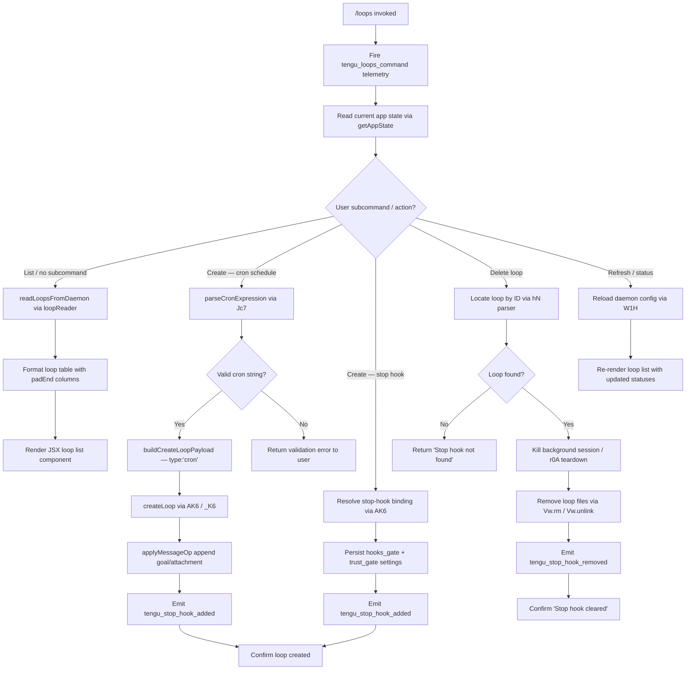

# `/loops`

> Analysis basis: CC v2.1.173 bundle.js (AST extraction + Claude interpretation)
> Minimum version: v2.1.173

---

## Overview

The `/loops` command provides an interactive management interface for background agent loops — scheduled or event-driven tasks that run autonomously in the background. It allows users to list currently active loops, create new loops (with cron schedules or stop-hook triggers), and delete existing ones, surfacing live status from the daemon's app state.

---

## Registration

| Field | Value |
|---|---|
| type | `local-jsx` |
| name | `loops` |
| description | `List, create, and delete loops` |
| loc_byte | `12725304` |
| loc_byte_end | `12725461` |
| loc_line | `8999` |
| immediate | `true` |
| module_id | `U5K` |
| load_inline | `true` |
| arbor_handler.name | `Xc7` |
| arbor_handler.fqn | `claude-2.1.173::Xc7` |
| arbor_handler.kind | `AsyncFunction` |
| arbor_handler.resolution_path | `module_id` |
| arbor_handler.n_hits | `0` |

Analysis basis: CC v2.1.173 bundle.js:+12725304

---

## Input Branching

Five distinct execution paths are identifiable from the call graph and literal constants, warranting a Mermaid flowchart.



---

## Behavioral Spec

### Entry point — main handler (`Xc7`)

```
async function loopsCommandHandler(context):
    emit telemetry("tengu_loops_command")           // +12724261
    loopFileData   = await readLoopFiles(context)   // G1H → $SH
    loopTableMap   = buildLoopTable(context)        // HK6 → o0H
    appState       = context.getAppState()          // +12724311
    formattedRows  = appState.loops.map(formatRow)  // +12724339
    parsedSchedules = parsedScheduleList(context)   // hN  +12724390
    cronRows       = appState.loops
                      .filter(l => l.type == "cron")
                      .map(formatCronRow)           // +12724357, +12724423

    if userAction == "create":
        if scheduleType == "stophook":              // literal "stophook" +12724443
            return await createStopHookLoop(context, params)   // AK6
        else:
            return await createCronLoop(context, params)       // _K6
    elif userAction == "delete":
        return await deleteLoop(context, loopId)               // Jc7 → r0A
    else:
        // default: render list
        return renderJSX(loopListComponent, formattedRows)     // t$A.createElement +12725064
```

Analysis basis: CC v2.1.173 bundle.js:+12724259

---

### Reading loop definitions from disk (`loopReader` / `$SH`)

```
async function readLoopFilesFromDisk(loopsDir):
    raw = await fs.readFile(loopsDir, encoding="utf-8")   // +4849008, "utf-8" +4849036
    parsed = parseLoopData(raw)                           // o6
    if not Array.isArray(parsed):                         // +4849152
        return []
    return parsed
        .map(entry => normaliseEntry(entry))              // N +4849331
        .map(entry => enrichWithStatus(entry))            // CH +4849378
        .map(entry => parseCronEntry(entry))              // Ok +4849400
```

Analysis basis: CC v2.1.173 bundle.js:+4848989

---

### Parsing cron expressions (`cronParser` / `Jc7`)

```
function parseCronExpression(input):
    trimmed = input.trim()
    parts   = trimmed.match(cronRegex)               // H.match +12723847
    if parts == null:
        return validationError("invalid cron")

    // Field extraction with numeric bounds
    minute  = parseInt(parts[1])                     // +12723884
    hour    = parseInt(parts[2])
    // Ceiling / floor normalisation
    minute  = Math.max(0, Math.ceil(minute))         // +12723969, +12723980
    hour    = Math.round(hour)                       // +12724053

    // Human-readable label generation
    if minute == "*" and hour == "*":
        label = "Every minute"                       // +4846900
    elif minute == "0":
        label = "Every hour"                         // +4847117

    // Validate day-of-week range "1-5" (weekdays)   // "1-5" +4847824
    dayOfWeek = parts[5]
    nextFire  = computeNextFireTime(parts)           // uses Date UTC methods

    scheduleOutput = Ok(trimmed)                     // line-range parser +12724217
    return { cron: trimmed, label, nextFire, scheduleOutput }
```

Analysis basis: CC v2.1.173 bundle.js:+12723847

---

### Creating a cron loop (`cronLoopCreator` / `_K6`)

```
async function createCronLoop(context, params):
    // Gate checks
    checkHooksGate(context, "hooks_gate")            // literal +10542472
    checkTrustGate(context, "trust_gate")            // literal +10542526

    appState  = context.getAppState()                // +10542661
    timestamp = Date.now()                           // +10542825

    // Build message payload
    msgId     = generateUUID()                       // JUq → YUq.randomUUID
    payload   = {
        type: "append",                              // "append" +10543300
        kind: "goal",                                // "goal"   +10543368
        attachment: buildAttachment(params),         // "attachment" +10543410
        goal_set: true,                              // "goal_set" +10542604
    }

    context.applyMessageOp(payload)                  // +10542905
    context.setAppState(newState)                    // +10542863
    emit telemetry("tengu_stop_hook_added")          // +10542962

    // Confirmation token
    confirmationToken = $6(q56)                      // +10543013
    return { status: "Stop hook set", token: confirmationToken }  // "Stop hook set" +12725021
```

Analysis basis: CC v2.1.173 bundle.js:+10542576

---

### Creating a stop-hook loop (`stopHookLoopCreator` / `AK6`)

```
async function createStopHookLoop(context, params):
    y6(context)                                      // pre-flight check +10543068
    buildLoopTable(context)                          // HK6 +10543075
    appState = context.getAppState()                 // +10543079

    msgId    = generateUUID()                        // JUq → YUq.randomUUID +10543428
    payload  = {
        type: "append",
        kind: "goal_status",                         // "goal_status" +10543497
        prompt: buildPromptBody(params),             // "prompt" +10542390
    }

    context.applyMessageOp(payload)                  // +10543277
    context.setAppState(updatedState)                // +10543208
    emit telemetry("tengu_stop_hook_added")

    return { status: "Stop hook set" }
```

Analysis basis: CC v2.1.173 bundle.js:+10543068

---

### Deleting a loop (`loopDeleter` / `r0A` via `Jc7` resolution)

```
async function deleteLoop(context, rawInput):
    loopId    = parseLoopIdFromInput(rawInput)       // hN → parseInt +4846956
    loopEntry = findLoopById(loopId)                 // D.get +16760466

    if loopEntry == null:
        return { status: "Stop hook not found" }     // literal +12724703

    // Teardown sequence
    await killBackgroundSession(loopEntry)           // D → b.kill +16760625 (SIGKILL +16760632)
    await removeLoopFiles(loopEntry, context)        // r0A → Vw.rm +16766820
    await unlinkAuxFiles(loopEntry)                  // r0A → Vw.unlink +16767871

    // State cleanup
    context.stateMap.delete(loopId)                  // H.delete +16768392
    if pendingTimer exists:
        clearPendingTimer(loopId, timeout=300000)    // setTimeout 300000ms +16768350

    emit telemetry("tengu_stop_hook_removed")        // +10543334

    return { status: "Stop hook cleared" }           // literal +12724725
```

Analysis basis: CC v2.1.173 bundle.js:+12724811

---

### Loop status display helpers

```
function buildLoopTable(context):
    entries = vGq(loopMap).map(formatEntry)          // vGq → H.map +9249489
    table   = entries.map(e => {
        label = e.label.padEnd(40, " ")              // K.padEnd +16785455, pad width 40 +16787447
        return label + "  " + e.status              // "  " two-space separator +16785476
    })
    loopTableCache.set(key, table)                   // K.set +9249720
    return table

function formatScheduleLabel(loop):
    if loop.type == "cron" and loop.recurring:
        return label + " (recurring)"               // literal +16261628
    if loop.nextFire == "never":
        return "never"                               // literal +16261526
    minutesUntil = Math.floor(secondsRemaining / 60)  // 60 +16261881
    return minutesUntil + "m"
```

Analysis basis: CC v2.1.173 bundle.js:+9249720, +16261628

---

### Loop execution scheduler (`scheduledTaskRunner` / `l`)

```
async function runScheduledTask(loopEntry, context):
    // Check sentinel
    if NX5.isLoopDefaultSentinel(loopEntry):         // +16261740
        skip()

    emit telemetry("tengu_scheduled_task_fire")      // +16261651

    // Missed-task guard (emitted from `b` supervisor)
    if taskTimestamp < lastFiredAt:
        emit telemetry("tengu_scheduled_task_missed") // +16260900

    // Expiry check
    if loopEntry.expired:
        emit telemetry("tengu_scheduled_task_expired") // +16261994
        return

    // Dispatch
    pendingTasks.push(loopEntry)                     // g.push +16262123
    await reloadDaemonLoops(context)                 // W1H +16262206

    // Cleanup after completion
    pendingTasks.delete(loopEntry.id)                // X.delete +16262158
    completedSet.add(loopEntry.id)                   // G.add +16262178
```

Analysis basis: CC v2.1.173 bundle.js:+16261651

---

## State & Side Effects

| Item | Detail |
|---|---|
| Telemetry | `tengu_loops_command` (+12724261) — fired on every invocation |
| Telemetry | `tengu_stop_hook_added` (+10542962) — fired when a new loop is created |
| Telemetry | `tengu_stop_hook_removed` (+10543334) — fired when a loop is deleted |
| Telemetry | `tengu_scheduled_task_fire` (+16261651) — fired each time a scheduled task executes |
| Telemetry | `tengu_scheduled_task_missed` (+16260900) — fired when a task fires later than its scheduled window |
| Telemetry | `tengu_scheduled_task_expired` (+16261994) — fired when a loop's TTL is exceeded |
| Telemetry | `tengu_bg_dispatch_sigkill_escalate` (+16760584) — fired if SIGKILL is required during loop teardown |
| Telemetry | `tengu_daemon_config_reload` (+16776088) — fired when daemon config is reloaded |
| Telemetry | `tengu_daemon_control` (+16797646) — fired on daemon-level control operations |
| Telemetry | `tengu_bg_low_mem_mb` (+13267233) / `tengu_bg_dispatch_low_mem` (+16761185) — memory pressure events |
| Telemetry | `tengu_bg_spare_enable` (+16761889), `tengu_bg_spare_claim` (+16762017), `tengu_bg_spare_claim_fail` (+16762283) — spare-slot lifecycle |
| Telemetry | `tengu_bg_sendclaim_failed` (+16739477), `tengu_bg_state_read_transient` (+4226958) — background session errors |
| Telemetry | `tengu_bg_bg_session_create` (`daemon_bg_session_create` +16760900), `tengu_feature_ok/bad/sad` — feature gate outcomes |
| appState changes | `setAppState` / `applyMessageOp` called on loop create; loop map updated with new goal/attachment entry |
| appState changes | Loop entry removed from daemon state map on delete; pending timer cancelled after 300 000 ms grace period (+16768350) |
| File system | Loop definition files written under `.claude` directory (+4850177) using `iw8.writeFile` / `rw8.join`; removed with `Vw.rm` + `Vw.unlink` on delete |
| Hook registration | Stop-hook entries persisted via `hooks_gate` / `trust_gate` policy settings (+10542472, +10542526) |
| Process management | Background session killed via SIGKILL if graceful SIGTERM fails; `d8` timeout used for kill escalation |
| Sound | <!-- TODO: not found in depth-2 traversal; needs --depth 4 --> |

---

## Version History

| Version | Change |
|---|---|
| v2.1.173 | Initial analysis |

---

## Common Mistakes

1. **Providing an invalid cron string** — `Jc7` validates the expression with a regex match before any scheduling. An ill-formed cron pattern returns an error immediately without creating the loop.
2. **Expecting instant teardown after `/loops delete`** — the delete path issues SIGTERM first; a 300 000 ms (5-minute) grace timer (+16768350) exists before state is fully purged. The loop may still appear briefly after deletion.
3. **Confusing cron loops with stop-hook loops** — they use different creation paths (`_K6` vs `AK6`) and different payload kinds (`goal` vs `goal_status`). Specifying a cron schedule when a stop-hook is intended (or vice-versa) silently creates the wrong loop type.
4. **Loop files stored under `.claude/`** — if the working directory is not writable, loop creation fails at `iw8.writeFile`; the error propagates as a filesystem error (ENOENT / EACCES / EPERM, +179798–179867) rather than a user-friendly message.
5. **Weekday cron range** — the parser recognises the `1-5` weekday shorthand (+4847824). Using `0-6` or `1-7` notation may parse differently depending on field position.

---

## Appendix — Identifier Mapping

> For bundle debugging only. Identifiers change across versions.

| Identifier | Role |
|---|---|
| `Xc7` | Main handler for `/loops` command (AsyncFunction, entry point) |
| `G1H` | Loop file reader orchestrator |
| `$SH` | Raw loop file read + parse from disk |
| `o6` | Loop data deserialiser |
| `x5H` | Loop directory path resolver |
| `vf` | Filesystem path utility (joins via `rw8.join`) |
| `T9` | Error code normaliser (`N8`) |
| `SH` | Loop data processor / enricher |
| `JA` | Error-to-string converter |
| `f6` | String normaliser for loop fields |
| `Rq` | Essential-traffic classifier |
| `MRf` | Queue shift/push manager (`Lo6`) |
| `N` | Loop entry normaliser (debug-level, calls `d8f`) |
| `d8f` | Entry structure builder (`th`, `xs8`, `RZA`) |
| `CH` | JSON serialiser wrapper (`JSON.stringify`) |
| `lf` | String truncator / redactor (`[REDACTED]` +201957) |
| `oFH` | Output formatter (`tvA`) |
| `i8f` | File content enricher (byte-length check, `Buffer.byteLength`) |
| `Ok` | Loop text line parser |
| `S9L` | Cron field tokeniser (`H.split`, `parseInt`, `K.add`) |
| `OE` | Secondary background-context formatter (`BG`) |
| `HK6` | Loop table builder orchestrator |
| `o0H` | Loop table cache writer (`K.set`, `vGq`) |
| `vGq` | Loop map mapper (`H.map`) |
| `y6` | Pre-flight context validator (`BG`) |
| `hN` | Schedule label & next-fire-time calculator |
| `D` | Background session / daemon session object |
| `b` | Background agent supervisor |
| `w` | Daemon writer / config updater |
| `Ua` | Async utility (`zLH`) |
| `QsH` | Loop file writer (creates `.claude` directory, writes JSON) |
| `DW9` | Loop filter utility (`H.filter`, `gsH`) |
| `P` | Background PTY packet handler (`Buffer.concat`, `EH`) |
| `z` | Daemon stop controller (`kH`, `bH`, `wS`, `CU`) |
| `S` | Daemon session starter (`WrK`, `v3`, `SH`, `HG5`) |
| `X` | Session timeout manager (`M`, `q.setTimeout`) |
| `d` | Task dispatcher (`yx6`, `taq`) |
| `OgK` | Loop list formatter (builds display text with `Math.max` padding) |
| `W1H` | Daemon config reloader + loop list refresher |
| `d8` | Kill/abort timer manager (`setTimeout`, `clearTimeout`) |
| `O` | Memory monitor (`m8`) |
| `bH` | Feature-ok telemetry emitter (`tengu_feature_ok`) |
| `A6` | Feature telemetry helper |
| `kH` | Feature-bad telemetry emitter (`tengu_feature_bad`) |
| `kF8` | macOS memory pressure checker (`s6`, `Y6`) |
| `Y6` | Memory pin/cache manager |
| `i06` | pins.json reader (loads pinned loop entries) |
| `ck_` | pins.json path resolver (`vJ.join`) |
| `n6` | JSON.parse wrapper |
| `R8` | Async error wrapper (`N8`) |
| `ht4` | Directory-based loop scanner (`GW.readdir`, `GW.readFile`) |
| `Q` | Background PTY session (connect / kill / reconnect) |
| `l` | Scheduled task runner (fires / expires / misses tasks) |
| `C` | Write-drain timeout clearer |
| `B` | Session active-set |
| `hZ` | Windows path normaliser for daemon socket |
| `Lv` | Binary frame encoder (write `UInt32BE`, `UInt8`) |
| `Hu8` | Binary frame decoder (read `UInt32BE`, `UInt8`) |
| `Q0A` | Daemon connection claimer (`Hd.claim`, socket auth) |
| `MjA` | Daemon directory + status-file writer (`_d.mkdir`, `_d.writeFile`) |
| `k05` | Claim timeout enforcer (5 000 ms timeout +16739911) |
| `I05` | Claim-frame builder (`Hd.buildClaimFrame`) |
| `a7` | Error code reporter (`N8`) |
| `EH` | Error string converter (`String`) |
| `r0A` | Loop teardown orchestrator (rm, unlink, state cleanup) |
| `Hf` | Loop file path resolver (`vJ.join`, `iE`) |
| `Tq` | Loop state-file reader/writer (`GW.stat`, `GW.readFile`, `w5H`) |
| `YO` | Active-state resolver (`DN`) |
| `DXH` | Loop diff/patch builder |
| `m7` | Loop metadata serialiser (`CH`, `NJ`) |
| `Of6` | Async loop watcher (`Date.now`, `by7`) |
| `mx6` | Daemon socket path builder |
| `B$H` | Daemon log path builder (`ApH`) |
| `RQ` | Daemon reconnect helper (`eLA`, `Mf6`) |
| `ux6` | Daemon run-dir path builder |
| `Y` | Forced-shutdown handler (`process.exit`, `z.abort`) |
| `HX` | Shutdown banner emitter |
| `j` | Session kill iterator (`A.values`, `S.kill`) |
| `$` | Loop watcher factory (`ZwK`) |
| `ZwK` | Daemon status-file poller (`Ua`, `Date.now`, `Sm6`, `CH`) |
| `d9` | AsyncLocalStorage store getter (`su4.getStore`) |
| `Sm6` | Status-file path builder (`EwK.join`, `A_`) |
| `J` | Next-fire-time Date calculator (UTC day/date/hours methods) |
| `AK6` | Stop-hook loop creator (goal_status kind) |
| `JUq` | UUID generator (`YUq.randomUUID`) |
| `$6` | Confirmation token builder (`q56`) |
| `q56` | Low-level token primitive |
| `Jc7` | Cron-expression parser + loop delete dispatcher |
| `dsH` | Loop creation orchestrator (UUID + timestamp + file write) |
| `_VH` | Loop metadata builder |
| `M` | MCP server manager (`SRH`, `$n8`) |
| `SRH` | MCP server connection handler |
| `qi` | MCP slot initialiser |
| `QV` | MCP connection helper (`Hw`, `MU_`) |
| `g8` | Generic utility (`_`) |
| `pV6` | MCP tool-list formatter |
| `Pc9` | MCP connect executor (`tB_`, `j2H`, `Xj8`) |
| `Pj8` | MCP notification handler (`Xj8`, `nX`) |
| `jj8` | MCP debug logger (`hf`) |
| `j8` | MCP debug push logger (`rQH.push`, `Ya.logMCPDebug`) |
| `eJ8` | MCP OAuth flow handler (start auth, `complete_authentication`) |
| `HX8` | MCP OAuth callback handler (`UWL`, `seH`, `eeH`) |
| `Nc9` | MCP needs-auth handler (`tB_`, `tX8`, `CH`) |
| `GU_` | MCP error logger (`nX`, `hf`, `EH`) |
| `pN` | MCP skills telemetry emitter (`tengu_mcp_skills`, `Y6`) |
| `LU_` | MCP inclusion filter (`E8`, `A.includes`) |
| `k` | Warning/credits banner emitter |
| `OL` | MCP error push logger (`Ya.logMCPError`) |
| `Ec9` | MCP feature-flag checker (`FF`) |
| `vH6` | MCP version parser (`parseInt`) |
| `eX8` | MCP protocol version parser (`parseInt`) |
| `$n8` | MCP update applier (`H.applyMcpUpdate`, `yRH`) |
| `yRH` | MCP roster diff helper (`j2H`) |
| `r0` | MCP cleanup runner (`ZH6`, `K.cleanup`, `pN`) |
| `oWA` | MCP client orchestrator (`SRH`, `$n8`, `Object.fromEntries`) |
| `UJ8` | MCP auth-status checker (`YWL`, `wU_`) |
| `ZH6` | MCP diff helper (`j2H`) |
| `_K6` | Cron loop creator (goal kind, hooks/trust gate check) |
| `m9A` | Policy settings resolver (`$b`, `fAH`, `b_`, `C7`) |
| `$b` | Policy settings reader (`x8`) |
| `x8` | Settings object accessor (`oa6`, `VB`) |
| `fAH` | Feature-setting accessor (`x8`, `gA`) |
| `b_` | Trust-gate policy reader |
| `C7` | Permission check wrapper (`Px4`) |
| `Px4` | Policy gate evaluator (`f6`, `PFH`, `O9`, `b6`, `_AH`, `Wc`, `p6`) |
| `t6` | Feature-sad telemetry emitter (`tengu_feature_sad`) |
| `eY` | Output-token counter (`KFH`, `Object.values`) |