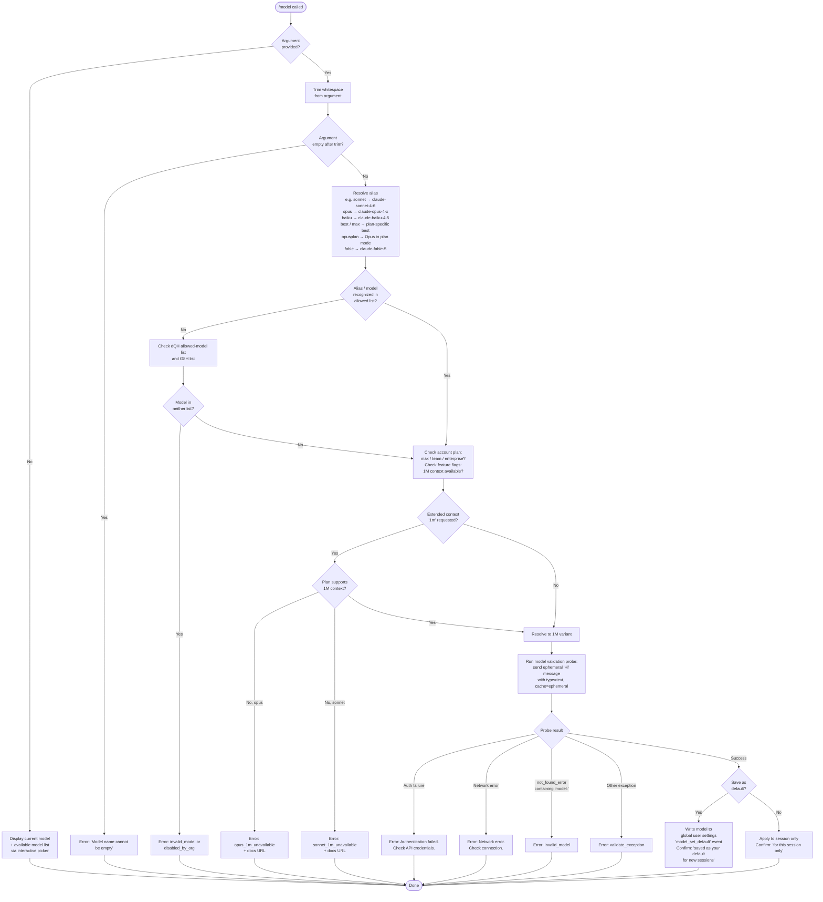

# `/model`

> Analysis basis: CC v2.1.173 bundle.js (AST extraction + Claude interpretation)
> Minimum version: v2.1.173

---

## Overview

The `/model` command lets users change the active AI model for the current Claude Code session. It accepts a model name or short alias as an argument, validates the requested model against the user's account capabilities and plan, and—if permitted—updates the session state (and optionally the user's default configuration). When called without an argument it displays the current model along with a menu of available models.

---

## Registration

| Field | Value |
|---|---|
| type | `local` |
| name | `model` |
| description | Set the AI model for Claude Code |
| argumentHint | `<model>` |
| supportsNonInteractive | `true` |
| module_id | `mOK` |
| load_inline | `true` |
| loc_byte | `12942780` |
| loc_byte_end | `12942954` |
| loc_line | `9147` |
| arbor_handler.name | `vi7` |
| arbor_handler.fqn | `claude-2.1.173::vi7` |
| arbor_handler.kind | `AsyncFunction` |
| arbor_handler.resolution_path | `module_id` |
| arbor_handler.n_hits | `0` |

Analysis basis: CC v2.1.173 bundle.js:+12942780

---

## Input Branching

The handler has five or more distinct execution paths depending on argument presence, model alias resolution, plan/feature-flag eligibility, and extended-context availability. A Mermaid flowchart is required.



---

## Behavioral Spec

### 1. Entry point — Handler `vi7`

Analysis basis: CC v2.1.173 bundle.js:+12911832

```
async function handleModelCommand(args, context):
    rawInput = args.trim()                         // +12911832

    if rawInput is in dQH allowed-model set:       // +12911848
        currentAppState = getAppState()            // +12911871
        result = await selectAndApplyModel(rawInput, currentAppState)
        emit telemetry "tengu_model_command_inline" // +12911990
        return result

    // If not in inline set, fall through to
    // full interactive/non-interactive model-selection flow
    result = await buildModelSelectionUI(rawInput, context)
    return result
```

### 2. Alias resolution — `resolveModelAlias` (Q9)

Analysis basis: CC v2.1.173 bundle.js:+2259351

The function normalises the user-supplied string (trim + lowercase) and maps short tokens to canonical model IDs. Known short aliases found in literals:

| Alias | Resolves to |
|---|---|
| `sonnet` | `claude-sonnet-4-6` (or later) |
| `haiku` | `claude-haiku-4-5` (or later) |
| `opus` | `claude-opus-4-x` (plan-dependent) |
| `best` | Best model available for the plan |
| `max` | Max-tier best model |
| `opusplan` | Opus in plan mode, else Sonnet |
| `fable` | `claude-fable-5` |

```
function resolveModelAlias(rawString):
    s = rawString.trim().toLowerCase()             // +2259351, +2259362
    switch s:
        case "sonnet":  return lookupSonnet()      // +2259532
        case "haiku":   return lookupHaiku()       // +2259571
        case "opus":    return lookupOpus()        // +2259610
        case "best":    return lookupBest()        // +2259645
        case "opusplan":return lookupOpusPlan()    // +2257885
        case "fable":   return "claude-fable-5"   // +2259428
        default:        return s   // treat as literal model ID
    // Formats "[1m]" suffix triggers 1M-context variant  // +2259476
```

### 3. Model list resolution — `buildAvailableModelList` (rO / XB8)

Analysis basis: CC v2.1.173 bundle.js:+2250688

```
function buildAvailableModelList(planInfo):
    baseModels = getConfiguredModels()              // gA call +2250688
    // Normalise IDs: map, trim, lowercase          // +2250765, +2250779
    // Keep only models whose ID starts with
    //   "anthropic." prefix OR "claude-" prefix   // +2250836, +2250849, +2250462

    // Filter by plan tier:
    //   "max" tier          → include max-only models   // +3269224
    //   "team"              → include default_claude_max_5x // +3269295,+3269310
    //   "enterprise" /
    //   "enterprise_usage_based" → extended set          // +3269405,+3269427

    // Append 1M-context variants where eligible:
    //   "sonnet[1m]" / "sonnet-4-6[1m]"                // +12876692,+12876718

    // Known full model IDs in catalog (from literals):
    //   claude-fable-5, claude-mythos-5
    //   claude-opus-4-8, claude-opus-4-7, claude-opus-4-6
    //   claude-opus-4-5, claude-opus-4-1, claude-opus-4-0
    //   claude-sonnet-4-6, claude-sonnet-4-5, claude-sonnet-4-0
    //   claude-3-7-sonnet, claude-3-5-sonnet
    //   claude-haiku-4-5, claude-3-5-haiku

    return filteredModelList
```

### 4. 1M-context eligibility checks — `checkExtendedContextEligibility` (xn7 / un7)

Analysis basis: CC v2.1.173 bundle.js:+12874261

```
function checkOpus1MContextEligibility(resolvedModel, planInfo):
    // If model ID (lowercased) contains "[1m]":
    if not planEligibleFor1M(planInfo):
        raise ModelSwitchError(
            code    = "opus_1m_unavailable",       // +12874293
            message = "Opus with 1M context is not available..."
                      // +12874331 — see docs URL in literal
        )

function checkSonnet1MContextEligibility(resolvedModel, planInfo):
    // Parallel check for sonnet[1m] / sonnet-4-6[1m]
    if not planEligibleFor1M(planInfo):
        raise ModelSwitchError(
            code    = "sonnet_1m_unavailable",     // +12874510
            message = "Sonnet 4.6 with 1M context is not available..."
                      // +12874550 — see docs URL in literal
        )
```

Display suffix ` (1M context)` is appended to the model label when 1M variant is active. Analysis basis: CC v2.1.173 bundle.js:+2258526

### 5. Model validation probe — `validateModelViaProbe` (Wm6)

Analysis basis: CC v2.1.173 bundle.js:+12872112

```
async function validateModelViaProbe(modelId):
    if modelId.trim() == "":
        error("Model name cannot be empty")        // +12872149
        return

    // Check cache first                           // +12872418 c$K.has
    if validationCache.has(modelId):
        return validationCache.get(modelId)

    // Send a minimal ephemeral probe to the API:
    //   role: "user", content: "Hi"              // +12872582
    //   type: "text"                             // +12911899
    //   cache_control: "ephemeral"               // +12872607
    //   (This is a "model_validation" probe)     // +12872513

    try:
        response = await callAPI(modelId, probePayload)
        validationCache.set(modelId, SUCCESS)      // +12872626
        // Fetch available-model list via API      // Xp / Cn7 path
        return SUCCESS

    catch AuthError:
        return error("Authentication failed. Please check your API credentials.")
                                                   // +12872885
    catch NetworkError:
        return error("Network error. Please check your internet connection.")
                                                   // +12872987
    catch APIError where type=="not_found_error"
                   and message contains "model:":
        return error(code="invalid_model")         // +12873106, +12873188, +12875324
    catch Exception:
        return error(code="validate_exception")    // +12875421
```

Validation uses a side-query fetch (`side_query`, +13733657) with a 5-second timeout (5000 ms, +8318820).

### 6. Org-policy and feature-flag blocking — `checkModelAllowed` (XB8 / bH)

Analysis basis: CC v2.1.173 bundle.js:+12874115

```
function checkModelAllowed(modelId, appState):
    // If model is in the "disabled" feature-flag set:
    if featureFlag(modelId) == "disabled":         // +2254733
        raise ModelSwitchError(
            code = "model_switch/not_allowed"      // +12874131,+12874146
        )

    // If org policy disables this model:
    if orgPolicyDisables(modelId):
        raise ModelSwitchError(
            code = "disabled_by_org"               // +12874778
        )

    // If model status is "absent":
    if modelStatus(modelId) == "absent":           // +2254821
        raise error("That model ...")              // +2254850
```

### 7. Post-validation confirmation and persistence — `applyAndConfirmModel` (uOA / Gm6 / mOA)

Analysis basis: CC v2.1.173 bundle.js:+12875606

```
async function applyAndConfirmModel(resolvedModelId, saveAsDefault, appState):
    // Update in-memory app state model field
    appState.model = resolvedModelId               // +12876212

    if saveAsDefault:
        // Persist to global user settings.json
        writeGlobalConfig({ model: resolvedModelId })
        emit event "model_set_default"             // +12876165
        confirm(" and saved as your default for new sessions") // +12875807
    else:
        confirm(" for this session only")          // +12875853

    // Display fast-mode annotation if applicable:
    //   " · Fast mode ON"                        // +12875971
    //   " · Draws from usage credits"            // +12876022
    //   " · Fast mode OFF"                       // +12876068

    // Display "Managed settings" label if
    //   the model is locked by org policy        // +12876374
```

### 8. Bootstrap model discovery — `bootstrapModelFetch` (s_6 / MtL)

Analysis basis: CC v2.1.173 bundle.js:+8319997

This sub-system fetches the authoritative model list from the Anthropic API at startup or on first `/model` invocation.

```
async function bootstrapModelFetch(config):
    if gatewayDiscoveryDisabled:
        log("[Bootstrap] Skipped gateway /v1/models...")  // +8318311
        return cachedList

    if nonessentialTrafficDisabled:
        log("[Bootstrap] Skipped: Nonessential traffic disabled") // +8318466

    if thirdPartyProvider:
        log("[Bootstrap] Skipped: 3P provider")    // +8318557
        return

    log("[Bootstrap] Fetching")                    // +8318619
    // HTTP GET with headers:
    //   Content-Type: application/json            // +8318704,+8318719
    //   User-Agent: <version string>              // +8318738
    //   anthropic-beta: <flag>                    // +8319235
    //   x-api-key: <token>                        // +8319691
    // Timeout: 5000 ms                            // +8318820

    try:
        response = await fetch(endpoint, options)
        if cacheUnchanged:
            log("[Bootstrap] Cache unchanged, skipping write") // +8320305
        else:
            log("[Bootstrap] Cache updated, persisting to disk") // +8320361
            persistCacheToDisk()

    catch AxiosError where status in [401,403,429]: // +180035,+180044,+180053
        emit telemetry "api_bootstrap_fetch/parse_failed" // +8318941,+8318963
        handle auth/rate-limit error
```

### 9. Configuration persistence — `writeUserConfig` (AA)

Analysis basis: CC v2.1.173 bundle.js:+1314265

```
function writeUserConfig(newSettings):
    // Merge into layered config system:
    //   policySettings   (org-managed, read-only) // +1314203
    //   flagSettings                               // +1314225
    //   userSettings     → ~/.claude/settings.json // +1314849,+1296226,+1296236
    //   projectSettings  → .claude/settings.json   // +1314964
    //   localSettings    → .claude/settings.local.json // +1314987,+1296298

    // Guard: re-read config before write.
    // If re-read is missing auth that cache holds,
    // refuse to write (prevents auth loss).        // +3309463
    emit telemetry "tengu_config_auth_loss_prevented" on guard trigger // +3309591
```

---

## State & Side Effects

| Item | Detail |
|---|---|
| Telemetry: tengu_model_command_inline | Fired when a model is set via inline/non-interactive argument path (bundle.js:+12911990) |
| Telemetry: tengu_feature_bad | Fired on feature-flag check failure during model probe (bundle.js:+1016336) |
| Telemetry: tengu_feature_ok | Fired on successful feature-flag check (bundle.js:+1016269) |
| Telemetry: tengu_lone_surrogate_sanitized | Fired when lone surrogates are cleaned from API response text (bundle.js:+13734985) |
| Telemetry: tengu_api_success | Fired on successful API response from model validation or side-query (bundle.js:+13735236) |
| Telemetry: tengu_config_auth_loss_prevented | Fired if config write is aborted to prevent auth data loss (bundle.js:+3309591) |
| appState changes | `model` field updated to new resolved model ID (bundle.js:+12876212) |
| Persistent config | When confirmed as default: writes `model` key to `~/.claude/settings.json` (bundle.js:+12876165, +1296236) |
| Validation cache | `c$K` Map caches probe results to avoid re-validating the same model ID (bundle.js:+12872418, +12872626) |
| Side-query fetch | Minimal "Hi" probe with ephemeral cache control sent to API to validate model access (bundle.js:+12872513) |
| Bootstrap fetch | On first use, fetches `/v1/models` from Anthropic API with 5-second timeout (bundle.js:+8318820) |
| Sound | None detected |
| Hook registration | None detected in depth-2 traversal |

---

## Version History

| Version | Change |
|---|---|
| v2.1.173 | Initial analysis |

---

## Common Mistakes

1. **Providing a bare version number** — e.g. `/model 4.6` — without the full prefix (`claude-sonnet-4-6`). Use a recognized alias (`sonnet`, `opus`, `haiku`) or the full canonical ID instead.
2. **Expecting 1M context on all plans** — `opus[1m]` and `sonnet[1m]` (or `sonnet-4-6[1m]`) require specific plan entitlements. Using these aliases on an ineligible plan triggers `opus_1m_unavailable` or `sonnet_1m_unavailable` errors with a documentation link.
3. **Confusing session-only vs. permanent changes** — `/model` without confirming "save as default" only changes the model for the current session. Restart without persisting and the previous default resumes.
4. **Using a model blocked by org policy** — Administrators can disable specific models via managed settings. These models will be rejected with `disabled_by_org` regardless of plan eligibility.
5. **Calling `/model` with an empty string argument** — In non-interactive pipelines passing an empty string (after trimming) triggers an immediate `"Model name cannot be empty"` error rather than showing the picker.
6. **Assuming all `claude-*` models are always available** — The bootstrap discovery step may skip the `/v1/models` API call (and fall back to the bundle's built-in list) when gateway discovery is not enabled (`CLAUDE_CODE_ENABLE_GATEWAY_MODEL_DISCOVERY` not set, bundle.js:+8318311).

---

## Appendix — Identifier Mapping

> For bundle debugging only. Identifiers change across versions.

| Identifier | Role |
|---|---|
| `vi7` | Main handler for `/model` command (AsyncFunction, Arbor-resolved) |
| `H` | Generic utility / string helper (also `setTimeout` caller in random-delay path) |
| `_` | App-state / config accessor |
| `PB8` | Model selection orchestrator (delegates to `cR` and app-state accessor) |
| `cR` | Model-list builder coordinator (calls `_j6` and `eG`) |
| `_j6` | Inner model-list constructor (calls `S3` / `Q9`) |
| `S3` | Model entry formatter (calls `MLH`) |
| `Q9` | Alias-to-model-ID resolver |
| `eG` | Extended model-info/plan decorator |
| `TA` | Plan-tier helper (max/team/enterprise branching) |
| `L_H` | "max" plan model filter |
| `SDH` | "team" / `default_claude_max_5x` plan filter |
| `ilH` | "enterprise" / `enterprise_usage_based` plan filter |
| `FP` | `firstParty` model-source checker |
| `aD6` | Model-ID string replacement utility |
| `Zj` | Model metadata renderer (uses `c_`, `NL`, `v7`) |
| `v7` | Model display-name formatter (uses `c_`) |
| `c_` | Low-level string/content renderer |
| `NL` | Multi-field model label builder |
| `kE` | Model display entry builder |
| `c` | General logging / output helper |
| `Y3` | SHA-256 model-ID hasher (prefix generation) |
| `aZ` | Async utility bootstrap |
| `q56` | Promise utility |
| `n$K` | Top-level model-selection UI orchestrator |
| `XB8` | Model-list fetcher and eligibility checker |
| `rO` | Available-model list builder / normaliser |
| `A` | Model array iterator / lowercaser |
| `HW` | Model-ID string replacer |
| `M` | Config map accessor (get/values/set) |
| `K` | Model-column padder for display |
| `q` | Data cache / Set (add/delete) |
| `J_8` | Object-entries iterator utility |
| `f` | Async set with finally-cleanup |
| `clH` | `jz4` inclusion checker |
| `sZ1` | Model-list index-of searcher |
| `Jz4` | Model-ID inclusion checker (calls `tc` / `Q9`) |
| `tc` | `lNH` inclusion checker (allowed-model set) |
| `Xz4` | Extended model-ID variant resolver (1M suffix) |
| `bH` | Feature-flag checker (tengu_feature_ok / tengu_feature_bad) |
| `A6` | Feature-flag lookup helper |
| `xn7` | Opus 1M context eligibility checker |
| `aa` | Opus 1M model formatter |
| `un7` | Sonnet 1M context eligibility checker |
| `yLH` | Sonnet 1M model formatter |
| `wY_` | Per-model availability status resolver |
| `wL` | Model status helper (`Y_8` call) |
| `dA8` | Model alias lower-case normaliser |
| `kDH` | Array-shape checker (`Array.isArray`) |
| `fLH` | Fallback model-status resolver |
| `j1` | Model entry constructor (uses `J_8`, `DJ`, `eo8`, `R3`) |
| `MLH` | Model-label builder with `(1M context)` suffix |
| `Wm6` | Model validation probe orchestrator |
| `Xp` | Side-query API caller (fetch, timing, telemetry) |
| `Cn7` | Post-validation model-list refresh (`bn7` / `String`) |
| `l$K` | Lower-case model-ID normaliser for lookup |
| `s_6` | Bootstrap model-discovery controller |
| `MtL` | Core bootstrap API fetch implementation |
| `kH` | Bootstrap logging / output helper |
| `b6` | Config persistence with timestamp |
| `v$q` | Bootstrap cache comparator |
| `N` | Log-level / debug formatter |
| `E8` | Config save with auth-loss guard |
| `Gz` | Bootstrap retry/cleanup helper |
| `SH` | Global config writer (error-safe) |
| `EH` | String coercion utility |
| `uOA` | Model confirmation and persistence UI builder |
| `NfH` | Model-name display helper |
| `Gm6` | "Save as default" path coordinator |
| `AA` | Full config read/write with layered merge |
| `Mf` | Markdown/text renderer |
| `f6` | String primitive coercer |
| `hDH` | Fast-mode annotation helper |
| `w3` | Model metadata string builder |
| `PTH` | Model-display string with plan annotation |
| `hY` | Plan-usage-credit annotation |
| `NY` | Display component builder (`$LH`) |
| `mOA` | "Managed settings" display renderer |
| `_NH` | Settings path resolver (`Bv` / `x8`) |
| `x8` | Config-path resolver (`oa6` / `VB`) |
| `Uu` | `.claude` directory path joiner |
| `_l` | Model-entry line renderer (`tc`, `S3`, `Q9`) |