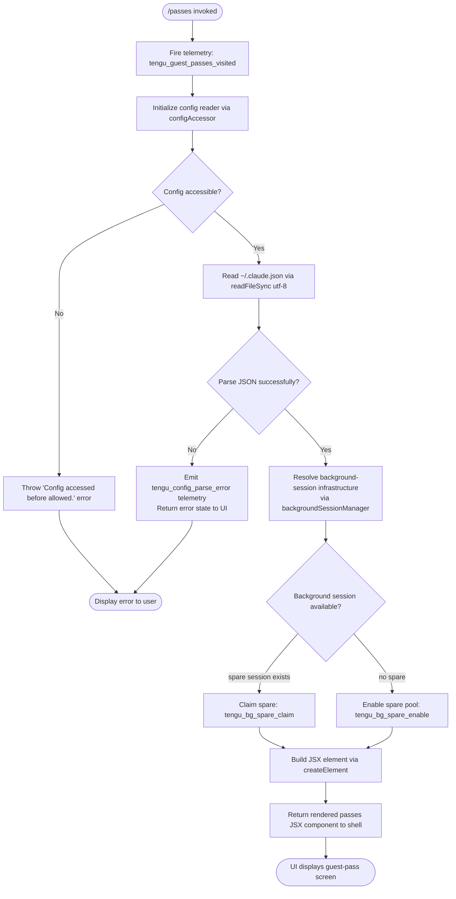

# `/passes`

> Analysis basis: CC v2.1.173 bundle.js (AST extraction + Claude interpretation)
> Minimum version: v2.1.173

---

## Overview

The `/passes` command allows users to share a free week of Claude Code with friends by presenting a guest-pass interface rendered as a JSX component. It is a hidden UI command that launches a dedicated React view (type `local-jsx`) and fires a telemetry event (`tengu_guest_passes_visited`) immediately on activation. The command's handler (`rd7`) coordinates config access, background-session infrastructure, and the JSX rendering pipeline to produce the passes UI.

---

## Registration

| Field | Value |
|---|---|
| type | `local-jsx` |
| name | `passes` |
| description | `Share a free week of Claude Code with friends` |
| isHidden | `null` (not hidden) |
| module_id | `t7K` |
| load_inline | `true` |
| loc_byte | `12673067` |
| loc_byte_end | `12673389` |
| loc_line | `8901` |
| arbor_handler.name | `rd7` |
| arbor_handler.kind | `AsyncFunction` |
| arbor_handler.fqn | `claude-2.1.173::rd7` |
| arbor_handler.resolution_path | `module_id` |
| arbor_handler.n_hits | `2` |

Analysis basis: CC v2.1.173 bundle.js:+12673067 – +12673389

---

## Input Branching

The command takes no direct user text input. Its branching is determined by internal state (config readiness, background-session availability) rather than parsed arguments. Three or more distinct internal code paths are present, so a Mermaid flowchart is used.



Analysis basis: CC v2.1.173 bundle.js:+12672750 (handler entry), +12672888 (config branch), +12672939 (JSX render), +12672890 (telemetry fire)

---

## Behavioral Spec

### Top-level Handler (`rd7`)

```
async function passesCommandHandler(context):
    emit telemetry("tengu_guest_passes_visited")

    configData = await readConfigSafe()        // via configFileReader
    bgSession  = await resolveBackgroundSession()  // via backgroundSessionManager

    element = createElement(PassesView, {
        config:    configData,
        bgSession: bgSession,
    })
    return element
```

Analysis basis: CC v2.1.173 bundle.js:+12672750

---

### Config File Access (`configFileReader` / `G7H`)

```
function readConfigSafe(configPath):
    if not configAccessGuardPassed():
        throw Error("Config accessed before allowed.")

    raw = fs.readFileSync(configPath, "utf-8")
    parsed = jsonParse(raw)                    // via safeJsonParser

    if parsed.error.code == "ENOENT":
        return defaultConfig()

    if parsed.error.code == "EEXIST":
        emit telemetry("tengu_config_parse_error")

    backupDir = pathJoin(configDir, "backups")
    ensureBackupDir(backupDir)
    copyCurrentToBackup(configPath, backupDir, Date.now())

    return parsed.value
```

Analysis basis: CC v2.1.173 bundle.js:+3314437 (guard error), +3314499 (readFileSync), +3314526 (utf-8 encoding), +3314546 (JSON parse), +3314673 (ENOENT handling), +3315074 (telemetry), +3315582 (copyFileSync backup)

---

### Config Lock / Save Path (`configLockManager` / `Q78`)

```
function saveConfigWithLock(configPath, newValue):
    acquireLock(configPath)       // may emit tengu_config_lock_contention
    reread = readConfigFromDisk(configPath)

    if reread is missing auth that cache holds:
        emit telemetry("tengu_config_auth_loss_prevented")
        emit warning("saveConfigWithLock: re-read config is missing auth …")
        releaseLock()
        return

    if writeWouldBeStale(reread, newValue):
        emit telemetry("tengu_config_stale_write")

    atomicWrite(configPath, newValue, permissions=384)
    releaseLock()
```

Analysis basis: CC v2.1.173 bundle.js:+3312410 (lock contention message), +3312499 (tengu_config_lock_contention), +3312635 (tengu_config_stale_write), +3312826 (auth-loss message), +3312978 (tengu_config_auth_loss_prevented), +3313711 (permission constant 384)

---

### Background Session Manager (`backgroundSessionManager` / `D`)

```
async function backgroundSessionManager(options):
    freeMem = os.freemem()
    if freeMem is below threshold:
        emit telemetry("tengu_bg_dispatch_low_mem")
        return lowMemResponse()

    spareEnabled = checkSparePool()
    if spareEnabled:
        emit telemetry("tengu_bg_spare_enable")

    session = claimSpareSession()           // via spareSessionClaimer
    if session:
        emit telemetry("tengu_bg_spare_claim")
    else:
        emit telemetry("tengu_bg_spare_claim_fail")
        session = spawnNewSession()         // via Hd.spawn

    trackSession(session)
    return session
```

Analysis basis: CC v2.1.173 bundle.js:+16761015 (freemem check), +16761185 (tengu_bg_dispatch_low_mem), +16761889 (tengu_bg_spare_enable), +16762017 (tengu_bg_spare_claim), +16762283 (tengu_bg_spare_claim_fail), +16762346 (Hd.spawn)

---

### Spare Session Claimer (`spareSessionClaimer` / `Q0A`)

```
async function claimSpareSession(spareDescriptor):
    result = Hd.claim(spareDescriptor)
    if claim fails:
        emit telemetry("tengu_bg_sendclaim_failed")
        return null

    socket = Nn8.connect(result.socketAuth)
    socket.on("kill",    handleKill)
    socket.on("SIGTERM", handleTerm)
    socket.once("done",  onDone)
    socket.write(controlPayload)
    return socket
```

Analysis basis: CC v2.1.173 bundle.js:+16739276 (Hd.claim), +16739477 (tengu_bg_sendclaim_failed), +16739624 (Nn8.connect), +16739704 (kill event), +16739715 (SIGTERM event), +16739728 (L.end)

---

### Background Session File Watcher (`backgroundSessionWatcher` / `Zx4`)

```
function watchBackgroundSessionFile(filePath, callback):
    U78.watchFile(filePath, watchHandler)

    function watchHandler(currentStat, previousStat):
        if file changed:
            newContent = readAndParseContent(filePath)   // via contentParser
            callback(newContent)
        else if file removed:
            U78.unwatchFile(filePath)
            callback(null)

    registerCleanup(filePath)   // via cleanupRegistry
```

Analysis basis: CC v2.1.173 bundle.js:+3310695 (watchFile), +3311028 (unwatchFile), +3311015 (y9 cleanup register)

---

### Background Process Attach (`bgProcessAttach` / `p05`)

```
function bgProcessAttach(sessionId, options):
    job = lookupJob(sessionId)
    if not job:
        throw { code: "ENOJOB", message: "job not found — it may have already exited" }

    state = job.state
    switch state:
        case "starting":
            display("Session is starting — it will appear once ready. Ctrl+Z to detach")
            waitForReady(timeout=500ms, maxRetries=6)
        case "in-progress":
            display("job is restarting on the updated Claude Code; retry attach")
            throw { code: "ERESPAWNING" }
        case "adopted":
            attach directly
        default:
            if attachKeyMismatch:
                throw "attach rejected: the presented daemon control key doesn't match …"
            emit telemetry("tengu_bg_attach")
            connectToSession(job.socket)
```

Analysis basis: CC v2.1.173 bundle.js:+16749070 (ENOJOB message), +16749125 (ENOJOB code), +16752099 (in-progress state), +16752138 (ERESPAWNING message), +16752578 (maxRetries=6), +16752656 (timeout=500), +16752942 (starting state), +16752974 (adopted state), +16752455 (tengu_bg_attach), +16752999 (starting message)

---

### JSX Render Phase (`createElement`)

```
function renderPassesView(configData, bgSession):
    element = d$A.createElement(PassesView, {
        config:    configData,
        bgSession: bgSession,
    })
    return element
```

Analysis basis: CC v2.1.173 bundle.js:+12672939 (d$A.createElement call)

---

## State & Side Effects

| Item | Detail |
|---|---|
| Telemetry | `tengu_guest_passes_visited` (fired on every invocation, bundle.js:+12672890) |
| Telemetry | `tengu_config_parse_error` (config JSON invalid, bundle.js:+3315074) |
| Telemetry | `tengu_config_lock_contention` (lock wait exceeded, bundle.js:+3312499) |
| Telemetry | `tengu_config_stale_write` (stale write detected, bundle.js:+3312635) |
| Telemetry | `tengu_config_auth_loss_prevented` (auth guard triggered, bundle.js:+3312978) |
| Telemetry | `tengu_bg_dispatch_low_mem` (low free memory at dispatch, bundle.js:+16761185) |
| Telemetry | `tengu_bg_spare_enable` (spare pool activated, bundle.js:+16761889) |
| Telemetry | `tengu_bg_spare_claim` (spare session claimed successfully, bundle.js:+16762017) |
| Telemetry | `tengu_bg_spare_claim_fail` (spare claim failed, bundle.js:+16762283) |
| Telemetry | `tengu_bg_sendclaim_failed` (socket claim to daemon failed, bundle.js:+16739477) |
| Telemetry | `tengu_bg_dispatch_sigkill_escalate` (SIGKILL escalation during dispatch, bundle.js:+16760584) |
| Telemetry | `tengu_bg_attach` (attach to background session, bundle.js:+16752455) |
| Telemetry | `tengu_bg_attach_stall_gave_up` (attach stalled, gave up, bundle.js:+16753378) |
| Telemetry | `tengu_bg_attach_stall_respawn` (attach stalled, triggered respawn, bundle.js:+16753648) |
| Telemetry | `tengu_bg_attach_kick` (existing attacher kicked, bundle.js:+16754598) |
| Telemetry | `tengu_bg_attach_legacy_autorespawn` (legacy client auto-respawn, bundle.js:+16751297) |
| Telemetry | `tengu_bg_proto_mismatch` (protocol version mismatch, bundle.js:+16747275) |
| Telemetry | `tengu_bg_dispatch_stale_drop` (stale dispatch dropped, bundle.js:+16748643) |
| Telemetry | `tengu_bg_low_mem_mb` (low memory metric, bundle.js:+13267233) |
| Telemetry | `tengu_scheduled_task_missed` (background scheduled task missed, bundle.js:+16260900) |
| Telemetry | `tengu_feature_ok` / `tengu_feature_bad` (feature flag check result, bundle.js:+1016269, +1016336) |
| Config file | Reads `~/.claude.json` (utf-8); writes back under file lock with atomic rename; backs up to `~/.claude/backups/` on parse error |
| File system | Creates backup directory (`backups/`) if missing; copies current config before overwriting; uses `mkdirSync`, `copyFileSync`, `readdirStringSync` |
| Background session | May spawn a new background PTY session (`Hd.spawn`) or claim a spare from the pool |
| File watcher | Registers a `watchFile` listener on the session file; unregisters on removal |
| Process | Escalates to SIGKILL if background process does not respond within timeout (30–15 s thresholds, bundle.js:+16760539, +16760550) |
| Hook registration | `y9` registers a cleanup hook via `yZA.register` (bundle.js:+63751) |
| appState changes | Returns a JSX element; the shell renders it in place of the normal REPL output |
| Sound | None detected in depth-2 traversal |

---

## Version History

| Version | Change |
|---|---|
| v2.1.173 | Initial analysis |

---

## Common Mistakes

1. **Treating `/passes` as a hidden command**: The registration has `isHidden: null`, meaning it is _not_ hidden and is intentionally user-visible. Do not suppress it from help output.
2. **Confusing the command type**: This is `local-jsx`, not `prompt` or `tool`. It renders a React component rather than sending a text prompt to the model. There is no prompt body.
3. **Assuming synchronous config access**: The handler (`rd7`) is an `AsyncFunction`. The config guard (`configAccessGuard`) must have resolved before file I/O proceeds; calling from a synchronous context will throw `"Config accessed before allowed."`.
4. **Overlooking the backup mechanism**: On a config parse error, the command does _not_ simply fail — it preserves the current config file by copying it into the `backups/` directory before any write operation. Tests or integrations that mock the file system must account for this `copyFileSync` call.
5. **Ignoring low-memory path**: On systems with very low free RAM the background-session dispatch is short-circuited and the passes UI may not fully initialize. The `tengu_bg_dispatch_low_mem` event is the signal.
6. **Assuming a stable obfuscated identifier (`rd7`)**: The Arbor resolution reports `n_hits: 2`, meaning the symbol appears at two call sites. Identifier names change across bundle versions; use the `fqn` (`claude-2.1.173::rd7`) only when pinned to this exact version.

---

## Appendix — Identifier Mapping

> For bundle debugging only. Identifiers change across versions.

| Identifier | Role |
|---|---|
| `rd7` | Top-level async handler for `/passes` command (Arbor: `claude-2.1.173::rd7`) |
| `b6` | Background-session orchestrator (coordinates watcher + spawner) |
| `o6` | Path/OS utilities accessor |
| `PZ_` | Platform detection helper |
| `G7H` | Config file reader (reads, parses, backs up `~/.claude.json`) |
| `q` | Node `fs` module proxy (readFileSync, statSync, mkdirSync, etc.) |
| `$1` | Process bootstrap / entry shim |
| `n6` | Safe JSON parser wrapper (`JSON.parse` with error handling) |
| `bu` | String prefix/slice utility (used on auth token strings) |
| `H` | Random/timer utilities (`Math.random`, `setTimeout`) |
| `_` | Virtual filesystem / in-memory FS abstraction (`readdirStringSync`, `statSync`) |
| `N8` | Logger / notification emitter |
| `C_9` | Directory listing helper (reads backup dir, filters entries) |
| `GZ_` | Path join helper (wraps `WD.join` + base path resolution) |
| `M` | Module registry / feature-flag map |
| `$` | Feature-flag resolver |
| `N` | Config content normalizer / formatter |
| `d8f` | Config schema transformer |
| `CH` | JSON stringifier wrapper |
| `lf` | Config field redactor (replaces sensitive values with `[REDACTED]`) |
| `oFH` | Telemetry value transformer |
| `i8f` | Config file writer (atomic write with `Buffer.byteLength` size check) |
| `c` | Generic error constructor / logger |
| `D` | Background session lifecycle manager (spawn, claim, kill, monitor) |
| `A` | Active-session map (lowercased keys) |
| `b` | Background worker runner (schedules tasks, manages PTY workers) |
| `d8` | Timeout/abort helper (`setTimeout`, `clearTimeout`, abort signal) |
| `bH` | Feature flag "ok" reporter (`tengu_feature_ok`) |
| `kH` | Feature flag "bad" reporter (`tengu_feature_bad`) |
| `kF8` | macOS memory-pressure checker |
| `i06` | Config file async reader (reads + validates array structure) |
| `SH` | Session log aggregator / error logger |
| `Q` | Background PTY process wrapper (connect, destroy, kill, reconnect) |
| `Y6` | Background session registry (tracks live sessions by ID) |
| `Q0A` | Spare-session claimer (claims pre-warmed session from daemon) |
| `r0A` | Background job runner (manages job lifecycle, roster, cleanup) |
| `f` | Pending-operation tracker (add/delete/finally) |
| `Y` | Forced-shutdown handler (`process.exit`, abort signal) |
| `A6` | App initializer / startup sequencer |
| `B` | Disposable resource manager |
| `Zx4` | Background session file watcher (`watchFile`/`unwatchFile`) |
| `wF` | Watch-event filter/debouncer |
| `y9` | Cleanup-hook registrar (`yZA.register`) |
| `Qp8` | Pre-render hook / context builder for JSX component |
| `e4` | React context provider wrapper |
| `Uw` | Shell / REPL context assembler |
| `O7` | CLI argument parser (`--bare` flag handler) |
| `vj` | Auth profile selector (`profile-implicit`, `user_oauth`) |
| `B4` | First-party credential handler (`firstParty`) |
| `NP` | Network policy enforcer |
| `$O` | Auth initializer (checks env vars, selects auth strategy) |
| `D26` | Auth-state builder |
| `VrH` | Auth-value formatter |
| `E8` | Config save coordinator (global config writer) |
| `Q78` | Config lock manager (atomic save with backup, lock contention detection) |
| `UV1` | Lock file utilities (`lY_` + `Object.assign`) |
| `lY_` | Lock primitive (`pV1`-based mutex) |
| `urH` | Config merge helper |
| `V` | Config entry iterator (filters `.backup.` files) |
| `P` | IPC message framer (`Buffer.concat`, `indexOf`, reply/kill) |
| `X` | Socket timeout manager |
| `j` | Session killer (iterates active sessions, sends kill) |
| `I7` | IPC channel closer (`H.end`, `CH`) |
| `p05` | Background PTY daemon message dispatcher (main daemon protocol handler) |
| `EH` | String coercer (`String()`) |
| `E` | Scroll/viewport bounds calculator (`Math.max`, `Math.min`) |
| `W` | SDK connection manager (connect, disconnect, reconnect) |
| `Cz6` | Atomic file writer (temp file + rename, fchmod, fsync) |
| `O` | Symbolic-link checker (`m8` background session descriptor) |
| `R8` | Error code normalizer (`N8`) |
| `L` | Socket/stream lifecycle manager (close, write, finalize) |
| `AJH` | Config migration helper |
| `R_9` | Config entry enumerator (`Object.entries`) |
| `u26` | Timestamp helper (`Date.now`) |
| `g78` | Global config writer (saves with backup, uses `Cz6` atomic writer) |