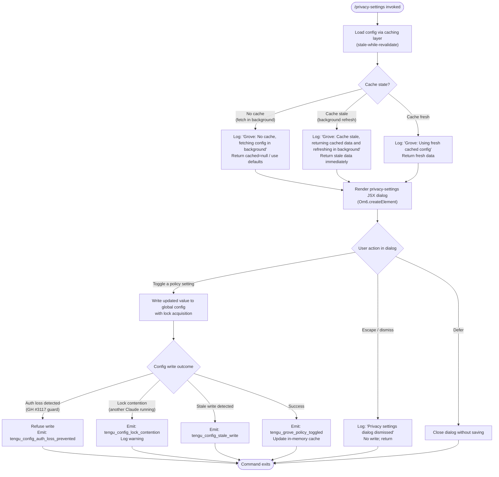

# `/privacy-settings`

> Analysis basis: CC v2.1.172 bundle.js (AST extraction + Claude interpretation)
> Minimum version: v2.1.172

---

## Overview

`/privacy-settings` opens an interactive JSX dialog that allows users to view and modify their privacy-related configuration preferences within Claude Code. The command resolves the current privacy settings state by loading configuration (using a stale-while-revalidate cache strategy), renders a React-based UI component, and persists any user-initiated changes back to the global config store, emitting a `tengu_grove_policy_toggled` telemetry event when a setting is toggled.

---

## Registration

| Field | Value |
|---|---|
| type | `local-jsx` |
| name | `privacy-settings` |
| description | `View and update your privacy settings` |
| loc_byte | `12683919` |
| loc_byte_end | `12684111` |
| module_id | `_5K` |
| load_inline | `true` |
| arbor_handler.name | `ad7` |
| arbor_handler.fqn | `claude-2.1.172::ad7` |
| arbor_handler.kind | `AsyncFunction` |
| arbor_handler.resolution_path | `module_id` |
| arbor_handler.n_hits | `0` |

Analysis basis: CC v2.1.172 bundle.js:+12683919

---

## Input Branching

The handler exhibits four or more distinct branching paths based on config cache state, user interaction outcome, and whether a policy toggle actually changes a value. A Mermaid flowchart is used.



Analysis basis: CC v2.1.172 bundle.js:+12682912, +12683075, +12683089, +12683100, +7377530, +7377650, +7377756

---

## Behavioral Spec

### 1. Handler Entry — `privacySettingsHandler` (`ad7`)

The command's main handler is the async function `ad7`, resolved by Arbor via the `module_id` path (`_5K`).

```
async function privacySettingsHandler(context):
    // Await parallel resolution of config and UI prerequisites
    await Promise.all([
        loadConfigWithCache(context),   // H86
        resolveUIState(context)         // XWH
    ])

    // Retrieve current privacy settings from resolved config
    currentSettings = getPrivacySettingsFromConfig(context)  // M

    // Build and render the JSX dialog component
    dialog = createElement(PrivacySettingsDialog, {
        settings: currentSettings,
        onToggle: handlePolicyToggle,
        onDismiss: handleDismiss
    })  // Om6.createElement

    // Register escape-key and defer-key bindings
    registerKeyBinding("escape", handleDismiss)  // literal: "escape"
    registerKeyBinding("defer",  handleDefer)    // literal: "defer"

    result = await renderAndWaitForUserAction(dialog)

    if result.dismissed:
        log("Privacy settings dialog dismissed")  // literal at +12683100
        return

    if result.deferred:
        return

    // User toggled a setting
    await applyPrivacyPolicyChange(result.changedSettings)  // $6 → _56
    emit("tengu_grove_policy_toggled")
```

Analysis basis: CC v2.1.172 bundle.js:+12682912, +12682952, +12682965, +12683169, +12683453, +12683516, +12683566

---

### 2. Config Loading with Stale-While-Revalidate Cache — `configLoader` (`H86`)

The config fetch layer uses a Grove-style caching strategy (stale-while-revalidate). Three cache outcomes are possible; in all cases a usable value is returned synchronously.

```
function configLoader(context):
    cachedEntry = readConfigCache()   // b6

    if cachedEntry is null:
        log("Grove: No cache, fetching config in background (dialog skipped this session)")
        // literal at +7377530
        triggerBackgroundFetch()
        return defaultPrivacySettings()

    if isCacheStale(cachedEntry, Date.now()):
        log("Grove: Cache stale, returning cached data and refreshing in background")
        // literal at +7377650
        scheduleBackgroundRefresh()
        return cachedEntry.data

    log("Grove: Using fresh cached config")   // literal at +7377756
    return cachedEntry.data
```

Analysis basis: CC v2.1.172 bundle.js:+7377504, +7377528, +7377610

---

### 3. Config Read from Disk — `configFileReader` (`W7H`)

The underlying config-file reader enforces access order, guards against pre-init access, and handles file-not-found gracefully.

```
function configFileReader(path):
    if accessBeforeAllowed:
        throw Error("Config accessed before allowed.")  // literal at +3314076

    try:
        raw = fs.readFileSync(path, "utf-8")  // literals: "utf-8" at +3314159
        parsed = parseJSON(raw)
        return parsed
    catch err if err.code == "ENOENT":   // literal at +3314306
        return null
    catch err:
        emit("tengu_config_parse_error")  // +3314707
        logError("error", err)            // literal "error" at +3314627
        return null
```

Analysis basis: CC v2.1.172 bundle.js:+3314076, +3314132, +3314159, +3314707

---

### 4. Config Write with Lock — `saveConfigWithLock` (`F78` / `E8`)

Writes to the config file are serialized using a file-based lock, with backup rotation and an auth-preservation guard (GitHub issue #3117).

```
async function saveConfigWithLock(newConfig):
    acquireLock()   // W7H

    // Check for lock contention
    if lockTookTooLong:
        emit("tengu_config_lock_contention")
        log("Lock acquisition took longer than expected - another Claude instance may be running")
        // literal at +3312043

    // Re-read config from disk before writing (stale-check)
    diskConfig = configFileReader(configPath)

    // Auth-loss guard: refuse to overwrite if disk copy lost auth tokens that cache has
    if cacheHasAuth AND diskConfigMissingAuth:
        emit("tengu_config_auth_loss_prevented")
        log("saveConfigWithLock: re-read config is missing auth that cache has; refusing to write ...")
        // literal at +3312459
        return

    // Rotate backups (keep last 5, max 60 000 ms age)
    rotateBackups(configPath, maxBackups=5, maxAge=60000)
    // literals at +3313062, +3312813

    // Write atomically
    writeFileAtomically(configPath, newConfig)
    emit("tengu_config_stale_write") if staleCondition   // +3312268
```

Analysis basis: CC v2.1.172 bundle.js:+3312043, +3312130, +3312193, +3312268, +3312459, +3312611, +3313062, +3312813

---

### 5. Privacy Policy Toggle Application — `applyPolicyChange` (`$6` → `_56`)

```
function applyPolicyChange(changedSettings, context):
    // Merge changed keys into current settings snapshot
    updated = Object.assign({}, currentSettings, changedSettings)

    // Persist using locked write path (saveConfigWithLock)
    saveConfigWithLock(updated)

    // Update in-memory cache entry
    updateConfigCache(updated)

    // Emit telemetry
    emit("tengu_grove_policy_toggled")
    // +12683455
```

Analysis basis: CC v2.1.172 bundle.js:+12683453, +12683516, +12683519

---

### 6. Error Fallback — Unable to Retrieve Settings

If config loading fails entirely (e.g., parse error after disk corruption), the string literal `"Unable to retrieve updated privacy settings"` (at +12683226) is surfaced to the user and the dialog is not shown.

```
function handleConfigLoadFailure():
    displayError("Unable to retrieve updated privacy settings")
    // literal at +12683226
    return
```

Analysis basis: CC v2.1.172 bundle.js:+12683226

---

## State & Side Effects

| Item | Detail |
|---|---|
| Telemetry — `tengu_grove_policy_toggled` | Fired when the user successfully changes a privacy policy value (bundle.js:+12683455) |
| Telemetry — `tengu_config_parse_error` | Fired when the on-disk config JSON cannot be parsed (bundle.js:+3314707) |
| Telemetry — `tengu_config_lock_contention` | Fired when file lock acquisition is slower than expected (bundle.js:+3312132) |
| Telemetry — `tengu_config_stale_write` | Fired when a stale-write condition is detected before persisting (bundle.js:+3312268) |
| Telemetry — `tengu_config_auth_loss_prevented` | Fired when a write is refused because it would erase auth tokens (bundle.js:+3312611) |
| Telemetry — `tengu_mcp_oauth_flow_start` | Reachable via deep MCP config paths in the same call graph (bundle.js:+6500103) |
| Telemetry — `tengu_mcp_oauth_flow_success` | Reachable via deep MCP config paths (bundle.js:+6505089) |
| Telemetry — `tengu_mcp_oauth_flow_error` | Reachable via deep MCP config paths (bundle.js:+6506800) |
| Telemetry — `tengu_daemon_config_reload` | Fired when the daemon detects a config reload event (bundle.js:+16775429) |
| Telemetry — `tengu_mcp_skills` | Fired during MCP skill enumeration reached via config load (bundle.js:+6607177) |
| Config file write | Writes to `~/.claude.json` (global config) via locked, atomic write with backup rotation |
| Backup rotation | Up to 5 backup files; entries older than 60 000 ms are pruned (bundle.js:+3312813, +3313062) |
| Key bindings | Registers `"escape"` and `"defer"` key handlers for the dialog lifetime |
| JSX render | Uses `Om6.createElement` to render the dialog; command type is `local-jsx` |
| Auth-loss guard | Refuses any write that would remove auth tokens present in the cache (GH #3117) |
| Sound | <!-- TODO: not found in depth-2 traversal; needs --depth 4 --> |
| appState changes | In-memory config cache is updated on successful write |

---

## Version History

| Version | Change |
|---|---|
| v2.1.172 | Initial analysis |

---

## Common Mistakes

1. **Expecting an immediate disk-round-trip on open.** The command uses a stale-while-revalidate cache; the dialog may display data that is up to one refresh cycle old while a background reload completes.
2. **Dismissing vs. deferring.** Pressing `Escape` logs "Privacy settings dialog dismissed" and is semantically distinct from `defer`; neither persists any change. Only an explicit toggle triggers a write.
3. **Concurrent Claude instances.** If another Claude Code process holds the config lock, the write will be delayed and `tengu_config_lock_contention` will fire. The setting is not silently dropped — the lock is eventually acquired — but the warning is surfaced to logs.
4. **Auth token preservation.** The command will refuse to save new privacy settings if doing so would erase authentication tokens from the config file (GH #3117 guard). In that scenario no privacy change is persisted and `tengu_config_auth_loss_prevented` fires.
5. **JSX type confusion.** The command is registered as `local-jsx`, not `local` or `prompt`. It renders a full interactive component, not a one-shot text output; tooling that expects plain text output will not receive it.

---

## Appendix — Identifier Mapping

> For bundle debugging only. Identifiers change across versions.

| Identifier | Role |
|---|---|
| `ad7` | Main handler (`privacySettingsHandler`) — AsyncFunction, entry point for `/privacy-settings` |
| `H86` | Config loader with stale-while-revalidate Grove cache |
| `Y7H` | Config resolution helper (account type branching: "max", "pro") |
| `Mq` | Config accessor; calls `lO_`, `cO_`, `Uw` |
| `lO_` | Config field reader (sub-accessor) |
| `cO_` | Config field reader (sub-accessor) |
| `Uw` | Credential/API-key resolution; reads `ANTHROPIC_API_KEY` / `apiKeyHelper` |
| `TA` | Config type/array validation helper |
| `dC` | Array inclusion check utility |
| `K_9` | Additional config resolution path |
| `e4` | Config entry point (alternate path via `b6`) |
| `b6` | Config cache read/watch bootstrap |
| `o6` | Path join / path utility |
| `jZ_` | File existence check helper |
| `W7H` | Config file reader with lock guard and backup rotation |
| `Gx4` | File watcher setup (`m78.watchFile` / `m78.unwatchFile`) |
| `N` | Telemetry / logging dispatcher |
| `g8f` | Log-level helper |
| `kZA` | Log transport selector |
| `H` | Randomized retry / timeout utility |
| `CH` | `JSON.stringify` wrapper |
| `_` | General utility (string / path ops) |
| `lf` | Path-segment formatter (redacts sensitive values as `[REDACTED]`) |
| `MNA` | Path map builder |
| `q` | Data chunk / stream abstraction |
| `A` | String normalization (`.toLowerCase`) |
| `rFH` | Output writer wrapper |
| `ovA` | Low-level write helper |
| `l8f` | Async log-file writer with rotation (`ms8`, `c8f`) |
| `TFH` | Debounced flush scheduler (uses `clearTimeout`, `setTimeout`, `setImmediate`) |
| `BfH` | Log-line formatter |
| `A36` | File-size limiter |
| `zNA` | Log directory path builder |
| `ms8` | Log file rotator (`Ny.rename`, `Ny.unlink`) |
| `c8f` | Log file appender (`Ny.appendFile`, `Ny.mkdir`) |
| `y9` | Hook / signal registration (`hZA.register`) |
| `le9` | Background config refresh scheduler |
| `E8` | Config save-with-lock implementation |
| `F78` | Locked atomic config writer with backup rotation |
| `HJH` | Helper called during global config save |
| `y_9` | Object-entries iterator helper |
| `b26` | Timestamp utility (`Date.now`) |
| `brH` | Auth-loss guard checker |
| `c` | General purpose small utility |
| `B78` | Global config save fallback path |
| `M` | MCP server manager / config applier |
| `yRH` | MCP connection orchestrator |
| `qi` | MCP slot loader |
| `gZ6` | MCP plugin key helper |
| `lt` | MCP server loader (handles enterprise/user/project scopes) |
| `Og` | SDK-type MCP server builder |
| `kJ8` | MCP error/warning color formatter |
| `BZ6` | SSE/HTTP MCP connection handler |
| `QV` | Config watcher bootstrap |
| `Hw` | File-watch to config-reload bridge |
| `KU_` | Config reload callback |
| `K` | Column/pad formatter |
| `f` | Promise tracking set |
| `L` | Connection lifecycle manager |
| `g8` | Underscore/utility alias |
| `uV6` | MCP filter helper |
| `Jc9` | MCP connection initializer |
| `oB_` | MCP needs-auth cache reader |
| `Y2H` | Config hash/fingerprint builder (SHA-256) |
| `jj8` | Config key enumerator |
| `Jj8` | Config change detector |
| `nX` | Hash utility (createHash) |
| `Yj8` | Config value accessor |
| `hf` | Low-level config value getter |
| `j8` | MCP debug logger |
| `sJ8` | MCP server connection runner |
| `pWL` | OAuth redirect-URI builder |
| `Nc` | OAuth flow initiator |
| `S1H` | IDE connector hint builder |
| `R1H` | <!-- TODO: not found in depth-2 traversal; needs --depth 4 --> |
| `g1H` | MCP OAuth callback HTTP server |
| `aeH` | Pending-auth-request tracker |
| `Y` | Process exit / abort handler |
| `eJ8` | Auth cache key builder |
| `Li` | MCP reconnect orchestrator |
| `mu` | Rate-limiter / retry controller |
| `w` | MCP supervisor write channel |
| `OL` | MCP error logger |
| `EH` | String coercion wrapper |
| `UWL` | <!-- TODO: not found in depth-2 traversal; needs --depth 4 --> |
| `mWL` | SSH/remote session detector |
| `tJ8` | OAuth complete-authentication tool handler |
| `oeH` | Pending-auth request getter |
| `seH` | Deferred-request getter |
| `Vc9` | MCP reconnect with needs-auth cache check |
| `d9` | AsyncLocalStorage store getter |
| `aX8` | Needs-auth cache path builder |
| `XU_` | MCP hash/auth state validator |
| `j` | Process signal set (SIGTERM) |
| `S` | Worker/subprocess manager |
| `pN` | MCP skills telemetry reporter |
| `Y6` | MCP skills data collector |
| `qU_` | MCP connection filter |
| `k` | Warning accumulator |
| `Gc9` | Async iterator / stream mapper |
| `FF` | Generic async-iterator utility |
| `ZH6` | Integer parser (radix 10) |
| `sX8` | Integer parser (radix 20) |
| `Ln8` | MCP connection result applier |
| `kRH` | Connection config hash checker |
| `r0` | MCP slot cleanup orchestrator |
| `TH6` | MCP transport connection helper |
| `$` | MCP supervisor state machine |
| `TwK` | Daemon status writer (`daemon.status.json`) |
| `pa` | Output line helper |
| `km6` | Daemon status file path builder |
| `nWA` | MCP config diff/update applier |
| `mJ8` | MCP server capability checker |
| `d8` | Timeout-with-abort helper |
| `O` | Background session manager |
| `$6` | Privacy policy change applicator (calls `_56`) |
| `_56` | Low-level policy write primitive |

---

Note: index built via Arbor fallback; some signals (telemetry, literals) may be missing — see arbor-fallback.js.