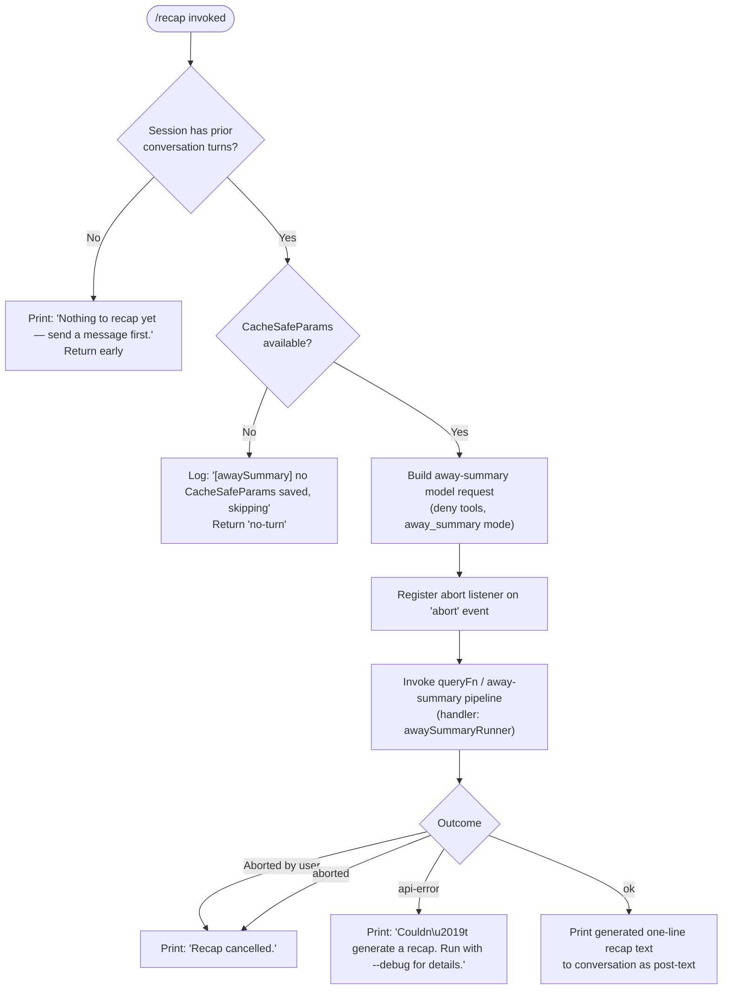

# `/recap`

> Analysis basis: CC v2.1.173 bundle.js (AST extraction + Claude interpretation)
> Minimum version: v2.1.173

---

## Overview

The `/recap` command triggers an on-demand, one-line summary of the current session. It invokes the same "away summary" pipeline normally used for automatic session recaps, running a constrained model call (no tool access) and printing the resulting text to the conversation. If no conversation history exists yet, the command exits early with an informational message rather than making an API call.

---

## Registration

| Field | Value |
|---|---|
| type | `local` |
| name | `recap` |
| description | `Generate a one-line session recap now` |
| loc_byte | `13222832` |
| loc_byte_end | `13223048` |
| loc_line | `9682` |
| supportsNonInteractive | `false` |
| thinClientDispatch | `post-text` |
| load_inline | `true` |
| load_ident | `Zt7` |
| arbor_handler.name | `Zt7` |
| arbor_handler.kind | `AsyncFunction` |
| arbor_handler.fqn | `claude-2.1.173::Zt7` |
| arbor_handler.resolution_path | `load_ident` |
| arbor_handler.n_hits | `0` |

Analysis basis: CC v2.1.173 bundle.js:+13222832

---

## Input Branching

The command has 4+ distinct outcome branches (no history, cancellation, API error, and success), so a Mermaid flowchart is used.



Analysis basis: CC v2.1.173 bundle.js:+13222582, +13222674, +13222732, +6931104, +6931162, +6931218, +6931478, +6931622, +6931711, +6931772

---

## Behavioral Spec

### Top-Level Handler (`recapCommandHandler` / `Zt7`)

The handler is an `AsyncFunction` resolved via the `load_ident` path. It is inlined as `load: () => Promise.resolve({ call: Zt7 })` in the registration object.

```
async function recapCommandHandler(context):
    // Step 1 — Guard: require existing history
    if conversationHistory is empty:
        print "Nothing to recap yet — send a message first."
        return

    // Step 2 — Delegate to away-summary runner
    result = await awaySummaryRunner(context)
    // result is one of: "no-turn", "aborted", "api-error", "ok"

    // Step 3 — Handle outcome
    match result:
        "no-turn":
            // silent; already logged internally
            return
        "aborted":
            print "Recap cancelled."
            return
        "api-error":
            print "Couldn't generate a recap. Run with --debug for details."
            return
        "ok":
            // recap text has already been posted as post-text output
            return
```

Analysis basis: CC v2.1.173 bundle.js:+13222440, +13222582, +13222674, +13222732

---

### Away-Summary Runner (`awaySummaryRunner` / `_28`)

This function drives the actual model call. It is also used by the automatic away-summary feature; `/recap` calls it on-demand.

```
async function awaySummaryRunner(context):
    // Step 1 — Require saved CacheSafeParams
    params = getCacheSafeParams(context)     // K9H
    if params is null:
        log.debug "[awaySummary] no CacheSafeParams saved, skipping"
        return "no-turn"

    // Step 2 — Build model request
    // Uses buildMessageParams (N) with "away_summary" session type
    // Tools are explicitly denied ("Away summary cannot use tools")
    request = buildMessageParams(params, { sessionType: "away_summary", denyTools: true })

    // Step 3 — Register cancellation
    abortController = new AbortController()
    context.on("abort", () => abortController.abort())

    // Step 4 — Run query pipeline
    queryResult = await mainQueryLoop(request, abortController.signal)   // GT

    // Step 5 — Find and return the recap text
    recapMessage = queryResult.messages.find(isAssistantTextMessage)     // q.find
    if recapMessage:
        postResultText(recapMessage.text)    // ti9 → H.flatMap
        return "ok"
    else:
        return "api-error"
```

Analysis basis: CC v2.1.173 bundle.js:+6931083, +6931102, +6931104, +6931199, +6931218, +6931230, +6931277, +6931395, +6931410, +6931478, +6931622, +6931639, +6931711, +6931728, +6931772

---

### Message-Parameter Builder (`buildMessageParams` / `N`)

Constructs the message payload sent to the API. Relevant behaviour observed in this command's context:

```
function buildMessageParams(params, options):
    // Normalise conversation history (hVH, d8f)
    messages = normaliseHistory(params.history)

    // Apply "away_summary" session label
    // Validated against known session types using H.includes check
    sessionType = options.sessionType   // "away_summary"

    // Sanitise message role casing (_.toUpperCase)
    // Compute last-user-turn context (lf)
    lastUserTurn = computeLastTurn(messages)   // lf

    // Write system prompt (oFH → tvA → H.write)
    systemPrompt = buildSystemPrompt(sessionType)

    // Persist to transcript log (i8f → n8f → hy.appendFile)
    persistToLog(messages, systemPrompt)

    return { messages, systemPrompt, ...params }
```

Analysis basis: CC v2.1.173 bundle.js:+210504, +210522, +210544, +210562, +210606, +210626, +210629, +210645, +210651, +210665

---

### Main Query Loop (`mainQueryLoop` / `GT`)

The large agentic execution loop. When invoked from `/recap`, it runs in a constrained mode:

- No tool use (tools denied at the request level).
- A single assistant turn is expected.
- The loop calls the model via `callModel` (`Y.callModel`) and processes streaming events.
- On completion the loop returns structured results including the assistant message.

Key sub-calls observed:

```
async function mainQueryLoop(request, signal):
    startTime = Date.now()
    sessionState = initSessionState()       // AS8
    turnContext = buildTurnContext()         // UqH → VmH

    // Primary model call
    streamResult = await streamRequest(request, signal)   // ap → vW7

    // Parse and accumulate streamed chunks
    // Handle server fallback, refusal fallback, compaction as needed
    // (not active for /recap's simple one-turn request)

    return finaliseResult(streamResult)
```

Analysis basis: CC v2.1.173 bundle.js:+10669722, +10669845, +10670059, +10670101, +10670121, +10670191, +10670252, +10670452, +10670573, +10670602, +10670728

---

### Tool-Denial Enforcement

When the away-summary pipeline is active, the literal `"Away summary cannot use tools"` is used as the denial reason for any tool-use attempt. This is enforced at the request-building stage, not the execution stage.

```
function enforceToolDenial(request):
    if request.sessionType == "away_summary":
        request.toolPolicy = {
            mode: "deny",
            reason: "Away summary cannot use tools"
        }
    return request
```

Analysis basis: CC v2.1.173 bundle.js:+6931395, +6931410

---

### Result-Text Extraction (`extractResultMessages` / `ti9`)

After the query loop completes, the handler uses a flat-map over the final message list to extract text content:

```
function extractResultMessages(messages):
    return messages.flatMap(extractTextContent)   // H.flatMap
```

Analysis basis: CC v2.1.173 bundle.js:+6931728, +6931938

---

## State & Side Effects

| Item | Detail |
|---|---|
| Telemetry | See telemetry events listed below; none are `/recap`-specific — all are emitted by the shared query loop (`vW7` / `GT`) depending on what the model returns |
| Telemetry — query lifecycle | `tengu_auto_compact_rapid_refill_breaker`, `tengu_auto_compact_succeeded`, `tengu_ptl_surfaced_to_user`, `tengu_refusal_fallback_*`, `tengu_query_error`, `tengu_model_fallback_triggered`, `tengu_malformed_tool_use_response`, `tengu_stop_hook_block_count`, `tengu_query_before_attachments`, `tengu_query_after_attachments`, `tengu_mcp_tools_refreshed_mid_turn` |
| Telemetry — feature flags | `tengu_feature_ok` (bundle.js:+1016269), `tengu_feature_bad` (bundle.js:+1016336) |
| Transcript log | The away-summary pipeline appends to the session transcript file via `hy.appendFile` (bundle.js:+209805); file rotation is handled by `Us8` |
| AbortController | A new `AbortController` is created and wired to the session `"abort"` event; abort causes the recap to print `"Recap cancelled."` |
| appState changes | `H.setAppState` / `x.setAppState` are called inside the query loop (`AS8`, `vW7`); for a single-turn no-tool call these are limited to session progress flags |
| Hook registration | `yZA.register` is called inside `y9` (bundle.js:+63751) — this is the standard post-turn hook registration path shared with all query runs |
| Sound | No sound side-effects identified in depth-2 traversal |
| Non-interactive support | `supportsNonInteractive: false` — the command cannot be used in `--no-interactive` / pipe mode |
| thinClientDispatch | `"post-text"` — the recap result is appended as a text message to the conversation output stream |

---

## Version History

| Version | Change |
|---|---|
| v2.1.173 | Initial analysis |

---

## Common Mistakes

1. **Running `/recap` before any messages exist.** The command guards against an empty conversation history and prints `"Nothing to recap yet — send a message first."` instead of making an API call. Send at least one message before invoking `/recap`.

2. **Expecting tool-driven enrichment in the recap.** The away-summary pipeline explicitly denies all tool use (`"Away summary cannot use tools"`). The resulting summary is derived only from the conversation transcript already in memory — no file reads, web searches, or other tool calls will be made.

3. **Using `/recap` in non-interactive / pipe mode.** The registration sets `supportsNonInteractive: false`; attempting to invoke this command in a piped or headless session will have no effect or may be silently skipped by the CLI dispatcher.

4. **Interpreting a blank or missing output as success.** If `CacheSafeParams` are not yet saved (e.g. the session just started and no turn has been flushed), the command logs a debug message and returns silently without printing anything. Run with `--debug` to see the `[awaySummary] no CacheSafeParams saved, skipping` message.

5. **Assuming `/recap` is identical to the automatic away-summary.** They share the same underlying pipeline (`_28` / `awaySummaryRunner`), but `/recap` is invoked synchronously on demand rather than being triggered by an away-timer. The resulting one-liner may differ in tone or detail from what the automatic path would produce at a different point in the session.

---

## Appendix — Identifier Mapping

> For bundle debugging only. Identifiers change across versions.

| Identifier | Role |
|---|---|
| `Zt7` | Top-level `/recap` command handler (`AsyncFunction`); resolved via `load_ident` |
| `_28` | Away-summary runner; orchestrates the no-tool model call |
| `K9H` | CacheSafeParams retrieval helper |
| `N` | Message-parameter builder (constructs API request payload) |
| `d8f` | History normalisation helper (called by `N`) |
| `RZA` | Sub-helper within history normalisation |
| `H` | Generic context / state object (varies by call site) |
| `CH` | JSON serialisation helper (`JSON.stringify` wrapper) |
| `_` | Role / content accessor (used in `_.toUpperCase`, `_.load`) |
| `lf` | Last-user-turn context computation |
| `zNA` | Message-map helper used inside `lf` |
| `q` | Message array / queue (used as `q.at`, `q.find`) |
| `A` | Alternate message/string accessor (used as `A.lastIndexOf`, `A.slice`) |
| `oFH` | System-prompt writer entry point |
| `tvA` | Underlying write call inside system-prompt path |
| `i8f` | Transcript-log persistence function |
| `EFH` | Log-buffer flush / debounced write helper |
| `FfH` | Log-file path builder |
| `o6` | File-system helper (context unclear at depth 2) |
| `K36` | Directory-existence check (calls `N8`) |
| `DNA` | Path join helper for log directory |
| `Us8` | Log-file rotation helper (stat, rename, unlink) |
| `n8f` | Log append function (`hy.appendFile`) |
| `y9` | Post-turn hook registration wrapper |
| `GT` | Main agentic query loop |
| `AS8` | Session-state initialisation inside query loop |
| `lb` | Sub-helper in session init (calls `DK`, `ET9`) |
| `g5H` | App-state load/dump helper |
| `DPH` | App-state delta helper |
| `jF9` | App-state merge helper |
| `M` | App-state map accessor / updater |
| `Ab8` | API-request builder step inside `AS8` |
| `HR` | Request-ID / hex-token generator |
| `qS8` | Turn metadata helper |
| `UqH` | Turn-context factory |
| `$4` | Hook-registration helper (calls `y9`) |
| `VmH` | Message filter / categorisation helper |
| `ap` | Stream-request dispatch entry point |
| `vW7` | Core streaming model-call function (large; handles all streaming states) |
| `$C8` | Subagent context cleanup helper |
| `kH` | Feature-flag OK recorder |
| `bH` | Feature-flag BAD recorder |
| `ME` | Model-error classifier |
| `_b6` | Tool-use-summary gate check |
| `JHH` | Post-turn notification helper |
| `fb8` | Forked-agent default-turns guard |
| `iBq` | Tool-use-summary helper (calls `_b6`) |
| `Y` | Process-exit / abort signal handler |
| `HX` | Forced-shutdown routine |
| `z` | Daemon stop / cleanup handler |
| `bMH` | Background-message filter helper |
| `mJ` | Message-type predicate |
| `LyL` | Find-first-message helper |
| `f` | Promise-tracking set (add/delete/finally) |
| `c` | Core app-state store |
| `FW7` | Forked-agent query wrapper |
| `A6` | App-state event emitter |
| `U8` | UUID-generation + IPC channel helper |
| `P` | IPC buffer / stream processor |
| `X` | IPC channel object |
| `j` | Child-process manager |
| `I7` | Stream-end / close helper |
| `p05` | Daemon session multiplexer (large; handles attach/resize/write) |
| `EH` | String-conversion helper |
| `ti9` | Result-message text extractor (`H.flatMap`) |

---

Note: index built via Arbor fallback; some signals (telemetry, literals) may be missing — see arbor-fallback.js.