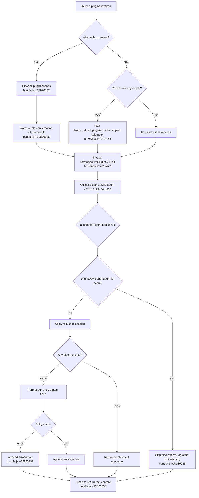

# `/reload-plugins`

> Analysis basis: CC v2.1.173 bundle.js (AST extraction + Claude interpretation)
> Minimum version: v2.1.173

---

## Overview

`/reload-plugins` activates pending plugin changes within the current Claude Code session without requiring a full restart. It rescans all plugin sources (skills, MCP servers, LSP servers, hooks), reconciles newly discovered or changed plugins against the current session state, and reports results as a formatted text message. When the `--force` flag is supplied the command first clears all plugin caches, which causes the whole conversation context to be rebuilt from scratch.

---

## Registration

| Field | Value |
|---|---|
| type | `local` |
| name | `reload-plugins` |
| description | `Activate pending plugin changes in the current session` |
| argumentHint | `[--force]` |
| supportsNonInteractive | `false` |
| thinClientDispatch | `control-request` |
| module_id | `m3K` |
| load_inline | `true` |
| loc_byte | `12821752` |
| loc_byte_end | `12821996` |
| loc_line | `9114` |
| arbor_handler.name | `pl7` |
| arbor_handler.fqn | `claude-2.1.173::pl7` |
| arbor_handler.kind | `AsyncFunction` |
| arbor_handler.resolution_path | `module_id` |
| arbor_handler.n_hits | `0` |

Analysis basis: CC v2.1.173 bundle.js:+12821752

---

## Input Branching

The command has four meaningful branches based on the presence of `--force`, the outcome of plugin load, the type of each loaded component (plugin MCP server, skill, agent, hook, LSP), and per-plugin error state. A Mermaid diagram captures the top-level flow.



Analysis basis: CC v2.1.173 bundle.js:+12820450 (handler entry), +12820872 (`--force` literal), +12820835 (trim call)

---

## Behavioral Spec

### 1. Handler entry — `reloadPluginsHandler` (`pl7`)

```
async function reloadPluginsHandler(args, context):
    rawArgs = parseArguments(args)                  // DX → t4 → qVH
    pluginType = determinePluginType(rawArgs)        // Ur → m8
    // pluginType ∈ {"plugin", "skill", "agent"}
    // bundle.js:+12820566 / +12820597 / +12820625

    forceFlag = rawArgs.trim().includes("--force")  // H.trim, literal "--force"
    // bundle.js:+12820836 / +12820872

    pendingResult = checkPendingChanges(context)    // x3K
    // if no pending changes AND not force:
    //   emit tengu_reload_plugins_cache_impact
    //   bundle.js:+12819744

    appState = getAppState()                        // _.getAppState
    // bundle.js:+12820950

    cacheImpact = assessCacheImpact(context)        // u3K → c
    // bundle.js:+12821056

    splitArgs = parseArgLine(args)                  // Ul7 → A.split
    // bundle.js:+12821110

    loadResult = await refreshActivePlugins(appState, forceFlag, pluginType)
    // LOH, bundle.js:+12821182

    summary = formatLoadSummary(loadResult)         // Q$H
    // bundle.js:+12821214

    descriptionLines = buildDescriptionLines(loadResult)  // nAH
    // bundle.js:+12821257

    return {
        type: "text",
        text: summary.trim()
    }
    // bundle.js:+12820814 / +12820836
```

Analysis basis: CC v2.1.173 bundle.js:+12820450

---

### 2. Argument parsing — `parseArguments` (`DX` / `t4`)

```
function parseArguments(rawInput):
    tokens = splitTokens(rawInput)      // t4 → qVH
    return tokens
    // bundle.js:+12820450 / +1128604
```

Analysis basis: CC v2.1.173 bundle.js:+1128604

---

### 3. Pending-change check — `checkPendingChanges` (`x3K`)

```
function checkPendingChanges(context):
    hasFlag   = context.flags.has(key)   // _.has,  bundle.js:+12819518
    hasEntry  = context.active.has(key)  // A.has,  bundle.js:+12819557
    if not hasFlag and not hasEntry:
        normalizeArg(args)               // yN,     bundle.js:+12819601
    resolveInstallTarget(args)           // It,     bundle.js:+12819607
    enumerateValues(args)                // eY,     bundle.js:+12819628
    // bundle.js:+12819468
```

Analysis basis: CC v2.1.173 bundle.js:+12819468

---

### 4. Cache-impact assessment — `assessCacheImpact` (`u3K`)

```
function assessCacheImpact(context):
    result = internalCacheCheck(context)   // c
    // emit tengu_reload_plugins_cache_impact when cache is stale
    // bundle.js:+12819742 / +12819744
    return result
```

Analysis basis: CC v2.1.173 bundle.js:+12819742

---

### 5. Active plugin refresh — `refreshActivePlugins` (`LOH`)

This is the heaviest sub-routine. It orchestrates all plugin subsystems.

```
async function refreshActivePlugins(appState, force, pluginType):
    log("refreshActivePlugins: clearing all plugin caches")
    // bundle.js:+12817422

    if force:
        clearSkillIndexCache()              // Gp → H.clearSkillIndexCache
        clearInternalCache()               // cS → ub8.clear
        // bundle.js:+12817480

    // Load installed plugins from disk
    pluginManifests = await loadInstalledPlugins()   // lt
    // bundle.js:+12817726

    // Load LSP config
    lspConfig = await loadLspConfig()      // CRH, bundle.js:+12817887

    // Collect MCP configs across scopes
    mcpConfigs = reduceMcpEntries()        // $.reduce, bundle.js:+12817956

    // Collect plugin-owned MCP servers
    pluginMcpMap = reduceMcpPlugins()      // O.reduce, bundle.js:+12817981

    // Build server-slot map
    slotMap = buildSlotMap()               // KP8, bundle.js:+12818015

    // Compute LSP manager entries
    lspEntries = filterLspEntries()        // ul7, bundle.js:+12818098
    // plugin: prefix filtering: bundle.js:+12818978

    // Compute plugin entries for agent/skill types
    agentEntries = filterAgentEntries()    // ml7, bundle.js:+12818131

    // Resolve plugin type string
    pluginTypeLabel = resolvePluginType()  // TP8, bundle.js:+12818257

    // Register hooks (skipped in safe-mode)
    registerHooks()                        // l5H → UK → CT9
    // "Safe mode: skipping plugin hook registration"
    // bundle.js:+12818282 / +5076065

    // Format and emit result
    logResult()                            // SH, bundle.js:+12818302
    errorResult = formatErrors()           // EH, bundle.js:+12818359
    combinedText = reduceResults()         // K.reduce, bundle.js:+12818374
    allValues = Object.values(combinedText)  // bundle.js:+12818427

    dS.emit("plugin_load_all" / "plugin_load_total_failure" / "plugin_load_partial_failures")
    // bundle.js:+12818528 / literals at +10939792 / +10939810 / +10939879

    return combinedText
```

Analysis basis: CC v2.1.173 bundle.js:+12817420

---

### 6. Installed-plugin loader — `loadInstalledPlugins` (`lt`)

```
async function loadInstalledPlugins():
    // Handles .mcpb and .dxt extension files
    // bundle.js:+6436523 / +6436544

    for each pluginDir in scanDirs():
        manifest = readManifestFile(join(dir, "manifest.json"))
        // bundle.js:+6442634

        if manifest is missing:
            log("No manifest.json found in MCPB file")
            continue

        status = computeStatus(manifest)
        // possible statuses: "needs-config", "needs-auth", "connected",
        //   "failed", "disabled", "pending" …
        // bundle.js:+6449321

        result.push(buildEntry(manifest, status))
    return result
```

Analysis basis: CC v2.1.173 bundle.js:+6450197

---

### 7. Plugin-load assembly — `assemblePluginLoadResult` (`cKA`)

```
function assemblePluginLoadResult(rawResults, originalCwd):
    if currentCwd != originalCwd:
        log("assemblePluginLoadResult: originalCwd changed mid-scan; skipping side-effects (stale early-kick)")
        // bundle.js:+10939945
        return null

    // Partition results
    successes = rawResults.filter(r => r.status == "fulfilled")
    // bundle.js:+10921269
    failures  = rawResults.filter(r => r.status == "rejected")
    // bundle.js:+10921325

    for each failure:
        classify(failure)
        // error classes include: "generic-error", "marketplace-blocked-by-policy",
        //   "marketplace-not-found", "marketplace-load-failed", "cache-miss",
        //   "plugin-not-found"
        // bundle.js:+10921441 / +10920447 …

    emit("plugin_load_all")              // bundle.js:+10939792
    if allFailed: emit("plugin_load_total_failure")   // bundle.js:+10939810
    if someFailed: emit("plugin_load_partial_failures") // bundle.js:+10939879

    return {successes, failures}
```

Analysis basis: CC v2.1.173 bundle.js:+10939212

---

### 8. Per-plugin MCP connection — `connectMcpServers` (`dB9` / `nt`)

```
async function connectMcpServers(pluginList):
    // Discover auto-detected MCP servers
    autoDiscovered = readAutoDiscoveredServers()  // $f, "mcpAutoDiscovered"
    // bundle.js:+6472392

    // Load server configs from scopes:
    //   projectSettings, userSettings, localSettings, policySettings
    // bundle.js:+6470663 / +6470686 / +6470707 / literal "policySettings"

    for each serverEntry:
        type = entry.type   // "stdio" | "sse" | "sse-ide" | "ws-ide"
        // bundle.js:+6729086 / +6729120 / +6729185 / +6729221

        if entry.status == "failed":
            log("Skipping connection (recent failure cached; retries in 15 min …)")
            // bundle.js:+6729941
            continue

        if entry.status == "needs-auth":
            log("Skipping connection (cached needs-auth)")
            // bundle.js:+6729679
            continue

        result = await connectOne(entry)    // Rc9
        applyResult(result)                 // oWA / $n8
        // bundle.js:+6742230

    // Emit suppressed-duplicate warning when applicable
    // literal "mcp-server-suppressed-duplicate": bundle.js:+6474108
```

Analysis basis: CC v2.1.173 bundle.js:+6474812

---

### 9. Summary formatter — `formatLoadSummary` (`Q$H`)

```
function formatLoadSummary(loadResult):
    entries = loadResult.entries
    lines   = []

    for each entry in entries:
        kind = entry.kind   // "plugin MCP server", "plugin LSP server", "hook"
        // bundle.js:+12820657 / +12821490 / +12821431

        statusStr = buildStatusString(entry)

        if entry.error:
            statusStr += " · " + entry.errorDetail
            // separator " · ": bundle.js:+12820684
            // "error" label: bundle.js:+12820739

        lines.push(statusStr)

    return lines.join("\n")
```

Analysis basis: CC v2.1.173 bundle.js:+11954931

---

## State & Side Effects

| Item | Detail |
|---|---|
| Telemetry | `tengu_reload_plugins_cache_impact` (bundle.js:+12819744) — fired when force-reload detects cache stale |
| Telemetry | `tengu_feature_ok` / `tengu_feature_bad` / `tengu_feature_sad` (bundle.js:+1016269 / +1016336 / +1016417) — general feature health |
| Telemetry | `tengu_plugin_state_file_error` (bundle.js:+10864254) — plugin state file read error |
| Telemetry | `tengu_mcp_list_changed` (bundle.js:+16533373) — emitted when tools list changes after reload |
| Plugin caches | Cleared unconditionally when `--force` is passed via `clearSkillIndexCache` and `ub8.clear` (bundle.js:+13405982 / +10797844) |
| Hook registration | Hooks are re-registered via `l5H → CT9`; skipped entirely in safe-mode (bundle.js:+5076065) |
| appState changes | MCP server slots updated via `KP8` / `oWA`; LSP entries refreshed via `ul7` / `ml7` (bundle.js:+12818015 / +12818098 / +12818131) |
| Event emitted | `dS.emit` with `"plugin_load_all"`, `"plugin_load_total_failure"`, or `"plugin_load_partial_failures"` (bundle.js:+12818528) |
| thinClientDispatch | `"control-request"` — the command is dispatched as a control request in thin-client mode |
| Sound | None observed in traversal |

---

## Version History

| Version | Change |
|---|---|
| v2.1.173 | Initial analysis |

---

## Common Mistakes

1. **Using `/reload-plugins --force` unnecessarily** — The `--force` flag clears all caches and forces the entire conversation context to be rebuilt. This can be disruptive and slow. Use it only when a plain `/reload-plugins` fails to pick up changes (as warned by the literal at bundle.js:+12820335).
2. **Expecting non-interactive use** — `supportsNonInteractive` is `false`. Running this command in a non-interactive pipeline or script will have no effect.
3. **Expecting instant MCP reconnections** — Servers in a `"failed"` or `"needs-auth"` state are intentionally skipped for approximately 15 minutes (bundle.js:+6729941). Editing the plugin config is the only way to force an immediate retry.
4. **Ignoring safe-mode** — If Claude Code is launched with `--safe-mode`, hook registration is silently skipped (bundle.js:+5076065). Plugin hooks will not be active even after `/reload-plugins`.
5. **Assuming `--force` clears MCP auth state** — The force flag clears the skill index cache and internal caches, but does not reset per-server auth tokens or `"needs-auth"` statuses.

---

## Appendix — Identifier Mapping

> For bundle debugging only. Identifiers change across versions.

| Identifier | Role |
|---|---|
| `pl7` | Main handler for `/reload-plugins` (AsyncFunction, resolved via module_id `m3K`) |
| `DX` | Argument parser entry point |
| `t4` | Token splitter called by argument parser |
| `qVH` | Low-level tokenizer called by `t4` |
| `Ur` | Plugin-type classifier |
| `m8` | Plugin-type enum resolver |
| `x3K` | Pending-change checker |
| `dB9` | MCP server connector orchestrator |
| `uzH` | MCP source enumerator (called by `dB9`) |
| `zU_` | MCP slot mapper |
| `cKA` | Plugin load result assembler |
| `dKA` | Marketplace plugin resolver |
| `nt` | MCP server connection driver |
| `$f` | Auto-discovered server reader |
| `M2` | Settings-scope MCP config loader |
| `F1H` | Per-server config builder |
| `GD` | Policy-settings reader |
| `N` | General-purpose logger / formatter |
| `NJ8` | Plugin descriptor normalizer |
| `D` | Background session manager |
| `Y` | Process-exit controller |
| `QV` | Server slot updater helper |
| `fWL` | Plugin cache map manager |
| `yN` | Argument normalizer |
| `Tb_` | Source-type dispatcher |
| `sIH` | HIPAA-mode check |
| `Gb_` | `auto:` prefix parser for concurrency hints |
| `It` | Install-target resolver |
| `GfL` | Tool-search gate checker |
| `Y6` | Tool-search flag store |
| `eY` | Output-token enumerator |
| `u3K` | Cache-impact assessor |
| `Ul7` | Argument line splitter |
| `LOH` | `refreshActivePlugins` — top-level plugin refresh orchestrator |
| `WQq` | Plugin state logger helper |
| `G$` | Cache-clear coordinator |
| `qT7` | Plugin-context builder |
| `NW` | Context feature-gate evaluator |
| `Gp` | Skill-index cache clearer |
| `cS` | Internal plugin cache clearer (`ub8.clear`) |
| `lt` | Installed-plugin disk loader |
| `$g` | Extension checker (`.mcpb`, `.dxt`) |
| `ep_` | Plugin entry extractor |
| `vB9` | Plugin status resolver |
| `xZ6` | MCPB archive extractor |
| `EH` | Error formatter |
| `CRH` | LSP config loader |
| `lEL` | LSP config entry normalizer |
| `cEL` | Path relativizer for LSP config |
| `ZwK` | Daemon status writer |
| `Sm6` | Status file path builder |
| `CH` | JSON serializer |
| `KP8` | Server-slot map builder |
| `M` | MCP manager (connection dispatcher) |
| `SRH` | Single-server connection driver |
| `$n8` | MCP update applier |
| `oWA` | Connection result applier |
| `ul7` | LSP-manager entry filter |
| `ml7` | Agent/skill entry filter |
| `l5H` | Hook registration gate |
| `UK` | Hook registration executor |
| `Q$H` | Load-summary formatter |
| `ak` | Known-marketplace reader |
| `zM` | Marketplace JSON file reader |
| `ob8` | Plugin directory path builder |
| `pyH` | Per-entry attribute mapper |
| `x8` | Entry validator |
| `VB` | Entry detail builder |
| `SV` | Error thrower for managed scope |
| `A1` | Scope string parser |
| `CW` | Source-type dispatcher |
| `Rn9` | Git URL parser |
| `tV6` | Host/path pattern matcher |
| `EHH` | Marketplace.json reader |
| `Zb6` | Marketplace cache path builder |
| `kKA` | Marketplace cache parser |
| `SKA` | Skill store reader |
| `$Z` | Skill manifest resolver |
| `bb6` | Full plugin resolution pipeline |
| `Kv` | Plugin-file loader |
| `RKA` | Plugin file reader (sync) |
| `Cb6` | Plugin installation manager |
| `RK6` | Plugin archive installer |
| `HKH` | Plugin content hasher |
| `Hx8` | Plugin directory scanner |
| `bKA` | Plugin state updater |
| `JH` | MCP manager top-level controller |
| `Rc9` | Per-server connect caller |
| `MH` | MCP session manager |
| `LH` | Connection status tracker |
| `j8` | MCP debug logger |
| `DH` | Session resume / daemon handler |
| `gH` | Workflow agent runner |
| `hqH` | Session load orchestrator |
| `nAH` | Description line builder |
| `yRH` | MCP update broadcaster |
| `HH` | MCP batch update handler |
| `kT7` | Plugin manifest validator |
| `mf` | Telemetry metric emitter (OTEL) |
| `byH` | OTEL attribute builder |
| `LOH` | (repeated) `refreshActivePlugins` |

---

Note: index built via Arbor fallback; some signals (telemetry, literals) may be missing — see arbor-fallback.js.