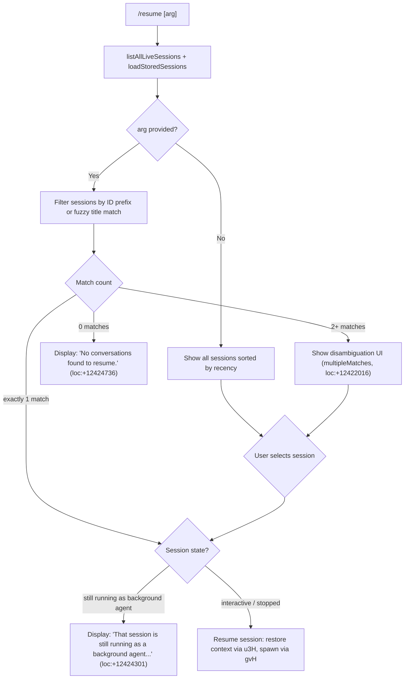

# `/resume`

> Analysis basis: CC v2.1.173 bundle.js (AST extraction + Claude interpretation)
> Minimum version: v2.1.173

---

## Overview

`/resume` (alias: `/continue`) lets a user resume or continue a previous Claude Code conversation by specifying a conversation ID or a fuzzy search term. The command lists all known sessions, optionally filters them by the supplied argument, and either resumes the selected session directly or presents a disambiguation UI when multiple matches are found.

---

## Registration

| Field | Value |
|---|---|
| type | `local-jsx` |
| name | `resume` |
| description | `Resume a previous conversation` |
| aliases | `["continue"]` |
| argumentHint | `[conversation id or search term]` |
| module_id | `tKK` |
| load_inline | `true` |
| loc_byte | `12425699` |
| loc_byte_end | `12425896` |
| loc_line | `8580` |
| arbor_handler.name | `FF7` |
| arbor_handler.fqn | `claude-2.1.173::FF7` |
| arbor_handler.kind | `AsyncFunction` |
| arbor_handler.resolution_path | `module_id` |
| arbor_handler.n_hits | `0` |

Analysis basis: CC v2.1.173 bundle.js:+12425699

---

## Input Branching

The handler contains 5+ distinct branches based on session state and match count.



---

## Behavioral Spec

### 1. Session Discovery (`p3H`)

```
async function listAndFilterSessions(arg):
    // Resolves immediately via Promise.resolve then calls listAllLiveSessions
    // Also queries stored sessions from disk
    liveSessions = await listAllLiveSessions()           // loc:+9279493
    storedSessions = loadStoredSessions()
    allSessions = merge(liveSessions, storedSessions)

    // Filter to sessions whose mode == "interactive" (loc:+9279584)
    interactiveSessions = allSessions.filter(s => s.mode == "interactive")

    // Detect git worktree association (emits tengu_worktree_detection, loc:+9269227)
    for each session in interactiveSessions:
        detectWorktree(session)   // runs `git worktree list --porcelain` (loc:+9269145)

    return interactiveSessions
```

Analysis basis: CC v2.1.173 bundle.js:+9279441, +9279493, +9279584

### 2. Main Handler (`FF7`)

```
async function resumeCommandHandler(input, appState):
    arg = input.trim()
    sessions = await listAndFilterSessions()             // p3H, loc:+12424291

    // Sort sessions by recency (Date.now comparison)                  loc:+12424613
    sessions.sort(byRecencyDescending)

    // Check for background agent conflict BEFORE resuming             loc:+12424301
    if session.isRunningAsBackgroundAgent:
        return renderMessage(
            "That session is still running as a background agent. " +
            "Open `claude agents` to attach to it, or stop it there " +
            "first to resume here."
        )

    // Build candidate list filtered by arg (case-insensitive)        loc:+12424855
    candidates = filterSessionsByArg(sessions, arg)

    if candidates.length == 0:                                         // loc:+12424736
        return renderMessage("No conversations found to resume.")

    if candidates.length == 1:
        selectedSession = candidates[0]
    else:
        // Present disambiguation picker (multipleMatches)             loc:+12422016
        selectedSession = await showSessionPicker(candidates)

    // Emit telemetry for the selected session
    emitTelemetry("slash_command_session_id", selectedSession.id)      // loc:+12424997
    emitTelemetry("slash_command_title",      selectedSession.title)   // loc:+12425221

    // Restore conversation context
    restoredContext = await restoreSessionContext(selectedSession)      // u3H, loc:+12424658

    // Build message array from stored transcript (B3H / f96 / kqH)   loc:+12424975
    messages = buildMessageArray(selectedSession)

    // Return JSX element rendering the resumed conversation            loc:+12424587
    return lj.createElement(ResumeView, {
        session:   selectedSession,
        messages:  messages,
        context:   restoredContext,
        onConfirm: () => startSession(selectedSession)                 // loc:+12424963
    })
```

Analysis basis: CC v2.1.173 bundle.js:+12424291, +12424587, +12424613, +12424658, +12424736, +12424837, +12424855, +12424963, +12424975

### 3. Session Context Restoration (`u3H`)

```
async function restoreSessionContext(session):
    timestamp = Date.now()                              // loc:+9269083

    // Resolve working directory – normalizes path to NFC form (loc:+181442)
    workdir = normalizePath(session.workdir)            // dO, loc:+9269369

    // Detect worktree root: splits on "worktree " prefix (loc:+9269346)
    // Prefix length 9 (loc:+9269380)
    worktreeRoot = extractWorktreeRoot(workdir)

    // Sort candidate session files by localeCompare               loc:+9269551
    sortedFiles = sessionFiles.sort(localeCompare)

    // Determine best match using startsWith for ID prefix           loc:+9269333
    match = sortedFiles.find(f => f.startsWith(session.id))

    // Launch sub-process via gvH (spawns worker, sets up I/O)
    worker = await spawnWorker(session, worktreeRoot)               // u_, gvH

    return { worker, workdir: worktreeRoot }
```

Analysis basis: CC v2.1.173 bundle.js:+9269083, +9269118, +9269308, +9269333, +9269346, +9269369, +9269380, +9269551

### 4. Background-Agent Guard (`FF7`)

When the selected session is still running as a background agent the handler surfaces a blocking error message rather than attempting to resume. The literal string at `+12424301` is displayed verbatim in the UI. The session status value `"background session"` (literal `+16797523`) and `"stopped"` (`+16797480`) are the discriminators.

Analysis basis: CC v2.1.173 bundle.js:+12424301, +16797480, +16797523

### 5. Transcript Loading and Message Building (`B3H` / `f96` / `kqH`)

```
function buildMessageArray(session):
    // Read raw transcript file (kqH → gK.readFile, loc:+13465672)
    rawBytes = fs.readFile(session.transcriptPath)

    // Parse JSONL entries: each line is one of:
    //   "assistant", "user", "system", "attachment", "compact_boundary",
    //   "summary", "last-prompt", "progress" (literals at multiple sites)
    entries = parseJSONL(rawBytes)                      // V65 / Z65 / ovH path

    // Re-link parent chains; emit telemetry on anomalies:
    //   tengu_transcript_phantom_parent  (loc:+13462345)
    //   tengu_transcript_parent_cycle    (loc:+13466150)
    //   tengu_chain_parent_cycle         (loc:+13443833)
    //   tengu_chain_timestamp_fallback   (loc:+13443982)
    //   tengu_relink_walk_broken         (loc:+13443343)
    linkedChain = relinkParentChain(entries)

    // Build display-ready message list sorted by timestamp
    return sortAndDedup(linkedChain)
```

Analysis basis: CC v2.1.173 bundle.js:+13455873, +13456301, +13465464, +13465672, +13462345, +13443343, +13466150

### 6. "No Conversations Found" Path (`FF7`)

When the filtered candidate list is empty, `FF7` renders a simple inline message component with the text `"No conversations found to resume."` (literal at `+12424736`). No telemetry is emitted for this path.

Analysis basis: CC v2.1.173 bundle.js:+12424736

### 7. Session Picker / Disambiguation (`oKK`)

```
function renderSessionPicker(candidates):
    // Formats each candidate entry in bold using W6.bold (loc:+12421980)
    // Reports outcome key: "sessionNotFound" (loc:+12421945)
    //                  or: "multipleMatches" (loc:+12422016)
    return interactiveList(candidates, {
        emptyKey:    "sessionNotFound",
        multipleKey: "multipleMatches"
    })
```

Analysis basis: CC v2.1.173 bundle.js:+12425271, +12421945, +12422016, +12421980

---

## State & Side Effects

| Item | Detail |
|---|---|
| Telemetry — `slash_command_session_id` | Emitted with the resolved session ID upon successful selection (bundle.js:+12424997) |
| Telemetry — `slash_command_title` | Emitted with the session's display title upon successful selection (bundle.js:+12425221) |
| Telemetry — `tengu_worktree_detection` | Emitted during worktree path detection in `u3H` (bundle.js:+9269227) |
| Telemetry — `tengu_transcript_phantom_parent` | Emitted when a transcript entry references a non-existent parent UUID (bundle.js:+13462345) |
| Telemetry — `tengu_transcript_parent_cycle` | Emitted when a parent-chain cycle is detected during transcript relinking (bundle.js:+13466150) |
| Telemetry — `tengu_chain_parent_cycle` | Secondary cycle detection during chain walk (bundle.js:+13443833) |
| Telemetry — `tengu_chain_timestamp_fallback` | Emitted when timestamp-based fallback ordering is used (bundle.js:+13443982) |
| Telemetry — `tengu_chain_parallel_tr_recovered` | Emitted when a parallel transcript branch is recovered (bundle.js:+13445848) |
| Telemetry — `tengu_relink_walk_broken` | Emitted when parent-chain relink walk encounters a broken link (bundle.js:+13443343) |
| Telemetry — `tengu_bg_attach` | Emitted if background-session attach is attempted during resume (bundle.js:+16752455) |
| appState changes | Active session context is replaced with the restored session's worker and working directory |
| Hook registration | `ZQA` registers an `exit` event listener on the spawned worker process (bundle.js:+1119911) |
| File I/O | Transcript JSONL is read synchronously from disk via `gK.readFile` (bundle.js:+13465672); worktree list is queried via `git worktree list --porcelain` (bundle.js:+9269145) |
| Background-agent guard | If the target session is in `"background session"` state, resume is blocked and a user-facing message is rendered instead of resuming (bundle.js:+12424301) |

---

## Version History

| Version | Change |
|---|---|
| v2.1.173 | Initial analysis |

---

## Common Mistakes

1. **Passing a partial title instead of an ID when there are many similarly-named sessions** — the fuzzy filter can return multiple matches, causing the disambiguation picker to appear. Supply a unique session ID prefix to avoid ambiguity.
2. **Attempting to resume an active background-agent session** — the command blocks with an informational message directing the user to `/agents`. Stop or detach the background session first.
3. **Using `/resume` in a directory whose git worktree differs from the original session's worktree** — the worktree detection logic normalizes paths and may fail to match, causing "No conversations found to resume."
4. **Expecting `/resume` to work across machines** — session transcripts are stored locally; there is no cloud synchronization of conversation state.
5. **Forgetting the `/continue` alias** — both `/resume` and `/continue` invoke the same handler (`FF7`); either can be used.

---

## Appendix — Identifier Mapping

> For bundle debugging only. Identifiers change across versions.

| Identifier | Role |
|---|---|
| `FF7` | Main async handler for `/resume` (arbor-resolved, `claude-2.1.173::FF7`) |
| `sKK` | Registration module wrapper; filters and exposes command object |
| `p3H` | Session listing helper — calls `listAllLiveSessions`, resolves via `Promise.resolve` |
| `u3H` | Session context restoration — resolves working directory, detects worktree, spawns worker |
| `u_` | Worker spawn orchestrator — delegates to `gvH` and process-exit handlers |
| `gvH` | Low-level process/worker spawner with I/O piping |
| `B3H` | Transcript loader and message-array builder |
| `kqH` | Core transcript store — reads JSONL, manages Maps for all message types |
| `f96` | Session state accessor — reads stored session metadata Maps |
| `WPK` | Session picker wrapper — merges `kqH` with `Object.assign` |
| `N65` | Individual session entry renderer (path join, stat) |
| `Nr` | Filter and sort helper for candidate session list |
| `oKK` | Disambiguation / "no match" UI renderer; applies `W6.bold` formatting |
| `GPK` | File-system session discovery — reads project directories, resolves real paths |
| `Cp6` | Compound session builder — joins metadata with transcript via `epH` |
| `epH` | Binary transcript reader (Buffer-level) feeding `b65` |
| `b65` | Low-level transcript parser; distinguishes `daemon` vs `daemon-worker` sources |
| `SH` | Error-reporting / logging helper used throughout the call graph |
| `EH` | String-coercion utility used in error display paths |
| `a3` | Session argument normalizer / ID extractor |
| `Ig` | UUID regex validator (`MyL.test`) |
| `Qe` | Session metadata formatter |
| `$g8` | Date parser for session timestamps (`Date.parse`) |
| `U3H` | Parent-chain relinker; emits `tengu_chain_*` telemetry |
| `Y65` | Message-chain sorter and deduplicator |
| `O65` | Queue-based chain walker |
| `jPK` | Chain parent-map builder |
| `w65` | NaN-safe numeric comparison for timestamps |
| `sYA` | Message text extractor / normaliser |
| `ou6` | JSONL line parser; handles `command-args` and `bash-input` entries |
| `eYA` | Content-type discriminator (`image`, `document`) |
| `D65` | Array type guard with `.some` predicate |
| `j65` | Nested-array type guard with `.some` predicate |
| `K96` | Compact-summary mapper |
| `gYA` | Per-entry message formatter calling `sYA`, `K96`, `eYA` |
| `Og8` | Message deduplication map helper |
| `zg8` | Message array flattener (`Array.from` + `.values`) |
| `iXK` | In-memory message index builder |
| `$65` | Message ancestry resolver with cycle guard |
| `ovH` | Byte-order-mark and encoding helper (`Vxf`, `vxf`, `hxf`, `Nxf`) |
| `V65` | Primary binary JSONL parser (random-access file read) |
| `Z65` | Secondary JSONL parser variant (Buffer-based) |
| `v65` | Fallback sync file-read path for transcripts |
| `EVH` | JSON.parse wrapper used inside transcript parsing |
| `ZwK` | Daemon status file reader (`daemon.status.json`) |
| `Sm6` | Status file path builder (`EwK.join`) |
| `d9` | AsyncLocalStorage store accessor (`su4.getStore`) |
| `dO` | Path normalizer (Unicode NFC, `H.normalize`) |
| `P_` | Config/project root accessor |
| `BG` | Global base-directory constant |
| `Fn` | Project-directory path builder (`vPH.join`, `A_`) |
| `t$H` | UI state helper for resume view |
| `YC` | Working-directory resolver used in session entry |
| `E0` | Directory listing helper (`PB.readdir`, `Sw`) |
| `yEH` | Context file list builder (`ML6`, `yvH`) |
| `dYA` | Recursive directory reader for session files |
| `vp6` | File metadata getter/setter |
| `Sw` | Path segment cleaner (`H.replace`, `_.slice`, `lRf`) |
| `TK` | Tokeniser / regex executor for message content |
| `HH` | MCP update applier in message chain |
| `yRH` | MCP result handler (`j2H`) |
| `t` | MCP tool-result processor |
| `M` | MCP session manager (`SRH`, `$n8`) |
| `SRH` | MCP connection state machine |
| `$n8` | MCP connection applicator (`H.applyMcpUpdate`) |
| `oWA` | MCP client reconciler (`_.getClients`) |
| `D` | Background-session supervisor |
| `r0A` | Session retirement/cleanup handler |
| `Q0A` | Daemon socket claim handler (`Hd.claim`) |
| `Y6` | Worker registry with zone-flag check (`ajH.has`, `zF`) |
| `Q` | Process lifetime manager (connect/disconnect) |
| `p05` | PTY/socket multiplexer |
| `y` | Background-worker sweep loop |
| `l` | Scheduled-grace-clock manager |
| `n` | Voice/session worker lifecycle manager |
| `s` | Session timeout wrapper |
| `fH` | Focus-triggered session starter |

---

Note: index built via Arbor fallback; some signals (telemetry, literals) may be missing — see arbor-fallback.js.