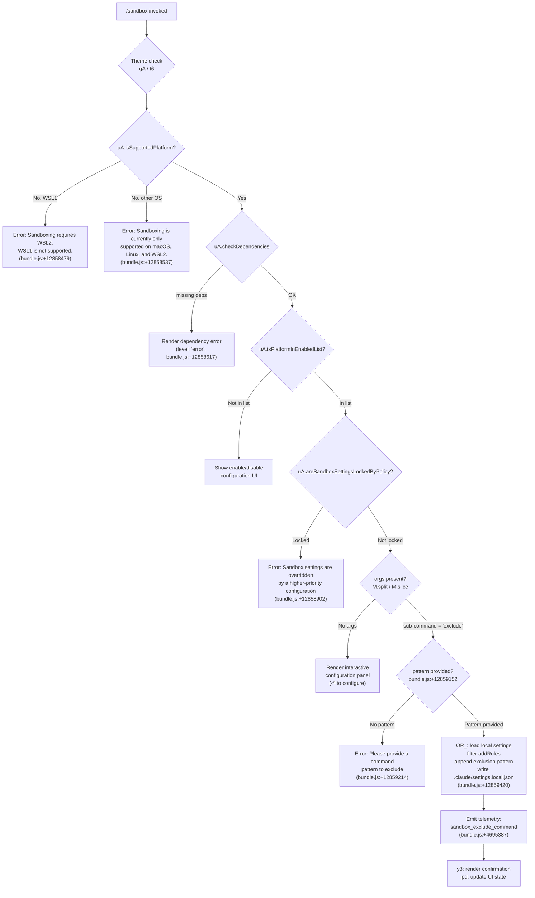

# `/sandbox`

> Analysis basis: CC v2.1.172 bundle.js (AST extraction + Claude interpretation)
> Minimum version: v2.1.172

---

## Overview

The `/sandbox` command configures and manages the sandboxing subsystem for Claude Code, controlling which shell commands the agent is permitted to execute inside an isolated execution environment. It validates platform support, checks policy locks, and allows the user to add per-project exclusion patterns—command globs that should bypass sandboxing—persisting them to `.claude/settings.local.json`. The command operates as an `immediate` action (no round-trip to the model required) and surfaces rich interactive JSX feedback in the terminal.

---

## Registration

| Field | Value |
|---|---|
| type | `local-jsx` |
| name | `sandbox` |
| description | `" ...   ...  (⏎ to configure)"` |
| argumentHint | `exclude "command pattern"` |
| immediate | `true` |
| isHidden | `null` (visible) |
| module_id | `v$K` |
| load_inline | `true` |
| loc_byte | `12859787` |
| loc_byte_end | `12860436` |
| loc_line | `9132` |
| arbor_handler.name | `On7` |
| arbor_handler.fqn | `claude-2.1.172::On7` |
| arbor_handler.kind | `AsyncFunction` |
| arbor_handler.resolution_path | `module_id` |
| arbor_handler.n_hits | `2` |

Analysis basis: CC v2.1.172 bundle.js:+12859787

---

## Input Branching

The handler has five or more distinct branches based on platform state, policy lock, argument presence, and sub-command routing. A Mermaid flowchart is used.



---

## Behavioral Spec

### Platform Validation

```
async function sandboxHandler(args, context):
    theme = resolveTheme()           // gA (bundle.js:+12858406)
    colorFn = buildColorFunction()   // t6 (bundle.js:+12858428)

    if not platformSupport.isSupportedPlatform():  // uA.isSupportedPlatform (bundle.js:+12858437)
        wsl_version = detectWSLVersion()
        if wsl_version == "wsl" and wsl_version != "wsl2":
            return renderError("Error: Sandboxing requires WSL2. WSL1 is not supported.")
            // literal bundle.js:+12858479
        else:
            return renderError("Error: Sandboxing is currently only supported on macOS, Linux, and WSL2.")
            // literal bundle.js:+12858537

    depResult = platformSupport.checkDependencies()  // bundle.js:+12858654
    if depResult has errors:
        return renderPanel({ level: "error", ... })  // literal bundle.js:+12858617

    if not platformSupport.isPlatformInEnabledList():  // bundle.js:+12858681
        return renderEnableDisableUI()

    if platformSupport.areSandboxSettingsLockedByPolicy():  // bundle.js:+12858843
        return renderError(
            "Error: Sandbox settings are overridden by a higher-priority configuration and cannot be changed locally."
        )  // literal bundle.js:+12858902
```

Analysis basis: CC v2.1.172 bundle.js:+12858406

### Argument Parsing and Sub-command Dispatch

```
    rawArgs = args.split(...)   // M.split, bundle.js:+12859129
    argSlice = args.slice(...)  // M.slice, bundle.js:+12859169

    // Token at index 0 checked against "exclude" (literal bundle.js:+12859152)
    subCommand = argSlice[0]

    if subCommand == "exclude":
        patternArg = argSlice.slice(8)  // numeric offset 8, bundle.js:+12859177
        if patternArg is empty or missing:
            return renderError(
                'Error: Please provide a command pattern to exclude (e.g., /sandbox exclude "npm run test:*")'
            )  // literal bundle.js:+12859214
        else:
            handleExcludePattern(patternArg, context)
    else:
        renderConfigurationPanel(context)
```

Analysis basis: CC v2.1.172 bundle.js:+12859129

### Exclude Sub-command — Writing Exclusion Rules

```
function handleExcludePattern(pattern, context):
    // OR_: load local settings (bundle.js:+12859362)
    localSettings = loadSettings("localSettings")  // literal bundle.js:+4695010

    // Filter existing addRules entries (bundle.js:+4695101)
    existingRules = localSettings.addRules ?? []

    // mAL: test if pattern already matches (H.match, bundle.js:+4685992)
    if patternAlreadyIncluded(existingRules, pattern):
        // OR_: q.includes check (bundle.js:+4695291)
        skip duplicate insertion

    // AA: apply the rule to settings layers (bundle.js:+4695305)
    //   internally calls y3 (settings load, bundle.js:+12859375)
    //   and then persists via Sz6 / Aa6 write routines
    updatedSettings = appendExcludeRule(localSettings, pattern)

    // Compute relative path for display (Z$K.relative, bundle.js:+12859399)
    relPath = path.relative(cwd, ".claude/settings.local.json")
    // literal bundle.js:+12859420

    // Emit telemetry event (bundle.js:+4695387)
    emitTelemetry("sandbox_exclude_command")

    // pd: update UI / render confirmation (bundle.js:+12859412)
    renderExcludeConfirmation(relPath, pattern)
```

Analysis basis: CC v2.1.172 bundle.js:+12859362

### Settings Persistence Layer

The exclusion rule is ultimately written to `.claude/settings.local.json` (literal, bundle.js:+12859420) via the layered settings writer (`AA` → `Aa6` → file I/O helpers). The settings writer resolves multiple configuration tiers: `policySettings`, `flagSettings`, `localSettings`, `userSettings`, and `projectSettings` (literals at bundle.js:+1299964, +1300043, +4695010, +1295972, +1296023 respectively).

```
function persistExcludeRuleToLocalSettings(pattern):
    settingsPath = resolve(".claude/settings.local.json")
    existingContent = readFileIfExists(settingsPath)
    merged = mergeSettings(existingContent, { addRules: [..., pattern] })
    atomicWrite(settingsPath, merged)  // via Sz6 / ms8 / Aa6 helpers
```

Analysis basis: CC v2.1.172 bundle.js:+1315035

### MCP Sub-system Interaction (indirect, depth-2)

The handler reaches `M` (the MCP orchestrator module) at bundle.js:+12859129, which in turn drives `yRH` (MCP server connection manager, bundle.js:+16425952) and `Ln8` (connection result application, bundle.js:+16425962). These are called as part of rendering the sandbox status panel, which reflects active MCP server states. Direct sandbox configuration does not modify MCP state.

Analysis basis: CC v2.1.172 bundle.js:+12858654

---

## State & Side Effects

| Item | Detail |
|---|---|
| Telemetry — `tengu_mcp_oauth_flow_start` | Fired when MCP OAuth flow begins (bundle.js:+6500103); indirect, from MCP subsystem reached during panel render |
| Telemetry — `tengu_mcp_oauth_flow_success` | Fired on successful MCP OAuth completion (bundle.js:+6505089) |
| Telemetry — `tengu_mcp_oauth_flow_error` | Fired on MCP OAuth failure (bundle.js:+6506800) |
| Telemetry — `tengu_daemon_config_reload` | Fired when daemon config is reloaded (bundle.js:+16775429) |
| Telemetry — `tengu_mcp_skills` | Fired to record MCP skill counts (bundle.js:+6607177) |
| Telemetry — `tengu_config_auth_loss_prevented` | Fired when a config write is blocked to prevent auth data loss (bundle.js:+3309224) |
| Telemetry — `tengu_feature_ok` | Fired on successful feature gate check (bundle.js:+1016269) |
| Telemetry — `tengu_feature_bad` | Fired on failed feature gate check (bundle.js:+1016336) |
| Telemetry — `tengu_daemon_control` | Fired on daemon start/stop operations (bundle.js:+16796987) |
| Telemetry — `tengu_feature_sad` | Fired on degraded feature state (bundle.js:+1016417) |
| Telemetry — `sandbox_exclude_command` | **Primary**: fired directly when an exclude pattern is successfully added (bundle.js:+4695387) |
| File write | `.claude/settings.local.json` updated with new `addRules` entry when `exclude` sub-command succeeds (literal bundle.js:+12859420) |
| appState changes | UI panel rendered via JSX (`local-jsx` type); `pd` updates internal display state (bundle.js:+12859412) |
| Hook registration | `y9` registers process exit cleanup hooks (bundle.js:+210355 via `hZA.register`) |
| Sound | <!-- TODO: not found in depth-2 traversal; needs --depth 4 --> |

---

## Version History

| Version | Change |
|---|---|
| v2.1.172 | Initial analysis |

---

## Common Mistakes

1. **Running `/sandbox exclude` without a quoted pattern**: The command requires a quoted glob pattern as the next token (e.g., `/sandbox exclude "npm run test:*"`). Omitting the pattern produces a usage error (bundle.js:+12859214).
2. **Using `/sandbox` on WSL1**: The handler explicitly checks for WSL version and rejects WSL1 with a clear error. You must upgrade to WSL2 for sandbox support (bundle.js:+12858479).
3. **Expecting `/sandbox` to work on Windows (non-WSL)**: Sandboxing is only supported on macOS, Linux, and WSL2. Running on native Windows returns an unsupported-platform error (bundle.js:+12858537).
4. **Attempting to change sandbox settings under a policy lock**: Enterprise or higher-priority policy configurations can lock sandbox settings. In that case the command returns an error and does not write to local settings (bundle.js:+12858902).
5. **Expecting the exclude rule to be written to `.claude/settings.json`**: Exclusion rules are always persisted to `.claude/settings.local.json`, not the shared project settings file (bundle.js:+12859420).

---

## Appendix — Identifier Mapping

> For bundle debugging only. Identifiers change across versions.

| Identifier | Role |
|---|---|
| `On7` | Primary async handler for `/sandbox` command (Arbor-resolved) |
| `IA` | Terminal color/theme dispatcher (foreground/background color routing) |
| `TJH` | ANSI color string builder (maps color names to chalk-style calls) |
| `Fl` | Fallback/default color renderer |
| `M` | MCP orchestrator module (server registry, split/slice entry point) |
| `yRH` | MCP server connection manager |
| `qi` | MCP server slot initializer |
| `gZ6` | MCP slot config builder |
| `lt` | MCP server connection lifecycle manager |
| `Og` | MCP server entry aggregator |
| `kJ8` | MCP server error/warning color formatter |
| `q` | Persistent data cache (Map, 1024-entry limit) |
| `BZ6` | MCP server-by-transport dispatcher (sse/http routing) |
| `QV` | MCP server connection validator |
| `Hw` | MCP handshake handler |
| `KU_` | MCP keepalive utility |
| `K` | Spinner/progress display manager |
| `f` | Active request tracker (Set + finally cleanup) |
| `L` | Connection close coordinator |
| `g8` | Logging utility wrapper |
| `uV6` | MCP server filter utility |
| `Jc9` | MCP server needs-auth cache manager |
| `oB_` | Auth cache path resolver |
| `Y2H` | Config hash/fingerprint calculator |
| `jj8` | Config key serializer |
| `Jj8` | Config diff/fingerprint combiner |
| `nX` | SHA-256 hash helper (createHash) |
| `Yj8` | Config snapshot helper |
| `hf` | Config read utility |
| `j8` | MCP debug log emitter |
| `sJ8` | MCP server connection executor (OAuth + stdio + SSE) |
| `pWL` | OAuth redirect URI builder (`http://localhost:<port>/callback`) |
| `Nc` | Network connection initializer |
| `S1H` | SSE-IDE connection setup |
| `R1H` | Remote connection retry handler |
| `g1H` | OAuth local callback HTTP server manager |
| `aeH` | Active OAuth session tracker (Map with finally cleanup) |
| `Y` | Forced shutdown / process.exit coordinator |
| `eJ8` | Auth-failure cache writer |
| `Li` | MCP reconnect orchestrator |
| `mu` | Network utility (rK-based) |
| `w` | Daemon supervisor write/control channel |
| `OL` | MCP error logger |
| `EH` | Error string coercer (String cast) |
| `UWL` | OAuth URL launcher |
| `mWL` | SSH remote session detector |
| `tJ8` | OAuth complete-authentication tool handler |
| `oeH` | Active OAuth session getter (QJ8.get) |
| `seH` | Active OAuth session getter (dJ8.get) |
| `Vc9` | MCP server needs-auth discovery runner |
| `d9` | AsyncLocalStorage store accessor |
| `aX8` | Needs-auth cache file path builder |
| `CH` | JSON serializer (JSON.stringify wrapper) |
| `XU_` | MCP tool call executor |
| `j` | Process signal / kill dispatcher |
| `A` | String lowercase normalizer |
| `S` | Child process manager (spawn/kill) |
| `pN` | MCP telemetry skill event emitter (`tengu_mcp_skills`) |
| `Y6` | Telemetry event sender |
| `qU_` | Feature flag evaluator |
| `E8` | Feature flag persistence helper |
| `k` | Warning message accumulator |
| `Gc9` | Integer conversion validator |
| `FF` | Async iterator / event-emitter bridge (Promise-based) |
| `ZH6` | parseInt radix-10 wrapper |
| `sX8` | parseInt radix-20 wrapper |
| `Ln8` | MCP connection result applier |
| `kRH` | MCP connection state hash checker |
| `r0` | MCP slot cleanup runner |
| `TH6` | MCP slot state resetter |
| `N` | Settings-aware output formatter |
| `g8f` | Process output theme selector |
| `kZA` | Terminal capability detector |
| `lf` | Path-aware log formatter |
| `MNA` | Log line prefix builder |
| `rFH` | stdout raw writer |
| `ovA` | Stream write wrapper |
| `l8f` | Rotating log file writer |
| `TFH` | Buffered log flush scheduler |
| `BfH` | Log file rotation handler |
| `A36` | Log directory creator |
| `zNA` | Log file path resolver |
| `ms8` | Log file stat/rename/rotate utility |
| `c8f` | Log append+rotate executor |
| `y9` | Process exit hook registrar (hZA.register) |
| `$` | Daemon status writer (TwK entry point) |
| `TwK` | Daemon status file updater |
| `pa` | Daemon status formatter |
| `km6` | Daemon status file path builder (`daemon.status.json`) |
| `nWA` | MCP server registry update orchestrator |
| `mJ8` | MCP server capability gate checker |
| `d8` | Async timeout+abort wrapper |
| `O` | Background session tracker (m8 reference) |
| `z` | Daemon session controller (kH/bH/wS) |
| `kH` | Daemon feature-ok reporter (`tengu_feature_ok`) |
| `c` | Telemetry event base emitter |
| `A6` | Telemetry payload builder |
| `_56` | Telemetry queue entry creator |
| `bH` | Daemon feature-bad reporter (`tengu_feature_bad`) |
| `wS` | Daemon session start/stop controller |
| `eu` | Session network client initializer |
| `nC` | OAuth provider client (oJ4/QO/Zz6) |
| `GhH` | Session event emitter bridge |
| `zS` | Session telemetry sender (Y6 route) |
| `HJ_` | Session connection handler (Dq8 route) |
| `Dq8` | HTTP request executor |
| `QB` | Cryptographic nonce generator (randomBytes) |
| `CU` | Daemon stop coordinator (Promise.race + process.exit) |
| `vLH` | VLH shutdown invoker |
| `NLH` | Shutdown timeout + Datadog flush (ZZ_) |
| `ZZ_` | Datadog metric poster (Kj.post) |
| `OR_` | Local settings loader + sandbox exclude rule writer |
| `x8` | Settings file reader bootstrap |
| `ia6` | Settings cache lookup (mg6.has/get) |
| `aEA` | Settings cache getter |
| `rK_` | Settings object constructor |
| `sEA` | Settings cache setter (mg6.set) |
| `VB` | Multi-tier settings merger |
| `P_` | Settings base constructor (BG) |
| `l56` | Policy settings layer |
| `$o8` | Flag settings layer |
| `Q56` | Local settings layer |
| `iZH` | User settings layer |
| `rZH` | Project settings layer |
| `i56` | Enterprise settings layer |
| `wYH` | Settings validation helper |
| `YYH` | Settings coercion helper |
| `$f_` | Settings default filler |
| `blA` | Settings boolean normalizer |
| `Ea` | Settings array merger |
| `Ew6` | Settings write dispatcher (t6/Gw6/d2) |
| `mAL` | Exclude pattern matcher (H.match regex) |
| `AA` | Settings update + rule append orchestrator |
| `y3` | Settings reload + display refresh |
| `OYH` | User settings path resolver |
| `U2` | Settings write coordinator (ja) |
| `ja` | Atomic settings file writer |
| `R8` | File write error handler (N8) |
| `N8` | ENOENT / EISDIR error formatter |
| `qK_` | Settings write timestamp recorder |
| `tvH` | Settings display refresh helper |
| `na6` | Settings path normalizer (XI.resolve/dirname) |
| `Sz6` | Atomic file write with symlink handling |
| `FO` | Settings cache invalidator (mg6.clear / Qi8.clear) |
| `Aa6` | Settings file append/write with directory creation |
| `p6` | Settings path builder (zo6/P_) |
| `Bq_` | Settings lock checker (J4) |
| `_a6` | Git check-ignore runner |
| `Yxf` | Path expansion helper (homedir / isAbsolute) |
| `jdA` | Git ls-files tracker |
| `JdA` | Settings write validation helper |
| `Uu` | Claude settings directory resolver (`.claude`) |
| `s6` | Daemon feature-sad reporter (`tengu_feature_sad`) |
| `vB` | Settings load-from-disk orchestrator |
| `pG` | Telemetry settings-load-started emitter |
| `fq` | Memory usage sampler (process.memoryUsage) |
| `oK_` | Settings load lifecycle tracker |
| `pg6` | Settings post-load processor |
| `SH` | Subprocess runner (error logging + iQH queue) |
| `JA` | Error/String coercer for subprocess results |
| `f6` | String coercion wrapper |
| `Rq` | yBA-based subprocess executor |
| `fRf` | Subprocess queue manager (Ko6 shift/push) |
| `pd` | UI state updater / post-exclude confirmation renderer |

---

Note: index built via Arbor fallback; some signals (telemetry, literals) may be missing — see arbor-fallback.js.