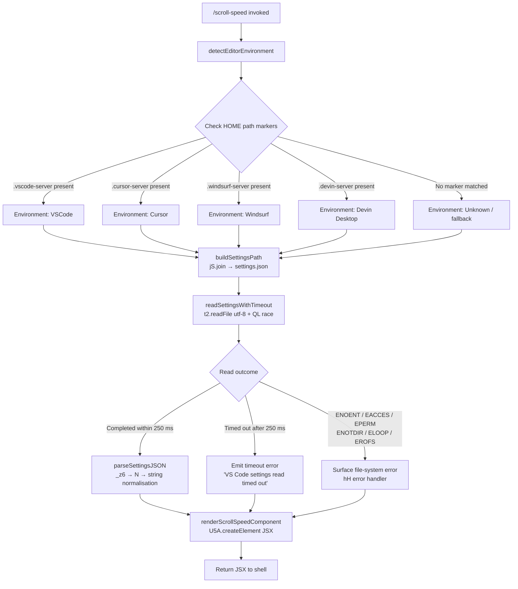

# `/scroll-speed`

> Analysis basis: CC v2.1.170 bundle.js (AST extraction + Claude interpretation)
> Minimum version: v2.1.170

---

## Overview

`/scroll-speed` is a local JSX command that adjusts the mouse wheel scroll speed within the Claude Code interface. It detects the host editor environment (VS Code, Cursor, Windsurf, or Devin Desktop) by inspecting server path markers, reads the editor's `settings.json` file with a bounded timeout, and renders a JSX component to surface or apply the scroll-speed setting.

---

## Registration

| Field | Value |
|---|---|
| type | `local-jsx` |
| name | `scroll-speed` |
| description | Adjust mouse wheel scroll speed |
| loc_byte | `12412510` |
| loc_byte_end | `12412758` |
| loc_line | `8689` |
| module_id | `m9K` |
| load_inline | `true` |
| arbor_handler.name | `Spf` |
| arbor_handler.fqn | `claude-2.1.170::Spf` |
| arbor_handler.kind | `AsyncFunction` |
| arbor_handler.resolution_path | `module_id` |
| arbor_handler.n_hits | `0` |

Analysis basis: CC v2.1.170 bundle.js:+12412510

---

## Input Branching

The command has 4+ distinct branches driven by editor environment detection and file-read outcomes, so a Mermaid flowchart is used.



Analysis basis: CC v2.1.170 bundle.js:+12412273 (handler entry), +12412282 (250 ms timeout), +12412286 (timeout string), +4082042 (readFile), +4082075 (settings.json), +4077868 (path marker checks)

---

## Behavioral Spec

### 1. Handler Entry — `scrollSpeedHandler` (Spf)

```
async function scrollSpeedHandler(context):
    result = await withTimeout(readEditorSettings(), 250)
    // 250 ms hard cap — Analysis basis: CC v2.1.170 bundle.js:+12412282
    if result is timeout:
        errorMessage = "VS Code settings read timed out"
        // Analysis basis: CC v2.1.170 bundle.js:+12412286
    jsxElement = createScrollSpeedElement(result, context)
    return jsxElement
```

Analysis basis: CC v2.1.170 bundle.js:+12412273

---

### 2. Timeout Helper — `withTimeout` (QL)

```
function withTimeout(promise, ms):
    timeoutHandle = setTimeout(resolve_with_sentinel, ms)
    // ms = 0 sentinel used internally — Analysis basis: CC v2.1.170 bundle.js:+2464179
    winner = await Promise.race([promise, timeoutSignal])
    // Analysis basis: CC v2.1.170 bundle.js:+2464134
    clearTimeout(timeoutHandle)
    // Analysis basis: CC v2.1.170 bundle.js:+2464181
    return winner
```

Analysis basis: CC v2.1.170 bundle.js:+2464103

---

### 3. Editor Settings Reader — `readEditorSettings` (PI_)

```
async function readEditorSettings():
    editorKind = detectEditorEnvironment()   // calls y38 / _iL
    settingsPath = pathJoin(configDir, "settings.json")
    // literal "settings.json" — Analysis basis: CC v2.1.170 bundle.js:+4082075
    raw = await t2.readFile(settingsPath, "utf-8")
    // encoding "utf-8" — Analysis basis: CC v2.1.170 bundle.js:+4082102
    parsed = parseAndNormalise(raw)          // calls _z6
    validated = validateArrayShape(parsed)   // calls XI_
    return { editorKind, settings: validated }
```

Analysis basis: CC v2.1.170 bundle.js:+4082042

---

### 4. Editor Environment Detection — `detectEditorEnvironment` (y38)

```
function detectEditorEnvironment(homePath):
    SERVER_MARKERS = [
        { marker: ".vscode-server",   label: "VSCode"        },
        { marker: ".cursor-server",   label: "Cursor"        },
        { marker: ".windsurf-server", label: "Windsurf"      },
        { marker: ".devin-server",    label: "Devin Desktop" },
    ]
    // marker literals — Analysis basis: CC v2.1.170 bundle.js:+4077879,+4077909,+4077939,+4077971
    for each entry in SERVER_MARKERS:
        if H.includes(homePath, entry.marker):    // Analysis basis: +4077868
            return entry.label
        if _.includes(altPath, entry.marker):     // Analysis basis: +4077989
            return entry.label
    return null   // unknown / not in a recognised remote-server environment
```

The display labels for each editor are the canonical strings `"VSCode"`, `"Cursor"`, `"Devin Desktop"`, and `"windsurf"` (note lowercase for Windsurf's own label).
Analysis basis: CC v2.1.170 bundle.js:+4082346, +4082374, +4082404, +4082387

---

### 5. Settings Path Normaliser — `normaliseSettingsPath` (_z6)

```
function normaliseSettingsPath(rawPath):
    parts = splitOnPrefix(rawPath)          // ku: startsWith + slice
    // Analysis basis: CC v2.1.170 bundle.js:+1147739, +1147762
    structured = buildStructuredPath(parts) // N: wFH + PeK branch
    if path contains "debug":              // literal "debug" — +208941
        applyDebugHandling(structured)
    return String(structured)              // explicit String cast — +1148090
```

Error outcome: if normalisation fails the string `"error"` is produced as the error-kind marker (Analysis basis: CC v2.1.170 bundle.js:+1148109).

---

### 6. Token / Content Normaliser — `normaliseTokenContent` (N)

```
function normaliseTokenContent(token):
    base = applyBaseTransform(token)       // wFH — Analysis basis: +208965
    if token requires redaction:
        token = "[REDACTED]"               // literal — Analysis basis: +200623
    if token.includes("debug"):            // Analysis basis: +209005
        applyDebugVariant(token)           // CH → JSON.stringify — +187635
    upper = token.toUpperCase()            // Analysis basis: +209067
    trimmed = token.trim()                 // Analysis basis: +209090
    return buildFinalToken(upper, trimmed) // zFH → yZA — +209112
```

Size limits observed in the call chain: 1 000 and 100 (Analysis basis: CC v2.1.170 bundle.js:+208772, +208791).

---

### 7. Error Handler — `settingsErrorHandler` (hH)

```
function settingsErrorHandler(err):
    kind = classifyError(err)              // jA: Error + String — +177416
    code = err.code                        // literal "code" — +177536
    FILESYSTEM_CODES = [
        "ENOENT", "EACCES", "EPERM",
        "ENOTDIR", "ELOOP", "EROFS"
    ]
    // Analysis basis: CC v2.1.170 bundle.js:+178464 … +178533
    if code in FILESYSTEM_CODES:
        surfaceFilesystemError(code)       // V8 — +178447
    else:
        enqueueToErrorLog(err)             // lN4: shift + push — +1019277, +1019289
        pushToFeedbackQueue(err)           // fQH.push — +1019957
        logError(err)                      // go.logError — +1019997
```

Analysis basis: CC v2.1.170 bundle.js:+1019597

---

### 8. JSX Render — `renderScrollSpeedComponent` (Spf → U5A.createElement)

```
function renderScrollSpeedComponent(settingsResult, context):
    element = U5A.createElement(ScrollSpeedWidget, {
        settings: settingsResult,
        context:  context,
    })
    // Analysis basis: CC v2.1.170 bundle.js:+12412344
    return element
```

The returned JSX element is handed back to the Claude Code shell for display.

---

## State & Side Effects

| Item | Detail |
|---|---|
| Telemetry | None detected in depth-2 traversal |
| File I/O | Reads `settings.json` from the detected editor's config directory (utf-8, async) |
| Timeout | 250 ms hard cap on the settings file read; surfaces `"VS Code settings read timed out"` on expiry |
| Error logging | Unclassified errors are pushed to an internal feedback queue via `fQH.push` and emitted through `go.logError` |
| appState changes | <!-- TODO: not found in depth-2 traversal; needs --depth 4 --> |
| Sound | None detected |
| Hook registration | None detected |

---

## Version History

| Version | Change |
|---|---|
| v2.1.170 | Initial analysis |

---

## Common Mistakes

1. **Assuming the command works in all terminal environments.** Environment detection relies on specific path markers (`.vscode-server`, `.cursor-server`, etc.). Running Claude Code outside one of these four recognised remote-server setups will result in an unknown editor kind and the command may surface no useful setting.
2. **Expecting an instant response on slow file systems.** The settings read is capped at 250 ms. On network-mounted home directories or heavily loaded systems the read will time out and the command will report the timeout message rather than the actual value.
3. **Confusing the `windsurf` vs `Windsurf` capitalisation.** The detection marker is `".windsurf-server"` (lower-case) while the display label stored internally is `"windsurf"` (lower-case), whereas VS Code and Cursor use title-case labels. Scripts that match on the label should use case-insensitive comparison.
4. **Treating ENOENT as a fatal error.** If `settings.json` does not exist (fresh install, no user settings), the handler classifies it as a known filesystem code and surfaces a non-fatal UI message rather than crashing.

---

## Appendix — Identifier Mapping

> For bundle debugging only. Identifiers change across versions.

| Identifier | Role |
|---|---|
| `Spf` | Main async handler for `/scroll-speed` (`scrollSpeedHandler`) |
| `QL` | Generic promise-with-timeout utility (`withTimeout`) |
| `PI_` | Editor settings reader — detects environment, reads file, parses result (`readEditorSettings`) |
| `_iL` | Helper called during editor environment initialisation |
| `y38` | Editor environment detector — checks HOME path markers (`detectEditorEnvironment`) |
| `H` | Path / string utility bag (includes `Math.random`, `setTimeout`) |
| `_` | Secondary path / string utility (includes `includes`) |
| `_z6` | Settings path normaliser (`normaliseSettingsPath`) |
| `ku` | Prefix-split helper inside path normaliser (startsWith + slice) |
| `N` | Token content normaliser (`normaliseTokenContent`) |
| `PeK` | Sub-transform within token normaliser |
| `CH` | JSON-stringify wrapper used for debug variant |
| `u4` | Token redaction and replacement helper |
| `zFH` | Final token builder (calls `yZA`) |
| `EeK` | File-writing / content-encoding sub-routine within the normaliser chain |
| `XI_` | Array shape validator (`Array.isArray` wrapper) |
| `P9` | Filesystem error classifier helper |
| `V8` | Known filesystem error code surface handler |
| `hH` | Settings error handler (`settingsErrorHandler`) |
| `jA` | Error type constructor / classifier |
| `_6` | String coercion utility |
| `hq` | Error-queue helper (calls `ImA`) |
| `ImA` | Inner error-queue formatter (calls `_6`) |
| `lN4` | Circular error-log queue manager (shift + push) |

---

Note: index built via Arbor fallback; some signals (telemetry, literals) may be missing — see arbor-fallback.js.