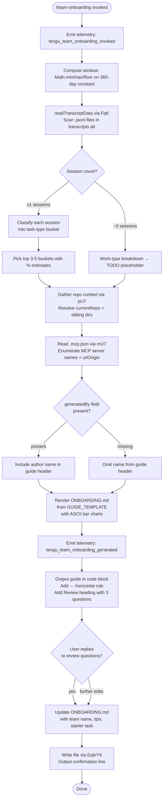

# `/team-onboarding`

> Analysis basis: CC v2.1.173 bundle.js (AST extraction + Claude interpretation)
> Minimum version: v2.1.173

---

## Overview

`/team-onboarding` is a `prompt`-type slash command that analyzes the invoking user's recent Claude Code session transcripts (up to the last 365 days) and co-authors a personalized `ONBOARDING.md` guide for their teammates. The command gathers local transcript data, classifies work patterns into task-type categories, infers repository and MCP server context, and then writes a draft guide collaboratively — asking three targeted follow-up questions before finalizing and saving the file.

---

## Registration

| Field | Value |
|---|---|
| type | `prompt` |
| name | `team-onboarding` |
| description | `Help teammates ramp on Claude Code with a guide from your usage` |
| isHidden | `false` |
| handler_method | `getPromptForCommand` |
| handler_method_start (loc_byte) | `12326897` |
| handler_method_end (loc_byte) | `12327607` |
| loc_byte | `12326559` |
| loc_byte_end | `12327608` |
| loc_line | `8550` |
| prompt_body.length | `4539` characters |
| prompt_body.trace | `identifier→$ (local→1 ext vars)` |
| arbor_handler.name | `getPromptForCommand` |
| arbor_handler.kind | `Method` |
| arbor_handler.resolution_path | `direct` |
| arbor_handler.fqn | `claude-2.1.173::getPromptForCommand` |
| arbor_handler.n_hits | `2` |
| `handler_method_start` | `12326897` |
| `handler_method_end` | `12327607` |

Analysis basis: CC v2.1.173 bundle.js:+12326559

---

## Input Branching

The handler exhibits more than three distinct decision paths: transcript data collection (with or without available sessions), session classification (known type vs. invented category vs. zero sessions), MCP server enumeration (present vs. absent), and the multi-turn revision loop. A Mermaid flowchart is used.



Analysis basis: CC v2.1.173 bundle.js:+12326897

---

## Behavioral Spec

### 1. Handler Entry and Window Computation

```
function getPromptForCommand(context):
    emit_telemetry("tengu_flint_harbor_prompt")        // loc_byte 12326934
    emit_telemetry("tengu_team_onboarding_invoked")    // loc_byte 12327157

    WINDOW_DAYS = Math.floor(
        Math.min(365, Math.max(1, configured_window))  // 365 constant loc_byte 12327146
    )

    usage_data   = collectTranscriptData(WINDOW_DAYS)
    repo_context = resolveRepoContext()
    mcp_config   = readMcpConfig()

    prompt = buildPrompt(WINDOW_DAYS, usage_data, repo_context, mcp_config)
    return prompt
```

Analysis basis: CC v2.1.173 bundle.js:+12327100 (Math.min), +12327109 (Math.max), +12327118 (Math.floor), +12327146 (365 constant)

---

### 2. Transcript Collection (`collectTranscriptData` / `FqK`)

```
async function collectTranscriptData(windowDays):
    cutoff = Date.now() - (windowDays * 24 * 60 * 60 * 1000)
    // 24-hour and 60-minute constants: loc_byte 12315395, 12315398

    entries = await fs.readdir(transcriptsDirectory)
    jsonlFiles = entries.filter(f => path.extname(f) == ".jsonl")  // ".jsonl" loc_byte 12315510

    results = await Promise.all(jsonlFiles.map(async file =>
        stat = await fs.stat(path.join(transcriptsDirectory, file))
        if not stat.isFile(): return null

        if stat.mtime < cutoff: return null

        raw = await fs.readFile(file, encoding)
        lines = raw.split("\n")

        sessionDescriptors = []
        for each line in lines:
            if line includes '"name":"mcp__':   // literal loc_byte 12316089
                extract MCP tool usage count
            match prNumber patterns via RU7, CU7 regexes
            match content array via bU7 regex    // '"content":[' loc_byte 12316439
            extract firstUserMessage (up to 3 lines)  // number 3 loc_byte 12316542
            if line starts with known prefix:
                extract session title

        return sessionDescriptors
    ))
    return results.flat().filter(Boolean)
```

Analysis basis: CC v2.1.173 bundle.js:+12315382 (Date.now), +12315423 (readdir), +12315450 (T9/N8 error handler), +12315493 (extname), +12315529 (Promise.all), +12315766 (readFile), +12315880 (split)

---

### 3. Repo Context Resolution (`resolveRepoContext` / `pU7`)

```
async function resolveRepoContext():
    // Resolve projects directory path via Su/MI (path.join + "projects" literal)
    // loc_byte 12317922 (P_/BG), 12317929 (Su)

    gitUserName = await runProcess("git", ["config", "user.name"])
    // literals: "git" loc_byte 12318244, "config" 12318251, "user.name" 12318260

    gitRemoteOrigin = await runProcess("git", ["remote", "get-url", "origin"])
    // literals: "remote" 12318316, "get-url" 12318325, "origin" 12318335

    currentRepo = path.basename(resolvedProjectPath)
    // via sp8.basename loc_byte 12318432

    siblingRepos = scanWorkspaceForSiblingDirs()
    // via uU7 loc_byte 12318211

    generatedBy = lvH(gitUserName)  // name extraction + normalization
    // lvH: trim, match, slice, split, toLowerCase — loc_byte 12318424

    return { currentRepo, siblingRepos, generatedBy }
```

Analysis basis: CC v2.1.173 bundle.js:+12318060 (mU7 entry), +12318241 (u_), +12318386 (CH/stringify), +12318424 (lvH), +12318432 (basename)

---

### 4. MCP Config Reading (`readMcpConfig` / `mU7`)

```
async function readMcpConfig():
    mcpConfigPath = path.join(projectRoot, ".mcp.json")
    // ".mcp.json" literal loc_byte 12317621

    try:
        raw = await fs.readFile(mcpConfigPath)
        parsed = JSON.parse(raw)                  // via n6 loc_byte 12317644
        servers = parsed["mcpServers"]            // "mcpServers" literal loc_byte 12317677
        if servers is null: return []
        return Object.entries(servers).map(([name, cfg]) =>
            urlOrigin = cfg.url ? extractOrigin(cfg.url) : null
            return { name, urlOrigin }
        )
    catch R8 (permission / EACCES / EPERM errors):  // R8 loc_byte 12317773
        return []
    catch N (general errors):                        // N loc_byte 12317779
        return []
```

Analysis basis: CC v2.1.173 bundle.js:+12317597 (QqK.readFile), +12317610 (sp8.join), +12317644 (n6/JSON.parse), +12317677 ("mcpServers"), +12317773 (R8 error), +12317779 (N fallback)

---

### 5. Prompt Assembly and Template Substitution

```
function buildPrompt(windowDays, usageData, repoContext, mcpConfig):
    // Handler calls _.replaceAll three times to fill template variables
    // loc_byte 12327344

    prompt = PROMPT_TEMPLATE
    prompt = prompt.replaceAll("{{WINDOW_DAYS}}", String(windowDays))
    // "{{WINDOW_DAYS}}" literal loc_byte 12327357
    // String() call loc_byte 12327375

    prompt = prompt.replaceAll("{{USAGE_DATA}}", JSON.stringify(usageData))
    // "{{USAGE_DATA}}" literal loc_byte 12327432
    // via c loc_byte 12327155

    prompt = prompt.replaceAll("{{GUIDE_TEMPLATE}}", guideTemplate)
    // "{{GUIDE_TEMPLATE}}" literal loc_byte 12327397

    emit_telemetry("tengu_team_onboarding_generated")  // loc_byte 12327476

    return { role: "user", content: [{ type: "text", content: prompt }] }
    // "text" literal loc_byte 12327591
```

Analysis basis: CC v2.1.173 bundle.js:+12327344 (replaceAll), +12327357 ("{{WINDOW_DAYS}}"), +12327375 (String), +12327397 ("{{GUIDE_TEMPLATE}}"), +12327432 ("{{USAGE_DATA}}"), +12327476 (telemetry), +12327591 ("text")

---

### 6. Agent-Side Guide Generation (prompt instructions, not handler code)

The assembled prompt instructs the agent to execute a five-step collaborative workflow:

**Step 1 — Immediate acknowledgment.** The agent must output a specific acknowledgment line (citing usage window and intent) as the very first visible text, before any reasoning, classification, or tool calls. This is an explicit ordering constraint in the prompt body.

Analysis basis: CC v2.1.173 bundle.js:+12326897 (prompt body start)

**Step 2 — Work-type breakdown.** The agent reads the `sessionDescriptors` array injected into `{{USAGE_DATA}}`. Each session entry carries: a title, optional `prNumbers` array, and a first user message. The agent classifies each session into one of seven canonical task types:

| Internal key | Display label |
|---|---|
| `build_feature` | Build Feature |
| `debug_fix` | Debug Fix |
| `improve_quality` | Improve Quality |
| `analyze_data` | Analyze Data |
| `plan_design` | Plan Design |
| `prototype` | Prototype |
| `write_docs` | Write Docs |

The agent selects the top 3–5 categories with rough percentage estimates. If `sessionDescriptors` is empty, the breakdown section is left as a `TODO`. New categories should only be invented if no existing type fits.

Analysis basis: CC v2.1.173 bundle.js:+12326897

**Step 3 — Context gathering.** The agent uses `currentRepo` from the injected data plus workspace directory scanning for sibling repos. For each MCP server entry it uses `name` and `urlOrigin` (when present) to describe the server and access method for new teammates.

**Step 4 — Guide authoring.** The agent writes `ONBOARDING.md` using the `{{GUIDE_TEMPLATE}}` structure. Requirements:
- Fill in real numeric values from the usage data (no placeholder text).
- Use `generatedBy` field for the author name; if absent, omit the name entirely.
- Render ASCII bar charts using `█` (filled) and `░` (empty), 20 characters wide.
- Leave Team Tips and Get Started sections as `TODO` placeholders.
- Preserve the HTML comment instruction at the template footer exactly.

**Step 5 — Review loop.** After rendering the guide in a fenced code block, the agent adds a `---` horizontal rule and a `**Review**` heading, then poses exactly three numbered questions:
1. Confirm or request the team name.
2. Ask for an optional starter task (ticket or doc link).
3. Ask for team tips not already in `CLAUDE.md`.

After the user replies, the agent updates `ONBOARDING.md` with the provided information and outputs a fixed closing confirmation line directing the user to share the file. Any subsequent edit requests are applied directly to the file.

Analysis basis: CC v2.1.173 bundle.js:+12326897–12327607

---

### 7. File Write and Harbor Share (`Eq6` / `fileWriteHelper`)

```
async function fileWriteHelper(path, content):
    // Eq6 calls Rq (lock/config helper) loc_byte 10103828
    // then BE (write helper, via W9) loc_byte 10103846
    // then Y6 (session/transcript store update) loc_byte 10103867
    emit_telemetry("tengu_flint_harbor_share")  // loc_byte 10103870
    // Y6 internally uses the transcript store path and E8 (config read)
    writeFileAtomically(path, content)
```

Analysis basis: CC v2.1.173 bundle.js:+12327453 (Eq6), +10103828 (Rq), +10103846 (BE/W9), +10103867 (Y6), +10103870 (telemetry)

---

## State & Side Effects

| Item | Detail |
|---|---|
| Telemetry — invocation | `tengu_flint_harbor_prompt` (loc_byte 12326934) |
| Telemetry — invocation confirmed | `tengu_team_onboarding_invoked` (loc_byte 12327157) |
| Telemetry — guide generated | `tengu_team_onboarding_generated` (loc_byte 12327476) |
| Telemetry — file shared | `tengu_flint_harbor_share` (loc_byte 10103870) |
| Telemetry — config errors (indirect) | `tengu_config_parse_error`, `tengu_config_lock_contention`, `tengu_config_stale_write`, `tengu_config_auth_loss_prevented` |
| File system reads | `~/.config/claude/transcripts/*.jsonl` (filtered by mtime within window) |
| File system reads | `.mcp.json` in project root |
| File system reads | `git config user.name`, `git remote get-url origin` (subprocess) |
| File system writes | `ONBOARDING.md` in current working directory (atomic write via Cz6) |
| Config lock | Acquires write lock via `Q78`/`LZ_` for config-adjacent operations |
| appState changes | Session descriptor list updated via `Y6` after file write |
| Hook registration | `y9` → `yZA.register` (file-watch hook for transcript files, loc_byte 63751) |
| Sound | None detected in depth-2 traversal |
| Window constant | 365 days maximum (loc_byte 12327146) |

---

## Version History

| Version | Change |
|---|---|
| v2.1.173 | Initial analysis |

---

## Common Mistakes

1. **Running the command in a directory with no Claude Code transcript history.** If the `~/.config/claude/transcripts/` directory is empty or all files fall outside the computed window, `{{USAGE_DATA}}` will be empty and the agent will leave the work-type breakdown as a `TODO`. Run the command in a workspace where you have active Claude Code sessions.

2. **Expecting the guide to include Team Tips immediately.** By design the prompt instructs the agent to leave Team Tips and Get Started as `TODO` placeholders in the first draft. These are filled in only after the user responds to the three Review questions.

3. **Ignoring the Review questions and closing the session.** If the user does not answer the three Review questions, `ONBOARDING.md` will be written without a confirmed team name, starter task, or team tips. The agent is instructed to wait for that reply before finalizing the file.

4. **Pasting the generated `ONBOARDING.md` into Claude Code on a machine where `.mcp.json` is absent.** If MCP servers are not configured in the project, the MCP setup section of the guide will be empty or minimal. The guide creator should verify the MCP section reflects their actual team setup.

5. **Assuming the `generatedBy` name is always present.** The `git config user.name` lookup can fail silently; when it does, the author name is omitted from the guide header rather than showing a placeholder. This is intentional and not a bug.

6. **Expecting an interactive prompt for the window size.** The 365-day window is a hard constant computed via `Math.min`/`Math.max`/`Math.floor` at invocation time (loc_byte 12327146); there is no user-facing parameter to change it in v2.1.173.

---

## Appendix — Identifier Mapping

> For bundle debugging only. Identifiers change across versions.

| Identifier | Role |
|---|---|
| `__handler_team-onboarding` | Synthetic BFS entry point for the command handler (not a real bundle symbol) |
| `Y6` | Session/transcript store — read and update after file write |
| `I26` | Transcript store initializer (sub-call of Y6) |
| `k26` | Transcript store key resolver (sub-call of Y6) |
| `Ym` | Transcript store getter (sub-call of Y6) |
| `eu` | Async event emitter / observable base |
| `nC` | Observable subscription helper |
| `I78` | Deduplication guard for transcript entries |
| `qJ_` | Experiment/growthbook event recorder |
| `ThH` | Growthbook event type resolver |
| `QB` | Hex token generator (32 random bytes → hex) |
| `CH` | JSON serializer wrapper |
| `rX4` | Event payload sanitizer |
| `LZ_` | Config write-with-lock orchestrator |
| `$u1` | Lock-path helper |
| `B_` | Config backup helper |
| `W_9` | Config migration helper |
| `J8H` | Feature-flag set membership checker |
| `b6` | Atomic config file writer |
| `o6` | Path resolver utility |
| `PZ_` | Config directory resolver |
| `G7H` | Config file reader with backup/rotation |
| `q` | Node `fs` module reference (data-dir scoped) |
| `n6` | JSON.parse wrapper with error normalization |
| `bu` | String prefix stripper (startsWith + slice) |
| `_` | General-purpose utility / `fs`-like object |
| `N8` | Permission-error classifier |
| `C_9` | Directory listing helper (readdirStringSync) |
| `N` | Template string formatter / uppercaser |
| `c` | App-state / context object |
| `GZ_` | Backup directory path builder |
| `D` | Daemon session manager / process supervisor |
| `Zx4` | File-watch subscription manager |
| `wF` | File-change event debouncer |
| `y9` | Hook registration entry point |
| `E8` | Global config reader (with cache) |
| `Q78` | Config read/write with lock and backup |
| `f` | Secondary `fs` module reference (config-scoped) |
| `L` | Stream / connection lifecycle manager |
| `UV1` | Config schema merger (Object.assign wrapper) |
| `lY_` | Config schema validator |
| `urH` | Auth field presence checker |
| `A` | Process / session map |
| `V` | Config version string holder |
| `P` | IPC/socket protocol handler |
| `X` | Socket read-stream buffer |
| `j` | Process kill / values iterator |
| `I7` | Stream end + serialize helper |
| `p05` | Daemon IPC message dispatcher |
| `EH` | String coercion wrapper |
| `E` | Slice / clamp utility |
| `W` | SDK connection manager |
| `Cz6` | Atomic file write (temp → rename) |
| `O` | Symbolic-link / stat result object |
| `R8` | Permission / EACCES error normalizer |
| `H` | Random-delay / setTimeout wrapper |
| `AJH` | Config field accessor for global config |
| `R_9` | Object.entries iterator for config sections |
| `u26` | Timestamp recorder (Date.now) |
| `g78` | Config file path + atomic-write coordinator |
| `pU7` | Repo and git-context collector |
| `P_` | Project-path resolver base |
| `BG` | Home/config directory accessor |
| `Su` | Project directory path builder |
| `MI` | Projects sub-directory resolver |
| `Sw` | Path relativizer / normalizer |
| `lRf` | Absolute-path length comparator |
| `FqK` | Transcript file scanner and session descriptor extractor |
| `T9` | N8-based error handler for readdir |
| `K` | Array map + padEnd formatting helper |
| `$` | Top-level module / ZwK loader |
| `ZwK` | Module cache / lazy-load coordinator |
| `z` | OS / platform capability bundle |
| `kH` | Feature-flag "ok" reporter |
| `bH` | Feature-flag "bad" reporter |
| `wS` | Observable push helper |
| `CU` | Process-exit race/promise coordinator |
| `Y` | Abort / forced-shutdown handler |
| `HX` | Forced-shutdown cleanup |
| `mU7` | `.mcp.json` config reader |
| `uU7` | Sibling workspace directory scanner |
| `u_` | Subprocess runner (execa wrapper) |
| `gvH` | Child-process spawn and lifecycle manager |
| `UQA` | Process argument builder (win32 aware) |
| `Dq_` | kQA-based process option resolver |
| `jq_` | kQA + ybf process option extender |
| `Xq_` | Cbf capability checker |
| `ngA` | Number.isFinite / TypeError guard |
| `xz6` | rCf / Error / Boolean process error classifier |
| `Yq_` | Reflect.apply / defineProperty proxy helper |
| `ZQA` | EventEmitter `.on("exit")` binding |
| `lgA` | Timeout + Promise.race cancellation helper |
| `igA` | Xa / kill / finally process termination helper |
| `dgA` | Process stdin/eCf data handler |
| `cgA` | H.kill signal sender |
| `TQA` | wq_ / Promise.all / zq_ process wait helper |
| `Uz6` | n9_ process output accumulator |
| `WQA` | vbf / Uo6 / pipe stdout handler |
| `GQA` | JQA.default / add stderr collector |
| `sgA` | Aq_.bind stdout-line emitter |
| `pbf` | String coercion for process output |
| `v3` | Process output validator |
| `SH` | Subprocess error logger / rQH pusher |
| `JA` | Error + String normalizer |
| `f6` | String formatter for log output |
| `Rq` | CBA-based config lock acquirer |
| `MRf` | Lo6 shift/push lock-queue manager |
| `lvH` | Git user-name extractor (trim + match + split) |
| `Yxf` | M9-based string index/slice helper |
| `M9` | H.indexOf + H.slice string slicer |
| `Eq6` | File write orchestrator (Rq + BE + Y6) |
| `BE` | W9-based file write dispatcher |