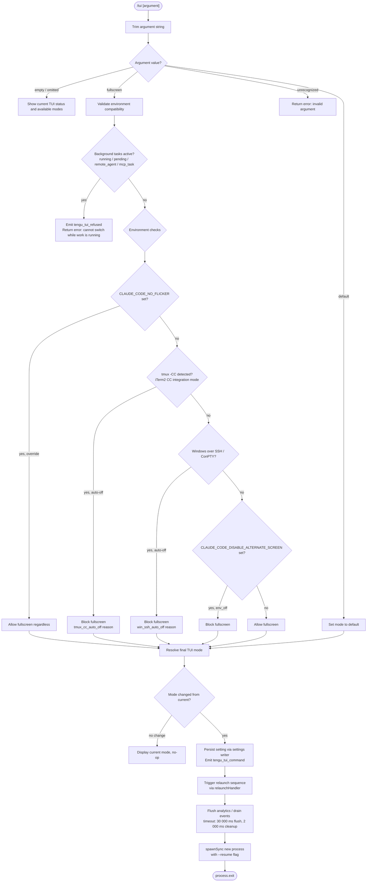

# `/tui`

> Analysis basis: CC v2.1.173 bundle.js (AST extraction + Claude interpretation)
> Minimum version: v2.1.173

---

## Overview

The `/tui` command switches the terminal UI renderer between `default` and `fullscreen` modes for sessions started directly with `claude`. It inspects the current environment (terminal emulator, OS, SSH conditions, active background tasks, and existing settings) to determine whether fullscreen mode is permissible, and applies the change immediately by triggering a process relaunch sequence if needed.

---

## Registration

| Field | Value |
|---|---|
| type | `local-jsx` |
| name | `tui` |
| description | `Set the terminal UI renderer (default \| fullscreen)` |
| argumentHint | `[default\|fullscreen]` |
| module_id | `M7K` |
| load_inline | `true` |
| loc_byte | `12632724` |
| loc_byte_end | `12632906` |
| loc_line | `8899` |
| arbor_handler.name | `wd7` |
| arbor_handler.fqn | `claude-2.1.173::wd7` |
| arbor_handler.kind | `AsyncFunction` |
| arbor_handler.resolution_path | `module_id` |
| arbor_handler.n_hits | `0` |

Analysis basis: CC v2.1.173 bundle.js:+12632724

---

## Input Branching

The command has more than three distinct decision paths (argument validation, background-task guard, environment compatibility checks, mode resolution, and relaunch), so a Mermaid flowchart is used.



Analysis basis: CC v2.1.173 bundle.js:+12630487 (handler entry), +12631282 (guard), +12631323 (guard message), +12631755 (telemetry), +12625820 (--resume flag), +12625887 (flush timeout)

---

## Behavioral Spec

### Handler Entry — Argument Parsing

```
async function tuiCommandHandler(userInput, appContext):
    rawArg = userInput.trim()                   // A.trim @ +12630487

    validModes = ["fullscreen", "default"]       // b$A @ +12630599, +12630645

    if rawArg is empty:
        return renderCurrentStatusPanel(appContext)

    if rawArg not in validModes:
        return renderError("unknown mode: " + rawArg)

    requestedMode = rawArg
```

Analysis basis: CC v2.1.173 bundle.js:+12630487, +12630599, +12630645

---

### Background-Task Guard

The handler queries active background work before allowing a renderer switch. Any session in one of four states (`running`, `pending`, `remote_agent`, `mcp_task`) causes an immediate refusal.

```
function checkBackgroundTasks(appContext):
    activeSessions = Object.values(appContext.sessions)
                           .filter(s => s.status in
                               ["running", "pending", "remote_agent", "mcp_task"])

    if activeSessions.length > 0:
        emit telemetry("tengu_tui_refused")     // +12631282
        return Error(
            "Cannot switch renderers while work is running in the background"
            + " — wait for it to finish (or stop it via /tasks), then run /tui again."
        )                                        // +12631323

    return null
```

Analysis basis: CC v2.1.173 bundle.js:+12631154, +12631193, +12631215, +12631236, +12631261, +12631282, +12631323

---

### Environment Compatibility Resolver

Resolves the effective TUI mode by layering environment signals in priority order. The resolver (`v1` / `XJH` in the bundle) returns a structured object that includes the final mode and the reason code.

```
function resolveEffectiveTuiMode(requestedMode, env):

    // Background sessions always use fullscreen, exempt from this check
    if env.isDaemonWorkerSession:                        // "daemon-worker" @ +2269166
        return note("Background sessions always use the fullscreen renderer …")
                                                         // +12630797

    // Override ladder (highest priority first)
    if env.CLAUDE_CODE_NO_FLICKER is set:
        flickerOverride = true                           // env_off / env_on @ +3504729, +3504779

    if env.TERM_PROGRAM includes "tmux" AND env.isTmuxCCMode:
        return { mode: "default", reason: "tmux_cc_auto_off",
                 message: "fullscreen disabled: tmux -CC (iTerm2 integration mode) detected …" }
                                                         // +3503954, +3504803

    if env.platform == "windows" AND env.isSSH:
        return { mode: "default", reason: "win_ssh_auto_off",
                 message: "fullscreen disabled: Windows over SSH (ConPTY re-rendering) detected …" }
                                                         // +3504140, +3504837

    if env.CLAUDE_CODE_DISABLE_ALTERNATE_SCREEN is set:
        return { mode: "default", reason: "env_off" }   // +3504729

    // Terminal-capability checks (ghostty ≥1.2.0, iTerm.app ≥3.6.6, xterm.js, cursor/vscode)
    capabilityResult = checkTerminalCapabilities(env)    // rI / Bg4 @ +12631622

    // Gradual-rollout / feature-flag gate
    if featureFlag("CLAUDE_CODE_FORCE_FULLSCREEN_UPSELL"):   // +12627904
        return { mode: "fullscreen", reason: "gb_on" }   // +3505068

    // Settings-layer value (user or project settings.json)
    return { mode: requestedMode, reason: "settings_on" OR "settings_off" }
             // +3504896, +3504930
```

Analysis basis: CC v2.1.173 bundle.js:+3503954, +3504140, +3504288, +3504314, +3504699–3505076, +12630797

Reason codes surfaced by the resolver:

| Reason code | Meaning |
|---|---|
| `bg_forced_on` | Background session forces fullscreen |
| `env_off` | `CLAUDE_CODE_DISABLE_ALTERNATE_SCREEN` is set |
| `env_on` | `CLAUDE_CODE_NO_FLICKER` override active |
| `tmux_cc_auto_off` | tmux -CC (iTerm2 control-mode) auto-disabled |
| `win_ssh_auto_off` | Windows SSH / ConPTY auto-disabled |
| `settings_on` | Explicitly enabled in settings |
| `settings_off` | Explicitly disabled in settings |
| `downsell_on` | Downgrade path active |
| `gb_on` | Gradual-rollout gate on |
| `gb_off` | Gradual-rollout gate off |

Analysis basis: CC v2.1.173 bundle.js:+3504699–3505076

---

### Status Display (no-argument path)

When the user calls `/tui` without an argument, the handler renders a read-only status panel. It collects:
1. The current effective mode (via `resolveEffectiveTuiMode`).
2. The reason code explaining how the mode was determined.
3. Whether any sessions are active (and their statuses).
4. A note about background sessions always using fullscreen (`+12630797`).

```
function renderCurrentStatusPanel(appContext):
    currentResolution = resolveEffectiveTuiMode(currentSetting, process.env)
    return JSX panel showing:
        - current mode
        - reason code
        - active session count
        - instructional hint for /tasks
```

Analysis basis: CC v2.1.173 bundle.js:+12630557, +12630773, +12630783

---

### Settings Persistence and Relaunch

When a mode change is confirmed, the handler persists the new value to the user settings layer (`settings.json`) and initiates a relaunch sequence identical to the one used for other reload-required commands.

```
async function persistAndRelaunch(newMode, appContext):
    writeUserSetting("tui", newMode)            // AA / Ka6 settings writer @ +12631511

    emit telemetry("tengu_tui_command",         // +12631755
                   { timing: same_session OR later_session,
                     uptime: Math.round(process.uptime()) })
                                                 // +12631857, +12632219, +12632234

    // Orderly shutdown
    stopIntervalTimers()                         // BN6 / $c_ @ +12625842
    unmountInkUI()                               // uCH @ +12625848
    triggerScrollSummary()                       // dW8 / Ce9 @ +12625854

    // Concurrent flush with timeouts
    await Promise.all([
        flushWithTimeout(analyticsQueue, 30000), // "flush timeout (relaunch)" @ +12625887/12625893
        drainEventQueue(2000),                   // "cleanup timeout" @ +12625944
        drainAnalytics()                         // "analytics flush timeout" @ +12626005
    ])

    process.removeAllListeners(["SIGINT","SIGHUP"])  // +12626360, +12626379, +12626389
    process.on("beforeExit", noop)                   // +12626535
    process.on("exit", noop)                         // +12626576

    spawnSync(process.execPath, ["--resume", ...inheritedArgs],
              { stdio: "inherit" })             // A7K.spawnSync @ +12626446, "--resume" @ +12625820

    process.exit(0)                             // +12626695
```

Analysis basis: CC v2.1.173 bundle.js:+12625820, +12625842, +12625848, +12625854, +12625866, +12625887, +12625944, +12626005, +12626248, +12626389, +12626446, +12626695, +12631511, +12631755, +12631857

---

### Terminal Capability Detection

A sub-routine (`rI` / `Bg4`) probes the environment to assign a terminal-compatibility score before permitting fullscreen mode.

```
function detectTerminalCapabilities(env):
    term = env.TERM_PROGRAM or env.TERMINAL_EMULATOR

    if term includes "cursor" OR "vscode":           // +3574750, +3574799
        // Version range check: 1092000 – 1105000   // +3574875, +3574886
        return { capable: true, kind: "cursor/vscode" }

    if term == "ghostty" AND version >= "1.2.0":     // +3571523, +3571553
        return { capable: true, kind: "ghostty" }

    if term == "iTerm.app" AND version >= "3.6.6":   // +3571592, +3571624
        return { capable: true, kind: "iTerm" }

    if term includes "xterm.js":                     // +3574919
        return { capable: true, kind: "xterm.js" }

    if dl.isJetBrainsIdeTerminal():                  // +3574074
        return { capable: false }

    // Probe alternate-screen support by writing escape sequences
    // ESC-7 (save cursor) and ESC-8 (restore cursor)   // +3843923, +3843934
    probeResult = writeEscapeProbe(ESC7, ESC8)
    score = parseFloat(probeResult)
    if Number.isNaN(score) OR score < 20:            // +3575222, +3575257
        return { capable: false }

    return { capable: true, kind: "probed", score: Math.min(score, ...) }
```

Analysis basis: CC v2.1.173 bundle.js:+3571229, +3571523, +3571553, +3571592, +3571624, +3574046, +3574074, +3574750, +3574799, +3574875, +3574886, +3574919, +3575201, +3575222, +3575257, +3843923, +3843934

---

### Context-Argument Forwarding (lU8)

When the relaunch spawns a new process it reconstructs the original CLI argument list. The argument assembler (`lU8`) iterates active contexts, appending `--add-dir` for each additional directory and forwarding security flags.

```
function buildRelaunchArgList(sessionContext):
    args = Array.from(baseArgs)                   // +12627169

    for each extraDir in sessionContext.addedDirs:
        args.push("--add-dir", extraDir)          // "--add-dir" @ +12627344

    if sessionContext.allowDangerouslySkipPermissions:
        args.push("--allow-dangerously-skip-permissions") // +12627459

    if sessionContext.effort:
        args.push("--effort", sessionContext.effort)  // +12627601

    if sessionContext.permissionMode:
        args.push("--permission-mode", sessionContext.permissionMode)  // +12627618

    return args
```

Analysis basis: CC v2.1.173 bundle.js:+12627169, +12627244, +12627265, +12627344, +12627448, +12627459, +12627563, +12627601, +12627618

---

## State & Side Effects

| Item | Detail |
|---|---|
| Telemetry — `tengu_tui_command` | Fired on every successful mode change; includes `same_session` / `later_session` timing and rounded process uptime (bundle.js:+12631755, +12632219, +12632234) |
| Telemetry — `tengu_tui_refused` | Fired when the command is blocked due to active background tasks (bundle.js:+12631282) |
| Telemetry — `tengu_scroll_summary` | Fired as part of the pre-relaunch shutdown sequence (bundle.js:+7372277) |
| Telemetry — `tengu_amber_creek` / `tengu_pewter_brook` | TUI mode feature-flag measurement events (bundle.js:+3504471, +3504379) |
| User settings mutation | Writes `tui` key to `settings.json` (user layer) via the settings-persistence subsystem |
| Process lifecycle | Calls `process.removeAllListeners`, re-registers no-op handlers, then `spawnSync` + `process.exit` — a hard relaunch |
| Ink UI unmount | Tears down the running Ink render tree before relaunch (`H.unmount`) |
| Interval timers cleared | All active intervals cancelled via `clearInterval` before relaunch |
| Hook registration | None specific to `/tui` beyond standard process-signal hooks removed pre-relaunch |
| Sound | None detected in depth-2 traversal |
| appState changes | Reads `appState` for active session statuses (via `k_` / `P$`); does not mutate appState directly |

---

## Version History

| Version | Change |
|---|---|
| v2.1.173 | Initial analysis |

---

## Common Mistakes

1. **Calling `/tui fullscreen` while background tasks are active.** The command refuses immediately and emits `tengu_tui_refused`. Use `/tasks` to inspect and stop running work first, then retry.
2. **Expecting the change to take effect without a restart.** The command always triggers a full process relaunch (`spawnSync` + `process.exit`). Any unsaved in-memory conversation state not already flushed will be lost if the flush timeout (30 000 ms) is exceeded.
3. **Assuming `/tui fullscreen` is always honoured.** Several environment conditions auto-downgrade to `default`: tmux -CC (iTerm2 integration mode), Windows-over-SSH, or `CLAUDE_CODE_DISABLE_ALTERNATE_SCREEN`. Set `CLAUDE_CODE_NO_FLICKER=1` to override the first two guards.
4. **Running `/tui` in a background/daemon session.** Background sessions always use the fullscreen renderer regardless of this setting. The setting only affects sessions started directly with `claude` in a foreground terminal.
5. **Passing an unrecognised argument** (e.g., `/tui auto`). The only accepted values are `default` and `fullscreen`; anything else produces an error without triggering a relaunch.

---

## Appendix — Identifier Mapping

> For bundle debugging only. Identifiers change across versions.

| Identifier | Role |
|---|---|
| `wd7` | Main handler for `/tui` command (AsyncFunction resolved via module_id `M7K`) |
| `Mm6` | Relaunch orchestrator called from `wd7` |
| `fEH` | Core relaunch sequence (unmount → flush → spawnSync → exit) |
| `IR` | Claude binary / version path resolver |
| `sk8` | Local version path builder |
| `hMH` | Version directory joiner |
| `A9H` | Alternative version path builder |
| `BP8` | Home-directory resolver for version paths |
| `ok` | Shared utility (context reader) used in relaunch |
| `y6` | Pre-relaunch helper |
| `BG` | Logging / background-event utility |
| `BN6` | Interval-timer canceller |
| `$c_` | `clearInterval` wrapper |
| `uCH` | Ink UI unmount controller |
| `Db` | UI teardown helper |
| `V38` | Terminal escape-sequence writer (alternate screen) |
| `UkH` | Terminal compatibility gate (ghostty / iTerm version checks) |
| `b0` | tmux / screen escape rewriter |
| `dW8` | Scroll-summary trigger (pre-relaunch) |
| `Ce9` | Scroll-summary animation / timing engine |
| `v1` | TUI mode state resolver (layers env + settings) |
| `J8H` | Feature-set membership checker |
| `cV_` | Settings sub-reader |
| `ks` | Settings key lookup helper |
| `dV_` | Platform/OS boolean deriver |
| `B_` | Render-mode applicator |
| `Np4` | Mode upsell path handler |
| `Y6` | Settings write/read coordinator |
| `XJH` | Second-pass TUI resolver (used for display) |
| `lU8` | Relaunch CLI argument list builder |
| `iZH` | Argument context iterator |
| `Nq8` | Config boolean coercer |
| `b6` | Config file watcher / reader |
| `G7H` | Config file read + backup helper |
| `Zx4` | File watch registration helper |
| `k_` | Active session state fetcher |
| `qb8` | Session state mapper (allowed_tools / working_directory) |
| `Kb8` | Session state mapper (disallowed_tools / avoid_prompts) |
| `Nb` | Permission-mode disabler |
| `P$` | App-state reader (effort / model / flag_settings) |
| `O9` | Daemon-worker context detector |
| `CDH` | Daemon-worker label constant holder |
| `AA` | Settings persistence orchestrator (write to disk) |
| `y3` | Settings path resolver entry |
| `zYH` | Settings file path builder |
| `ra6` | Settings resolve helper |
| `Fuf` | Settings file existence checker |
| `Uu` | `.claude` directory joiner |
| `Buf` | Managed-settings path builder |
| `VB` | Settings layer aggregator |
| `aK_` | Full settings load pipeline |
| `TlA` | Settings merge + object-key iterator |
| `GlA` | Settings layer combiner |
| `ZB` | Settings cache reader/writer |
| `qZA` | Cache get wrapper |
| `Ny` | `structuredClone` wrapper |
| `iK_` | Individual settings-file parser |
| `KZA` | Cache set wrapper |
| `PlA` | Inline (SDK) settings parser |
| `V4H` | Settings field validator |
| `bdH` | Settings JSON schema checker |
| `U2` | Project-root file reader |
| `ja` | File reader with encoding detection |
| `A$` | `realpathSync` wrapper |
| `Do6` | Path existence checker |
| `R8` | Logger / error reporter |
| `fK_` | Settings timestamp recorder |
| `HNH` | Settings hot-reload helper |
| `Cz6` | Atomic file writer (temp + rename) |
| `CH` | `JSON.stringify` wrapper |
| `FO` | Settings cache invalidator |
| `Ka6` | Settings write-to-disk implementation |
| `p6` | Async-storage context reader |
| `Yo6` | Store getter |
| `gq_` | Path join utility |
| `qa6` | gitignore / excludes-file checker |
| `u_` | Git command runner |
| `jxf` | Home-relative path expander |
| `PdA` | Post-write validator |
| `WdA` | Write-ineffective warning emitter |
| `t6` | Feature telemetry dispatcher (`tengu_feature_sad`) |
| `vB` | Settings load-from-disk main entry |
| `pG` | Performance mark helper |
| `fq` | Memory-usage sampler |
| `Ju` | `require("perf_hooks")` wrapper |
| `sK_` | Settings load orchestrator |
| `u8` | Append-file logger |
| `Fg6` | Settings load progress tracker |
| `Zw6` | Watched-paths set manager |
| `K` | Column padder utility |
| `Bg6` | Post-load event emitter |
| `rI` | Terminal-capability detector (main) |
| `CW6` | Terminal info reader |
| `wY` | Terminal version parser |
| `Bv_` | Cursor/VSCode terminal handler |
| `Ug4` | VSCode version range checker |
| `qw` | Fallback terminal capability path |
| `Bg4` | Alternate-screen probe scorer |
| `Fv_` | Escape-probe response parser |
| `eu` | Event-queue drain entry |
| `nC` | Analytics queue processor |
| `tJ4` | Individual analytics event sender |
| `f6` | String coercion utility |
| `B4` | HTTP request builder |
| `QO` | Analytics queue flusher |
| `vz6` | Analytics backend selector |
| `CBA` | Analytics HTTP sender |
| `p9` | Telemetry policy gate |
| `Ym1` | Telemetry mode resolver |
| `ZhH` | License-tier telemetry dispatcher |
| `oC` | Telemetry consent checker |
| `MJ6` | License file reader |
| `ILH` | Telemetry inclusion-list checker |
| `Rq` | Telemetry no-op path |
| `GLH` | Telemetry stub emitter |
| `HL` | Promise-with-timeout helper |
| `vZ` | Event registration helper |
| `$4` | Event bus subscriber |
| `y9` | `yZA.register` wrapper |
| `ZFH` | `yZA.drain` wrapper |
| `pCH` | Analytics flush with timeout |
| `gW8` | Analytics flush implementation |
| `R$A` | Relaunch binary path resolver |
| `P_` | Process path helper |
| `vf` | Fallback binary path resolver |
| `H7K` | `execve` / relaunch exec wrapper |
| `$X` | PID-file writer (pre-exit) |
| `EH` | Error string coercer |
| `u$` | Array coercion utility |
| `N` | Logger dispatcher |
| `v3` | Log-level filter |
| `Se9` | Scroll-summary state machine |
| `SH` | Structured error logger |
| `kF8` | Background low-memory reporter |
| `i06` | Background task file reader |
| `Q0A` | Daemon spare-slot claimer |
| `r0A` | Daemon session lifecycle manager |
| `Y` | Forced-shutdown handler |
| `N8` | Null-safe logger |
| `A6` | Feature telemetry emitter (`tengu_feature_ok` / `tengu_feature_bad`) |
| `bH` | Feature OK telemetry path |
| `kH` | Feature OK telemetry alternate path |
| `D` | Daemon dispatch loop |
| `b` | Scheduled task runner |
| `d8` | Abort-signal promise wrapper |
| `Q` | Background PTY session manager |
| `M` | MCP server orchestrator |
| `SRH` | MCP connection builder |
| `$n8` | MCP connection result applier |
| `oWA` | MCP server update dispatcher |
| `z` | Daemon background-session spawner |
| `wS` | First-party event registration |
| `CU` | Concurrent shutdown with race |
| `ZwK` | Daemon event logger |