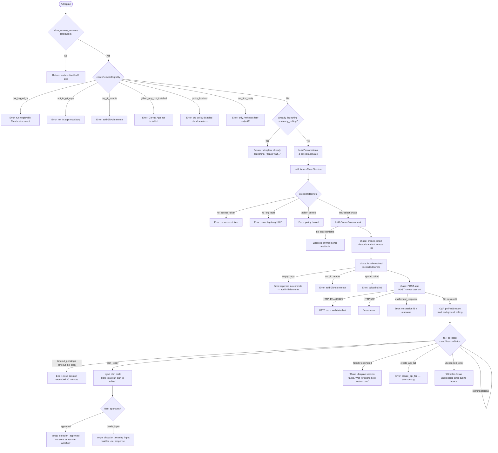

# `/ultraplan`

> Analysis basis: CC v2.1.173 bundle.js (AST extraction + Claude interpretation)
> Minimum version: v2.1.173

---

## Overview

`/ultraplan` launches a cloud-hosted planning session that drafts an editable implementation plan for a given task and surfaces it back in the local Claude Code session. The command validates preconditions (authentication, git repository, GitHub remote, policy), teleports the current repository state to a remote cloud environment, executes a planning agent there, and — once the cloud agent signals `plan_ready` — injects the plan draft as a refineable message in the local conversation. If the cloud session cannot be started or the plan cannot be retrieved, the command falls back gracefully with descriptive error messages.

---

## Registration

| Field | Value |
|---|---|
| type | `local-jsx` |
| name | `ultraplan` |
| description | `"Draft an editable plan in Claude Code on the web ( ... ) · See ..."` |
| argumentHint | `<prompt>` |
| load_inline | `true` |
| load_ident | `zg7` |
| loc_byte | `12458449` |
| loc_byte_end | `12458681` |
| loc_line | `8671` |
| arbor_handler.name | `zg7` |
| arbor_handler.fqn | `claude-2.1.173::zg7` |
| arbor_handler.kind | `AsyncFunction` |
| arbor_handler.resolution_path | `load_ident` |
| arbor_handler.n_hits | `1` |

Analysis basis: CC v2.1.173 bundle.js:+12458449

The handler was inlined as a `load:()=>Promise.resolve({call: zg7})` shape; Arbor resolved it via the `load_ident` path with a single unambiguous hit.

---

## Input Branching

The handler contains more than three distinct decision branches (remote-session eligibility, already-launching guard, plan-ready vs. needs-input vs. timeout, etc.), so a Mermaid flowchart is used.



Analysis basis: CC v2.1.173 bundle.js:+12456584 (handler entry `zg7`), +12454031 (already-polling guard), +12454049 (already-launching guard), +9383811 (not_logged_in), +9383912 (not_in_git_repo), +9384046 (no_git_remote), +9384159 (github_app_not_installed), +9384313 (policy_blocked), +9307747 (not_first_party), +12441354 (plan_ready), +12441707 (timeout_pending).

---

## Behavioral Spec

### 1. Top-level handler — `ultraplan` (`zg7`)

```
async function ultraplanHandler(args, context):
    // Check feature gate
    if not appState.allow_remote_sessions:
        return "skip"                      // literal "skip" — bundle.js:+12457259

    // Deduplicate concurrent invocations
    if alreadyPolling or alreadyLaunching:
        return message("ultraplan: already launching. Please wait for the session to start.")
                                           // bundle.js:+12452584

    // Collect invocation source
    invocationSource = "slash"             // bundle.js:+12456730

    // Validate preconditions
    eligibility = checkRemoteEligibility(context)
    if eligibility.error:
        return error(eligibility.error)

    // Read app state
    appState = _.getAppState()             // bundle.js:+12456919
    system   = buildSystemContext(appState) // "system" role — bundle.js:+12456677

    // Retrieve and prepare prompt text
    promptText = extractPromptText(args)

    // Launch the cloud session pipeline
    result = await launchUltraplan(promptText, context, appState)

    // Persist updated app state
    _.setAppState(newState)                // bundle.js:+12457141

    return result
```

Analysis basis: CC v2.1.173 bundle.js:+12456584

---

### 2. Remote eligibility check — `checkRemoteEligibility` (`Cb8` → `Rb8` → `$KA`)

```
function checkRemoteEligibility(context):
    // Detect "ultraplan" keyword in the message text (gi-flag regex)
    // bundle.js:+10768671 (regex flag "gi"), +10769023 (literal "ultraplan")
    if prompt does not start with recognized prefix:    // bundle.js:+10768273
        // scan for keyword match across message pool   // bundle.js:+10768679
        pass

    // Build eligibility result list
    results = []
    for each condition in conditions:                  // bundle.js:+10768771
        results.push(evaluateCondition(condition))     // bundle.js:+10768951

    // Format/slice eligibility text
    text = eligibilityText.slice(...)                  // bundle.js:+10769251
    text = text.replace("$1$2", ...)                   // bundle.js:+10769348, +10769322
                                                       // group replacement, max 5 items — bundle.js:+10769371
    return results
```

Analysis basis: CC v2.1.173 bundle.js:+10769223

---

### 3. Feature-gate / subscription check — `checkFeatureGate` (`p9`)

```
function checkFeatureGate(context):
    // Check plan type: firstParty / enterprise / team
    // bundle.js:+2515970, +2516243, +2516278
    planType = detectPlanType(context)     // oC — bundle.js:+2516503

    if LP4.has(planType):                  // bundle.js:+2516488
        return allowed

    if MP4.has(planType):                  // bundle.js:+2516520
        return allowed

    // Check allow_product_feedback flag   // bundle.js:+2516544
    if flag("allow_product_feedback"):
        return allowed

    // Read config file (utf-8)            // bundle.js:+2516351
    configData = readFileSync(configPath, "utf-8")  // MJ6 — bundle.js:+2516328

    // Check array membership             // bundle.js:+2516692
    if q.includes(planType):
        return allowed

    return denied
```

Analysis basis: CC v2.1.173 bundle.js:+2516472

---

### 4. Cloud session launch pipeline — `launchUltraplan` (`eu6`)

```
async function launchUltraplan(prompt, context, appState):
    // Mark as launching to prevent concurrent invocations
    setFlag("already_launching")            // bundle.js:+12454049

    // Gate: validate prompt contains usable content
    // Usage hint if prompt is empty:
    // "Usage: /ultraplan <prompt>, or include \"ultraplan\" anywhere in your prompt"
    //  bundle.js:+12454096, +12454162
    if prompt is empty:
        return usageHint

    // Dispatch background task tracker     // $6 — bundle.js:+12453849
    taskId = dispatchBackgroundTask(prompt)

    // Fire-and-forget request tracker      // f — bundle.js:+12453965
    trackRequest(taskId)

    // Acquire environment                  // GU8/WU8/Y6 — bundle.js:+12454185
    env = await acquireCloudEnvironment()

    // Session orchestration                // Og7 — bundle.js:+12454299
    session = await orchestrateSession(prompt, env, context, appState)

    // Persist session result               // Lg7 — bundle.js:+12454406
    persistSessionState(session)

    // Emit launch telemetry
    emit("tengu_ultraplan_launched")        // bundle.js:+12455516
    emit("tengu_ultraplan_create_failed")   // on error path — bundle.js:+12453809

    return session
```

Analysis basis: CC v2.1.173 bundle.js:+12453772

---

### 5. Session orchestration — `orchestrateSession` (`Og7`)

```
async function orchestrateSession(prompt, env, context, appState):
    // Run precondition checks              // qGH/DEq — bundle.js:+12454541
    preconditions = await runPreconditions(env, context)
    if preconditions.type == "precondition":   // bundle.js:+12454624
        return error(preconditions)

    // Build system + task notification payload
    // "task-notification" message role — bundle.js:+12454800
    taskNotification = buildTaskNotification(prompt)

    // Build draft plan context             // Kg7 — bundle.js:+12454876
    draftPlan = buildDraftPlan(prompt)
    // Prefix: "Here is a draft plan to refine:" — bundle.js:+12449645

    // Choose remote or local path         // qr — bundle.js:+12454901
    session = await teleportToRemote(prompt, env, context)
    if session == null:
        emit("tengu_ultraplan_launched")
        emit("teleport_null")              // bundle.js:+12455210
        return error("create_api_fail")    // bundle.js:+12455192

    // Attach background session           // bY — bundle.js:+12455383
    attachBackgroundSession(session)

    // Register cleanup / task lifecycle   // Mg7 — bundle.js:+12455506
    registerTaskLifecycle(session)

    // Open browser URL                    // sxH/d16 — bundle.js:+12455622
    openBrowserSession(session)            // A6H.open — bundle.js:+13509507

    // Emit "Ultraplan" UI notification    // Oh — bundle.js:+12455761
    // "Ultraplan" literal — bundle.js:+12455680
    showUltraplanNotification(session)

    // Start polling loop                  // fg7 — bundle.js:+12455787
    pollResult = await pollSessionUntilComplete(session)

    // Register hook via y9               // bundle.js:+12455807
    registerHook(session)

    // Submit to agent                     // np/SH — bundle.js:+12455857, +12455885
    submitToAgent(pollResult)

    // Handle unexpected error path        // EH — bundle.js:+12456050
    // "unexpected_error" — bundle.js:+12455936
    // Message: "Ultraplan hit an unexpected error during launch. Wait for the user's next instructions."
    //          bundle.js:+12456108

    // Archive orphaned sessions on exit
    // "ultraplan: failed to archive orphaned session" — bundle.js:+12456269

    return pollResult
```

Analysis basis: CC v2.1.173 bundle.js:+12454299

---

### 6. Teleport-to-remote pipeline — `teleportToRemote` (`qr`)

```
async function teleportToRemote(prompt, env, context):
    // [phase: env-select]                // bundle.js:+9310532
    // Policy check                       // bundle.js:+9307552
    if policy_denied:
        return error("Cloud sessions are disabled by your organization's policy.")
    if not_first_party:
        return error("Cloud sessions are only available on the first-party Anthropic API provider.")
                                          // bundle.js:+9307668

    // Token / org UUID acquisition
    // No access token → "No access token found for cloud session creation"
    //   bundle.js:+9307811
    // No org UUID    → "Unable to get organization UUID for cloud session creation"
    //   bundle.js:+9308138
    accessToken = getAccessToken()         // S1 — bundle.js:+9308496
    orgUUID     = getOrgUUID()             // cC — bundle.js:+9308120

    // Emit telemetry: teleport bundle mode
    emit("tengu_teleport_bundle_mode")     // bundle.js:+9308907

    // [phase: branch-detect]             // bundle.js:+9312335
    branchInfo = detectBranch(context)     // zI — bundle.js:+9313166

    // [phase: bundle-upload]             // bundle.js:+9313471
    bundleResult = await teleportGitBundle(context)  // VHA — bundle.js:+9308647
    emit("tengu_teleport_source_decision") // bundle.js:+9314381

    // Build request payload              // xTq — bundle.js:+9309306
    // uuid = $96.randomUUID()            // bundle.js:+9306932
    // "Remote task" label                // bundle.js:+9309285
    payload = buildSessionPayload(prompt, bundleResult, branchInfo, orgUUID)

    // Apply beta headers:
    // "anthropic-beta": "ccr-byoc-2025-07-29" — bundle.js:+9308557
    // "x-organization-uuid": orgUUID          — bundle.js:+9308579

    // POST session creation              // zA.post — bundle.js:+9309780
    response = await apiPost("/session", payload)

    // Handle HTTP error codes:
    // 500 → error          bundle.js:+9309836
    // 201 → success        bundle.js:+9309872
    // 401 → auth error     bundle.js:+9309941
    // 403 → forbidden      bundle.js:+9309945
    // 429 → rate-limited   bundle.js:+9309949
    // "github_repo_access_denied" bundle.js:+9309992
    // "create_request_failed"     bundle.js:+9310170

    if not response.sessionId:
        return error("Server returned a malformed session response (no session id)")
        // bundle.js:+9310321

    // [phase: POST-sent]                // bundle.js:+9315499
    return session(response.sessionId)
```

Analysis basis: CC v2.1.173 bundle.js:+9307491

---

### 7. Git bundle upload — `teleportGitBundle` (`VHA`)

```
async function teleportGitBundle(context):
    // Emit: "teleport_git_bundle_upload"  // bundle.js:+9291970
    emit("tengu_ccr_bundle_upload")        // bundle.js:+9292263

    if not in git repo:
        // "empty_repo" — bundle.js:+9291999
        return error("Not in a git repository")  // bundle.js:+9292031

    // Clean up any previous seed refs
    // refs/seed/stash — bundle.js:+9292071
    // refs/seed/root  — bundle.js:+9292089
    cleanSeedRefs()

    // Check repo has commits via `git for-each-ref --count=1 refs/`
    // bundle.js:+9292173, +9292188, +9292200
    if no commits:
        return error("Repository has no commits yet")  // bundle.js:+9292381

    // Create stash bundle
    // git stash create — bundle.js:+9292459, +9292467
    stashSha = runGit("stash", "create")

    // Verify HEAD: git rev-parse --verify HEAD
    // bundle.js:+9292811, +9292823, +9292834
    headSha = runGit("rev-parse", "--verify", "HEAD")

    // Build bundle file: "_source_seed.bundle" — bundle.js:+9293573
    bundlePath = buildBundlePath("_source_seed.bundle")

    // Upload bundle, emit result states:
    // "failed"           bundle.js:+9293678
    // "upload_failed"    bundle.js:+9293722
    // "success"          bundle.js:+9293874
    // "head"             bundle.js:+9293943
    // "fallback_head"    bundle.js:+9293982
    // "squashed"         bundle.js:+9294017
    // "fallback_squashed" bundle.js:+9294060
    result = await uploadBundle(bundlePath)

    // Unlink temp file: M96.unlink — bundle.js:+9294218
    cleanup(bundlePath)

    return result
```

Analysis basis: CC v2.1.173 bundle.js:+9291941

---

### 8. Poll loop — `pollSessionUntilComplete` (`fg7`)

```
async function pollSessionUntilComplete(session):
    startTime = Date.now()                 // bundle.js:+12449782

    // Session timeout: 5400 seconds       // bundle.js:+12449338
    // Per-poll interval: 1000 ms          // bundle.js:+9390428
    // Max wall-clock: 1800000 ms (30 min) // bundle.js:+9390435

    loop:
        status = await getCloudSessionStatus(session.id)  // TfK — bundle.js:+12449868
        emit("tengu_ultraplan_timeout_seconds", elapsed)   // bundle.js:+12449304

        switch status:
            case "plan_ready":
                emit("tengu_ultraplan_plan_ready")         // bundle.js:+12450016
                plan = extractPlan(status)
                injectDraftPlan(plan)  // prefix: "Here is a draft plan to refine:"
                                       // bundle.js:+12449645
                return awaitApproval(plan)

            case "needs_input":
                emit("tengu_ultraplan_awaiting_input")     // bundle.js:+12449948
                return awaitUserInput()

            case "approved":
                emit("tengu_ultraplan_approved")           // bundle.js:+12450436
                // "Results will land as a pull request when the cloud session finishes."
                // bundle.js:+12450926
                return approved(plan)

            case "failed" | "terminated":
                emit("tengu_ultraplan_failed")             // bundle.js:+12451325
                // "Cloud ultraplan session failed. Wait for the user's next instructions."
                // bundle.js:+12451749
                return error(status)

            case "running" | "starting":
                continue

            case "timeout_pending":
                return error("cloud session exceeded 30 minutes")  // bundle.js:+9393076

            case "extract_marker_missing":
                return error("no review output — orchestrator may have exited early")
                // bundle.js:+9393112

        // Time-based timeout check
        elapsed = (Date.now() - startTime) / 60000
        // Reports elapsed as N "minute"/"minutes" — bundle.js:+12441499, +12441508
        if elapsed > timeoutThreshold:
            return error("timeout_no_plan")   // bundle.js:+12441725

    // Network error: "Lost connection to the cloud session after repeated retries"
    // bundle.js:+12440664

    emit("tengu_ultraplan_prompt_identifier")  // bundle.js:+12449471
```

Analysis basis: CC v2.1.173 bundle.js:+12449772

---

### 9. Environment acquisition — `acquireCloudEnvironment` (`GU8` / `WU8` / `Y6`)

```
async function acquireCloudEnvironment():
    // List available environments        // sxH — bundle.js:+9388747
    // Generate random ID (8 bytes)       // gPK.randomBytes, 8 — bundle.js:+13510582, +13510598
    envList = await listEnvironments()

    if envList is empty:
        // Attempt to auto-create a default environment
        // Default env name: "Default"    // bundle.js:+9255265
        // "teleport_default_environment_create" — bundle.js:+9255290
        defaultEnv = await createDefaultEnvironment()
        if creation fails:
            // "Could not create a cloud environment. Set one up at
            //  https://claude.ai/code/onboarding?magic=env-setup"
            //  bundle.js:+9310797
            return error("no_environments")  // bundle.js:+9311935

    // Default env includes:
    // runtime: anthropic_cloud — bundle.js:+9255705
    // workdir: /home/user       — bundle.js:+9255811
    // python: 3.11              — bundle.js:+9255873, +9255890
    // node: 20                  — bundle.js:+9255904, +9255919

    return selectedEnv
```

Analysis basis: CC v2.1.173 bundle.js:+12449562

---

### 10. Background session attachment — `attachBackgroundSession` (`bY`)

```
function attachBackgroundSession(session):
    // Initialise background session object   // I_ — bundle.js:+5172778
    // Determine Claude.ai base URL based on environment:
    //   local:   "http://localhost:4000"           bundle.js:+5172630
    //   staging: "https://claude-ai.staging.ant.dev" bundle.js:+5172672
    //   prod:    "https://claude.ai"               bundle.js:+5172714
    baseURL = selectBaseURL(env)

    // Attach to session queue                // _u_ — bundle.js:+5172798
    backgroundQueue.push(session)
    return session
```

Analysis basis: CC v2.1.173 bundle.js:+5172778

---

### 11. Cloud-session status polling — `getCloudSessionStatus` (`TfK`)

```
async function getCloudSessionStatus(sessionId):
    // Poll interval: every 1000 ms, max 1800000 ms — bundle.js:+9390428, +9390435
    // On network error: retry with back-off
    // Error threshold: emit "network_or_unknown" — bundle.js:+12440590
    // After repeated failures:
    //   "Lost connection to the cloud session after repeated retries
    //    — the session may still be running"  bundle.js:+12440664

    response = await fetchSessionStatus(sessionId)   // s0H — bundle.js:+12440361

    switch response.state:
        case "running":
            return {state: "running"}
        case "completed":
            return extractPlanFromResult(response)   // SnH — bundle.js:+12440530
        case "requires_action":
            return {state: "needs_input", data: response.action}
        case "plan_ready":
            return {state: "plan_ready", plan: response.plan}
        case "approved":
            return {state: "approved"}
        case "terminated":
            return {state: "terminated", error: response.error}
        default:
            // "poll stopped by caller" — bundle.js:+12440311
            return {state: "stopped"}
```

Analysis basis: CC v2.1.173 bundle.js:+12440166

---

## State & Side Effects

| Item | Detail |
|---|---|
| Telemetry — `tengu_ultraplan_create_failed` | Fired when the cloud session creation step fails (bundle.js:+12453809) |
| Telemetry — `tengu_ultraplan_prompt_identifier` | Fired to tag the prompt with a stable identifier (bundle.js:+12449471) |
| Telemetry — `tengu_ultraplan_launched` | Fired on successful cloud session launch (bundle.js:+12455516) |
| Telemetry — `tengu_ultraplan_timeout_seconds` | Reports elapsed seconds periodically during the poll loop (bundle.js:+12449304) |
| Telemetry — `tengu_ultraplan_awaiting_input` | Fired when cloud agent enters `needs_input` state (bundle.js:+12449948) |
| Telemetry — `tengu_ultraplan_plan_ready` | Fired when cloud agent signals `plan_ready` (bundle.js:+12450016) |
| Telemetry — `tengu_ultraplan_approved` | Fired when the plan is approved and remote workflow continues (bundle.js:+12450436) |
| Telemetry — `tengu_ultraplan_failed` | Fired on cloud session failure or termination (bundle.js:+12451325) |
| Telemetry — `tengu_ccr_bundle_seed_enabled` | Fired if seed bundle mode is active (bundle.js:+9382356) |
| Telemetry — `tengu_ccr_bundle_upload` | Fired on git bundle upload (bundle.js:+9292263) |
| Telemetry — `tengu_teleport_bundle_mode` | Emitted when bundle mode is selected for teleport (bundle.js:+9308907) |
| Telemetry — `tengu_ccr_session_link` | Emitted with cloud session link for the user (bundle.js:+9302246) |
| Telemetry — `tengu_teleport_source_decision` | Records the source-bundle strategy chosen (bundle.js:+9314381) |
| Telemetry — `tengu_config_parse_error` | Fired on config parse failures (bundle.js:+3315074) |
| Telemetry — `tengu_bg_dispatch_sigkill_escalate` | Background daemon SIGKILL escalation (bundle.js:+16760584) |
| Telemetry — `tengu_bg_low_mem_mb` | Background session low-memory warning (bundle.js:+13267233) |
| Telemetry — `tengu_bg_dispatch_low_mem` | Background dispatcher low-memory event (bundle.js:+16761185) |
| Telemetry — `tengu_bg_spare_enable` | Background spare worker enabled (bundle.js:+16761889) |
| Telemetry — `tengu_bg_spare_claim` | Background spare worker claimed (bundle.js:+16762017) |
| Telemetry — `tengu_bg_spare_claim_fail` | Background spare worker claim failed (bundle.js:+16762283) |
| Telemetry — `tengu_bg_sendclaim_failed` | Background send-claim failure (bundle.js:+16739477) |
| Telemetry — `tengu_feature_ok` / `tengu_feature_bad` | Feature gate pass/fail (bundle.js:+1016269, +1016336) |
| Telemetry — `tengu_scheduled_task_missed` | Missed scheduled task event (bundle.js:+16260900) |
| appState read | `_.getAppState()` is called to read `allow_remote_sessions`, `system`, and current session context (bundle.js:+12456919) |
| appState write | `_.setAppState()` persists updated session and polling state after launch (bundle.js:+12457141) |
| Hook registration | `y9` calls `yZA.register` to register a hook for session lifecycle events (bundle.js:+63751) |
| Browser open | `d16` → `A6H.open` launches the cloud session URL in the browser (bundle.js:+13509507) |
| File I/O | `G7H` reads the project config file with `q.readFileSync`; may create backup directories; uses `q.copyFileSync` for config backups (bundle.js:+3314499, +3315582) |
| Git operations | `VHA` runs `git stash create`, `git rev-parse --verify HEAD`, `git for-each-ref`, `git bundle create`, `git update-ref -d` (bundle.js:+9291941 ff.) |
| Network | `zA.post` is used to create the cloud session; `zA.get` for status polling and environment listing; responses are checked for Axios cancel (`zA.isCancel`) and Axios error (`zA.isAxiosError`) |
| Temp file cleanup | `M96.unlink` removes the `_source_seed.bundle` temp file post-upload (bundle.js:+9294218); `gK.unlink` used by `hS6` for further cleanup (bundle.js:+13419554) |
| Sound | <!-- TODO: not found in depth-2 traversal; needs --depth 4 --> |

---

## Version History

| Version | Change |
|---|---|
| v2.1.173 | Initial analysis |

---

## Common Mistakes

1. **Invoking without a Claude.ai account login.** The command requires a Claude.ai (consumer) OAuth session, not an API key. Running `/ultraplan` before `/login` will immediately return the error "Please run /login and sign in with your Claude.ai account (not Console)." (Analysis basis: CC v2.1.173 bundle.js:+9383833)

2. **Running outside a git repository.** The teleport pipeline requires a local git repo. Without one, the command aborts with the `not_in_git_repo` error. Initialise a repo with `git init` first. (Analysis basis: CC v2.1.173 bundle.js:+9383912)

3. **Missing a GitHub remote.** Even with a git repo present, the cloud agent requires a GitHub remote (`origin`) to deliver results as a pull request. Add one with `git remote add origin REPO_URL`. (Analysis basis: CC v2.1.173 bundle.js:+9384068)

4. **Invoking a second time while launch is in progress.** A concurrent invocation guard returns "ultraplan: already launching. Please wait for the session to start." immediately. Wait for the active session to resolve before re-invoking. (Analysis basis: CC v2.1.173 bundle.js:+12452584)

5. **Expecting results inline for remote workflows.** Once the plan is approved, results land as a pull request on GitHub — not as a follow-up message in the local session. The banner "Results will land as a pull request when the cloud session finishes. There is nothing to do here." is shown at that stage. (Analysis basis: CC v2.1.173 bundle.js:+12450926)

6. **Org policy blocking cloud sessions.** Enterprise/team admins can disable cloud sessions. If blocked, the error "Cloud sessions are disabled by your organization's policy. Contact your organization admin to enable them." is displayed. (Analysis basis: CC v2.1.173 bundle.js:+9384336)

7. **Using a non-Anthropic API provider.** Only the first-party Anthropic API provider supports cloud sessions. Third-party or custom API base URLs receive the error "Cloud sessions are only available on the first-party Anthropic API provider." (Analysis basis: CC v2.1.173 bundle.js:+9307668)

---

## Appendix — Identifier Mapping

> For bundle debugging only. Identifiers change across versions.

| Identifier | Role |
|---|---|
| `zg7` | Top-level `ultraplan` async handler (main entry point) |
| `Cb8` | Remote eligibility wrapper — calls `Rb8` |
| `Rb8` | Eligibility result formatter |
| `$KA` | Eligibility condition evaluator; uses `startsWith`, `matchAll`, `some`, `push` |
| `p9` | Feature gate / plan-type subscription check |
| `Ym1` | Feature gate initialiser |
| `ZhH` | Gate context builder — calls `oC`, `MJ6`, `ILH` |
| `oC` | Plan-type detector (`firstParty`, `enterprise`, `team`) |
| `MJ6` | Config file reader (`readFileSync`, `utf-8`) |
| `ILH` | Membership inclusion checker |
| `Rq` | Token / credential resolver |
| `CBA` | Token formatter |
| `f6` | String coercion utility |
| `GLH` | Alternate token path |
| `Q3H` | System context builder |
| `eu6` | Cloud session launch orchestrator |
| `c` | Generic React/JSX component or context helper |
| `$6` | Background task dispatcher |
| `q56` | Task queue primitive |
| `f` | Request tracker (add/delete with finally) |
| `kfK` | Session key/flag store |
| `GU8` | Environment acquisition wrapper |
| `WU8` | Environment list fetcher |
| `Y6` | Cloud environment selector |
| `_g7` | Environment utility |
| `Og7` | Session orchestration (preconditions → poll → submit) |
| `qGH` | Precondition runner wrapper |
| `DEq` | Precondition evaluator (eligibility, BYOC, github.com) |
| `g9` | UI component helper |
| `BG` | Background/rendering utility |
| `Y5` | Secondary UI utility |
| `Kg7` | Draft plan builder; prefix "Here is a draft plan to refine:" |
| `qg7` | Draft plan formatter |
| `qr` | `teleportToRemote` — full cloud session creation pipeline |
| `p6` | Token / auth provider accessor |
| `B4` | Credential store reader |
| `Nz` | Token refresh helper |
| `qk8` | HTTP request builder |
| `SH` | Error-with-logging helper (logError, push to rQH) |
| `cC` | Org UUID resolver |
| `S1` | OAuth URL / environment selector (`local`, `staging`, `prod`) |
| `YD` | HTTP header builder (`Content-Type`, `anthropic-version`) |
| `VHA` | `teleportGitBundle` — git stash/bundle/upload |
| `y6` | Background task UI notifier |
| `N` | Message formatter / display helper |
| `A6` | React component / UI renderer |
| `bC` | Git remote URL fetcher (`remote.origin.url`) |
| `xTq` | Session payload builder (randomUUID) |
| `LS6` | Session link builder |
| `CH` | JSON serialiser |
| `bTq` | Session-link display handler |
| `QI8` | Status check utility |
| `ge` | Environment list fetcher (`teleport_environments_list`) |
| `e16` | Default environment creator (`teleport_default_environment_create`) |
| `EH` | Error-to-string converter |
| `O` | Session status mapper |
| `Qf7` | Title/branch generator (`teleport_generate_title`, `claude/task` branch) |
| `WS` | Background session status tracker |
| `BxH` | GitHub App installation checker |
| `zI` | Current branch detector (`symbolic-ref --short refs/remotes/origin/HEAD`) |
| `J9` | Hook lifecycle manager |
| `h8H` | URL pattern matcher (`https`, `http`) |
| `r` | Permission/allow list checker |
| `JA` | Error constructor wrapper |
| `rz` | Cancel signal checker |
| `Gz` | Generic guard/gate utility |
| `bY` | Background session attacher (Claude.ai URL selector) |
| `I_` | Background session object initialiser |
| `_u_` | Background session queue manager |
| `Mg7` | Task lifecycle registrar |
| `sxH` | Browser session opener + timestamp logger |
| `Ik` | Random bytes generator for session token |
| `d16` | Browser open handler (`A6H.open`) |
| `gW` | Session timestamp recorder |
| `Z47` | Session status string builder |
| `PEq` | Background session status poller (main poll loop) |
| `Oh` | Ultraplan UI notification renderer |
| `SY7` | Notification sub-component (retain / task_started) |
| `kY7` | Notification sub-component (task_updated) |
| `FAA` | Notification utility |
| `RY7` | Notification renderer with Date.now timestamp |
| `CY7` | Notification keyed renderer |
| `dqH` | Active-session state tracker (`user_typed`, `active`, `aborted`) |
| `fg7` | `pollSessionUntilComplete` — main poll loop for ultraplan |
| `TfK` | `getCloudSessionStatus` — low-level status fetcher |
| `eF7` | Session environment selector |
| `$g7` | Poll state accumulator |
| `hS6` | Cleanup helper (unlink temp files) |
| `K` | Column/pad formatter |
| `np` | Agent submission helper (HTTP POST to agent endpoint) |
| `y9` | Hook registrar (`yZA.register`) |
| `Lg7` | Session state persister |
| `b6` | Config file watcher / project config accessor |
| `o6` | File-path resolver |
| `PZ_` | Config path builder |
| `G7H` | Project config reader/writer (readFileSync, mkdirSync, copyFileSync) |
| `n6` | JSON parser |
| `bu` | Ref path prefix stripper |
| `N8` | Config schema validator |
| `C_9` | Subdirectory config scanner |
| `GZ_` | Path joiner |
| `$` | Array/collection utility (findLast, some, startsWith) |
| `D` | Background daemon session dispatcher |
| `b` | Daemon worker process wrapper |
| `d8` | Timer/timeout utility |
| `bH` | Feature-bad reporter |
| `kH` | Feature-ok reporter |
| `kF8` | Low-memory checker (macOS) |
| `i06` | Saved-session file reader |
| `Q` | PTY/socket connection manager |
| `Q0A` | Spare worker claim handler |
| `r0A` | Daemon task lifecycle + roster manager |
| `Y` | Forced-shutdown handler (process.exit, z.abort) |
| `B` | Worker process tracker |
| `Zx4` | Config file watcher (watchFile / unwatchFile) |
| `wF` | File-watch event handler |
| `M46` | Parallel preflight runner (Promise.all over preconditions) |