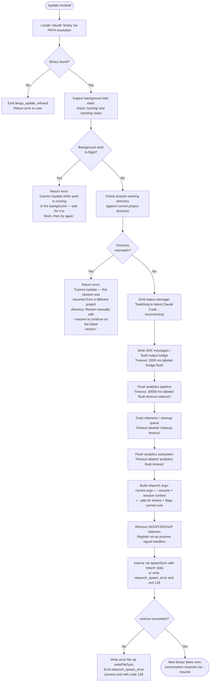

# `/update`

> Analysis basis: CC v2.1.173 bundle.js (AST extraction + Claude interpretation)
> Minimum version: v2.1.173

---

## Overview

The `/update` command upgrades the running Claude Code CLI binary to its latest available version without terminating the current conversation. It validates that the session is in a safe state before proceeding, then performs an in-process replacement of the binary via `execve`, preserving the current session by passing a `--resume` flag to the newly launched process.

---

## Registration

| Field | Value |
|---|---|
| type | `local` |
| name | `update` |
| description | `Switch to the latest version (conversation continues)` |
| supportsNonInteractive | `false` |
| isHidden | `true` |
| module_id | `NOK` |
| load_inline | `true` |
| loc_byte | `12906103` |
| loc_byte_end | `12906344` |
| loc_line | `9141` |
| arbor_handler.name | `Di7` |
| arbor_handler.fqn | `claude-2.1.173::Di7` |
| arbor_handler.kind | `AsyncFunction` |
| arbor_handler.resolution_path | `module_id` |
| arbor_handler.n_hits | `0` |

Analysis basis: CC v2.1.173 bundle.js:+12906103

---

## Input Branching

The handler contains 4+ distinct precondition branches before initiating the update, followed by a multi-stage relaunch sequence. A Mermaid flowchart is used.



---

## Behavioral Spec

### Binary Location Resolution

The handler first calls the binary-locator utility (`VB8` → `L3` → `TbA`) which invokes `Bun.which("claude")` to discover the path to the `claude` executable on `PATH`.

Analysis basis: CC v2.1.173 bundle.js:+12903905

### Installation Path Helpers

Two helpers derive the install paths used for version-directory lookups:

- **Global share path builder** (`hMH`): resolves `os.homedir()` and appends `.local/share/versions` to locate the versioned binary store. Analysis basis: CC v2.1.173 bundle.js:+9563377
- **XDG bin path builder** (`A9H`): similarly resolves `os.homedir()` and appends `.local/share/.../bin`. Analysis basis: CC v2.1.173 bundle.js:+9563520

### Precondition Validation

```
async function handlerMain(context):
    binaryPath = locateBinary("claude")          // Bun.which
    if not binaryPath:
        emit telemetry("tengu_update_refused")
        return refusalMessage()

    taskStates = getBackgroundTaskStates()       // Object.values over task map
    if any task has state "running" or "pending":
        emit telemetry("tengu_update_refused")
        return errorMessage(
            "Cannot /update while work is running in the background — " +
            "wait for it to finish, then try again."
        )

    if sessionDirectoryMismatch():
        emit telemetry("tengu_update_refused")
        return errorMessage(
            "Cannot /update — this session was resumed from a different " +
            "project directory. Restart manually with --resume to continue " +
            "on the latest version."
        )
```

Analysis basis: CC v2.1.173 bundle.js:+12904003, +12904266, +12904288, +12904369, +12904613

### Session-State Persistence Before Relaunch

Before handing off to the new binary the handler persists conversation state so `--resume` can reconstruct it:

```
function persistAndPrepare(appState, sessionId):
    currentState = getAppState()
    mutatedState = Object.assign({}, currentState, {
        // assistant-prefixed fields marked for resume
    })
    setAppState(mutatedState)
    uuid = generateRandomUUID()            // crypto.randomUUID
    writeSdkMessages(sessionId, uuid)
    flush output bridge (timeout: 2000 ms)
```

Analysis basis: CC v2.1.173 bundle.js:+12904861, +12905015, +12905101, +12905121, +12905192, +12905205

### Relaunch Argument Construction

```
function buildRelaunchArgv(originalArgv, sessionContext):
    args = Array.from(originalArgv)
    args.push("--resume", sessionId)
    for each additionalDir in sessionContext.addedDirs:
        args.push("--add-dir", additionalDir)
    if originalArgv.includes("--allow-dangerously-skip-permissions"):
        args.push("--allow-dangerously-skip-permissions")
    if effortFlag present:
        args.push("--effort", effortValue)
    if permissionModeFlag present:
        args.push("--permission-mode", permissionModeValue)
    return args
```

Analysis basis: CC v2.1.173 bundle.js:+12905427, +12627169, +12627344, +12627448, +12627459, +12627601, +12627618

### Session Context Carried to New Process

The session-state reader (`k_`) inspects `working_directory`, `allowed_tools`, `disallowed_tools`, `avoid_prompts`, `permission_mode`, `bypassPermissions`, `effort`, `model`, `max_thinking_tokens`, and `flag_settings` to forward them across the process boundary.

Analysis basis: CC v2.1.173 bundle.js:+12905431, +10672434, +10672539, +10672594, +10672649, +10672710, +10672812, +10673167, +10673180, +10673192

### Shutdown and `execve` Replacement

```
async function relaunchViaBinary(binaryPath, argv):
    // Tear down current runtime cleanly
    teardownOutputBridge()
    flushAnalytics(timeout: 30000)     // "flush timeout (relaunch)"
    drainCleanup(timeout: labeled "cleanup timeout")
    flushAnalyticsSubsystem(timeout: labeled "analytics flush timeout")

    // Strip signal handlers so they don't interfere with execve
    process.removeAllListeners()
    process.on("SIGINT", noOp)
    process.on("SIGHUP", noOp)

    // Load libSystem / libc via bun:ffi (platform-specific)
    //   macOS: /usr/lib/libSystem.B.dylib
    //   Linux: libc.so.6
    lib = L.dlopen(platform == "macos" ? libSystem : libc, ffiSignature)

    // Set up environment via Object.entries, build env buffer (utf8, ptr)
    result = A7K.spawnSync(binaryPath, argv, { stdio: "inherit" })

    if result indicates spawn failure:
        writeFileSync(errorLogPath, "relaunch_spawn_error")
        process.exit(128)
    else:
        // execve transferred control; this code never returns
```

Analysis basis: CC v2.1.173 bundle.js:+12625674, +12625820, +12625866, +12625879, +12625887, +12625938, +12625994, +12626248, +12626316, +12626389, +12626446, +12626668, +12626695, +12626760, +12626808

### Process Exit Path (Spawn Error)

If `spawnSync` fails, the handler records the error, writes a failure marker file via `writeFileSync`, and terminates the current process with `process.exit` code `128`.

Analysis basis: CC v2.1.173 bundle.js:+12626668, +12626695, +12626808

---

## State & Side Effects

| Item | Detail |
|---|---|
| Telemetry — `tengu_update_refused` | Fired when the update is blocked due to missing binary, in-flight background tasks, or directory mismatch (bundle.js:+12904005) |
| Telemetry — `tengu_scroll_summary` | Fired during terminal scroll/render operations inside the shutdown UI path (bundle.js:+7372277) |
| Telemetry — `tengu_amber_creek` | Fired in fullscreen/terminal-detection logic during shutdown (bundle.js:+3504471) |
| Telemetry — `tengu_pewter_brook` | Fired in fullscreen/terminal-detection logic during shutdown (bundle.js:+3504379) |
| Telemetry — `tengu_bg_dispatch_sigkill_escalate` | Fired if background daemon requires SIGKILL escalation during teardown (bundle.js:+16760584) |
| Telemetry — `tengu_daemon_control` | Fired on daemon stop attempts during teardown (bundle.js:+16797646) |
| Telemetry — `tengu_bg_spare_enable` | Fired when the spare-session pool is activated (bundle.js:+16761889) |
| Telemetry — `tengu_bg_spare_claim` | Fired on background-session claim events (bundle.js:+16762017) |
| Telemetry — `tengu_bg_spare_claim_fail` | Fired on background-session claim failure (bundle.js:+16762283) |
| appState changes | Handler calls `_.getAppState()` then `_.setAppState()` to stamp the state with resume metadata before relaunch (bundle.js:+12904861, +12905015) |
| SDK messages written | `O.writeSdkMessages` is called to persist pending messages for the resume session (bundle.js:+12905101) |
| Output bridge flush | `O.flush` then `O.teardown` called; 2000 ms timeout labeled `"bridge flush"` (bundle.js:+12905192, +12905195, +12905246) |
| Analytics flush | Two-stage drain: `ZFH` → `yZA.drain` and `pCH` flush, each with timeout guards (bundle.js:+12625938, +12625994) |
| Signal handlers stripped | `process.removeAllListeners()` followed by no-op handlers for `SIGINT` and `SIGHUP` (bundle.js:+12626389, +12626419) |
| FFI / native library | `bun:ffi` + `L.dlopen` used to load `libSystem.B.dylib` (macOS) or `libc.so.6` (Linux) for `execve` (bundle.js:+12624924, +12624968, +12624997) |
| Error file written on failure | `$X` calls `iFH.writeFileSync` to record `"relaunch_spawn_error"` (bundle.js:+12626668) |
| process.exit code | `128` on spawn/execve failure (bundle.js:+12626808) |
| Hook registration | No dedicated hook registration observed in depth-2 traversal |
| Sound | <!-- TODO: not found in depth-2 traversal; needs --depth 4 --> |

---

## Version History

| Version | Change |
|---|---|
| v2.1.173 | Initial analysis |

---

## Common Mistakes

1. **Invoking `/update` while background tasks are running.** The command explicitly refuses with a human-readable error if any task has state `"running"` or `"pending"`. Wait for background work to complete first.
2. **Using `/update` in a resumed session started from a different working directory.** If the session's recorded working directory does not match the current project directory, the update is blocked. Use `--resume` manually from the correct directory after a manual restart.
3. **Expecting the command to appear in the slash-command menu.** The registration sets `isHidden: true`, so `/update` does not surface in the autocomplete list. It must be typed explicitly.
4. **Expecting it to work non-interactively.** `supportsNonInteractive: false` means this command cannot be run in headless/scripted pipelines.
5. **Assuming the process restarts cleanly on all platforms.** The relaunch path loads a platform-native C library via `bun:ffi` and calls `execve`. On environments where FFI or `execve` is unavailable or blocked, the fallback exits with code `128` and writes an error file rather than relaunching gracefully.

---

## Appendix — Identifier Mapping

> For bundle debugging only. Identifiers change across versions.

| Identifier | Role |
|---|---|
| `Di7` | Main async handler for `/update` (arbor_handler; AsyncFunction) |
| `VB8` | Binary location orchestrator; calls path resolver and install-path builder |
| `L3` | PATH-based binary locator; delegates to `Bun.which` |
| `TbA` | `Bun.which` wrapper for locating `claude` binary |
| `IR` | Install directory resolver; joins versioned path segments |
| `sk8` | Versions-directory path builder; joins `.local/share/versions` |
| `u$` | Array normalization helper (`Array.isArray` guard) |
| `hMH` | Home-relative path builder for `.local/share` tree |
| `BP8` | `os.homedir()` accessor |
| `A9H` | XDG bin-path builder (`~/.local/share/.../bin`) |
| `O9` | Process-role classifier (distinguishes `bg`, `daemon`, `daemon-worker`) |
| `CDH` | Role-string constants provider |
| `c` | Generic context/config accessor |
| `hJ` | Executable basename resolver (`path.basename` + helper) |
| `y6` | Async message/content builder utility |
| `BG` | Base content/message constructor |
| `ok` | Output emitter / message renderer |
| `R$A` | Directory-change path helper; calls `path.dirname` |
| `P_` | Working-directory accessor helper |
| `vf` | Directory comparison utility |
| `CKH` | Session continuation / skip-checks flag accessor |
| `oHH` | Attachment/hook-type checker (`I65.has`) |
| `Lg8` | Hook-type registry accessor |
| `oOA` | Conversation-log append utility; writes `last-prompt` entry |
| `$4` | Progress/status message emitter |
| `y9` | Event bus registration helper (`yZA.register`) |
| `_` | App-state / session store accessor (`.getAppState`, `.setAppState`, `.appendEntry`) |
| `SH` | Structured error/log handler; routes to `logError` |
| `JA` | Error formatter (wraps native `Error` + `String`) |
| `f6` | String coercion helper |
| `Rq` | Traffic-category resolver (`essential-traffic`, `no-telemetry`, `default`) |
| `CBA` | Traffic-category string builder |
| `MRf` | Log-buffer rotation helper (`shift` + `push`) |
| `DG` | State diff / merge helper |
| `O` | Output bridge object (`writeSdkMessages`, `flush`, `teardown`) |
| `m8` | SDK message serializer/writer backend |
| `VOK` | UUID generator wrapper (`crypto.randomUUID`) |
| `HL` | Promise race with timeout utility (uses `setTimeout`, `Promise.race`, `clearTimeout`) |
| `JXH` | String coercion wrapper used for message building |
| `fEH` | Full relaunch executor (stat check → UI teardown → drain → execve) |
| `BN6` | Interval-clearing helper (wraps `$c_`) |
| `$c_` | `clearInterval` wrapper |
| `uCH` | Terminal UI teardown helper (`H.unmount`, `nMH.writeSync`) |
| `H` | Ink/render instance (unmount, replaceAll, includes) |
| `Db` | Terminal restore helper |
| `V38` | Terminal scroll-save/restore renderer (ANSI escape sequences) |
| `UkH` | Terminal-capability detector (Ghostty ≥1.2.0, iTerm ≥3.6.6) |
| `ykH` | Terminal-type probe helper |
| `b0` | tmux/screen escape-sequence rewriter |
| `v3` | Render output helper |
| `N` | ANSI string formatter / color/style utility |
| `dW8` | Scroll-summary renderer and telemetry emitter |
| `Y0` | Summary text builder |
| `be9` | Scroll metric collector |
| `Ce9` | Timing/metrics aggregator (`Date.now`, `Math.max`, `Math.round`) |
| `Se9` | Metrics state store |
| `v1` | Full-screen terminal renderer / animation manager |
| `J8H` | Locale/terminal-feature cache checker |
| `cV_` | String formatter for terminal output |
| `ks` | Animation frame helper |
| `dV_` | Platform/window-detection helper (`windows` string, `Boolean`) |
| `B_` | View-buffer helper |
| `Np4` | Full-screen mode controller |
| `Y6` | Render-loop manager (frame scheduling, set tracking) |
| `vZ` | Progress/status entry emitter (delegates to `$4`) |
| `ZFH` | Analytics drain orchestrator (`yZA.drain`) |
| `pCH` | Analytics flush promise builder (`Promise.resolve`, `gW8`) |
| `gW8` | Analytics flush backend |
| `H7K` | Core relaunch function: cwd resolution, FFI dlopen, env setup, `execve` |
| `L` | FFI library handle (`dlopen`, `ptr`, `close`) |
| `A` | Native handle map / library accessor |
| `q` | Socket / IPC connection object |
| `f` | Promise/connection lifecycle manager |
| `$` | IPC connection push registry |
| `ZwK` | IPC message dispatcher |
| `D` | Daemon process manager (spawn, claim, retire, kill) |
| `b` | Background session task runner |
| `d8` | Abort/timeout controller |
| `bH` | Feature-ok telemetry reporter |
| `kH` | Feature-bad telemetry reporter |
| `kF8` | Low-memory checker and telemetry emitter |
| `i06` | Config file reader and parser |
| `Q` | PTY/socket session manager (connect, drain, destroy) |
| `Q0A` | Background session claimer (`Hd.claim`, socket auth) |
| `r0A` | Background session lifecycle controller (spawn, retire, roster) |
| `Y` | Forced-shutdown handler (`process.exit`, `z.abort`) |
| `N8` | Notification/log emitter |
| `A6` | Async utility initializer |
| `B` | Disposable resource holder |
| `M` | `execve`-path orchestrator; coordinates SRH, $n8, oWA |
| `SRH` | MCP server connection manager (stdio, sse, http, ws-ide transports) |
| `$n8` | MCP update applicator (`H.applyMcpUpdate`) |
| `oWA` | MCP client reconciler (filter, getClients, apply updates) |
| `z` | Daemon/worker stop coordinator |
| `wS` | First-party service connector |
| `CU` | Shutdown race helper (`Promise.race`, `process.exit`) |
| `EH` | String-wrapping error emitter |
| `$X` | Error-file writer (`iFH.writeFileSync`) |
| `lU8` | Relaunch argv builder (Array.from, push --resume, --add-dir, flags) |
| `iZH` | Session-ID extractor |
| `Nq8` | File-watch bootstrapper (`Boolean` guard) |
| `b6` | Config file watcher and loader |
| `o6` | Config path resolver |
| `PZ_` | Config parse helper |
| `G7H` | Config directory initializer and file reader |
| `Zx4` | File-watch subscription manager |
| `k_` | Session-context reader (working_directory, allowed_tools, etc.) |
| `qb8` | Tool-list session-field reader |
| `M1` | Session-field accessor |
| `Kb8` | Disallowed-tools session-field reader |
| `Nb` | Permission-mode disable helper |
| `P$` | Effort/model/flag settings reader from app state |