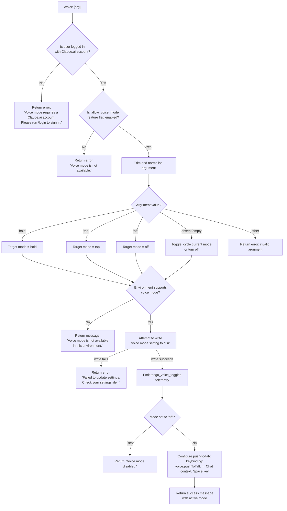

# `/voice`

> Analysis basis: CC v2.1.173 bundle.js (AST extraction + Claude interpretation)
> Minimum version: v2.1.173

---

## Overview

The `/voice` command toggles voice mode in Claude Code, allowing users to switch between three sub-modes: `hold` (push-to-talk), `tap` (toggle recording), and `off` (disabled). The command validates account eligibility and environment availability before writing the chosen mode to persistent settings. It emits a `tengu_voice_toggled` telemetry event on success.

---

## Registration

| Field | Value |
|---|---|
| type | `local` |
| name | `voice` |
| description | Toggle voice mode |
| argumentHint | `[hold\|tap\|off]` |
| supportsNonInteractive | `false` |
| isHidden | `null` |
| module_id | `kjK` |
| load_inline | `true` |
| loc_byte | `13222117` |
| loc_byte_end | `13222359` |
| loc_line | `9682` |
| arbor_handler.name | `Gt7` |
| arbor_handler.fqn | `claude-2.1.173::Gt7` |
| arbor_handler.kind | `AsyncFunction` |
| arbor_handler.resolution_path | `module_id` |
| arbor_handler.n_hits | `1` |

Analysis basis: CC v2.1.173 bundle.js:+13222117

---

## Input Branching

There are 5+ distinct branches (login check, feature-flag check, argument parsing, mode selection, environment availability), so a Mermaid flowchart is used.



Analysis basis: CC v2.1.173 bundle.js:+13219602 (handler entry), +13219630 (login check text), +13219742 (feature-flag denial), +13219863 (argument trim), +13220030 (settings write failure), +13220168 (disabled message), +13220412 (environment unavailable)

---

## Behavioral Spec

### Top-level handler (`Gt7`)

```
async function voiceCommandHandler(context):
    // Step 1 — Load settings and auth state
    settings = await loadSettingsAndAuth(context)        // Uw @ +13219613

    // Step 2 — Login gate
    if not isLoggedInWithClaudeAccount(settings):
        return textResult(
            "Voice mode requires a Claude.ai account. Please run /login to sign in."
        )                                                 // +13219643

    // Step 3 — Feature-flag gate
    featureAllowed = checkFeatureFlag("allow_voice_mode", settings)  // +13209711
    if not featureAllowed:
        return textResult("Voice mode is not available.")            // +13219742

    // Step 4 — Parse argument
    rawArg = context.args?.trim()                        // +13219863
    mode   = parseVoiceMode(rawArg)                     // Wt7 @ +13219796

    // Step 5 — Environment check
    if not isVoiceSupportedInEnvironment():
        return textResult(
            "Voice mode is not available in this environment."
        )                                                // +13220412

    // Step 6 — Persist setting
    writeOk = await persistVoiceModeSetting(mode)       // AA @ +13219932 (settings writer)
    if not writeOk:
        return textResult(
            "Failed to update settings. Check your settings file for syntax errors."
        )                                                // +13220030

    // Step 7 — Emit telemetry
    emitTelemetry("tengu_voice_toggled", { mode })      // +13220113

    // Step 8 — If disabling, return short confirmation
    if mode == "off":
        return textResult("Voice mode disabled.")        // +13220168

    // Step 9 — Register push-to-talk keybinding
    registerKeybinding({
        action:  "voice:pushToTalk",                    // +13221381
        context: "Chat",                                // +13221400
        key:     "Space"                                // +13221407
    })                                                  // eP @ +13221378

    // Step 10 — Return success
    return textResult(buildVoiceEnabledMessage(mode))
```

Analysis basis: CC v2.1.173 bundle.js:+13219602

---

### Argument parser (`Wt7`)

```
function parseVoiceMode(rawArg):
    trimmed = rawArg.trim()                             // +13219472

    if trimmed == "hold":    return "hold"              // +13219519
    if trimmed == "tap":     return "tap"               // +13219531
    if trimmed == "off":     return "off"               // +13219542
    if trimmed == "":        return deriveToggleMode()  // no arg → cycle
    return "invalid"                                    // +13219563
```

Analysis basis: CC v2.1.173 bundle.js:+13219472

---

### Feature-flag check (`TF8` → `p9`)

```
function checkFeatureFlag(flagName, settings):
    // flagName = "allow_voice_mode"                    // +13209711
    // delegates to the general settings / policy
    // flag-resolution chain (p9), which consults
    // enterprise/team plan tiers ("enterprise" +13209767,
    // "team" +13209760) and LP4 / MP4 flag sets
    return resolveFlag(flagName, settings)
```

Analysis basis: CC v2.1.173 bundle.js:+13209708 (`p9`), +13209767 (`TF8`)

---

### Settings persistence (`AA` and helpers)

The settings writer (`AA`) performs the following sequence:

```
async function persistVoiceModeSetting(mode):
    // 1. Determine target settings file path
    //    (.claude/settings.json or settings.local.json)  // +1296226, +1296236
    filePath = resolveSettingsPath()

    // 2. Acquire write lock / safe-write flow via atomic
    //    rename (uses randomBytes temp filename)          // +1088729
    tempPath = createAtomicTempFile(filePath)

    // 3. Read current settings JSON
    current = readFileSync(filePath)                      // +1052302

    // 4. Merge voiceMode field
    updated = merge(current, { voiceMode: mode })

    // 5. Write temp, fsync, rename                       // +1089165, +1089289, +1089417
    writeFileSync(tempPath, JSON.stringify(updated))
    fsyncSync(tempPath)
    renameSync(tempPath, filePath)

    return true

    // On any error: return false (caller shows user error)
```

Analysis basis: CC v2.1.173 bundle.js:+13219932 (`AA`), +1314392 (`R8`/ENOENT handling), +1314544 (Error path)

---

### Keybinding registration (`eP`)

When voice mode is enabled (not `off`), the handler registers a default keybinding:

```
function registerVoiceKeybinding():
    // Reads keybindings.json from ~/.claude/keybindings.json  // +3930955
    // Registers:
    //   action  = "voice:pushToTalk"   // +13221381
    //   context = "Chat"               // +13221400
    //   key     = "Space"              // +13221407
    // Fires telemetry if custom keybindings are already loaded:
    //   tengu_custom_keybindings_loaded / tengu_keybinding_fallback_used
    loadAndMergeKeybindings("voice:pushToTalk", "Chat", "Space")
```

Analysis basis: CC v2.1.173 bundle.js:+13221378 (`eP`), +13221381, +13221400, +13221407

---

### Microphone permission hint

When voice mode is being enabled, the handler conditionally surfaces a platform-specific microphone permission note:

> "System Settings → Privacy & Security → Microphone"
> (bundle.js:+13220919)

This string is displayed on macOS when the runtime detects that microphone access may not have been granted. The check is performed inside the environment-availability branch described above.

Analysis basis: CC v2.1.173 bundle.js:+13220899 (environment check vicinity), +13220919 (permission hint literal)

---

## State & Side Effects

| Item | Detail |
|---|---|
| Telemetry — primary | `tengu_voice_toggled` (emitted on every successful mode change, +13220113) |
| Telemetry — feature gates | `tengu_feature_ok` (+1016269), `tengu_feature_bad` (+1016336), `tengu_feature_sad` (+1016417) — emitted by the generic feature-flag infrastructure reached via `kH`/`A6` |
| Telemetry — keybinding | `tengu_custom_keybindings_loaded` (+3930861), `tengu_keybinding_fallback_used` (+3939959), `tengu_keybinding_customization_release` (+3930441) |
| Telemetry — settings write | `tengu_config_parse_error` (+3315074), `tengu_config_auth_loss_prevented` (+3309591) may fire in error paths |
| Settings file mutation | Writes `voiceMode` key to `~/.claude/settings.json` (or `settings.local.json`) via atomic rename. Reads settings with `loadSettingsFromDisk` (markers: `settings_load_started` +1300422, `settings_load_completed` +1301151) |
| Keybinding file | May create or update `~/.claude/keybindings.json` when enabling voice mode (+3930955) |
| appState changes | Active voice mode is reflected in application state via the settings layer; UI components observe the `voiceMode` field |
| Sound | None identified in depth-2 traversal |
| Non-interactive | `supportsNonInteractive: false` — command must be run in an interactive session |

---

## Version History

| Version | Change |
|---|---|
| v2.1.173 | Initial analysis |

---

## Common Mistakes

1. **Running without a Claude.ai login**: The command silently requires an authenticated Claude.ai account (`/login` flow). Using it with only an `ANTHROPIC_API_KEY` will trigger the account-required error at +13219643.
2. **Passing an unsupported argument**: Only `hold`, `tap`, and `off` are valid. Any other string (including `true`, `1`, `enable`) is treated as `"invalid"` (+13219563) and the command will error out.
3. **Expecting non-interactive use**: `supportsNonInteractive` is `false`; piping or scripting this command in non-interactive mode will fail.
4. **Corrupted settings file**: If `~/.claude/settings.json` has JSON syntax errors, the write will fail and the command returns the "Check your settings file for syntax errors" message (+13220030) without changing voice mode.
5. **Assuming the `Space` keybinding is always registered**: The `voice:pushToTalk` → `Space` keybinding is only registered when transitioning to a non-`off` mode. If the user sets `off`, no keybinding change is made.
6. **Environment restrictions**: In certain non-GUI or remote environments, voice mode may be unavailable even with a valid account and enabled feature flag (+13220412).

---

## Appendix — Identifier Mapping

> For bundle debugging only. Identifiers change across versions.

| Identifier | Role |
|---|---|
| `Gt7` | Main async handler for `/voice` command (arbor_handler) |
| `n46` | Inner dispatch helper — routes to settings loader and feature-flag checker |
| `GF8` | Settings + auth state initialiser (top-level wrapper) |
| `Uw` | Auth configuration builder (assembles API key / OAuth config) |
| `O7` | Auth provider selector |
| `vj` | OAuth / credential resolver |
| `B4` | First-party auth classifier |
| `NP` | API key normaliser |
| `$O` | Auth token dispatcher (checks ANTHROPIC_API_KEY, apiKeyHelper, etc.) |
| `D26` | Credential validator |
| `VrH` | Error formatter for auth failures |
| `BE` | Settings-layer write helper |
| `am6` | Feature-flag set accessor |
| `TF8` | Feature-flag check entry point (`allow_voice_mode`) |
| `p9` | Flag resolution engine (enterprise/team plan tiers) |
| `Ym1` | Flag-set cache populator |
| `oC` | Per-user flag resolver |
| `Rq` | Essential-traffic flag gate |
| `GLH` | Flag logging helper |
| `ZhH` | Tier-based flag evaluator |
| `q` | Data stream / event bus |
| `B_` | Performance measurement initiator |
| `vB` | Telemetry batch flusher |
| `pG` | Perf-mark emitter |
| `fq` | Memory-usage sampler |
| `Ju` | Module require wrapper (perf_hooks) |
| `sK_` | Settings-load orchestrator |
| `u8` | File-append logger |
| `Fg6` | Log path resolver |
| `Zw6` | Flag-settings merger (flagSettings / policySettings) |
| `TlA` | Settings key enumerator |
| `f` | Promise-tracking set / file-write helper (context-dependent) |
| `K` | Task queue / column formatter (context-dependent) |
| `zYH` | User-settings path builder |
| `L` | Connection/socket manager (context-dependent) |
| `ZB` | Local settings file writer |
| `PlA` | SDK inline settings injector |
| `VB` | Settings object constructor |
| `P_` | Platform detector |
| `i56` | IDE settings reader |
| `zo8` | Policy settings loader |
| `c56` | Project settings loader |
| `oZH` | Local settings loader |
| `aZH` | Flag settings loader |
| `o56` | SDK override applicator |
| `YYH` | Env-var settings reader |
| `DYH` | CLI-flag settings reader |
| `zf_` | Settings merge reducer |
| `mlA` | Settings validator |
| `Ea` | Settings schema checker |
| `Vw6` | WSL environment detector |
| `Bg6` | Telemetry batcher flush |
| `sm6` | Session metadata emitter |
| `Wt7` | Voice mode argument parser (hold/tap/off/invalid) |
| `H` | Random / timer utility (context-dependent) |
| `AA` | Settings write orchestrator |
| `y3` | Settings path + VB combo |
| `o6` | Logger / output writer |
| `aK_` | Settings multi-path writer |
| `U2` | Config file read+write helper |
| `ja` | File reader with BOM/encoding detection |
| `A$` | Symlink resolver |
| `N` | Normalise-path / OS helper |
| `Do6` | Directory-aware path helper |
| `_` | General utility / string methods (context-dependent) |
| `jo6` | JSON slice helper |
| `R8` | ENOENT error classifier |
| `N8` | Error code extractor |
| `fK_` | Timestamp cache setter (Date.now) |
| `HNH` | Settings-path + VB combo initialiser |
| `ra6` | User settings file path resolver |
| `Cz6` | Atomic file write (write → fsync → rename) |
| `O` | Symbolic-link stat helper |
| `m8` | Background-session stopped marker |
| `CH` | JSON.stringify wrapper |
| `FO` | Cache-clear helper (clears Ug6, ci8) |
| `Ka6` | Git-ignore aware config file writer |
| `p6` | AsyncLocalStorage store accessor |
| `Yo6` | Store getter + `pd` caller |
| `gq_` | J4 / lookup helper |
| `A` | String lowercase / array operations (context-dependent) |
| `qa6` | Git-ignore checker entry |
| `u_` | Git check-ignore executor |
| `jxf` | Global git-ignore file locator |
| `PdA` | Git-ignore rule applicator |
| `WdA` | Settings append helper |
| `Uu` | .claude directory path builder |
| `kH` | Feature-flag OK telemetry emitter |
| `c` | Core app-config accessor |
| `A6` | Feature-flag event emitter |
| `q56` | Feature event base |
| `t6` | Feature-flag SAD telemetry emitter |
| `bH` | Feature-flag BAD telemetry emitter |
| `SH` | Log/error queue pusher |
| `JA` | Error string normaliser |
| `f6` | String-cast utility |
| `MRf` | Log ring-buffer manager |
| `M` | MCP server connection map manager |
| `SRH` | MCP server registry orchestrator |
| `qi` | MCP server connection dispatcher |
| `dZ6` | MCP server slot resolver |
| `nt` | MCP server initialiser |
| `Og` | MCP SDK-type server collector |
| `SJ8` | MCP server status colour formatter |
| `gZ6` | MCP SSE/HTTP server connector |
| `QV` | MCP connection validator |
| `Hw` | MCP health-check helper |
| `MU_` | MCP capability merger |
| `g8` | Underscore utility wrapper |
| `pV6` | MCP server disabled filter |
| `Pc9` | MCP stdio/command connection builder |
| `tB_` | MCP command formatter |
| `j2H` | MCP tool-hash calculator (sha256) |
| `Xj8` | MCP tool schema extractor |
| `Pj8` | MCP tool-hash entry point |
| `nX` | MCP hash builder |
| `jj8` | MCP hash seed (`hf`) |
| `hf` | Hash seed constant accessor |
| `j8` | MCP debug logger |
| `eJ8` | MCP OAuth + connection flow orchestrator |
| `FWL` | MCP OAuth flow setup |
| `Nc` | Network client factory (`mu`/`rK`) |
| `R1H` | MCP claudeai-proxy URL builder |
| `C1H` | MCP connection config validator |
| `Q1H` | MCP OAuth server / token handler |
| `teH` | MCP pending-flow map manager |
| `Y` | Process-exit / abort controller |
| `_X8` | MCP needs-auth cache reader |
| `Li` | MCP reconnect orchestrator |
| `mu` | Network transport factory |
| `w` | MCP supervisor writer / config updater |
| `OL` | MCP error logger |
| `EH` | Error-to-string coercer |
| `gWL` | MCP auth-flow gate |
| `BWL` | MCP SSH/remote detection + URL builder |
| `HX8` | MCP OAuth callback URL handler |
| `seH` | MCP client-map getter |
| `eeH` | MCP pending-flow getter |
| `Nc9` | MCP reconnect sequence |
| `d9` | AsyncLocalStorage daemon-store getter |
| `tX8` | MCP needs-auth cache path builder |
| `GU_` | MCP tool-discovery flow |
| `j` | Process-list iterator |
| `S` | Background process manager |
| `pN` | MCP skills telemetry emitter (`tengu_mcp_skills`) |
| `Y6` | MCP skill set tracker |
| `LU_` | Environment feature-set resolver |
| `E8` | Global config reader (with auth-loss protection) |
| `k` | Warning array accumulator |
| `Ec9` | MCP integer-version parser |
| `FF` | Async-iterator / event-target adapter (Undici/fetch) |
| `vH6` | MCP version major parser |
| `eX8` | MCP version minor parser |
| `$n8` | MCP connection result applicator |
| `yRH` | MCP tool-hash diff checker |
| `r0` | MCP cleanup + reconnect trigger |
| `ZH6` | MCP tool-hash comparator |
| `$` | MCP server map accessor / ZwK dispatcher |
| `ZwK` | Daemon status writer |
| `Ua` | zLH config helper |
| `Sm6` | Daemon status JSON path builder |
| `oWA` | MCP full-refresh orchestrator |
| `UJ8` | MCP server allow-list checker |
| `d8` | Timeout/abort helper |
| `eP` | Keybinding registration entry point |
| `H$8` | Keybinding loader + action resolver |
| `LyH` | Keybinding file parser |
| `MI_` | Keybinding entry builder |
| `RF` | Keybinding skill-set check (`Y6`) |
| `$f` | Keybinding context resolver |
| `o7H` | keybindings.json path builder |
| `n6` | JSON.parse wrapper |
| `s38` | Keybinding block structure validator |
| `r38` | Keybinding entry extractor |
| `iM9` | Keybinding config-access guard |
| `fI_` | Duplicate-key detector in JSON keybindings |
| `LI_` | Keybinding deduplication + filtering |
| `_$8` | Default keybinding table builder |
| `YI_` | Platform-aware keybinding defaults |
| `wI_` | YaH keybinding helper |
| `BM9` | Keybinding matrix generator |
| `xl4` | Platform keybinding row builder |
| `$6` | q56 keybinding event emitter |
| `fFH` | Language/locale normaliser (`en` check) |
| `b6` | Global config object reader (with file-watch) |
| `PZ_` | Config path normaliser |
| `G7H` | Config file reader + backup manager |
| `bu` | BOM-strip / string slice helper |
| `C_9` | Config directory scanner |
| `GZ_` | Backup directory path builder |
| `D` | Background-session daemon controller |
| `b` | Background-task scheduled-execution wrapper |
| `kF8` | Low-memory check + `tengu_bg_low_mem_mb` emitter |
| `i06` | Background task manifest reader |
| `Q` | PTY/socket reconnect controller |
| `Q0A` | Daemon claim + socket auth handler |
| `r0A` | Daemon session lifecycle manager |
| `B` | Abort-signal bridge |
| `Zx4` | Config file watcher |
| `wF` | File-watch event debouncer |
| `y9` | Signal handler registrar |