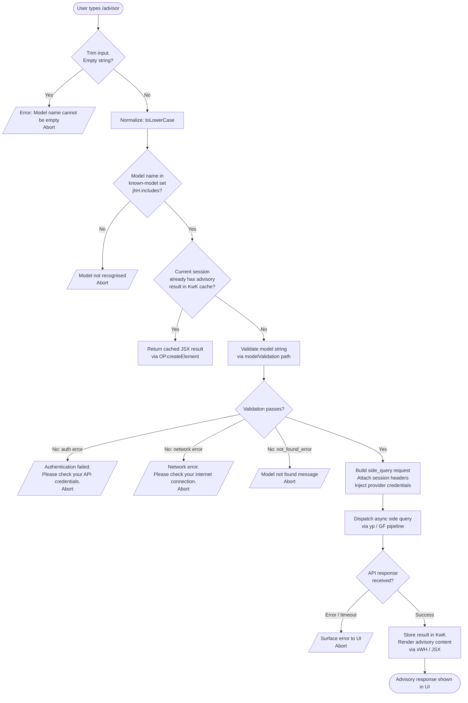

# `/advisor`

> Analysis basis: CC v2.1.174 bundle.js (AST extraction + Claude interpretation)
> Minimum version: v2.1.174

---

## Overview

`/advisor` enables Claude Code to consult a stronger or alternative model at key decision points during a session. When invoked, the command validates a target model name, dispatches a side-query API call to the selected model using the current session's credential infrastructure, and renders the advisory response inline within the Claude Code JSX UI. The feature acts as an escape hatch allowing the active agent to leverage a higher-capability model's judgment without abandoning the current session context.

---

## Registration

| Field | Value |
|---|---|
| type | `local-jsx` |
| name | `advisor` |
| description | `Let Claude consult a stronger model at key moments` |
| module_id | `zwK` |
| load_inline | `true` |
| loc_byte | `12918343` |
| loc_byte_end | `12918584` |
| loc_line | `9141` |
| argumentHint | `null` |
| isHidden | `null` |
| arbor_handler.name | `_a7` |
| arbor_handler.fqn | `claude-2.1.174::_a7` |
| arbor_handler.kind | `AsyncFunction` |
| arbor_handler.resolution_path | `module_id` |
| arbor_handler.n_hits | `1` |

Analysis basis: CC v2.1.174 bundle.js:+12918343

---

## Input Branching

The command exhibits five or more distinct execution paths depending on model-name validation, provider detection, cache-state, API outcomes, and error conditions. A Mermaid flowchart is used.



Analysis basis: CC v2.1.174 bundle.js:+12909055 (input trim), +12909092 (empty-name error), +12909259 (model set check), +12909361 (cache check), +12909406 (side-query dispatch), +12909828 (auth error string), +12909930 (network error string), +12917837 (JSX render)

---

## Behavioral Spec

### 1. Entry Point — Handler `advisorHandler` (`_a7`)

The primary async handler, resolved by Arbor via the `module_id` path (`zwK → _a7`).

```
async function advisorHandler(sessionContext, inputArgs):
    rawInput = inputArgs.trim()                     // A.trim @ +12917801
    modelToken = parseModelToken(rawInput)          // T9 @ +12917955
    advisoryResult = buildAdvisoryPayload(rawInput) // _p6 @ +12917969
    extraContext  = sessionContext.H                // H @ +12917995
    uiComponent   = renderAdvisoryUI(              // xWH @ +12918043
                        advisoryResult,
                        extraContext
                    )
    return joinOutputParts(uiComponent)             // tN6.join @ +12918112
```

Analysis basis: CC v2.1.174 bundle.js:+12917801

---

### 2. Model Name Validation — `buildAdvisoryPayload` (`_p6`)

Validates, normalises, and caches the model selection before initiating the advisory query.

```
async function buildAdvisoryPayload(rawInput):
    trimmed = rawInput.trim()                      // H.trim @ +12909055
    if trimmed == "":
        throw Error("Model name cannot be empty")  // literal @ +12909092

    // Parse model aliases and provider tokens
    parsed = parseModelContextTokens(trimmed)       // yz @ +12909126

    normalised = parsed.toLowerCase()              // A.toLowerCase @ +12909240

    // Validate against known model identifiers
    if not knownModels.includes(normalised):       // jhH.includes @ +12909259
        abort with model-not-found message

    // Check advisory result cache
    if resultCache.has(normalised):                // KwK.has @ +12909361
        return resultCache.get(normalised)

    // Dispatch side query to stronger model
    response = await dispatchSideQuery(normalised) // yp @ +12909406

    // Cache the result for session lifetime
    resultCache.set(normalised, response)          // KwK.set @ +12909569

    // Map model name to display token for UI
    displayToken = resolveDisplayToken(response)   // lo7 @ +12909610

    return displayToken
```

Analysis basis: CC v2.1.174 bundle.js:+12909055

---

### 3. Known-Model Registry — `resolveModelIdentifier` (`T9`)

Resolves a user-supplied alias to a canonical model identifier. The registry covers the following model families (enumerated from literals):

| Alias / Keyword | Canonical Model String |
|---|---|
| `fable` | `claude-fable-5` (bundle.js:+2254864) |
| `opusplan` | internal plan-tier Opus routing |
| `sonnet` | `claude-sonnet-4-5` / `claude-sonnet-4-0` etc. |
| `haiku` | `claude-haiku-4-5` |
| `opus` | `claude-opus-4-8` … `claude-opus-4-0` series |
| `best` | highest-ranked available model |
| `[1m]` | 1-million-token context variant |

The resolution logic applies several normalisation sub-functions:

```
function resolveModelIdentifier(inputAlias):
    lower = inputAlias.toLowerCase()               // _.toLowerCase @ +2260498

    // Provider-prefix check
    if startsWithAnthropicPrefix(lower):           // NY @ +2260516, KW @ +2260526
        lower = stripProviderPrefix(lower)

    // Tier matching
    tier = matchTierKeyword(lower)                 // Ol @ +2260544

    switch tier:
        case "fable":    return lookupFableModel(lower)    // GLH @ +2260579
        case "opusplan": return lookupOpusPlan(lower)      // ta  @ +2260599
        case "sonnet":   return lookupSonnetModel(lower)   // zT  @ +2260645
        case "haiku":    return lookupHaikuModel(lower)    // iDH @ +2260722
        case "opus":     return lookupOpusModel(lower)     // Vj6 @ +2260762, YD @ +2260766
        case "best":     return resolveBestModel()         // hv1 @ +2260795
        default:         return canonicalizeRaw(lower)     // y7  @ +2260813

    return validateFinalModel(result)              // x18 @ +2260819, EnH @ +2260827
```

Analysis basis: CC v2.1.174 bundle.js:+2260487

---

### 4. Side-Query Dispatch — `dispatchSideQuery` (`yp`)

Orchestrates the actual API call to the advisory model. Labelled internally with the tag `"side_query"` (literal at bundle.js:+13773629).

```
async function dispatchSideQuery(modelId):
    // Build API client targeting the resolved model
    client = buildApiClient(GF)                    // GF @ +13773597

    // Select appropriate fetch transport
    fetchFn = globalThis.fetch                     // globalThis.fetch @ +13773682

    // Attach request fingerprint for deduplication
    requestHash = computeRequestHash(EJA)          // EJA @ +13773790

    // Determine extended-context window preference
    contextWindow = resolveContextWindow(ZyH)      // ZyH @ +13773735

    // Validate web-search / tool inclusion
    toolSet = resolveToolSet(G.includes)           // G.includes @ +13773749

    // Enforce message count limit
    messageLimit = Math.min(limit, ...)            // Math.min @ +13774437

    // Apply prompt-cache 1h config if eligible
    cacheConfig = applyPromptCacheConfig(pCH)      // pCH @ +13774460
    // Telemetry: tengu_prompt_cache_1h_config     // @ +13720782

    // Build final message list
    messages = buildMessageList(LN, I.map, q.map) // LN @ +13774504

    // Sanitise lone surrogates in text
    sanitised = sanitiseSurrogates(c)             // c @ +13774955
    // Telemetry: tengu_lone_surrogate_sanitized   // @ +13774957

    // Dispatch request and await streaming response
    response = await GF(modelId, messages, ...)    // yp core dispatch

    // Record performance timing
    elapsed = performance.now() - startTime        // performance.now @ +13775044

    // Emit success telemetry
    emit("tengu_api_success", {elapsed})           // @ +13775208

    return response
```

Analysis basis: CC v2.1.174 bundle.js:+13773597

---

### 5. Core API Client — `buildApiClient` (`GF`)

Constructs the request object sent to the Anthropic (or compatible) API, adding all required HTTP headers and authentication tokens.

```
function buildApiClient(params):
    // Resolve x-app header ("bg" or "cli-bg" or "cli")
    appHeader = resolveAppHeader(j9)               // j9 @ +3222107
    // literals: "bg"@+2270363, "cli-bg"@+3222112, "cli"@+3222121

    // Attach User-Agent and session identifiers
    headers["User-Agent"]                = buildUA(El)  // El @ +3222140
    headers["X-Claude-Code-Session-Id"]  = sessionId   // literal @ +3222145
    headers["x-claude-remote-container-id"] = ...      // literal @ +3222189
    headers["x-claude-remote-session-id"]   = ...      // literal @ +3222230
    headers["x-client-app"]                 = ...      // literal @ +3222269
    headers["x-claude-code-agent-id"]       = ...      // literal @ +3222303
    headers["x-claude-code-parent-agent-id"]= ...      // literal @ +3222366

    // Authenticate: attempt OAuth token refresh
    tokenInfo = getOAuthToken(E.getToken)          // E.getToken @ +3226660
    // Logs: "[API:auth] OAuth token check starting" @ +3222682
    // Logs: "[API:auth] OAuth token check complete" @ +3222736

    if tokenInfo.refreshed:
        log("refreshed")                           // literal @ +3267846

    // Apply x-anthropic-additional-protection header if set
    addHeader("x-anthropic-additional-protection", ...)// literal @ +3222636

    // Validate API key / apiKeyHelper credential
    creds = resolveCredentials(Uw)                 // Uw @ +3222816
    // ANTHROPIC_API_KEY env var check             // literal @ +3249922

    // Build request timeout: 600000 ms default   // literal @ +3223054
    // Retry count: 10                             // literal @ +3223062

    // Cloud gateway session expiry check
    if gatewayExpired:
        throw "Cloud gateway session expired — run /login to reconnect."
        // literal @ +3223263

    return constructedApiRequest
```

Analysis basis: CC v2.1.174 bundle.js:+3222083

---

### 6. Display-Token Resolution — `resolveDisplayToken` (`lo7`)

Maps a canonical model ID returned by the side query to a short display token used in the UI badge.

```
function resolveDisplayToken(modelResponse):
    raw = String(modelResponse)                    // String @ +12910330

    inner = resolveInnerToken(no7)                 // no7 @ +12909665

    // Normalise to lowercase for matching
    lc = raw.toLowerCase()                         // H.toLowerCase @ +12910380

    // Check for known friendly-name substrings
    if lc.includes("fable-5") or lc.includes("fable_5"):
        return "fable-5"                           // literals @ +12910410, +12910433

    if lc.includes("opus-4-8") or lc.includes("opus_4_8"):
        return "opus-4-8"                          // literals @ +12910510, +12910534

    if lc.includes("opus-4-7") or lc.includes("opus_4_7"):
        return "opus-4-7"                          // literals @ +12910579, +12910603

    if lc.includes("opus-4-6") or lc.includes("opus_4_6"):
        return "opus-4-6"                          // literals @ +12910648, +12910672

    if lc.includes("opus-4-5") or lc.includes("opus_4_5"):
        return "opus-4-5"                          // literals @ +12910717, +12910741

    if lc.includes("sonnet-4-6") or lc.includes("sonnet_4_6"):
        return "sonnet-4-6"                        // literals @ +12910786, +12910812

    if lc.includes("sonnet-4-5") or lc.includes("sonnet_4_5"):
        return "sonnet-4-5"                        // literals @ +12910861, +12910887

    // Check provider context via hL
    provider = detectProvider(hL)                  // hL @ +12910484

    return provider-qualified display token
```

Analysis basis: CC v2.1.174 bundle.js:+12909665

---

### 7. UI Rendering — `renderAdvisoryUI` (`xWH`)

Constructs the JSX component tree shown to the user after the advisory response is received.

```
function renderAdvisoryUI(advisoryResult, sessionContext):
    // Build message context list
    contextTokens = parseContextTokens(yz)         // yz @ +7363065

    // Format each assistant turn
    formattedTurns = formatAssistantTurns(A1)      // A1 @ +7363146

    // Apply display constraints (dc_ sub-component)
    constrained = applyDisplayConstraints(dc_)     // dc_ @ +7363154
    //   dc_ uses: A1, T9, R_, PLH, WLH, TnH, DD_

    // Emit final React element
    return OP.createElement(AdvisoryPanel, {
        result:   advisoryResult,
        context:  constrained,
        session:  sessionContext
    })
    // OP.createElement @ +12917837
```

Analysis basis: CC v2.1.174 bundle.js:+12918043

---

### 8. Provider Detection Sub-system — `detectProvider` (`hL`)

Determines which backend provider is active so the right credential path is chosen.

```
function detectProvider(modelConfig):
    // Check UFH provider registry
    providerEntry = lookupProviderRegistry(UFH)    // UFH @ +2112473

    // Bedrock branch
    if providerEntry.type == "bedrock":            // literal @ +2112414
        return configureBedrockAuth(WO4)           // WO4 @ +2112498

    // Other providers: foundry, anthropicAws, mantle, vertex, firstParty, gateway
    // literals: "foundry"@+2110196, "anthropicAws"@+2110252,
    //           "mantle"@+2110306, "vertex"@+2110354,
    //           "firstParty"@+2110363, "gateway"@+2110839

    objectEntries = Object.entries(providerMap)    // GP1 @ +2112504

    return resolvedProvider
```

Analysis basis: CC v2.1.174 bundle.js:+2112473

---

### 9. Error Handling

The following named error strings are surfaced to the user under specific failure conditions:

| Condition | Error Message | Location |
|---|---|---|
| Empty model name | `"Model name cannot be empty"` | bundle.js:+12909092 |
| Authentication failure | `"Authentication failed. Please check your API credentials."` | bundle.js:+12909828 |
| Network failure | `"Network error. Please check your internet connection."` | bundle.js:+12909930 |
| Model not found (`not_found_error` type) | Prefixed with `"model:"` + detail | bundle.js:+12910049, +12910131 |
| Cloud gateway session expiry | `"Cloud gateway session expired — run /login to reconnect."` | bundle.js:+3223263 |

Validation sub-path identifier: `model_validation` (literal at bundle.js:+12909456).

---

## State & Side Effects

| Item | Detail |
|---|---|
| Telemetry | `tengu_api_success` (bundle.js:+13775208) — emitted on successful side-query completion |
| Telemetry | `tengu_lone_surrogate_sanitized` (bundle.js:+13774957) — emitted when input text contains lone Unicode surrogates that are cleaned before dispatch |
| Telemetry | `tengu_prompt_cache_1h_config` (bundle.js:+13720782) — emitted when 1-hour prompt-cache configuration is applied to the advisory request |
| Telemetry | `tengu_bg_retire_pinned_low_mem` (bundle.js:+16862823) — background worker eviction under memory pressure (reached via GF → k path) |
| Telemetry | `tengu_bg_prewarm_per_sweep` (bundle.js:+16862944) — background pre-warm sweep (reached via GF → k path) |
| Telemetry | `tengu_daemon_control` (bundle.js:+16895373) — daemon start/stop control events |
| Telemetry | `tengu_scheduled_task_missed` (bundle.js:+16354460) — missed scheduled task in the background worker system |
| Telemetry | `tengu_bg_dispatch_sigkill_escalate` (bundle.js:+16858186), `tengu_bg_dispatch_low_mem` (bundle.js:+16858787), `tengu_bg_spare_enable/claim/claim_fail` — background dispatch lifecycle |
| Session cache | Advisory result stored in `KwK` (Map-like store); key = normalised model name. `KwK.has` at +12909361, `KwK.set` at +12909569. Persists for session lifetime. |
| appState changes | None directly observable at depth-2 traversal; side-query result rendered inline via JSX only. |
| HTTP headers | Sets `User-Agent`, `X-Claude-Code-Session-Id`, `x-claude-remote-container-id`, `x-claude-remote-session-id`, `x-client-app`, `x-claude-code-agent-id`, `x-claude-code-parent-agent-id`, `x-anthropic-additional-protection` on each advisory API request. |
| OAuth | Triggers token refresh cycle if the current token is stale (log strings at bundle.js:+3222682, +3222736). |
| Timeout | Default request timeout: `600000` ms (10 minutes) (bundle.js:+3223054). |
| Retries | Maximum retry count: `10` (bundle.js:+3223062). |
| Sound | <!-- TODO: not found in depth-2 traversal; needs --depth 4 --> |

---

## Version History

| Version | Change |
|---|---|
| v2.1.174 | Initial analysis |

---

## Common Mistakes

1. **Supplying an unrecognised model alias.** The known-model set is checked via `jhH.includes` (bundle.js:+12909259) before any network call is made. Passing a model string not in the registry causes an immediate abort with a "not found" error — not a network request. Use one of the recognised keywords (`fable`, `sonnet`, `haiku`, `opus`, `best`, `opusplan`) or a full canonical model ID.

2. **Forgetting that results are session-cached.** The first successful advisory response is stored in the `KwK` cache (bundle.js:+12909361). Subsequent invocations with the same model name in the same session return the cached result immediately without making a new API call. To force a fresh query, start a new session.

3. **Expecting `/advisor` to replace the active model.** The command dispatches a one-shot *side query* (`"side_query"` tag, bundle.js:+13773629) — it does not switch the main agent's model. The advisory response is rendered inline, and the session model remains unchanged.

4. **Running `/advisor` when the cloud gateway session has expired.** The gateway expiry check (bundle.js:+3223263) fires before the side query is dispatched. If the session is expired, the command aborts with a prompt to run `/login` rather than attempting the query.

5. **Passing an empty string.** Whitespace-only input is trimmed (bundle.js:+12909055) and treated as an empty model name, producing the error `"Model name cannot be empty"` (bundle.js:+12909092). Always supply a model name or alias as the argument.

---

## Appendix — Identifier Mapping

> For bundle debugging only. Identifiers change across versions.

| Identifier | Role |
|---|---|
| `_a7` | Primary async handler for `/advisor` (AsyncFunction, arbor_handler) |
| `_p6` | Model-name validation and cache-check sub-handler |
| `T9` | Model alias resolution / canonical ID lookup |
| `yp` | Side-query dispatch orchestrator |
| `GF` | Core API client builder (headers, auth, timeout) |
| `lo7` | Display-token resolution from model response |
| `no7` | Inner display-token normalisation sub-function |
| `xWH` | JSX advisory UI renderer |
| `dc_` | Display constraint application within UI renderer |
| `yz` | Message context token parser |
| `hL` | Provider detection sub-system |
| `WO4` | Bedrock-specific authentication configuration |
| `GP1` | Provider-map Object.entries iterator |
| `AA8` | Provider registry lookup (find + resolve) |
| `UFH` | Provider registry data structure |
| `n_` | Shared normalisation utility |
| `L6` | String coercion utility |
| `KW` | Provider prefix strip / replace |
| `Ol` | Model tier keyword classifier |
| `GLH` | Fable-tier model lookup |
| `ta` | OpusPlan-tier model lookup |
| `u18` | Model string replacement helper |
| `zT` | Sonnet-tier model lookup |
| `iDH` | Haiku-tier model lookup |
| `Vj6` | Opus model string replacement |
| `YD` | Opus-tier model lookup |
| `hv1` | "Best" model resolver |
| `WLH` | Best-model inner resolution |
| `PLH` | Fable-5 inclusion check |
| `nDH` | Array validation within best-model path |
| `DD_` | Display constraint data builder |
| `TnH` | Includes-check within display constraints |
| `x18` | Final model validation check |
| `EnH` | Model string finaliser |
| `eY4` | toLowerCase helper in model path |
| `y7` | Default model canonicaliser |
| `NY` | Anthropic-prefix normaliser |
| `ELH` | Model family enum lookup |
| `uI` | Extended model resolution (ELH + tO + YL path) |
| `A1` | Model string formatter (includes jJ, bM6, q5) |
| `jJ` | Case/replace helper for model strings |
| `q5` | Model string replace utility |
| `tO` | Model token builder (FD6 + XO4 + BD6) |
| `FD6` | Token normalisation step 1 |
| `XO4` | Prefix detection for token |
| `BD6` | Case folding for provider tokens |
| `pCH` | Prompt-cache 1h config applicator |
| `GA` | Request builder utility |
| `w6` | Cache-control side-effect manager |
| `LN` | Message-list builder |
| `hZ_` | Message normaliser |
| `EyH` | HIPAA-aware message encoder |
| `ZyH` | Extended context window selector |
| `yI` | Context window normalisation helper |
| `q58` | Message inclusion checker |
| `qW` | Message mapper |
| `DWH` | Message dispatch wrapper |
| `RH` | JSON.stringify wrapper for message serialisation |
| `HF` | Random-bytes / nonce generator |
| `d4` | Request finaliser |
| `ShA` | Message stack pop utility |
| `jc6` | Message stack replacement utility |
| `Yc6` | Message stack validation |
| `khA` | Message replace helper |
| `bk` | Structured-clone utility |
| `EJA` | SHA-256 request hash builder |
| `Pq5` | User/text message finder |
| `U18` | Session context assembler (OK + n_ + m18 + _M + WD_) |
| `m18` | AsyncLocalStorage getStore for session context |
| `OK` | String coercion for context IDs |
| `WD_` | Context writer helper |
| `u58` | Normalisation utility (n_ wrapper) |
| `oGK` | Output token generator |
| `ezH` | Elapsed-time computation |
| `$1` | Telemetry event emitter (S56) |
| `S56` | Inner telemetry sink |
| `RG6` | API success response handler |
| `Cj9` | Streaming response parser |
| `vsH` | SSE event emitter |
| `SG6` | Streaming chunk handler |
| `kn` | Agent ID resolver (k6L + Mm) |
| `k6L` | Agent built-in prefix stripper |
| `Mm` | `repl_main_thread` prefix checker |
| `SH` | Structured error logger |
| `KM6` | Post-response cleanup |
| `Uw` | Credential resolver (ANTHROPIC_API_KEY / apiKeyHelper) |
| `eH8` | Proxy auth helper (proxyAuthHelper) |
| `Eu4` | Streaming response accumulator |
| `Iu4` | Request context injector |
| `yu4` | Session UUID manager |
| `Cw` | OAuth token cache (KS, ec, jcH) |
| `wO` | Token refresh driver |
| `Cv1` | Boolean coercion for auth flags |
| `HjH` | Request timing / latency measurement |
| `Ta8` | Date.now timestamp wrapper |
| `I26` | Header case-fold normaliser |
| `MJH` | Anthropic SDK error/warn logger |
| `a78` | Request finaliser (LW + _9 + A1 + rvH) |
| `Vj` | OAuth profile builder |
| `WjH` | WIF token exchange handler |
| `ZiH` | WIF credentials resolver (fetch-based) |
| `E` | Token math helpers (Math.max / Math.min) |
| `HW` | DO-based header writer |
| `V` | <!-- TODO: not found in depth-2 traversal; needs --depth 4 --> |
| `iO` | <!-- TODO: not found in depth-2 traversal; needs --depth 4 --> |
| `R_` | <!-- TODO: not found in depth-2 traversal; needs --depth 4 --> |
| `z9` | <!-- TODO: not found in depth-2 traversal; needs --depth 4 --> |
| `Al` | <!-- TODO: not found in depth-2 traversal; needs --depth 4 --> |
| `uc1` | <!-- TODO: not found in depth-2 traversal; needs --depth 4 --> |
| `L69` | <!-- TODO: not found in depth-2 traversal; needs --depth 4 --> |
| `G69` | <!-- TODO: not found in depth-2 traversal; needs --depth 4 --> |
| `GyH` | <!-- TODO: not found in depth-2 traversal; needs --depth 4 --> |
| `r78` | <!-- TODO: not found in depth-2 traversal; needs --depth 4 --> |
| `o78` | <!-- TODO: not found in depth-2 traversal; needs --depth 4 --> |
| `sJ6` | <!-- TODO: not found in depth-2 traversal; needs --depth 4 --> |
| `KM6` | Post-response cleanup |
| `R1` | CLI error exit handler (GUH + zX + process.exit) |
| `GUH` | CLI error formatter |
| `zX` | CLI error output writer |