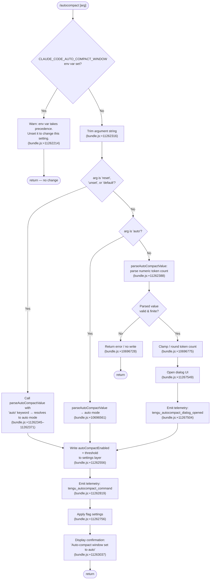

# `/autocompact`

> Analysis basis: CC v2.1.172 bundle.js (AST extraction + Claude interpretation)
> Minimum version: v2.1.172

---

## Overview

`/autocompact` configures the context-window compaction threshold, controlling how full the context must get before Claude Code automatically summarizes the conversation. It accepts a special keyword (`auto`, `reset`, `unset`, `default`) or a numeric token count, persists the result to user settings, and surfaces a confirmation dialog in the UI. When the environment variable `CLAUDE_CODE_AUTO_COMPACT_WINDOW` is already set, the command warns the user that the environment variable takes precedence and refuses to apply the change.

---

## Registration

| Field | Value |
|---|---|
| type | `local-jsx` |
| name | `autocompact` |
| description | `Set how full the context gets before auto-summarizing` |
| argumentHint | `[auto\|<tokens>]` |
| isHidden | `false` |
| module_id | `biq` |
| load_inline | `true` |
| loc_byte | `11267787` |
| loc_byte_end | `11268051` |
| loc_line | `7482` |
| arbor_handler.name | `Bv7` |
| arbor_handler.fqn | `claude-2.1.172::Bv7` |
| arbor_handler.kind | `AsyncFunction` |
| arbor_handler.resolution_path | `module_id` |
| arbor_handler.n_hits | `1` |

Analysis basis: CC v2.1.172 bundle.js:+11267787

---

## Input Branching

The command exhibits 5+ distinct input paths (env-var guard, `auto`/keyword reset, numeric token value, invalid input, settings-write side effects), so a Mermaid flowchart is used.



---

## Behavioral Spec

### 1. Main Handler — `autocompactCommandHandler` (Bv7)

```
async function autocompactCommandHandler(args, appState):
    rawArg = args.trim()

    -- Guard: environment variable override
    if environmentVariable("CLAUDE_CODE_AUTO_COMPACT_WINDOW") is set:
        displayWarning("CLAUDE_CODE_AUTO_COMPACT_WINDOW is set and takes precedence. Unset it to change this setting.")
        return

    -- Normalize reset keywords to canonical "auto"
    if rawArg in {"reset", "unset", "default"}:
        rawArg = "auto"

    -- Parse the argument
    parsedValue = parseAutoCompactValue(rawArg)

    if parsedValue is invalid:
        displayError(parsedValue.errorMessage)
        return

    -- Persist to settings
    writeSettings(parsedValue)

    -- Emit telemetry
    emitTelemetry("tengu_autocompact_command")

    -- Apply flag-level settings immediately
    applyFlagSettings()

    if parsedValue.mode == "auto":
        displayConfirmation("Auto-compact window set to auto")
    else:
        openDialog("dialog", parsedValue)
        emitTelemetry("tengu_autocompact_dialog_opened")
```

Analysis basis: CC v2.1.172 bundle.js:+11267469 (handler entry `Bv7`), +11262180 (inner logic `zx6`)

---

### 2. Argument Parsing — `parseAutoCompactValue` (CqA)

```
function parseAutoCompactValue(input):
    s = input.trim()

    if s == "auto":
        return { mode: "auto", tokens: null }

    -- Accept "k" suffix (e.g. "200k")
    if s.endsWith("k"):
        numeric = parseFloat(s) * 1000   -- multiply by 1000
    else:
        numeric = parseInt(s, 10)        -- base-10 parse

    -- Validity check
    if not Number.isFinite(numeric):
        return { valid: false, error: "not a finite number" }

    -- Round to nearest integer
    tokens = Math.round(numeric)

    return { mode: "tokens", tokens: tokens, valid: true }
```

Analysis basis: CC v2.1.172 bundle.js:+10696531 (`CqA`), +10696608 (`parseInt`), +10696682 (`parseInt` for k-suffix), +10696728 (`Number.isFinite`), +10696775 (`Math.round`)

---

### 3. Threshold Resolution — `resolveAutoCompactThreshold` (Gr)

The function merges multiple configuration sources to determine the active threshold. Priority order (highest → lowest):

1. `CLAUDE_CODE_AUTO_COMPACT_WINDOW` environment variable (bundle.js:+10697139)
2. `experiment` feature flag (bundle.js:+10697488)
3. `settings` layer — key `autoCompactEnabled` (bundle.js:+10697401, +10699444)
4. Model-default fallback — key `"model-default"` (bundle.js:+10697587)

```
function resolveAutoCompactThreshold(appState):
    -- 1. Environment variable
    envVal = env("CLAUDE_CODE_AUTO_COMPACT_WINDOW")
    if envVal is set:
        parsed = parseTokensFromEnv(envVal)   -- parseInt, isNaN check
        if valid:
            return { source: "env", tokens: clamp(parsed, 0, 1_000_000) }

    -- 2. Experiment flag
    if experimentFlagActive():
        return { source: "experiment", tokens: experimentValue }

    -- 3. User / project settings
    settingVal = readSetting("autoCompactEnabled")
    if settingVal is present:
        return { source: "settings", tokens: settingVal }

    -- 4. Model default
    return { source: "model-default", tokens: modelDefault }
```

Numeric bounds observed in the traversal:
- Token radix for env-var parse: base **10** (bundle.js:+3232569, +3232621)
- Lower bound: **0** (bundle.js:+3232641)
- Upper bound: **1,000,000** tokens (bundle.js:+3232754)
- Clamp applied via `Math.max` / `Math.min` (bundle.js:+10697257, +10697297)

Analysis basis: CC v2.1.172 bundle.js:+10697058 (`Gr` entry via `j1`), +10697073 (`_W` env-var branch), +10697135 (`Z1H` validity branch), +10697419 (`TFq` settings-merge branch)

---

### 4. Settings Persistence — `writeAutoCompactSetting` (AA / settings layer)

```
function writeAutoCompactSetting(value):
    -- Load merged settings from disk
    settings = loadSettingsFromDisk()   -- emits: loadSettingsFromDisk_start / end

    -- Determine target layer (userSettings / projectSettings / localSettings)
    layer = resolveTargetLayer(settings)

    if layer is policy-locked:
        warn("write_ineffective")
        return

    -- Serialize and atomically write via temp-file rename
    tempFile = openTempFile()
    writeFileSync(tempFile, JSON.stringify(settings))
    fchmodSync(tempFile, originalPermissions)
    fsyncSync(tempFile)
    renameSync(tempFile, targetPath)

    -- Clear in-memory settings caches
    clearSettingsCache()   -- mg6.clear(), Qi8.clear()
```

Key settings file paths observed:
- User settings: `~/.claude/settings.json` (bundle.js:+1296226, +1296236)
- Local settings: `~/.claude/settings.local.json` (bundle.js:+1296298)

Atomic write pattern uses `C9_.randomBytes` (6 bytes, hex — bundle.js:+1088729, +1088745, +1088757) to generate a unique temp-file name, then `renameSync` for atomicity (bundle.js:+1089417).

Analysis basis: CC v2.1.172 bundle.js:+1314265 (`AA`), +1314392 (`R8`/`N8` error handling), +1315035 (`Aa6` write path)

---

### 5. Status Validation — `validateAutoCompactStatus` (Z1H)

```
function validateAutoCompactStatus(rawValue):
    n = parseInt(rawValue, 10)
    if isNaN(n):
        return { status: "invalid" }   -- bundle.js:+5008627
    if n is within policy bounds:
        return { status: "valid" }     -- bundle.js:+5008552
    else:
        return { status: "capped" }    -- bundle.js:+5008757
```

Analysis basis: CC v2.1.172 bundle.js:+5008567 (`parseInt`), +5008585 (`isNaN`), +5008698 (`N` — status message formatter)

---

### 6. Dialog UI Component (Bv7 → JSX)

When a numeric value is provided and valid, the handler calls `o$.createElement` to render a dialog component with:
- Mode string `"dialog"` (bundle.js:+11267549)
- The parsed compaction value
- Triggers `tengu_autocompact_dialog_opened` telemetry (bundle.js:+11267504)

Analysis basis: CC v2.1.172 bundle.js:+11267561 (`o$.createElement`), +11267546 (`$6` component ref)

---

## State & Side Effects

| Item | Detail |
|---|---|
| Telemetry: `tengu_autocompact_command` | Fired on every successful `/autocompact` invocation (bundle.js:+11262819) |
| Telemetry: `tengu_autocompact_dialog_opened` | Fired when the numeric-value dialog UI is opened (bundle.js:+11267504) |
| Telemetry: `tengu_amber_redwood2` | Fired inside the settings-merge path `Y6` (bundle.js:+10696946) — feature-flag experiment tracking |
| Telemetry: `tengu_feature_ok` | Settings write succeeded (bundle.js:+1016269) |
| Telemetry: `tengu_feature_bad` | Settings write produced a non-fatal warning (bundle.js:+1016336) |
| Telemetry: `tengu_feature_sad` | Settings write failed (bundle.js:+1016417) |
| Settings file written | `~/.claude/settings.json` or `settings.local.json` — atomic rename pattern |
| In-memory cache cleared | `mg6` and `Qi8` caches cleared after every successful write (bundle.js:+27446, +27458) |
| Flag settings applied | `applyFlagSettings` called immediately after write (bundle.js:+11262756) |
| `autoCompactEnabled` key | Written to the resolved settings layer (bundle.js:+10699444) |
| Warning displayed | When `CLAUDE_CODE_AUTO_COMPACT_WINDOW` env var is present (bundle.js:+11262214) |
| `write_ineffective` diagnostic | Emitted when settings layer is policy-locked (bundle.js:+1315256) |
| `gitignore_global_rule` diagnostic | Emitted during settings-path resolution if git ignore rules apply (bundle.js:+1315115) |
| Sound | <!-- TODO: not found in depth-2 traversal; needs --depth 4 --> |
| appState changes | `autoCompactEnabled` setting updated; in-memory settings object refreshed via cache invalidation |

---

## Version History

| Version | Change |
|---|---|
| v2.1.172 | Initial analysis |

---

## Common Mistakes

1. **Setting the value while `CLAUDE_CODE_AUTO_COMPACT_WINDOW` is set** — The command will display a warning and make no change. Unset the environment variable first, then re-run `/autocompact`.
2. **Passing a non-numeric, non-keyword argument** — Anything that is not `auto`, `reset`, `unset`, `default`, or a valid integer/float (with optional `k` suffix) will fail the `Number.isFinite` check and produce an error without writing settings.
3. **Expecting the change to survive a policy layer** — If an administrator-managed policy settings layer covers `autoCompactEnabled`, the write is flagged as `write_ineffective` and the value will be overridden at runtime.
4. **Using `reset` and expecting it to delete the key** — `reset`, `unset`, and `default` are all normalized to `"auto"` mode internally; they do not remove the `autoCompactEnabled` key from disk but rather write the `auto` sentinel value.
5. **Confusing token count with percentage** — The argument is an absolute token count (rounded integer, clamped to `[0, 1 000 000]`), not a percentage of context window.

---

## Appendix — Identifier Mapping

> For bundle debugging only. Identifiers change across versions.

| Identifier | Role |
|---|---|
| `Bv7` | Main async handler for `/autocompact` command (`autocompactCommandHandler`) |
| `zx6` | Inner command-logic function (env-var guard, arg normalization, settings write orchestration) |
| `Gr` | Threshold resolution / settings-merge function (`resolveAutoCompactThreshold`) |
| `j1` | Model-identifier normalization helper |
| `D_8` | Model-entry builder (uses `Object.entries`) |
| `DJ` | Model-string canonicalization (toLowerCase, includes, replace) |
| `so8` | Model list constant / registry |
| `R3` | Model-string replace helper |
| `LX` | Feature-flag lookup wrapper |
| `BG` | Base feature-flag store |
| `_W` | Environment-variable token parser (parseInt + isNaN guard) |
| `R89` | Raw env-var integer parse (parseInt, isNaN, base-10) |
| `jE_` | Token-validity adjudicator |
| `C89` | Token-clamp applier (uses `NY`, `BB`, `qS`, `$78`) |
| `Z1H` | Auto-compact status validator (`valid`/`invalid`/`capped`) |
| `N` | Status-message formatter (toUpperCase, trim, locale helpers) |
| `TFq` | Settings-merge orchestrator (calls `ZZ`, `b_`, `Y6`, `CqA`) |
| `ZZ` | Settings-layer combiner (calls `f6`, `K4`) |
| `b_` | Settings fallback resolver |
| `Y6` | Experiment-flag settings path (fires `tengu_amber_redwood2`) |
| `CqA` | Argument value parser (`parseAutoCompactValue`) — handles `auto`, `k` suffix, `parseFloat`, `parseInt`, `Number.isFinite`, `Math.round` |
| `AA` | Settings write orchestrator (loads, merges, writes, clears cache) |
| `y3` | Settings-object builder |
| `OYH` | Settings-file path resolver (userSettings / projectSettings / localSettings) |
| `VB` | Settings-object layer merger |
| `o6` | OS/path utility accessor |
| `rK_` | Settings-file read helper |
| `PlA` | Settings JSON parser (Object.keys, `Da`) |
| `ZB` | Settings-path builder (`HZA`, `vy`, `lK_`, `_ZA`) |
| `jlA` | SDK inline-settings handler |
| `U2` | User-settings file loader |
| `ja` | File read with truncation (readFileSync, slice at 4096, replaceAll) |
| `R8` | Error-code classifier |
| `N8` | `ENOENT` error handler |
| `qK_` | Cache-timestamp writer (`$a6.set`, `Date.now`) |
| `tvH` | Settings-tier helper (calls `na6`, `VB`) |
| `na6` | Settings path joiner (`XI.resolve`, `XI.dirname`) |
| `Sz6` | Atomic file writer (readlink, lstat, openSync, writeFileSync, fchmodSync, fsyncSync, renameSync, unlinkSync) |
| `q` | Filesystem module proxy |
| `O` | Stat-result proxy (isSymbolicLink) |
| `L` | File-descriptor proxy (close, toString) |
| `CH` | JSON serializer (`JSON.stringify`) |
| `FO` | In-memory settings cache clearer (`mg6.clear`, `Qi8.clear`) |
| `Aa6` | Settings append/write helper (git-ignore check, mkdir, readFile, appendFile, writeFile) |
| `p6` | Path-utility initializer (`zo6`, `P_`) |
| `Bq_` | Conflict-detection helper (`J4`) |
| `A` | String utility proxy (toLowerCase) |
| `_a6` | Git-ignore check helper (`u_`) |
| `Yxf` | Path-expansion helper (homedir, isAbsolute, join, trim) |
| `jdA` | Git ls-files tracker helper (`u_`) |
| `JdA` | Git-ignore append logic |
| `Uu` | Path joiner for `.claude` directory |
| `P_` | Feature-flag store accessor (`BG`) |
| `kH` | Feature-ok telemetry emitter (`tengu_feature_ok`) |
| `c` | Core telemetry/event emitter |
| `A6` | Telemetry dispatch (uses `_56`) |
| `s6` | Feature-sad telemetry emitter (`tengu_feature_sad`) |
| `bH` | Feature-bad telemetry emitter (`tengu_feature_bad`) |
| `vB` | Settings-load-from-disk orchestrator (fires `loadSettingsFromDisk_start/end`) |
| `pG` | Settings-disk read initiation |
| `fq` | Memory-usage sampler (`process.memoryUsage`, dedup via `GNA`) |
| `oK_` | Settings-load worker (`settings_load_started/completed`) |
| `pg6` | Post-load settings processor |
| `SH` | Log/error queue manager (`fRf`, `iQH.push`, `Ya.logError`) |
| `JA` | Error-string builder |
| `f6` | String coercer (`String(...)`) |
| `Rq` | Traffic-category classifier (`essential-traffic`) |
| `fRf` | Rotating log buffer (`Ko6.shift`, `Ko6.push`) |
| `B_` | Settings-load-from-disk public entry (`vB`) |
| `$6` | Dialog UI component reference |
| `_56` | Low-level telemetry sink |
| `MK` | Number formatter (`eK`) |
| `eK` | Locale-aware compact formatter (`en-US`, `compact`, `.0` suffix — `r8f`) |
| `r8f` | Intl.NumberFormat or equivalent numeric formatter |

---

Note: index built via Arbor fallback; some signals (telemetry, literals) may be missing — see arbor-fallback.js.