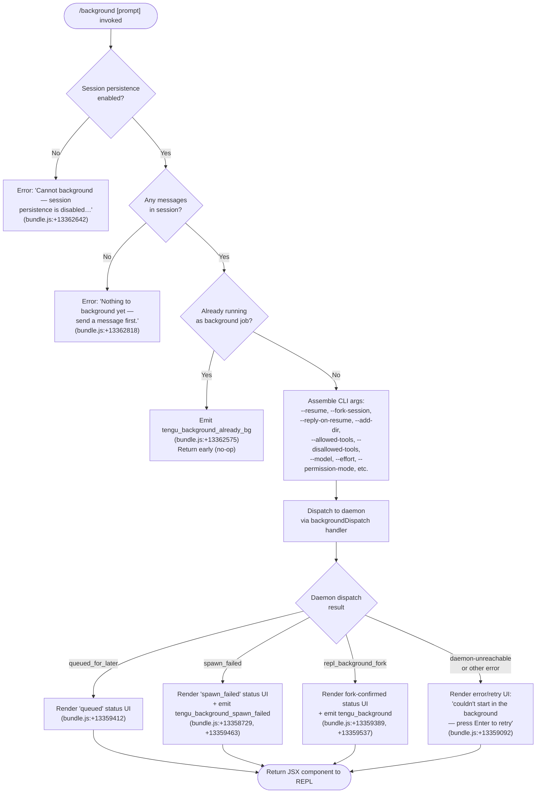

# `/background`

> Analysis basis: CC v2.1.174 bundle.js (AST extraction + Claude interpretation)
> Minimum version: v2.1.174

---

## Overview

The `/background` command (alias `/bg`) detaches the current interactive REPL session and hands it off to the Claude Code background daemon, freeing the terminal for other use. It does so by forking the session into a daemon-managed job, optionally appending a follow-up prompt to the backgrounded task, and rendering a status UI that reflects the daemon dispatch result.

---

## Registration

| Field | Value |
|---|---|
| type | `local-jsx` |
| name | `background` |
| description | `Send this session to the background and free the terminal` |
| aliases | `["bg"]` |
| argumentHint | `[prompt]` |
| immediate | `null` |
| module_id | `T2K` |
| load_inline | `true` |
| loc_byte | `13363288` |
| loc_byte_end | `13363528` |
| loc_line | `9774` |
| arbor_handler.name | `q_5` |
| arbor_handler.fqn | `claude-2.1.174::q_5` |
| arbor_handler.kind | `AsyncFunction` |
| arbor_handler.resolution_path | `module_id` |
| arbor_handler.n_hits | `0` |

Analysis basis: CC v2.1.174 bundle.js:+13363288

---

## Input Branching

Five or more distinct outcomes are possible depending on persistence state, existing session state, and daemon dispatch result; a flowchart is used.



Analysis basis: CC v2.1.174 bundle.js:+13362561 – +13362888

---

## Behavioral Spec

### Handler Entry (`q_5`)

The Arbor-resolved handler is `q_5` (AsyncFunction, resolved via `module_id → T2K`).

```
async function backgroundCommandHandler(input, appContext):
    // Gate 1: persistence
    if NOT sessionPersistenceEnabled(appContext):
        return errorJSX("Cannot background — session persistence is disabled…")

    // Gate 2: session has content
    if sessionMessages(appContext).length == 0:
        return errorJSX("Nothing to background yet — send a message first.")

    // Gate 3: already backgrounded
    if isAlreadyBackgroundJob(appContext):
        emit telemetry("tengu_background_already_bg")
        return  // no-op

    // Build CLI argument list for the forked worker
    cliArgs = buildBackgroundArgs(input, appContext)
    // includes: --resume, --fork-session, --reply-on-resume (if prompt given),
    //           --add-dir, --allowed-tools, --disallowed-tools,
    //           --model, --effort, --permission-mode, --

    // Dispatch
    dispatchResult = await daemonBackgroundDispatch(cliArgs, appContext)

    // Render outcome as JSX
    return renderDispatchResult(dispatchResult)
```

Analysis basis: CC v2.1.174 bundle.js:+13362561

---

### Argument Assembly (`buildBackgroundArgs`)

This sub-routine (reached via `gg8` → many literal flags) constructs the argument vector forwarded to the daemon worker.

```
function buildBackgroundArgs(userPrompt, appContext):
    args = []

    sessionId = currentSessionId(appContext)
    args.push("--resume", sessionId)
    args.push("--fork-session")

    if userPrompt is non-empty:
        args.push("--reply-on-resume", userPrompt)

    for each addedDir in appContext.addedDirs:
        args.push("--add-dir", addedDir)

    if appContext.allowedTools is set:
        args.push("--allowed-tools", join(appContext.allowedTools))

    if appContext.disallowedTools is set:
        args.push("--disallowed-tools", join(appContext.disallowedTools))

    if appContext.model is set:
        args.push("--model", appContext.model)

    if appContext.effort is set:
        args.push("--effort", appContext.effort)

    if appContext.permissionMode is set:
        args.push("--permission-mode", appContext.permissionMode)

    args.push("--")   // end-of-options sentinel

    return args
```

Known flag literals (bundle.js): `--resume` (+13358085), `--fork-session` (+13358098), `--reply-on-resume` (+13358140), `--add-dir` (+13358192), `--allowed-tools` (+13358227), `--disallowed-tools` (+13358268), `--model` (+13358299), `--effort` (+13358328), `--permission-mode` (+13358345), `--` (+13358373).

---

### Pre-Dispatch Validation Gates

Before the daemon call, the handler evaluates two additional guards visible in the call graph through `__5` / `qn` / permission-check callers:

```
function validateBackgroundPreconditions(appContext):
    // bypassPermissions guard
    if appContext.permissionMode == "bypassPermissions":
        if NOT disclaimerAccepted(appContext):
            throw "--bg with bypassPermissions requires accepting the disclaimer first…"
            // (bundle.js:+13356227)

    // auto-mode guard
    if appContext.permissionMode == "auto":
        if NOT autoModeOptedIn(appContext):
            throw "--bg with auto mode requires opting in first…"
            // (bundle.js:+13356389)

    // --cloud / --remote conflict
    if args include "--cloud" or "--remote":
        throw "--bg and --cloud are different backends…"
        // (bundle.js:+13305102)
```

Analysis basis: CC v2.1.174 bundle.js:+13356058, +13356090, +13305249

---

### Daemon Dispatch (`daemonBackgroundDispatch` / `BDA`)

The daemon dispatch path (reached via `fo` → `n85` → `BDA`) performs the following in sequence:

```
async function daemonBackgroundDispatch(cliArgs, appContext):
    // 1. Ensure daemon is running (may prompt user to install service)
    await ensureDaemonRunning(appContext)
    //    literals: "Install as a service now? [y/N/never, or 'once' just for now]"
    //    (bundle.js:+13302702)
    //    telemetry: tengu_bg_daemon_cold_start_ask (bundle.js:+13296129)

    // 2. Write dispatch file to daemon socket directory
    jobId = randomBytes(8).hex()   // (bundle.js:+13333999, +13338845)
    dispatchFile = path.join(dispatchDir, jobId)
    writeDispatchFile(dispatchFile, cliArgs)

    // 3. Connect to daemon control socket with timeout 6000 ms
    //    (bundle.js:+13334161)
    conn = await connectToDaemonSocket(timeout=6000)

    // 4. Send dispatch message; await ACK
    result = await sendAndAwaitAck(conn, dispatchFile, timeout=448 ms)
    //    (bundle.js:+13334720)

    // 5. Classify result
    if result == "short_alive":
        return { status: "short_alive",
                 message: "Previous session is still shutting down — try again in a moment" }
        // (bundle.js:+13343195)

    if result == "stale_short":
        return { status: "stale_short" }

    emit telemetry("tengu_bg_dispatch", …)
    // (bundle.js:+13335774)

    return result
```

Analysis basis: CC v2.1.174 bundle.js:+13333653, +13334073, +13334143

---

### Outcome Rendering (`renderDispatchResult` / `Qg8`)

```
function renderDispatchResult(result):
    switch result.status:
        case "repl_background_fork":
            emit telemetry("tengu_background")
            return JSX showing "(backgrounded)" label
            // literal: "(backgrounded)" (bundle.js:+13360272)
            // timeout for status display: 120 s (bundle.js:+13360042)

        case "queued_for_later":
            return JSX showing queued indicator

        case "spawn_failed":
            emit telemetry("tengu_background_spawn_failed")
            return JSX showing spawn-failed message

        default (error / unreachable):
            return JSX with "couldn't start in the background — press Enter to retry"
            // (bundle.js:+13359092)
```

Analysis basis: CC v2.1.174 bundle.js:+13359345, +13359389, +13359537, +13360005

---

### Detach-Request Signal (`r$H` / `Rr`)

When the handler successfully determines the session should detach, it sends a `"detach-request"` control message through the worker IPC channel before yielding the terminal.

```
function sendDetachRequest(workerChannel):
    message = { type: "detach-request" }   // (bundle.js:+11281699)
    workerChannel.write(serialize(message))
    // uses Rr → RHH.write (bundle.js:+10617444)
```

Analysis basis: CC v2.1.174 bundle.js:+11281684, +11281699

---

### Flush Timeout (`k4`)

Before detaching, the handler waits up to 2000 ms for any in-flight writes to flush, using `Promise.race` against a timeout sentinel.

```
async function awaitFlushOrTimeout():
    FLUSH_TIMEOUT_MS = 2000   // (bundle.js:+13358029)
    timeoutMessage = "flush timeout"   // (bundle.js:+13358034)

    result = await Promise.race([
        waitForFlush(),
        sleep(FLUSH_TIMEOUT_MS).then(() => timeoutMessage)
    ])
    clearTimeout(...)
    return result
```

Analysis basis: CC v2.1.174 bundle.js:+13358021, +13358029, +13358034

---

## State & Side Effects

| Item | Detail |
|---|---|
| Telemetry — `tengu_background_already_bg` | Fired when command is invoked but the session is already a background job (bundle.js:+13362575) |
| Telemetry — `tengu_background` | Fired on successful fork/background dispatch (bundle.js:+13359537) |
| Telemetry — `tengu_background_spawn_failed` | Fired when the daemon reports a spawn failure (bundle.js:+13358729) |
| Telemetry — `tengu_bg_dispatch` | Fired inside the daemon dispatch routine on each attempt (bundle.js:+13335774) |
| Telemetry — `tengu_bg_dispatch_fallback` | Fired when dispatch falls back to alternate path (bundle.js:+13336304) |
| Telemetry — `tengu_bg_dispatch_rescued` | Fired when a dispatch is recovered after transient failure (bundle.js:+13342255) |
| Telemetry — `tengu_bg_daemon_cold_start_ask` | Fired when user is prompted to install the daemon service (bundle.js:+13296129) |
| Telemetry — `tengu_bg_daemon_cold_start_ask_answer` | Fired with the user's install answer (bundle.js:+13302777) |
| Telemetry — `tengu_bg_daemon_spawn_failed` | Fired if daemon spawn itself fails (bundle.js:+13296648) |
| appState changes | Session is forked; a new job ID is assigned to the daemon. The foreground terminal process detaches from its PTY lease. |
| Daemon socket | A dispatch file is written to the daemon socket directory; a control-socket connection is opened and closed. |
| PTY / terminal | Sends `"detach-request"` over the worker IPC channel; the terminal is freed after the flush timeout (≤ 2000 ms). |
| Sound | <!-- TODO: not found in depth-2 traversal; needs --depth 4 --> |
| Hook registration | None observed in depth-2 traversal. |

---

## Version History

| Version | Change |
|---|---|
| v2.1.174 | Initial analysis |

---

## Common Mistakes

1. **Invoking before sending a message.** The command explicitly guards against an empty session (`"Nothing to background yet — send a message first."`). Always ensure at least one exchange has occurred.
2. **Using `/background` with `--dangerously-skip-permissions` without prior interactive acceptance.** The bypassPermissions gate requires the disclaimer to have been accepted in an interactive session first.
3. **Using `/background` with `--permission-mode auto` without prior opt-in.** The auto-mode gate similarly requires prior interactive opt-in.
4. **Mixing `--bg` (CLI flag) and `--cloud` / `--remote`.** These target different execution backends and cannot be combined; the command will error with an informative message.
5. **Retrying immediately after "Previous session is still shutting down".** The `short_alive` condition means the prior session's daemon slot has not yet been released. Wait a moment before retrying.
6. **Expecting the forked job to inherit all flags automatically.** Only the flags explicitly threaded through `buildBackgroundArgs` (model, effort, permission-mode, allowed/disallowed-tools, add-dir) are forwarded. Flags not in that list are not forwarded to the background job.

---

## Appendix — Identifier Mapping

> For bundle debugging only. Identifiers change across versions.

| Identifier | Role |
|---|---|
| `q_5` | Main async handler for `/background` command (Arbor-resolved) |
| `gg8` | Background argument-assembly / main dispatch orchestrator |
| `Qg8` | Dispatch-result renderer (produces JSX outcome component) |
| `fo` | Session fork initializer; sets up job directory and temporary files |
| `n85` | Core background dispatch logic; classifies dispatch outcomes |
| `BDA` | Daemon dispatch async function; handles socket write + ACK |
| `Od` | Daemon ensure-running helper; may spawn transient daemon |
| `lp6` | Daemon status poll and cold-start ask flow |
| `cY` | Control socket connect-and-handshake helper |
| `dm8` | Alternate (re-connect) control socket connect helper |
| `hKH` | Reads daemon socket/auth file |
| `L2K` | Dispatch result classification helper |
| `pDA` | Dispatch file path assembly helper |
| `__5` | Permission / bypass-permissions gate checker |
| `qn` | CLI flag token parser (slice/has) |
| `k4` | Flush-await-or-timeout helper (2000 ms race) |
| `r$H` | Detach-request sender over worker IPC channel |
| `Rr` | Low-level IPC write helper |
| `Zoq` | IPC message serializer |
| `BOH` | Pre-command environment/production-mode check |
| `PhH` | Async store context accessor |
| `AM` | Wraps store `getStore` call |
| `wT` | Resolves `ND_` async local store |
| `j9` | Worker IPC `aDH` adapter |
| `WVH` | Process-exit path for forced shutdown |
| `oDA` | Signal/interrupt registration helper |
| `M4` | Generic signal registration |
| `R9` | `qvA.register` — process signal registry |
| `OY` | Session-list / active session resolver |
| `R1` | Process-exit dispatcher (calls `GUH`, `zX`, then `process.exit`) |
| `tM` | Session-state lookup |
| `CZ` | Signal cleanup / cancel path |
| `W46` | Full-session fork + rename orchestrator |
| `nB7` | Fork-agent invocation with abort signal |
| `kT` | Agent turn executor (calls `sS8`, `tS8`, `LR`, etc.) |
| `sS8` | App-state getter/setter for agent loop |
| `NR` | Prompt normalization + context assembly |
| `LUH` | Prompt-assembly wrapper (calls `jfA`, `rGK`) |
| `rGK` | Core API query orchestrator |
| `jx8` | Request builder / file-hash helper |
| `LZ` | Message normalization pipeline |
| `C6` | Config read helper (reads config file, sets up watcher) |
| `C7H` | Config file parser (JSON + backup logic) |
| `em4` | Config file watcher setup |
| `jK8` | Config initialization gate |
| `Ng8` | Daemon telemetry / low-memory reporter |
| `w6` | Telemetry event emitter |
| `zZ5` | Repaint scroll-position adjuster |
| `wZ5` | Supervisor-side respawn/cleanup helper |
| `YZ5` | PTY supervisor main loop |
| `kaK` | Lease timeout / drop-old-lease helper |
| `SH` | Structured log writer |
| `HCH` | MCP server connection manager |
| `NGA` | MCP server retry / reconnect manager |
| `Mi8` | MCP connection result applier |
| `_G` | MCP slot cleanup helper |
| `D` | Daemon worker/job lifecycle manager |
| `k` | Daemon supervisor heartbeat ticker |
| `l` | Grace-clock / scheduled-task tracker |
| `R` | Supervisor heartbeat write helper |
| `S` | Supervisor mtime-change executor |
| `W` | Daemon foreground-yield handler |
| `F` | Write-flush-with-backpressure helper |
| `Q` | PTY attach/reconnect manager |
| `xZ` | Unix socket path builder |
| `Jv` | IPC frame encoder |
| `ou8` | IPC frame decoder |
| `b6` | Async-local store accessor |
| `eo6` | `to6.getStore` wrapper |
| `j_` | `rG` logger adapter |
| `oG` | `rG` logger accessor |
| `LW` | Auth/login type resolver |
| `n_` | Login type to display string |
| `YL` | Auth header assembler |
| `PD_` | Managed-key / `sk-ant-` prefix detector |
| `_9` | Auth mode brancher |
| `iDH` | `hL` hash helper |
| `HD` | Dispatch "rescued" path |
| `WC` | Compact-boundary marker |
| `C86` | Background session UI label helper |
| `UWH` | Post-dispatch cleanup |
| `t6` | `c` / `A6` feature-flag checker |
| `fz` | Compact-boundary ID slicer |
| `Ju8` | `pJ` compact-type accessor |
| `pXH` | Working-dir / job-state snapshot helper |
| `Rz` | `cVH` state-cache check |

---

Note: index built via Arbor fallback; some signals (telemetry, literals) may be missing — see arbor-fallback.js.