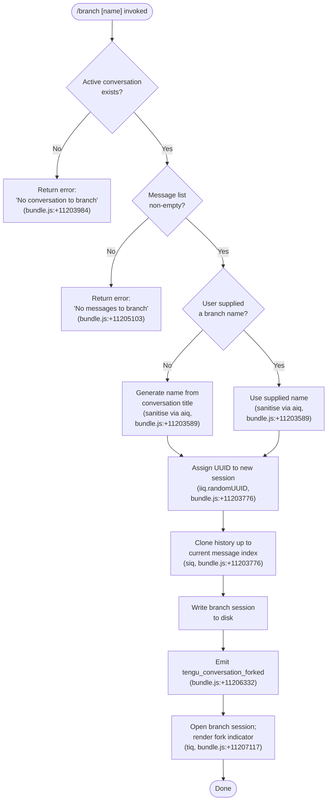

# `/branch`

> Analysis basis: CC v2.1.174 bundle.js (AST extraction + Claude interpretation)
> Minimum version: v2.1.174

---

## Overview

`/branch` creates a divergent copy of the current conversation at the point it is invoked, preserving all messages up to that moment and starting a fresh session that can evolve independently. Internally the command clones the conversation history into a new session file, optionally using a caller-supplied name, and emits a `tengu_conversation_forked` telemetry event on success. If no active conversation exists or no messages are present, the command exits early with a descriptive error.

---

## Registration

| Field | Value |
|---|---|
| type | `local-jsx` |
| name | `branch` |
| description | `Create a branch of the current conversation at this point` |
| argumentHint | `[name]` |
| module_id | `PLA` |
| load_inline | `true` |
| loc_byte | `12762365` |
| loc_byte_end | `12762542` |
| loc_line | `9004` |
| arbor_handler.name | `Jh7` |
| arbor_handler.fqn | `claude-2.1.174::Jh7` |
| arbor_handler.kind | `AsyncFunction` |
| arbor_handler.resolution_path | `module_id` |
| arbor_handler.n_hits | `0` |

Analysis basis: CC v2.1.174 bundle.js:+12762365

---

## Input Branching

The command has four distinct control-flow paths (no conversation, no messages, normal branch with an auto-generated name, normal branch with a user-supplied name), so a Mermaid flowchart is used.



---

## Behavioral Spec

### Top-level handler — `branchCommandHandler` (`Jh7`)

The Arbor-resolved entry point is the async function `Jh7`. It delegates to `forkOrchestrator` (`tiq`) after resolving the active session context.

```
async function branchCommandHandler(commandArgs, appContext):
    result = await forkOrchestrator(commandArgs, appContext)
    return result
```

Analysis basis: CC v2.1.174 bundle.js:+11207117

---

### Conversation existence guard — `buildBranchPayload` (`siq`)

Before any file I/O the handler verifies that a branchable conversation is present.

```
async function buildBranchPayload(sessionContext, branchName):

    // Guard 1 — requires an active conversation
    if sessionContext.conversation is absent:
        throw Error("No conversation to branch")
        // literal at bundle.js:+11203984

    // Guard 2 — requires at least one message
    if sessionContext.messages is empty:
        throw Error("No messages to branch")
        // literal at bundle.js:+11205103

    // Derive a safe file-system name
    safeName = sanitiseBranchName(branchName ?? sessionContext.title)
    // sanitiseBranchName calls nameNormaliser (aiq) which:
    //   - finds a matching conversation entry  (_.find, bundle.js:+11203589)
    //   - replaces unsafe characters           (A.replace, bundle.js:+11203667)

    // Generate a UUID for the new session
    newSessionId = crypto.randomUUID()          // bundle.js:+11203776

    // Resolve working directory paths
    workDir   = getConversationDir(...)         // k6, bundle.js:+11203795
    dataDir   = getDataPath(...)                // a$, bundle.js:+11203802
    configDir = getConfigPath(...)              // j_, bundle.js:+11203805

    // Build branch metadata
    branchMeta = buildVersionedMeta(...)        // Vh, bundle.js:+11203813

    // Create target directory
    await fs.mkdir(branchDir, { recursive: true })   // bundle.js:+11203838

    // Stream current conversation JSONL into branch file
    // (max read chunk ≈ 448 bytes, literal at bundle.js:+11203869)
    readStream  = fs.createReadStream(sourceFile, { encoding: "utf8" })
    writeStream = fs.createWriteStream(branchFile)
    // Listens for 'open' event before piping (bundle.js:+11203946)
    // Error path checks for ENOENT (bundle.js:+11203978)
    pipe readStream → writeStream

    // Append a "Branched conversation" sentinel entry
    // (literal "Branched conversation" at bundle.js:+11203537,
    //  type "text"                     at bundle.js:+11203610)
    writeStream.write(JSON.stringify({ type: "text",
                                       text: "Branched conversation",
                                       ... }))

    await stream.finished(writeStream)          // bundle.js:+11205513

    return { newSessionId, safeName, branchMeta }
```

Analysis basis: CC v2.1.174 bundle.js:+11203776

---

### Name sanitisation — `nameNormaliser` (`aiq`)

```
function nameNormaliser(rawName, conversationList):
    match  = conversationList.find(entry => entry matches rawName)
    // _.find at bundle.js:+11203589
    result = rawName.replace(UNSAFE_CHARS_REGEX, "")
    // A.replace at bundle.js:+11203667
    return result
```

Analysis basis: CC v2.1.174 bundle.js:+11203589

---

### Fork orchestrator — `forkOrchestrator` (`tiq`)

`forkOrchestrator` is the function directly called by `branchCommandHandler`. It coordinates name resolution, session cloning, event dispatch, and UI update.

```
async function forkOrchestrator(commandArgs, appContext):

    // 1. Resolve session store and existing title
    sessionStore = getSessionStore(k6, bundle.js:+11206028)
    currentTitle = resolveTitle(V$, bundle.js:+11206035)

    // 2. Clone history into a new session file
    await buildBranchPayload(appContext, commandArgs.name)
    // siq called at bundle.js:+11206136

    // 3. Determine branch name to display
    displayName = nameNormaliser(commandArgs.name ?? currentTitle)
    // aiq at bundle.js:+11206195; $.find at bundle.js:+11206199

    // 4. Apply branch name to new session metadata
    applyBranchName(jh7, bundle.js:+11206268)

    // 5. Run post-fork hooks (title update + agent-name tag)
    //    FR  → sets "custom-title" attribute (bundle.js:+11206299,
    //                literal at bundle.js:+13489621)
    //    x$H → sets "agent-name"   attribute (bundle.js:+11206317,
    //                literal at bundle.js:+13492644)
    runPostForkHooks(FR, x$H)

    // 6. Emit fork telemetry
    // tengu_conversation_forked at bundle.js:+11206332

    // 7. Determine ISO timestamp for the branch
    branchTime = new Date().toISOString()   // bundle.js:+11206422
    epochMs    = new Date().getTime()       // bundle.js:+11206471

    // 8. Mark fork type as "fork" in session metadata
    // literal "fork" at bundle.js:+11206853

    // 9. Resume UI input stream
    appContext.inputStream.resume()          // bundle.js:+11206840

    // 10. Render result or propagate error
    // literal "Unknown error occurred" at bundle.js:+11207001
    return renderBranchResult(...)
```

Analysis basis: CC v2.1.174 bundle.js:+11207117

---

### Branch name application — `applyBranchName` (`jh7`)

```
function applyBranchName(sessionMeta, proposedName):
    // Escape any special regex characters in the proposed name
    escaped = escapeForRegex(pv, bundle.js:+11205806)
    // pv uses H.replace with literal "\\$&" (bundle.js:+198207)

    sessionMeta.nameSet.add(escaped)    // K.add,  bundle.js:+11205900
    parsed  = parseInt(escaped, 10)     // bundle.js:+11205906
    if sessionMeta.nameSet.has(parsed): // K.has,  bundle.js:+11205953
        // deduplicate numeric suffix
        ...
    return sessionMeta
```

Analysis basis: CC v2.1.174 bundle.js:+11205705

---

### Post-fork title hook — `setCustomTitle` (`FR`)

```
function setCustomTitle(newSession, titleString):
    buildVersionedMeta(Vh, bundle.js:+13489600)
    logSessionEvent(QOH, bundle.js:+13489609)   // appends to log file
    getSessionStore(k6, bundle.js:+13489668)
    buildMetaObject(M4, bundle.js:+13489673)
    emitter.emit("custom-title", titleString)    // bundle.js:+13489700
    // literal "custom-title" at bundle.js:+13489621
```

Analysis basis: CC v2.1.174 bundle.js:+13489600

---

### Post-fork agent-name hook — `setAgentName` (`x$H`)

```
function setAgentName(newSession, agentName):
    buildVersionedMeta(Vh, bundle.js:+13492623)
    logSessionEvent(QOH, bundle.js:+13492632)
    getSessionStore(k6, bundle.js:+13492687)
    buildMetaObject(M4, bundle.js:+13492692)
    persistAgentName(Dl, bundle.js:+13492723)
    emitter.emit("agent-name", agentName)        // bundle.js:+13492729
    // literal "agent-name" at bundle.js:+13492644
```

Analysis basis: CC v2.1.174 bundle.js:+13492623

---

### Progress reporting — inline within `forkOrchestrator`

During the copy phase the orchestrator emits `"progress"` status tokens to keep the UI responsive.

```
// literal "progress" at bundle.js:+11205021
// literal "content-replacement" at bundle.js:+11204464
// literal "model_refusal_fallback" at bundle.js:+11204778
```

Analysis basis: CC v2.1.174 bundle.js:+11205021

---

## State & Side Effects

| Item | Detail |
|---|---|
| Telemetry — fork | `tengu_conversation_forked` fired on every successful branch (bundle.js:+11206332) |
| Telemetry — session rename | `tengu_session_renamed` fired when the custom title hook runs (bundle.js:+13489713) |
| Telemetry — agent name | `tengu_agent_name_set` fired when the agent-name hook runs (bundle.js:+13492742) |
| Telemetry — background (indirect) | `tengu_bg_dispatch_sigkill_escalate`, `tengu_daemon_config_reload`, `tengu_daemon_control`, `tengu_scheduled_task_missed`, `tengu_scheduled_task_fire`, `tengu_scheduled_task_expired`, `tengu_bg_low_mem_mb`, `tengu_bg_dispatch_low_mem`, `tengu_bg_spare_enable`, `tengu_bg_sendclaim_failed`, `tengu_bg_state_read_transient`, `tengu_bg_spare_claim`, `tengu_bg_spare_claim_fail`, `tengu_worktree_detection`, `tengu_feature_ok`, `tengu_feature_bad` — emitted by subsystems in the call graph, not directly by branch logic |
| Disk I/O | Creates a new directory under the session store and writes a cloned JSONL conversation file with a trailing `"Branched conversation"` sentinel entry |
| Session metadata | New session is assigned a UUID (`iiq.randomUUID`), a `fork` type marker, and ISO-8601 timestamps |
| UI stream | `inputStream.resume()` is called after branching to unblock user input (bundle.js:+11206840) |
| Event bus | Emits `"custom-title"` and `"agent-name"` events on the internal emitters (`DU6.emit`, `yjA.emit`) |
| Hook registration | Post-fork hooks `FR` (title) and `x$H` (agent name) are invoked sequentially |
| Sound | None detected |
| appState changes | Active session context is switched to the newly created branch session |

---

## Version History

| Version | Change |
|---|---|
| v2.1.174 | Initial analysis |

---

## Common Mistakes

1. **Invoking `/branch` with no prior messages** — the command will reject with `"No messages to branch"` (bundle.js:+11205103). At least one user or assistant turn must exist before branching.
2. **Invoking `/branch` outside an active conversation** — without an active session the guard at bundle.js:+11203984 fires with `"No conversation to branch"`. Start a conversation first.
3. **Supplying a name containing characters illegal on the host filesystem** — the `nameNormaliser` (`aiq`) strips unsafe characters silently, so the resulting branch name may differ from what was typed.
4. **Expecting the original conversation to be modified** — `/branch` only copies; the current session continues unaffected. The user must switch to the branch session to work within it.
5. **Assuming branch names are unique** — `applyBranchName` (`jh7`) deduplicates only numeric suffixes; textually identical names generated at different times can coexist on disk.

---

## Appendix — Identifier Mapping

> For bundle debugging only. Identifiers change across versions.

| Identifier | Role |
|---|---|
| `Jh7` | Top-level branch command handler (AsyncFunction; Arbor-resolved entry point) |
| `tiq` | Fork orchestrator — coordinates clone, name, hooks, telemetry, and UI |
| `siq` | Branch payload builder — guards, UUID generation, directory creation, stream copy |
| `aiq` | Branch name normaliser — looks up conversation entry, strips unsafe characters |
| `jh7` | Branch name application — escapes, deduplicates, and attaches name to session metadata |
| `FR` | Post-fork custom-title hook — logs and emits `"custom-title"` event |
| `x$H` | Post-fork agent-name hook — logs and emits `"agent-name"` event |
| `Vh` | Versioned metadata builder used by clone, title, and agent-name paths |
| `V$` | Session title resolver |
| `k6` | Session store accessor |
| `aM` | Metadata path composer (joining data-dir fragments) |
| `PC` | Path component resolver used by `aM` |
| `j_` | Config-directory path helper |
| `a$` | Data-directory path helper |
| `Ak` | Auxiliary metadata assembly helper |
| `k8` | File-operation helper (used in clone and session-state paths) |
| `V8` | Low-level promise/event utility |
| `SH` | Log-write helper (used in error paths and post-fork hooks) |
| `DA` | Error constructor helper |
| `L6` | String conversion helper |
| `_q` | Log-queue drain helper |
| `$gA` | Log-queue entry builder |
| `dbf` | Log-queue shift/push helper |
| `O` | Stream wrapper (used for write and destroy in clone path) |
| `x8` | Stream event dispatcher used by `O` |
| `H` | Jitter/delay utility (Math.random + setTimeout) |
| `J` | Process-kill dispatcher called on session teardown |
| `D` | Background session lifecycle manager |
| `b` | Background PTY / session object |
| `SSH` | Session history loader (reads JSONL, filters messages) |
| `w` | PTY writer — sends data to background session |
| `N` | Message role normaliser (user/assistant/system) |
| `As` | Auxiliary connection-state helper |
| `TtH` | Branch directory and file writer |
| `o09` | Message filter utility |
| `P` | IPC buffer/packet handler |
| `z` | Daemon-control stop helper |
| `S` | Background session send helper |
| `X` | Socket timeout/set helper |
| `d` | Generic event-emitter handle |
| `udK` | Changed-files message formatter |
| `S1H` | Session roster synchroniser |
| `l8` | Async wait-with-timeout helper |
| `K` | Column/pad formatter |
| `CH` | Feature-flag bad-state reporter |
| `A6` | Feature-flag lookup |
| `kH` | Feature-flag ok-state reporter |
| `vg8` | macOS memory check dispatcher |
| `w6` | Platform-specific low-memory poller |
| `TG6` | Pins-JSON reader |
| `ak_` | Pins-file path resolver |
| `l6` | JSON.parse wrapper |
| `M6L` | Pinned-session directory scanner |
| `Q` | Background IPC session (retireIfSettled, process.kill) |
| `l` | Background session loop body |
| `C` | Timeout-clear / write helper |
| `B` | Claim-frame set |
| `xZ` | Windows socket-path resolver |
| `Jv` | Binary packet framer (Buffer operations) |
| `ou8` | Binary packet parser (Buffer operations) |
| `PTA` | Daemon-claim connector |
| `xJA` | Daemon working-directory initialiser |
| `qZ5` | Send-claim timeout manager |
| `AZ5` | Claim-frame builder wrapper |
| `N7` | Low-level promise helper |
| `TH` | String coercion helper |
| `VTA` | Background session state machine |
| `_f` | Session file path resolver |
| `Tq` | Session-state file watcher/reader |
| `GO` | Active-state entry helper |
| `xXH` | Changeset/patch line parser |
| `c7` | Session config-file writer |
| `Ff6` | Metrics timing wrapper |
| `Gu6` | Socket path builder (join + Pu6) |
| `AOH` | Socket auth-path builder |
| `cQ` | Control socket connection helper |
| `Wu6` | Working socket path builder |
| `Y` | Forced-shutdown handler (process.exit + z.abort) |
| `_X` | Shutdown reason logger |
| `j` | Kill-all-sessions helper |
| `KU` | Session keep-alive checker |
| `$` | Stream destroy wrapper |
| `mDK` | Daemon status writer (daemon.status.json) |
| `c9` | Async-local-storage store accessor |
| `Dp6` | Status file path builder |
| `RH` | JSON.stringify wrapper |
| `W` | SDK/HTTP connection dispatcher |
| `A56` | Transport-option resolver |
| `CoK` | Object.keys transport config scanner |
| `pv` | Regex special-character escape helper |
| `QOH` | Session-log append helper (appendFileSync, mkdirSync) |
| `r6` | Session log path resolver |
| `Dl` | Agent-name persistence helper (mj6 + Date.now) |
| `mj6` | JSONL read/write helper for agent metadata |
| `Y9` | String slice-at-index helper |
| `Ur` | Worktree/completion context assembler |
| `s3H` | Git worktree list parser |
| `CWK` | Filesystem completion scanner |
| `vUH` | Binary hash/checksum builder |
| `e3` | Completion entry filter |
| `M4` | Session metadata builder |
| `R9` | Schema/validator registration (qvA.register) |
| `V$` | Session title resolver |

---

Note: index built via Arbor fallback; some signals (telemetry, literals) may be missing — see arbor-fallback.js.