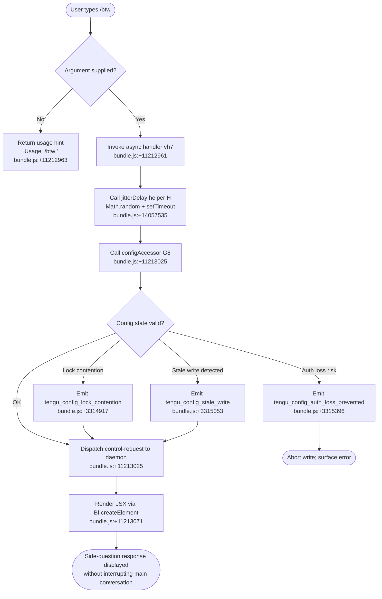

# `/btw`

> Analysis basis: CC v2.1.174 bundle.js (AST extraction + Claude interpretation)
> Minimum version: v2.1.174

---

## Overview

`/btw` ("by the way") lets the user pose a quick side question to the agent without disrupting the flow of the primary conversation. It is dispatched as a `control-request` to the background daemon and renders its result via a JSX component, so it surfaces inline in the UI while the main task continues unaffected.

---

## Registration

| Field | Value |
|---|---|
| type | `local-jsx` |
| name | `btw` |
| description | Ask a quick side question without interrupting the main conversation |
| argumentHint | `<question>` |
| immediate | `true` |
| thinClientDispatch | `control-request` |
| module_id | `_rq` |
| load_inline | `true` |
| loc_byte | 11213370 |
| loc_byte_end | 11213609 |
| loc_line | 7334 |
| arbor_handler.name | `vh7` |
| arbor_handler.fqn | `claude-2.1.174::vh7` |
| arbor_handler.kind | `AsyncFunction` |
| arbor_handler.resolution_path | `module_id` |
| arbor_handler.n_hits | 0 |

Analysis basis: CC v2.1.174 bundle.js:+11213370

---

## Input Branching

Three distinct execution paths are observable from the callGraph and literals: (1) no argument supplied, (2) argument present — dispatches successfully, and (3) argument present — JSX rendering path.



---

## Behavioral Spec

### 1. Entry Point — Async Handler (`vh7`)

The primary handler is the async function `vh7`, resolved by Arbor via the `module_id` path (`_rq`).

```
async function handleBtw(commandInput):
    if commandInput is empty or missing:
        return usageHint("Usage: /btw <your question>")
        // literal @ bundle.js:+11212963

    await jitterDelay()          // introduces small random pause before proceeding
    configSnapshot = await accessConfig()
    result = await dispatchControlRequest(commandInput, configSnapshot)
    return renderJSX(result)
```

Analysis basis: CC v2.1.174 bundle.js:+11212961

---

### 2. Jitter Delay Helper (`H`)

Before the config is accessed, a small randomised delay is introduced. This is a common anti-thundering-herd technique used when multiple Claude instances might be active simultaneously.

```
function jitterDelay():
    base   = 1          // bundle.js:+14057549
    spread = 2          // bundle.js:+14057533
    delay  = base + Math.random() * spread   // result in [1, 3) range (units inferred)
    return new Promise(resolve => setTimeout(resolve, delay))
```

Analysis basis: CC v2.1.174 bundle.js:+14057535

---

### 3. Config Access Layer (`G8` → `R58`)

`accessConfig` (internally `G8`) reads the persisted Claude configuration via the file-system config reader (`R58`). This layer covers several error paths:

```
async function accessConfig():
    lockPath = deriveLockPath(configDir)
    try:
        acquireFileLock(lockPath)
    except LockTimeout:
        emitTelemetry("tengu_config_lock_contention")
        // warning: "Lock acquisition took longer than expected …"
        // bundle.js:+3314828

    rawConfig = readConfigFile(configPath, encoding="utf-8")
    // bundle.js:+3316944

    if rawConfig is missing (ENOENT):
        return defaultConfig()
        // bundle.js:+3315183

    parsed = parseJSON(rawConfig)

    if cachedConfig.hasAuth AND parsedConfig.missingAuth:
        emitTelemetry("tengu_config_auth_loss_prevented")
        // bundle.js:+3315396
        abort("saveGlobalConfig fallback: re-read config is missing auth …")
        // bundle.js:+3311881

    if staleWriteDetected:
        emitTelemetry("tengu_config_stale_write")
        // bundle.js:+3315053

    return parsed
```

The config-write path also guards against backup-file collisions (error code `EEXIST` at bundle.js:+3317706) and manages up to 5 rolling backup copies (literal `5` at bundle.js:+3315847) stored under a `backups/` sub-directory (literal at bundle.js:+3316429). Backup filenames contain a `.backup.` infix (literal at bundle.js:+3315714).

Analysis basis: CC v2.1.174 bundle.js:+3311674, +3314917, +3315053, +3315396

---

### 4. Control-Request Dispatch

After config is read, the question string is packaged and sent to the daemon as a `control-request` (registration field `thinClientDispatch`). The daemon-side message-loop (`YZ5`) handles the actual routing. Relevant daemon literals observed in the call graph include protocol states such as `"dispatch"`, `"reply"`, `"attach"`, `"ping"`, and `"shutdown"`.

```
async function dispatchControlRequest(question, config):
    payload = buildPayload(question, role="system")
    // role literal @ bundle.js:+11213002
    response = await daemonSocket.send(payload, type="control-request")
    return response
```

Analysis basis: CC v2.1.174 bundle.js:+11213002, +11213025

---

### 5. JSX Rendering

The handler concludes by constructing a React element via `Bf.createElement`. This is what causes the response to appear inline in the CC UI without replacing the active conversation pane.

```
function renderBtwResponse(responseData):
    return Bf.createElement(BtwResponseComponent, { data: responseData })
```

Analysis basis: CC v2.1.174 bundle.js:+11213071

---

## State & Side Effects

| Item | Detail |
|---|---|
| Telemetry | `tengu_config_lock_contention` (bundle.js:+3314917) — emitted when file-lock acquisition stalls |
| Telemetry | `tengu_config_stale_write` (bundle.js:+3315053) — emitted when a stale config write is detected |
| Telemetry | `tengu_config_parse_error` (bundle.js:+3317492) — emitted on JSON parse failure |
| Telemetry | `tengu_config_auth_loss_prevented` (bundle.js:+3315396) — emitted when write would erase cached auth |
| Telemetry | `tengu_bg_dispatch_sigkill_escalate` (bundle.js:+16858186) — daemon-level SIGKILL escalation |
| Telemetry | `tengu_bg_dispatch_low_mem` (bundle.js:+16858787) — daemon detects low free memory |
| Telemetry | `tengu_bg_spare_enable` (bundle.js:+16859491) — spare daemon session enabled |
| Telemetry | `tengu_bg_spare_claim` (bundle.js:+16859619) — spare session claimed |
| Telemetry | `tengu_bg_spare_claim_fail` (bundle.js:+16859885) — spare session claim failure |
| Telemetry | `tengu_bg_proto_mismatch` (bundle.js:+16844877) — daemon/client protocol version mismatch |
| Telemetry | `tengu_bg_dispatch_stale_drop` (bundle.js:+16846245) — stale dispatch dropped |
| Telemetry | `tengu_bg_attach_legacy_autorespawn` (bundle.js:+16848899) — legacy attach triggers respawn |
| Telemetry | `tengu_bg_attach` (bundle.js:+16850057) — background session attach |
| Telemetry | `tengu_bg_attach_stall_gave_up` (bundle.js:+16850980) — attach stall, gave up |
| Telemetry | `tengu_bg_attach_stall_respawn` (bundle.js:+16851250) — attach stall triggers respawn |
| Telemetry | `tengu_bg_attach_kick` (bundle.js:+16852200) — session kicked from another window |
| Config side-effect | Reads (and may write) `~/.claude.json`; acquires a file lock; writes up to 5 rotating backup files in a `backups/` sub-directory |
| Jitter delay | Introduces a small random delay (range approximately [1, 3) units) before config access to reduce lock contention among concurrent Claude instances |
| Daemon IPC | Sends a `control-request` message over the background daemon socket; does **not** interrupt the main conversation session |
| JSX render | Creates a React element displayed inline in the CC UI |
| Sound | <!-- TODO: not found in depth-2 traversal; needs --depth 4 --> |
| appState changes | <!-- TODO: not found in depth-2 traversal; needs --depth 4 --> |

---

## Version History

| Version | Change |
|---|---|
| v2.1.174 | Initial analysis |

---

## Common Mistakes

1. **Omitting the argument**: `/btw` with no text returns the usage hint `"Usage: /btw <your question>"` (bundle.js:+11212963) and does not dispatch anything to the daemon.
2. **Expecting synchronous output**: The handler is `async` and introduces a jitter delay before config access; the response may appear with a brief but intentional lag.
3. **Confusing `/btw` with a new conversation**: The command uses `thinClientDispatch: "control-request"` — it is routed to the active daemon session, not a fresh conversation context.
4. **Assuming it blocks the main task**: By design the command does not interrupt the primary conversation; the result renders inline via JSX alongside the ongoing agent output.
5. **Editing `~/.claude.json` while `/btw` is in-flight**: The config lock (`tengu_config_lock_contention`) may cause the command to stall if another Claude instance holds the lock simultaneously.

---

## Appendix — Identifier Mapping

> For bundle debugging only. Identifiers change across versions.

| Identifier | Role |
|---|---|
| `vh7` | Main async handler for `/btw` (Arbor-resolved entry point) |
| `H` | Jitter delay helper (Math.random + setTimeout) |
| `G8` | Config accessor / session initialiser |
| `R58` | File-system config reader/writer (handles locking, backups, ENOENT) |
| `_` | Generic filesystem utility (used by config and file-lock paths) |
| `r6` | Path resolution helper |
| `f` | File-system module reference (mkdirSync, statSync, etc.) |
| `q` | Secondary file-system / queue reference |
| `L` | Promise / stream finaliser (`.finally` chain) |
| `YN1` | Config object merger (Object.assign wrapper) |
| `iD_` | Internal config initialiser |
| `N` | Message/header builder (constructs API request headers) |
| `Z1f` | Header sub-builder |
| `RH` | JSON serialiser wrapper |
| `df` | Content/body formatter |
| `VgH` | Header helper |
| `h1f` | File content reader (Buffer.byteLength, streaming) |
| `c` | Generic constant/config value accessor |
| `V8` | Error/result wrapper |
| `C7H` | Config file handler (read, parse, backup, directory ops) |
| `l6` | JSON.parse wrapper |
| `gu` | String prefix stripper |
| `M19` | Directory reader / backup file locator |
| `ZV_` | Backup path joiner |
| `D` | Daemon process manager (spawn, kill, SIGKILL escalation) |
| `YoH` | Auth-loss guard utility |
| `A` | String normaliser (toLowerCase) |
| `V` | Path/string startsWith checker |
| `P` | IPC pipe / buffer reader |
| `X` | Socket/timeout manager |
| `j` | Process group kill utility |
| `R7` | Stream end/reply helper |
| `YZ5` | Daemon message-loop / session state machine |
| `TH` | String coercion helper |
| `E` | Slice / range calculator (Math.max, Math.min) |
| `W` | SDK connection manager |
| `fw6` | Atomic file-write helper (rename, fchmod, fsync) |
| `O` | Symbolic-link / background session checker |
| `k8` | Error wrapper (V8 delegation) |
| `GJH` | Session metadata builder |
| `L19` | Config entry iterator (Object.entries) |
| `LW6` | Timestamp utility (Date.now) |
| `S58` | Config save orchestrator (lock + write + backup) |

---

Note: index built via Arbor fallback; some signals (telemetry, literals) may be missing — see arbor-fallback.js.