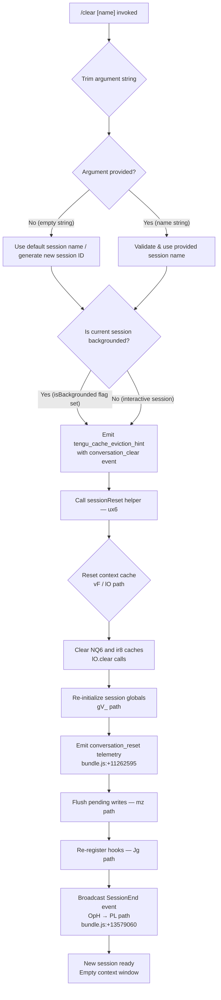

# `/clear`

> Analysis basis: CC v2.1.174 bundle.js (AST extraction + Claude interpretation)
> Minimum version: v2.1.174

---

## Overview

`/clear` starts a new session with a completely empty context window, discarding the current conversation from the active agent's working memory. The previous session is preserved on disk and remains resumable via `/resume`. The command is also registered under the aliases `/reset` and `/new`.

---

## Registration

| Field | Value |
|---|---|
| type | `local` |
| name | `clear` |
| description | `Start a new session with empty context; previous session stays on disk (resumable with /resume)` |
| argumentHint | `[name]` |
| aliases | `reset`, `new` |
| supportsNonInteractive | `true` |
| thinClientDispatch | `post-text` |
| module_id | `irq` |
| load_inline | `true` |
| loc_byte | `11263473` |
| loc_byte_end | `11263764` |
| arbor_handler.name | `XI7` |
| arbor_handler.fqn | `claude-2.1.174::XI7` |
| arbor_handler.kind | `AsyncFunction` |
| arbor_handler.resolution_path | `module_id` |
| arbor_handler.n_hits | `0` |

Analysis basis: CC v2.1.174 bundle.js:+11263473

---

## Input Branching

The command has 4+ distinct execution paths depending on argument presence, session state, and the backgrounded flag.



Analysis basis: CC v2.1.174 bundle.js:+11263299, +11261246, +11261372, +11261441

---

## Behavioral Spec

### Handler Entry — `sessionClearHandler` (XI7)

```
async function sessionClearHandler(args, context):
    rawArg = args.trim()                          // bundle.js:+11263299
    sessionName = rawArg if rawArg else null

    emit telemetry "tengu_cache_eviction_hint"    // bundle.js:+11261334
      with { event: "conversation_clear" }        // literal bundle.js:+11261372

    if context.isBackgrounded:                    // literal bundle.js:+11261441
        // no special branch; flag is passed through to reset helper
        pass

    await sessionReset(sessionName, context)      // calls ux6
```

Analysis basis: CC v2.1.174 bundle.js:+11263299

---

### Session Reset Core — `sessionReset` (ux6)

```
async function sessionReset(sessionName, context):
    // 1. Compute new context token budget
    tokenBudget = computeTokenBudget(context)     // px6 path, parseInt + Number.isFinite
                                                  // bundle.js:+13588541
    // Number literal: radix 10 (bundle.js:+13588552)
    // Number literal: 1000 ms debounce (bundle.js:+13588728)

    // 2. Apply abort signal with timeout
    signal = AbortSignal.timeout(timeoutMs)       // bundle.js:+11261290

    // 3. Broadcast SessionEnd lifecycle event
    broadcastSessionEnd(context)                  // OpH → PL, literal "SessionEnd"
                                                  // bundle.js:+13579060 / +13579033

    // 4. Clear context caches
    clearContextCaches()                          // vF → lO
      lO: NQ6.clear()                             // bundle.js:+27446
      lO: ir8.clear()                             // bundle.js:+27458

    // 5. Re-initialize session state
    reinitializeSession(sessionName)              // gV_ path
      reads policySettings                        // literal bundle.js:+3343595
      reads hooks config                          // literal bundle.js:+3343433

    // 6. Emit conversation_reset telemetry event
    emit "conversation_reset"                     // bundle.js:+11262595

    // 7. Assign new session UUID
    newSessionId = crypto.randomUUID()            // crq.randomUUID, bundle.js:+11262634

    // 8. Reset running state flag
    context.runningState = "running"              // literal bundle.js:+11261862

    // 9. Flush any pending async writes
    flushPendingWrites()                          // mz → TQ8, WQ8 path
                                                  // bundle.js:+11262055

    // 10. Clear tool-state maps
    toolStateMaps.clear()                         // _.clear(), bundle.js:+11261654

    // 11. Re-register hooks and plugins
    reloadHooksAndPlugins()                       // Jg path, bundle.js:+11263074

    // 12. Re-initialize MCP connections
    reinitMcpConnections()                        // W + T paths, bundle.js:+11262981

    // 13. Return new session descriptor
    return newSession
```

Analysis basis: CC v2.1.174 bundle.js:+11261230 (ux6), +11261290, +11261654, +11262055, +11262634

---

### Token Budget Computation — `computeTokenBudget` (px6)

```
function computeTokenBudget(context):
    raw = parseInt(context.tokenLimit, 10)        // bundle.js:+13588541, radix 10
    if not Number.isFinite(raw):
        raw = getDefaultTokenLimit()              // Ij path, bundle.js:+13588606
    raw = max(raw, 1000)                          // bundle.js:+13588728, +13588759
    raw = min(raw, platformMax)                   // bundle.js:+13588772
    return raw
```

Analysis basis: CC v2.1.174 bundle.js:+13588541

---

### Session-End Broadcast — `broadcastSessionEnd` (OpH)

```
function broadcastSessionEnd(context):
    // Build context summary for the ending session
    summary = buildSessionSummary(context)        // PL path, bundle.js:+13579033
      includes effort level                       // literal "effort", bundle.js:+13590228
      checks model family prefix "claude-3-"     // bundle.js:+2519962
      checks extended model list:
        claude-opus-4-0, claude-opus-4-1,
        claude-sonnet-4-0, claude-sonnet-4-5,
        claude-haiku-4-5, claude-fable-5,
        claude-mythos-5, claude-opus-4-6/7/8,
        claude-sonnet-4-6                         // bundle.js:+2519980 .. +2520286
      applies high-effort config                  // literal "high", bundle.js:+2523464

    // Emit SessionEnd lifecycle event
    emitLifecycleEvent("SessionEnd", summary)     // literal bundle.js:+13579060

    // Notify background session manager if present
    notifyBackgroundManager(context)              // $uH path, bundle.js:+13579293
```

Analysis basis: CC v2.1.174 bundle.js:+13579033

---

### Cache Clear — `clearContextCaches` (vF / lO)

```
function clearContextCaches():
    // Persist current file-version fingerprints before clearing
    updateFileVersionCache()                      // FV_ path
      reads p19 map (get/set)                     // bundle.js:+3343243, +3343268
      calls ip4, lp4 helpers                      // bundle.js:+3343235, +3343262

    // Clear the two primary context-window caches
    NQ6.clear()                                   // bundle.js:+27446
    ir8.clear()                                   // bundle.js:+27458
```

Analysis basis: CC v2.1.174 bundle.js:+3343913 (vF), +27446 (lO)

---

### Hook & Plugin Reload — `reloadHooksAndPlugins` (Jg)

```
async function reloadHooksAndPlugins():
    // Guard: safe-mode disables plugin hooks
    if safeMode:
        log("Skipping plugin hooks - safe mode disables plugins ...")
        // literal bundle.js:+5094267
        return

    // Guard: allowManagedHooksOnly with no managed plugins
    if allowManagedHooksOnly and not hasManagedPlugins:
        log("Skipping plugin hooks - allowManagedHooksOnly ...")
        // literal bundle.js:+5094360
        return

    loadPluginHooks()                             // "load_plugin_hooks" bundle.js:+5094462
      calls Of (config snapshot),
            Ij (token budget check),
            dK (settings read)

    // Re-register per-session hooks
    reInitHookState()                             // xs path, bundle.js:+5094247
      reads hook event types:
        PreToolUse, PostToolUse, PostToolUseFailure,
        PermissionRequest, UserPromptExpansion,
        SessionStart, Setup, PreCompact, PostCompact,
        SubagentStart, SubagentStop, TeammateIdle,
        TaskCreated, TaskCompleted, etc.
        // literals bundle.js:+13607758 .. +13608489

    // Emit session start context reload signal
    emit "hook_session_start_reload_skills"       // bundle.js:+5095710

    // Start MCP reconnections for plugins
    reconnectMcpPlugins()                         // cV path, bundle.js:+5095687
```

Analysis basis: CC v2.1.174 bundle.js:+5094184 (Jg), +5094267, +5094360

---

### State Reset Helpers (aLA / yHH / lEq etc.)

The `sessionReset` call at step 4 (in `aLA`) drives a cascade of sub-resets across independent state stores:

```
function cascadeStateReset():
    cV()        // clear skill index cache (Sp.clearSkillIndexCache)
    OZ9()       // clear jg cache (jg.clear, bundle.js:+5080828)
    yHH()       // clear agent and teammate state:
      ghH()     //   agent store (Mm main agent, bundle.js:+2471582)
      Kb8()     //   model client cache (XU map, bundle.js:+10548950)
      tC8()     //   AFq flow cache (AFq.clear, bundle.js:+10529983)
      hd9()     //   CV6 / fF_ caches (bundle.js:+6597285)
      eY()      //   output token counters (CFH.Object.values, bundle.js:+46054)
      t07.resetAutonomousLoopDelivered()           // bundle.js:+10549381
    lEq()       // clear YuH / h6A caches (bundle.js:+9285747)
    yJq()       // clear Z16 / Zk6 caches (bundle.js:+8638886)
    FK_()       // clear BdH cache (bundle.js:+1140863)
    it9()       // clear bW8 cache (bundle.js:+7204133)
    SK_()       // clear UdH cache (bundle.js:+1133816)
    xpq()       // clear skill store via sC6 (bundle.js:+10357342)
    xn9()       // clear je / o2H caches (bundle.js:+6791060)
    Hp()        // clear nb6 cache (bundle.js:+10832808)
```

Analysis basis: CC v2.1.174 bundle.js:+11260189 (aLA)

---

## State & Side Effects

| Item | Detail |
|---|---|
| Telemetry: `tengu_cache_eviction_hint` | Fired immediately on `/clear` with event `conversation_clear` (bundle.js:+11261334) |
| Telemetry: `tengu_run_hook` | Fired during hook execution phase (bundle.js:+13628520) |
| Telemetry: `tengu_feature_ok` / `tengu_feature_bad` | Fired when feature flag checks succeed / fail during reset (bundle.js:+1016891, +1016958) |
| Telemetry: `tengu_hook_plugin_metrics` | Fired when plugin hook metrics are collected (bundle.js:+13606791) |
| Telemetry: `tengu_repl_hook_finished` | Fired after REPL hook completes (bundle.js:+13612264) |
| Telemetry: `tengu_session_renamed` | Fired if an optional session name argument causes a rename (bundle.js:+13489713) |
| Cache cleared: `NQ6` | Primary context cache map, cleared via `lO` (bundle.js:+27446) |
| Cache cleared: `ir8` | Secondary context cache map, cleared via `lO` (bundle.js:+27458) |
| Cache cleared: multiple agent/skill caches | `jg`, `XU`, `AFq`, `CV6`, `fF_`, `YuH`, `h6A`, `Z16`, `Zk6`, `BdH`, `bW8`, `UdH`, `nb6`, `je`, `o2H` (cascadeStateReset) |
| appState changes | `conversation_reset` event emitted (bundle.js:+11262595); running state set to `"running"` (bundle.js:+11261862) |
| Session persistence | Previous session written to disk before clear; remains resumable via `/resume` |
| Hook re-registration | All hook event types reloaded after clear; safe-mode suppresses plugin hooks |
| New session UUID | `crypto.randomUUID()` called to assign a new session ID (bundle.js:+11262634) |
| MCP connections | Reconnection sequence triggered after session state is cleared |
| Pending writes flush | Async write queue flushed via `mz → TQ8 / WQ8` before clear completes (bundle.js:+11262055) |
| Sound | <!-- TODO: not found in depth-2 traversal; needs --depth 4 --> |

---

## Version History

| Version | Change |
|---|---|
| v2.1.174 | Initial analysis |

---

## Common Mistakes

1. **Confusing `/clear` with irreversible deletion.** The command clears the in-memory context window only; the session transcript is retained on disk and can be recovered with `/resume`.
2. **Expecting `/clear` to reset tool permissions.** Hook registrations and policy settings are reloaded from the config files on disk — if a permissive policy was persisted, it remains in effect after clear.
3. **Using `/clear` in non-interactive scripts expecting synchronous completion.** The command is an `AsyncFunction` (arbor_handler.kind = `AsyncFunction`) and dispatches via `thinClientDispatch: "post-text"`. Callers must await the result.
4. **Passing a name argument expecting a saved-session alias.** The optional `[name]` argument sets the new session's display name, not a slot for retrieval; it does not select a prior session to restore.
5. **Assuming `/reset` or `/new` behave differently.** Both are exact aliases with identical implementation paths; no behavioral distinction exists between them.

---

## Appendix — Identifier Mapping

> For bundle debugging only. Identifiers change across versions.

| Identifier | Role |
|---|---|
| `XI7` | Main handler for `/clear` (`sessionClearHandler`); AsyncFunction resolved via module_id path |
| `ux6` | Session reset core — orchestrates the full clear sequence |
| `px6` | Token budget computation (parseInt + Number.isFinite + clamp) |
| `Ij` | Default token limit provider |
| `dK` | Settings/config reader |
| `WAH` | Policy settings reader (reads `policySettings` key) |
| `MB` | Registry reader (calls `rG`) |
| `vF` | Context cache clear coordinator |
| `FV_` | File version fingerprint cache updater (p19 map) |
| `lO` | Dual-cache clear (NQ6.clear + ir8.clear) |
| `gV_` | Session state re-initializer (reads hooks + policySettings) |
| `OpH` | Session-end broadcaster |
| `PL` | Session summary builder (effort level, model family checks) |
| `k6` | Low-level registry accessor |
| `_I` | Registry read helper |
| `cP` | Model family compatibility checker |
| `fN` | Effort-level configuration helper |
| `Vh` | Session header / metadata builder |
| `b6` | Lifecycle event emitter helper |
| `bG` | Hook executor (runs individual hook entries) |
| `Db` | Hook context builder |
| `N` | Hook type normalizer / string formatter |
| `dOH` | Hook dispatch resolver |
| `ejA` | Plugin hook loader |
| `O` | Generic filter/map context object |
| `i0K` | Hook input key extractor |
| `tjA` | Third-party hook filter |
| `a0K` | Hook argument builder |
| `c` | Generic constants / config object |
| `RH` | JSON serializer wrapper |
| `SH` | Error logger / hook error handler |
| `CH` | Feature flag checker |
| `cvH` | Feature flag cache reader |
| `sN` | Abort controller manager (clearTimeout + setTimeout) |
| `J` | Callback registry |
| `E9H` | Hook event type enum |
| `aN` | Hook notification dispatcher |
| `CQ8` | Hook cancellation handler |
| `rjA` | MCP tool hook runner |
| `uQ8` | Hook JSON output parser |
| `zKH` | Plugin metrics aggregator |
| `ijA` | HTTP hook executor |
| `n0K` | HTTP hook response normalizer |
| `EOH` | Hook error object factory |
| `mQ8` | Shell/spawn hook executor |
| `MCH` | Hook metadata collector |
| `kH` | Feature ok recorder |
| `eF` | Telemetry emitter (x6L.emit + Date.now) |
| `$uH` | Background session notifier |
| `AM6` | Session mode detector |
| `$6` | Session store accessor |
| `S56` | Session store singleton |
| `f` | Active-task set manager (q.add / q.delete) |
| `q` | Active-task set |
| `R1` | CLI exit handler (process.exit) |
| `L` | Task lifecycle manager |
| `A` | Transport/connection object |
| `D` | Background daemon session manager |
| `b` | Background session process wrapper |
| `SSH` | Session history file reader |
| `w` | Daemon config applier / supervisor writer |
| `As` | Agent start helper |
| `TtH` | Session file writer (.claude dir) |
| `o09` | Session filter helper |
| `P` | Buffer/stream protocol handler |
| `z` | Daemon state inspector |
| `S` | Session write helper |
| `X` | Socket timeout manager |
| `d` | Session process descriptor |
| `udK` | MCP update formatter |
| `S1H` | Session history loader |
| `l8` | Async lock / mutex |
| `K` | Worker map / pad formatter |
| `vg8` | macOS memory monitor |
| `w6` | MCP skill cache manager |
| `TG6` | Pin file reader (pins.json) |
| `ak_` | Pin file path builder |
| `l6` | JSON parse wrapper |
| `k8` | ENOENT error checker |
| `M6L` | Plugin directory reader |
| `Q` | Background PTY session controller |
| `V8` | Value/boolean helper |
| `l` | Session loop executor |
| `C` | PTY write / clear timeout helper |
| `B` | Task set |
| `xZ` | Session ID path builder |
| `Jv` | Binary protocol frame encoder |
| `ou8` | Binary protocol frame decoder |
| `PTA` | Background session claim handler |
| `xJA` | Worktree session file writer |
| `qZ5` | Claim timeout/retry logic |
| `AZ5` | Claim frame builder |
| `N7` | Value coercion helper |
| `TH` | String coercion wrapper |
| `VTA` | Daemon session lifecycle manager |
| `_f` | Session path resolver |
| `Tq` | Session state file tracker |
| `GO` | Active-state marker |
| `xXH` | Watch-path classifier |
| `c7` | Session roster entry writer |
| `Ff6` | Async session flush helper |
| `Gu6` | Session socket path builder |
| `AOH` | Session archive path builder |
| `cQ` | Session claim path builder |
| `Wu6` | Session write path builder |
| `Y` | Forced shutdown handler |
| `_X` | Shutdown sequence initiator |
| `A6` | S56 session store accessor |
| `G7` | Session group identifier |
| `bD` | Background dispatch helper |
| `aLA` | Full state reset cascade coordinator |
| `lLA` | State reset precondition checker |
| `cV` | Skill index / MCP context resetter |
| `Sp` | Skill index cache clearer |
| `px8` | MCP context reinitializer |
| `Lcq` | Language context resetter |
| `ImH` | Skill context helper (sC6) |
| `OZ9` | jg cache clearer |
| `sSH` | Session store writer |
| `CM6` | Context mode resetter |
| `yHH` | Agent/teammate state bulk resetter |
| `ghH` | Main agent store resetter |
| `Kb8` | Model client cache eviction |
| `YE6` | Session-start event emitter |
| `RM6` | Routing mode resetter |
| `xM6` | Context registry resetter |
| `tC8` | AFq flow cache clearer |
| `hd9` | CV6/fF_ cache clearers |
| `BJq` | Background job queue resetter |
| `B0H` | Background orchestrator state resetter |
| `eY` | Output token counter resetter |
| `cqA` | Session context aggregate resetter |
| `Hp` | nb6 cache clearer |
| `lEq` | YuH/h6A cache clearers |
| `yJq` | Z16/Zk6 cache clearers |
| `FK_` | BdH cache clearer |
| `Snq` | Snapshot queue resetter |
| `it9` | bW8 cache clearer |
| `ra8` | Registration map check helper |
| `SK_` | UdH cache clearer |
| `xpq` | Skill store resetter via sC6 |
| `sC6` | Skill context accessor (yC8 map) |
| `xn9` | je/o2H cache clearers |
| `$w` | Working directory resolver |
| `r6` | File system read helper |
| `Sq_` | CWD store accessor |
| `rO` | Path normalizer |
| `o6H` | Path store reader |
| `j_` | Registry getter (rG) |
| `dSH` | Dispatch state helper |
| `xT` | Context token tracker |
| `mz` | Async write-queue flusher |
| `TQ8` | Write-queue task tracker |
| `u66` | Za9 session archive helper |
| `Za9` | Session archive writer |
| `_G` | MCP skill hash / cleanup coordinator |
| `q66` | MCP skill hash computer |
| `m2H` | SHA-256 hash builder for MCP state |
| `lN` | MCP skill cache syncer (w6) |
| `nrq` | qwH notification relay |
| `qwH` | Notification queue writer |
| `V$` | Coordinator session manager |
| `M4` | Session metadata builder |
| `R9` | Crash reporter registrar |
| `Ak` | Agent kind selector |
| `aM` | Agent mode builder |
| `PC` | rG policy config accessor |
| `mx6` | MCP context re-initializer |
| `sr8` | New session UUID + event emitter |
| `iVA` | Session init helper |
| `nVA` | yQ6 event emitter wrapper |
| `Br` | Broadcast helper (M4) |
| `FR` | Session rename handler |
| `QOH` | Append-file log writer |
| `JmH` | Symlink/task directory manager |
| `gjA` | Task directory creator |
| `y66` | Task path builder |
| `Z$` | Task path resolver |
| `E96` | File-open task tracker |
| `lV` | Subagent mode builder |
| `J5` | Session join helper |
| `I_` | Module init bootstrapper |
| `Fg6` | Module bind helper |
| `W` | MCP server connection manager |
| `A56` | MCP server config reader |
| `CoK` | MCP server key enumerator |
| `DA` | Error/string coercion helper |
| `T` | MCP transport initializer |
| `wv6` | MCP transport config builder |
| `tM` | Token mode selector |
| `zU` | Worktree state emitter |
| `XKH` | Isolation latch manager |
| `kWK` | Append-file isolation logger |
| `Jg` | Hook and plugin reload orchestrator |
| `Of` | Config snapshot reader |
| `w7` | Config diff helper |
| `xs` | Hook event set builder |
| `C8` | ms6/xB config accessor |
| `pdH` | Plugin hook duration logger |
| `b8` | Append-file log writer (plugin) |
| `LMH` | Safe-mode hook loader |
| `pE6` | Per-session agent loop starter |
| `$Y` | Session yield helper |
| `T2` | Full agent loop executor |
| `M` | MCP client manager (HCH + Mi8) |
| `HCH` | MCP hub connection handler |
| `Mi8` | MCP client state applier |
| `$` | mDK generic helper |
| `NGA` | MCP negotiation / retry manager |
| `H9` | New session descriptor builder |