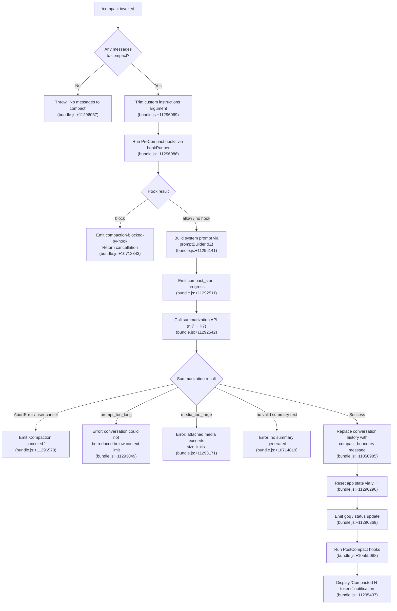

# `/compact`

> Analysis basis: CC v2.1.174 bundle.js (AST extraction + Claude interpretation)
> Minimum version: v2.1.174

---

## Overview

`/compact` frees up context window space by summarizing the current conversation into a compact representation. It optionally accepts custom summarization instructions, fires `PreCompact` hooks, executes a summarization API call, replaces conversation history with a synthetic boundary message, and then runs `PostCompact` hooks and state-reset side effects.

---

## Registration

| Field | Value |
|---|---|
| type | `local` |
| name | `compact` |
| description | `Free up context by summarizing the conversation so far` |
| argumentHint | `<optional custom summarization instructions>` |
| supportsNonInteractive | `true` |
| thinClientDispatch | `post-text` |
| module_id | `doq` |
| load_inline | `true` |
| loc_byte | `11296976` |
| loc_byte_end | `11297276` |
| arbor_handler.name | `lI7` |
| arbor_handler.kind | `AsyncFunction` |
| arbor_handler.resolution_path | `module_id` |
| arbor_handler.fqn | `claude-2.1.174::lI7` |
| arbor_handler.n_hits | `0` |

Analysis basis: CC v2.1.174 bundle.js:+11296976

---

## Input Branching

The command has 4+ distinct branches based on argument presence, message count, hook outcomes, and error conditions.



---

## Behavioral Spec

### Entry point — handler (`lI7`)

```
async function compactCommandHandler(args, context):
    rawArg = args.trim()                         // bundle.js:+11296069

    if conversationMessages is empty:
        throw Error("No messages to compact")    // bundle.js:+11296037

    customInstructions = rawArg.length > 0 ? rawArg : null

    // Fire PreCompact hook
    hookResult = await runPreCompactHook(context) // bundle.js:+11296086
    if hookResult.action == "block":
        emitWarning("compaction-blocked-by-hook") // bundle.js:+10712343
        return

    systemPrompt = await buildSystemPrompt(context) // bundle.js:+11296141

    emitProgress("compact_start")               // bundle.js:+11292511

    summary = await runSummarizationPipeline(
        context, systemPrompt, customInstructions
    )                                            // bundle.js:+11292542

    if summary.aborted:
        print("Compaction canceled.")            // bundle.js:+11296578
        return

    if summary.error:
        handleCompactError(summary.error)        // bundle.js:+11293049..11293295

    replaceHistoryWithBoundary(summary.text)    // bundle.js:+11050985
    resetAppState()                             // bundle.js:+11296296
    emitStatusUpdate()                          // bundle.js:+11296369
    await runPostCompactHooks(context)          // bundle.js:+10555088
    displayCompactionNotification(summary)      // bundle.js:+11295437
```

Analysis basis: CC v2.1.174 bundle.js:+11296976

---

### Compact pipeline orchestrator (`nI7`)

```
async function compactPipelineOrchestrator(context):
    startTime = performance.now()               // bundle.js:+11292088

    // Concurrently: resolve SDK status, fetch context, gather tools
    [sdkStatus, contextData, toolData] = await Promise.all([
        resolveSDKStatus(context),              // bundle.js:+11292110
        buildContextObject(context),            // bundle.js:+11292227
        resolveQueryParameters(context)         // bundle.js:+11292139
    ])

    emitProgress({
        phase: "pre_compact",                   // bundle.js:+11292005
        stream_mode: "requesting",              // bundle.js:+11292386
        response_length: "reset"               // bundle.js:+11292445
    })

    // Attempt precomputed compact cache hit
    cacheHit = await checkPrecomputedCompact(context) // bundle.js:+11292542
    if cacheHit:
        return applyCachedCompact(cacheHit)

    // Execute live summarization
    result = await executeSummarizationCall(context, contextData) // bundle.js:+11292628

    emitTelemetry("tengu_compact", {
        mode: "manual" or "auto"               // bundle.js:+11292164
    })

    return result
```

Analysis basis: CC v2.1.174 bundle.js:+11292088

---

### Summarization call executor (`iI7`)

```
async function executeSummarizationCall(context, messages):
    startTime = performance.now()               // bundle.js:+11294305

    // Check precomputed compact availability
    precomputed = await lookupPrecomputedCompact(context) // bundle.js:+11294331
    if precomputed.hit:
        emitTelemetry("tengu_precomputed_compact_consumed") // bundle.js:+10548011
        return precomputed

    // Validate boundary UUID exists in history
    if boundaryUUID is missing:
        emitWarning("boundary_uuid_missing")    // bundle.js:+11294748
        return error result

    // Submit to compaction agent (via compaction agent runner)
    agentResult = await runCompactionAgent(context, messages) // bundle.js:+11292628

    if agentResult.aborted:
        emitState("aborted")                   // bundle.js:+11294494
        return aborted

    if agentResult.miss_not_ready:
        emitState("miss_not_ready")            // bundle.js:+11294416

    if agentResult.miss_hook:
        emitState("miss_hook")                 // bundle.js:+11294286

    // Record performance
    elapsed = Math.round(performance.now() - startTime)
    emitProgress({ phase: "applied", elapsed })  // bundle.js:+10548138

    return agentResult
```

Analysis basis: CC v2.1.174 bundle.js:+11294305

---

### Reactive compact executor (`iqA`)

```
async function reactiveCompactExecutor(context):
    // Called when context approaches limits automatically
    await fetchCurrentTools(context)            // bundle.js:+10552871
    startTime = performance.now()               // bundle.js:+10552901

    groups = partitionMessageGroups(context)    // bundle.js:+10552965
    if groups.length < 2:
        log("Reactive compact: fewer than 2 groups, nothing to compact")
        emitTelemetry("tengu_reactive_compact_attempt", { result: "too_few_groups" })
        return                                  // bundle.js:+5115679..5115769

    if noAssistantMessagesInSummarizeSet:
        log("Reactive compact: no assistant messages in summarize set, bailing")
        return                                  // bundle.js:+5116243

    result = await runSummarizationOnGroups(groups, context) // bundle.js:+10553155

    if result.error == "media_too_large":
        log("Reactive compact: summarize hit media-size error, retrying stripped")
        result = await retryWithMediaStripped(groups, context) // bundle.js:+5117370

    if result.ok:
        emitTelemetry("tengu_reactive_compact_succeeded") // bundle.js:+10555684
    else:
        emitTelemetry("tengu_reactive_compact_failed")   // bundle.js:+10553219
        emitState("compact_reactive_aborted")           // bundle.js:+10553716

    return result
```

Analysis basis: CC v2.1.174 bundle.js:+10552871

---

### Conversation history replacement

```
function replaceHistoryWithBoundaryMessage(summaryText):
    // Inserts a synthetic 'compaction' message marking the boundary
    boundaryMsg = {
        role: "system",                        // bundle.js:+11050963
        type: "compact_boundary",              // bundle.js:+11050985
        content: summaryText,
        index: 1,                              // bundle.js:+11051039
        offset: 0                              // bundle.js:+11051044
    }
    // Prepend boundary, discard prior messages
    conversation.messages = [boundaryMsg] + keepTailMessages()

    // Mark message as "Conversation compacted"
    setMessageLabel("Conversation compacted") // bundle.js:+11050541
```

Analysis basis: CC v2.1.174 bundle.js:+11050541

---

### State reset after compaction (`yHH`)

```
function resetStateAfterCompact(context):
    // Clear multiple internal caches and queues
    clearGhostHistory()                         // bundle.js:+10549238
    clearPendingRequests()                      // bundle.js:+10549248
    clearPrecomputedCompactCache()              // bundle.js:+10549254
    clearCVCache()                              // bundle.js:+6597285
    clearFFCache()                              // bundle.js:+6597297
    resetAutonomousLoopDelivered()             // bundle.js:+10549381
    resetExperimentValues()                    // bundle.js:+10549431
    emitTelemetry("tengu_post_compact_file_restore_success"
                  or "tengu_post_compact_file_restore_error")
                                               // bundle.js:+10728181..10728223
```

Analysis basis: CC v2.1.174 bundle.js:+10549238

---

### Error handling matrix

| Error Kind | Literal Message | Action |
|---|---|---|
| No messages | `"No messages to compact"` | Throws, aborts command |
| Hook blocked | `"compaction blocked by PreCompact hook"` | Returns warning |
| Prompt too long | `"Compaction failed · conversation could not be reduced below the context limit"` | Error displayed |
| Media too large | `"Compaction failed · attached media exceeds size limits"` | Error displayed |
| No summary text | `"Failed to generate conversation summary - response did not contain valid text content"` | Error displayed |
| API error | `"compact_api_error"` (telemetry key) | Error displayed |
| User cancel | `"Compaction canceled."` | Silent return |

Analysis basis: CC v2.1.174 bundle.js:+11293049, +11293171, +10714819, +11296578

---

## State & Side Effects

| Item | Detail |
|---|---|
| Telemetry — compact lifecycle | `tengu_compact` (bundle.js:+10716386), `tengu_compact_cache_prefix` (+10713970), `tengu_compact_cache_sharing_success` (+10724848), `tengu_compact_cache_sharing_fallback` (+10725478), `tengu_compact_failed` (+10727695), `tengu_compact_ptl_retry` (+10714446), `tengu_compact_credits_clamp_rescue` (+5116331) |
| Telemetry — reactive compact | `tengu_reactive_compact_attempt` (+5116488), `tengu_reactive_compact_succeeded` (+10555684), `tengu_reactive_compact_failed` (+10553219) |
| Telemetry — precomputed compact | `tengu_precomputed_compact_consumed` (+10548011), `tengu_precomputed_compact_discarded` (+10548634) |
| Telemetry — post-compact | `tengu_post_compact_file_restore_success` (+10728181), `tengu_post_compact_file_restore_error` (+10728223) |
| Telemetry — state | `tengu_sepia_moth` (+10541632), `tengu_amber_redwood3` (+10732125) |
| Hook events fired | `PreCompact` hook → may block; `PostCompact` hook after success (literals: `"PreCompact"` at +13574219, `"PostCompact"` at +13608017) |
| appState changes | Conversation messages replaced with boundary entry; internal caches cleared; `autonomous_loop_delivered` reset; `compactMetadata` written (bundle.js:+11293379) |
| Progress notifications | `compact_progress` (+11291951), `hooks_start` (+11291982), `pre_compact` (+11292005), `sdk_status` (+11292047), `compacting` (+11292067), `compact_start` (+11292511), `compact_end` (+11293924) |
| UI notification | `"Compacted N tokens"` shown in status bar (bundle.js:+11295437); keybinding `ctrl+o` to toggle transcript (bundle.js:+11295330) |
| Sound | <!-- TODO: not found in depth-2 traversal; needs --depth 4 --> |
| Span tracing | Opens `claude_code.compaction` OTEL span (bundle.js:+10713194) |

---

## Version History

| Version | Change |
|---|---|
| v2.1.174 | Initial analysis |

---

## Common Mistakes

1. **Running `/compact` with zero messages** — The command throws `"No messages to compact"` immediately if the conversation is empty (bundle.js:+11296037). There must be at least one prior exchange before invoking the command.
2. **Using very large attached media** — If attachments (images, documents) exceed the API size threshold, compaction will fail with a media-too-large error. Strip large attachments before compacting or use `/compact` before attaching large files.
3. **Expecting hooks to be silent** — A `PreCompact` hook that returns `"block"` will silently cancel compaction without an error to the user. If compaction appears to do nothing, verify that no hook is blocking it.
4. **Assuming custom instructions always apply** — Custom instructions passed as the argument are trimmed and forwarded only when non-empty. An argument consisting entirely of whitespace is treated as absent (bundle.js:+11296069).
5. **Conflating `/compact` with automatic reactive compaction** — The reactive compactor (`iqA`) runs autonomously when context limits are approached; `/compact` is the manual trigger via `lI7`. Both share the summarization engine but have separate telemetry keys (`compact_manual` vs `compact_auto`).

---

## Appendix — Identifier Mapping

> For bundle debugging only. Identifiers change across versions.

| Identifier | Role |
|---|---|
| `lI7` | Main async handler for `/compact` command (Arbor-resolved entry point) |
| `nI7` | Compact pipeline orchestrator (coordinates SDK status, context, hooks) |
| `iI7` | Summarization call executor (precomputed cache check, live API call) |
| `iqA` | Reactive compact executor (auto-triggered near context limit) |
| `t96` | Full compaction runner (handles retry logic, tool filtering, state writes) |
| `NQq` | Compaction agent loop controller (drives model turn, enforces tool deny) |
| `Qoq` | System prompt context assembler (calls `IZ`, fetches app state) |
| `IZ` | Prompt builder orchestrator (assembles all system-prompt sections) |
| `yHH` | Post-compact state reset (clears caches, resets loop flags) |
| `iSH` | UI state setter after compaction (`hE6.setState`) |
| `goq` | Status display emitter (transcript toggle action, dim display) |
| `$TH` | Hook runner wrapper for compaction context (calls `PL` and `bG`) |
| `bG` | Core hook execution engine |
| `PL` | PreCompact hook dispatch |
| `Mb8` | Per-turn message processing for compaction agent |
| `HG7` | Tool result and message assembly for compaction turn |
| `Jx8` | Message normalizer / context serializer |
| `gE7` | Query orchestrator (wraps `Jx8`, handles message types) |
| `M2` | API client factory / request dispatcher |
| `kr` | System prompt block assembler (gathers `PL`, `bG`, filters) |
| `rGK` | Full API request execution engine (streaming, retries, watchdog) |
| `fz` | Utility: message list slicer with index bookkeeping |
| `Ju8` | Utility: finds first message index matching predicate |
| `pJ` | Utility: message-role classifier |
| `yr` | Feature-flag / experiment resolver |
| `w6` | Configuration reader (resolves active tool/model settings) |
| `C6` | Config file loader and watcher registry |
| `C7H` | Config file reader (readFileSync, mkdirSync, readdirSync) |
| `em4` | File watcher registration helper |
| `KfA` | Post-compact display helper (emits L6 string) |
| `mQ8` | Hook command spawn and output processor |
| `sS8` | Conversation state serializer (getAppState, setAppState) |
| `kT` | Turn loop driver (orchestrates per-turn tool execution) |
| `LZ` | Message rendering / token-count pipeline |
| `JD8` | Token usage tracker (humanMessages, assistantMessages counters) |
| `BD8` | Reactive compact segmentation logic (group partitioning) |
| `_ML` | Reactive compact summarization caller (handles PTL, media errors) |
| `ZQq` | History slice selector for summarization window |
| `feH` | Push helper for message content arrays |
| `LeH` | Token length estimator (`MMH`, `mN6`) |
| `Xg` | Array.isArray guard utility |
| `Wy` | String prefix checker (`H.startsWith`) |
| `vQq` | Post-compact response formatter (`_a`, `TH`, `lX`) |
| `lX` | History push/shift ring buffer |
| `aM` | Model name resolver (maps model key to API identifier) |
| `hT` | Permission / output-style flag reader |
| `rT6` | REPL context manager |
| `FE6` | Summary text normalizer (`HML`) |
| `iXH` | OTEL metrics emitter for compact span |
| `mf` | Environment/metrics attribute builder (`_SH`) |
| `nRH` | Status line setter (`H.setStatus`) |
| `UV6` | Tracing span creator for `claude_code.compaction` |
| `HR` | Active trace context accessor |
| `oCH` | Model selector dialog helper |
| `dbL` | Model list (opus, sonnet entries) |
| `H2` | Action dispatch / keybinding registration |
| `R_` | JSON serializer helper |
| `RH` | JSON.stringify wrapper |
| `TH` | String coercion wrapper |
| `SH` | Structured logger with error push |
| `CH` | Simple config accessor |
| `cvH` | Config boolean reader (`bo6`) |
| `sN` | AbortController timeout manager |
| `eF` | Telemetry event rate-limiter emitter |
| `g_` | User-identity resolver (`uB`) |
| `irH` | "pewter_owl_tool" feature flag checker |
| `zCq` | Tool-compute cache resolver |
| `GJA` | Prompt mode resolver (off / additive / compact) |
| `IW6` | Memory file loader and prompt builder |
| `OJH` | AWS/Anthropic credential helper |
| `A95` | Model identity message builder |
| `P95` | Scheduled-task / session-guidance prompt builder |
| `N95` | Environment info prompt builder (worktree, extra dirs) |
| `h95` | Env-info simple prompt builder |
| `y95` | Background-session / output-style prompt builder |
| `k95` | Scratchpad / context-management prompt builder |
| `T95` | Growthbook experiment prompt injector |
| `M95` | "heron_brook" experiment prompt builder |
| `$95` | "amber_sextant" experiment prompt builder |
| `D95` | Task-verification / "verified_vs_assumed" prompt builder |
| `j95` | GJA-delegating prompt section builder |
| `J95` | Session guidance ("# Session-specific guidance") builder |
| `W95` | SQ-delegating prompt builder |
| `G95` | Autonomy-append prompt builder |
| `Y95` | Compaction-reminder prompt builder |
| `R95` | Brief-mode check and prompt injector |
| `x95` | Flag-settings prompt section builder |
| `Z95` | <!-- TODO: not found in depth-2 traversal; needs --depth 4 --> |
| `O95` | <!-- TODO: not found in depth-2 traversal; needs --depth 4 --> |
| `z95` | <!-- TODO: not found in depth-2 traversal; needs --depth 4 --> |
| `w95` | <!-- TODO: not found in depth-2 traversal; needs --depth 4 --> |
| `cqA` | Post-reset cleanup helper |
| `BJq` | Background-session reset helper |
| `B0H` | App-state clear helper |
| `tC8` | AFq cache clear helper |
| `hd9` | CV/FF cache clear helper |
| `eY` | Output-token counter reset |
| `Kb8` | Precomputed compact cache entry deleter |
| `QqA` | History boundary-index finder |
| `qb8` | Compact progress recorder |
| `ghH` | Agent-type prefix checker (`Mm`) |
| `Mm` | String startsWith helper for agent prefixes |
| `dX` | Tool-use token tracker |
| `u1H` | Tool allowlist membership checker |
| `aT9` | Tool-use metadata collector |
| `Bt` | Token budget manager |
| `zE6` | Object.fromEntries mapper for entries array |
| `dSH` | Debug/verbose logging helper |
| `Hi` | Cache hit/miss histogram recorder |
| `yE6` | Cache write pipeline (`ND8`, `sSH`) |
| `ND8` | Cache key prefix resolver |
| `sSH` | Async cache file writer (mkdir + writeFile) |
| `xFH` | Extra flag handler |
| `yK6` | Tool-search mode resolver (`M4`) |
| `M4` | Tool-search result formatter |
| `Mb6` | UUID generator wrapper |
| `HKH` | Tool-result content type normalizer |
| `CE7` | Array.isArray guard for tool content |
| `RE7` | Tool-result body normalizer |
| `Ob8` | Tool-result file restoration handler |
| `Db8` | Local-agent tool-result processor |
| `zb8` | Plan-file-reference tool-result handler |
| `Yb8` | Plan tool-result handler |
| `wb8` | Worktree tool-result handler |
| `T$H` | Session-start hook runner |
| `pmH` | Tool permission context builder |
| `UmH` | Tool-use aggregator |
| `H9` | Message UUID / timestamp factory |
| `Jg` | Plugin hook loader |
| `rqA` | Post-turn tool-result summary builder |
| `amH` | Tool-result message normalizer |
| `f$H` | <!-- TODO: not found in depth-2 traversal; needs --depth 4 --> |
| `XD8` | Token rounding utility |
| `bM` | Math.round wrapper for token counts |
| `Y7L` | Per-tool-use token accounting map |
| `UE` | System prompt + tool-list assembler |
| `v$` | App-state getter |
| `BE6` | fz-based message slice builder |
| `_ML` | Core reactive compact summarization loop |
| `xZ9` | Math.max / Math.floor helper |
| `AML` | Retry wrapper for reactive compact |
| `CE6` | Cancel-error classifier |
| `RE6` | Abort-reason mapper |
| `em` | Sensitive-data redactor (email, phone, URL, path) |
| `S7L` | Regex replace for home-dir path |
| `V7L` | URL-userinfo redactor |
| `N7L` | Generic path redactor |
| `G7L` | IP-address redactor |
| `J7L` | Email redactor |
| `D7L` | Windows-path redactor |
| `I7L` | API-error-body redactor |
| `h7L` | Phone-number redactor |
| `k7L` | MCP-server-name redactor |
| `JZ9` | <!-- TODO: not found in depth-2 traversal; needs --depth 4 --> |
| `t6` | Secondary config accessor |
| `YE6` | Cache-hit telemetry recorder |
| `yT` | Cache hit type classifier |
| `RM6` | Cache miss recorder |
| `xM6` | rG-based resolver |
| `tC8` | AFq (auto-flush queue) clear |
| `iSH` | hE6 setState caller |
| `Q$8` | Action lookup by id |
| `d$8` | Action dispatch helper |
| `UV6` | OTEL span creator |
| `f9H` | Span attribute setter |
| `cN` | Span close helper |
| `HR` | CMH.active tracer accessor |
| `KeH` | Context-window exceeded guard |
| `m8` | Subprocess message IPC handler |
| `P` | Buffer concat / IPC message parser |
| `X` | IPC transport constructor |
| `R7` | Stream end helper |
| `YZ5` | Daemon protocol message router |
| `auq` | Autonomous loop check |
| `AC8` | Autonomous loop state reader |
| `ouq` | Autonomous loop state updater |
| `L6` | String coercion / display formatter |
| `kT` | Main turn loop |
| `sS8` | Conversation state serializer |
| `tS8` | Token-limit state serializer |
| `LR` | Replay-ID generator |
| `aqH` | Agent-query tool-result assembler |
| `MU` | Turn lifecycle manager (Kb8, kH, CH) |
| `JE` | <!-- TODO: not found in depth-2 traversal; needs --depth 4 --> |
| `xb6` | oT7 (tombstone) set checker |
| `CHH` | <!-- TODO: not found in depth-2 traversal; needs --depth 4 --> |
| `_x8` | <!-- TODO: not found in depth-2 traversal; needs --depth 4 --> |
| `LQq` | Tombstone guard |
| `oMH` | Filter active tool-use IDs |
| `aT7` | Tool-use accumulator |
| `Vu_` | Context window used% calculator |
| `$MH` | Max-output-token resolver |
| `$JH` | Token budget helper |
| `x1H` | `CLAUDE_CODE_MAX_OUTPUT_TOKENS` env parser |
| `iV` | Last-non-compact message finder |
| `pD8` | Summary-tag extractor |
| `mD8` | `<summary>` tag parser |
| `c8` | Underscore-based string helper |
| `KE7` | No-text-response classifier |
| `_a` | <!-- TODO: not found in depth-2 traversal; needs --depth 4 --> |
| `pb6` | Compaction agent runner (main agent loop for summarization) |
| `azH` | <!-- TODO: not found in depth-2 traversal; needs --depth 4 --> |
| `Qt` | Model lowercase / capability resolver |
| `PmH` | Tool-search threshold checker |
| `xx_` | Tool-search enable resolver |
| `bE7` | Tool-search backend selector |
| `Zu_` | Message token serializer |
| `_E7` | Array.isArray guard for message parts |
| `AE7` | Message filter by role |
| `qE7` | Message content serializer |
| `mb6` | <!-- TODO: not found in depth-2 traversal; needs --depth 4 --> |
| `aKA` | Recursive content normalizer |
| `TQq` | Surrogate-pair aware string slicer |
| `Fq6` | Fallback request builder |
| `jfA` | Fallback message packer |
| `rGK` | Full API request engine |
| `CW8` | Config-based tool filter |
| `A1` | Memory / CLAUDE.md include checker |
| `oG` | rG-based output emitter |
| `GE` | <!-- TODO: not found in depth-2 traversal; needs --depth 4 --> |
| `GML` | LRU cache get/set helper |
| `mV6` | <!-- TODO: not found in depth-2 traversal; needs --depth 4 --> |
| `nRH` | Status-line writer |
| `KfA` | Post-compact display label builder |