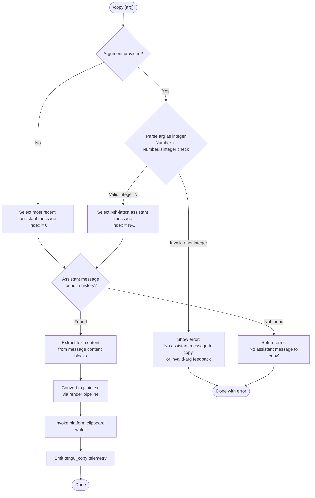

# `/copy`

> Analysis basis: CC v2.1.174 bundle.js (AST extraction + Claude interpretation)
> Minimum version: v2.1.174

---

## Overview

`/copy` copies Claude's most recent assistant response to the system clipboard. An optional integer argument `N` selects the Nth-latest assistant message instead of the most recent one. The command dispatches to the platform-appropriate clipboard backend (macOS `pbcopy`, Linux Wayland/X11 tools, tmux buffer, OSC-52 terminal escape, or Windows PowerShell) and emits a single telemetry event on completion.

---

## Registration

| Field | Value |
|---|---|
| type | `local-jsx` |
| name | `copy` |
| description | `Copy Claude's last response to clipboard (or /copy N for the Nth-latest)` |
| module_id | `joq` |
| load_inline | `true` |
| loc_byte | `11274659` |
| loc_byte_end | `11274845` |
| loc_line | `7408` |
| arbor_handler.name | `CI7` |
| arbor_handler.fqn | `claude-2.1.174::CI7` |
| arbor_handler.kind | `AsyncFunction` |
| arbor_handler.resolution_path | `module_id` |
| arbor_handler.n_hits | `0` |

Analysis basis: CC v2.1.174 bundle.js:+11274659

---

## Input Branching

The handler has four distinct paths based on argument parsing and message availability:



Analysis basis: CC v2.1.174 bundle.js:+11273844, +11273883, +11273954, +11273968

---

## Behavioral Spec

### 1. Argument Parsing

```
async function copyCommandHandler(appState, args):
    rawArg = args.trim()

    if rawArg is empty:
        targetIndex = 0            // most recent = index 0
    else:
        n = Number(rawArg)
        if not Number.isInteger(n):
            return renderError("No assistant message to copy")
        targetIndex = n - 1        // 1-based input → 0-based index
```

Analysis basis: CC v2.1.174 bundle.js:+11273954, +11273968

---

### 2. Message History Scan

```
function collectAssistantMessages(conversationMessages):
    // woq — filters the message list to assistant-role entries
    assistantMessages = []
    for message in conversationMessages:
        if Array.isArray(message.content):
            // Gf — filters content blocks by type == "text"
            textBlocks = message.content.filter(block => block.type == "text")
            if textBlocks is not empty:
                assistantMessages.push(message)
    return assistantMessages   // ordered newest-first or oldest-first per internal list
```

Analysis basis: CC v2.1.174 bundle.js:+11269862, +11269894, +11022594
Literal `"assistant"` at bundle.js:+11269792; literal `"text"` at bundle.js:+11022594.

---

### 3. Content Extraction and Rendering

```
function extractPlaintext(assistantMessage):
    // zoq — walks message content, builds renderable text
    textContent = ""
    for block in assistantMessage.content:
        if block.type == "text":
            textContent += block.text

    // Ooq — converts structured content to a displayable string
    // Uses table rendering (literal "table" at +11269556) and
    // plaintext fallback (literal "plaintext" at +11269997)
    rendered = renderToPlaintext(textContent)
    return rendered
```

The internal render path (identifier `Ooq`) handles markdown tables using a column-width calculation that calls `Bun.stringWidth` (bundle.js:+213480), applies column alignment strings `"center"`, `"right"`, `"left"` (bundle.js:+11269167, +11269209, +11269249), and joins cells with `" | "` (bundle.js:+11269132). Pipe characters in source text are escaped with `"\|"` (bundle.js:+11268973) before table parsing.

Analysis basis: CC v2.1.174 bundle.js:+11269443, +11269610, +11269621, +11268930, +11269023

---

### 4. Platform Clipboard Dispatch

The clipboard writer (call chain rooted at `TT` → `MK9` / `Qv_`) selects a backend based on the detected terminal and operating system environment:

```
async function writeToClipboard(text):
    encodedText = Buffer.from(text, "utf8").toString("base64")
    // MK9 — primary clipboard write, timeout 2000 ms (bundle.js:+3497834)

    switch detectClipboardBackend():
        case "macOS":
            spawn("pbcopy")                         // bundle.js:+3497868
        case "linux-wayland":
            spawn("wl-copy")                        // bundle.js:+3496925
        case "linux-x11-xclip":
            spawn("xclip", "-selection", "clipboard") // bundle.js:+3496994
        case "linux-x11-xsel":
            spawn("xsel", "--clipboard", "--input") // bundle.js:+3497035, +3498148, +3498162
        case "tmux":
            spawn("tmux", "load-buffer", "-w")      // bundle.js:+3497166, +3497200
            // also handles tmux-buffer path (bundle.js:+3496796)
        case "iTerm2":
            use iTerm2-specific path                // bundle.js:+3497156
        case "osc52":
            write OSC-52 terminal escape sequence   // bundle.js:+3496816
            // kitty variant at bundle.js:+3496396
        case "windows-wsl":
            spawn("powershell.exe", "-NoProfile", "-NonInteractive", "-Command", ...)
            // bundle.js:+3498234, +3498252, +3498265, +3498283
        case "windows-native":
            spawn("powershell", ...)                // bundle.js:+3498327
        case "screen":
            use screen terminal path               // bundle.js:+3495927
        case "none":
            no-op / error                          // bundle.js:+3497621

    // Qv_ — Linux fallback selection order: wl-copy → xclip → xsel
    // gv_ / LK9 — screen / kitty / raw DCS variants (bundle.js:+3495846, +3495797)
```

Terminal type detection reads environment variables; `"raw+dcs"`, `"dcs"`, `"raw"`, `"unset"` are intermediate state labels (bundle.js:+3497547, +3497570, +3497576, +3497369).

Analysis basis: CC v2.1.174 bundle.js:+3497463, +3497469, +3497482, +3497495, +3497663, +3497720, +3497762

---

### 5. Error Path — No Message Found

```
if targetIndex >= assistantMessages.length or assistantMessages is empty:
    return renderInlineError("No assistant message to copy")
    // literal at bundle.js:+11273885
```

The command returns without writing to the clipboard or emitting telemetry.

Analysis basis: CC v2.1.174 bundle.js:+11273883, +11273885

---

### 6. Telemetry Emission

```
after successful clipboard write:
    emit("tengu_copy")   // bundle.js:+11274263
    // event fires after the clipboard backend completes,
    // indicating that content was placed on the clipboard
```

Analysis basis: CC v2.1.174 bundle.js:+11274263

---

## State & Side Effects

| Item | Detail |
|---|---|
| Telemetry | `tengu_copy` (bundle.js:+11274263) — fired on successful copy |
| Clipboard | Mutates system clipboard via platform-specific backend |
| Hook registration | None detected in depth-2 traversal |
| appState changes | None detected; reads `messages` / `message` fields (bundle.js:+11274139, +11274149) from session state |
| Sound | None detected |
| File I/O | Temporary file written under `CLAUDE_CODE_TMPDIR` or `/tmp` by the OSC-52 / DCS clipboard path (bundle.js:+4081316) |
| Process spawning | Spawns external clipboard helper process with 2000 ms timeout (bundle.js:+3497834) |

---

## Version History

| Version | Change |
|---|---|
| v2.1.174 | Initial analysis |

---

## Common Mistakes

1. **Passing a non-integer argument** — `/copy 1.5` or `/copy last` will fail the `Number.isInteger` check and produce an error instead of copying. Only whole-number arguments are accepted.
2. **Using 0 as the index** — The argument is 1-based (`/copy 1` = most recent, `/copy 2` = second-most-recent). Passing `0` will evaluate as falsy and behave like `/copy` with no argument (copies the most recent message), not an error — but the intent may differ.
3. **Expecting rich formatting** — The command copies **plaintext** rendered output. Markdown bold/italic and code-block fences are stripped or represented as plain characters. Table cells are preserved as ASCII-art columns using `" | "` separators.
4. **Running in environments without a clipboard tool** — On headless Linux servers without `wl-copy`, `xclip`, or `xsel` installed, the command will silently fail or error. SSH sessions may require OSC-52 support in the terminal emulator.
5. **Assuming telemetry fires on error** — `tengu_copy` is only emitted on a successful clipboard write. Failure paths (no message found, clipboard tool missing) do not emit telemetry.

---

## Appendix — Identifier Mapping

> For bundle debugging only. Identifiers change across versions.

| Identifier | Role |
|---|---|
| `CI7` | Main async handler for `/copy` command (arbor-resolved entry point) |
| `woq` | Filters conversation messages to assistant-role entries with text blocks |
| `Gf` | Filters content blocks by `type == "text"` |
| `zoq` | Walks message content to build renderable text string; calls `Ooq` |
| `Ooq` | Converts structured content to plaintext / ASCII-table string |
| `II7` | Inner map helper used by `Ooq` for column iteration |
| `hI7` | Lexer/tokenizer helper called by `CI7` before content extraction |
| `CWH` | String-replace utility used inside lexer path |
| `eLA` | Clipboard write orchestrator called after content extraction |
| `TT` | Top-level clipboard dispatch function; selects backend strategy |
| `MK9` | Primary clipboard writer (macOS `pbcopy` path; 2000 ms timeout) |
| `Qv_` | Linux clipboard fallback writer (`wl-copy` / `xclip` / `xsel`) |
| `lB4` | Helper that joins text segments before clipboard write |
| `gv_` | Screen/raw terminal clipboard path |
| `BW6` | OSC-52 clipboard path helper |
| `B0` | DCS/raw+dcs terminal clipboard path |
| `yY` | Kitty terminal clipboard path |
| `LK9` | Kitty protocol inner writer |
| `UW6` | OSC-52 base64 encode and write helper |
| `wY` | Low-level terminal escape sequence writer |
| `Doq` | Temporary-file writer used by some clipboard paths |
| `ZJ` | Directory creation / temp-file setup for clipboard data |
| `Zw9` | `lstatSync` + `chmodSync` safe-directory guard for temp path |
| `r3` | Markdown lexer instance used during content parsing |
| `Yoq` | Post-processing replace pass on extracted text |
| `f8` | Column width calculator via `Bun.stringWidth` |
| `VLH` | Text trim / truncation utility (1000 ms / index 0 constants) |
| `mDK` | Daemon status helper (reads `daemon.status.json`) |
| `Dp6` | Path joiner for daemon status file |
| `c9` | AsyncLocalStorage store accessor (`yU4.getStore`) |
| `RH` | `JSON.stringify` wrapper |
| `x8` | Stopped/background-session state string helper |