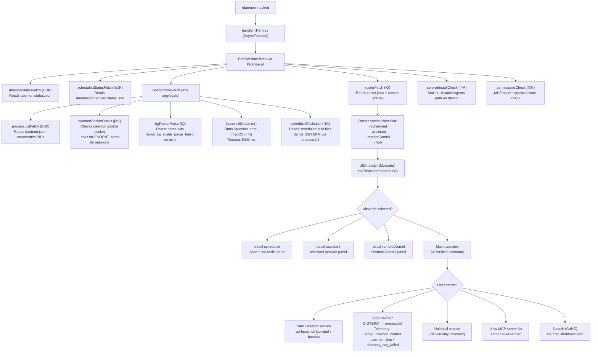

# `/daemon`

> Analysis basis: CC v2.1.174 bundle.js (AST extraction + Claude interpretation)
> Minimum version: v2.1.174

---

## Overview

The `/daemon` command provides a management interface for Claude Code's background daemon process and associated background services. It collects status information from multiple sources — including running daemon processes, scheduled task state, roster files, and MCP server connections — and renders an interactive JSX panel allowing the user to view and control these services. The command type is `local-jsx`, meaning it renders a local React/Ink component rather than sending a prompt to the model.

---

## Registration

| Field | Value |
|---|---|
| type | `local-jsx` |
| name | `daemon` |
| description | `Manage background services and routines` |
| immediate | `true` |
| module_id | `eYA` |
| load_inline | `true` |
| loc_byte | `13247201` |
| loc_byte_end | `13247369` |
| loc_line | `9677` |
| arbor_handler.name | `rH5` |
| arbor_handler.fqn | `claude-2.1.174::rH5` |
| arbor_handler.kind | `AsyncFunction` |
| arbor_handler.resolution_path | `module_id` |
| arbor_handler.n_hits | `0` |

Analysis basis: CC v2.1.174 bundle.js:+13247201

---

## Input Branching

The command has more than three distinct internal branches (daemon status aggregation, scheduled-task sub-view, assistant-session detail, remote-control detail, MCP server management, and service lifecycle operations). A Mermaid flowchart is used.



---

## Behavioral Spec

### 1. Main Handler — `daemonCommandHandler` (`rH5`)

Analysis basis: CC v2.1.174 bundle.js:+13235950

```
async function daemonCommandHandler():
    results = await Promise.all([
        aggregateServiceStatus(),   // sYA
        checkServiceInstall(),      // rYA
        checkPermissions()          // IXK
    ])
    renderDaemonUI(results)         // tYA component via M.render
```

The handler is resolved via `module_id → eYA → export rH5` (Arbor resolution path: `module_id`).

---

### 2. Service Status Aggregation — `aggregateServiceStatus` (`sYA`)

Analysis basis: CC v2.1.174 bundle.js:+13235471

```
async function aggregateServiceStatus():
    [processList, socketStatus, bgRoster, launchctlInfo, scheduledTasks] =
        await Promise.all([
            fetchProcessList(),          // EXK
            fetchDaemonSocketStatus(),   // jXK
            fetchBgRoster(),             // lQ
            fetchLaunchctlStatus(),      // dr
            fetchScheduledTasks()        // NG
        ])
    return { processList, socketStatus, bgRoster, launchctlInfo, scheduledTasks }
```

---

### 3. Process List Fetch — `fetchProcessList` (`EXK`)

Analysis basis: CC v2.1.174 bundle.js:+13230173

```
async function fetchProcessList():
    // Reads "daemon.json" from the Claude data directory
    // Parses JSON; validates Array.isArray
    // For each entry, checks if PID is alive (SH helper)
    // Returns list of active daemon entries
    entries = await readJsonFile("daemon.json")   // AYA
    alive = filterAliveProcesses(entries)          // SH → DA, L6, _q, dbf
    return alive
```

- File encoding: `"utf8"` (bundle.js:+13031197)
- Status entries include a `"scheduled"` marker (bundle.js:+13123925)
- Data chunk size constant: `1024` (bundle.js:+16762936)

---

### 4. Daemon Socket Status — `fetchDaemonSocketStatus` (`jXK`)

Analysis basis: CC v2.1.174 bundle.js:+13223687

```
async function fetchDaemonSocketStatus():
    ctx = getAsyncContext()              // c9 → yU4.getStore
    socketPath = buildSocketPath()       // px → j5A.join, q_
    status = await queryDaemonSocket(socketPath)  // iEH
    if error.code === "ENOENT":
        return { connected: false }
    sessions = status.filter(s => s.kind === "same-dir")  // literal "same-dir"
    mapped = sessions.map(s => path.basename(s.path))      // bOH.basename
    return { connected: true, sessions: mapped }
```

- Handles `ENOENT` error code for missing socket (bundle.js:+13218249)
- Session kind literal: `"same-dir"` (bundle.js:+13223854)

---

### 5. Background Roster Parse — `fetchBgRoster` (`lQ`)

Analysis basis: CC v2.1.174 bundle.js:+11749633

```
async function fetchBgRoster():
    rosterPath = buildRosterPath()   // _OH → k$.join + HOH
    raw = await fs.readFile(rosterPath)
    if parse fails:
        emit telemetry("tengu_bg_roster_parse_failed")  // bundle.js:+11749714
        return []
    entries = JSON.parse(raw)
    // Validate: Array.isArray or Object.keys
    // Rotate/rename stale files via Ieq (Bf6.rename + Date.now)
    // Launch SH subprocess checks per entry
    return validatedEntries
```

- Roster file name: `"roster.json"` (bundle.js:+11745799)
- Telemetry on parse failure: `tengu_bg_roster_parse_failed` (bundle.js:+11749714)

---

### 6. Launchctl Status — `fetchLaunchctlStatus` (`dr`)

Analysis basis: CC v2.1.174 bundle.js:+11742887

```
async function fetchLaunchctlStatus():
    // macOS only — platform check via process.getuid (Jeq)
    cmd = ["launchctl", "print"]   // literals bundle.js:+11742890, +11742903
    result = await runWithTimeout(cmd, 5000)  // pm8; timeout literal bundle.js:+11742937
    return parseLaunchctlOutput(result)
```

- Command: `"launchctl"` + `"print"` (bundle.js:+11742890, +11742903)
- Timeout: `5000` ms (bundle.js:+11742937)

---

### 7. Scheduled Tasks List — `fetchScheduledTasks` (`NG`)

Analysis basis: CC v2.1.174 bundle.js:+11738867

```
async function fetchScheduledTasks():
    statusPath = buildScheduledStatusPath()  // reads "daemon.status.json" equivalent
    raw = await fs.readFile(statusPath)      // vU.readFile
    tasks = parseStatusFile(raw)             // aTH, k8, fq
    // For tasks that need stopping: process.kill(pid, signal)
    // Then optionally restart via $W → wS
    return tasks
```

- Daemon status file: `"daemon.status.json"` (bundle.js:+13030401)
- Scheduled status file: `"daemon.scheduled.status.json"` (bundle.js:+13122420)
- Process identification string: `"claude daemon"` with signal `4` (bundle.js:+11738786, +11738813)
- Daemon keyword: `"daemon"` (bundle.js:+11738825)

---

### 8. Service Install Check — `checkServiceInstall` (`rYA`)

Analysis basis: CC v2.1.174 bundle.js:+13219794

```
async function checkServiceInstall():
    homeDir = os.homedir()             // zXK.homedir
    agentPath = path.join(            // COH.join
        homeDir, "Library", "LaunchAgents"  // literals bundle.js:+11739675, +11739685
    )
    stat = await fs.stat(agentPath)   // Sp6.stat
    installed = (stat !== null)
    // Also check assistant role path (literal "assistant") bundle.js:+13219854
    return { installed, agentPath }
```

- LaunchAgents path segments: `"Library"`, `"LaunchAgents"` (bundle.js:+11739675, +11739685)

---

### 9. UI Render Component — `daemonUIComponent` (`tYA`)

Analysis basis: CC v2.1.174 bundle.js:+13236161

```
function daemonUIComponent(props):
    [view, setView] = useState(...)       // sq.useState
    clock = useClock()                     // y1 → U39.useContext
    now = Date.now()
    mcpServerList = renderMcpServerList()  // M → HCH / NGA path
    rosterEntries = categorize(props.roster):
        - "scheduled"     → scheduledPanel
        - "assistant"     → assistantPanel
        - "remoteControl" → remoteControlPanel
        - "hub"           → hubEntry
    return (
        <Box>
            <DaemonOverview />
            {view === "detail-scheduled" && <ScheduledPanel />}
            {view === "detail-assistant" && <AssistantPanel />}
            {view === "detail-remoteControl" && <RemoteControlPanel />}
            <McpServerList servers={mcpServerList} />
        </Box>
    )
```

- View literals: `"detail-scheduled"`, `"detail-assistant"`, `"detail-remoteControl"` (bundle.js:+13236781, +13236939, +13237060)
- Entry type literals: `"scheduled"`, `"remoteControl"`, `"hub"` (bundle.js:+13237312, +13237357)
- Label literals: `"Scheduled"`, `"Remote Control"`, `"Claude daemon"`, `"permission"` (bundle.js:+13237708, +13238029, +13238314, +13238412)

---

### 10. Service Lifecycle Controls

Analysis basis: CC v2.1.174 bundle.js:+11741800

The UI exposes these actions, wired through `xf6` and `Xu6` component handlers:

```
function handleServiceAction(action, serviceName):
    if action === "start":
        launchctl("kickstart", serviceName)    // literal bundle.js:+11741811
    elif action === "stop":
        launchctl("stop", serviceName)         // literal bundle.js:+11741836
    elif action === "restart":
        launchctl("stop")
        await waitForExit(timeout=10_000ms)    // "daemon did not exit within 10s of SIGTERM"
        launchctl("kickstart", serviceName)    // literal bundle.js:+11741876
    elif action === "uninstall":
        if platform !== "darwin":
            return error("service uninstall not available on darwin")  // bundle.js:+11741580
        launchctl("bootout", serviceName)      // literal bundle.js:+11741448
    emit telemetry("tengu_daemon_control",     // bundle.js:+16895373
        { result: "daemon_stop" | "daemon_stop_failed" })
```

- `"darwin"` platform check literal (bundle.js:+11742459)
- Restart polling: `50` iterations × `200 ms` (inferred from timeout `10s` / 50 = 200 ms; bundle.js:+11742104)
- Uninstall unavailable message: `"service uninstall not available on darwin"` (bundle.js:+11741580) — this string is surfaced when the code path is reached on non-darwin platforms, not on darwin itself.

---

### 11. MCP Server Management Sub-System (`HCH` / `NGA`)

Analysis basis: CC v2.1.174 bundle.js:+16520435

The daemon UI embeds a full MCP server list rendered via `HCH` (server-list renderer) and `NGA` (server state manager). Key behaviors:

```
function renderMcpServerList(servers):
    entries = Object.entries(servers)
    for each [name, config] in entries:
        if config.status === "disabled":   skip
        resolve transport: "stdio" | "sse" | "http" | "ws-ide" | "sse-ide" | "claudeai-proxy"
        check auth state: "needs-auth" | "approved" | "pending"
        if needs-auth and cached:
            display: "Skipping connection (cached needs-auth)"
        check failure cache:
            display: "Skipping connection (recent failure cached; retries in 15 min)"
        else:
            connect and render tool/prompt list
```

- Transport type literals: `"stdio"`, `"sse"`, `"http"`, `"sse-ide"`, `"ws-ide"`, `"claudeai-proxy"` (bundle.js:+6745183, +6481003, +6481019, +6745282, +6745318, +6745590)
- Auth state literals: `"needs-auth"`, `"approved"`, `"pending"` (bundle.js:+6745842, +6489422, +6489449)
- "Skipping cached needs-auth" message (bundle.js:+6745776)
- "Skipping failure cached" message (bundle.js:+6746038)
- MCP OAuth flow timeout: `300000` ms / 5 minutes (bundle.js:+6521131)

---

### 12. Daemon Stop / Shutdown Path (`z` / `dU`)

Analysis basis: CC v2.1.174 bundle.js:+16895295

```
async function stopDaemon():
    emit telemetry("tengu_daemon_control",
        subEvent: "daemon_stop" | "daemon_stop_failed")
    result = await Promise.race([
        shutdownGracefully(),    // ULH → pLH.shutdown
        timeout(500)             // literal bundle.js:+16890416
    ])
    await Promise.all([
        waitForClients(),        // l8
        clearTimers()            // BLH → clearTimeout
    ])
    process.exit(code)
```

- Timeout constant: `500` ms (bundle.js:+16890416)
- Stop telemetry keys: `"daemon_stop"`, `"daemon_stop_failed"` (bundle.js:+16895298, +16895335)

---

## State & Side Effects

| Item | Detail |
|---|---|
| Telemetry — roster | `tengu_bg_roster_parse_failed` (bundle.js:+11749714) |
| Telemetry — MCP OAuth | `tengu_mcp_oauth_flow_start` (bundle.js:+6516571), `tengu_mcp_oauth_flow_success` (bundle.js:+6521557), `tengu_mcp_oauth_flow_error` (bundle.js:+6523268) |
| Telemetry — daemon config | `tengu_daemon_config_reload` (bundle.js:+16873690) |
| Telemetry — MCP skills | `tengu_mcp_skills` (bundle.js:+6623670) |
| Telemetry — config auth | `tengu_config_auth_loss_prevented` (bundle.js:+3312009) |
| Telemetry — feature flags | `tengu_feature_ok` (bundle.js:+1016891), `tengu_feature_bad` (bundle.js:+1016958) |
| Telemetry — daemon control | `tengu_daemon_control` (bundle.js:+16895373) |
| Telemetry — bg proto | `tengu_bg_proto_mismatch` (bundle.js:+16844877) |
| Telemetry — bg dispatch | `tengu_bg_dispatch_stale_drop` (bundle.js:+16846245), `tengu_bg_dispatch_sigkill_escalate` (bundle.js:+16858186), `tengu_bg_dispatch_low_mem` (bundle.js:+16858787) |
| Telemetry — bg attach | `tengu_bg_attach` (bundle.js:+16850057), `tengu_bg_attach_legacy_autorespawn` (bundle.js:+16848899), `tengu_bg_attach_stall_gave_up` (bundle.js:+16850980), `tengu_bg_attach_stall_respawn` (bundle.js:+16851250), `tengu_bg_attach_kick` (bundle.js:+16852200) |
| Telemetry — scheduled tasks | `tengu_scheduled_task_missed` (bundle.js:+16354460), `tengu_scheduled_task_fire` (bundle.js:+16355211), `tengu_scheduled_task_expired` (bundle.js:+16355554) |
| Telemetry — bg memory | `tengu_bg_low_mem_mb` (bundle.js:+13305660) |
| Telemetry — bg spare | `tengu_bg_spare_enable` (bundle.js:+16859491), `tengu_bg_spare_claim` (bundle.js:+16859619), `tengu_bg_spare_claim_fail` (bundle.js:+16859885), `tengu_bg_sendclaim_failed` (bundle.js:+16836979) |
| Telemetry — bg state | `tengu_bg_state_read_transient` (bundle.js:+4236328) |
| File reads | `daemon.json`, `daemon.status.json`, `daemon.scheduled.status.json`, `roster.json`, `mcp-needs-auth-cache.json` |
| File writes / renames | Roster rotation via `Bf6.rename`; MCP needs-auth cache updates |
| Process signals | `process.kill(pid, signal)` for daemon PID management; `SIGTERM`, `SIGKILL` used |
| launchctl invocations | `kickstart`, `stop`, `restart`, `bootout`, `print` (macOS only) |
| MCP OAuth HTTP server | Spins up `http.createServer` on `127.0.0.1` for OAuth callback at `/callback`; timeout 300 000 ms |
| Hook registration | `qvA.register` (R9) — registers a cleanup/unmount hook |
| UI unmount | `M.unmount` called on exit (bundle.js:+13246788) |
| Sound | <!-- TODO: not found in depth-2 traversal; needs --depth 4 --> |

---

## Version History

| Version | Change |
|---|---|
| v2.1.174 | Initial analysis |

---

## Common Mistakes

1. **Expecting a model response.** `/daemon` is `type: local-jsx` with `immediate: true`. It renders an Ink component locally and never sends a prompt to Claude. No assistant turn is produced.
2. **Assuming cross-platform service management.** The `uninstall` action and `launchctl` interactions are macOS-only (`"darwin"`). On other platforms the service install/uninstall path is unavailable and returns an explicit error message.
3. **Running without a running daemon.** If no daemon process is found (socket `ENOENT`), the UI still renders but shows a disconnected state. Starting the daemon first (via `claude --bg` or the system service) is required for full management capability.
4. **Confusing the roster with the process list.** `roster.json` tracks background session metadata; `daemon.json` tracks daemon process entries. Both are read independently and merged in the UI.
5. **Expecting MCP OAuth to complete instantly.** The OAuth flow spawns a local HTTP server and waits up to 5 minutes (300 000 ms) for the user to complete browser-side authorization. On remote SSH sessions the callback URL must be pasted manually.

---

## Appendix — Identifier Mapping

> For bundle debugging only. Identifiers change across versions.

| Identifier | Role |
|---|---|
| `A65` | Top-level daemon command JSX entry point |
| `rH5` | Main async handler (`daemonCommandHandler`) — Arbor-resolved handler |
| `sYA` | Service status aggregator (`aggregateServiceStatus`) |
| `tYA` | Daemon UI React/Ink component |
| `tTH` | Internal sub-init called from aggregator |
| `EXK` | Process list fetcher (`fetchProcessList`) |
| `XL6` | Daemon entry enumerator |
| `AYA` | JSON file reader for `daemon.json` |
| `kYA` | Array validation helper |
| `SH` | Process alive checker / subprocess runner |
| `DA` | Error/String conversion utility |
| `L6` | String coercion helper |
| `_q` | Essential-traffic queue handler |
| `dbf` | Queue shift/push manager |
| `NG` | Scheduled tasks list fetcher |
| `Yu6` | Status file reader (scheduled tasks) |
| `D5A` | Log-tail reader (splits file lines) |
| `$W` | Restart helper → `wS` |
| `jXK` | Daemon socket status fetcher |
| `iEH` | Socket query executor |
| `c9` | Async context store getter |
| `V8` | Generic value validator |
| `iYA` | Internal socket helper (`nYA` wrapper) |
| `TH` | String coercion (via `String()`) |
| `K` | Pad/map utility for display formatting |
| `px` | Socket path builder (`j5A.join + q_`) |
| `UDK` | Daemon status path resolver |
| `Dp6` | Path join helper for status files |
| `wJK` | Scheduled status file reader |
| `zJK` | Scheduled status path builder |
| `lQ` | Background roster parser |
| `l6` | JSON.parse wrapper |
| `_OH` | Roster path resolver |
| `HOH` | Roster directory path builder |
| `k8` | Error code classifier |
| `V5A` | Timestamp helper (`Date.now` wrapper) |
| `Ieq` | Roster file rotator (rename + timestamp) |
| `lC7` | Roster entry type validator |
| `$1` | Sub-process spawner (`S56`) |
| `dr` | launchctl status fetcher |
| `u8` | launchctl runner (`p_` + `b6`) |
| `p_` | Shell command executor with signal handling |
| `b6` | Sub-process wrapper (`eo6 + j_`) |
| `pm8` | Timeout-wrapped process runner (`Jeq`) |
| `Jeq` | UID-based process checker (`process.getuid`) |
| `rYA` | Service install checker (LaunchAgents stat) |
| `j_` | Generic child process spawner |
| `rG` | Process registry |
| `Wa6` | Path + existence checker |
| `r6` | File existence check helper |
| `N` | Notification/log writer (multi-path) |
| `Z1f` | Notification dispatcher |
| `fvA` | Notification formatter |
| `H` | Random/timer-based utility (Math.random + setTimeout) |
| `RH` | JSON.stringify wrapper |
| `df` | Text redaction helper (`[REDACTED]` literal) |
| `UhA` | Word-map formatter |
| `VgH` | Terminal write helper (`hhA`) |
| `hhA` | Raw terminal writer |
| `h1f` | Log file appender (mkdir + appendFile + rotate) |
| `oFH` | Debounced output flusher (setTimeout/setImmediate) |
| `sfH` | Log path builder |
| `C36` | Value validator |
| `ghA` | Log directory path builder |
| `Qt8` | Log rotation handler (rename/unlink) |
| `N1f` | Log write executor (mkdir + appendFile + rotate) |
| `R9` | Hook registrar (`qvA.register`) |
| `M` | MCP server manager (render + unmount) |
| `HCH` | MCP server list renderer |
| `Wi` | MCP server slot processor |
| `PV6` | Server config validator |
| `Le` | MCP server connection orchestrator |
| `Zg` | Server type aggregator (`sdk` transport) |
| `VX8` | Server status color coder (red/yellow) |
| `JV6` | SSE/HTTP server connector |
| `tV` | Transport validator (`Hw + VB_`) |
| `Hw` | Auth header builder |
| `c8` | Config serializer |
| `wv6` | Server filter utility |
| `zn9` | Server cache key builder |
| `jg_` | Server cache reader |
| `m2H` | Server config hasher (sha256) |
| `OJ8` | Server state reader |
| `zJ8` | Server state writer |
| `iX` | Config hash builder |
| `MJ8` | Server manifest reader |
| `If` | Server init helper |
| `Y8` | MCP debug logger |
| `nX8` | MCP server connector (full flow) |
| `STL` | Server transport initializer |
| `pc` | Server auth checker |
| `d1H` | Server dependency loader |
| `c1H` | Server config merger |
| `H9H` | MCP OAuth server manager (HTTP + token exchange) |
| `bH6` | Connection promise tracker |
| `Y` | Shutdown/abort handler (process.exit + z.abort) |
| `rX8` | Server reconnect cache reader |
| `Ei` | Server reconnect executor |
| `cu` | Token key checker |
| `w` | Supervisor writer (iEH + queue) |
| `zL` | MCP error logger |
| `RTL` | Reconnect race handler |
| `kTL` | SSH transport checker |
| `iX8` | MCP server tool executor |
| `CH6` | Active connection getter |
| `xH6` | Pending connection getter |
| `f` | Task set manager (add/delete) |
| `Wn9` | Server re-poll handler |
| `lP8` | Needs-auth cache path builder |
| `uB_` | Server capability initializer |
| `j` | Process kill iterator |
| `S` | Worker process manager |
| `lN` | MCP skills telemetry emitter |
| `w6` | Skills event builder |
| `ZB_` | Config source router (enterprise/user/project/local) |
| `G8` | Global config writer |
| `y` | Warning message renderer |
| `ea` | Usage-based billing notice |
| `jn9` | Batch request dispatcher |
| `tF` | Async iterator / stream processor |
| `f66` | Port parser (parseInt) |
| `nP8` | Secondary port parser (parseInt) |
| `Mi8` | MCP update applier |
| `eRH` | MCP update diff builder |
| `_G` | MCP cleanup orchestrator |
| `q66` | Server config-hash comparator |
| `$` | Daemon socket writer (mDK) |
| `mDK` | Daemon command dispatcher |
| `As` | Daemon socket path builder |
| `NGA` | MCP server state manager |
| `RX8` | Server allow-list checker |
| `l8` | Timeout-with-abort helper |
| `O` | Background session object |
| `IXK` | MCP permissions aggregator |
| `PiH` | Permission list builder |
| `BJ6` | Permission set manager |
| `L04` | Model/feature capability mapper |
| `tYA` | Daemon UI Ink/React component |
| `y1` | Clock context consumer |
| `L` | Session lifecycle manager (close/open) |
| `yf` | Ref/context/memo hook bundle |
| `z` | App-level stop/cleanup hub |
| `kH` | Feature-ok telemetry emitter |
| `A6` | Generic telemetry sub-emitter |
| `CH` | Feature-bad telemetry emitter |
| `WS` | Worker session launcher |
| `zm` | Session transport constructor |
| `chH` | Session protocol handler |
| `qX_` | Session UUID generator + emitter |
| `dU` | Graceful shutdown with race + timeout |
| `ULH` | Shutdown signal sender |
| `BLH` | Timer clear + cleanup helper |
| `G` | Input event handler (key dispatch) |
| `I` | Input text state |
| `T` | Vim-mode state machine |
| `A56` | Vim key-map lookup |
| `CoK` | Key-map key enumerator |
| `wc` | Clipboard helper |
| `XY` | Clipboard read/write |
| `CIK` | Vim normal-mode command dispatcher |
| `XM5` | Offset setter dispatcher |
| `bIK` | Vim motion executor |
| `PM5` | Count-prefixed motion handler |
| `WM5` | Find-and-set motion handler |
| `GM5` | Goal-column motion handler |
| `oUH` | Position equality checker |
| `TM5` | Text-object motion handler |
| `wc8` | Word motion sub-handler |
| `DIK` | Vim delete-motion handler |
| `Tc8` | Delete range calculator |
| `$IK` | Last-index search helper |
| `Gc8` | Character boundary detector |
| `y4` | String index finder |
| `sVH` | Clipboard paste helper |
| `YIK` | Yank-motion executor |
| `Z76` | Yank range builder |
| `PIK` | Put (paste) motion handler |
| `XIK` | Put text applier |
| `TIK` | Case-toggle motion handler |
| `GIK` | Case transform executor |
| `b` | Background session registry + scheduler |
| `SSH` | Schedule file reader |
| `r5H` | Schedule file path builder |
| `Z9` | Value unwrapper |
| `jy` | Cron expression tokenizer |
| `TtH` | Schedule file writer |
| `Nf` | Config path resolver |
| `o09` | Schedule list filterer |
| `GtH` | Schedule entry validator |
| `P` | PTY/terminal session object |
| `X` | PTY connection handler |
| `R7` | PTY end/close writer |
| `YZ5` | PTY supervisor (full attach/detach/resize loop) |
| `d` | PTY reader/router |
| `weq` | PTY socket unlinker |
| `udK` | Schedule display formatter |
| `xN` | Cron expression parser (minute/hour/weekday) |
| `S1H` | Session roster reconciler |
| `H8H` | Session ID set checker |
| `ZIK` | Vim paste-over motion handler |
| `vIK` | Visual-paste text applier |
| `OIK` | Vim word-forward motion handler |
| `sUH` | Word-boundary slicer |
| `zIK` | Vim word-backward motion handler |
| `FPA` | Prefix-strip helper |
| `D` | Background session dispatcher (spawn + lifecycle) |
| `vg8` | Memory pressure checker (macOS) |
| `TG6` | Pinned-task reader |
| `ak_` | Pins file path builder |
| `M6L` | Task directory scanner |
| `Q` | PTY/socket connection state machine |
| `l` | Scheduled task executor loop |
| `C` | Output write-after-timeout helper |
| `B` | Task metadata store |
| `xZ` | Roster entry path builder |
| `p` | Task payload buffer |
| `Jv` | Binary frame encoder |
| `ou8` | Binary frame decoder |
| `PTA` | Daemon claim sender (socket auth) |
| `xJA` | Claim file writer |
| `qZ5` | Claim timeout handler |
| `AZ5` | Claim frame builder |
| `VTA` | Background session lifecycle manager (full) |
| `_f` | Session data dir resolver |
| `Tq` | Session state file manager |
| `GO` | Active session tracker |
| `xXH` | Config change diff detector |
| `c7` | Session config writer |
| `Ff6` | Roster flush scheduler |
| `Gu6` | Socket path builder (roster) |
| `AOH` | PID file path builder |
| `cQ` | Session lock file writer |
| `Wu6` | Socket symlink path builder |
| `nPA` | Vim insert-mode command dispatcher |
| `fM5` | Insert offset dispatcher |
| `kIK` | Insert motion executor |
| `LM5` | Count-prefixed insert motion |
| `MM5` | Insert text-object motion |
| `pPA` | Insert paste handler |
| `SIK` | Insert selection handler |
| `$M5` | Count-prefixed selection handler |
| `OM5` | Find-in-insert-mode handler |
| `Yc8` | Insert find executor |
| `zM5` | Insert delete-word handler |
| `Dc8` | Insert delete executor |
| `wM5` | Insert find-set handler |
| `YM5` | Insert goal-column handler |
| `DM5` | Insert delete-range handler |
| `aUH` | Insert range delete executor |
| `hIK` | Insert equals-check handler |
| `jM5` | Insert join-lines handler |
| `Jc8` | Insert join executor |
| `JM5` | Insert word-wrap handler |
| `Wc8` | Insert wrap executor |
| `J` | Session job dispatcher |
| `xf6` | Daemon uninstall flow (bootout + unlink) |
| `P5A` | LaunchAgents plist path builder |
| `Xu6` | Service start/restart flow |
| `W5A` | Service kickstart executor |
| `E` | Viewport / terminal size manager |
| `W` | MCP connection batch processor |
| `V` | View/panel state manager |

---

Note: index built via Arbor fallback; some signals (telemetry, literals) may be missing — see arbor-fallback.js.