# `/exit`

> Analysis basis: CC v2.1.174 bundle.js (AST extraction + Claude interpretation)
> Minimum version: v2.1.174

---

## Overview

The `/exit` command (aliased as `/quit`) terminates the Claude Code CLI session gracefully. It displays a farewell message, flushes pending I/O and telemetry, tears down background daemon connections and MCP servers, and finally calls `process.exit`. The command is registered as `local-jsx` with `immediate: true`, meaning it executes synchronously without waiting for an agent turn.

---

## Registration

| Field | Value |
|---|---|
| type | `local-jsx` |
| name | `exit` |
| aliases | `["quit"]` |
| description | `null` |
| immediate | `true` |
| load_inline | `true` |
| module_id | `ywK` |
| loc_byte | `12932466` |
| loc_byte_end | `12932662` |
| arbor_handler.name | `Ta7` |
| arbor_handler.fqn | `claude-2.1.174::Ta7` |
| arbor_handler.kind | `AsyncFunction` |
| arbor_handler.resolution_path | `module_id` |
| arbor_handler.n_hits | `1` |

Analysis basis: CC v2.1.174 bundle.js:+12932466

---

## Input Branching

The exit flow has five or more distinct phases (farewell render → background-task detach → shutdown sequence → telemetry flush → forced kill), making a Mermaid flowchart the appropriate representation.

```mermaid
flowchart TD
    A["/exit or /quit invoked"] --> B["Render 'Goodbye!' JSX farewell\n(bundle.js:+12931679)"]
    B --> C["Emit prompt_input_exit telemetry\n(bundle.js:+12931903)"]
    C --> D{"Background / daemon\ntasks running?\n(r$H check, bundle.js:+12931731)"}
    D -- "Yes" --> E["Send detach-request message\nto daemon worker\n(bundle.js:+11281699)"]
    D -- "No" --> F["Begin full shutdown sequence\n(N9, bundle.js:+12931898)"]
    E --> F
    F --> G["Unmount Ink/React UI\n(MbH, bundle.js:+7391913)"]
    G --> H["Restore terminal state\n(Y$8 — ANSI save/restore,\nbundle.js:+3847053)"]
    H --> I["Write goodbye text to stdout\n(Gl_, bundle.js:+7392292)"]
    I --> J["Drain stdout buffer\n(aFH → qvA.drain,\nbundle.js:+63918)"]
    J --> K{"Pending settled\nwithin 2000 ms?\n(bundle.js:+7394438)"}
    K -- "Yes" --> L["Flush telemetry/session_end\n(o36/_IA/LIA, bundle.js:+7394574)"]
    K -- "No (timeout)" --> L
    L --> M["Stop MCP servers & supervisors\n(w → E.stop / T.stop,\nbundle.js:+16873165)"]
    M --> N["Wait up to 5000 ms for\nchild processes\n(bundle.js:+7394253)"]
    N --> O{"All processes exited?"}
    O -- "Yes" --> P["process.exit(0)\n(Tl_, bundle.js:+7392500)"]
    O -- "No" --> Q["process.kill / SIGKILL escalation\n(Tl_, bundle.js:+7392525)"]
    Q --> P
```



---

## Behavioral Spec

### 1. Handler Entry — `exitCommandHandler` (Ta7)

Analysis basis: CC v2.1.174 bundle.js:+12931715

```
async function exitCommandHandler(context):
    # Step 1: Check for running background/daemon processes
    notifyBackgroundDetach(context)      # r$H — sends detach-request

    # Step 2: Play optional farewell animation
    playFarewellAnimation()              # H — Math.random + setTimeout

    # Step 3: Render "Goodbye!" JSX element
    render DwA.createElement(farewellComponent, ...)
    # Farewell component (Ga7 → FW) displays literal "Goodbye!" (bundle.js:+12931679)

    # Step 4: Emit prompt_input_exit telemetry event
    emitTelemetry("prompt_input_exit")  # bundle.js:+12931903

    # Step 5: Trigger full shutdown
    await fullShutdownSequence(context)  # N9
```

### 2. Background-Task Detach — `detachBackgroundTasks` (r$H)

Analysis basis: CC v2.1.174 bundle.js:+11281665

```
function detachBackgroundTasks(context):
    sessionList = getActiveSessions()    # l18
    for session in sessionList:
        if session.type == "task":       # literal "task", bundle.js:+11276043
            stopSession(session)         # Zoq → ub8, x8
    writeDetachMessage(                  # Rr → RHH.write
        payload: jsonSerialize({type: "detach-request"})  # literal bundle.js:+11281699
    )
    broadcastDetach()                    # WKH
```

### 3. Scheduled-Task Teardown — `scheduledTaskTeardown` (iu8)

Analysis basis: CC v2.1.174 bundle.js:+11274893

```
function scheduledTaskTeardown(taskList):
    notify("scheduled task")             # literal bundle.js:+11274912; PE → rG
    for each task in taskList:           # H.push
        calculateRemainingTime(task)     # xI7 → xN, jy, PtH
        truncateDisplay(task.label)      # uq — indexOf / substring
        computeElapsedMs(task)           # C9 — Math.floor / Math.round
```

#### 3a. Time-string Parser — `parseScheduleExpression` (xN)

Analysis basis: CC v2.1.174 bundle.js:+4856378

```
function parseScheduleExpression(expression):
    trimmed = expression.trim()
    if trimmed matches minute pattern:
        # "Every minute" label (bundle.js:+4856498)
        # field count limit: 5 (bundle.js:+4856414), parsed with parseInt base 10
        return MinuteSchedule
    if trimmed matches hourly pattern:
        # "Every hour" label (bundle.js:+4856715)
        # max field width: 10 chars (bundle.js:+4856568)
        return HourlySchedule
    if trimmed matches day-of-week pattern:
        # days 0-6; day=7 treated as Sunday (bundle.js:+4857225)
        # range strings like "1-5" (bundle.js:+4857422)
        adjustUTCDay(expression)         # J.setUTCDate, J.getUTCDate, J.setUTCHours
        return WeekdaySchedule
    if trimmed matches timestamp pattern:
        parseDatetime(trimmed)           # J.getUTCDay, J.getDay
        return TimestampSchedule
    return null
```

#### 3b. Duration Formatter — `formatDuration` (C9)

Analysis basis: CC v2.1.174 bundle.js:+215452

```
function formatDuration(milliseconds):
    if milliseconds < 60000:      # 60 000 ms = 1 minute (bundle.js:+215452)
        return "0s"               # literal bundle.js:+215474
    seconds = Math.floor(milliseconds / 1000)   # 1000 ms (bundle.js:+215498)
    if milliseconds >= 86400000:  # 86 400 000 ms = 1 day (bundle.js:+215579)
        days = Math.round(...)
        return "{days}d"
    if milliseconds >= 3600000:   # 3 600 000 ms = 1 hour (bundle.js:+215613)
        hours = Math.round(...)
        return "{hours}h"
    minutes = Math.round(milliseconds / 60000)  # divisor 60 (bundle.js:+215686)
    return "{minutes}m"
```

### 4. Full Shutdown Sequence — `fullShutdownSequence` (N9)

Analysis basis: CC v2.1.174 bundle.js:+7394156

```
async function fullShutdownSequence(context):
    # 4a. Unmount React/Ink UI
    unmountUI()                           # MbH → H.unmount (bundle.js:+7391913)
    restoreTerminal()                     # Y$8 — ANSI ESC-7/ESC-8 (bundle.js:+3847053)
    detectAndHandleTerminalQuirks()       # OkH — ghostty ≥1.2.0, iTerm ≥3.6.6
    fixMultiplexerEscaping()              # B0 — tmux double-escape (bundle.js:+3496478)

    # 4b. Write dim "Goodbye" line to stdout
    writeGoodbyeText()                    # Gl_ → $3H.writeSync (bundle.js:+7392292)
    # Escapes backslashes and quotes in path (bundle.js:+7392211, +7392234)

    # 4c. Drain stdout/stderr
    await drainOutput()                   # aFH → qvA.drain (bundle.js:+63918)

    # 4d. Race: pending work vs 2000 ms timeout
    await Promise.race([
        settlePendingWork(),              # i6q → Promise.allSettled
        timeout(2000)                     # literal bundle.js:+7394438
    ])

    # 4e. Flush telemetry and write session_end
    await flushTelemetryAndSession()      # o36 — writes session_end literal (bundle.js:+7394650)
    await flushCacheEvictionHints()       # AM6 — tengu_cache_eviction_hint

    # 4f. Stop all MCP connections and supervisors
    stopSupervisors()                     # w → T.stop, E.stop, V.start lifecycle
    deleteSupervisorEntry()               # w → L.delete (bundle.js:+16873174)

    # 4g. Wait up to max(5000, 3500) ms for child processes
    # 5000 ms hard cap, 3500 ms soft cap (bundle.js:+7394253, +7394260)
    await BWH.unref()                     # unref keepalive timer

    # 4h. Force-exit
    forcedExit()                          # Tl_
```

### 5. Force-Exit Handler — `forcedExit` (Tl_)

Analysis basis: CC v2.1.174 bundle.js:+7392419

```
function forcedExit():
    clearTimeout(exitTimer)
    childPids = S4.get(...)               # retrieve tracked child PIDs
    process.exit(0)                       # bundle.js:+7392500
    # If process.exit does not return within deadline:
    process.kill(pid, signal)            # bundle.js:+7392525
    # Unreachable guard: throw Error("unreachable")  (bundle.js:+7392573)
```

### 6. Daemon Background-Session Dispatch — `daemonDispatch` (D)

Analysis basis: CC v2.1.174 bundle.js:+16858068

This function manages background daemon workers and is reached transitively through the background-detach path. Key behaviours observable from literals:

- Sessions in state `"closed"` (bundle.js:+16858048) are skipped.
- SIGKILL escalation fires when soft-kill times out; grace windows are **30 s** and **15 s** (bundle.js:+16858141, +16858152). Telemetry event `tengu_bg_dispatch_sigkill_escalate` is emitted (bundle.js:+16858186).
- Low-memory threshold: **1024 MiB** free RAM (bundle.js:+16858681); event `tengu_bg_dispatch_low_mem` emitted.
- Retry limit for duplicate sessions: **100** attempts before `"dup_retry_exhausted"` (bundle.js:+16858261, +16858529).
- New background sessions spawned via `Dd.spawn` with status `"claimed"` (bundle.js:+16859757).

### 7. Startup Profiling Flush — `flushStartupProfiling` (o36 / _IA / shA)

Analysis basis: CC v2.1.174 bundle.js:+220020

```
function flushStartupProfiling():
    if not profilingEnabled:
        log("Startup profiling not enabled")   # literal bundle.js:+219526
        return
    if checkpoints.length == 0:
        log("No profiling checkpoints recorded") # literal bundle.js:+219616
        return
    report = buildReport(checkpoints)
    # Report header: "STARTUP PROFILING REPORT" (bundle.js:+219691)
    # Column width: 80 chars (bundle.js:+219679), indent: 8 (bundle.js:+219839)
    writeFileSynced(path, JSON.stringify(report), encoding="utf8")  # PwH
    emitTelemetry("tengu_startup_perf")        # bundle.js:+221706
    # Max heap recorded: 1 048 576 bytes (bundle.js:+221185)
```

### 8. Session-End Telemetry Write — `writeSessionEnd` (_IA / LIA)

Analysis basis: CC v2.1.174 bundle.js:+220035

```
async function writeSessionEnd(sessionData):
    dir = path.dirname(sessionFilePath)
    ensureDir(dir)                         # r6
    openFileForAppend()                    # PwH → rfH.openSync
    payload = JSON.stringify({
        event: "session_end",              # literal bundle.js:+7394650
        mark: "main_after_run",            # literal bundle.js:+220755
        ...sessionData
    })
    rfH.writeFileSync(path, payload)
    rfH.fsyncSync(fd)                      # durable flush
    rfH.closeSync(fd)
    emitTelemetry("tengu_startup_perf")    # also fires here (bundle.js:+221706)
```

---

## State & Side Effects

| Item | Detail |
|---|---|
| Telemetry — `tengu_bg_dispatch_sigkill_escalate` | Emitted when a background worker requires SIGKILL after grace period (bundle.js:+16858186) |
| Telemetry — `tengu_bg_dispatch_low_mem` | Emitted when free RAM drops below 1024 MiB during daemon dispatch (bundle.js:+16858787) |
| Telemetry — `tengu_bg_spare_enable` | Emitted when a spare daemon slot is enabled (bundle.js:+16859491) |
| Telemetry — `tengu_bg_spare_claim` | Emitted when a spare daemon slot is successfully claimed (bundle.js:+16859619) |
| Telemetry — `tengu_bg_spare_claim_fail` | Emitted when spare claim fails (bundle.js:+16859885) |
| Telemetry — `tengu_daemon_config_reload` | Emitted when daemon config is reloaded during shutdown (bundle.js:+16873690) |
| Telemetry — `tengu_startup_perf` | Emitted when startup profiling report is flushed (bundle.js:+221706) |
| Telemetry — `tengu_scroll_summary` | Emitted during shutdown summary rendering (bundle.js:+7393669) |
| Telemetry — `tengu_amber_creek` | Emitted from fullscreen/display mode handler (bundle.js:+3507626) |
| Telemetry — `tengu_pewter_brook` | Emitted from display mode selection path (bundle.js:+3507534) |
| Telemetry — `tengu_cache_eviction_hint` | Emitted during session-end cache flush (bundle.js:+7394612) |
| Telemetry — `prompt_input_exit` | Emitted immediately when `/exit` is invoked (bundle.js:+12931903) |
| Terminal state | ANSI save/restore sequences ESC-7 / ESC-8 written to stdout (bundle.js:+3847053, +3847064) |
| Terminal multiplexer | tmux: double-escape substitution applied; screen: similar escape handling (bundle.js:+3496478) |
| Terminal emulators | Special handling for Ghostty ≥ 1.2.0 and iTerm.app ≥ 3.6.6 (bundle.js:+3574678, +3574747) |
| React/Ink UI | Unmounted via `H.unmount` before terminal restore (bundle.js:+7391913) |
| MCP servers | Stopped via supervisor lifecycle (`E.stop`, `T.stop`) before exit (bundle.js:+16873165) |
| Child processes | Tracked PIDs retrieved and killed if still alive after 5000 ms (bundle.js:+7394253) |
| Stdout | Flushed via `qvA.drain` before exit (bundle.js:+63918) |
| Session file | `session_end` record written with fsync for durability (bundle.js:+220239) |
| Fullscreen | Disabled automatically under `tmux -CC` (iTerm2 integration) or Windows/ConPTY over SSH; overrideable with `CLAUDE_CODE_NO_FLICKER=1` (bundle.js:+3507109, +3507295) |
| process.exit | Called with code `0` by `Tl_` after all teardown; SIGKILL escalation if process hangs (bundle.js:+7392500, +7392525) |

---

## Version History

| Version | Change |
|---|---|
| v2.1.174 | Initial analysis |

---

## Common Mistakes

1. **Assuming `/exit` is instant** — it runs an async shutdown sequence that can take up to 5000 ms waiting for child processes. Scripts that immediately test for process absence may race.
2. **Forgetting the `/quit` alias** — `/quit` is a registered alias and behaves identically to `/exit` (registration `aliases: ["quit"]`).
3. **Expecting graceful detach in all cases** — background daemon workers receive a `detach-request` message, but if the worker is unresponsive the dispatcher escalates to SIGKILL after a 15–30 s grace window.
4. **Suppressing `CLAUDE_CODE_NO_FLICKER` incorrectly** — the env variable overrides the tmux-CC / ConPTY fullscreen-disable heuristic; setting it when running in those environments can cause terminal corruption on exit.
5. **Misinterpreting the "Goodbye!" render** — the farewell JSX element is rendered by the `local-jsx` handler (`immediate: true`) before the async shutdown starts; any teardown errors logged after it are still part of the exit flow.

---

## Appendix — Identifier Mapping

> For bundle debugging only. Identifiers change across versions.

| Identifier | Role |
|---|---|
| `Ta7` | Main exit command handler (AsyncFunction; arbor_handler) |
| `j9` | Background-process type classifier (checks "bg", "daemon", "daemon-worker") |
| `aDH` | Background process descriptor accessor |
| `r$H` | Background/daemon task detach coordinator |
| `l18` | Active session list getter |
| `Zoq` | Session stop dispatcher |
| `ub8` | Session stop — branch A |
| `x8` | Session stop — branch B |
| `Rr` | Detach-request message writer |
| `RH` | JSON serialiser wrapper (calls JSON.stringify) |
| `WKH` | Detach broadcast notifier |
| `tM` | Context/state accessor used during exit |
| `iu8` | Scheduled-task teardown orchestrator |
| `PE` | Scheduled-task notification emitter |
| `rG` | Low-level React/Ink render helper |
| `xI7` | Remaining-time calculator for scheduled tasks |
| `xN` | Schedule-expression parser (cron-like strings) |
| `K` | Schedule field formatter (padEnd, map) |
| `D` | Daemon background-session dispatch function |
| `f` | Promise-tracking set manager (add/finally/delete) |
| `j` | Child-process kill coordinator (values + kill) |
| `Y` | Forced-shutdown initiator (calls process.exit / z.abort) |
| `$` | Pattern matcher helper for schedule expressions |
| `J` | Date object used for UTC day/time calculations |
| `jy` | Schedule-line tokeniser |
| `wfL` | Cron field set builder (split, match, parseInt, Array.from) |
| `A` | String case normaliser (toLowerCase) |
| `PtH` | Time-slot resolver (getMinutes, setMinutes, setHours, etc.) |
| `O` | Date mutation target in time-slot resolver |
| `L` | Connection/server lifecycle manager (close, get, set) |
| `q` | Data-store wrapper (R1) |
| `C9` | Duration formatter (ms → human-readable string) |
| `uq` | Display-label truncator (indexOf, substring) |
| `f8` | String-width measurer (Bun.stringWidth) |
| `g1` | Grapheme-aware string helper |
| `XY` | Unicode segmentation helper |
| `Ga7` | Farewell JSX component renderer |
| `N9` | Full shutdown sequence orchestrator |
| `MbH` | UI unmount and terminal restore coordinator |
| `Wb` | Post-unmount cleanup helper |
| `Y$8` | Terminal state save/restore (ESC-7/8 sequences) |
| `OkH` | Terminal-emulator quirk handler (Ghostty, iTerm) |
| `HkH` | Additional terminal cleanup helper |
| `B0` | Multiplexer escape-sequence fixer (tmux, screen) |
| `ZM` | Goodbye text formatter |
| `N` | Output stream writer with encoding/case handling |
| `Gl_` | Stdout goodbye-text writer (escape-fixed) |
| `J0` | Session context accessor |
| `Pu` | Shutdown phase marker |
| `k6` | File-path resolver helper |
| `Jh6` | Working-directory path builder (statSync check) |
| `PC` | Path component helper A |
| `j_` | Path component helper B |
| `r6` | Directory-existence ensurer |
| `V$` | Module-path validator |
| `M4` | Module export resolver |
| `m6q` | Dim-text formatter for goodbye line |
| `Tl_` | Force-exit finaliser (clearTimeout, process.exit, process.kill) |
| `aFH` | Stdout drain awaiter (qvA.drain) |
| `w` | Supervisor stop/start lifecycle manager |
| `iEH` | Individual supervisor stop handler |
| `c9` | AsyncLocalStorage store accessor |
| `V8` | Supervisor state accessor |
| `iYA` | Supervisor internal state helper |
| `TH` | String coercion utility |
| `OXK` | Supervisor config key inspector (Object.keys, Math.max) |
| `T` | Spinner/progress stop controller |
| `wv6` | Spinner internal state |
| `A56` | Spinner stop dispatcher |
| `E` | MCP connection lifecycle manager (stop/updateConfig/start) |
| `W` | MCP connection teardown (Promise.all, SIGTERM) |
| `oaK` | Supervisor heartbeat manager |
| `zAH` | Heartbeat interval controller |
| `V` | Secondary server lifecycle manager |
| `c` | Generic cleanup/callback invoker |
| `i6q` | Pending-work settler (Promise.allSettled, Array.from) |
| `o36` | Telemetry and session-end flush coordinator |
| `He8` | Telemetry batch emitter |
| `LIA` | Telemetry record builder and de-duplicator |
| `_IA` | Session-end file writer orchestrator |
| `KIA` | Startup-perf path resolver A |
| `PwH` | Atomic file write helper (openSync, writeFileSync, fsyncSync, closeSync) |
| `shA` | Startup profiling report builder |
| `Vu` | Node.js `require` wrapper (perf_hooks etc.) |
| `fIA` | Startup-perf path resolver B |
| `B08` | Scroll-summary telemetry emitter |
| `u6q` | Scroll-summary data collector |
| `x6q` | Scroll metrics calculator (Date.now, Math.max, Math.round, Object.assign) |
| `C6q` | Scroll-metric sub-calculator |
| `N1` | Display-mode and fullscreen initialiser |
| `y8H` | Feature-flag checker (aSf.has) |
| `rv_` | Display reset helper |
| `ls` | Fullscreen launcher |
| `iv_` | Platform/OS detector (checks "windows") |
| `g_` | UI buffer helper (uB) |
| `AF4` | Amber-creek telemetry emitter helper |
| `w6` | Pewter-brook telemetry dispatcher |
| `AM6` | Cache-eviction-hint telemetry emitter |
| `$6` | Session-ID generator (S56) |
| `S56` | UUID/ID primitive |
| `ObH` | Post-exit cleanup promise handler |
| `p08` | Residual cleanup helper |