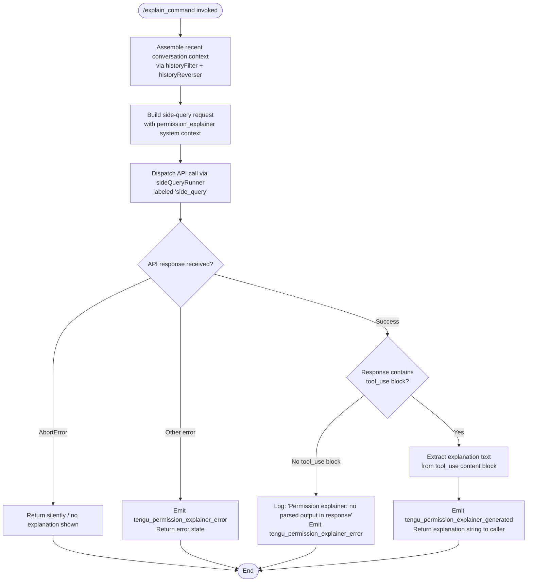

# `/explain_command`

> Analysis basis: CC v2.1.174 bundle.js (AST extraction + Claude interpretation)
> Minimum version: v2.1.174

---

## Overview

`/explain_command` is an internal **tool-type** slash command that generates human-readable explanations for why a particular tool call (most commonly an MCP or built-in tool invocation) requires the permissions it does. It operates as a "permission explainer" by dispatching a focused side-query to the model, parsing the structured response, and returning an explanation string or error state. It is not intended as a direct user-facing conversational command but rather as a supporting mechanism surfaced by the permission/trust UI.

---

## Registration

| Field | Value |
|---|---|
| type | `tool` |
| name | `explain_command` |
| description | `null` (not set in registration object) |
| loc_byte | `14583801` |
| loc_byte_end | `14583837` |
| loc_line | `11383` |
| arbor_handler.name | `vCK` |
| arbor_handler.fqn | `claude-2.1.174::vCK` |
| arbor_handler.kind | `AsyncFunction` |
| arbor_handler.resolution_path | `direct` |
| arbor_handler.n_hits | `1` |

Analysis basis: CC v2.1.174 bundle.js:+14583801

The registration block spans bytes `(14583801, 14583837)`. The handler `vCK` was resolved directly (symbol falls inside the registration byte range). The `null` description indicates this command is not exposed in the user-visible slash-command help list.

---

## Input Branching

The handler has four or more distinct execution paths depending on:
1. Whether conversation history can be successfully assembled
2. Whether the model API call succeeds, is aborted, or errors
3. Whether the model response contains a parseable `tool_use` block
4. Whether the error type is `AbortError` vs a generic API error



---

## Behavioral Spec

### 1. History Assembly (`historyFilter` / `historyReverser`)

The handler calls a history-filtering utility (mapped to `vw5`) to select the most relevant recent messages to include as context for the explanation query. The filter:

- Keeps only `assistant`-role messages (literal `"assistant"` at bundle.js:+14583100).
- Takes up to the last **3** messages (literal `3` at bundle.js:+14583120) from the recent window.
- Reverses the filtered array so the most recent message appears first.
- Truncates each text content block using a surrogate-safe truncation helper (`Eu`) to avoid lone-surrogate characters (surrogate range constants `55296`–`56319` at bundle.js:+198522/198532).
- Prepends an ellipsis sentinel (`"..."` at bundle.js:+14583296) when content is truncated.
- Joins blocks with two-space separator and reassembles into a `text`-typed content item (literal `"text"` at bundle.js:+14583203).

```
function assembleExplainerHistory(allMessages):
    filtered = allMessages
        .filter(msg => msg.role == "assistant")
        .slice(-3)               // keep at most 3 most-recent
    reversed = filtered.reverse()
    return reversed.map(msg =>
        truncateSafe(msg.content, MAX_CHARS)   // surrogate-safe truncation
    )
```

Analysis basis: CC v2.1.174 bundle.js:+14583077 (`vw5` / `historyFilter` call chain)

---

### 2. Side-Query Dispatch (`sideQueryRunner`)

The handler invokes `yp` (the side-query runner), which wraps the full API request pipeline (`GF`). Key behaviors observed in the call graph:

- The call is tagged with the string `"side_query"` (literal at bundle.js:+13773629), which routes it through a separate concurrency lane and prevents it from interfering with the main conversation stream.
- A `"permission_explainer"` system context string (literal at bundle.js:+14583859) is included to instruct the model to produce a structured tool-use output rather than plain text.
- A timestamp snapshot is taken via `Date.now()` before dispatch (bundle.js:+14583520) to measure latency.
- The request is sent with `performance.now()` tracking (bundle.js:+13775044) for wall-clock measurement.

```
async function dispatchExplainerQuery(toolName, toolInput, historyContext):
    startMs = Date.now()
    request = buildSideQueryRequest(
        systemContext = "permission_explainer",
        history       = historyContext,
        toolName      = toolName,
        toolInput     = toolInput
    )
    response = await sideQueryRunner(request, label="side_query")
    elapsedMs = Date.now() - startMs
    return (response, elapsedMs)
```

Analysis basis: CC v2.1.174 bundle.js:+14583706 (`_9` / side-query entry), +13773597 (`yp` / runner)

---

### 3. Response Parsing and Telemetry

After the API call resolves, the handler inspects the response for a `tool_use`-typed content block (literal `"tool_use"` at bundle.js:+14584014):

```
function parseExplainerResponse(response):
    if response is AbortError:
        return { status: "aborted" }

    if response is other error:
        emit telemetry("tengu_permission_explainer_error", { kind: "api_error" })
        return { status: "error", detail: response }

    toolUseBlocks = response.content.filter(block => block.type == "tool_use")
    if toolUseBlocks is empty:
        log("Permission explainer: no parsed output in response")
        emit telemetry("tengu_permission_explainer_error", { kind: "no_output" })
        return { status: "error", detail: "no_parsed_output" }

    explanation = toolUseBlocks[0].input   // structured explanation payload
    emit telemetry("tengu_permission_explainer_generated", { elapsedMs, ... })
    return { status: "ok", explanation }
```

- Literal `"Permission explainer: no parsed output in response"` at bundle.js:+14584631.
- Literal `"AbortError"` at bundle.js:+14584954.
- Literal `"api_error"` at bundle.js:+14585025.
- Literal `"permission_explainer_generate"` at bundle.js:+14584386 (internal sub-event label used inside the generation flow).

Analysis basis: CC v2.1.174 bundle.js:+14584282 (`tengu_permission_explainer_generated`), +14584496 (`tengu_permission_explainer_error`)

---

### 4. Config Access and File I/O Sub-path (`C7H` / configLoader)

The call graph shows `vCK → OWA → C6 → C7H`. This chain loads the current Claude Code configuration. Observed behaviors:

- Guards against premature config access; throws with `"Config accessed before allowed."` (literal at bundle.js:+3316861) if the config subsystem is not yet ready.
- Reads config file synchronously using `q.readFileSync` (bundle.js:+3316917) in UTF-8 encoding (literal `"utf-8"` at bundle.js:+3316944).
- On `ENOENT` (literal at bundle.js:+3317091), falls back gracefully rather than throwing.
- Creates backup copies via `q.copyFileSync` timestamped with `Date.now()` (bundle.js:+3317982) before any config mutation.
- Backup files are stored under a `"backups"` subdirectory (literal at bundle.js:+3316429).
- On directory creation, ignores `EEXIST` errors (literal at bundle.js:+3317706).

Analysis basis: CC v2.1.174 bundle.js:+3316855 (`C7H` entry)

---

### 5. MCP Tool Name Classification (`t9` / mcpToolClassifier)

When the tool being explained has the `"mcp__"` prefix (literal at bundle.js:+2486365), the classifier marks it as type `"mcp_tool"` (literal at bundle.js:+2486384). This classification feeds into the explainer prompt construction so the model receives the correct framing for MCP permissions vs. built-in tool permissions.

```
function classifyToolKind(toolName):
    if Object.hasOwn(toolName context) and toolName.startsWith("mcp__"):
        return "mcp_tool"
    else:
        return lookupBuiltinKind(toolName)
```

Analysis basis: CC v2.1.174 bundle.js:+14584334 (`t9` call), +2486365 (`"mcp__"` literal)

---

## State & Side Effects

| Item | Detail |
|---|---|
| Telemetry: `tengu_permission_explainer_generated` | Emitted on successful parse of explanation from model response (bundle.js:+14584284) |
| Telemetry: `tengu_permission_explainer_error` | Emitted on API error or missing `tool_use` block in response (bundle.js:+14584496) |
| Telemetry: `tengu_api_success` | Emitted by the underlying API layer on any successful model response (bundle.js:+13775208) |
| Telemetry: `tengu_lone_surrogate_sanitized` | Emitted if surrogate-unsafe characters are found and stripped from conversation history before the side query (bundle.js:+13774957) |
| Telemetry: `tengu_config_parse_error` | Emitted if the config file cannot be parsed during the `OWA → C6 → C7H` config-load path (bundle.js:+3317492) |
| Telemetry: `tengu_config_auth_loss_prevented` | Emitted if a config save would have clobbered auth credentials (bundle.js:+3312009) |
| Hook registration | None observed in depth-2 traversal |
| appState changes | None directly; config read is read-only during explain flow |
| Sound | None |
| File I/O | Config file read (`readFileSync`); backup copy written on config mutation (separate code path, not on normal explain invocation) |
| Network | One outbound API request via side-query lane (`"side_query"` label) |

---

## Version History

| Version | Change |
|---|---|
| v2.1.174 | Initial analysis |

---

## Common Mistakes

1. **Expecting user-visible output from `/explain_command` directly**: This command is an internal tool invoked programmatically by the permission/trust UI layer. Typing it in the REPL will not produce a conversational reply; it returns a structured payload consumed by the UI component rendering the permission dialog.

2. **Assuming it explains any arbitrary command**: The explainer is scoped to tool-call permission contexts. It receives `toolName` + `toolInput` as structured arguments, not a free-text question about a command.

3. **Treating a missing explanation as a hard failure**: When the model does not return a `tool_use` block, the command logs a warning and emits a telemetry error, but the caller is expected to degrade gracefully (e.g., show a generic permission description) rather than blocking the user flow.

4. **Ignoring the `"mcp__"` prefix behavior**: MCP tools and built-in tools are classified differently before the prompt is built. Debugging unexpected explanations should include checking whether the tool name is correctly prefixed.

5. **Expecting config writes during explain**: The `C7H` config-loader path is present in the call graph for reads, but backup/write logic is only exercised on config mutation, not during a normal explain invocation.

---

## Appendix — Identifier Mapping

> For bundle debugging only. Identifiers change across versions.

| Identifier | Role |
|---|---|
| `vCK` | Main async handler for `explain_command` (arbor_handler) |
| `OWA` | First-level dispatcher called by `vCK`; routes to config+context loader |
| `C6` | Config+context assembly coordinator |
| `C7H` | Config file loader (reads, validates, backs up config JSON) |
| `r6` | Config path resolver |
| `TV_` | Config validation helper |
| `l6` | JSON.parse wrapper (config deserialization) |
| `gu` | String prefix-strip helper (used on config keys) |
| `V8` | Config value accessor |
| `M19` | Directory walker / backup path enumerator |
| `N` | Logger / structured log emitter |
| `ZV_` | Backup subdirectory path builder |
| `em4` | File-watch manager (watches config for changes) |
| `ZF` | Watch-event handler |
| `R9` | Hook registrar (`qvA.register`) |
| `Vw5` | Role-string serializer for history messages |
| `RH` | JSON.stringify wrapper |
| `vw5` | History filter + truncator (assembles context for side query) |
| `Eu` | Surrogate-safe text truncation utility |
| `_9` | Side-query entry point / command parser |
| `wl` | Sub-query orchestrator |
| `yz` | Model-ID normalizer |
| `KW` | Model-ID string replacer |
| `T9` | Full model-ID resolution (maps aliases to canonical IDs) |
| `tY4` | Model tier classifier |
| `hY` | Query builder |
| `S0` | Provider/auth-context assembler |
| `GA` | Auth credential resolver |
| `T_H` | Plan-tier classifier (maps "max" tier) |
| `rDH` | Plan-tier classifier (maps "team" tier) |
| `ZnH` | Plan-tier classifier (maps "enterprise" tier) |
| `ZX` | First-party auth path handler |
| `Vj6` | URL path sanitizer (replaces special chars) |
| `YD` | Auth header builder (mantle provider) |
| `y7` | Auth header builder (anthropicAws provider) |
| `n_` | Auth header base builder |
| `hL` | Auth header enricher |
| `zT` | Combined auth header builder |
| `yp` | Side-query API runner (main entry for model call) |
| `GF` | Full API request pipeline |
| `_M` | AsyncLocalStorage getStore (session context) |
| `jZ_` | URL path parser/splitter |
| `j9` | Context type classifier ("bg"/"daemon") |
| `El` | Stream context accessor |
| `m18` | Stream-store getStore |
| `k6` | Rate-limiter/retry guard |
| `TD_` | URL encode helper |
| `L6` | String coercion wrapper |
| `wO` | OAuth token refresher coordinator |
| `w58` | Token refresh handler |
| `Cv1` | Boolean coercion helper |
| `Uw` | Auth profile selector |
| `Vj` | Auth profile builder (user_oauth / profile-implicit) |
| `G4` | Header builder entry |
| `IP` | API key injector |
| `DO` | API dispatch (selects auth path, calls C6 config) |
| `B26` | Transport header builder |
| `trH` | Transport layer header constructor |
| `iO` | No-op / identity pass-through |
| `Tu4` | Request timeout handler |
| `nrH` | Timeout metadata recorder |
| `R_` | Request retry classifier |
| `eH8` | Proxy auth helper executor |
| `nNH` | Proxy config loader |
| `M71` | Proxy config validator |
| `N84` | Integer parser with NaN guard |
| `KS` | Credential store accessor |
| `n2` | Credential emitter |
| `yu4` | HTTP request executor (streams response) |
| `e_9` | Request pre-flight validator |
| `HwH` | UUID generator setup |
| `IU1` | Config accessor during request |
| `PZ_` | Config accessor (alternate path) |
| `ku4` | Response header inspector |
| `HA9` | Request log helper |
| `t_9` | Request state tracker |
| `Nu4` | Token/byte budget calculator |
| `hu4` | Stream watchdog / byte-idle timeout manager |
| `tO` | Model capability tester |
| `FD6` | Capability flag builder |
| `XO4` | Feature prefix checker |
| `BD6` | Capability normalizer (lowercases, maps values) |
| `vB` | AWS Bedrock auth helper |
| `Cw` | Proxy configuration resolver |
| `OK` | String coercion (used in proxy/auth) |
| `ec` | URL scheme/port classifier |
| `jcH` | Proxy credential store |
| `D3_` | IP-address aware proxy resolver |
| `Iu4` | Request context initializer |
| `a_9` | Context pre-flight sub-helper |
| `Eu4` | Vertex AI auth handler |
| `a78` | Vertex AI token assembler |
| `A8H` | Vertex AI endpoint prefix checker |
| `C1` | OAuth URL validator (checks approved endpoints) |
| `HjH` | Gateway JWT refresh orchestrator |
| `Ea8` | JWT refresh condition evaluator |
| `sD4` | Gateway refresh HTTP call |
| `nQ6` | Refresh scheduling helper |
| `Ta8` | Timestamp helper (Date.now wrapper) |
| `I26` | Header case-normalizer (lowercases keys) |
| `MJH` | SDK error/warn logger to console |
| `S` | Supervisor / main-process state machine |
| `taK` | File realpath + stat resolver |
| `ZM` | Supervisor state accessor |
| `SH` | Structured error logger |
| `kZ5` | Supervisor health checker |
| `w` | Supervisor write / stdin pipe handler |
| `y` | Warning banner renderer |
| `ea` | Banner data provider |
| `k` | Background worker sweep manager |
| `l` | Scheduled-task clock / grace-period manager |
| `R` | Worker output writer |
| `np6` | Memory free-space reporter |
| `xPK` | Memory threshold calculator |
| `TG6` | Rules/config file reader (used by worker sweep) |
| `c8` | Worker state classifier |
| `d` | Worker lifecycle (retireIfSettled) |
| `Ng8` | Memory guard threshold emitter |
| `w6` | Config-change broadcaster |
| `n` | Key-event preventDefault handler |
| `V` | <!-- TODO: not found in depth-2 traversal; needs --depth 4 --> |
| `HW` | Dispatch-to-DO wrapper |
| `WjH` | WIF credential exchange handler |
| `ZiH` | WIF token exchange (fetch call) |
| `kH` | Feature-flag OK checker |
| `CH` | Feature-flag BAD checker |
| `D04` | WIF response validator |
| `E` | Token manager (getToken, Math.min/max retry) |
| `W` | Token acquisition pipeline |
| `X` | Request multiplexer / timeout setter |
| `ZyH` | Model context enricher (claude-3- prefix checks) |
| `A1` | Message content normalizer |
| `jJ` | Model family string normalizer |
| `bM6` | Content type tagger |
| `q5` | Text replace helper |
| `yI` | Model capability flag setter |
| `G` | Main UI key-event dispatch loop |
| `I` | <!-- TODO: not found in depth-2 traversal; needs --depth 4 --> |
| `Y` | Process exit / abort orchestrator |
| `_X` | Exit code setter |
| `z` | Daemon stop coordinator |
| `T` | Renderer / display update manager |
| `wv6` | Render pipeline step |
| `A56` | CoK (display config) accessor |
| `wc` | Text-widget clipboard helper |
| `XY` | Clipboard write helper |
| `j` | Background worker killer |
| `CIK` | Cursor movement handler set |
| `XM5` | Cursor: setOffset (horizontal) |
| `PM5` | Cursor: column integer parser |
| `WM5` | Cursor: setOffset + setLastFind |
| `GM5` | Cursor: setOffset + oUH |
| `TM5` | Cursor: cPA.has / wc8 guard |
| `DIK` | Delete operator handler set |
| `Tc8` | Text range calculator (min/max) |
| `Gc8` | Text line-end detector |
| `YIK` | Change/yank operator |
| `PIK` | Visual-replace operator |
| `XIK` | Visual-replace executor |
| `TIK` | Case-flip operator |
| `GIK` | Case-flip executor (toUpperCase / toLowerCase) |
| `b` | Conversation history store |
| `SSH` | History file reader |
| `As` | History entry serializer |
| `TtH` | History file writer |
| `o09` | History entry filter (removes stale) |
| `P` | Stream buffer accumulator |
| `udK` | Diff/display renderer for history |
| `S1H` | History sync coordinator |
| `ZIK` | Paste operator |
| `vIK` | Visual-paste executor |
| `OIK` | Join-lines operator |
| `y4` | indexOf helper |
| `sUH` | Slice helper |
| `zIK` | Visual-indent operator |
| `FPA` | Line-start prefix stripper |
| `nPA` | Operator dispatch table (find/replace/textobj etc.) |
| `fM5` | operatorFind: setOffset |
| `LM5` | operatorFind: column parser |
| `MM5` | operatorFind: pPA + SIK |
| `$M5` | operatorG: column parser |
| `OM5` | operatorG: Yc8 |
| `zM5` | operatorG: cPA.has + Dc8 |
| `wM5` | operatorG: setOffset + setLastFind |
| `YM5` | operatorG: oUH + setOffset |
| `DM5` | operatorTextObj: aUH + hIK |
| `jM5` | operatorTextObj: Jc8 |
| `JM5` | operatorTextObj: Wc8 |
| `Pq5` | Slash-command match finder |
| `EJA` | SHA-256 hash generator (WGK.createHash) |
| `U18` | User-agent string builder |
| `WD_` | Subagent header builder |
| `u58` | Request normalizer entry |
| `pCH` | Prompt-cache 1h config handler |
| `ea8` | Cache config evaluator |
| `Hs8` | Cache header setter |
| `LN` | HIPAA-mode config handler |
| `hZ_` | HIPAA config reader |
| `EyH` | HIPAA flag emitter |
| `AD_` | HIPAA allowed-domain checker |
| `oGK` | <!-- TODO: not found in depth-2 traversal; needs --depth 4 --> |
| `q58` | Model request builder (temperature, A1, etc.) |
| `qW` | Message mapper |
| `DWH` | Worker dispatch handler (for background tool calls) |
| `HF` | Worker session creator |
| `G8` | Worker session initializer |
| `d4` | Worker dispatch (Uw + C6) |
| `ShA` | Message array mutator (pop/push for history) |
| `Yc6` | Message type validator |
| `bk` | structuredClone wrapper |
| `jc6` | Alternate message mutator |
| `khA` | Message content replacer |
| `ezH` | Elapsed-time formatter |
| `$1` | Status-bar builder (S56) |
| `S56` | Status-bar renderer |
| `RG6` | Rule/agent-config cache reader |
| `Cj9` | Agent config parser |
| `S6L` | Agent config validator (kj9, mz8 checks) |
| `vsH` | Agent version resolver (LV/S56) |
| `LV` | Version string constant holder |
| `SG6` | Agent config hash verifier |
| `xz8` | SHA-256 hasher for agent configs |
| `kn` | Agent ID parser (builtin / custom / bare prefixes) |
| `k6L` | Agent ID prefix stripper |
| `uz8` | Agent ID fallback resolver |
| `RJ_` | Agent ID slice/index helper |
| `Mm` | Agent ID startsWith matcher |
| `KM6` | <!-- TODO: not found in depth-2 traversal; needs --depth 4 --> |
| `t9` | MCP tool-name classifier (`mcp__` prefix check) |
| `$6` | S56 status accessor |
| `t6` | Feature-flag accessor (c + A6) |
| `A6` | S56 feature-flag constant |
| `TH` | String coercion wrapper (String()) |