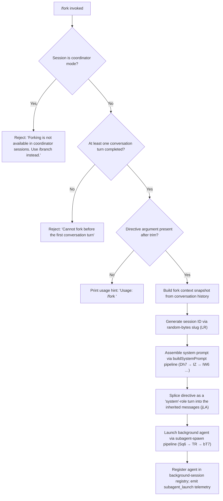

# `/fork`

> Analysis basis: CC v2.1.174 bundle.js (AST extraction + Claude interpretation)
> Minimum version: v2.1.174

---

## Overview

`/fork` spawns a new background agent that inherits the full current conversation history. The user provides a directive string that the spawned agent will act on autonomously, in parallel with the foreground session. The command is unavailable inside coordinator sessions and requires at least one completed conversation turn before it can be invoked.

---

## Registration

| Field | Value |
|---|---|
| type | `local-jsx` |
| name | `fork` |
| description | Spawn a background agent that inherits the full conversation |
| argumentHint | `<directive>` |
| module_id | `q$K` |
| load_inline | `true` |
| loc_byte | `12763057` |
| loc_byte_end | `12763260` |
| loc_line | `9004` |
| arbor_handler.name | `Ri7` |
| arbor_handler.fqn | `claude-2.1.174::Ri7` |
| arbor_handler.kind | `AsyncFunction` |
| arbor_handler.resolution_path | `module_id` |
| arbor_handler.n_hits | `0` |

Analysis basis: CC v2.1.174 bundle.js:+12763057

---

## Input Branching

Four distinct paths exist based on session context and the directive argument, mandating a Mermaid flowchart.



Analysis basis: CC v2.1.174 bundle.js:+12762616 (handler entry), +12762640 (usage string), +12762754 (coordinator guard), +12762827 (no-turn guard)

---

## Behavioral Spec

### 1. Guard checks (handler entry)

```
async function forkCommandHandler(args, appState):
    directive = args.trim()                        # +12762616

    if appState.isCoordinatorSession():
        return renderError(
            "Forking is not available in coordinator sessions. Use /branch instead."
        )                                          # +12762754

    if conversationHasNoTurns(appState):
        return renderError(
            "Cannot fork before the first conversation turn"
        )                                          # +12762827

    if directive is empty:
        return renderUsageHint(
            "Usage: /fork <directive>"
        )                                          # +12762640
```

Analysis basis: CC v2.1.174 bundle.js:+12762616

---

### 2. Directive injection as a system turn

```
function buildForkMessages(existingMessages, directive):
    # Slices the last 50 messages (literals: 50, 49 at +11201347/+11201360)
    # to keep the inherited context within a safe window
    recentSlice = existingMessages.slice(-50)

    # Appends the directive as a role="system" content block
    forkMessage = { role: "system", content: directive }   # +12762680

    return [...recentSlice, forkMessage]
```

Analysis basis: CC v2.1.174 bundle.js:+11201350, +12762680

---

### 3. Session ID generation

```
function generateForkSessionId():
    # Uses randomBytes(8).toString("hex") — constants: 8, "hex" at +7209223/+7209235
    # Replaces any characters matching a pattern (FVA regex) before use
    raw = crypto.randomBytes(8).toString("hex")    # +7209207
    return sanitizeSessionId(raw)
```

Analysis basis: CC v2.1.174 bundle.js:+7209207

---

### 4. System-prompt assembly pipeline

The full system prompt for the forked agent is constructed by `buildSystemPromptForSubagent` (mapped from `Dh7`), which calls the sub-prompt composer `composeSystemPromptParts` (mapped from `IZ`). Key sections assembled:

```
function buildForkSystemPrompt(appState, flags):
    parts = []

    parts += identitySection(flags)           # A95 — task_continuity / fable_identity
    parts += coreInstructions()               # q95, K95
    parts += environmentInfo(appState)        # h95 / N95 — env_info_static / env_info_simple
    parts += languageSettings()               # language section (+13692674)
    parts += outputStyleSection()             # output_style (+13692709)
    parts += backgroundSessionMarker()        # "bg-session" (+13692739)
    parts += scratchpadSection()              # scratchpad (+13692766)
    parts += contextManagementSection()       # context_management / brief (+13692793/+13692832)
    parts += memorySection(appState)          # IW6 — reads CLAUDE.md files, team memory
    parts += toolGuidanceSection()            # P95 — schedule, routines, tools
    parts += reproWorkflowSection()           # reproduce_verify_workflow (+13692886)
    parts += autonomySection()                # autonomy_append (+13693008)
    parts += environmentDetails(appState)     # T95, y95, k95
    parts += pluginContextSection()           # bx8 — plugin tool list

    return joinSections(parts)
```

Analysis basis: CC v2.1.174 bundle.js:+11202711 (getAppState), +13692184 (isBriefEnabled), +13692557 (memory loader IW6)

---

### 5. Background agent launch

```
async function launchForkAgent(directive, messages, systemPrompt, appState):
    sessionId   = generateForkSessionId()
    agentConfig = buildAgentConfig(appState):
        # working_directory  (+10707468)
        # allowed_tools      (+10707523)
        # disallowed_tools   (+10707578)
        # avoid_prompts      (+10707639)
        # permission_mode    (+10707741)
        # bypassPermissions  (+10707772)
        # session            (+10708071)
        # effort, model, max_thinking_tokens, flag_settings

    # Fork-context reference is stored as a ".meta.json" file in the
    # projects directory so the child can resume from it  (+13474068)
    writeForkContextRef(sessionId, messages)

    # Registers the new agent in the local-agent registry
    # Emits telemetry: subagent_launch  (+11200971)
    spawnLocalAgent(sessionId, systemPrompt, messages, agentConfig)
    registerAgent(sessionId, "local_agent", "running")   # +10399747/+10399792
```

Analysis basis: CC v2.1.174 bundle.js:+11200956 (yW), +11201417 (Sq6), +10399747

---

### 6. Forked-agent execution loop

The spawned agent runs via the shared agent execution loop (`bT7`). Notable behaviours:

- **Turn limit**: If the forked agent exceeds its default turn budget, telemetry event `tengu_forked_agent_default_turns_exceeded` fires (Analysis basis: CC v2.1.174 bundle.js:+10706237).
- **Auto-compact**: The agent supports context auto-compaction mid-run (`query_autocompact_start` / `query_autocompact_end`).
- **Stall timeout**: If the agent produces no output for a prolonged period, `tengu_async_agent_stall_timeout` fires and the watchdog terminates the agent (Analysis basis: CC v2.1.174 bundle.js:+7323466).
- **Completion**: On success emits `subagent_complete` (+7323703); on error `subagent_async_errored` (+7326434).
- **Safety classifier**: Handoff output passes through an auto-mode classifier; if unavailable, a caveat is surfaced to the user ("Note: The safety classifier was unavailable…" +7321693).

---

### 7. Watchdog and cleanup

```
function watchForkAgent(agentHandle, timeoutMs = 600000):
    # 600 000 ms (10 min) watchdog literal at +7322575
    # Watchdog polls every 10 s (literal: 10 at +7322570)
    # On stall: logs "watchdog_stall", fires tengu_async_agent_stall_timeout
    # On finish: calls flushTranscript (mz), removes from registry
    # On abort: signals agent abort, emits subagent_end (+7320075)
    startWatchdog(agentHandle, timeoutMs)
```

Analysis basis: CC v2.1.174 bundle.js:+7322570, +7322575, +7323061

---

## State & Side Effects

| Item | Detail |
|---|---|
| Telemetry — launch | `subagent_launch` emitted when fork succeeds (bundle.js:+11200971) |
| Telemetry — completion | `subagent_complete` / `subagent_async_errored` on agent finish (bundle.js:+7323703, +7326434) |
| Telemetry — stall | `tengu_async_agent_stall_timeout` on watchdog expiry (bundle.js:+7323466) |
| Telemetry — turn limit | `tengu_forked_agent_default_turns_exceeded` (bundle.js:+10706237) |
| Telemetry — agent tool | `tengu_agent_tool_completed` / `tengu_agent_tool_terminated` (bundle.js:+7319494, +7325975) |
| Fork-context file | Writes `<sessionId>.meta.json` + `.jsonl` transcript into the `~/.claude/projects/` directory (bundle.js:+13474068, +13457056, +13457212) |
| Background-session registry | New entry added with state `"running"` → `"completed"` / `"failed"` |
| appState changes | New agent handle added to the agent map; removed on teardown |
| Watchdog timer | `setTimeout` with 600 000 ms budget; `clearTimeout` on completion |
| Sound | None detected in depth-2 traversal |

---

## Version History

| Version | Change |
|---|---|
| v2.1.174 | Initial analysis |

---

## Common Mistakes

1. **Invoking `/fork` inside a coordinator session** — The command is explicitly blocked in coordinator mode; use `/branch` instead. The error message is rendered immediately and no agent is spawned.
2. **Omitting the directive** — A bare `/fork` with no argument prints only the usage hint (`Usage: /fork <directive>`) and exits without launching an agent.
3. **Invoking before any conversation turn** — The guard rejects the command if no assistant messages exist yet; at least one round-trip is required so the fork has meaningful context to inherit.
4. **Expecting synchronous output** — The forked agent runs in the background. Results appear asynchronously; the foreground session continues independently.
5. **Assuming unlimited turns** — The forked agent has a default turn budget. Exceeding it triggers `tengu_forked_agent_default_turns_exceeded` and halts the agent.
6. **Relying on absolute paths inside the fork** — Agent threads reset their working directory between bash calls; use only absolute file paths inside forked-agent directives.

---

## Appendix — Identifier Mapping

> For bundle debugging only. Identifiers change across versions.

| Identifier | Role |
|---|---|
| `Ri7` | Main async handler for `/fork` command (arbor_handler) |
| `jLA` | Fork context assembler — builds inherited messages, session ID, and launches subagent |
| `Dh7` | System-prompt builder for the forked agent |
| `IZ` | System-prompt section composer (calls all sub-section builders) |
| `IW6` | Memory section loader (reads CLAUDE.md / team memory files) |
| `Sq6` | Subagent spawn coordinator |
| `TR` | Core agent execution / REPL loop |
| `bT7` | Inner agent query-and-tool-execution loop |
| `S_` | Conversation-state reader (getAppState, findLast) |
| `liq` | Directive text trimmer / validator |
| `LR` | Session-ID slug generator (randomBytes + regex sanitize) |
| `A95` | Identity section builder (task_continuity / fable_identity flags) |
| `q95` | Core instruction section builder |
| `K95` | Confirmation-before-action instruction builder |
| `P95` | Tool-guidance section builder (schedule, routines) |
| `h95` | Environment info builder — static variant |
| `N95` | Environment info builder — worktree / multi-cwd variant |
| `y95` | Background-session section builder |
| `k95` | Scratchpad section builder |
| `R95` | Brief-mode section builder |
| `x95` | Flag-settings section injector |
| `T95` | Base tone/style section builder |
| `M95` | Heron-brook autonomy section builder |
| `$95` | Amber-sextant section builder |
| `G95` | Autonomy-append section builder |
| `Y95` | Context-management / compression notice builder |
| `D95` | Doing-tasks section builder |
| `J95` | Tool-use section builder |
| `W95` | Shale-finch section builder |
| `zCq` | Plugin context / tool-list section assembler |
| `bR8` | Message-slice / context-window preparer for fork |
| `XY7` | Assistant-message filter for fork context |
| `PY7` | Tool-use message filter |
| `JY7` | Tool-result message filter |
| `WY7` | Error-message filter |
| `$Rq` | Message type classifier helper |
| `V86` | Subagent lifecycle manager (watchdog, state machine) |
| `UN6` | Agent-summary and result-routing helper |
| `kT` | Per-turn execution helper inside agent loop |
| `E86` | Agent-completion handler (emits subagent_complete) |
| `MU` | Agent entry point (dispatches bT7) |
| `Kb8` | Agent-registry cleanup on exit |
| `m8` | UUID / randomUUID helper |
| `H08` | Subagent handoff / output-collection helper |
| `q08` | Auto-mode classifier call |
| `uN6` | Classifier result formatter |
| `Ee` | Per-agent state-update helper |
| `mz` | Transcript-flush helper |
| `TQ8` | Active-set add/delete helper for in-flight requests |
| `JmH` | Symlink / worktree directory setup |
| `gjA` | Mkdir helper for subagent workspace |
| `Z$` | Path-join helper for transcript location |
| `cW` | Timestamp / metadata writer |
| `SH` | Structured-log emitter |
| `N` | Normalised log / chalk wrapper |
| `yW` | Subagent config builder (reads appState settings) |
| `CH` | Feature-flag checker |
| `w6` | Render / display update helper |
| `ob` | AbortController / abort-signal factory |
| `YK` | Max-listeners setter |
| `DZ9` | Signal binding helper |
| `_M` | AsyncLocalStorage getStore helper |
| `qm` | AsyncLocalStorage run wrapper |
| `Km` | ND_ store getter |
| `g9` | rG / J5 render helpers |
| `We` | Output-style section assembler |
| `uE` | Model-name resolver / normaliser |
| `T9` | Model-string parser (haiku / sonnet / opus / fable …) |
| `yz` | Model-config object builder |
| `Qd_` | N-wrapper for display |
| `t_8` | ARN / prefix path stripper |
| `tO` | Model-namespace resolver (bedrock / vertex / gateway) |
| `BD6` | Provider-type lower-caser |
| `et9` | Inherited-model validator |
| `tt9` | Output-style normaliser |
| `sB` | SDK / output-style classifier |
| `Ze` | Tool-list / permission-set builder for agent |
| `vc_` | Tool-set filter (allowed / denied sets) |
| `x3` | Tool-name expander |
| `hT` | Tool-capability renderer |
| `YP8` | Span / tracing metadata writer |
| `pd9` | Tracing store getter/setter |
| `HZL` | Span-buffer pusher |
| `eR6` | SubagentStart hook executor |
| `T2` | Hook execution engine |
| `fc9` | Tracing span wrapper for agent spawn |
| `l2H` | CMH enterWith helper |
| `iRH` | Span-type setter |
| `HR` | CMH.active reader |
| `sz7` | Full REPL-context builder (MCP servers, skill listing, plugin frontmatter) |
| `Vg` | Enterprise / project / local MCP config merger |
| `TsH` | MCP config transformer |
| `Zg` | Dynamic MCP entry builder |
| `Of` | dK / w7 option merger |
| `dK` | Safe-mode / option resolver |
| `E$H` | Post-subagent hook executor |
| `jh` | Hook-engine helpers (vF, Ij, MB, Wu) |
| `S0K` | Hook output collector |
| `R0K` | Hook result mapper |
| `_6` | REPL display status updater |
| `bH` | Background display controller |
| `x` | IPC / socket end helper |
| `Hi` | HZ9 history helper |
| `$Z9` | jg.delete / sSH session-file cleanup |
| `sSH` | Session file writer (vD8.writeFile) |
| `GAA` | nb6.delete agent-memory cleanup |
| `cRH` | zP8 / zF_ tracing-store cleanup |
| `Lc9` | Span attribute setter / end helper |
| `nRH` | H.setStatus span-status setter |
| `n2H` | CMH enterWith for end-of-span |
| `kZ9` | Wu_.delete cleanup |
| `ot9` | Agent-config-map updater |
| `aMH` | Per-entry config update with clearTimeout |
| `tT6` | Post-spawn state update helper |
| `EWH` | Error-wrapper / kH helper |
| `C$H` | Completed-state constant holder |
| `Gh` | Completion-state checker |
| `R_` | Result-routing helper |
| `G7` | Agent-registry getter |
| `mkq` | Agent-state updater (A.update, s6H, X86) |
| `Aw7` | Agent-wait helper |
| `f08` | findLastIndex / filter on message array |
| `SWH` | SmH repl-tool-call tracker |
| `SmH` | Tool-call start recorder |
| `FN6` | A.update / T27 turn finaliser |
| `A3H` | BN6 agent-output appender |
| `A08` | A3H / X86 combined output+metrics recorder |
| `X86` | lX / Date.now metrics recorder |
| `$Hq` | Cache-eviction hint emitter |
| `BCH` | Gf filter wrapper |
| `Gf` | H.filter assistant-text extractor |
| `gCH` | cK cache-key resolver |
| `cK` | Recursive cache-lookup with V19 / v19 stores |
| `W7` | HTML entity replacer (replaceAll) |
| `udK` | H.map / xN / Math.max token-count formatter |