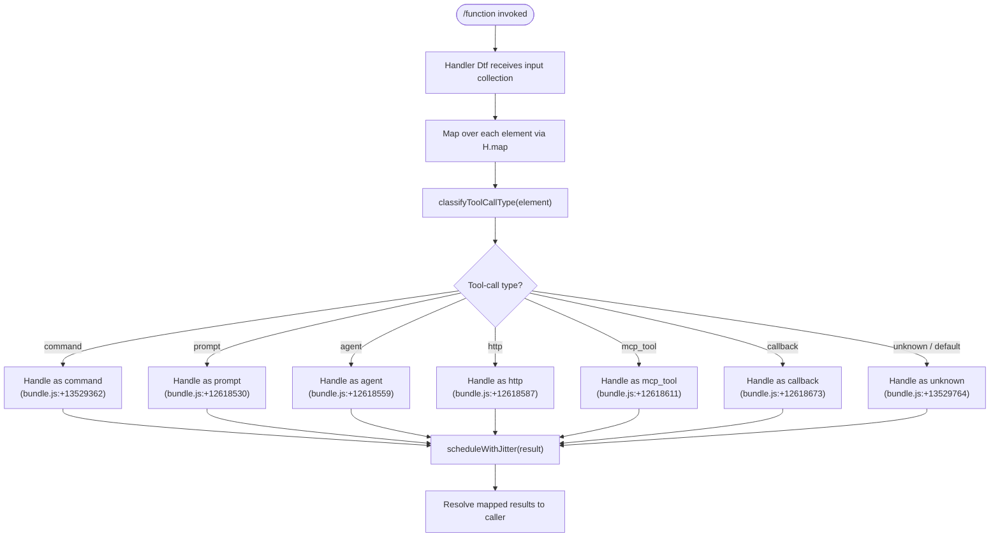

# `/function`

> Analysis basis: CC v2.1.170 bundle.js (AST extraction + Claude interpretation)
> Minimum version: v2.1.170

---

## Overview

The `/function` command is a registered slash command of type `function` in Claude Code CLI. Based on the call graph, its handler maps over an input collection and dispatches to a secondary utility that classifies tool-call types (prompt, agent, http, mcp_tool, callback, command, unknown), with a randomised delay mechanism in the pipeline. The exact user-facing behaviour is a thin wrapper over this classification and dispatch logic.

---

## Registration

| Field | Value |
|---|---|
| type | `function` |
| name | `function` |
| description | `null` |
| loc_byte | `13529650` |
| loc_byte_end | `13529683` |
| loc_line | `10758` |
| arbor_handler.name | `Dtf` |
| arbor_handler.fqn | `claude-2.1.170::Dtf` |
| arbor_handler.kind | `Function` |
| arbor_handler.resolution_path | `direct` |
| arbor_handler.n_hits | `1` |

Analysis basis: CC v2.1.170 bundle.js:+13529650

---

## Input Branching

The handler (resolved as `Dtf`) maps over an input array and routes each element through a tool-type classifier. The classifier distinguishes **six named types plus a fallback**, giving 7 distinct branches. A Mermaid flowchart is therefore used.



---

## Behavioral Spec

### 1. Entry Point — Handler Dispatch (`Dtf`)

The Arbor symbol graph resolves the handler directly within the registration byte range; the `resolution_path` is `direct` with `n_hits: 1`.

```
function handleFunctionCommand(inputCollection):
    results = map(inputCollection, classifyAndProcess)
    return scheduleWithJitter(results)
```

Analysis basis: CC v2.1.170 bundle.js:+13529650

---

### 2. Collection Mapping (`H.map`)

The handler calls `map` on the helper object `H` to iterate over each element in the input collection.

```
function classifyAndProcess(element):
    toolType = classifyToolCallType(element)
    return dispatchByType(toolType, element)
```

Analysis basis: CC v2.1.170 bundle.js:+13529331

---

### 3. Tool-Call Type Classification (`h$H`)

The secondary function `h$H` inspects each element and returns one of the following string literals, which are used as dispatch keys:

| Type String | loc_byte |
|---|---|
| `"command"` | `13529362` |
| `"prompt"` | `12618530` |
| `"agent"` | `12618559` |
| `"http"` | `12618587` |
| `"mcp_tool"` | `12618611` |
| `"callback"` | `12618673` |
| `"unknown"` | `13529764` |

```
function classifyToolCallType(element):
    if element matches command shape  → return "command"
    if element matches prompt shape   → return "prompt"
    if element matches agent shape    → return "agent"
    if element matches http shape     → return "http"
    if element matches mcp_tool shape → return "mcp_tool"
    if element matches callback shape → return "callback"
    else                              → return "unknown"
```

Analysis basis: CC v2.1.170 bundle.js:+13529402

---

### 4. Jitter Scheduling (`H` → `Math.random` + `setTimeout`)

After mapping, results are scheduled with a randomised jitter delay. The jitter is computed from `Math.random()` scaled by the constant `2` (bundle.js:+13939350), with a base offset of `1` (bundle.js:+13939366), then passed to `setTimeout`.

```
function scheduleWithJitter(results):
    jitterMs = Math.floor(Math.random() * 2) + 1   // range: [1, 2] ms
    setTimeout(() => deliver(results), jitterMs)
```

- Jitter lower bound: `1` ms (bundle.js:+13939366)
- Jitter upper bound: `2` ms exclusive ceiling (bundle.js:+13939350)

Analysis basis: CC v2.1.170 bundle.js:+13939352, +13939389

---

## State & Side Effects

| Item | Detail |
|---|---|
| Telemetry | None detected in depth-2 traversal |
| Hook registration | <!-- TODO: not found in depth-2 traversal; needs --depth 4 --> |
| appState changes | <!-- TODO: not found in depth-2 traversal; needs --depth 4 --> |
| Sound | None detected |
| Async scheduling | `setTimeout` with [1, 2) ms jitter applied after mapping (bundle.js:+13939389) |

---

## Version History

| Version | Change |
|---|---|
| v2.1.170 | Initial analysis |

---

## Common Mistakes

1. **Assuming a user-facing description exists** — the `description` field in the registration is `null`. Do not expect a help string to appear in the CLI slash-command picker for `/function`.
2. **Ignoring the `"unknown"` branch** — elements that do not match any of the six known tool-call types are silently classified as `"unknown"` rather than raising an error (bundle.js:+13529764).
3. **Treating the jitter as significant latency** — the `setTimeout` delay is at most 1–2 ms and is a scheduling artefact, not a deliberate rate-limit.
4. **Confusing the command type with the command name** — both `type` and `name` are the string `"function"`. The registration type describes the handler mechanism, not the semantic category of the command.

---

## Appendix — Identifier Mapping

> For bundle debugging only. Identifiers change across versions.

| Identifier | Role |
|---|---|
| `Dtf` | Primary handler function for `/function`; entry point resolved via Arbor direct path (fqn: `claude-2.1.170::Dtf`) |
| `H` | Helper/utility object providing `.map` iteration and the `Math.random`/`setTimeout` jitter scheduling logic |
| `h$H` | Tool-call type classifier; inspects each mapped element and returns one of the seven type-string constants |

---

Note: index built via Arbor fallback; some signals (telemetry, literals) may be missing — see arbor-fallback.js.