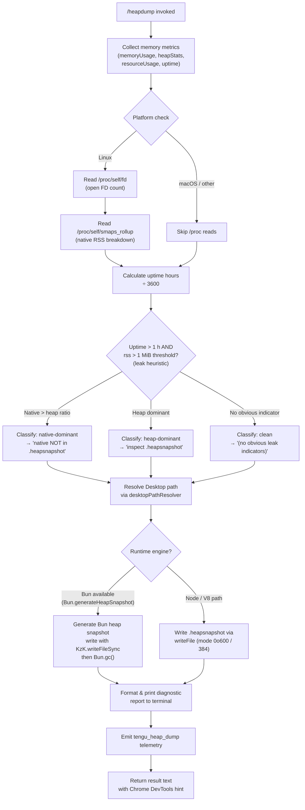

# `/heapdump`

> Analysis basis: CC v2.1.174 bundle.js (AST extraction + Claude interpretation)
> Minimum version: v2.1.174

---

## Overview

`/heapdump` is a hidden, non-interactive diagnostic command that captures a snapshot of the JavaScript heap and writes it to the user's Desktop directory. It also gathers supplementary memory metrics (V8 heap statistics, process resource usage, open file descriptors, and Linux smaps data where available) and prints a formatted diagnostic report to the terminal, including a heuristic classification of whether memory pressure originates in the JS heap or in native memory.

---

## Registration

| Field | Value |
|---|---|
| type | `local` |
| name | `heapdump` |
| description | `Dump the JS heap to ~/Desktop` |
| supportsNonInteractive | `true` |
| isHidden | `true` |
| module_id | `MzK` |
| load_inline | `true` |
| loc_byte | `12865137` |
| loc_byte_end | `12865565` |
| loc_line | `9126` |
| arbor_handler.name | `qo7` |
| arbor_handler.fqn | `claude-2.1.174::qo7` |
| arbor_handler.kind | `AsyncFunction` |
| arbor_handler.resolution_path | `module_id` |
| arbor_handler.n_hits | `0` |

Analysis basis: CC v2.1.174 bundle.js:+12865137

---

## Input Branching

The command takes no user-supplied arguments. All branching is driven by the runtime environment and observed memory metrics. There are more than three distinct branches, so a Mermaid flowchart is used.



Analysis basis: CC v2.1.174 bundle.js:+12862644, +12861793, +12862212, +12863706, +12863763

---

## Behavioral Spec

### Handler Entry Point (`qo7`)

The top-level async handler is `qo7` (resolved via Arbor `module_id` path).

```
async function heapdumpHandler(args):
    diagnosticLines = []
    diagnosticLines.push(
        "Open the .heapsnapshot in Chrome DevTools → Memory → Load to inspect retainers."
    )

    memReport = collectMemoryMetrics()      // calls gzA
    formattedTable = formatMetricColumns(memReport, maxWidth)  // calls Ko7

    diagnosticLines.push(...formattedTable)
    diagnosticLines.push(classificationSuffix(memReport))

    outputText = diagnosticLines.join("\n")
    return { type: "text", content: outputText }
```

Analysis basis: CC v2.1.174 bundle.js:+12864006, +12864038, +12864125, +12864152, +12864162, +12864274

---

### Memory Metrics Collection (`gzA`)

```
async function collectMemoryMetrics():
    // Trigger manual GC pass (hint to runtime)
    triggerGC(kind="manual", flags=0)          // k6 → rG

    metrics = gatherSystemMemorySnapshot()     // fzK
    desktopDir = resolveDesktopPath()          // LQA
    logPath = path.join(desktopDir, ...)       // FzA.join

    snapshotJSON = JSON.stringify(metrics)     // RH
    writeFile(logPath, snapshotJSON, mode=384) // _L6.writeFile  [0o600]

    heapSnapPath = writeHeapSnapshot(desktopDir)  // Ao7

    logToOutput(metrics)                       // SH  (structured logger)
    return metrics
```

File-write mode `384` is octal `0o600` (owner read/write only).
Analysis basis: CC v2.1.174 bundle.js:+12862668, +12862681, +12862727, +12862769, +12862964, +12862976, +12863073, +12863116, +12863132, +12863151, +12863207, +12863256, +12863427, +12863436, +12863514

---

### System Memory Snapshot (`fzK`)

```
function gatherSystemMemorySnapshot():
    snapshot = {}

    snapshot.memoryUsage   = process.memoryUsage()
    snapshot.heapStats     = v8Module.getHeapStatistics()       // LF8
    snapshot.resourceUsage = process.resourceUsage()
    snapshot.uptimeSeconds = process.uptime()
    snapshot.heapSpaces    = v8Module.getHeapSpaceStatistics()  // LF8

    snapshot.activeHandles   = process._getActiveHandles().length
    snapshot.activeRequests  = process._getActiveRequests().length

    // Linux-only: open file descriptor count
    try:
        fdEntries = fs.readdir("/proc/self/fd")                 // _L6
        snapshot.openFDs = fdEntries.length
    catch:
        snapshot.openFDs = null

    // Linux-only: native RSS detail
    try:
        smaps = fs.readFile("/proc/self/smaps_rollup", "utf8")  // _L6
        snapshot.smaps = smaps
    catch:
        snapshot.smaps = null

    // Leak heuristics
    uptimeHours = snapshot.uptimeSeconds / 3600
    rssBytes    = snapshot.memoryUsage.rss
    heapUsed    = snapshot.memoryUsage.heapUsed

    if rssBytes > (uptimeHours * 1048576):   // 1 MiB per hour threshold
        if (rssBytes - heapUsed) > heapUsed:
            snapshot.leakHint = "Native memory > heap - leak may be in native addons (node-pty, sharp, etc.)"
        else:
            snapshot.leakHint = null  // heap dominant path

    // Load bun:jsc module if available (for Bun runtime)
    try:
        jsc = require("bun:jsc")
    catch:
        jsc = null

    // Format numbers with toFixed(500-style rounding)
    formatMB = (bytes) => (bytes / 1048576).toFixed(2)

    return snapshot
```

Key constants:
- Uptime divisor: `3600` (seconds per hour) — bundle.js:+12860701
- RSS-per-hour threshold factor: `1048576` bytes (1 MiB) — bundle.js:+12860706
- Native-addon leak hint string (≤30 chars cited): `"Native memory > heap…"` — bundle.js:+12860939
- Clean indicator string: `"No obvious leak indicators…"` — bundle.js:+12862058
- `/proc/self/fd` path — bundle.js:+12860412
- `/proc/self/smaps_rollup` path — bundle.js:+12860475
- `"bun:jsc"` module identifier — bundle.js:+12860560
- Decimal precision constant: `500` (used in `toFixed` call) — bundle.js:+12861094

Analysis basis: CC v2.1.174 bundle.js:+12860169, +12860193, +12860219, +12860245, +12860270, +12860312, +12860349, +12860400, +12860462, +12860573

---

### Desktop Path Resolution (`LQA`)

```
function resolveDesktopPath():
    homeDir = os.homedir()          // Bq_
    platform = detectPlatform()     // a6

    if platform == "windows":
        // Search /mnt/c/Users for a valid Windows user directory
        // Skip: "Public", "Default", "Default User", "All Users"
        windowsUsers = fs.readdir("/mnt/c/Users")
        validUser = windowsUsers.find(u => !SKIP_NAMES.includes(u))
        if validUser:
            return path.join("/mnt/c/Users", validUser, "Desktop")

    // macOS / Linux default
    return path.join(homeDir, "Desktop")
```

Constants: `"windows"` — bundle.js:+1092987; `"Desktop"` — bundle.js:+1092969; `"/mnt/c/Users"` — bundle.js:+1093191; skip list entries `"Public"`, `"Default"`, `"Default User"`, `"All Users"` — bundle.js:+1093235–1093299.

Analysis basis: CC v2.1.174 bundle.js:+12862964, +1092916, +1092923, +1092959

---

### Heap Snapshot Write (`Ao7`)

```
async function writeHeapSnapshot(desktopDir):
    if isBunRuntime():
        snapshot = Bun.generateHeapSnapshot("v8", "arraybuffer")
        KzK.writeFileSync(path.join(desktopDir, filename), snapshot)
        Bun.gc(/* force */ true)
    else:
        // V8 / Node path
        snapshotStream = v8.writeHeapSnapshot(path.join(desktopDir, filename))
        // stream written via _L6.writeFile

    return snapshotFilePath
```

Constants: `"v8"` format — bundle.js:+12863731; `"arraybuffer"` encoding — bundle.js:+12863736; `"auto-1.5GB"` label seen in registration context — bundle.js:+12863324.

Analysis basis: CC v2.1.174 bundle.js:+12863686, +12863706, +12863763

---

### Diagnostic Report Formatter (`Ko7`)

```
function formatDiagnosticColumns(metrics, maxColumnWidth):
    // Compute max label width across all metric rows
    labelWidth = Math.max(...metrics.map(r => r.label.length))

    // Right-pad each label, format value column
    rows = metrics.map(r => r.label.padEnd(labelWidth) + "  " + r.value)

    // Append classification suffix
    if metrics.nativeDominant:
        rows.push("— most memory is native (NOT in the .heapsnapshot)")
    elif metrics.heapDominant:
        rows.push("— most memory is JS heap (inspect the .heapsnapshot)")
    else:
        rows.push("  (no obvious leak indicators)")

    // Threshold for "large" heap warning: 1 073 741 824 bytes (1 GiB)
    if metrics.heapUsed > 1073741824:
        rows.push(AL6(metrics))   // additional large-heap advisory

    return rows
```

Constants:
- Column padding separator: `"  "` (two spaces) — bundle.js:+16883203
- Native-dominant suffix: `"— most memory is native…"` — bundle.js:+12864509
- Heap-dominant suffix: `"— most memory is JS heap…"` — bundle.js:+12864449
- Clean suffix: `"  (no obvious leak indicators)"` — bundle.js:+12864646
- Large-heap threshold: `1073741824` bytes (1 GiB) — bundle.js:+12865055
- Column count hint: `8` — bundle.js:+12864781

Analysis basis: CC v2.1.174 bundle.js:+12864381, +12864693

---

### Platform Detection (`a6`)

```
function detectPlatform():
    if process.platform == "darwin":
        return "macos"
    elif process.platform == "win32" or isWSL():
        return "windows"
    else:
        return process.platform
```

Constants: `"macos"` — bundle.js:+12861793; `"darwin"` — bundle.js:+12862212.
Analysis basis: CC v2.1.174 bundle.js:+12861786

---

## State & Side Effects

| Item | Detail |
|---|---|
| Telemetry | `tengu_heap_dump` emitted after snapshot write (bundle.js:+12863258) |
| Telemetry (indirect) | `tengu_daemon_control`, `tengu_scheduled_task_missed`, `tengu_bg_dispatch_sigkill_escalate`, `tengu_bg_dispatch_low_mem`, `tengu_bg_spare_enable`, `tengu_bg_spare_claim`, `tengu_bg_spare_claim_fail` — reached via deep call graph into daemon/scheduler subsystems |
| File writes | `<Desktop>/<timestamp>.heapsnapshot` (mode `0o600`) — JS heap snapshot |
| File writes | `<Desktop>/<timestamp>.json` (mode `0o600`) — supplementary metrics JSON |
| GC side effect | Manual GC hint issued before metrics collection; `Bun.gc()` called after Bun snapshot generation |
| Process reads | `/proc/self/fd` directory listing (Linux only) |
| Process reads | `/proc/self/smaps_rollup` (Linux only, `utf8`) |
| appState changes | None observed at depth-2 traversal |
| Sound | None observed |
| Hook registration | None observed directly; `R9 → qvA.register` reached at depth-2 via logging subsystem |
| Output | Formatted multi-line text written to terminal including Chrome DevTools usage hint |

---

## Version History

| Version | Change |
|---|---|
| v2.1.174 | Initial analysis |

---

## Common Mistakes

1. **Expecting a file in the current directory.** The snapshot is always written to `~/Desktop` (or the Windows Desktop for WSL users). If no Desktop directory exists the write will fail silently or throw — create the directory first.
2. **Running in a headless / server environment.** `~/Desktop` typically does not exist on Linux servers. The command will fail to resolve a valid output path; use a desktop OS or pre-create the target directory.
3. **Interpreting the "native dominant" warning as definitive.** The heuristic compares RSS against heap-used; native addons such as `node-pty` or `sharp` legitimately occupy native memory without a JS heap leak. The `.heapsnapshot` file is still the primary artifact for detailed analysis.
4. **Opening the `.heapsnapshot` in a text editor.** The file is binary/JSON optimised for Chrome DevTools Memory panel (`Load` button). Text editors will show raw JSON but will not resolve retainer chains.
5. **Assuming the command is interactive.** `isHidden: true` and `supportsNonInteractive: true` indicate this is a developer/debug tool, not a user-facing feature. It does not appear in `/help` output.
6. **Triggering it during an active agent run.** The manual GC hint and snapshot write add non-trivial latency and may perturb timing-sensitive operations.

---

## Appendix — Identifier Mapping

> For bundle debugging only. Identifiers change across versions.

| Identifier | Role |
|---|---|
| `qo7` | Top-level async handler for `/heapdump` (Arbor-resolved entry point) |
| `gzA` | Memory metrics collection and file-write orchestrator |
| `fzK` | System memory snapshot gatherer (process/V8/proc APIs) |
| `k6` | GC trigger helper |
| `rG` | Low-level GC invocation |
| `LQA` | Desktop path resolver (cross-platform) |
| `Ao7` | Heap snapshot writer (Bun and V8 paths) |
| `Ko7` | Diagnostic report column formatter |
| `AL6` | Large-heap advisory formatter |
| `RH` | JSON serialisation helper |
| `SH` | Structured output / log emitter |
| `DA` | Error/string coercion utility |
| `ZM` | <!-- TODO: not found in depth-2 traversal; needs --depth 4 --> |
| `c` | <!-- TODO: not found in depth-2 traversal; needs --depth 4 --> |
| `L6` | String conversion wrapper |
| `_q` | Log-level/traffic-mode resolver |
| `$gA` | Log formatting helper |
| `dbf` | Log-queue shift/push helper |
| `K` | Column-width pad formatter |
| `L` | Stream close helper |
| `r6` | Platform/OS detection utility |
| `C36` | Directory creation helper |
| `ghA` | Path join helper |
| `Qt8` | File rotate/rename utility |
| `N1f` | Append-file writer with rotation |
| `R9` | Hook/listener registration helper |
| `N` | Logging output function |
| `Z1f` | Log record builder |
| `fvA` | Log level resolver |
| `RH` | JSON.stringify wrapper |
| `df` | Log line formatter |
| `UhA` | Log prefix builder |
| `VgH` | Terminal write helper |
| `hhA` | Raw stream write helper |
| `h1f` | File-based log writer |
| `oFH` | Buffered write / setImmediate flush |
| `sfH` | Log sink coordinator |
| `CIK` | Vim-mode find/replace handler |
| `DIK` | Vim-mode yank/visualOp handler |
| `PIK` | Vim-mode visualReplace handler |
| `TIK` | Vim-mode visualCase handler |
| `ZIK` | Vim-mode visualPaste handler |
| `OIK` | Vim-mode join/indent handler |
| `zIK` | Vim-mode visualIndent handler |
| `nPA` | Vim operator dispatcher |
| `G` | Top-level UI/input event router |
| `D` | Background daemon session manager |
| `H` | History search / random delay helper |
| `P` | Buffered stream reader |
| `S` | Command executor (supervisor) |
| `X` | Timer/module resolver |
| `M` | Module cache helper |
| `q` | Timer/request scheduler |
| `b` | Register/clipboard manager |
| `f` | Pending-task tracker |
| `j` | Process kill helper |
| `wc` | XY coordinate helper |
| `I` | <!-- TODO: not found in depth-2 traversal; needs --depth 4 --> |
| `Y` | Forced-shutdown / process.exit wrapper |
| `T` | Key event preventDefault dispatcher |
| `z` | Daemon stop / key-down handler |

---

*Note: index built via Arbor fallback; some signals (telemetry, literals) may be missing — see arbor-fallback.js.*