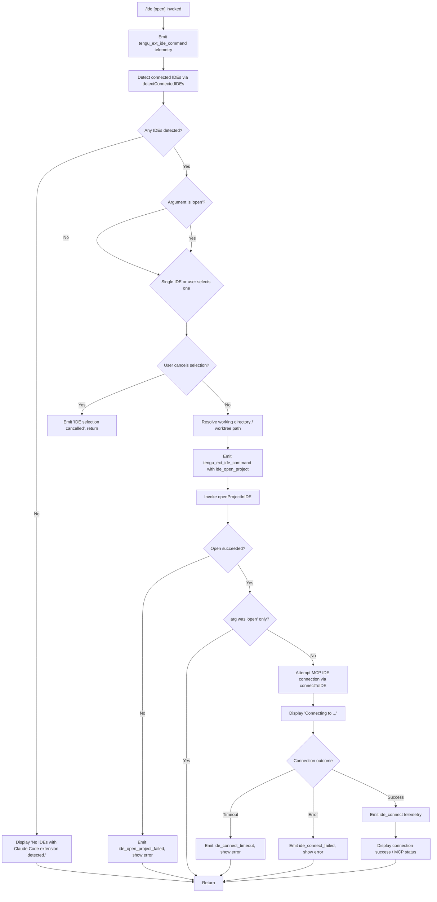

# `/ide`

> Analysis basis: CC v2.1.174 bundle.js (AST extraction + Claude interpretation)
> Minimum version: v2.1.174

---

## Overview

The `/ide` command manages IDE integrations for Claude Code, allowing users to detect connected IDE instances with the Claude Code extension installed, optionally open the current project in a selected IDE, and establish or confirm an active MCP-over-WebSocket/SSE connection between Claude Code and the IDE. It serves as both a status display and an interactive IDE selection/connection entry point, with telemetry tracking each stage of the detection-and-connection lifecycle.

---

## Registration

| Field | Value |
|---|---|
| type | `local-jsx` |
| name | `ide` |
| description | `Manage IDE integrations and show status` |
| argumentHint | `[open]` |
| module_id | `$6K` |
| load_inline | `true` |
| loc_byte | `11826448` |
| loc_byte_end | `11826604` |
| loc_line | `7598` |
| arbor_handler.name | `Wx7` |
| arbor_handler.fqn | `claude-2.1.174::Wx7` |
| arbor_handler.kind | `AsyncFunction` |
| arbor_handler.resolution_path | `module_id` |
| arbor_handler.n_hits | `0` |

Analysis basis: CC v2.1.174 bundle.js:+11826448

---

## Input Branching

The command has 4+ distinct paths depending on IDE detection results, user argument, and connection outcome, so a Mermaid flowchart is used.



Analysis basis: CC v2.1.174 bundle.js:+11822564 (handler entry `Wx7`), +11822672 (`"open"` literal), +11822781 (no-IDE message), +11822919 (no-selection message), +11823117 (`ide_open_project`), +11824667 (`ide_connect`), +11824861 (`ide_connect_timeout`)

---

## Behavioral Spec

### 1. Handler Entry — `ideCommandHandler` (`Wx7`)

```
async function ideCommandHandler(args, context):
    emit telemetry("tengu_ext_ide_command")           // +11822566
    theme = getTheme(context)                          // tM
    appState = getAppState(context)                    // b6
    ideList = await detectConnectedIDEs()              // LP8

    if ideList is empty:
        display("No IDEs with Claude Code extension detected.")  // +11822781
        return

    argument = args.trim().toLowerCase()               // wd9 / MP8

    if argument == "open" or no argument:
        selectedIDE = await promptUserToSelectIDE(ideList, context)  // interactive JSX (M6K)

    if selectedIDE is null or cancelled:
        display("No IDE selected.")                    // +11822919 / "IDE selection cancelled" +11825830
        return

    workingDirectory = resolveWorktreeOrProjectPath(context)  // fp8.basename, path ops
    emit telemetry("ide_open_project", {type: "worktree"|"project"})  // +11823117–11823162

    openResult = await openProjectInIDE(selectedIDE, workingDirectory)  // kH / CH call graph
    if openResult fails:
        emit telemetry("ide_open_project_failed")     // +11823224
        display error
        return

    if argument == "open":
        return  // done after opening

    // Proceed to connect
    display("Connecting to <selectedIDE name>")       // +11825697
    connectionResult = await connectToIDE(selectedIDE)  // M6K / MCP connection

    switch connectionResult.status:
        case "timeout":
            emit telemetry("ide_connect_timeout")     // +11824861
            display("Error connecting to IDE.")       // +11824979
        case "error":
            emit telemetry("ide_connect_failed")      // +11824754
            display error
        case "success":
            emit telemetry("ide_connect")             // +11824667
            display MCP status / connection info
```

Analysis basis: CC v2.1.174 bundle.js:+11822564

---

### 2. IDE Detection — `detectConnectedIDEs` (`LP8`)

```
async function detectConnectedIDEs():
    rawPorts = parseInt(...)                           // +6581976
    portList = getActivePorts(rawPorts)                // j_
    ideEntries = await scanIDECandidates(portList)     // fP8

    for each entry in ideEntries:
        metadata = resolveIDEMetadata(entry)           // bEL / ED_
        if valid:
            append to results

    // Path normalisation
    for each result:
        resolvedPath = path.resolve(result.path)       // dN.resolve +6582394
        if on Windows: normalise drive letter case     // W.toUpperCase +6582622 / K.replace +6582594
        if starts with known prefix: adjust            // K.startsWith +6582435

    // Kill stale lock processes if needed             // Md9 / process.kill +6578151
    return results
```

Analysis basis: CC v2.1.174 bundle.js:+6581976

---

### 3. IDE Candidate Scanning — `scanIDECandidates` (`fP8`)

```
async function scanIDECandidates(portList):
    results = await Promise.all(portList.map(scanSinglePort))  // +6578549
    for each port:
        entries = await readIDELockFiles(port)        // uEL
        lock file paths searched include home dir,
          "ide" subdirectory, WSL /mnt/c/Users paths  // +6579769, +6579846, +6579905, +6580067
        filter out system accounts: "Public", "Default",
          "Default User", "All Users"                 // +6580161–+6580225
        stat and realpath each candidate              // Kd9.realpath +6580522
        skip duplicates via seen-set                  // _.has / _.add +6580566–+6580584
    return flattened list
```

Analysis basis: CC v2.1.174 bundle.js:+6578530

---

### 4. IDE Name Normalisation — `normaliseIDEName` (`wd9` / `MP8`)

Supported IDE identifiers (detected via case-insensitive substring matching):

| Keyword(s) | Mapped IDE |
|---|---|
| `windsurf` | Windsurf |
| `devin` | Devin Desktop (`"Devin Desktop"` literal +6585121) |
| `cursor` | Cursor |
| `insiders` | VS Code Insiders |
| `vscode`, `vs code`, `visual studio code` | VS Code |
| `vscodium`, `code - oss`, `codium` | VSCodium |
| `jetbrains` | JetBrains IDE |
| `appcode` | AppCode |

On Linux, process enumeration via `ps aux | grep -E "code|cursor|windsurf|..."` is used as a fallback detection path (`+6586701`). The `.cmd` extension suffix is stripped on Windows (`+6585384`). The display name is formatted via `dN.basename` on the executable path (`+6585306`, `+6587653`).

Analysis basis: CC v2.1.174 bundle.js:+6584771

---

### 5. IDE Extension Installation Hint (`eB_` / `dEL`)

```
function buildExtensionInstallHint(ideInfo, platform):
    // platform: "linux" (+6586675), or OS-specific
    entries = Object.entries(ideInfo)                  // +6586105
    filtered = entries where extension not yet installed
    instructions built per IDE family
    if Linux:
        also enumerate running IDEs via ps-aux grep   // +6586701
    display "restart your IDE" message when needed    // +11823782
    return hint text
```

The command calls `_.onInstallIDEExtension` callback when an extension install action is triggered (`+11823691`).

Analysis basis: CC v2.1.174 bundle.js:+6587227

---

### 6. Interactive IDE Selection Component (`ideSelectionComponent` — `M6K`)

This is a React/JSX component (type `local-jsx`) that renders the IDE picker UI:

```
function ideSelectionComponent(props):
    [status, setStatus] = useState("pending")         // DM.useState +11824450
    appState = useAppState()                          // j6 +11824470
    ref = useRef()                                    // DM.useRef +11824528
    theme = useTheme()                                // XA +11824521
    mcpState = useMCPState()                          // q7 +11824823

    useEffect(() => {
        // On mount: attempt connection
        // On unmount: clean up
    })                                                // DM.useEffect +11824542

    // Filter to IDE-type MCP servers (prefix "mcp__ide__") // +11825257
    ideServers = mcpState.filter(s => s.name.startsWith("mcp__ide__"))  // +11825464

    // Render status rows per IDE:
    //   - connected / pending / error / disconnected
    // Emit ide_connect / ide_connect_failed / ide_disconnect telemetry on state transitions
    //   ide_disconnect: +11825360
    //   connecting prefix shown at +11825697

    // Display truncated list: up to 100 entries, "…" ellipsis suffix
    //   limit 100 (+11825906), offset 0 (+11825925)
    //   separator ", " (+11826204), ellipsis ", …" (+11826218)
    //   slice step 3 (+11825979)
```

Analysis basis: CC v2.1.174 bundle.js:+11824450

---

### 7. IDE Detection Telemetry Events

| Stage | Event | loc_byte |
|---|---|---|
| Command invoked | `tengu_ext_ide_command` | +11822566 |
| IDE detect success | `ide_detect` | +6583331 |
| IDE detect failed | `ide_detect_failed` | +6583395 |
| Open project | `ide_open_project` | +11823117 |
| Open project failed | `ide_open_project_failed` | +11823224 |
| Connect success | `ide_connect` | +11824667 |
| Connect failed | `ide_connect_failed` | +11824754 |
| Connect timeout | `ide_connect_timeout` | +11824861 |
| Disconnect | `ide_disconnect` | +11825360 |

Analysis basis: CC v2.1.174 bundle.js (see loc_byte column above)

---

## State & Side Effects

| Item | Detail |
|---|---|
| Telemetry | `tengu_ext_ide_command` (+11822566), `tengu_feature_ok` (+1016891), `tengu_feature_bad` (+1016958), `tengu_feature_sad` (+1017039), `tengu_daemon_control` (+16895373), `tengu_daemon_config_reload` (+16873690), `tengu_bg_attach` (+16850057), `tengu_bg_spare_claim` (+16859619), `tengu_bg_spare_enable` (+16859491), `tengu_bg_sendclaim_failed` (+16836979), `tengu_scheduled_task_fire` (+16355211), `tengu_scheduled_task_missed` (+16354460), `tengu_scheduled_task_expired` (+16355554), `tengu_daemon_idle_exit` (+16878943), `tengu_mcp_skills` (+6623670), plus many `tengu_bg_*` daemon-lifecycle events |
| MCP server registration | Registers IDE MCP servers under the `mcp__ide__` prefix; transport types `sse-ide` (+6745282) and `ws-ide` (+6745318) are handled specially alongside `stdio` and `sse` |
| appState changes | IDE connection state (pending → connected/error) stored in appState via `j6` / `XA`; MCP server list updated via `NGA` / `HCH` / `Mi8` |
| File I/O | Reads/writes IDE lock files under `~/.claude/` and platform-specific IDE config paths; writes socket/auth files for daemon at byte offsets around `13807496` |
| Process signals | May call `process.kill` to remove stale lock-file processes (`Md9`, +6578151) |
| Extension install hook | Calls `_.onInstallIDEExtension` (+11823691) when user action triggers extension installation |
| Sound | None detected |
| Daemon interaction | Full background daemon protocol (spawn, claim, attach, IPC over Unix socket) is traversed by the call graph but is infrastructure shared with `/bg`, not specific to `/ide` |

---

## Version History

| Version | Change |
|---|---|
| v2.1.174 | Initial analysis |

---

## Common Mistakes

1. **Invoking `/ide` when no IDE has the extension installed** — The command will immediately exit with "No IDEs with Claude Code extension detected." Install the Claude Code extension in your IDE first, then retry.
2. **Passing an unrecognised argument** — Only `open` is a documented argument (per `argumentHint: "[open]"`). Any other string is treated as a no-argument invocation after normalisation.
3. **Cancelling the IDE selection prompt** — If the interactive picker is dismissed, the command outputs "IDE selection cancelled" and performs no connection. Re-run `/ide` to try again.
4. **Expecting instant reconnection after IDE restart** — The daemon caches recent connection failures for approximately 15 minutes before retrying automatically (literal: `"Skipping connection (recent failure cached; retries automatically in 15 min, or edit the plugin config to retry now)"` at +6746038). Edit the plugin configuration to force an immediate retry.
5. **Using `/ide open` when already connected** — The `open` sub-command opens the project directory in the IDE but intentionally skips the MCP connection step. Omit `open` if you want to establish or verify the MCP link.
6. **WSL path issues** — Detection filters out Windows system accounts (`Public`, `Default`, `Default User`, `All Users`) under `/mnt/c/Users`. Ensure your Windows user profile is not one of these filtered paths.

---

## Appendix — Identifier Mapping

> For bundle debugging only. Identifiers change across versions.

| Identifier | Role |
|---|---|
| `Wx7` | Main async handler for `/ide` command (`ideCommandHandler`) |
| `o5A` | IDE list display / status render helper |
| `b6` | App-state getter (reads current application state) |
| `eo6` | App-state store accessor |
| `ad` | App-state subscriber |
| `j_` | Active port list resolver |
| `rG` | Generic async utility / runner |
| `LP8` | `detectConnectedIDEs` — top-level IDE detection orchestrator |
| `fP8` | `scanIDECandidates` — scans individual port/lock-file entries |
| `uEL` | `readIDELockFiles` — reads lock files from candidate directories |
| `bEL` | IDE metadata resolver (wraps `ED_`) |
| `ED_` | IDE process/port metadata extractor |
| `p_` | Shell command executor (used for `ps aux` fallback) |
| `L6` | String coercion utility |
| `qw9` | Regex match helper (for process name parsing) |
| `W` | MCP server configuration normaliser / connection manager |
| `A56` | MCP transport-type registry helper |
| `CoK` | Object-keys-based config enumerator |
| `DA` | Error/string formatter |
| `Md9` | Stale lock-file process killer (`process.kill` wrapper) |
| `M` | MCP manager top-level (orchestrates `HCH` + `Mi8`) |
| `HCH` | MCP connection handler — processes per-server connection results |
| `Wi` | Per-server connection attempt executor |
| `tV` | Server transport factory |
| `c8` | Config helper |
| `wv6` | MCP version/capability checker |
| `zn9` | Connection attempt scheduler |
| `zJ8` | Connection error formatter |
| `MJ8` | Connection success handler |
| `Y8` | MCP debug logger |
| `nX8` | OAuth/SSE-IDE connection handler |
| `iX8` | OAuth callback processor |
| `Wn9` | Connection retry scheduler |
| `uB_` | Connection state updater |
| `lN` | MCP skill/capabilities loader (`w6`) |
| `ZB_` | MCP server filter (checks server inclusion) |
| `y` | Warning/notification emitter |
| `zL` | MCP error logger |
| `jn9` | Connection timeout factory |
| `f66` | Port integer parser (first pass) |
| `nP8` | Port integer parser (second pass) |
| `Mi8` | `applyConnectionResult` — applies new connection state to MCP manager |
| `eRH` | Connection result metadata helper |
| `_G` | MCP server cleanup orchestrator |
| `NGA` | MCP server state reconciler (diff old vs new server list) |
| `RX8` | Server capability set checker |
| `q66` | Server metadata builder (`m2H` wrapper) |
| `Yd9` | IDE display name formatter (replace/normalise) |
| `HG` | IDE name → canonical string mapper |
| `Y9` | String slice-by-separator utility |
| `t6` | Feature flag / telemetry gate |
| `wd9` | Argument lowercase normaliser (checks `"windsurf"`, `"devin"`, etc.) |
| `MP8` | IDE executable basename extractor |
| `u8` | App theme / render context accessor |
| `eB_` | Extension install hint builder |
| `dEL` | Per-IDE extension instruction assembler |
| `n2` | Notification / hint display component |
| `YNH` | Shell execution wrapper (runs `sh -c` commands) |
| `Oe` | Interactive list/select UI component |
| `Yx7` | IDE status row renderer |
| `M6K` | `ideSelectionComponent` — interactive JSX IDE picker and status display |
| `j6` | `useAppState` hook |
| `qy_` | AppState context reader |
| `XA` | `useTheme` hook |
| `q7` | `useMCPState` hook |
| `D` | Background session / daemon session manager |
| `b` | Background session worker (spawns, connects, manages PTY) |
| `SSH` | Lock-file reader utility |
| `SH` | Log/error reporter for session events |
| `PTA` | Daemon claim sender (socket auth handshake) |
| `xJA` | Daemon socket file writer |
| `VTA` | Background session lifecycle manager |
| `Tq` | Job state file reader/writer |
| `YZ5` | Daemon protocol message dispatcher |
| `l` | Scheduled task executor |
| `Q` | Background PTY socket handler |
| `F` | Idle-exit timer manager |
| `S` | Session file watcher |
| `taK` | File realpath/stat wrapper |
| `kZ5` | Session mtime change handler |