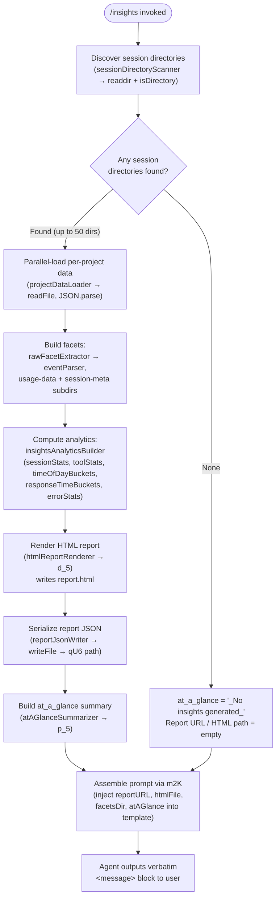

# `/insights`

> Analysis basis: CC v2.1.174 bundle.js (AST extraction + Claude interpretation)
> Minimum version: v2.1.174

---

## Overview

`/insights` generates a shareable HTML usage-analytics report by scanning the user's local Claude Code session data, assembling structured facets across all projects, and then instructing the agent to present a ready-made confirmation message along with the path to the report. The command is fully local — no data leaves the machine during report generation — and its output is an HTML file the user can open in a browser.

---

## Registration

| Field | Value |
|---|---|
| type | `prompt` |
| name | `insights` |
| description | Generate a report analyzing your Claude Code sessions |
| loc_byte | `13439334` |
| loc_byte_end | `13440638` |
| loc_line | `10672` |
| handler_method | `getPromptForCommand` |
| handler_method_start | `13439508` |
| handler_method_end | `13440637` |
| prompt_body.length | `513` characters |
| prompt_body.trace | `call→m2K(...) (1 literals)` |
| arbor_handler.name | `getPromptForCommand` |
| arbor_handler.kind | `Method` |
| arbor_handler.fqn | `claude-2.1.174::getPromptForCommand` |
| arbor_handler.resolution_path | `direct` |
| arbor_handler.n_hits | `1` |

Analysis basis: CC v2.1.174 bundle.js:+13439334

---

## Input Branching

The command's invocation path has more than three distinct branches (session-directory discovery → per-project data load → facet computation → report render → prompt assembly), so a Mermaid flowchart is used.



Analysis basis: CC v2.1.174 bundle.js:+13439514 (handler entry), +13439607 (insights-data gatherer), +13426271 (session-directory scanner)

---

## Behavioral Spec

### 1. Session Directory Discovery

`getPromptForCommand` immediately calls the insights-data gatherer (`u2K`) which in turn invokes the session-directory scanner (`l_5`).

```
function sessionDirectoryScanner(baseDir):
    entries = fs.readdir(baseDir)
    dirs = entries.filter(e => e.isDirectory())
    // yields paths such as <base>/projects/<projectHash>/
    dirs.sort()                        // deterministic ordering
    yield dirs via setImmediate        // async continuation
    return sorted directory list
```

- The base directory is resolved by joining the home/config root with the `"projects"` segment (literal `"projects"`, bundle.js:+5097061).
- A `setImmediate` yield (bundle.js:+13426178) prevents blocking the event loop on large installations.
- Results are sorted (bundle.js:+13426202) before further processing.

Analysis basis: CC v2.1.174 bundle.js:+13426271

### 2. Per-Project JSONL File Discovery

For each project directory the file-listing helper (`pL6`) is invoked:

```
function projectFileDiscovery(projectDir):
    entries = fs.readdir(projectDir)
    files = entries.filter(e => e.isFile() && e.name.endsWith(".jsonl"))
    // ".jsonl" literal at bundle.js:+13515410
    for each file:
        stat = fs.stat(fullPath)
        record { name: basename, path: fullPath, mtime, size }
    return file records
```

- Only `.jsonl` files are considered (bundle.js:+13515410).
- File metadata (`stat`) is collected for each matching file (bundle.js:+13515613).

Analysis basis: CC v2.1.174 bundle.js:+13515304

### 3. Reading Session and Usage Data

The project-data loader (`b_5`) reads each JSONL file:

```
function projectDataLoader(filePath):
    raw = fs.readFile(filePath, { encoding: "utf-8" })
    // "utf-8" literal at bundle.js:+13371354
    parsed = safeJsonParse(raw)        // via l6 → JSON.parse
    return parsed records
```

- Two distinct subdirectory namespaces are accessed: `"usage-data"` (bundle.js:+13365223) and `"session-meta"` (bundle.js:+13365319).
- The path helpers `qU6` and `lg8` resolve these to absolute paths under the facets root (bundle.js:+13365210, +13365259).
- `"facets"` is the top-level analytics subdirectory name (bundle.js:+13365273).

Analysis basis: CC v2.1.174 bundle.js:+13371287

### 4. Raw Facet Extraction

The raw-facet extractor (`eDA`) processes parsed records into structured analytics events:

```
function rawFacetExtractor(records):
    for each record:
        categorize by type: "tool_use", "assistant", "system", "attachment"
        // type literals at bundle.js:+13365802, +13456327, +13456372, +13456349
        extract: timestamps, tool names, exit codes, error messages
        classify tool outcomes:
            "Command Failed" (bundle.js:+13366934)
            "User Rejected"  (bundle.js:+13367012)
            "Edit Failed"    (bundle.js:+13367106)
            "File Changed"   (bundle.js:+13367164)
            "File Too Large" (bundle.js:+13367244)
            "File Not Found" (bundle.js:+13367330)
        detect MCP tools by "mcp__" prefix (bundle.js:+13365895)
        detect special tools: "WebSearch", "WebFetch" (bundle.js:+13365916, +13365940)
        detect edit operations: "Edit", "Write" (bundle.js:+13366047, +13366059)
        detect VCS operations: "git commit", "git push" (bundle.js:+13366303, +13366335)
    return structured event list
```

- Sessions older than 3600 seconds from a reference point are bucketed separately (bundle.js:+13366720).
- The "insights" facet key is used as a top-level grouping label (bundle.js:+13373063).

Analysis basis: CC v2.1.174 bundle.js:+13367993

### 5. Analytics Computation

The analytics builder (`x2K`) aggregates extracted events:

```
function insightsAnalyticsBuilder(events):
    sessionStats:
        totalSessions, activeDays, meanSessionLength
        median via q.at(Math.floor(…)) (bundle.js:+13376952)

    toolUsageStats:
        per-tool counts, sort descending
        top-N tools surfaced (bundle.js:+13375495)

    responseTimeBuckets:
        "2-10s", "10-30s", "30s-1m", "1-2m", "2-5m", "5-15m", ">15m"
        // literals at bundle.js:+13382441–13382501
        thresholds: 120s (bundle.js:+13382661), 900s (bundle.js:+13382743)

    timeOfDayBuckets:
        "Morning (6-12)"    hours 7,11  (bundle.js:+13383289)
        "Afternoon (12-18)" hours 13-17 (bundle.js:+13383336)
        "Evening (18-24)"   hours 18-23 (bundle.js:+13383390)
        "Night (0-6)"       hour  4     (bundle.js:+13383442)

    errorStats:
        per-category error counts
        deduplicated by tool name

    return analytics object
```

- The session window limit is 1,800,000 ms (30 minutes; bundle.js:+13373696).
- Maximum facet buffer: 4096 entries (bundle.js:+13373172).

Analysis basis: CC v2.1.174 bundle.js:+13375059

### 6. HTML Report Rendering

The HTML renderer (`d_5`) produces the `report.html` file:

```
function htmlReportRenderer(analytics):
    html = buildHTMLSkeleton()

    // Escape all user-facing strings
    htmlEscape(text):
        replace "&" → "&amp;"   (bundle.js:+5133979)
        replace "<" → "&lt;"    (bundle.js:+5134003)
        replace ">" → "&gt;"    (bundle.js:+5134026)
        replace '"' → "&quot;"  (bundle.js:+5134077)
        replace "'" → "&apos;"  (bundle.js:+5134102)

    // Section: tool usage bar chart
    renderToolSection(analytics.toolUsageStats):
        colours: #2563eb, #0891b2, #10b981, #8b5cf6
        // bundle.js:+13420106, +13420244, +13420416, +13420559
        empty state: '<p class="empty">No data</p>' (bundle.js:+13381932)

    // Section: response time histogram
    renderResponseTimeSection(analytics.responseTimeBuckets):
        empty state: '<p class="empty">No response time data</p>' (bundle.js:+13382389)

    // Section: time-of-day activity
    renderTimeOfDaySection(analytics.timeOfDayBuckets):
        empty state: '<p class="empty">No time data</p>' (bundle.js:+13383239)

    // Section: error breakdown
    renderErrorSection(analytics.errorStats):
        colours: #dc2626 (errors), #16a34a (success), #eab308 (warnings)
        // bundle.js:+13423822, +13424071, +13424564
        empty state: '<p class="empty">No tool errors</p>' (bundle.js:+13423833)

    // Inline "Add to CLAUDE.md" suggestion links
    // literal "Add to CLAUDE.md" at bundle.js:+13387785

    // Cap HTML output at 8192 chars per section block
    // (bundle.js:+13381610)

    return htmlString
```

- The output filename is always `"report.html"` (bundle.js:+13428528).
- The directory is created with `fs.mkdir` before writing (bundle.js:+13428269).

Analysis basis: CC v2.1.174 bundle.js:+13384075

### 7. At-a-Glance Summary Construction

The at-a-glance summariser (`p_5`) produces a compact textual digest injected into the prompt (but **not** shown directly to the user):

```
function atAGlanceSummarizer(analytics):
    if analytics is empty:
        return "None captured"   // bundle.js:+13378802
    lines = []
    for each metric in Object.entries(analytics):
        format as "Key: Value" pairs using Math.round for numeric values
    summary = lines joined with " · "  // bundle.js:+13439966
    label key: "at_a_glance"           // bundle.js:+13379468
    return summary string
```

Analysis basis: CC v2.1.174 bundle.js:+13378269

### 8. Prompt Assembly and Agent Response

`getPromptForCommand` uses the template builder (`m2K`) to produce the final 513-character prompt:

```
function getPromptForCommand(context):
    insightsData = insightsDataGatherer(context)   // u2K

    reportUrl    = insightsData.reportUrl   or ""
    htmlFile     = insightsData.htmlFile    or ""
    facetsDir    = insightsData.facetsDir   or ""
    atAGlance    = insightsData.atAGlance   or "_No insights generated_"
    // fallback literal at bundle.js:+13440405

    prompt = m2K(
        insightsData,   // full data blob
        reportUrl,
        htmlFile,
        facetsDir,
        atAGlance
    )
    // Math.round used on numeric summary values (bundle.js:+13439895)
    // RH (JSON.stringify) serialises the blob (bundle.js:+13440558)
    // lg8 resolves the facets path (bundle.js:+13440604)

    return prompt  // handed to agent as the entire turn
```

The prompt instructs the agent to output **verbatim** the text between `<message>` tags as its entire response, including the report path and a follow-up offer to explore sections. The at-a-glance block is marked as context-only and is not visible to the user.

Analysis basis: CC v2.1.174 bundle.js:+13439514, +13440540

### 9. Report Persistence

The report-JSON writer (`x_5`) and per-project cache writer (`C_5`) persist data alongside the HTML:

```
function reportJsonWriter(facetsDir, analyticsObj):
    fs.mkdir(facetsDir, { recursive: true })
    outPath = path.join(facetsDir, qU6(…))   // "usage-data" subpath
    fs.writeFile(outPath, JSON.stringify(analyticsObj))
    // RH → JSON.stringify at bundle.js:+13371967

function projectCacheWriter(projectDir, cacheObj):
    fs.mkdir(projectDir, { recursive: true })
    cachePath = path.join(projectDir, lg8(…))
    fs.writeFile(cachePath, JSON.stringify(cacheObj))
    // bundle.js:+13371202, +13371217
```

Analysis basis: CC v2.1.174 bundle.js:+13371871, +13371114

---

## State & Side Effects

| Item | Detail |
|---|---|
| Telemetry | No `tengu_insights_*` events found in depth-2 traversal. Reachable infrastructure events: `tengu_mcp_skills` (+6623670), `tengu_daemon_config_reload` (+16873690), `tengu_daemon_idle_exit` (+16878943), `tengu_daemon_control` (+16895373), `tengu_transcript_phantom_parent` (+13500869), `tengu_chain_parent_cycle` (+13504674), `tengu_chain_timestamp_fallback` (+13482504), `tengu_relink_walk_broken` (+13480582) — these belong to shared infrastructure, not insights-specific tracking. |
| File writes | `report.html` written to the facets output directory (bundle.js:+13428528, +13428556) |
| Directory creation | `fs.mkdir` called with `recursive: true` before each write (bundle.js:+13428269, +13371114, +13371871) |
| JSON cache writes | Per-project and global usage-data JSON files updated under `facets/usage-data/` and `facets/session-meta/` |
| appState changes | None detected in depth-2 traversal |
| Sound | None detected |
| Hook registration | None detected |
| Agent output constraint | Agent is instructed to emit only the verbatim `<message>` block — no additional prose |

---

## Version History

| Version | Change |
|---|---|
| v2.1.174 | Initial analysis |

---

## Common Mistakes

1. **Expecting live data in the chat response** — the agent outputs only the canned `<message>` block verbatim; detailed statistics are in the HTML report file, not in the terminal.
2. **Missing report when no sessions exist** — if no `.jsonl` files are found in any project directory the at-a-glance falls back to `"_No insights generated_"` and the report file may be empty or absent.
3. **Stale cached data** — the command reads from on-disk JSONL files; sessions that have not yet been flushed to disk will not appear in the report.
4. **Report path confusion** — the HTML is written to the `facets/` subdirectory under the Claude Code data root, not the current working directory; the agent's message contains the full path.
5. **Re-running without clearing cache** — project-level JSON caches (`usage-data`, `session-meta`) are re-written on each invocation, but old entries from deleted sessions may persist until the cache directory is manually cleared.
6. **Large installations and event-loop lag** — discovery uses `setImmediate` to yield (bundle.js:+13426178), but very large numbers of sessions (approaching the 50-directory slice limit, bundle.js:+13426295) can still cause a brief pause before the prompt is returned.

---

## Appendix — Identifier Mapping

> For bundle debugging only. Identifiers change across versions.

| Identifier | Role |
|---|---|
| `__handler_insights` | Synthetic BFS entry point for the `/insights` command handler |
| `u2K` | Insights-data gatherer — top-level orchestrator called by `getPromptForCommand` |
| `l_5` | Session-directory scanner — reads and sorts project subdirectories |
| `_i` | Path-join helper used inside directory scanner |
| `pL6` | Project JSONL file-listing helper — filters `.jsonl`, calls `stat` |
| `Fg` | File-name predicate helper (wraps regex test for valid session files) |
| `b_5` | Project-data loader — reads and JSON-parses individual JSONL files |
| `sDA` | Session-meta path resolver |
| `qU6` | Usage-data path resolver |
| `lg8` | Facets-root path resolver |
| `C2K` | JSONL record decoder helper |
| `l6` | Safe JSON parser wrapper (→ `JSON.parse`) |
| `eDA` | Raw-facet extractor — categorises events and classifies tool outcomes |
| `R2K` | Per-record event parser — extracts tool names, timestamps, exit codes |
| `v_5` | File-extension checker used inside event parser |
| `FPH` | Diff-helper wrapper (→ `FE9.diff`) |
| `y4` | Index-of utility used in event classification |
| `e3` | Duration calculation helper |
| `x_5` | Report JSON writer — calls `fs.mkdir` + `fs.writeFile` for usage-data |
| `C_5` | Per-project cache writer — calls `fs.mkdir` + `fs.writeFile` |
| `R_5` | Cache-read helper — reads + parses existing project cache, unlinks stale entries |
| `p2K` | Cache-validation helper |
| `n_5` | Object-key summary helper |
| `tDA` | Timestamp formatter helper |
| `N_5` | NaN-guard helper (→ `Number.isNaN`) |
| `x2K` | Insights-analytics builder — aggregates session/tool/time/error stats |
| `mL6` | Metric-label mapper (→ `Object.entries`) |
| `Y9` | Slice/index utility used in analytics builder |
| `b2K` | Statistical helper — sorts, computes median, buckets numeric arrays |
| `p_5` | At-a-glance summariser — produces compact text digest for prompt context |
| `k2K` | Per-project summary builder called by at-a-glance summariser |
| `T_5` | Theme/config resolver used inside per-project builder |
| `d_5` | HTML report renderer — builds full `report.html` content |
| `S7` | HTML string sanitiser / escape helper |
| `W7` | Low-level `replaceAll`-based escape worker |
| `cg8` | Section-level string sanitiser (reuses `S7`) |
| `Q_5` | Report JSON serialiser helper (→ `RH`) |
| `FOH` | Tool-usage bar-chart section renderer |
| `F_5` | Response-time histogram renderer |
| `g_5` | Time-of-day activity chart renderer |
| `u_5` | Report-assembly coordinator — sequences render, write, and summary steps |
| `S_5` | Parallel session-processing scheduler |
| `I_5` | Single-session event-list processor |
| `mq6` | Transcript-loading helper used during session processing |
| `jx8` | JSONL transcript reader with hash-based deduplication |
| `m8` | Transcript record normaliser |
| `LUH` | Last-assistant-message extractor |
| `k2K` | Project-level insights summary builder |
| `S2K` | Insights configuration resolver |
| `YD` | Rendering context resolver (mantle / firstParty themes) |
| `Gf` | Message-filter helper |
| `DA` | Error-wrapping utility |
| `m2K` | Prompt template builder — interpolates all data into the 513-char prompt |
| `RH` | JSON serialiser alias (→ `JSON.stringify`) |
| `ng8` | Full insights-state reader — aggregates all facet maps |
| `FqH` | Facet-store initialiser and reader — sets up all facet Map/Set structures |
| `H$H` | Transcript chain-builder — resolves parent→child message links |
| `hA5` | NaN-safe timestamp helper |
| `IA5` | Parallel-transcript resolver |
| `vA5` | Chain-sort helper |
| `IWK` | Incremental facet writer |
| `LWK` | Facet-link rebuilder |
| `m96` | Facet-map projection helper |
| `VjA` | Compact-boundary text extractor |
| `Cm6` | Message-content renderer for facet text |
| `NjA` | Attachment/image filter for facet extraction |
| `yA5` | Text-content predicate |
| `kA5` | Array-content predicate |
| `fQ8` | Facet-cache get/set helper |
| `LQ8` | Facet array-from-values helper |
| `AU6` | Tool-name canonicaliser |
| `wA5` | Facet store factory |
| `KU` | Facet-key constants holder |
| `pJ` | Facet persistence helper |
| `SH` | Structured error-log helper |
| `TH` | String-coercion utility (→ `String`) |
| `ZB_` | MCP-connection filter helper |
| `HCH` | MCP-connection manager (reachable via shared infra) |
| `NGA` | MCP-server reconnection orchestrator |
| `Mi8` | MCP apply-connection-result handler |
| `eRH` | MCP error-record helper |
| `_G` | MCP cleanup coordinator |
| `mDK` | Background-worker spawn helper |
| `iEH` | Background-session file writer |
| `OXK` | Background-session config serialiser |
| `oaK` | Background-session heartbeat scheduler |

---

Note: index built via Arbor fallback; some signals (telemetry, literals) may be missing — see arbor-fallback.js.