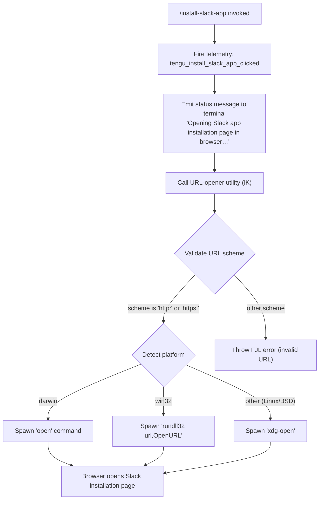

# `/install-slack-app`

> Analysis basis: CC v2.1.174 bundle.js (AST extraction + Claude interpretation)
> Minimum version: v2.1.174

---

## Overview

`/install-slack-app` is a local slash command that opens the Claude Slack app installation page in the user's default web browser. It fires a telemetry event, emits a status message to the terminal, and then delegates to a cross-platform URL-opener utility to navigate the user to the installation URL. The command is non-interactive and completes immediately after launching the browser.

---

## Registration

| Field | Value |
|---|---|
| type | `local` |
| name | `install-slack-app` |
| description | Install the Claude Slack app |
| loc_byte | `11913824` |
| loc_byte_end | `11914010` |
| loc_line | `8230` |
| supportsNonInteractive | `false` |
| module_id | `E8K` |
| load_inline | `true` |
| arbor_handler.name | `Fx7` |
| arbor_handler.fqn | `claude-2.1.174::Fx7` |
| arbor_handler.kind | `AsyncFunction` |
| arbor_handler.resolution_path | `module_id` |
| arbor_handler.n_hits | `0` |

Analysis basis: CC v2.1.174 bundle.js:+11913824

---

## Input Branching

The command has a simple linear flow with a single platform-detection branch inside the URL-opener utility. The top-level handler (`Fx7`) itself has no input-dependent branching — it always fires telemetry, prints a status message, and calls the URL opener. The multi-path branching occurs one level down inside the URL-opener (`lK` → `wY`/`u8`).



Analysis basis: CC v2.1.174 bundle.js:+11913428 (handler entry), +6265776 (scheme validation), +6266085 (platform branch)

---

## Behavioral Spec

### Main Handler — `Fx7` (install-slack-app handler)

```
async function installSlackAppHandler(context):
    // Step 1: Record user intent
    emitTelemetry("tengu_install_slack_app_clicked")

    // Step 2: Write status line to terminal output
    emitMessage(type="text", body="Opening Slack app installation page in browser…")

    // Step 3: Open URL in default browser (cross-platform)
    await openUrlInBrowser(slackInstallationUrl)
```

Analysis basis: CC v2.1.174 bundle.js:+11913430 (telemetry), +11913563 (message type literal), +11913576 (message body literal), +11913543 (call to URL-opener `lK`)

---

### URL Validation — inside `lK` / `FJL`

```
function validateAndOpenUrl(url):
    scheme = extractScheme(url)  // portion before ':'
    if scheme is not "http" and scheme is not "https":
        throw Error("invalid URL scheme")   // FJL error constructor
    platformOpen(url)
```

Analysis basis: CC v2.1.174 bundle.js:+6265726 (FJL error), +6265776 (`"http:"` literal), +6265798 (`"https:"` literal)

---

### Platform-Specific Browser Launch — inside `wY` (platform open helper)

```
function platformBrowserLaunch(url):
    platform = process.platform

    if platform == "darwin":
        spawn("open", [url])
    else if platform == "win32":
        spawn("rundll32", ["url,OpenURL", url])
    else:
        // Linux, FreeBSD, etc.
        spawn("xdg-open", [url])
```

Analysis basis: CC v2.1.174 bundle.js:+6266085 (`"darwin"`), +6266101 (`"win32"`), +6266185 (`"rundll32"`), +6266197 (`"url,OpenURL"`), +6266259 (`"open"`), +6266266 (`"xdg-open"`)

---

### Config Lock Sub-system — `G8` / `R58` (transitive via config save path)

The call graph shows `Fx7` → `G8` → `R58`, which is the global configuration persistence sub-system reached during handler setup (not specific to Slack). Key behaviours observed:

```
function saveConfigWithLock(config):
    acquireFileLock()
    // If lock acquisition takes longer than expected:
    //   emit warning "Lock acquisition took longer than expected…"
    //   emit telemetry: tengu_config_lock_contention

    reReadConfigFromDisk()
    // Guard: if re-read config is missing auth that in-memory cache has,
    //   emit telemetry: tengu_config_auth_loss_prevented
    //   abort write (refuse to wipe ~/.claude.json — see GH #3117)

    // If stale write detected:
    //   emit telemetry: tengu_config_stale_write

    writeConfigAtomically(config)
    releaseLock()
```

- Lock contention warning message: `"Lock acquisition took longer than expected - another Claude instance may be running"` (bundle.js:+3314828)
- Auth-loss guard references issue GH #3117 (bundle.js:+3315244)
- Config file written with permissions mode `384` (octal `0o600`) (bundle.js:+3316129)
- Config backup directory named `"backups"` (bundle.js:+3316429)
- Backup filename suffix pattern `".backup."` (bundle.js:+3315714), retaining at most `5` backups (bundle.js:+3315847)
- Lock timeout threshold: `60000` ms (bundle.js:+3315598)

Analysis basis: CC v2.1.174 bundle.js:+3314917, +3315053, +3315396

---

### Atomic File Writer — `fw6`

```
function atomicWriteFile(filePath, data, options):
    // Generate a random hex suffix for the temp file
    tempPath = filePath + "." + randomBytes(8).toString("hex")

    // Preserve original file permissions if it exists
    try:
        originalMode = statSync(filePath).mode
    catch ENOENT:
        originalMode = defaultMode

    writeFileSync(tempPath, data)
    fchmodSync(tempFd, originalMode)     // "Applied original permissions to temp file"
    fsyncSync(tempFd)                    // flush to disk
    renameSync(tempPath, filePath)       // atomic replace

    // Cleanup on failure:
    unlinkSync(tempPath)
```

Analysis basis: CC v2.1.174 bundle.js:+1089351 (randomBytes), +1089379 (`"hex"`), +1089529 (8 bytes), +1089845 (fchmod), +1089866 (permissions log), +1089911 (fsync), +1090039 (rename), +1090196 (unlink)

---

## State & Side Effects

| Item | Detail |
|---|---|
| Telemetry (primary) | `tengu_install_slack_app_clicked` — fired immediately when command is invoked (bundle.js:+11913430) |
| Telemetry (config subsystem) | `tengu_config_lock_contention`, `tengu_config_stale_write`, `tengu_config_parse_error`, `tengu_config_auth_loss_prevented` — fired by config save path when applicable |
| Telemetry (background daemon) | `tengu_bg_dispatch_sigkill_escalate`, `tengu_bg_dispatch_low_mem`, `tengu_bg_spare_enable`, `tengu_bg_spare_claim`, `tengu_bg_spare_claim_fail`, `tengu_bg_proto_mismatch`, `tengu_bg_dispatch_stale_drop`, `tengu_bg_attach_legacy_autorespawn`, `tengu_bg_attach`, `tengu_bg_attach_stall_gave_up`, `tengu_bg_attach_stall_respawn`, `tengu_bg_attach_kick` — background session infrastructure (transitive, not Slack-specific) |
| Terminal output | Emits a `text`-type message: `"Opening Slack app installation page in browser…"` (bundle.js:+11913576) |
| Browser launch | Spawns a platform-appropriate command (`open` / `rundll32 url,OpenURL` / `xdg-open`) to navigate to the Slack app installation URL |
| File system | No files written by the Slack-specific path; atomic config writer (`fw6`) may write to `~/.claude.json` via the transitive config save path |
| appState changes | None identified in depth-2 traversal |
| Hook registration | None identified in depth-2 traversal |
| Sound | None identified in depth-2 traversal |
| supportsNonInteractive | `false` — command must be run in an interactive session |

---

## Version History

| Version | Change |
|---|---|
| v2.1.174 | Initial analysis |

---

## Common Mistakes

1. **Running in non-interactive mode**: The command sets `supportsNonInteractive: false`. Invoking it via `--print` or in a pipe will fail or be silently skipped.
2. **No browser installed / `xdg-open` missing on Linux**: On headless Linux systems, the `xdg-open` spawn will fail with no user-visible error beyond the process exit code. Ensure a browser or `xdg-utils` is available.
3. **Expecting output beyond the status line**: The command only prints `"Opening Slack app installation page in browser…"` and exits. It does not wait for the browser to complete loading or for the user to finish the Slack installation flow.
4. **Confusing this with an API-driven install**: The command is purely a browser redirect helper. It does not call any Anthropic API endpoints, create tokens, or modify Claude's configuration for Slack integration automatically.
5. **URL scheme requirement**: The underlying URL opener (`lK`) validates that the target URL begins with `http:` or `https:`. Any misconfiguration producing a non-HTTP URL will throw an error before the browser is launched.

---

## Appendix — Identifier Mapping

> For bundle debugging only. Identifiers change across versions.

| Identifier | Role |
|---|---|
| `Fx7` | Main async handler for `/install-slack-app` (AsyncFunction, module `E8K`) |
| `c` | Utility called early in handler (likely logging/output helper) |
| `G8` | Global config save orchestrator |
| `R58` | Config file read/write worker (lock, backup, atomic write) |
| `_` | File system primitive wrapper (used in lock/stat operations) |
| `r6` | Path resolution helper |
| `f` | File system module reference (mkdirSync, statSync, etc.) |
| `q` | Secondary file system / stream module reference |
| `L` | Stream / file handle abstraction |
| `YN1` | Config object builder / merger |
| `iD_` | Config defaults provider |
| `N` | HTTP/API request dispatcher |
| `Z1f` | Request serializer / formatter |
| `H` | Random jitter / retry scheduler |
| `RH` | JSON stringifier wrapper |
| `df` | Response body extractor |
| `VgH` | Header builder helper |
| `h1f` | HTTP transport implementation |
| `V8` | Logger / debug emitter |
| `C7H` | Config file parser and validator |
| `l6` | JSON parser wrapper |
| `gu` | String prefix stripper (e.g. strip URL prefix) |
| `M19` | Directory reader / backup locator |
| `ZV_` | Path join helper for backups |
| `D` | Background daemon session manager |
| `YoH` | Config auth presence checker |
| `A` | Platform string normalizer (toLowerCase) |
| `V` | File entry filter (startsWith check) |
| `P` | IPC message buffer / framer |
| `X` | Socket / stream with timeout |
| `j` | Background job registry / killer |
| `R7` | IPC response encoder |
| `YZ5` | Background daemon message dispatcher |
| `TH` | String coercion utility |
| `E` | Array window / slice utility |
| `W` | SDK connection manager |
| `fw6` | Atomic file writer (temp-rename pattern) |
| `O` | Symbolic link / lstat checker |
| `k8` | Error code classifier |
| `GJH` | Config schema validator |
| `L19` | Config entry iterator (Object.entries wrapper) |
| `LW6` | Timestamp utility (Date.now wrapper) |
| `S58` | Config symlink-aware path resolver |
| `lK` | URL opener entry point (validates scheme, dispatches to platform helper) |
| `FJL` | URL validation error constructor |
| `wY` | Platform-specific browser spawn helper |
| `u8` | Process/environment bootstrap |
| `p_` | CLI argument parser / startup sequencer |
| `YNH` | Async context / store initializer |
| `Y` | Forced shutdown handler (process.exit wrapper) |
| `Gmf` | String coercion helper (String() wrapper) |
| `ZM` | Async context store reference |
| `SH` | Error logger / reporter |
| `b6` | Async context retrieval helper |
| `eo6` | AsyncLocalStorage getStore accessor |
| `j_` | Internal routing / dispatch bootstrap |

---

Note: index built via Arbor fallback; some signals (telemetry, literals) may be missing — see arbor-fallback.js.