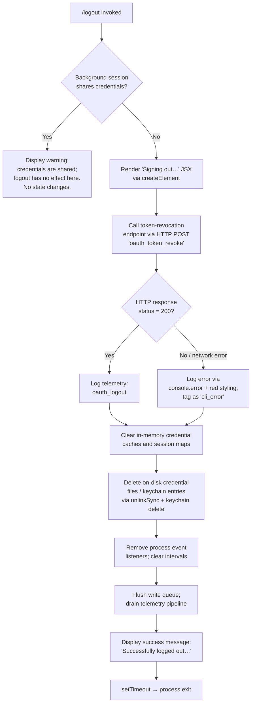

# `/logout`

> Analysis basis: CC v2.1.174 bundle.js (AST extraction + Claude interpretation)
> Minimum version: v2.1.174

---

## Overview

The `/logout` command signs the user out of their Anthropic account by revoking the active OAuth token via a remote API call, removing locally cached credentials and session state, and then tearing down the running Claude Code process. It is a one-shot, destructive operation: once completed, no credentials remain on disk and the process exits.

---

## Registration

| Field | Value |
|---|---|
| type | `local-jsx` |
| name | `logout` |
| description | Sign out from your Anthropic account |
| loc_byte | `11862104` |
| loc_byte_end | `11862388` |
| loc_line | `8082` |
| module_id | `Hs_` |
| load_inline | `true` |
| arbor_handler.name | `tH7` |
| arbor_handler.fqn | `claude-2.1.174::tH7` |
| arbor_handler.kind | `AsyncFunction` |
| arbor_handler.resolution_path | `module_id` |
| arbor_handler.n_hits | `0` |

Analysis basis: CC v2.1.174 bundle.js:+11862104

---

## Input Branching

Four distinct execution branches exist, warranting a Mermaid flowchart.



Analysis basis: CC v2.1.174 bundle.js:+8329986 (handler entry `tH7`), +8328681 (branch flag), +8330096 (background-session warning literal), +8330295 (success literal)

---

## Behavioral Spec

### 1. Background-Session Guard

```
function checkBackgroundSession(sessionContext):
    if sessionContext.mode is one of ["bg", "daemon", "daemon-worker"]:
        displaySystemMessage(
            "This background session shares credentials with other sessions; " +
            "/logout here has no effect. Run /logout from your main terminal to sign out."
        )
        return ABORT
    return CONTINUE
```

If the current process context is running as a background, daemon, or daemon-worker session (`"bg"`, `"daemon"`, `"daemon-worker"` literals — Analysis basis: CC v2.1.174 bundle.js:+2270278, +2270288, +2270302), the command terminates early with an informational message and makes no state changes.

Analysis basis: CC v2.1.174 bundle.js:+8330094

---

### 2. UI Feedback — Signing Out Indicator

```
function renderSigningOutUI():
    element = createElement(...)   // "Signing out…" label
    display(element)
```

A JSX element containing the string `"Signing out…"` (Analysis basis: CC v2.1.174 bundle.js:+8330449) is rendered immediately after the guard passes, giving the user visual feedback before any async work begins.

Analysis basis: CC v2.1.174 bundle.js:+8330270

---

### 3. OAuth Token Revocation

```
async function revokeOAuthToken(credentials):
    endpoint = resolveOAuthEndpoint(credentials.authType)
    // authType choices: "prod", "local", "staging", "local-oauth", "custom-oauth"
    response = await httpClient.post(endpoint, {
        grant_type: "refresh_token",
        token: credentials.refreshToken
    }, {
        headers: { "Content-Type": "application/json" },
        timeout: 5000   // ms
    })
    // event name used in request: "oauth_token_revoke"
    if isAxiosError(response):
        classifyError(response)   // maps to "network", "auth", "timeout", "http", etc.
        logCliError(response)
    return response
```

The token-revocation POST is sent to the Anthropic OAuth endpoint. The request timeout is **5000 ms** (Analysis basis: CC v2.1.174 bundle.js:+2122116). The event label `"oauth_token_revoke"` is embedded in the request payload (Analysis basis: CC v2.1.174 bundle.js:+2122126). On HTTP 401/403 the error category resolves to `"auth"`; on `ECONNABORTED` it resolves to `"timeout"`; on `ECONNREFUSED` / `ENOTFOUND` it resolves to `"network"` (Analysis basis: CC v2.1.174 bundle.js:+180342, +180351, +180406, +180475, +180500).

Analysis basis: CC v2.1.174 bundle.js:+8328981

---

### 4. Credential Clearing — In-Memory

```
function clearInMemoryCredentials():
    credentialCache.clear()         // GA9.clear equivalent
    sessionStateMap.mutate(...)     // K.mutate
    sessionStateMap.delete(...)     // K.delete
```

In-memory credential stores and session state maps are cleared after the revocation attempt, regardless of whether the HTTP call succeeded. This ensures credentials do not persist in RAM even if the network call fails.

Analysis basis: CC v2.1.174 bundle.js:+3244307, +8329104, +8329278

---

### 5. Credential Clearing — On-Disk / Keychain

```
async function removePersistedCredentials(credentialsPath):
    // Attempt keychain / secure-storage deletion
    try:
        keychainDelete("claude-code-user")
    except:
        log("Failed to delete keychain entry")

    // Remove credential files from filesystem
    fs.unlink(credentialFilePath)     // g86.unlink
    fs.unlink(socketOrLockFile)       // HbH.unlink

    // Build canonical credential path
    normalizedPath = normalize(credentialsPath, "NFC")
    hash = createHash("sha256").update(normalizedPath).digest("hex").slice(0, 8)
    // key format mirrors storage write key derivation
```

The keychain service name used is `"claude-code-user"` (Analysis basis: CC v2.1.174 bundle.js:+2133636). A failure to delete the keychain entry is logged as `"Failed to delete keychain entry"` (Analysis basis: CC v2.1.174 bundle.js:+2134395) but does not abort the logout sequence. On-disk credential and socket files are also unlinked via `fs.unlink` (Analysis basis: CC v2.1.174 bundle.js:+7428584, +7382917).

Analysis basis: CC v2.1.174 bundle.js:+8328802, +8329940

---

### 6. Process Event Listener Teardown

```
function teardownListeners():
    clearInterval(heartbeatInterval)
    process.removeListener("beforeExit", beforeExitHandler)
    process.off("exit", exitHandler)
    clearRegisteredMaps([DJH, j58, a26, fV_, EF])   // all .clear()
```

All registered process event listeners and interval timers are removed (Analysis basis: CC v2.1.174 bundle.js:+3295033, +3294296, +3295056). Five internal map stores are cleared (Analysis basis: CC v2.1.174 bundle.js:+3294364, +3294376, +3294388, +3294400, +3294412).

Analysis basis: CC v2.1.174 bundle.js:+8329887

---

### 7. Write-Queue Flush and Telemetry Drain

```
async function flushAndDrain():
    await writeQueue.drain()         // aFH → qvA.drain
    await settleAllPendingOps()      // i6q → Promise.allSettled
    // Race against AbortSignal.timeout for safety
    await Promise.race([
        drainTelemetry(),
        AbortSignal.timeout(3500)    // ms — hard deadline
    ])
```

The telemetry drain timeout is **3500 ms** (Analysis basis: CC v2.1.174 bundle.js:+7394260). After draining, a secondary 2000 ms settle period is observed (Analysis basis: CC v2.1.174 bundle.js:+7394438).

Analysis basis: CC v2.1.174 bundle.js:+7392640

---

### 8. Success Message and Process Exit

```
function finalizeLogout():
    displaySystemMessage("Successfully logged out from your Anthropic account.")
    // Short delay to allow UI to paint
    setTimeout(() => process.exit(0), smallDelay)
```

The success message `"Successfully logged out from your Anthropic account."` (Analysis basis: CC v2.1.174 bundle.js:+8330295) is displayed as a `"system"` message type (Analysis basis: CC v2.1.174 bundle.js:+8330248). HTTP status 200 is the expected success code (Analysis basis: CC v2.1.174 bundle.js:+8330390). The process then exits via `process.exit` through a `setTimeout` callback.

Analysis basis: CC v2.1.174 bundle.js:+8330358, +8330374

---

### 9. Config Write Safety (During Teardown)

```
function safeConfigWrite(existingConfig, newConfig):
    if existingConfig.hasAuth and not newConfig.hasAuth:
        logTelemetry("tengu_config_auth_loss_prevented")
        log("saveConfigWithLock: re-read config is missing auth that cache has; refusing to write…")
        return ABORT_WRITE
    acquireLock(timeout=60000)    // ms
    writeConfig(newConfig)
```

A protective guard prevents accidental erasure of auth tokens during the config flush that accompanies process teardown. The lock acquisition timeout is **60 000 ms** (Analysis basis: CC v2.1.174 bundle.js:+3315598). The guard string `"saveConfigWithLock: re-read config is missing auth that cache has; refusing to write to avoid wiping ~/.claude.json. See GH #3117."` is embedded in the bundle (Analysis basis: CC v2.1.174 bundle.js:+3315244).

Analysis basis: CC v2.1.174 bundle.js:+3315396

---

## State & Side Effects

| Item | Detail |
|---|---|
| Telemetry — `oauth_logout` | Fired after successful (or attempted) token revocation; telemetry key literal at bundle.js:+8329767 |
| Telemetry — `tengu_feature_ok` | Fired on successful secure-storage credential write path (bundle.js:+1016891) |
| Telemetry — `tengu_feature_sad` | Fired on degraded secure-storage path (bundle.js:+1017039) |
| Telemetry — `tengu_feature_bad` | Fired on secure-storage failure (bundle.js:+1016958) |
| Telemetry — `tengu_config_lock_contention` | Fired when config lock is slow to acquire during teardown (bundle.js:+3314917) |
| Telemetry — `tengu_config_stale_write` | Fired when a stale config write is detected (bundle.js:+3315053) |
| Telemetry — `tengu_config_parse_error` | Fired on JSON parse failure during config read (bundle.js:+3317492) |
| Telemetry — `tengu_config_auth_loss_prevented` | Fired when auth-loss guard blocks a config write (bundle.js:+3315396) |
| Telemetry — `tengu_cache_eviction_hint` | Fired during post-logout session-end cleanup (bundle.js:+7394612) |
| Telemetry — `tengu_scroll_summary` | Fired during UI teardown scroll accounting (bundle.js:+7393669) |
| Telemetry — `tengu_startup_perf` | May fire during startup-profiling drain (bundle.js:+221706) |
| Credential caches cleared | All in-memory maps holding OAuth tokens are cleared via `.clear()` / `.mutate()` / `.delete()` |
| Keychain entry removed | `"claude-code-user"` service entry deleted from OS keychain (bundle.js:+2133636) |
| Credential files unlinked | OAuth credential file and session socket/lock file removed from filesystem |
| Process listeners removed | `exit` and `beforeExit` listeners deregistered; heartbeat interval cleared |
| Internal map stores cleared | Five internal maps (`DJH`, `j58`, `a26`, `fV_`, `EF`) cleared |
| Write queue drained | Pending file-write queue flushed before exit |
| Process termination | `process.exit` called after a short timeout; no daemon restart |
| Background session | No state changes occur when session mode is `"bg"`, `"daemon"`, or `"daemon-worker"` |

---

## Version History

| Version | Change |
|---|---|
| v2.1.174 | Initial analysis |

---

## Common Mistakes

1. **Running `/logout` from a background or daemon session**: The command prints a warning and does nothing. Only the main terminal session can perform a logout that actually clears credentials.
2. **Expecting credentials to survive on disk after logout**: All on-disk credential files and the OS keychain entry are deleted unconditionally; re-running Claude Code after `/logout` requires a fresh `claude login`.
3. **Assuming network failure prevents logout**: The credential-clearing and process-exit sequence runs even if the OAuth token revocation HTTP request fails. The tokens are removed locally regardless.
4. **Interrupting the process immediately**: A brief delay is inserted before `process.exit` to allow the telemetry drain (up to ~3500 ms) and the success message to render. Killing the process before this window may leave telemetry events unsent but does not leave credentials behind.
5. **Expecting `/logout` to be available in non-OAuth auth modes**: The `"oauth"` auth type label is checked during the flow (Analysis basis: CC v2.1.174 bundle.js:+8330513); using `/logout` when authenticated via Bedrock, Vertex, or other third-party providers may produce no meaningful action.

---

## Appendix — Identifier Mapping

> For bundle debugging only. Identifiers change across versions.

| Identifier | Role |
|---|---|
| `tH7` | Primary handler for `/logout` (AsyncFunction; Arbor-resolved via module_id) |
| `eH7` | Logout UI component / JSX renderer helper |
| `IA6` | Core logout execution function (token revocation + credential teardown orchestrator) |
| `vy6` | Session and listener teardown coordinator |
| `ez_` | OAuth token revocation HTTP request function |
| `C1` | OAuth endpoint URL resolver |
| `aZ_` | Config write / persistence layer coordinator during logout |
| `RA9` | Config read-write helper called during teardown |
| `BP1` | Credential path builder (NFC normalization + SHA-256 hash) |
| `kI` | Secure credential key derivation (normalize → hash → hex slice) |
| `HN` | OS user-info resolver (`os.userInfo`) |
| `G8` | Global config save function (with auth-loss guard) |
| `R58` | Config file writer with backup rotation |
| `C7H` | Config file reader with parse and backup logic |
| `S58` | Config save helper sub-function |
| `U8q` | Credential file unlink / on-disk credential cleanup |
| `qs6` | Credential path join helper |
| `Ll_` | Lock file / socket unlink helper |
| `Kl_` | Lock teardown with `clearTimeout` |
| `FLH` | Lock state checker (includes `wiH` mode detection) |
| `YjH` | Socket/lock file path builder |
| `$AH` | Process listener deregistration and map clearing |
| `LoH` | Full listener teardown (intervals, process.off, map clears) |
| `wV_` | Interval clear + `process.removeListener` helper |
| `Vm` | Credential map clear wrapper |
| `zm` | Inner cache clear |
| `f58` | In-memory cache `.clear()` call |
| `j9` | Session context / mode inspector (detects "bg", "daemon", etc.) |
| `aDH` | Mode-value extractor used by session inspector |
| `n_` | Auth-type name resolver ("bedrock", "foundry", "vertex", etc.) |
| `If` | Secure storage credential reader |
| `GN1` | Low-level secure storage read/write dispatcher |
| `VhH` | Credential store read helper |
| `QD4` | Credential store write path with retry/lock |
| `kH` | Secure storage write with telemetry (`tengu_feature_ok/bad`) |
| `t6` | Secure storage degraded-path writer (`tengu_feature_sad`) |
| `CH` | Secure storage fallback writer |
| `A6` | Telemetry event emit helper |
| `q` | Process data-event reader / stream helper |
| `R1` | CLI error display + `process.exit` handler |
| `GUH` | Error formatter using `X6.red` (red terminal color) |
| `zX` | Error-state config writer (`EgH.writeFileSync`) |
| `SH` | Message queue / conversation state manager |
| `DA` | Error constructor wrapper |
| `L6` | String conversion utility |
| `_q` | Essential-traffic queue gate |
| `dbf` | Message queue shift/push operations |
| `N` | Network request dispatcher / fetch wrapper |
| `Z1f` | HTTP response handler |
| `fvA` | Response field extractor |
| `RH` | JSON stringify wrapper |
| `df` | Header/path string manipulation utility |
| `UhA` | Header map processor |
| `VgH` | stdout write wrapper |
| `hhA` | Low-level `H.write` caller |
| `h1f` | Log file append/rotate logic |
| `oFH` | Async log flush with `setTimeout` / `setImmediate` |
| `sfH` | Log path builder using `M8H.join` |
| `r6` | Filesystem existence check |
| `C36` | EISDIR error handler |
| `ghA` | Log directory path builder |
| `Qt8` | Log file rotation (stat → rename → unlink) |
| `N1f` | Log file writer (mkdir + appendFile) |
| `R9` | Write-queue registration (`qvA.register`) |
| `oo` | Miscellaneous output helper |
| `TH` | String cast utility |
| `G8` | (see above — global config saver) |
| `LW6` | Config timestamp helper (`Date.now`) |
| `L19` | Config entry iterator (`Object.entries`) |
| `GJH` | Config serialization helper |
| `YoH` | Config post-write hook |
| `ZV_` | Backup directory path builder |
| `fw6` | Atomic file writer (temp file + rename + fchmod) |
| `V8` | ENOENT / file-missing guard |
| `YN1` | Config object merge helper (`Object.assign`) |
| `n2` | Config field validator |
| `Ef` | Process exit orchestrator (drain → exit sequence) |
| `N9` | Main shutdown sequence (MbH + Gl_ + Tl_ + drain) |
| `MbH` | Terminal unmount + final write |
| `Y$8` | Terminal escape-sequence writer |
| `Gl_` | Final status line renderer (with `X6.dim`) |
| `Tl_` | Process kill fallback (`process.kill("SIGKILL")`) |
| `Tl_` | Hard-kill fallback after drain timeout |
| `aFH` | Telemetry drain (`qvA.drain`) |
| `i6q` | `Promise.allSettled` over pending async operations |
| `B08` | Session-end stats recorder |
| `x6q` | Timing stats calculator (`Date.now`, `Math.round`) |
| `N1` | Display-mode resolver (fullscreen / default) |
| `AM6` | Post-logout cleanup helper |
| `$6` | Sentinel / constant value holder |
| `S56` | Low-level sentinel initializer |
| `ObH` | Graceful-exit wrapper with `Promise.resolve` |
| `p08` | Exit promise resolver |
| `w` | Render-loop / supervisor update dispatcher |
| `iEH` | Render-tree differ |
| `OXK` | Layout calculator |
| `T` | Render timer (`wv6` / `A56`) |
| `oaK` | Heartbeat emitter |
| `vVH` | Credential-validity checker called post-logout |
| `K` | App state store (`.mutate`, `.delete`, `.split`) |
| `M` | MCP server manager (`HCH` + `Mi8` + `NGA`) |
| `HCH` | MCP connection setup (multi-transport) |
| `Mi8` | MCP connection result applicator |
| `NGA` | MCP server reconnect/retry logic |
| `ASH` | Telemetry span emitter (`fJ` + `mf`) |
| `fJ` | Span field formatter |
| `mf` | OTEL metric emitter (`M.emit`) |
| `_SH` | OTEL resource attribute builder |
| `HF` | Session ID generator (`$19.randomBytes`) |
| `k6` | OTEL exporter reference |
| `dz8` | OTEL metric descriptor builder |
| `bG6` | OTEL attribute string formatter |
| `y8H` | Allowed-attribute set checker |
| `d4` | OTEL metric value wrapper |
| `Fj9` | Metric type classifier |
| `uM6` | Metric batch accumulator |
| `do8` | Metric flush trigger |
| `co8` | OTEL cleanup helper |
| `He8` | Startup profiling report builder |
| `_IA` | Startup profiling file writer |
| `o36` | Startup profiling coordinator |