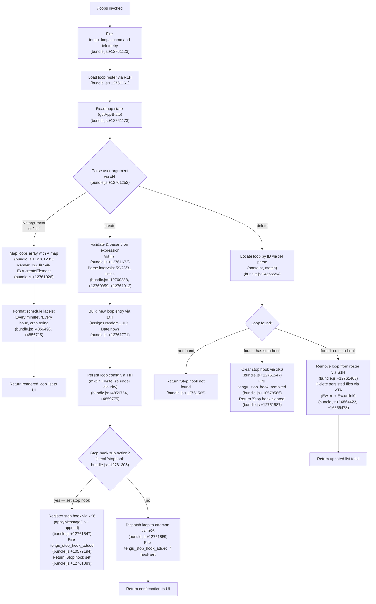

# `/loops`

> Analysis basis: CC v2.1.174 bundle.js (AST extraction + Claude interpretation)
> Minimum version: v2.1.174

---

## Overview

The `/loops` command provides a management interface for Claude Code's background loop (scheduled/recurring task) system. It allows users to list active loops, create new loops with cron-style schedules, and delete existing loops — directly from the CLI without leaving the current session. Internally the handler is the async function `yi7` (resolved via `module_id` → `s3K`), which reads loop state, renders a JSX UI component, and routes sub-actions (list, create with stop-hook, delete) through the daemon infrastructure.

---

## Registration

| Field | Value |
|---|---|
| type | `local-jsx` |
| name | `loops` |
| description | `List, create, and delete loops` |
| loc_byte | `12762166` |
| loc_byte_end | `12762323` |
| loc_line | `9004` |
| immediate | `true` |
| module_id | `s3K` |
| load_inline | `true` |
| arbor_handler.name | `yi7` |
| arbor_handler.fqn | `claude-2.1.174::yi7` |
| arbor_handler.kind | `AsyncFunction` |
| arbor_handler.resolution_path | `module_id` |
| arbor_handler.n_hits | `0` |

Analysis basis: CC v2.1.174 bundle.js:+12762166 – +12762323

---

## Input Branching

The command has four distinct logical branches depending on user input (no argument / `list`, `create <schedule> <prompt>`, `delete <id>`, and an internal `stophook` sub-flow), which warrants a Mermaid flowchart.



---

## Behavioral Spec

### Handler Entry — `loopsCommandHandler` (`yi7`)

```
async function loopsCommandHandler(context):
    emit telemetry("tengu_loops_command")         // bundle.js:+12761123

    loopRoster = await loadLoopRoster(context)    // R1H, bundle.js:+12761161
    appState   = context.getAppState()            // bundle.js:+12761173
    renderUtil = createRenderHelper()             // k6,  bundle.js:+12761189

    parsedArgs = parseLoopArguments(context.input)  // xN, bundle.js:+12761252

    if parsedArgs.action == "list" or no action:
        loops = appState.loops.map(formatLoopEntry)  // A.map, bundle.js:+12761201
        return jsx(LoopListComponent, { loops })     // EzA.createElement, bundle.js:+12761926

    elif parsedArgs.action == "create":
        schedule = parsedArgs.schedule   // cron literal, bundle.js:+12761219
        goal     = parsedArgs.goal

        cronInfo = parseCronExpression(schedule)     // Ii7, bundle.js:+12761673
        newLoop  = buildLoopEntry(cronInfo, goal)    // EtH, bundle.js:+12761771
        await persistLoopConfig(newLoop)             // TtH (via EtH)

        if parsedArgs.hasStopHook:                   // "stophook", bundle.js:+12761305
            await registerStopHook(context, newLoop) // xK6, bundle.js:+12761547
            // emits tengu_stop_hook_added
            return "Stop hook set"                   // bundle.js:+12761883
        else:
            await dispatchLoopToDaemon(newLoop)      // bK6, bundle.js:+12761859
            return confirmationUI(newLoop)

    elif parsedArgs.action == "delete":
        loopId = parsedArgs.id
        match = findLoopById(appState, loopId)       // S1H, bundle.js:+12761408

        if match == null:
            return "Stop hook not found"             // bundle.js:+12761565

        if match.hasStopHook:
            await clearStopHook(context, match)      // xK6, bundle.js:+12761547
            // emits tengu_stop_hook_removed          // bundle.js:+10579566
            return "Stop hook cleared"               // bundle.js:+12761587

        await removeFromRoster(match)                // VTA + S1H
        return jsx(UpdatedListComponent, appState)
```

Analysis basis: CC v2.1.174 bundle.js:+12761121

---

### Cron Expression Parser — `parseCronExpression` (`Ii7`)

```
function parseCronExpression(scheduleString):
    trimmed = scheduleString.trim()

    // attempt numeric interval parse
    match = trimmed.match(numericPattern)           // bundle.js:+12760709
    if match:
        n = parseInt(match[1])                      // bundle.js:+12760746
        minutes = Math.max(1, n)
        // clamp: seconds ≤ 59, hours ≤ 23, days ≤ 31
        // constants: 59 (bundle.js:+12760888),
        //            23 (bundle.js:+12760959),
        //            31 (bundle.js:+12761012)
        seconds = Math.ceil(...)                    // bundle.js:+12760842
        rounded = Math.round(...)                   // bundle.js:+12760915
        return { type: "cron", seconds, rounded }

    // human-readable aliases
    if scheduleString matches "Every minute":       // bundle.js:+4856498
        return { type: "cron", interval: 1 }

    if scheduleString matches "Every hour":         // bundle.js:+4856715
        return { type: "cron", interval: 60 }      // 60-minute constant, bundle.js:+16355441

    // fallback: raw cron string forwarded to daemon
    weekdayLines = parseCronWeekdays(trimmed)       // jy, bundle.js:+12761079
    return { type: "cron", raw: trimmed, weekdays: weekdayLines }
```

Analysis basis: CC v2.1.174 bundle.js:+12761673

---

### Loop Roster Loader — `loadLoopRoster` (`R1H`)

```
async function loadLoopRoster(context):
    rawFile = await readFile(loopConfigPath, "utf-8")  // SSH → _.readFile, bundle.js:+4858606
                                                        // encoding: "utf-8", bundle.js:+4858634
    if not Array.isArray(rawFile):                      // bundle.js:+4858750
        return []

    roster = rawFile.map(parseRosterEntry)             // N, bundle.js:+4858929
    serialized = JSON.stringify(roster)                // RH, bundle.js:+4858976
    return roster
```

Analysis basis: CC v2.1.174 bundle.js:+4860595

---

### Loop Persistence — `persistLoopConfig` (`TtH`)

```
async function persistLoopConfig(loopEntry):
    baseDir = path.join(workDir, ".claude")            // literal ".claude", bundle.js:+4859775
    await fs.mkdir(baseDir, { recursive: true })       // BY8.mkdir, bundle.js:+4859754
    filePath = path.join(baseDir, loopEntry.id)        // FY8.join, bundle.js:+4859764

    content = loopEntry.fields.map(serializeField)     // H.map, bundle.js:+4859815
    await fs.writeFile(filePath, content)               // BY8.writeFile, bundle.js:+4859851

    updatedPath = readUpdatedPath(filePath)             // r5H, bundle.js:+4859865
    serialized  = serialize(updatedPath)                // RH, bundle.js:+4859872
    return serialized
```

Analysis basis: CC v2.1.174 bundle.js:+4859743

---

### Loop Entry Builder — `buildLoopEntry` (`EtH`)

```
async function buildLoopEntry(cronInfo, goalText):
    id        = crypto.randomUUID()          // l09.randomUUID, bundle.js:+4859934
    createdAt = Date.now()                   // bundle.js:+4859996
    validated = validateGoal(goalText)       // hVH, bundle.js:+4860042
    roster    = await loadCurrentRoster()    // SSH, bundle.js:+4860086
    roster.push({ id, createdAt, cronInfo, goal: validated })
    // bundle.js:+4860099
    return roster
```

Analysis basis: CC v2.1.174 bundle.js:+12761771

---

### Stop Hook Registration — `registerStopHook` (`xK6`)

```
async function registerStopHook(context, loopEntry):
    currentState = context.getAppState()           // H.getAppState, bundle.js:+10579311
    newState     = applyMessageOperation(
                       currentState,
                       { type: "append",           // literal "append", bundle.js:+10579532
                         role: "system",           // literal "system", bundle.js:+12761454
                         content: buildGoalAttachment(loopEntry)
                               // type: "attachment"  bundle.js:+10579642
                               // kind: "goal"        bundle.js:+10579600
                       }
                   )                               // H.applyMessageOp, bundle.js:+10579509
    context.setAppState(newState)                  // H.setAppState, bundle.js:+10579440
    hookId = crypto.randomUUID()                   // IFq.randomUUID, bundle.js:+10579660
    emit telemetry("tengu_stop_hook_added")        // bundle.js:+10579194
    return hookId
```

Analysis basis: CC v2.1.174 bundle.js:+12761547

---

### Loop Deletion / Daemon Dispatch — `dispatchLoopToDaemon` (`bK6`)

```
async function dispatchLoopToDaemon(loopEntry):
    policy  = loadPolicySettings()              // fKA → Db (policySettings), bundle.js:+10578808
                                                // literal "policySettings", bundle.js:+3343751
    hooksOk = checkHooksGate(policy)            // literal "hooks_gate", bundle.js:+10578704
    trustOk = checkTrustGate(policy)            // literal "trust_gate", bundle.js:+10578758

    k6helper = createHelper()                   // k6, bundle.js:+10578871
    column   = buildLoopColumn(loopEntry)       // CK6, bundle.js:+10578889
    state    = context.getAppState()            // bundle.js:+10578893

    goalSet  = resolveGoalSet(loopEntry)        // literal "goal_set", bundle.js:+10578836
    stopLit  = "Stop"                           // literal "Stop", bundle.js:+10578515

    timestamp = Date.now()                      // bundle.js:+10579057
    outputTokens = computeOutputTokens()        // eY → "outputTokens", bundle.js:+46087
    context.setAppState(updatedState)           // _.setAppState, bundle.js:+10579095
    context.applyMessageOp(appendOp)            // _.applyMessageOp, bundle.js:+10579137

    hookId = generateHook()                     // SFq, bundle.js:+10579179
    emit telemetry("tengu_stop_hook_added")     // bundle.js:+10579194
    return confirmResult(hookId)                // c, bundle.js:+10579192
```

Analysis basis: CC v2.1.174 bundle.js:+12761859

---

### Loop Column Formatter — `buildLoopColumns` (`CK6`)

```
function buildLoopColumns(loops):
    colWidths = computeColumnWidths(loops)    // PGH → K.set, bundle.js:+9266557
    headers   = mapHeaders(colWidths)         // hEq → H.map, bundle.js:+9266326
    rows      = []
    for loop in loops:
        row = formatRow(loop, colWidths)      // padEnd with "  " separator
                                              // literal "  ", bundle.js:+16883203
                                              // padEnd width 40, bundle.js:+16885174
        rows.push(row)                        // A.push, bundle.js:+10578631
    return { headers, rows }
```

Analysis basis: CC v2.1.174 bundle.js:+10578507

---

### Weekday / Schedule Parser — `parseWeekdays` (`jy`)

```
function parseWeekdays(scheduleString):
    trimmed = scheduleString.trim()           // bundle.js:+4855207

    weekdayEntries = parseWeekdayTokens(trimmed)  // wfL, bundle.js:+4855293
    // wfL splits on delimiters (H.split), matches day tokens (f.match),
    // calls parseInt for numeric day indices    // bundle.js:+4854692
    // adds to day set K.add                     // bundle.js:+4854753
    // day-of-week constants: 3, 6, 7 (Wed/Sat/Sun)
    //   bundle.js:+4854868, +4854904, +4854910
    // radix constant: 10                        // bundle.js:+4854706
    // Array.from(set)                           // bundle.js:+4855155

    result = []
    for entry in weekdayEntries:
        result.push(normalizeEntry(entry))    // A.push, bundle.js:+4855328
    return result
```

Analysis basis: CC v2.1.174 bundle.js:+4855207

---

### Loop Argument Parser — `parseLoopArguments` (`xN`)

```
function parseLoopArguments(rawInput):
    trimmed = rawInput.trim()                   // bundle.js:+4856378

    // Check for "1-5" range shorthand
    rangeMatch = trimmed.match(rangePattern)    // K.match, bundle.js:+4856519
                                               // literal "1-5", bundle.js:+4857422
    if rangeMatch:
        n = parseInt(rangeMatch[1])            // bundle.js:+4856554

    label = resolveHumanLabel(trimmed)
    // "Every minute" → interval 1             // bundle.js:+4856498
    // "Every hour"   → interval 60            // bundle.js:+4856715

    // Check for day-of-week modifiers
    dayMatch = trimmed.match(dayPattern)       // f.match, bundle.js:+4856789
    idStr    = trimmed.toString()              // D.toString, bundle.js:+4856752

    // Date arithmetic for next-fire calculation
    nextDate = new Date()
    nextDate.setUTCDate(...)                   // J.setUTCDate, bundle.js:+4857274
    nextDate.getUTCDay()                       // J.getUTCDay,  bundle.js:+4857255
    nextDate.getUTCDate()                      // J.getUTCDate, bundle.js:+4857287
    nextDate.setUTCHours(0, 0, 0, 0)          // J.setUTCHours, bundle.js:+4857305
    nextDate.getDay()                          // J.getDay, bundle.js:+4857334

    // Kill-signal helpers called if loop is a running process
    killResult = maybeKillLoop(idStr)          // Y, bundle.js:+4857157
    secondMatch = trimmed.match(secondPattern) // $.match, bundle.js:+4857187

    return { action, schedule, goal, id, hasStopHook }
```

Analysis basis: CC v2.1.174 bundle.js:+4856378

---

## State & Side Effects

| Item | Detail |
|---|---|
| Telemetry — primary | `tengu_loops_command` (bundle.js:+12761123) — fired on every invocation |
| Telemetry — stop hook added | `tengu_stop_hook_added` (bundle.js:+10579194) — fired when a stop hook is registered |
| Telemetry — stop hook removed | `tengu_stop_hook_removed` (bundle.js:+10579566) — fired when a stop hook is cleared |
| Telemetry — scheduled task fire | `tengu_scheduled_task_fire` (bundle.js:+16355211) — daemon-side, loop execution |
| Telemetry — scheduled task missed | `tengu_scheduled_task_missed` (bundle.js:+16354460) — loop missed its window |
| Telemetry — scheduled task expired | `tengu_scheduled_task_expired` (bundle.js:+16355554) — loop TTL exceeded |
| Telemetry — daemon bg session | `tengu_daemon_bg_session_create` (bundle.js:+16858502) — new background session |
| Telemetry — bg dispatch SIGKILL | `tengu_bg_dispatch_sigkill_escalate` (bundle.js:+16858186) — force-kill escalation |
| Telemetry — daemon control | `tengu_daemon_control` (bundle.js:+16895373) — daemon start/stop events |
| Telemetry — daemon config reload | `tengu_daemon_config_reload` (bundle.js:+16873690) — config hot-reload |
| Telemetry — bg low memory | `tengu_bg_dispatch_low_mem` / `tengu_bg_low_mem_mb` (bundle.js:+16858787, +13305660) |
| Telemetry — spare session | `tengu_bg_spare_enable` / `tengu_bg_spare_claim` / `tengu_bg_spare_claim_fail` |
| Telemetry — feature gates | `tengu_feature_ok` / `tengu_feature_bad` / `tengu_feature_sad` |
| Telemetry — MCP | `tengu_mcp_skills` (bundle.js:+6623670) |
| File I/O — create | Writes loop config under `.claude/` directory (bundle.js:+4859775); uses `mkdir` + `writeFile` |
| File I/O — delete | Removes loop files via `Ew.rm` and `Ew.unlink` (bundle.js:+16864422, +16865473) |
| File I/O — read | Reads `pins.json` (bundle.js:+4237425) for pinned prompt resolution |
| appState changes | `setAppState` / `applyMessageOp` called during stop-hook registration and loop creation; adds `system`-role `attachment` block with `goal` / `goal_status` fields |
| Hook registration | Stop hooks attached as message-op `append` with type `attachment`, kind `goal` (bundle.js:+10579532, +10579642, +10579600) |
| Daemon interaction | Communicates with background daemon over IPC socket (Unix domain on non-Windows, named pipe on Windows); uses claim/spawn protocol (`PTA`, `Dd.spawn`, `Dd.claim`) |
| Process signals | SIGTERM (bundle.js:+16837217) for graceful stop; SIGKILL escalation (bundle.js:+16858234) if unresponsive |
| Idle timeout | 300 000 ms (5 min) idle timeout before daemon background session self-terminates (bundle.js:+16865952) |
| Recurring label | Active recurring loops annotated with ` (recurring)` suffix (bundle.js:+16355188) |
| Sound | None detected |

---

## Version History

| Version | Change |
|---|---|
| v2.1.174 | Initial analysis |

---

## Common Mistakes

1. **Omitting a valid cron expression**: The `create` sub-action expects a parseable schedule string. Human-readable aliases `"Every minute"` and `"Every hour"` are the only two guaranteed plain-English shortcuts (bundle.js:+4856498, +4856715); other English phrases will fall through to the raw cron parser and may produce an unexpected schedule.

2. **Confusing stop-hook deletion with full loop deletion**: Passing `delete <id>` on a loop that has a stop hook attached will clear the hook and return `"Stop hook cleared"` (bundle.js:+12761587) rather than removing the loop entirely. A second invocation is required to remove the loop itself.

3. **Expecting synchronous list refresh**: The `/loops` command renders a JSX component (`local-jsx` type with `immediate: true`). The rendered list reflects the in-memory app state at invocation time; loop status changes driven by the daemon (e.g., `working`, `idle`, `crashed`) require a fresh `/loops` call to be visible.

4. **Ignoring day-of-week range syntax**: The parser accepts the shorthand `1-5` for weekday ranges (bundle.js:+4857422) and integer day codes 3, 6, 7 for Wednesday, Saturday, Sunday (bundle.js:+4854868). Numeric-only input without this pattern is interpreted as a minute-interval, not a specific day.

5. **Assuming the daemon is already running**: Loop dispatch via `bK6` triggers daemon spawn/claim logic (`Dd.spawn`, `Dd.claim`) with a 5 000 ms claim timeout (bundle.js:+16837413) and a 500 ms retry interval (bundle.js:+16837617). If the daemon fails to start (e.g., `ECONNREFUSED`), the create action will fail silently unless the error surface is checked.

---

## Appendix — Identifier Mapping

> For bundle debugging only. Identifiers change across versions.

| Identifier | Role |
|---|---|
| `yi7` | Main handler — `loopsCommandHandler` (AsyncFunction, entry point) |
| `R1H` | Loop roster loader — reads persisted loop list |
| `SSH` | Shell/file reader — core file-read helper used by roster loader |
| `r5H` | Path resolver — joins base dir segments for loop config paths |
| `Nf` | Path normalizer — called inside path resolver |
| `Z9` | Serializer helper — called by SSH |
| `V8` | Validation utility — called by serializer and other helpers |
| `SH` | Error-and-log dispatcher — handles errors/logging in file operations |
| `DA` | Error constructor wrapper |
| `L6` | String coercion utility |
| `_q` | Essential-traffic filter (literal `"essential-traffic"`) |
| `dbf` | Queue shift/push helper |
| `N` | Roster entry normalizer / debug-flag formatter |
| `Z1f` | Entry format helper |
| `RH` | JSON serializer (wraps `JSON.stringify`) |
| `df` | Content redactor — replaces sensitive fields with `[REDACTED]` |
| `VgH` | Header format helper |
| `h1f` | File-size / byte-length helper (uses `Buffer.byteLength`) |
| `jy` | Schedule/weekday string parser |
| `wfL` | Weekday token tokenizer (split + match + parseInt) |
| `PE` | Path expander helper |
| `rG` | Shared utility (called by path helpers) |
| `CK6` | Loop column builder — formats tabular display columns |
| `PGH` | Column-width setter |
| `hEq` | Column header mapper |
| `k6` | Render helper factory |
| `xN` | Loop argument parser — parses user input into action/schedule/id |
| `D` | Background session / daemon session object |
| `b` | Loop process spawner/manager |
| `w` | Daemon write/supervisor channel |
| `As` | Loop state initializer |
| `TtH` | Loop config persistence — mkdir + writeFile under `.claude/` |
| `o09` | Filter helper for loop list |
| `P` | PTY buffer / IPC buffer handler |
| `z` | Daemon stop controller |
| `S` | Daemon session supervisor writer |
| `X` | Timeout manager for daemon sessions |
| `d` | Session map helper |
| `udK` | Loop status formatter — builds human-readable status strings |
| `S1H` | Roster filter / remove-by-id helper |
| `l8` | Async timeout wrapper (uses `setTimeout` / `clearTimeout`) |
| `O` | OS helper (used by `l8`) |
| `CH` | Channel open helper |
| `A6` | Channel feature helper |
| `kH` | Channel close helper |
| `vg8` | macOS low-memory checker |
| `w6` | Memory threshold comparator |
| `TG6` | Pins file reader (`pins.json`) |
| `ak_` | Pins path resolver |
| `l6` | JSON parse wrapper |
| `k8` | File-not-found error classifier |
| `M6L` | Loop directory reader (readdir + readFile per entry) |
| `Q` | PTY/IPC connection manager — retireIfSettled, drain, auth |
| `l` | Loop scheduling core — fires `tengu_scheduled_task_fire`, checks `isLoopDefaultSentinel` |
| `C` | Timeout-clear write helper |
| `B` | Session set (tracked active sessions) |
| `xZ` | Socket path builder (platform-aware, Windows named pipe) |
| `Jv` | IPC frame builder (Buffer operations) |
| `ou8` | IPC frame parser (Buffer read/write operations) |
| `PTA` | Daemon claim/connect orchestrator |
| `xJA` | Daemon workspace initializer (mkdir + writeFile) |
| `qZ5` | Claim retry loop (5 000 ms timeout, 500 ms retry) |
| `AZ5` | Claim frame builder |
| `N7` | Validation helper (used in claim path) |
| `TH` | String coercion wrapper |
| `VTA` | Background session lifecycle manager (states: done/killed/failed/active/crashed/blocked/working/bg/daemon/idle/resuming) |
| `_f` | Session path resolver |
| `Tq` | Session state file reader/writer (`stateOrder`) |
| `GO` | Active-state setter |
| `xXH` | Session tag/label parser |
| `c7` | Session config joiner |
| `Ff6` | Session result finalizer |
| `Gu6` | Session path helper |
| `AOH` | Session path helper (alt) |
| `cQ` | Session cleanup path helper |
| `Wu6` | Session workspace path helper |
| `Y` | Forced-shutdown handler (calls `process.exit`, `z.abort`) |
| `_X` | Pre-exit cleanup |
| `j` | Active-loop kill iterator |
| `$` | mDK factory reference |
| `mDK` | Daemon status writer (`daemon.status.json`) |
| `c9` | AsyncLocalStorage store reader (`yU4.getStore`) |
| `Dp6` | Status file path builder |
| `J` | Date calculation object for next-fire time |
| `xK6` | Stop-hook registration/deregistration handler |
| `SFq` | UUID generator for stop hooks |
| `$6` | S56 helper |
| `S56` | Shared small utility (called by `$6`, `t6`, `A6`) |
| `Ii7` | Cron expression parser (Math.max/ceil/round, limits 59/23/31) |
| `EtH` | Loop entry builder (randomUUID + Date.now + SSH) |
| `hVH` | Goal text validator |
| `M` | MCP server manager (HCH + Mi8) |
| `HCH` | MCP connection handler (per-server connect logic) |
| `Wi` | MCP slot connector |
| `tV` | MCP transport helper |
| `c8` | MCP utility helper |
| `wv6` | MCP connection state helper |
| `zn9` | MCP retry scheduler |
| `zJ8` | MCP OJ8-based helper |
| `MJ8` | MCP If-based helper |
| `Y8` | MCP debug log emitter (`logMCPDebug`) |
| `nX8` | MCP OAuth/authenticate tool handler |
| `iX8` | MCP complete-authentication handler |
| `Wn9` | MCP gP8 promise handler |
| `uB_` | MCP auth error handler |
| `lN` | MCP w6 skills helper (fires `tengu_mcp_skills`) |
| `ZB_` | MCP G8/includes helper |
| `y` | Warning/usage-credits notification helper |
| `zL` | MCP error log emitter (`logMCPError`) |
| `jn9` | MCP tF task helper |
| `f66` | MCP parseInt helper |
| `nP8` | MCP parseInt helper (alt) |
| `Mi8` | MCP apply-connection-result handler |
| `eRH` | MCP m2H helper |
| `_G` | MCP cleanup helper |
| `NGA` | MCP roster/client manager |
| `RX8` | MCP filter helper (ATL/IB_ sets) |
| `q66` | MCP m2H queue helper |
| `bK6` | Loop daemon dispatch — policy check + appState update + hook registration |
| `fKA` | Policy loader (reads policySettings + hooks_gate + trust_gate) |
| `Db` | Policy settings reader |
| `C8` | ms6/xB helper (policy internals) |
| `WAH` | Policy C8/dA helper |
| `R_` | Policy helper |
| `p7` | Policy resolver (rm4 sub-tree) |
| `rm4` | Policy resolution (L6, lFH, j9, C6, jAH, Sc, b6, GD.resolve) |
| `t6` | Channel t6 helper (c + A6) |
| `eY` | Output-token calculator (CFH + Object.values) |

---

Note: index built via Arbor fallback; some signals (telemetry, literals) may be missing — see arbor-fallback.js.