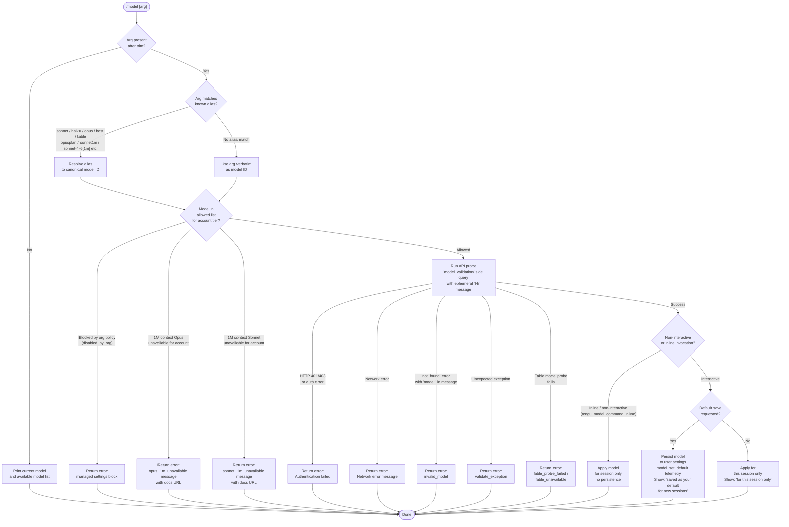

# `/model`

> Analysis basis: CC v2.1.174 bundle.js (AST extraction + Claude interpretation)
> Minimum version: v2.1.174

---

## Overview

The `/model` command allows users to switch the AI model used by Claude Code mid-session. It accepts a model name or alias as its argument, validates the model against allowed options for the user's account tier, and either applies the change for the current session only or persists it as the new default depending on context. The command performs a lightweight API probe to confirm model availability before committing the switch.

---

## Registration

| Field | Value |
|---|---|
| type | `local` |
| name | `model` |
| description | `Set the AI model for Claude Code` |
| argumentHint | `<model>` |
| supportsNonInteractive | `true` |
| module_id | `awK` |
| load_inline | `true` |
| loc_byte | `12980622` |
| loc_byte_end | `12980796` |
| loc_line | `9153` |
| arbor_handler.name | `pa7` |
| arbor_handler.fqn | `claude-2.1.174::pa7` |
| arbor_handler.kind | `AsyncFunction` |
| arbor_handler.resolution_path | `module_id` |
| arbor_handler.n_hits | `0` |

Analysis basis: CC v2.1.174 bundle.js:+12980622

---

## Input Branching

The command exhibits 5+ distinct handling paths based on input content and account state, so a flowchart is used.



---

## Behavioral Spec

### Top-level handler (`pa7`)

Analysis basis: CC v2.1.174 bundle.js:+12949674

```
async function handleModelCommand(input, appState):
    trimmedArg = input.trim()                        // +12949674

    if trimmedArg is empty:
        return displayCurrentModelAndList(appState)  // falls into wF8 path

    if trimmedArg is of type "text" (raw text input): // +12949741
        pass

    availableModels = getAvailableModelIds(appState) // +12949713 (_.getAppState)

    if trimmedArg not in availableModels:            // +12949690 (XdH.includes)
        resolvedId = resolveAliasToModelId(trimmedArg)
    else:
        resolvedId = trimmedArg

    if isInlineOrNonInteractive(input):              // +12949777 (C8H.includes)
        emit telemetry("tengu_model_command_inline") // +12949832
        applyModelForSession(resolvedId, appState)
        return

    fingerprint = computeModelFingerprint(resolvedId) // +12949872 (W3)

    result = await validateAndSwitchModel(resolvedId, appState, fingerprint) // +12949927 (LwK)
    return result
```

### Model list display (`wF8` → `Xk`)

Analysis basis: CC v2.1.174 bundle.js:+12913899

```
function displayCurrentModelAndList(appState):
    modelList = buildAvailableModelList(appState)  // Xk → Ij6/S0
    render modelList to output                     // wF8 → _ (render)
    return
```

### Available model list builder (`Xk` → `Ij6`, `S0`)

Analysis basis: CC v2.1.174 bundle.js:+12913701

```
function buildAvailableModelList(appState):
    shortAliases = resolveShortAliasEntries(appState)  // Ij6
    // Aliases resolved: "sonnet", "haiku", "opus", "best", "fable",
    //                   "opusplan" → "Opus in plan mode, else Sonnet" (+2259038)

    tierModels = getModelsForAccountTier(appState)     // S0
    // Checks tier membership:
    //   "max"              (+3271644)
    //   "team"             (+3271715)
    //   "default_claude_max_5x" (+3271730)
    //   "enterprise"       (+3271825)
    //   "enterprise_usage_based" (+3271847)

    return merge(shortAliases, tierModels)
```

### Alias resolution (`T9`)

Analysis basis: CC v2.1.174 bundle.js:+2260487

```
function resolveAlias(alias):
    normalized = alias.trim().toLowerCase()

    switch normalized:
        case "fable":    return canonicalFableId      // +2260564
        case "sonnet":   return canonicalSonnetId     // +2260668
        case "haiku":    return canonicalHaikuId      // +2260707
        case "opus":     return canonicalOpusId       // +2260746
        case "best":     return canonicalBestId       // +2260781
        case "opusplan": return "opusplan"             // +2259021
        // "[1m]" suffix handling                      // +2260612
        // Further alias checks via NY, KW, Ol, GLH,
        //   ta, zT, iDH, Vj6, YD, hv1, y7, x18,
        //   EnH, eY4, uI, _.replace

    return normalized  // pass through if unrecognized
```

### Model fingerprinting (`W3`)

Analysis basis: CC v2.1.174 bundle.js:+2510509

```
function computeModelFingerprint(modelId):
    // Uses SHA-256 hash (+2510527), digest as hex (+2510554),
    // truncated to 12 characters (+2510569)
    hash = crypto.createHash("sha256")    // +2510512
    hash.update(LV(modelId))              // LV = version/salt helper
    return hash.digest("hex").slice(0, 12)
```

### Validation and switch orchestrator (`LwK` → `zF8`)

Analysis basis: CC v2.1.174 bundle.js:+12912480

```
async function validateAndSwitchModel(modelId, appState, fingerprint):
    modelList = await fetchOrCachedModelList(appState)  // zF8

    // Availability checks before API probe:
    orgPolicy = checkOrgPolicyForModel(modelId)         // jD_
    if orgPolicy == "disabled":                          // +2255869
        return error("disabled_by_org")                 // +12911721

    if isOpus1MContext(modelId) and not accountAllows1MOpus:
        return error("opus_1m_unavailable",             // +12911236
            "Opus with 1M context is not available..." +
            " https://code.claude.com/docs/en/model-config#extended-context-with-1m") // +12911274

    if isSonnet1MContext(modelId) and not accountAllows1MSonnet:
        return error("sonnet_1m_unavailable",           // +12911453
            "Sonnet 4.6 with 1M context is not available..." +
            " https://code.claude.com/docs/en/model-config#extended-context-with-1m") // +12911493

    // Fable-specific availability check
    if isFableModel(modelId):
        probeResult = await probeFableAvailability(modelId) // _p6 path
        if probeResult == "unavailable":
            return error("fable_unavailable")           // +12911972
        if probeResult == "probe_failed":
            return error("fable_probe_failed")          // +12911992

    // API probe (side query)
    probeResult = await runModelValidationProbe(modelId) // _p6

    switch probeResult.errorKind:
        case "not_allowed":                              // +12911089
            return error("model_switch not_allowed")    // +12911074
        case AUTH_ERROR (401/403):
            return error("Authentication failed. Please check your API credentials.") // +12909828
        case NETWORK_ERROR:
            return error("Network error. Please check your internet connection.")    // +12909930
        case "not_found_error" where message contains "model:":
            return error("invalid_model")               // +12912267
        case UNEXPECTED_EXCEPTION:
            return error("validate_exception")          // +12912364
        default:
            // Success path: fall through to apply

    applyAndReportModelChange(modelId, appState)        // fwA
    return success
```

### API probe for model validation (`_p6`)

Analysis basis: CC v2.1.174 bundle.js:+12909055

```
async function runModelValidationProbe(modelId):
    trimmed = modelId.trim()                            // +12909055
    if trimmed is empty:
        return error("Model name cannot be empty")      // +12909092

    // Check local known-model cache (KwK.has)          // +12909361
    if KwK.has(modelId):
        return cached result

    // Build minimal "side_query" API request           // +13773629
    // message: role="user", content="Hi"               // +12909491, +12909525
    // cache_control: "ephemeral"                       // +12909550
    // type: "model_validation"                         // +12909456
    // Calls globalThis.fetch                           // +13773682
    // Timeout handled via setTimeout + Math.random     // +14057572, +14057535

    response = await fetchSideQuery(modelId, ...)      // yp

    if response.error.type == "not_found_error"        // +12910049
        and response.error.message contains "model:":  // +12910131
        return {kind: "invalid_model"}

    // Store result in KwK cache                        // +12909569
    return {kind: "ok", modelId: response.modelId}
```

### Apply and report model change (`fwA`)

Analysis basis: CC v2.1.174 bundle.js:+12912597

```
function applyAndReportModelChange(modelId, appState, options):
    // Determine persistence
    saveAsDefault = options.saveAsDefault              // Ap6 path

    if saveAsDefault:
        persistModelToUserSettings(modelId)            // Ap6 → fA (writes userSettings)
        emit telemetry("model_set_default")            // +12913108
        suffix = " and saved as your default for new sessions" // +12912750
    else:
        suffix = " for this session only"              // +12912796

    // Build display name (bold formatting via X6.bold) // +12912731
    displayName = formatModelDisplayName(modelId)

    // Append context tags if applicable:
    if fastModeOn:
        displayName += " · Fast mode ON"               // +12912914
    if drawsFromUsageCredits:
        displayName += " · Draws from usage credits"   // +12912965
    if fastModeOff:
        displayName += " · Fast mode OFF"              // +12913011

    // Show managed-settings notice if applicable      // +12913317
    // (LwA path: NNH → C8, nu → EI.join(".claude/settings.json"))
    //   Path components: ".claude" (+1297025),
    //                    "settings.json" (+1297035),
    //                    "settings.local.json" (+1297097)

    // Update appState model field                     // +12913155
    appState.model = modelId

    print displayName + suffix
```

### Model list fetcher with bootstrap cache (`zF8` → `yA6`)

Analysis basis: CC v2.1.174 bundle.js:+12912147

```
async function fetchOrCachedModelList(appState):
    // Bootstrap fetch from /v1/models API             // f67
    // Skipped if:
    //   CLAUDE_CODE_ENABLE_GATEWAY_MODEL_DISCOVERY not set // +8334003
    //   Nonessential traffic disabled                  // +8334158
    //   3P provider in use                             // +8334249
    // Timeout: 5000 ms                                // +8334512
    // Headers: Content-Type: application/json,        // +8334396, +8334411
    //          User-Agent: ...,                        // +8334430
    //          x-api-key / anthropic-beta              // +8335383, +8334927
    // On parse failure: telemetry("api_bootstrap_fetch", "parse_failed") // +8334633, +8334655
    // On success: "[Bootstrap] Fetch ok"               // +8334685
    // Cache unchanged → skip write                    // +8335997
    // Cache updated → persist to disk                 // +8336053

    // Provider routing constants found in traversal:
    //   "anthropicAws"  (+2110819)
    //   "gateway"       (+2110839)
    //   "bedrock"       (+2110146)
    //   "foundry"       (+2110196)
    //   "vertex"        (+2110354)
    //   "firstParty"    (+2259233)
    //   "mantle"        (+2256384)

    return modelList
```

### Known model catalogue (from `T9` and `jD_` constant pool)

Analysis basis: CC v2.1.174 bundle.js:+2259643

The bundle contains a static catalogue of canonical model IDs paired with display names. Models found in the literal pool:

| Canonical ID | Display Name |
|---|---|
| `claude-fable-5` | `Fable 5` |
| `claude-mythos-5` | `Mythos 5` |
| `claude-opus-4-8` | `Opus 4.8` |
| `claude-opus-4-7` | `Opus 4.7` |
| `claude-opus-4-6` | `Opus 4.6` |
| `claude-opus-4-5` | `Opus 4.5` |
| `claude-opus-4-1` | `Opus 4.1` |
| `claude-opus-4-0` | `Opus 4` |
| `claude-sonnet-4-6` | `Sonnet 4.6` |
| `claude-sonnet-4-5` | `Sonnet 4.5` |
| `claude-sonnet-4-0` | `Sonnet 4` |
| `claude-3-7-sonnet` | `Sonnet 3.7` |
| `claude-3-5-sonnet` | `Sonnet 3.5` |
| `claude-haiku-4-5` | `Haiku 4.5` |
| `claude-3-5-haiku` | `Haiku 3.5` |

Special alias `opusplan` resolves to `"Opus in plan mode, else Sonnet"` (bundle.js:+2259038).  
The `(1M context)` suffix label is appended to display names where applicable (bundle.js:+2259662).

---

## State & Side Effects

| Item | Detail |
|---|---|
| Telemetry: `tengu_model_command_inline` | Fired when the command is invoked inline/non-interactively (bundle.js:+12949832) |
| Telemetry: `tengu_feature_ok` | Fired on successful feature-flag check within handler helpers (bundle.js:+1016891) |
| Telemetry: `tengu_feature_bad` | Fired on failed feature-flag check (bundle.js:+1016958) |
| Telemetry: `tengu_lone_surrogate_sanitized` | Fired if lone Unicode surrogates are sanitized in the side-query response (bundle.js:+13774957) |
| Telemetry: `tengu_api_success` | Fired when the validation side query returns successfully (bundle.js:+13775208) |
| Telemetry: `tengu_config_auth_loss_prevented` | Fired if a config write would have silently lost auth credentials (bundle.js:+3312009) |
| appState changes | `appState.model` is updated to the new canonical model ID (bundle.js:+12913155) |
| User settings persistence | When saving as default, writes `model` key to `~/.claude/settings.json` (bundle.js:+1297025, +1297035) |
| Local settings | May also update `settings.local.json` (bundle.js:+1297097) |
| Model validation cache | Result of API probe is stored in the `KwK` Map (bundle.js:+12909361, +12909569) |
| Bootstrap cache | `/v1/models` response cached to disk; staleness check prevents unnecessary writes (bundle.js:+8335997, +8336053) |
| Network I/O | Side-query probe calls `globalThis.fetch` with a minimal `"Hi"` message (bundle.js:+12909525) |
| Timing | `setTimeout` + `Math.random` used for probe timeout jitter (bundle.js:+14057572, +14057535) — numbers `2` and `1` (bundle.js:+14057533, +14057549) |

---

## Version History

| Version | Change |
|---|---|
| v2.1.174 | Initial analysis |

---

## Common Mistakes

1. **Passing an empty argument** — `/model ` (with trailing spaces only) triggers the "Model name cannot be empty" error (bundle.js:+12909092) because the handler trims input before checking emptiness. Omit the argument entirely to display the current model and list.

2. **Using an alias not in the known set** — Only `sonnet`, `haiku`, `opus`, `best`, `fable`, `opusplan`, and the `[1m]`-suffixed variants are recognized short aliases. Typos are passed verbatim to the API probe and will result in an `invalid_model` error (bundle.js:+12912267).

3. **Expecting 1M context models on all account tiers** — `claude-opus-*` and `claude-sonnet-4-6` with the 1M context window are gated per account. Attempting to set them on an ineligible account returns a descriptive error with a docs link (bundle.js:+12911274, +12911493).

4. **Assuming the switch persists by default** — In non-interactive or inline invocations the model change is session-scoped only; it is never persisted automatically (bundle.js:+12912796).

5. **Expecting immediate availability after an org policy change** — Models blocked via `disabled_by_org` return an error immediately without an API probe; re-enabling requires an admin change to managed settings (bundle.js:+12911721, +12913317).

6. **Confusing the `opusplan` alias** — This alias does not map to a fixed model ID; it instructs Claude Code to use Opus during plan phases and Sonnet otherwise. It is not a valid standalone API model name (bundle.js:+2259021, +2259038).

---

## Appendix — Identifier Mapping

> For bundle debugging only. Identifiers change across versions.

| Identifier | Role |
|---|---|
| `pa7` | Main async handler for `/model` command (Arbor-resolved entry point) |
| `H` | Generic string/input parameter variable; also used as jitter helper with `Math.random`/`setTimeout` |
| `wF8` | Model list display renderer (calls `Xk` and appState render function) |
| `Xk` | Available model list builder (delegates to `Ij6` and `S0`) |
| `Ij6` | Short alias list builder (calls `m3` and `T9`) |
| `m3` | Alias entry constructor (used by `Ij6` / `TLH`) |
| `T9` | Alias-to-canonical-ID resolver (handles all short names + normalization) |
| `S0` | Account-tier-aware model list constructor |
| `GA` | Provider/tier metadata helper |
| `T_H` | "max" tier model filter |
| `rDH` | "team" / `default_claude_max_5x` tier model filter |
| `ZnH` | "enterprise" / `enterprise_usage_based` tier model filter |
| `ZX` | Model entry builder (calls `ELH`, `ZLH`, `n_`, `GA`, `Lq`) |
| `Vj6` | Model ID normalizer (regex replace) |
| `YD` | Model display name builder (calls `n_`, `hL`, `y7`) |
| `y7` | Utility: string wrapper / display formatter |
| `n_` | Core string/node builder primitive |
| `hL` | Styled text builder (calls `UFH`, `WO4`, `GP1`, `AA8`, `n_`) |
| `zT` | Composite model entry formatter (calls `y7`, `hL`) |
| `c` | Low-level output/console utility |
| `W3` | Model fingerprint generator (SHA-256 hash, 12-char hex) |
| `LV` | Hash input preprocessor / salt helper |
| `S56` | Low-level primitive used by `LV` and `A6` |
| `LwK` | Validation and model-switch orchestrator (calls `zF8`, `fwA`) |
| `zF8` | Model list fetcher with bootstrap cache; also dispatches availability checks |
| `yz` | Model list parser / normalizer |
| `A` | Model entry array iterator / `toLowerCase` helper |
| `KW` | Model ID sanitizer (regex replace) |
| `M` | MCP/tool model cache accessor |
| `K` | Model display padder (for list formatting) |
| `q` | Model data cache / Set helper |
| `llH` | Object.entries iterator utility |
| `f` | Async task queue manager (add/delete/finally) |
| `WnH` | Provider inclusion checker (`aY4.includes`) |
| `Nv1` | Model index finder (calls `WnH`, `A.indexOf`) |
| `sY4` | Model availability checker (calls `Ol`, `T9`) |
| `Ol` | Model flag tester (`jhH.includes`) |
| `tY4` | Extended availability checker (calls `Ol`, `T9`, `vv1`, `_.startsWith`) |
| `CH` | Feature-flag evaluator (fires `tengu_feature_ok` / `tengu_feature_bad`) |
| `A6` | Feature-flag result constructor |
| `io7` | Sonnet 1M availability checker (toLowerCase + `Ds` + `ZX`) |
| `Ds` | Account entitlement lookup (`ELH`, `GA`, `ap1`) |
| `ro7` | Opus 1M availability checker (toLowerCase + `QLH`) |
| `QLH` | Opus entitlement lookup (`ELH`, `GA`, `ap1`) |
| `jD_` | Org-policy / disabled-model checker |
| `YL` | Policy settings reader (`HA8`) |
| `R18` | Policy rule evaluator (`A1`, `KW`, `H.toLowerCase`) |
| `nDH` | Array/policy entry normalizer (`C6`, `Array.isArray`) |
| `WLH` | Nested policy walker (`n_`, `YL`, `nDH`, `PLH`) |
| `A1` | Model string matcher (`llH`, `jJ`, `H.includes`, `bM6`, `q5`) |
| `TLH` | Display name builder with `(1M context)` suffix logic |
| `_p6` | API probe / model validation function (side-query sender) |
| `yp` | HTTP side-query executor (calls `globalThis.fetch`, `ZyH`, `Pq5`, etc.) |
| `lo7` | Probe response parser (calls `no7`, `String`) |
| `fwK` | Model name lowercaser for matching (`Ol`, `H.toLowerCase`) |
| `yA6` | Bootstrap model-list fetch orchestrator |
| `f67` | API bootstrap HTTP request function |
| `kH` | Axios-based HTTP client wrapper (fires `tengu_feature_ok/bad`) |
| `C6` | Config write helper with auth-loss guard (fires `tengu_config_auth_loss_prevented`) |
| `Zzq` | Bootstrap cache comparison utility |
| `N` | Model name formatter / display utility |
| `G8` | Global config save function |
| `Zz` | Bootstrap result serializer |
| `SH` | Log/error reporter (calls `DA`, `L6`, `_q`, `dbf`, `Sa.logError`) |
| `TH` | String coercion helper |
| `fwA` | Apply-and-report model change function (persistence + display) |
| `ufH` | Session-state accessor |
| `Ap6` | Default-save sub-handler (calls `fA`, `kH`) |
| `fA` | Settings file writer (reads/writes `userSettings`, `projectSettings`, etc.) |
| `$f` | Output node builder (calls `n_`, `L6`) |
| `L6` | String coercion wrapper |
| `cDH` | Context/display tag formatter |
| `P3` | Model info display builder (calls `$f`, `S0`, `T9`, `q.includes`) |
| `FTH` | Fast-mode / credit annotation builder (calls `GA`, `T9`, `hY`, `NY`, `P3`) |
| `hY` | Plan-mode model selector helper (calls `T9`, `S0`) |
| `NY` | ELH-based annotation builder |
| `LwA` | Settings-path / managed-settings notice builder |
| `NNH` | Settings path resolver (calls `rv`, `C8`) |
| `C8` | Path join utility (`ms6`, `xB`) |
| `nu` | Path join via `EI.join` |
| `Yl` | Composite model entry renderer (calls `Ol`, `m3`, `T9`) |

---

Note: index built via Arbor fallback; some signals (telemetry, literals) may be missing — see arbor-fallback.js.