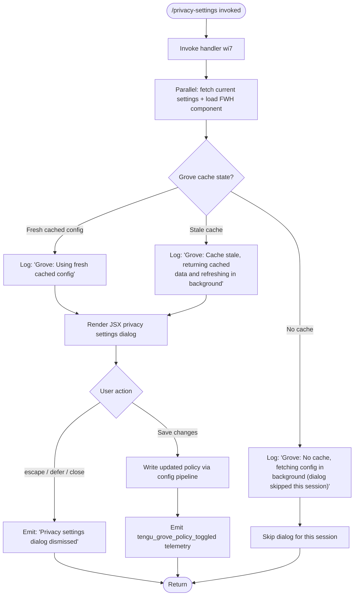

# `/privacy-settings`

> Analysis basis: CC v2.1.174 bundle.js (AST extraction + Claude interpretation)
> Minimum version: v2.1.174

---

## Overview

`/privacy-settings` opens an interactive dialog that allows the user to view and modify their current privacy settings (collectively called "Grove" policy in the bundle). The command fetches the current settings state asynchronously — using a stale-while-revalidate cache strategy — and then renders a JSX-based UI component. If the user dismisses the dialog without saving, a "dismissed" message is emitted.

---

## Registration

| Field | Value |
|---|---|
| type | `local-jsx` |
| name | `privacy-settings` |
| description | `View and update your privacy settings` |
| module_id | `X3K` |
| load_inline | `true` |
| loc_byte | `12721361` |
| loc_byte_end | `12721553` |
| loc_line | `8916` |
| arbor_handler.name | `wi7` |
| arbor_handler.fqn | `claude-2.1.174::wi7` |
| arbor_handler.kind | `AsyncFunction` |
| arbor_handler.resolution_path | `module_id` |
| arbor_handler.n_hits | `0` |

Analysis basis: CC v2.1.174 bundle.js:+12721361

---

## Input Branching

The command has 3+ distinct execution paths: (1) cache present and fresh, (2) cache present but stale (background refresh), (3) no cache (background fetch, dialog skipped this session), and (4) dialog dismissed by the user. A Mermaid flowchart is used.



Analysis basis: CC v2.1.174 bundle.js:+12720354, +7399318, +7399438, +7399544, +12720517, +12720531, +12720542

---

## Behavioral Spec

### Top-Level Handler

The primary handler is `wi7` (an `AsyncFunction` resolved via `module_id` → `X3K`).

```
async function privacySettingsHandler(context):
    -- Step 1: Concurrently fetch settings and UI component
    [settingsResult, uiComponent] ← await Promise.all([
        fetchSettingsWithCache(context),   -- x86 / o6q pipeline
        loadUIFramework()                  -- he / FWH
    ])

    -- Step 2: Determine cache state (see Grove cache logic below)
    if settingsResult.cacheState == NO_CACHE:
        log("Grove: No cache, fetching config in background (dialog skipped this session)")
        return  -- dialog is skipped entirely this session

    -- Step 3: Render JSX dialog
    element ← createElement(privacySettingsComponent, {
        settings: settingsResult.data,
        onDismiss: handleDismiss,
        onSave: handleSave
    })
    render(element)
```

Analysis basis: CC v2.1.174 bundle.js:+12720394, +12720407, +12720412, +12721008

---

### Grove Cache / Config Fetch Pipeline

The settings retrieval subsystem (`x86` → `o6q`) implements a stale-while-revalidate strategy with three branches determined at the time of the call:

```
function fetchSettingsWithCache(context):
    timestamp ← Date.now()
    configData ← readConfigWithLock()       -- C6 / C7H

    if configData.isFresh:
        log("Grove: Using fresh cached config")
        return { cacheState: FRESH, data: configData }

    if configData.isStale:
        triggerBackgroundRefresh()
        log("Grove: Cache stale, returning cached data and refreshing in background")
        return { cacheState: STALE, data: configData }

    -- No usable cache
    triggerBackgroundFetch()
    log("Grove: No cache, fetching config in background (dialog skipped this session)")
    return { cacheState: NO_CACHE, data: null }
```

Analysis basis: CC v2.1.174 bundle.js:+7399292, +7399316, +7399398, +7399438, +7399544

---

### Config Read with Lock

The underlying config read function (`C6` → `C7H`) guards against concurrent writes and data loss:

```
function readConfigWithLock(configPath):
    -- Guard: config must be initialized before access
    if not configAccessAllowed:
        throw Error("Config accessed before allowed.")   -- literal at +3316861

    raw ← fs.readFileSync(configPath, "utf-8")           -- +3316944
    parsed ← parseJSON(raw)

    if parseError:
        emit_telemetry("tengu_config_parse_error")        -- +3317492
        return fallback

    return parsed
```

The lock acquisition subsystem (`G8` / `R58`) enforces a maximum lock wait and emits `tengu_config_lock_contention` when acquisition exceeds the expected threshold. Lock backup files use a `.backup.` infix (literal at +3315714). A maximum of 5 backup copies are retained (numeric literal `5` at +3315847). Config stale-write prevention emits `tengu_config_stale_write` (+3315053), and any detected auth-loss scenario emits `tengu_config_auth_loss_prevented` (+3315396).

Analysis basis: CC v2.1.174 bundle.js:+3316861, +3316917, +3316944, +3317492, +3314917, +3315714

---

### Dismiss Handling

When the user presses escape, chooses "defer", or otherwise closes the dialog without saving:

```
function handleDismiss(reason):
    -- reason is one of: "escape", "defer"
    log("Privacy settings dialog dismissed")   -- literal at +12720542
    return { action: "dismissed", reason: reason }
```

The string literals `"escape"` (+12720517) and `"defer"` (+12720531) are the two recognized dismissal reasons observed in the implementation.

Analysis basis: CC v2.1.174 bundle.js:+12720517, +12720531, +12720542

---

### Save / Policy Toggle

When the user confirms a change in the dialog:

```
function handleSave(updatedSettings):
    writeConfig(updatedSettings)   -- routes through config pipeline (C6, G8, R58)
    emit_telemetry("tengu_grove_policy_toggled", { settings: updatedSettings })
    return { action: "saved" }
```

On save failure, the handler surfaces the message `"Unable to retrieve updated privacy settings"` (literal at +12720668).

Analysis basis: CC v2.1.174 bundle.js:+12720897, +12720668

---

### MCP Manager Initialization (Indirect via `M` → `HCH`)

The handler calls into `M` (MCP manager initializer), which invokes `HCH` (the main MCP connection orchestrator). This is an indirect side effect of loading the full application state before rendering the dialog. `HCH` manages MCP server connections across transport types: `stdio` (+6745183), `sse-ide` (+6745282), `ws-ide` (+6745318), and `claudeai-proxy` (+6745590). Connections in a `needs-auth` state (literal at +6745842) are skipped with the log message "Skipping connection (cached needs-auth)" (+6745776).

Analysis basis: CC v2.1.174 bundle.js:+12720611, +6744983, +6745183, +6745842

---

### Error Path

If settings cannot be fetched or the config pipeline fails:

```
function onSettingsError(error):
    display("Unable to retrieve updated privacy settings")
    -- literal at +12720668
```

Analysis basis: CC v2.1.174 bundle.js:+12720668

---

## State & Side Effects

| Item | Detail |
|---|---|
| Telemetry — `tengu_grove_policy_toggled` | Fired when user saves a privacy setting change (bundle.js:+12720897) |
| Telemetry — `tengu_config_parse_error` | Fired when config JSON cannot be parsed during settings fetch (+3317492) |
| Telemetry — `tengu_config_lock_contention` | Fired when config lock acquisition is slower than expected (+3314917) |
| Telemetry — `tengu_config_stale_write` | Fired when a stale write to config is detected and suppressed (+3315053) |
| Telemetry — `tengu_config_auth_loss_prevented` | Fired when a write that would erase auth credentials is blocked (+3315396) |
| Telemetry — `tengu_mcp_oauth_flow_start` | Fired via MCP subsystem if OAuth is triggered during app-state init (+6516571) |
| Telemetry — `tengu_mcp_oauth_flow_success` | Fired on successful OAuth completion (+6521557) |
| Telemetry — `tengu_mcp_oauth_flow_error` | Fired on OAuth error (+6523268) |
| Telemetry — `tengu_daemon_config_reload` | Fired when daemon reloads config (+16873690) |
| Telemetry — `tengu_mcp_skills` | Fired by MCP skills subsystem during app-state setup (+6623670) |
| JSX rendering | Creates a React element via `rm6.createElement` (+12721008) |
| Config file I/O | Reads `~/.claude.json` (or equivalent); may write on save; creates `.backup.` files |
| MCP connections | App-state initialization may start/stop MCP server connections as a side effect |
| Dismiss log | Emits "Privacy settings dialog dismissed" to session log on escape/defer |
| Error message | Surfaces "Unable to retrieve updated privacy settings" on fetch failure |

---

## Version History

| Version | Change |
|---|---|
| v2.1.174 | Initial analysis |

---

## Common Mistakes

1. **Expecting the dialog to always appear**: If the Grove config cache is absent at invocation time, the dialog is skipped for the current session. This is silent — no error is shown. Rerunning the command in a subsequent session or after the background fetch completes will render the dialog.
2. **Assuming settings are written immediately**: Changes are routed through the config lock pipeline. If another Claude instance is holding the lock, a `tengu_config_lock_contention` event is emitted and the write may be delayed or retried.
3. **Auth credential loss**: The config write pipeline refuses to write if the freshly re-read config is missing auth credentials that the in-memory cache holds (GH #3117 guard). This triggers `tengu_config_auth_loss_prevented`. Users should not manually edit `~/.claude.json` while Claude Code is running.
4. **Dismissing vs. saving**: Pressing Escape or selecting "defer" is treated as a dismissal (no changes written). Only an explicit confirmation action triggers `tengu_grove_policy_toggled`.
5. **MCP connection noise**: Because `/privacy-settings` initializes full app state, it may trigger MCP reconnection attempts as a side effect, which can emit additional telemetry or log messages unrelated to privacy settings themselves.

---

## Appendix — Identifier Mapping

> For bundle debugging only. Identifiers change across versions.

| Identifier | Role |
|---|---|
| `wi7` | Primary handler (AsyncFunction) for `/privacy-settings` |
| `x86` | Settings fetch orchestrator (entry point from `wi7`) |
| `h7H` | Config state resolver (called by `x86`) |
| `Lq` | Settings data accessor / config reader helper |
| `az_` | Config sub-accessor A (called by `Lq`) |
| `oz_` | Config sub-accessor B (called by `Lq`) |
| `Uw` | Core config read utility (used by `Lq`, `GA`, `d4`) |
| `GA` | Config state aggregator (called by `h7H`) |
| `rC` | Array/include check helper (called by `GA`) |
| `uA9` | Additional config utility (called by `h7H`) |
| `d4` | Config read wrapper (called by `x86`) |
| `C6` | Config file loader with lock (called by `d4`, `x86`, `o6q`) |
| `r6` | File path resolver |
| `TV_` | Config validation helper |
| `C7H` | Low-level config file reader (readFileSync, mkdirSync, etc.) |
| `em4` | Config file watcher / watch-setup helper |
| `N` | Telemetry / logging dispatch utility |
| `Z1f` | Log message formatter |
| `fvA` | Sub-formatter (called by `Z1f`) |
| `H` | Core utility / random/timeout helper |
| `RH` | JSON serializer (wraps JSON.stringify) |
| `df` | Path sanitizer / redaction helper |
| `UhA` | Path segment mapper |
| `q` | Filesystem namespace (Node `fs` wrapper) |
| `A` | String/path utility |
| `VgH` | Output writer helper |
| `hhA` | Write flusher (calls `H.write`) |
| `h1f` | Async append-write orchestrator |
| `oFH` | Debounce / flush scheduler |
| `sfH` | Segment joiner / queue flusher |
| `C36` | Encoding validator |
| `ghA` | Path join + existence checker |
| `Qt8` | Atomic rename helper (stat → rename → unlink) |
| `N1f` | Async file appender (mkdir + appendFile) |
| `R9` | Hook registrar (calls `qvA.register`) |
| `o6q` | Grove cache strategy router (fresh / stale / no-cache) |
| `G8` | Global config save-with-lock orchestrator |
| `R58` | Save-with-lock file writer (backup + copy + rotate) |
| `GJH` | Config merge helper |
| `L19` | Object entries iterator for config |
| `LW6` | Timestamp-based lock helper |
| `YoH` | Config validation / schema checker |
| `c` | Generic utility / constant holder |
| `S58` | Secondary config write path |
| `M` | MCP manager initializer |
| `HCH` | MCP connection orchestrator (main loop) |
| `Wi` | MCP server slot processor |
| `PV6` | MCP slot state updater |
| `Le` | MCP server loader / downloader |
| `Zg` | MCP SDK entry builder |
| `VX8` | MCP status color formatter (red/yellow) |
| `JV6` | MCP transport type classifier (sse/http) |
| `tV` | Config file watch setup for MCP |
| `Hw` | Config watcher initializer |
| `VB_` | MCP config watch callback |
| `K` | Padded output formatter |
| `f` | Promise tracker (add/delete/finally) |
| `L` | Connection lifecycle manager (close, get) |
| `c8` | Generic string transformer |
| `wv6` | MCP tool list filter |
| `zn9` | MCP tool registry builder |
| `jg_` | MCP cache path resolver |
| `m2H` | MCP hash generator (sha256) |
| `OJ8` | MCP tool key extractor |
| `zJ8` | MCP tool entry validator |
| `iX` | Hash utility (createHash) |
| `MJ8` | MCP interface normalizer |
| `If` | Interface resolver |
| `Y8` | MCP debug logger |
| `nX8` | MCP server connection executor |
| `STL` | Transport selector |
| `pc` | MCP client constructor |
| `d1H` | Claude.ai proxy connector |
| `c1H` | Connection config validator |
| `H9H` | OAuth-capable MCP connection handler |
| `bH6` | In-flight connection tracker |
| `Y` | Process exit / abort handler |
| `rX8` | MCP reconnect path helper |
| `Ei` | MCP reconnect orchestrator |
| `cu` | MCP client factory |
| `w` | MCP supervisor loop |
| `zL` | MCP error logger |
| `TH` | String coercer |
| `RTL` | Race timeout helper |
| `kTL` | SSH/URL transport discriminator |
| `iX8` | MCP tool invocation handler |
| `CH6` | Pending request getter |
| `xH6` | In-flight request getter |
| `Wn9` | MCP needs-auth cache reader |
| `c9` | Async store accessor |
| `lP8` | MCP cache file path builder |
| `uB_` | MCP tool result decoder |
| `j` | Process kill helper |
| `S` | Child-process supervisor |
| `lN` | MCP skills telemetry emitter |
| `w6` | MCP skills tracker |
| `ZB_` | Global config inclusion checker |
| `y` | Warning/notification emitter |
| `ea` | Usage-based billing warning builder |
| `jn9` | Async iterator / stream mapper |
| `tF` | Async iterable transformer |
| `f66` | Integer parser (radix 10) |
| `nP8` | Integer parser variant |
| `Mi8` | MCP connection result applier |
| `eRH` | MCP result hasher |
| `_G` | MCP cleanup + reconnect dispatcher |
| `q66` | MCP hash comparator |
| `$` | Daemon status writer |
| `mDK` | Daemon status file updater |
| `As` | Daemon status formatter |
| `Dp6` | Daemon status path builder |
| `NGA` | MCP server map updater |
| `RX8` | MCP server auth-state checker |
| `l8` | Timeout-with-abort helper |
| `O` | Background session manager |
| `$6` | UI component loader |
| `S56` | JSX component base |