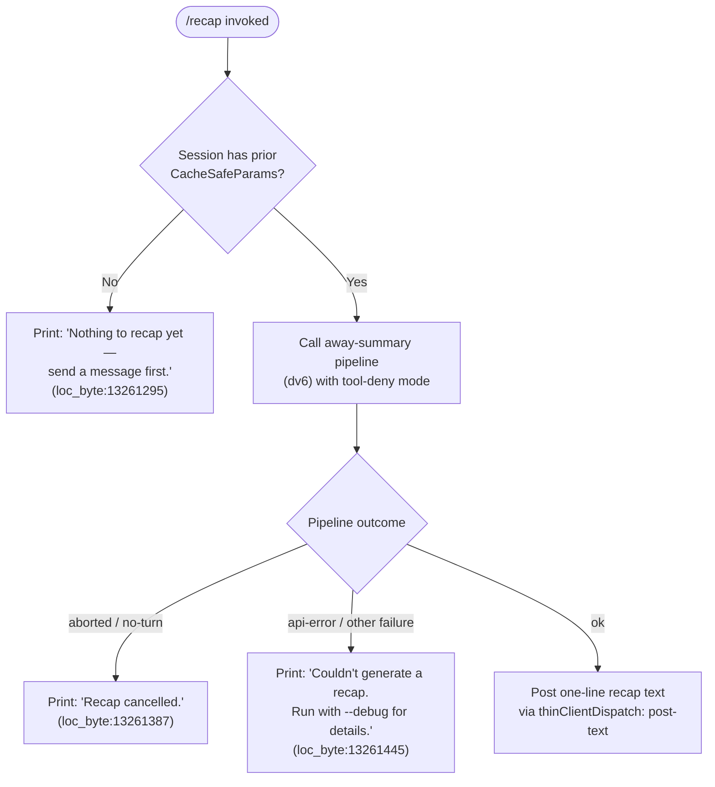

# `/recap`

> Analysis basis: CC v2.1.174 bundle.js (AST extraction + Claude interpretation)
> Minimum version: v2.1.174

---

## Overview

The `/recap` command triggers an on-demand, one-line summary of the current Claude Code session. It is implemented as an async handler (`p65`) that delegates to a specialised "away summary" pipeline (`dv6`), which invokes the model with a constrained, tool-free prompt. The result is posted as plain text back to the conversation.

---

## Registration

| Field | Value |
|---|---|
| type | `local` |
| name | `recap` |
| description | `Generate a one-line session recap now` |
| loc_byte | `13261545` |
| loc_byte_end | `13261761` |
| loc_line | `9688` |
| supportsNonInteractive | `false` |
| thinClientDispatch | `post-text` |
| load_inline | `true` |
| load_ident | `p65` |
| arbor_handler.name | `p65` |
| arbor_handler.fqn | `claude-2.1.174::p65` |
| arbor_handler.kind | `AsyncFunction` |
| arbor_handler.resolution_path | `load_ident` |
| arbor_handler.n_hits | `0` |

Analysis basis: CC v2.1.174 bundle.js:+13261545

---

## Input Branching

The command has four distinct outcome branches depending on session state and the result returned by the away-summary pipeline.



---

## Behavioral Spec

### Top-Level Handler — `recapCommandHandler` (`p65`)

```
async function recapCommandHandler(context):
    result = await awaySummaryPipeline(context)   // dv6
    return result
```

Analysis basis: CC v2.1.174 bundle.js:+13261153

---

### Away-Summary Pipeline — `awaySummaryPipeline` (`dv6`)

This is the core logic. It checks whether the session has a saved `CacheSafeParams` snapshot (the parameters cached from the most recent conversation turn). If none exists, the session has not yet exchanged any messages and there is nothing to summarise.

```
async function awaySummaryPipeline(context):

    // Guard: require at least one prior turn
    params = getCacheSafeParams(context)           // P9H
    if params is null:
        log("[awaySummary] no CacheSafeParams saved, skipping")
        // literal at loc_byte:6950259
        return { status: "no-turn" }               // literal at loc_byte:6950317

    // Set up an AbortController for cancellation
    controller = new AbortController()
    context.signal.addEventListener("abort",
        () => controller.abort())                  // loc_byte:6950354, 6950373/6950385

    // Configure a tool-deny interceptor so the model cannot
    // call any tools during the recap generation
    toolInterceptor = buildToolDenyInterceptor(    // implicit, see denyLiteral below
        reason = "Away summary cannot use tools"   // literal at loc_byte:6950565
    )

    // Invoke the agent query loop in "away_summary" mode
    queryResult = await agentQueryLoop(            // kT
        params          = params,
        signal          = controller.signal,
        mode            = "away_summary",          // literal at loc_byte:6950633
        toolPolicy      = "deny",                  // literal at loc_byte:6950550
        ...
    )

    // Evaluate outcome
    switch queryResult.status:
        case "aborted":                            // literal at loc_byte:6950777
            return { status: "aborted" }
        case "api-error":                          // literal at loc_byte:6950866
            return { status: "api-error" }
        case "ok":                                 // literal at loc_byte:6950927
            flattenedText = flattenMessages(queryResult.messages)  // ao9 / H.flatMap
            return { status: "ok", text: flattenedText }
```

Analysis basis: CC v2.1.174 bundle.js:+6950238

---

### Result Rendering in `recapCommandHandler` (`p65`)

After `awaySummaryPipeline` returns, `p65` maps the status to the appropriate user-visible string and posts it via the `post-text` thin-client dispatch path.

```
function renderRecapOutcome(pipelineResult):
    switch pipelineResult.status:

        case "no-turn":
            return postText("Nothing to recap yet — send a message first.")
            // literal at loc_byte:13261295

        case "aborted":
            return postText("Recap cancelled.")
            // literal at loc_byte:13261387

        case "api-error" | other failure:
            return postText(
                "Couldn't generate a recap. Run with --debug for details."
            )
            // literal at loc_byte:13261445

        case "ok":
            return postText(pipelineResult.text)
            // dispatched via thinClientDispatch: post-text
```

Analysis basis: CC v2.1.174 bundle.js:+13261295 – +13261445

---

### Agent Query Loop — `agentQueryLoop` (`kT`)

The away-summary call reuses the same general-purpose agent query loop that powers normal turns, but with specific constraints enforced:

```
async function agentQueryLoop(params, signal, mode, toolPolicy, ...):

    // Resolve the "main" thread type
    threadType = "main"                            // literal at loc_byte:10704963
    startTime  = Date.now()                        // loc_byte:10704651

    // Build session snapshot (sS8): reads appState, assigns UUID, etc.
    sessionSnapshot = buildSessionSnapshot(params) // sS8, loc_byte:10704774

    // Apply tool-deny policy when toolPolicy == "deny"
    // (no tool additions via NH.addTool for this path)

    // Run the main agent loop (bT7)
    loopResult = await mainAgentLoop(sessionSnapshot, signal, ...)

    // Post-loop: apply LR (session ID normalisation / random-bytes stamp)
    // loc_byte:10705006

    // Handle fork-agent queries if spawned (aqH / aT7)
    // loc_byte:10705030, 10706329

    return loopResult
```

Analysis basis: CC v2.1.174 bundle.js:+10704651

---

### Conversation Log Writer — `conversationLogWriter` (`h1f`)

During the away-summary turn the conversation log subsystem persists the generated recap message. Key steps observed in the call graph:

```
async function conversationLogWriter(entry, logDir):

    // Determine log directory via path utilities (M8H.dirname, loc_byte:210212)
    dir = path.dirname(logDir)

    // Ensure directory exists (xk.mkdir, loc_byte:209933 via N1f)
    await fs.mkdir(dir, { recursive: true })

    // Append entry to log file (xk.appendFile, loc_byte:209992 via N1f)
    await fs.appendFile(logPath, serialize(entry))

    // Rotate log file if it exceeds size threshold (Qt8)
    //   - stat the file (xk.stat, loc_byte:209504)
    //   - rename to .txt backup (H.endsWith ".txt", loc_byte:209608)
    //   - unlink oversized file (xk.unlink, loc_byte:209700)

    // Register cleanup hook (R9 -> qvA.register, loc_byte:63875)
```

Analysis basis: CC v2.1.174 bundle.js:+210179

---

### Session-ID Normalisation — `normaliseSessionId` (`LR`)

```
function normaliseSessionId(raw):
    if FVA.test(raw):                              // regex test, loc_byte:7209151
        return raw.replace(FVA, "")               // loc_byte:7209165
    // Generate fresh hex token: 63 random bytes -> hex slice of 8 chars
    // mW8.randomBytes(63) at loc_byte:7209207, length 8 (loc_byte:7209223), encoding "hex"
    return crypto.randomBytes(63).toString("hex").slice(0, 8)
```

Analysis basis: CC v2.1.174 bundle.js:+7209151

---

### Message Flattener — `flattenRecapMessages` (`ao9`)

```
function flattenRecapMessages(messages):
    // Flatten all message content blocks into a single text string
    return messages.flatMap(msg => extractTextBlocks(msg))
    // H.flatMap at loc_byte:6951093
```

Analysis basis: CC v2.1.174 bundle.js:+6950883

---

## State & Side Effects

| Item | Detail |
|---|---|
| Telemetry (query loop) | `tengu_auto_compact_rapid_refill_breaker`, `tengu_auto_compact_succeeded`, `tengu_ptl_surfaced_to_user`, `tengu_refusal_fallback_suppressed`, `tengu_rotunda_pennant_applied`, `tengu_rotunda_pennant_tools`, `tengu_refusal_fallback_dialog_suppressed`, `tengu_refusal_fallback_prompt_shown`, `tengu_refusal_fallback_prompt_choice`, `tengu_fallback_credit_forfeited`, `tengu_convolute_arcades_retry`, `tengu_refusal_fallback_triggered`, `tengu_orphaned_messages_tombstoned`, `tengu_refusal_fallback_supersedes`, `tengu_convolute_arcades_retry_outcome`, `tengu_model_fallback_triggered`, `tengu_query_error`, `tengu_model_response_keyword_detected`, `tengu_malformed_tool_use_retry_outcome`, `tengu_malformed_tool_use_response`, `tengu_stop_hook_block_count`, `tengu_loop_dynamic_wakeup_ends_turn`, `tengu_post_autocompact_turn`, `tengu_query_before_attachments`, `tengu_query_after_attachments`, `tengu_mcp_tools_refreshed_mid_turn`, `tengu_forked_agent_default_turns_exceeded`, `tengu_fork_agent_query` |
| Telemetry (feature flags) | `tengu_feature_ok`, `tengu_feature_bad` |
| Tool policy | Tool usage is explicitly denied for the recap turn; any tool-use attempt triggers the "Away summary cannot use tools" guard |
| appState reads | `H.getAppState` (inside `sS8`, loc_byte:10701801); `x.getAppState` (inside `bT7`, loc_byte:10653791); `H8.getAppState` (inside `bT7`, loc_byte:10680348) |
| appState writes | `H.setAppState` (inside `sS8`, loc_byte:10702965); `x.setAppState` (inside `bT7`, loc_byte:10658256) |
| Conversation log | Entry appended via `xk.appendFile`; directory created via `xk.mkdir`; log rotation via `xk.stat` / `xk.rename` / `xk.unlink` |
| AbortController | A fresh `AbortController` is created; it is wired to the parent signal so that user cancellation propagates cleanly |
| Hook registration | Cleanup hook registered via `qvA.register` (loc_byte:63875) through `R9` |
| Sound | None observed in depth-2 traversal |
| Non-interactive | `supportsNonInteractive: false` — command will not execute in `--non-interactive` / pipe mode |

---

## Version History

| Version | Change |
|---|---|
| v2.1.174 | Initial analysis |

---

## Common Mistakes

1. **Running `/recap` before sending any message** — the command immediately returns "Nothing to recap yet — send a message first." because no `CacheSafeParams` snapshot exists. At least one completed conversation turn is required.
2. **Expecting tool output in the recap** — the pipeline explicitly denies all tool calls during recap generation. The model is restricted to text-only output; any tool-use attempt from the model is blocked.
3. **Using in non-interactive mode** — `supportsNonInteractive` is `false`. Invoking `/recap` in a piped or `--non-interactive` session will not work as expected.
4. **Interpreting "Couldn't generate a recap" without debug info** — when an API error occurs the user-visible message is intentionally terse. Rerunning with `--debug` is the recommended way to see the underlying error.
5. **Assuming `/recap` creates a new conversation turn** — it reuses the existing `CacheSafeParams` snapshot from the most recent turn rather than starting a fresh turn, so the main conversation history is not modified.

---

## Appendix — Identifier Mapping

> For bundle debugging only. Identifiers change across versions.

| Identifier | Role |
|---|---|
| `p65` | Top-level recap command handler (`AsyncFunction`); resolved via `load_ident` |
| `dv6` | Away-summary pipeline orchestrator |
| `P9H` | CacheSafeParams retriever |
| `N` | Conversation-log serialiser / debug logger |
| `Z1f` | Log entry formatter |
| `fvA` | Log field encoder |
| `RH` | JSON stringifier wrapper |
| `df` | Log path builder / string manipulation helper |
| `UhA` | Log metadata mapper |
| `q` | Conversation data store accessor |
| `A` | String normalisation / lowercase helper |
| `VgH` | Log writer dispatcher |
| `hhA` | Underlying stream write helper |
| `h1f` | Conversation log writer (file I/O) |
| `oFH` | Async write-queue / debounce scheduler |
| `sfH` | Log flush coordinator |
| `r6` | Log path resolver |
| `C36` | EISDIR guard helper |
| `ghA` | Log file path joiner |
| `Qt8` | Log rotation handler |
| `N1f` | Directory-create + append-file helper |
| `R9` | Cleanup hook registrar |
| `kT` | Agent query loop entry point |
| `sS8` | Session snapshot builder |
| `ob` | Session initialisation helper |
| `AMH` | State load/dump helper |
| `mPH` | Prompt-avoid filter |
| `MQ9` | Model-params builder |
| `M` | Message router / turn dispatcher |
| `tb8` | Token budget tracker |
| `LR` | Session-ID normaliser (regex + random-bytes) |
| `tS8` | Thread-type resolver |
| `aqH` | Fork-agent dispatcher |
| `M4` | Fork-agent hook registrar |
| `amH` | Fork-agent message filter |
| `MU` | Main-loop entry for model interaction |
| `bT7` | Core agent loop implementation |
| `Kb8` | Subagent exit / cleanup handler |
| `kH` | Feature-flag check (ok path) |
| `CH` | Feature-flag check (bad path) |
| `JE` | Turn-end event emitter |
| `xb6` | Tool-use summary builder |
| `CHH` | Conversation-history compressor |
| `_x8` | Expanded-view state toggler |
| `LQq` | Post-turn summary formatter |
| `Y` | Process-exit / abort coordinator |
| `_X` | Forced-shutdown handler |
| `z` | Daemon-stop controller |
| `oMH` | Pending-message filter and pusher |
| `pJ` | Message selector helper |
| `fCL` | Message finder |
| `f` | Promise-lifecycle tracker |
| `c` | Feature-gate evaluator |
| `aT7` | Forked-agent turn runner |
| `A6` | Telemetry event emitter |
| `m8` | Subagent / sandbox session spawner |
| `P` | IPC/stream message parser |
| `X` | Stream timeout manager |
| `j` | Process kill helper |
| `R7` | Stream-end / JSON serialise helper |
| `YZ5` | Daemon session manager (PTY lifecycle) |
| `TH` | String-coercion utility |
| `ao9` | Recap message flattener |

---

Note: index built via Arbor fallback; some signals (telemetry, literals) may be missing — see arbor-fallback.js.