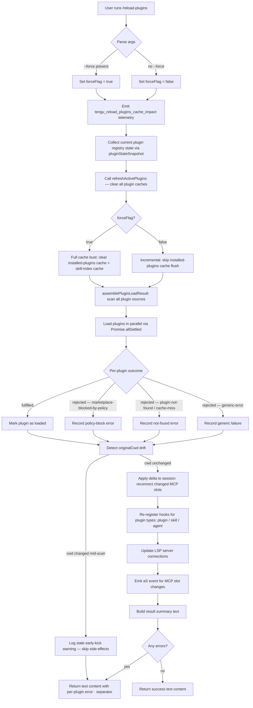

# `/reload-plugins`

> Analysis basis: CC v2.1.174 bundle.js (AST extraction + Claude interpretation)
> Minimum version: v2.1.174

---

## Overview

`/reload-plugins` activates pending plugin changes in the current session without requiring a full restart. It re-scans all plugin sources (skills, MCP servers, agents, LSP servers), refreshes caches, reconnects changed MCP slots, and optionally forces a full cache bust via `--force`. The command operates as an async pipeline: it collects active plugin state, resolves any delta from on-disk configuration, applies the delta to the running session, and reports per-plugin outcomes as structured text.

---

## Registration

| Field | Value |
|---|---|
| type | `local` |
| name | `reload-plugins` |
| description | `Activate pending plugin changes in the current session` |
| argumentHint | `[--force]` |
| supportsNonInteractive | `false` |
| thinClientDispatch | `control-request` |
| module_id | `oOK` |
| load_inline | `true` |
| loc_byte | `12858611` |
| loc_byte_end | `12858855` |
| loc_line | `9119` |
| arbor_handler.name | `or7` |
| arbor_handler.fqn | `claude-2.1.174::or7` |
| arbor_handler.kind | `AsyncFunction` |
| arbor_handler.resolution_path | `module_id` |
| arbor_handler.n_hits | `0` |

Analysis basis: CC v2.1.174 bundle.js:+12858611

---

## Input Branching

The handler has four or more distinct paths depending on the `--force` flag, the presence of stale cache, per-plugin load outcomes, and the type of plugin source being processed. A flowchart is mandatory here.



Analysis basis: CC v2.1.174 bundle.js:+12857309, +12857695, +12857731, +12857809, +10974864, +10975017

---

## Behavioral Spec

### Handler Entry — `reloadPluginsHandler` (bundle: `or7`)

```
async function reloadPluginsHandler(args, context):
    # Parse --force flag
    rawArgs = args.trim()                          # bundle.js:+12857695
    forceFlag = rawArgs includes "--force"         # bundle.js:+12857731, +12857746

    # Emit cache-impact telemetry unconditionally
    emit tengu_reload_plugins_cache_impact         # bundle.js:+12856603

    # Snapshot current plugin registry
    snapshot = pluginStateSnapshot(context)        # via sr → x8 at +12857405

    # Dispatch to refreshActivePlugins
    refreshResult = await refreshActivePlugins(
        context, forceFlag
    )                                              # via VOH at +12858041

    # Collect load result and build output text
    summary = buildResultText(refreshResult)       # via K1H at +12858116

    return { type: "text", text: summary }         # bundle.js:+12857673
```

Analysis basis: CC v2.1.174 bundle.js:+12857309

---

### Plugin State Snapshot — `pluginStateSnapshot` (bundle: `sr → x8`)

```
function pluginStateSnapshot(context):
    # Reads the current active plugin registry without mutating it.
    # Returns a map of plugin-id → active-state for delta comparison.
    return currentPluginRegistry.snapshot()        # bundle.js:+12857405
```

Analysis basis: CC v2.1.174 bundle.js:+12857405

---

### Active Plugin Refresh — `refreshActivePlugins` (bundle: `VOH`)

This is the core orchestration function. It coordinates cache clearing, source re-scanning, MCP slot reconnection, and hook re-registration.

```
async function refreshActivePlugins(context, forceFlag):
    log "refreshActivePlugins: clearing all plugin caches"  # bundle.js:+12854281

    # Step 1 — Clear caches
    clearPluginCaches(forceFlag)                   # via h$ at +12854339

    # Step 2 — Reload MCP config from all sources
    mcpConfig = await loadMcpConfig()              # via fe at +12854585
      # Sources examined (in order of precedence):
      #   projectSettings (.mcp.json)              # bundle.js:+6486735, +6486995
      #   userSettings                             # bundle.js:+6486758
      #   localSettings                            # bundle.js:+6486779
      #   policySettings                           # bundle.js:+3342902
      #   mcpAutoDiscovered                        # bundle.js:+6488464

    # Step 3 — Assemble plugin load result
    loadResult = await assemblePluginLoadResult(context, mcpConfig)
      # bundle.js:+10974864 (plugin_load_all event key)

    # Step 4 — Check for cwd drift
    if context.originalCwd changed mid-scan:
        log "assemblePluginLoadResult: originalCwd changed mid-scan; skipping side-effects"
        # bundle.js:+10975017
        return buildErrorResult(loadResult)

    # Step 5 — Reduce loaded plugins into slot map
    slotMap = loadResult.reduce(buildSlotMap)      # via $.reduce at +12854815

    # Step 6 — Compute delta against current MCP manager state
    delta = computeDelta(currentState, slotMap)    # via O.reduce at +12854840

    # Step 7 — Apply delta: reconnect changed MCP slots
    await applyMcpDelta(delta)                     # via sP8 at +12854874

    # Step 8 — Re-register plugin hooks (plugin / skill / agent types)
    registerPluginHooks(loadResult)                # via ir7 / rr7 at +12854957, +12854990
      # Plugin type literals: "plugin", "skill", "agent"  # bundle.js:+12857425, +12857456, +12857484

    # Step 9 — Update LSP servers
    updateLspServers(loadResult)                   # via LMH at +12855141

    # Step 10 — Emit session event
    aS.emit(sessionUpdateEvent)                    # bundle.js:+12855387

    return { slotMap, loadResult }
```

Analysis basis: CC v2.1.174 bundle.js:+12854279, +12854388, +12855387

---

### Cache Clearing — `clearPluginCaches` (bundle: `h$`)

```
function clearPluginCaches(forceFlag):
    # Always clears the primary plugin resolution cache
    clearResolutionCache()                         # via DV7 at +10863046

    # Always clears the skill-index cache
    clearSkillIndexCache()                         # via Sp → H.clearSkillIndexCache at +13444487

    if forceFlag:
        # Additionally clears the installed-plugins disk cache
        clearInstalledPluginsCache()               # via cV at +10863052
        log "Cleared installed plugins cache"      # bundle.js:+10899150

    # Always clears the in-memory plugin root cache
    clearPluginRootCache()                         # via Hp → nb6.clear at +10832808
```

Analysis basis: CC v2.1.174 bundle.js:+10863046, +13444487, +10899150

---

### Plugin Load Assembly — `assemblePluginLoadResult` (bundle: `Y4A`)

```
async function assemblePluginLoadResult(context, mcpConfig):
    results = []

    # Load plugins from all sources concurrently
    tasks = []
    for each pluginSource in mcpConfig.sources:
        tasks.push(loadPluginSource(pluginSource))  # bundle.js:+10974284

    # Uses Promise.all for parallel loading
    rawResults = await Promise.all(tasks)           # bundle.js:+10974284

    # Assemble final result record
    for each rawResult in rawResults:
        outcome = classifyOutcome(rawResult)

        switch outcome:
            case "fulfilled":                       # bundle.js:+10956341
                results.push({ status: "ok", plugin: rawResult.value })
            case "rejected":                        # bundle.js:+10956397
                errorKind = classifyError(rawResult.reason)
                # Known error kinds (bundle.js literals):
                # "marketplace-blocked-by-policy"   # +10955032
                # "marketplace-not-found"           # +10955586
                # "marketplace-load-failed"         # +10955778
                # "cache-miss"                      # +10955834
                # "plugin-not-found"                # +10955872
                # "generic-error"                   # +10956513
                results.push({ status: "error", kind: errorKind })

    # Emit aggregate telemetry
    emit "plugin_load_all" with totalCount           # bundle.js:+10974864
    if allFailed:
        emit "plugin_load_total_failure"             # bundle.js:+10974882
    elif someFailed:
        emit "plugin_load_partial_failures"          # bundle.js:+10974951

    return results
```

Analysis basis: CC v2.1.174 bundle.js:+10974864, +10974882, +10974951, +10956341, +10956397

---

### MCP Config Loading — `loadMcpConfig` (bundle: `Le → O2`)

```
async function loadMcpConfig():
    configs = []

    # Walk directory hierarchy for .mcp.json files
    dirChain = buildDirChain(cwd)                  # bundle.js:+6486907, +6486937
    for each dir in dirChain:
        candidate = path.join(dir, ".mcp.json")    # bundle.js:+6486995
        if exists(candidate):
            configs.push(parse(candidate))

    # Merge in order: project → user → local → policy → autoDiscovered
    merged = merge(
        projectSettings,    # bundle.js:+6486735
        userSettings,       # bundle.js:+6486758
        localSettings,      # bundle.js:+6486779
        policySettings,     # bundle.js:+3342902
        mcpAutoDiscovered   # bundle.js:+6488464
    )

    # Validate; on failure classify as "mcp-config-invalid"  # bundle.js:+6488958
    return merged
```

Analysis basis: CC v2.1.174 bundle.js:+6486686, +6486995, +6488464

---

### MCP Slot Delta & Reconnection — `applyMcpDelta` (bundle: `sP8 → NGA → HCH`)

```
async function applyMcpDelta(delta):
    for each (serverId, newConfig) in delta.changed:
        existing = mcpSlotMap.get(serverId.toLowerCase())  # bundle.js:+6795054

        if existing and configChanged(existing, newConfig):
            # Reconnect: stop old, start new
            existing.stop()
            newClient = createMcpClient(newConfig)

            # Transport types handled:
            # "stdio"        # bundle.js:+6745183
            # "sse"          # bundle.js:+6745217
            # "sse-ide"      # bundle.js:+6745282
            # "ws-ide"       # bundle.js:+6745318
            # "claudeai-proxy"  # bundle.js:+6745590

            connectResult = await newClient.connect()
            applyConnectionResult(serverId, connectResult)  # via Mi8 at +16521676

    for each serverId in delta.removed:
        mcpSlotMap.get(serverId).cleanup()

    for each (serverId, config) in delta.added:
        newClient = createMcpClient(config)
        await newClient.connect()
        mcpSlotMap.set(serverId, newClient)
```

Analysis basis: CC v2.1.174 bundle.js:+6795054, +6745183, +16520857, +16520942

---

### Plugin Hook Registration — `registerPluginHooks` (bundle: `ir7`, `rr7`)

```
function registerPluginHooks(loadResult):
    # Safe mode check: skip hook registration when --safe-mode flag active
    # "Safe mode: skipping plugin hook registration"  # bundle.js:+5091716

    lspManagerPlugins = loadResult.filter(
        p => p.source == "lsp-manager"              # bundle.js:+12855802
    )
    pluginPrefixPlugins = loadResult.filter(
        p => p.source.startsWith("plugin:")         # bundle.js:+12855837
    )

    for each plugin in pluginPrefixPlugins:
        registerHook(plugin, hookType: "hook")      # bundle.js:+12858290

    for each lsp in lspManagerPlugins:
        registerLspServerHook(lsp)                  # bundle.js:+12858349 ("plugin LSP server")
```

Analysis basis: CC v2.1.174 bundle.js:+12855777, +12855859, +5091716

---

### Result Text Building — `buildResultText` (bundle: `K1H`)

```
function buildResultText(loadResult):
    # Formats per-plugin outcomes into a human-readable string.
    # Uses " · " as separator between plugin name and status.  # bundle.js:+12857543

    lines = loadResult.map(entry =>
        formatEntry(entry)                           # via f1, H.map at +4301025, +4301036
    )
    return lines.join("\n")
```

Error entries are formatted as:
`<pluginName> · <errorKind>`

where `errorKind` is one of the literals listed in `assemblePluginLoadResult` above.

Analysis basis: CC v2.1.174 bundle.js:+12858116, +12857543

---

### Force-Flag Warning Logic (bundle: `iOK`)

```
function checkForceImpact(context):
    # Checks if --force would invalidate in-flight context windows.
    # Emits a warning when the conversation cache would be evicted.
    # Warning text fragment: "the whole conversation instead of using the cache. Run /reload-plugins --force to apply."
    # bundle.js:+12857194

    if cacheWouldBeEvicted(context):
        emitWarning(warningText)

    emit tengu_reload_plugins_cache_impact          # bundle.js:+12856603
```

Analysis basis: CC v2.1.174 bundle.js:+12856327, +12856377, +12857194

---

## State & Side Effects

| Item | Detail |
|---|---|
| Telemetry | `tengu_reload_plugins_cache_impact` (bundle.js:+12856603) — always emitted on command run |
| Telemetry | `tengu_plugin_state_file_error` (bundle.js:+10899329) — emitted on plugin state file read failure |
| Telemetry | `tengu_daemon_config_reload` (bundle.js:+16873690) — emitted when daemon config is reloaded as part of MCP reconnection |
| Plugin cache cleared | In-memory resolution cache always cleared; installed-plugins disk cache cleared only with `--force` |
| Skill-index cache | Always cleared via `H.clearSkillIndexCache` (bundle.js:+13444487) |
| MCP slot state | Changed/added/removed MCP server connections are applied live (bundle.js:+6795095) |
| Hook registration | Plugin, skill, and agent hooks are re-registered; LSP server hooks updated (bundle.js:+12858290) |
| appState changes | `aS.emit` fires a session-level update event after delta is applied (bundle.js:+12855387) |
| `supportsNonInteractive` | `false` — command may not be used in non-interactive (headless) mode |
| `thinClientDispatch` | `control-request` — in thin-client mode the command is dispatched as a control request rather than executed locally |
| Sound | None observed in depth-2 traversal |

---

## Version History

| Version | Change |
|---|---|
| v2.1.174 | Initial analysis |

---

## Common Mistakes

1. **Using `--force` when not needed.** The `--force` flag evicts the installed-plugins disk cache and can cause the entire conversation context to be re-sent to the model (cache eviction warning at bundle.js:+12857194). Use plain `/reload-plugins` for routine config edits; reserve `--force` for situations where stale cached plugin binaries must be discarded.

2. **Running in non-interactive mode.** `supportsNonInteractive: false` means `/reload-plugins` will not execute correctly in headless or scripted pipelines. Use the daemon API or restart the session instead.

3. **Expecting immediate MCP tool availability.** MCP slot reconnection is asynchronous (`Promise.all`/`Promise.allSettled`). There is a brief window after the command completes during which tools from newly connected servers may not yet be callable.

4. **Ignoring the error summary.** The command always returns a text block. Individual plugin failures (e.g., `marketplace-blocked-by-policy`, `plugin-not-found`) are listed per-line separated by ` · `. A successful exit of the command does not mean every plugin loaded successfully.

5. **Running under `--safe-mode`.** When Claude Code is started with `--safe-mode`, hook registration is intentionally skipped (bundle.js:+5091716). `/reload-plugins` will still run but will not re-register plugin hooks, so hook-dependent features remain disabled.

---

## Appendix — Identifier Mapping

> For bundle debugging only. Identifiers change across versions.

| Identifier | Role |
|---|---|
| `or7` | Main handler — `reloadPluginsHandler` (AsyncFunction) |
| `JX` | Argument-parsing helper called from handler |
| `_L` | Low-level utility called by argument parser and handler |
| `yVH` | Sub-utility called by `_L` |
| `sr` | Plugin state snapshot collector |
| `x8` | Raw plugin registry reader |
| `iOK` | Force-flag impact checker / cache-eviction warning emitter |
| `mg9` | Plugin reload orchestration entry (calls `Le`) |
| `szH` | Plugin reload sub-helper |
| `hB_` | Plugin load pipeline stage |
| `Y4A` | `assemblePluginLoadResult` — async plugin load aggregator |
| `w4A` | Plugin source loader (marketplace, skills-dir, etc.) |
| `Le` | MCP config loading and slot management orchestrator |
| `Of` | Config source walker |
| `O2` | Per-directory `.mcp.json` loader |
| `t1H` | Config validator / parser |
| `TD` | Policy settings reader |
| `gw` | Config merge helper |
| `N` | General normaliser / classifier utility |
| `WX8` | MCP binary (`.mcpb`) handler |
| `NsH` | MCP server name normaliser |
| `D` | Daemon session manager |
| `Y` | Process exit / abort helper |
| `tV` | MCP transport builder |
| `oGL` | MCP slot registry updater |
| `w` | Supervisor/MCP process wrapper |
| `y` | Session state slice |
| `q` | CLI error reporter |
| `R1` | CLI exit handler |
| `pN` | Feature-gate evaluator |
| `xx_` | Feature-gate parser |
| `EyH` | HIPAA mode checker |
| `bx_` | `auto:` context-window parser |
| `f7L` | `auto:` prefix detector |
| `L6` | Boolean string normaliser (`yes`/`on`/`no`/`off`) |
| `OK` | Alternative boolean string normaliser |
| `Qt` | Provider/model name normaliser |
| `M7L` | Model list checker |
| `w6` | Feature-flag store accessor |
| `eY` | Output-token counter helper |
| `rOK` | App-state reader used inside handler |
| `c` | General callback / continuation |
| `ar7` | Argument splitter (`A.split`) |
| `VOH` | `refreshActivePlugins` — core refresh orchestrator |
| `Rcq` | Plugin resolution cache clearer |
| `h$` | `clearPluginCaches` — dispatches per-flag cache clears |
| `DV7` | Resolution cache clear dispatcher |
| `kW` | Cache-clear worker |
| `cV` | Installed-plugins cache clear (force path) |
| `Sp` | Skill-index cache clearer (calls `H.clearSkillIndexCache`) |
| `Hp` | In-memory plugin root cache clearer (`nb6.clear`) |
| `fe` | MCP config file loader (`.mcpb` / `.dxt` / `.mcp.json`) |
| `Eg` | File-extension checker (`.mcpb`, `.dxt`) |
| `JB_` | JSON config file reader |
| `Pg9` | Plugin source type router |
| `$V6` | `.mcpb` archive extractor |
| `ACH` | `.lsp.json` config loader |
| `uvL` | LSP config validator and path resolver |
| `xvL` | Relative-path validator |
| `mDK` | Daemon status writer |
| `sP8` | MCP slot delta applier / `applyMcpDelta` |
| `M` | MCP manager — top-level slot map |
| `HCH` | MCP client connector (per transport type) |
| `Mi8` | `applyConnectionResult` — post-connect slot updater |
| `NGA` | MCP retry / recovery controller |
| `ir7` | Plugin hook registrar (plugin/agent type filter) |
| `rr7` | Plugin hook registrar (skill type filter) |
| `LMH` | LSP server hook registrar |
| `dK` | Safe-mode flag checker |
| `fOH` | Plugin install / dependency resolution orchestrator |
| `Dv` | Marketplace config reader |
| `wM` | `known_marketplaces.json` loader |
| `cx8` | Marketplace config path builder |
| `fSH` | Plugin manifest entry parser |
| `C8` | Plugin type classifier |
| `BV` | Managed-scope install guard |
| `f1` | Plugin identifier parser (includes / split) |
| `oX` | Plugin source URL router |
| `vr9` | Git URL parser |
| `hv6` | Plugin source classifier |
| `G28` | Plugin type dispatcher |
| `GU` | Marketplace plugin loader |
| `Ax6` | Marketplace index path builder |
| `afA` | Marketplace JSON parser |
| `XZ` | Local plugin loader |
| `tfA` | Plugin file reader |
| `Pu7` | Plugin presence checker |
| `Dx6` | Full plugin install pipeline |
| `AG` | Plugin type guard |
| `Hu8` | Plugin source parser |
| `dw6` | Local-path prefix checker (`./`) |
| `Yv` | Plugin-from-disk loader (`load-from-disk` path) |
| `efA` | Plugin JSON file reader (sync) |
| `H4A` | Plugin manifest entry iterator |
| `Lx6` | Plugin validation error formatter |
| `J` | Daemon session set |
| `G` | Input/keydown handler (editor layer — unrelated to plugin logic but reached via call graph) |
| `NN` | Dependency validator |
| `VT` | Version checker |
| `oz8` | semver satisfaction checker |
| `tj9` | Dependency graph cycle detector |
| `rv` | Flag-settings merger |
| `Bcq` | Dependency resolution cache |
| `fA` | Settings writer |
| `lO` | Settings cache clearer |
| `la6` | Settings file appender/writer |
| `wx6` | Plugin install path validator |
| `l` | Scheduled-task loop runner |
| `gT6` | Task next-fire-time calculator |
| `QY8` | Task overdue checker |
| `$H` | MCP SDK client wrapper |
| `MH` | MCP request timer |
| `Y8` | MCP debug logger |
| `A6` | Feature telemetry emitter |
| `gV6` | MCP elicitation form builder |
| `QV6` | MCP elicitation response builder |
| `vi` | Notification sender |
| `lX` | Elicitation queue manager |
| `wH` | Main session runner (`UqH` orchestration) |
| `MB8` | Session pre-flight checker |
| `UqH` | Session message loop |
| `K1H` | `buildResultText` — result formatter |
| `vn9` | MCP server connector (connect + capabilities) |
| `JH` | MCP slot reconciler |
| `tZ9` | IDE extension gate checker |
| `UrK` | CCD session resolver |
| `_SH` | OTEL metrics attribute builder |
| `mf` | OTEL event emitter |
| `do8` | OTEL event `do` action |
| `co8` | OTEL event `co` action |
| `K1H` | Result line formatter (dependency / dependency-resolution labels) |

---

Note: index built via Arbor fallback; some signals (telemetry, literals) may be missing — see arbor-fallback.js.