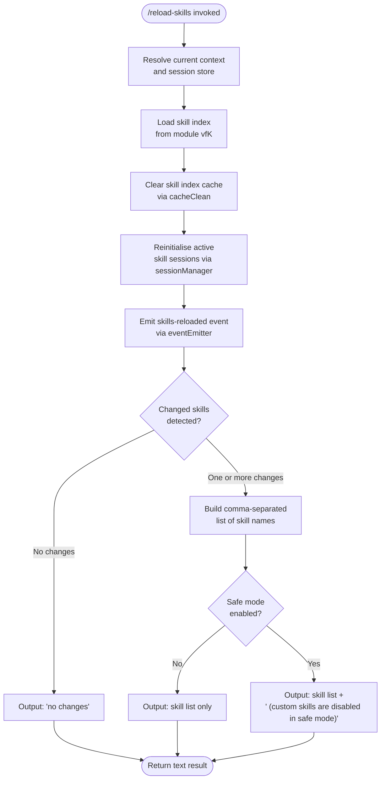

# `/reload-skills`

> Analysis basis: CC v2.1.170 bundle.js (AST extraction + Claude interpretation)
> Minimum version: v2.1.170

---

## Overview

`/reload-skills` rescans the on-disk skill definitions that were added or modified during the current session and reloads them into the running Claude Code process without requiring a full restart. It clears the in-memory skill index cache, reconnects or reinitialises active skill sessions, then emits a human-readable summary of which skills changed — or reports `"no changes"` when the on-disk state matches what was already loaded. In safe-mode runs, custom skills are disabled and a notice to that effect is appended to the output.

---

## Registration

| Field | Value |
|---|---|
| type | `local` |
| name | `reload-skills` |
| description | `Pick up skills added or changed on disk during this session` |
| supportsNonInteractive | `true` |
| thinClientDispatch | `post-text` |
| module_id | `vfK` |
| load_inline | `true` |
| loc_byte | `12755688` |
| loc_byte_end | `12755905` |
| loc_line | `9106` |
| arbor_handler.name | `Ngf` |
| arbor_handler.fqn | `claude-2.1.170::Ngf` |
| arbor_handler.kind | `AsyncFunction` |
| arbor_handler.resolution_path | `module_id` |
| arbor_handler.n_hits | `0` |

Analysis basis: CC v2.1.170 bundle.js:+12755688

---

## Input Branching

Four distinct output branches exist based on the safe-mode flag and the set of changed skills, mandating a Mermaid flowchart.



Analysis basis: CC v2.1.170 bundle.js:+12755197, +12755302, +12755330, +12755438, +12755458

---

## Behavioral Spec

### 1. Context and Store Resolution

```
async function reloadSkills(context):
    sessionStore  = getContextStore(context)          # via contextStoreAccessor → storeGet
    currentConfig = resolveCurrentConfig(sessionStore) # via configResolver
```

The handler (`Ngf`) begins by acquiring the current async-context store and resolving session configuration before touching any skill state.

Analysis basis: CC v2.1.170 bundle.js:+12755168, +1024472, +1024493, +1024523

---

### 2. Skill Index Cache Invalidation

```
async function invalidateSkillCache():
    skillIndexCache.clear()                    # clears the in-memory index map
    await skillIndexLoader.reload()            # re-reads definitions from disk
```

`IS` (mapped to `cacheClean`) calls `AC8.clear()` to wipe all cached skill metadata, ensuring the subsequent index reload reflects on-disk state rather than stale memory.

Analysis basis: CC v2.1.170 bundle.js:+12755222, +10742403

---

### 3. Skill Session Reinitialisation

```
async function reinitialiseSkillSessions(skillList):
    for each skill in skillList:
        session = sessionManager.get(skill.id)     # AS8.get
        if session exists:
            await session.close()                  # A.close / q.close
        newSession = openSession(skill)            # sessionPool.add
        sessionPool.trackActive(newSession)
        newSession.finally(() => sessionPool.delete(skill.id))
```

The handler iterates over all known skills, closes any existing live sessions (depth-0 index at byte `+0`), opens fresh sessions, and registers a cleanup finaliser that removes the entry from the active session pool on completion.

Analysis basis: CC v2.1.170 bundle.js:+12755255, +16535711, +16535720, +16541762, +16541772, +10267128, +10266788

---

### 4. Event Emission

```
function emitReloadEvent(eventEmitter, skillList):
    eventEmitter.emit("skill-reload-complete", skillList)
```

After session reinitialisation, `NS.emit` fires a named event that other subsystems (e.g. the UI layer) can subscribe to.

Analysis basis: CC v2.1.170 bundle.js:+12755275

---

### 5. Change-Set Computation and Output Formatting

```
function buildOutput(reloadedSkillNames, safeMode):
    changedNames = [name for name in reloadedSkillNames if changedSet.has(name)]

    if changedNames is empty:
        resultText = "no changes"
    else:
        paddedNames = [name.padEnd(40) for name in changedNames]  # column width = 40
        resultText  = paddedNames.join(", ")

    if safeMode:
        resultText += " (custom skills are disabled in safe mode)"

    return { type: "text", content: resultText }
```

- The changed-skill set is checked with `K.has` (Analysis basis: CC v2.1.170 bundle.js:+12755302).
- A per-skill `.has` check on the active-file set filters further (Analysis basis: CC v2.1.170 bundle.js:+12755330).
- Each skill name is right-padded to **40 characters** for tabular alignment (Analysis basis: CC v2.1.170 bundle.js:+16556564).
- Names are joined with `", "` (Analysis basis: CC v2.1.170 bundle.js:+12755432).
- The literal `"no changes"` is emitted when the change set is empty (Analysis basis: CC v2.1.170 bundle.js:+12755438).
- The safe-mode suffix `" (custom skills are disabled in safe mode)"` is appended when the flag is active (Analysis basis: CC v2.1.170 bundle.js:+12755458).
- The return value carries `type: "text"` (Analysis basis: CC v2.1.170 bundle.js:+12755518).

---

### 6. Safe-Mode Detection

```
function isSafeMode(config):
    flagValue = config.get("--safe-mode")   # Yg6 lookup
    return flagValue == "yes" or flagValue == "on"
```

Safe-mode is determined by inspecting the `--safe-mode` CLI flag; accepted truthy values are `"yes"` and `"on"`.

Analysis basis: CC v2.1.170 bundle.js:+64546, +27175, +27181

---

### 7. Background-Session and Error Handling

```
function handleSessionState(session):
    if session.status == "stopped":
        label = "background session"
        reportState(session, label)    # S8 path → "stopped" / "background session"

function handleCliError(err):
    console.error(redFormat(err.message))   # w6.red
    writeErrorLog("cli_error", err)         # aj → $FH.writeFileSync
    process.exit(1)
```

Stopped background sessions are annotated with the label `"background session"` (Analysis basis: CC v2.1.170 bundle.js:+16566597, +16566640). Fatal CLI errors are printed in red, written to the error log under the key `"cli_error"`, and terminate the process with exit code `1` (Analysis basis: CC v2.1.170 bundle.js:+13231063, +13231077, +13231118, +13231144).

---

### 8. Skill Index Loader Internals

```
async function loadSkillIndex(options):
    data = await readSkillData()        # Y1 → "data" field
    chunkSize = 1024                    # internal read buffer size
    entries = parseSkillEntries(data, chunkSize)
    return entries
```

The skill index loader reads raw data (field key `"data"`) in **1024-byte** chunks (Analysis basis: CC v2.1.170 bundle.js:+16436065, +16436118). Random jitter (`Math.random * 2`) and `setTimeout` are used internally for retry back-off in the cache-warming helper (Analysis basis: CC v2.1.170 bundle.js:+13939350, +13939389, +13939352).

---

## State & Side Effects

| Item | Detail |
|---|---|
| Telemetry | None detected in depth-2 traversal |
| Skill index cache | Cleared unconditionally via `cacheClean` (`AC8.clear`) on every invocation |
| Session pool | All active skill sessions closed and reopened; finaliser removes each from pool |
| Event bus | `NS.emit` fires a skill-reload-complete event after sessions are rebuilt |
| appState changes | Skill index in memory is replaced; background-session state labels updated |
| Error log | `writeFileSync` path (`aj`) records `"cli_error"` entries on fatal errors |
| Process exit | `process.exit(1)` called on unrecoverable CLI errors |
| Safe-mode notice | Appended to output text; does **not** abort execution |
| Sound | None detected |

---

## Version History

| Version | Change |
|---|---|
| v2.1.170 | Initial analysis |

---

## Common Mistakes

1. **Running in safe mode and expecting custom skills to reload**: `/reload-skills` will still execute and clear the cache, but custom skills remain disabled; the output will include the safe-mode notice.
2. **Expecting immediate effect for unchanged files**: Only skills whose on-disk content differs from the cached version appear in the change-set summary. Files not modified since the last load show as absent from the output (not as errors).
3. **Calling the command during a background session**: Background sessions are labelled `"stopped"` internally; skill sessions tied to a stopped background session are reinitialised, but the background-session lifecycle itself is not altered by this command.
4. **Assuming telemetry is emitted**: No `tengu_*` telemetry events were found in the depth-2 call graph for this command; do not rely on skill-reload events appearing in telemetry dashboards.
5. **Confusing `thinClientDispatch: "post-text"` with interactive output**: In thin-client / non-interactive mode (`supportsNonInteractive: true`), the result is posted as plain text; rich formatting is not applied.

---

## Appendix — Identifier Mapping

> For bundle debugging only. Identifiers change across versions.

| Identifier | Role |
|---|---|
| `Ngf` | Main handler (`AsyncFunction`) for `/reload-skills` — Arbor FQN `claude-2.1.170::Ngf` |
| `C6` | Context / session-store resolver |
| `oi6` | Async-context store accessor wrapper |
| `Id` | Inner store getter (called by `oi6`) |
| `W_` | Config resolver / argument parser entry |
| `xZ` | Low-level config read helper (called by `W_`) |
| `q` | Skill data loader / index fetch function |
| `Y1` | Skill-data parse and chunk handler |
| `JpH` | CLI error formatter (red output + console.error) |
| `aj` | Error-log file writer (`writeFileSync` wrapper) |
| `XV` | Skill session reinitialisation orchestrator |
| `Yp` | Skill index cache reload helper (calls `clearSkillIndexCache`) |
| `H` | Cache-warm retry scheduler (uses `Math.random` + `setTimeout`) |
| `OC8` | Post-reload hook or observer (called by `XV`) |
| `CUq` | Post-reload hook or observer (called by `XV`) |
| `WuH` | Session manager accessor |
| `PR6` | Active session pool implementation |
| `jR6` | Session pool helper (called by `PR6`) |
| `IS` | Skill index cache cleaner (`AC8.clear` caller) |
| `L` | Session lifecycle manager (open/close/finalise) |
| `f` | Individual session object (has `.close`, `.finally`, `.toLowerCase`) |
| `A` | Session name normaliser (calls `f.toLowerCase`) |
| `F8` | Output builder / formatter |
| `_` | Inner formatting utility (called by `F8`) |
| `K` | Changed-skill set checker (calls `.has`, `.map`, `.padEnd`) |
| `O` | Output string accumulator (`.push` / `.join`) |
| `S8` | Background-session state reporter |
| `xK` | Safe-mode flag reader |
| `_6` | CLI flag value coercer (calls `String`) |
| `Yg6` | `--safe-mode` flag lookup helper |

---

Note: index built via Arbor fallback; some signals (telemetry, literals) may be missing — see arbor-fallback.js.