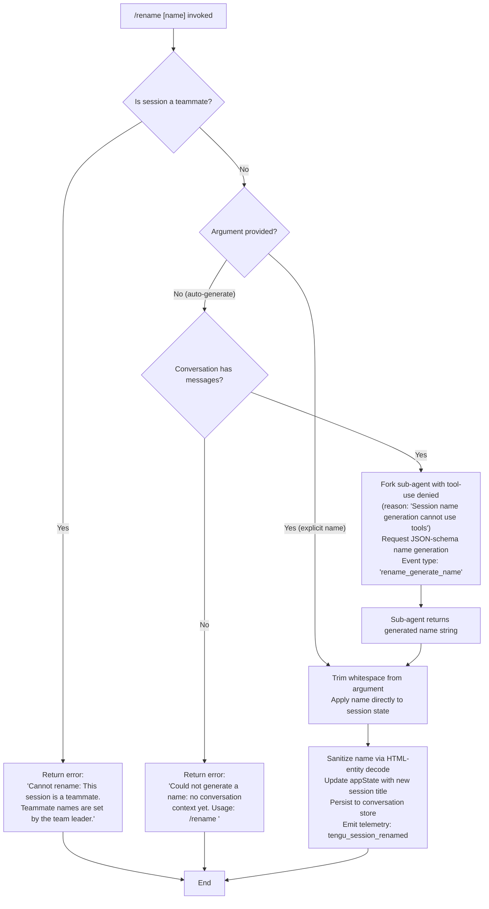

# `/rename`

> Analysis basis: CC v2.1.174 bundle.js (AST extraction + Claude interpretation)
> Minimum version: v2.1.174

---

## Overview

The `/rename` command (also accessible as `/name`) renames the current Claude Code conversation session. When invoked with an explicit name argument it applies that name directly; when invoked without an argument it forks a lightweight sub-agent to auto-generate a suitable name from the conversation context, then applies the result.

---

## Registration

| Field | Value |
|---|---|
| type | `local-jsx` |
| name | `rename` |
| description | `Rename the current conversation` |
| argumentHint | `[name]` |
| immediate | `true` |
| aliases | `["name"]` |
| module_id | `SqK` |
| load_inline | `true` |
| loc_byte | `12281914` |
| loc_byte_end | `12282113` |
| loc_line | `8397` |
| arbor_handler.name | `iB7` |
| arbor_handler.fqn | `claude-2.1.174::iB7` |
| arbor_handler.kind | `AsyncFunction` |
| arbor_handler.resolution_path | `module_id` |
| arbor_handler.n_hits | `0` |

Analysis basis: CC v2.1.174 bundle.js:+12281914

---

## Input Branching

Four distinct execution paths exist depending on session type, argument presence, and conversation state.



Analysis basis: CC v2.1.174 bundle.js:+12281058 (teammate guard), +12281177 (trim/apply), +12281289 (no-context error), +12279195 (tool denial), +12279289 (rename event type)

---

## Behavioral Spec

### Top-level handler (`iB7`)

```
async function renameCommandHandler(args, appState, context):
    trimmedName = args.trim()  // may be empty

    // Branch 1: teammate guard
    if isTeammateSession(appState):
        return errorResult(
            "Cannot rename: This session is a teammate. " +
            "Teammate names are set by the team leader."
        )

    if trimmedName is non-empty:
        // Branch 2: explicit name supplied
        applyRename(trimmedName, appState, context)
    else:
        // Branch 3 or 4: auto-generate
        result = await generateSessionName(appState, context)
        if result is error:
            return result   // no context yet
        applyRename(result.name, appState, context)
```

Analysis basis: CC v2.1.174 bundle.js:+12281610 (`iB7` → `TU8`), +12281177, +12281403

---

### Teammate guard (`TU8`)

```
function assertNotTeammate(appState):
    store = getAsyncLocalStore()   // wT → ND_.getStore
    if store.isTeammateSession:
        throw userFacingError(
            "Cannot rename: This session is a teammate. " +
            "Teammate names are set by the team leader."
        )
```

Analysis basis: CC v2.1.174 bundle.js:+12281058 (error string), +12281058 (`TU8`), +2268844 (`AM` → `wT`)

---

### Auto-generate name via sub-agent fork (`W46` / `nB7`)

When no name argument is provided the command forks a constrained sub-agent. Key constraints enforced at fork time:

- **Tool use denied** — the forked agent receives a hard "deny" policy with the reason string `"Session name generation cannot use tools"`. (Analysis basis: CC v2.1.174 bundle.js:+12279195, +12279210)
- **Event type label** — the fork is tagged `"rename"` / `"rename_generate_name"`. (Analysis basis: CC v2.1.174 bundle.js:+12279289, +12279313)
- **Telemetry** — `tengu_rename_full_session_fork` fires at fork entry. (Analysis basis: CC v2.1.174 bundle.js:+12279753)
- **Response format** — a `json_schema` output constraint is applied to extract a clean name string. (Analysis basis: CC v2.1.174 bundle.js:+12280125)
- **Abort signal** — the fork receives an `AbortController`; the `"abort"` event on the parent controller propagates cancellation. (Analysis basis: CC v2.1.174 bundle.js:+12279018, +12279030)

```
async function generateSessionName(appState, context):
    messages = collectConversationMessages(appState)
    if messages is empty:
        return error(
            "Could not generate a name: no conversation context yet. " +
            "Usage: /rename <name>"
        )

    abortController = new AbortController()
    listenForParentAbort(abortController)

    forkResult = await runSubAgent({
        messages:     messages,
        toolPolicy:   "deny",
        denyReason:   "Session name generation cannot use tools",
        outputFormat: "json_schema",
        eventType:    "rename_generate_name",
        signal:       abortController.signal,
    })
    // telemetry: tengu_rename_full_session_fork

    return forkResult  // { name: string }
```

Analysis basis: CC v2.1.174 bundle.js:+12279750 (`W46`), +12279810 (`nB7`), +12281289 (error string)

---

### Apply rename and persist (`TU8` continuation / `x$H`)

```
function applyRename(name, appState, context):
    sanitized = decodeHtmlEntities(name)
    // ju8 → H.replaceAll handles &amp; &lt; &gt; &#13; &#10; sequences
    // Analysis basis: +11026809, +11026826–+11026921

    appState.setAppState({ sessionTitle: sanitized })
    // Analysis basis: +12281417

    persistToConversationStore(context.sessionId, { title: sanitized })
    // x$H → Dl (conversation store write)
    // Analysis basis: +10614864, +13492623

    emitEvent(yjA, "agent-name", sanitized)
    // Analysis basis: +13492729, +13492644

    // telemetry: tengu_session_renamed
    // Analysis basis: +13489713
```

---

### HTML-entity sanitisation (`ju8`)

```
function decodeHtmlEntities(text):
    text = text.replaceAll("&amp;",  "&")
    text = text.replaceAll("&lt;",   "<")
    text = text.replaceAll("&gt;",   ">")
    text = text.replaceAll("&#13;",  "\r")
    text = text.replaceAll("&#10;",  "\n")
    return text
```

Analysis basis: CC v2.1.174 bundle.js:+11026809, +11026826, +11026850, +11026873, +11026897, +11026921

---

### Conversation-store write path (`x$H` → `Dl` → `mj6`)

```
async function persistSessionTitle(sessionId, title):
    lockPath = buildLockPath(sessionId)
    data     = readSessionFile(sessionId)           // mj6 → YS.readFile
    data.title = title
    await writeSessionFile(sessionId, data)         // mj6 → YS.writeFile
    emitTelemetry("tengu_session_renamed")          // +13489713
    emitTelemetry("tengu_agent_name_set")           // +13492742
```

Analysis basis: CC v2.1.174 bundle.js:+13492623, +2272126, +2272155

---

## State & Side Effects

| Item | Detail |
|---|---|
| Telemetry — `tengu_rename_full_session_fork` | Fires when the auto-generate sub-agent fork begins (bundle.js:+12279753) |
| Telemetry — `tengu_session_renamed` | Fires after the session title is persisted to the conversation store (bundle.js:+13489713) |
| Telemetry — `tengu_agent_name_set` | Fires after the agent-name event is emitted (bundle.js:+13492742) |
| Telemetry — `tengu_forked_agent_default_turns_exceeded` | Fires if the name-generation sub-agent exceeds its turn limit (bundle.js:+10706237) |
| Telemetry — `tengu_fork_agent_query` | Fires for each API call made by the forked agent (bundle.js:+10706680) |
| `appState` change | `sessionTitle` field updated via `setAppState` (bundle.js:+12281417) |
| Conversation store write | Session file patched with new title via async file I/O (`mj6` → `YS.writeFile`) |
| Event emission | `yjA.emit("agent-name", title)` notifies other subsystems of the rename (bundle.js:+13492729) |
| Hook registration | None observed in depth-2 traversal |
| Sound | None observed in depth-2 traversal |
| Sub-agent fork (auto-generate path only) | A constrained sub-agent with tool-use denied is created; it exits after producing one JSON-schema response |
| AbortController propagation | The sub-agent fork is cancelled if the parent session aborts |

---

## Version History

| Version | Change |
|---|---|
| v2.1.174 | Initial analysis |

---

## Common Mistakes

1. **Invoking `/rename` before any messages exist** — the auto-generate path requires at least one conversation turn. If no messages are present the command returns the error `"Could not generate a name: no conversation context yet. Usage: /rename <name>"`. Supply an explicit name instead.
2. **Expecting tool use during name generation** — the auto-generate sub-agent runs under a hard tool-denial policy (`"Session name generation cannot use tools"`). Any prompt that would require tool access will not work in this context.
3. **Attempting to rename a teammate session** — sessions where the current participant is a teammate reject `/rename` outright. Only the team leader can set teammate names.
4. **HTML special characters in explicit names** — the rename pipeline decodes HTML entities (`&amp;`, `&lt;`, `&gt;`, `&#13;`, `&#10;`). Passing raw HTML entity strings will be decoded rather than stored verbatim.
5. **Alias confusion** — `/name` is an exact alias for `/rename`; both commands are identical in behavior.

---

## Appendix — Identifier Mapping

> For bundle debugging only. Identifiers change across versions.

| Identifier | Role |
|---|---|
| `iB7` | Top-level async handler for `/rename` (Arbor-resolved, module_id path) |
| `TU8` | Inner command executor: teammate guard, argument dispatch, appState update |
| `GU8` | Helper called from `iB7`; routes to HTML-entity decode and event emission |
| `ju8` | HTML-entity decoder (replaceAll for `&amp;`, `&lt;`, `&gt;`, `&#13;`, `&#10;`) |
| `VG` | Secondary helper called alongside `ju8` from `GU8` |
| `W46` | Auto-generate name orchestrator; forks sub-agent, collects result |
| `nB7` | Sub-agent fork runner; sets abort listener, tool-denial policy, runs query |
| `oKA` | Timestamp/scheduling helper used at fork entry |
| `kT` | Core sub-agent query executor (fork API call loop) |
| `sS8` | App-state reader/writer used inside the forked query |
| `LR` | String sanitisation / random-bytes helper |
| `N` | Logging / notification helper |
| `MU` | Sub-agent lifecycle manager (turn counting, exit reason) |
| `xb6` | Checks message type membership (tombstone, tool_use_summary, etc.) |
| `LQq` | Wraps `xb6` for the streaming message filter |
| `oMH` | Message-list filter/push helper |
| `aT7` | JSX render helper for sub-agent output |
| `PU8` | Message assembly helper (push, join, slice) |
| `NR` | Result handler for fork response; dispatches to `LUH`, `LW`, etc. |
| `jx8` | Conversation serialiser / file I/O (read, hash, write) |
| `LZ` | Full context-building pipeline (tools, messages, normalization) |
| `mE7` | Message normaliser (maps tool_result, image content) |
| `LUH` | Assistant-message extractor from API response |
| `jfA` | Fallback-request builder |
| `rGK` | Core API query function (streaming, retry, pennant, advisor) |
| `AM` | AsyncLocalStorage store accessor wrapper |
| `wT` | Direct `ND_.getStore()` caller |
| `dmH` | Logging subsystem initialiser / MCP state bootstrapper |
| `x$H` | Conversation store persistence (patch title, emit events) |
| `Dl` | Conversation file read/write coordinator |
| `mj6` | Low-level session file I/O (readFile, writeFile via `YS`) |
| `pXH` | File-cache manager (stat, read, invalidate) |
| `Tq` | Cache read path (stat, readFile, set/delete from maps) |
| `c7` | Atomic write helper (random bytes + rename) |
| `IJ` | Basename/path helper for session files |
| `kqK` | Text-content extractor from message objects |
| `BC` | Trim wrapper |
| `TH` | String coercion helper |
| `RH` | JSON stringify wrapper |
| `l6` | JSON parse wrapper |
| `V8` | Error throw helper |
| `M4` | Log-rotation / append helper |
| `FR` | Logging facade (Vh + QOH + DU6.emit) |
| `Vh` | Log-line formatter |
| `QOH` | File-append logger with mkdir |
| `kHH` | Structured log emitter |
| `HCH` | MCP connection manager (stdio/sse/http transports) |
| `M` | MCP apply-update dispatcher |
| `Mi8` | MCP slot apply / cleanup handler |
| `NGA` | MCP remote-server retry/recovery coordinator |
| `oG` | Growthbook / experiment event helper |
| `rG` | Low-level event emitter primitive |
| `LW` | Provider/auth config reader |
| `PD_` | Key-type classifier (managed key vs. API key) |
| `_9` | Locale/environment probe |
| `iDH` | Config hydration helper |
| `SH` | Error logging + telemetry helper |
| `DA` | Error constructor wrapper |
| `L6` | String coercion (simple) |
| `_q` | Essential-traffic gate helper |
| `dbf` | Rolling log-buffer (shift/push) |
| `du8` | Object key enumerator |
| `Rz` | Permission-check helper |
| `Sf` | Shared utility (used across NR and W46) |
| `Gf` | Filter helper for message arrays |
| `c8` | Fallback/default value helper |
| `Y8` | MCP debug logger |
| `zL` | MCP error logger |
| `q66` | MCP connection cleanup helper |
| `_G` | MCP slot cleanup coordinator |
| `mDK` | Telemetry event emitter (Date.now, RH) |

---

Note: index built via Arbor fallback; some signals (telemetry, literals) may be missing — see arbor-fallback.js.