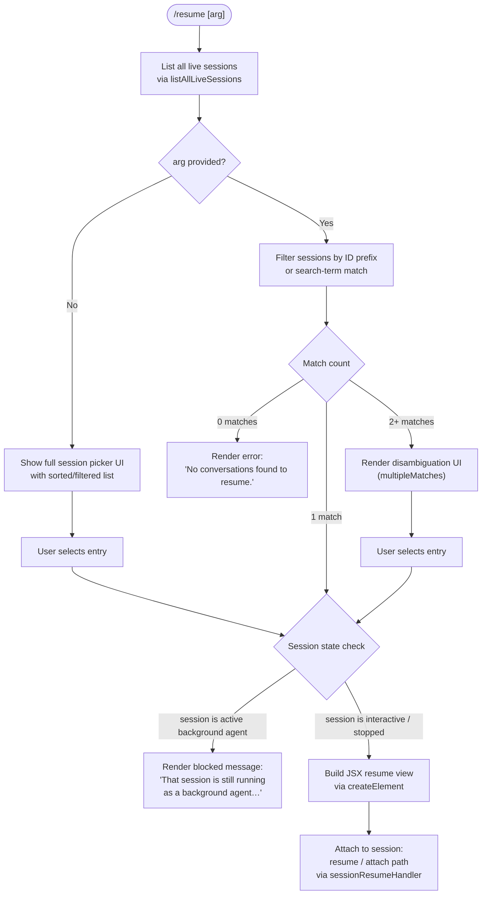

# `/resume`

> Analysis basis: CC v2.1.174 bundle.js (AST extraction + Claude interpretation)
> Minimum version: v2.1.174

---

## Overview

`/resume` (aliased as `/continue`) lets the user pick a previous conversation from the session store and re-open it in the current Claude Code window. The command queries live session metadata, resolves an optional ID or search-term argument to a unique session, and either attaches to the matching session or renders a disambiguation/error UI. A companion background-session guard prevents re-attaching to a session that is already running as a background agent.

---

## Registration

| Field | Value |
|---|---|
| type | `local-jsx` |
| name | `resume` |
| description | `Resume a previous conversation` |
| argumentHint | `[conversation id or search term]` |
| aliases | `["continue"]` |
| module_id | `wLK` |
| load_inline | `true` |
| loc_byte | `12462176` |
| loc_byte_end | `12462373` |
| loc_line | `8585` |
| arbor_handler.name | `td7` |
| arbor_handler.fqn | `claude-2.1.174::td7` |
| arbor_handler.kind | `AsyncFunction` |
| arbor_handler.resolution_path | `module_id` |
| arbor_handler.n_hits | `0` |

Analysis basis: CC v2.1.174 bundle.js:+12462176

---

## Input Branching

The handler contains five or more distinct paths depending on the argument value and the state of matching sessions, so a Mermaid flowchart is used.



Analysis basis: CC v2.1.174 bundle.js:+12460662 – +12461748

---

## Behavioral Spec

### 1. Session Discovery

When the command is invoked, the handler calls the session-list helper (internally `e3H`) to retrieve all currently known sessions.

```
async function discoverSessions():
    resolve(Promise.resolve())           // flush microtask queue
    sessions = await listAllLiveSessions()
    return sessions                      // array of session descriptors
```

`listAllLiveSessions` (mapped to `e3H`) itself calls `A.listAllLiveSessions` and involves a Promise chain that resolves the store of interactive sessions.
Analysis basis: CC v2.1.174 bundle.js:+9296332

The session type is checked against the literal `"interactive"` to distinguish foreground conversations from background agents.
Analysis basis: CC v2.1.174 bundle.js:+9296423

---

### 2. Argument-Based Filtering

```
function filterSessions(sessions, arg):
    if arg is empty:
        return sessions           // show all; user picks in UI

    lowered = arg.toLowerCase()
    matches = sessions.filter(s =>
        s.id.startsWith(lowered) OR
        s.title.toLowerCase().includes(lowered) OR
        searchTermMatches(s, lowered)
    )
    return matches
```

Filtering involves locale-sensitive comparison (`localeCompare`) and `startsWith` prefix checks; the list is then sorted before presentation.
Analysis basis: CC v2.1.174 bundle.js:+9286390, +9286330, +9286357

---

### 3. Background-Agent Guard

Before attaching, the handler checks whether the resolved session is currently running as a background agent.

```
function checkSessionConflict(session):
    if session.isBackgroundAgent == true:
        return ErrorResult(
            "That session is still running as a background agent. " +
            "Open `claude agents` to attach to it, or stop it there first to resume here."
        )
    return OK
```

The exact error string is a bundle literal (`loc_byte` 12460776). Users must stop the background agent through `/agents` before `/resume` can attach.
Analysis basis: CC v2.1.174 bundle.js:+12460776

---

### 4. Zero-Match and Multi-Match Handling

```
function resolveMatches(matches, arg):
    if matches.length == 0:
        renderJSX(errorView, { kind: "sessionNotFound" })
        // displays "No conversations found to resume."
        return

    if matches.length > 1:
        renderJSX(pickerView, { kind: "multipleMatches", sessions: matches })
        return

    attachToSession(matches[0])
```

The literal `"No conversations found to resume."` is present at `loc_byte` 12461211.
The kind tokens `"sessionNotFound"` and `"multipleMatches"` are used to select the appropriate JSX branch.
Analysis basis: CC v2.1.174 bundle.js:+12461211, +12458419, +12458490

---

### 5. Session Attachment and Resume Flow

Once a unique session is identified, the handler performs the attach sequence through the session-resume subsystem (`Ur`, which delegates to `s3H`, `CWK`, and `vUH`).

```
async function attachSession(session):
    timestamp = Date.now()
    resumeView = createElement(sessionResumeComponent, {
        sessionId: session.id,
        startedAt: timestamp
    })

    // Track the session ID for telemetry
    record("slash_command_session_id", session.id)

    // Build context: worktree state, conversation history
    context = await buildContext(session)   // via s3H / CWK

    // Render and attach
    render(resumeView)
    await attachToRunningSession(session)   // via Ur / vUH
```

Telemetry properties `"slash_command_session_id"` and `"slash_command_title"` are recorded as string literals.
Analysis basis: CC v2.1.174 bundle.js:+12461473, +12461698, +12461062, +12461088

---

### 6. Worktree and Git Context Resolution

The session context builder (`s3H`) runs `git worktree list --porcelain` to detect the active Git worktree.

```
async function resolveWorktreeContext(session):
    result = await spawnGit(["worktree", "list", "--porcelain"])
    lines = result.stdout.split("\n")
    for line in lines:
        if line.startsWith("worktree "):
            path = normalizeNFC(line.slice(9))   // strip "worktree " prefix (9 chars)
            worktrees.push(path)

    emit telemetry: "tengu_worktree_detection"
    return matchBestWorktree(worktrees, session.cwd)
```

Literal `"worktree "` (9 characters, matching `loc_byte` 9286185 and slice offset `9` at `loc_byte` 9286219) confirms the prefix parsing.
Analysis basis: CC v2.1.174 bundle.js:+9285977, +9285984, +9286185, +9286219, +9286066

---

### 7. Conversation History Loading

The conversation history for the resumed session is loaded by the transcript reader (`_$H`, delegating to `FqH`). The system reads JSONL conversation files from disk synchronously using buffer-level parsing, tracking message types including `"assistant"`, `"user"`, `"system"`, `"attachment"`, `"compact_boundary"`, `"summary"`, and `"last-prompt"`.

```
function loadTranscript(sessionPath):
    fd = fs.openSync(sessionPath, "r")
    buf = Buffer.allocUnsafe(READ_CHUNK)   // 1 MiB default (loc_byte 13498658)
    messages = []
    while not EOF:
        n = fs.readSync(fd, buf)
        parseNDJSON(buf.slice(0, n), messages)
    fs.closeSync(fd)
    return messages
```

Analysis basis: CC v2.1.174 bundle.js:+13498658, +13498669, +13501256

---

### 8. Bold Session Identifier Rendering

Before rendering the session picker, the command formats the matching session identifier using bold text via `X6.bold` (mapped to `$LK`).

```
function formatSessionLabel(session):
    boldId = bold(session.id)
    return buildLabel(boldId, session.title, session.summary)
```

Analysis basis: CC v2.1.174 bundle.js:+12461748, +12458454

---

## State & Side Effects

| Item | Detail |
|---|---|
| Telemetry — `tengu_worktree_detection` | Fired after `git worktree list --porcelain` completes; records worktree resolution result (bundle.js:+9286066) |
| Telemetry — `tengu_bg_attach` | Fired when a background-agent attach is attempted (bundle.js:+16850057) |
| Telemetry — `tengu_bg_attach_kick` | Fired when a competing session is kicked to allow attach (bundle.js:+16852200) |
| Telemetry — `tengu_bg_attach_stall_respawn` | Fired when a background session stalls during attach and is respawned (bundle.js:+16851250) |
| Telemetry — `tengu_bg_attach_stall_gave_up` | Fired when the stall-respawn loop gives up (bundle.js:+16850980) |
| Telemetry — `tengu_chain_timestamp_fallback` | Fired when transcript chain timestamps must be approximated (bundle.js:+13482504) |
| Telemetry — `tengu_transcript_phantom_parent` | Fired when a transcript parent UUID is unresolvable (bundle.js:+13500869) |
| Telemetry — `tengu_relink_walk_broken` | Fired when the conversation re-link walk encounters a broken chain (bundle.js:+13481865) |
| Session ID recording | `"slash_command_session_id"` property set to the target session ID (bundle.js:+12461473) |
| Title recording | `"slash_command_title"` property set to the resolved session title (bundle.js:+12461698) |
| Git subprocess | `git worktree list --porcelain` launched to resolve worktree context |
| JSX render | A session-resume JSX component is created via `lj.createElement` (bundle.js:+12461062) |
| Conversation history | Transcript JSONL file is read synchronously from disk |
| Error state — background agent | Blocked attach triggers the "still running as a background agent" message; no state change to the target session |

---

## Version History

| Version | Change |
|---|---|
| v2.1.174 | Initial analysis |

---

## Common Mistakes

1. **Attempting to resume an active background agent**: If the target conversation is currently running as a background (`bg`) agent, `/resume` will refuse and display the "That session is still running as a background agent…" message. Use `/agents` to manage or stop it first.
2. **Ambiguous search terms**: Providing a partial ID or title that matches multiple sessions results in a disambiguation picker rather than an immediate resume. Supply a more specific prefix (e.g., the first 8 characters of the session UUID) to avoid this.
3. **Confusing `/resume` with `/continue`**: Both the `resume` and `continue` names invoke identical logic — they are registered aliases. There is no behavioral difference between them.
4. **Expecting sessions from other machines**: The session list is populated from the local daemon's live-session store. Sessions started on remote hosts or other local accounts are not visible.
5. **Resuming across different worktrees**: The worktree-detection logic runs `git worktree list --porcelain` at resume time. If the current working directory is outside any known worktree for the original session, the resume may attach with a degraded context (no git project metadata).

---

## Appendix — Identifier Mapping

> For bundle debugging only. Identifiers change across versions.

| Identifier | Role |
|---|---|
| `td7` | Main async handler for `/resume` (Arbor-resolved entry point) |
| `zLK` | Module-level wrapper / command loader that filters and delegates to handler |
| `e3H` | Session-list fetcher; calls `listAllLiveSessions` |
| `e3` | Shared error/result constructor used for command outcomes |
| `s3H` | Context builder; resolves worktree and conversation context for resume |
| `p_` | Primary subprocess launcher (spawns git and other child processes) |
| `YNH` | Child-process orchestrator with timeout/kill management |
| `jcA` | Process spawn helper (platform-aware, handles win32 `.exe`/`cmd`) |
| `Ur` | Session-attach orchestrator; delegates to `s3H`, `CWK`, `vUH` |
| `CWK` | Conversation context resolver; reads file system, history, directory trees |
| `vUH` | Buffer-level session attachment writer |
| `_$H` | Conversation state dispatcher; loads transcript data from disk |
| `FqH` | Transcript store; manages Maps for all message/event types |
| `UA5` | Low-level JSONL binary reader (sync `openSync`/`readSync`/`closeSync`) |
| `BA5` | Alternative sync binary reader for transcript files |
| `LWK` | Transcript chain walker; resolves parent-child message links |
| `VA5` | Chain-link validator; detects cycles and broken references |
| `H$H` | High-level chain builder; orders messages by timestamp |
| `IA5` | Message categorizer; sorts `assistant`, `user`, `tool_result`, etc. |
| `vA5` | Parallel-transcript recovery helper |
| `IWK` | Incremental chain index updater |
| `KQ8` | Timestamp parser used during chain ordering |
| `hA5` | NaN-guard for numeric timestamps in chain |
| `m96` | Map-based message re-indexer |
| `VjA` | Compact-summary splitter |
| `DjA` | Top-level conversation display-data builder |
| `NjA` | Filter for image/document attachments |
| `yA5` | Array-type guard for transcript entries |
| `kA5` | Array-subset validator |
| `fQ8` | Partial message lookup cache |
| `LQ8` | Full session value extractor |
| `p96` | Session-state snapshot reader (per-key Map accessors) |
| `RWK` | Session-state writer; delegates to `FqH` and `FA5` |
| `FA5` | File-system session record creator |
| `v0` | Directory scanner for project session folders |
| `JU6` | Session label formatter; joins ID fragments |
| `CWK` | (see above) Conversation context / filesystem resolver |
| `eEH` | Entry list builder for session picker UI |
| `JjA` | Recursive directory reader for session file discovery |
| `MU6` | Session metadata updater |
| `yw` | Path normalizer / sanitizer |
| `mDK` | Daemon status reader (`daemon.status.json`) |
| `Dp6` | Daemon status path joiner |
| `rO` | Path normalize-NFC helper |
| `SH` | Structured error/log emitter |
| `DA` | Error constructor wrapper |
| `L6` | String coercion utility |
| `_q` | Telemetry routing helper |
| `$gA` | Telemetry level selector (`essential-traffic`, `no-telemetry`, `default`) |
| `dbf` | Queue shift/push for log buffer |
| `TH` | String-to-display formatter |
| `Fg` | Regex tester for session identifier validation |
| `KHH` | Session ID constants/registry |
| `_$H` | (see above) Conversation state dispatcher |
| `$B8` | Session summary builder |
| `j_` | Home-directory resolver |
| `rG` | OS home-directory lookup |
| `$LK` | Bold-text formatter for session labels |
| `JOH` | JSX outer container for resume view |
| `SH` | (see above) Error emitter |
| `Z1f` | Process environment reader |
| `RH` | JSON stringifier wrapper |
| `df` | Path redaction / truncation utility |
| `VgH` | Display hint helper |
| `h1f` | Git execution helper (runs `git` subcommands) |
| `N` | Composite config/env reader |
| `Y` | Forced-exit / abort wrapper |
| `z` | Daemon shutdown controller |
| `Gmf` | String coercion for process args |
| `ZM` | Session manager reference |
| `PC` | Config path resolver |
| `As` | Async VLH initializer |
| `c9` | AsyncLocalStorage store getter |
| `wA5` | Session write helper |
| `pJ` | Partial-JSON assembler |
| `HCH` | MCP server connection orchestrator |
| `Mi8` | MCP connection result applier |
| `NGA` | MCP server-map updater |
| `x8` | Background-session stopped-state constant holder |
| `PTA` | Daemon socket claim handler |
| `VTA` | Daemon session lifecycle manager (blocked → working → bg → closed) |
| `D` | Background-worker supervisor loop |
| `k` | Worker sweep/health-check scheduler |
| `l` | Grace-clock and scheduled-task manager |
| `np6` | Memory pressure checker |
| `xPK` | Memory-based worker retirement trigger |
| `Ng8` | Worker upgrade coordinator |
| `TG6` | Config-file reader (JSON, filtered) |
| `Q` | Background-process socket manager |
| `w6` | Session-dispatch router |
| `vg8` | Memory usage reporter |
| `c8` | No-op / passthrough sentinel |
| `CH` | Feature flag checker (ok path) |
| `kH` | Feature flag checker (error path) |
| `A6` | S56 constant accessor |
| `eRH` | MCP update event emitter |
| `Ur` | (see above) Session-attach orchestrator |
| `s` | Ref / timeout controller |
| `AH` | Input field controller |
| `nVH` | JSON parse wrapper |
| `HH` | MCP client batch updater |
| `t` | MCP pending-update tracker |
| `SWK` | Buffer `at`-index accessor |
| `KH` | Buffer set reference |
| `l6` | JSON parse wrapper (alternative) |
| `mA5` | Buffer comparison helper |
| `TNH` | NDJSON stream parser |
| `fpf` | Stream parser initializer |
| `Lpf` | Framing delimiter scanner |
| `$pf` | JSON-within-stream extractor |
| `Mpf` | Partial-frame accumulator |
| `Z9` | V8-context guard |
| `KU` | Session-key updater |
| `jc6` | Token/message-type classifier |
| `Yc6` | Compact-boundary detector |
| `khA` | Text sanitizer |
| `P` | Background PTY stream manager |
| `R7` | PTY write/end controller |
| `YZ5` | Full PTY session object (attach, resize, snapshot, tail, etc.) |
| `b` | Worker-registry entry |
| `l8` | IPC socket with abort/timeout |
| `O` | Background-session state object |
| `pA5` | Attribution-snapshot parser |
| `LWK` | (see above) Chain walker |
| `$1` | S56 constant (second reference) |
| `x` | IPC teardown helper |
| `C` | PTY write-timeout guard |
| `d` | Settled-session entry |
| `n` | Keyboard-event interceptor |
| `i` | Platform-allow/deny rule set |
| `a` | Gd8 initializer |
| `Cm6` | Compact-summary token processor |
| `EK` | Markdown/code block parser |
| `Wx` | Inline code sanitizer |
| `D1` | Deduplication helper |
| `_i` | Projects-path joiner |
| `T` | wv6/A56 display pair |
| `K` | Column padder |
| `E` | Math.max/min bounded display helper |
| `w` | Supervisor write/update manager |
| `V` | Array concat helper |
| `j` | Process-value iterator |
| `X` | setTimeout cache |
| `G` | Input-field key-event dispatcher |
| `J` | Flat-map helper |
| `W` | SDK connection orchestrator |
| `M` | MCP server manager |
| `b` | (see above) Worker-registry entry |

---

Note: index built via Arbor fallback; some signals (telemetry, literals) may be missing — see arbor-fallback.js.