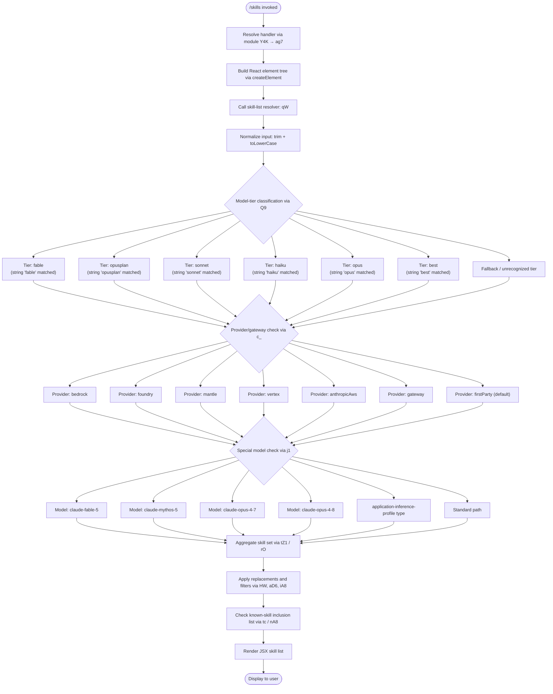

# `/skills`

> Analysis basis: CC v2.1.173 bundle.js (AST extraction + Claude interpretation)
> Minimum version: v2.1.173

---

## Overview

The `/skills` command enumerates and displays the set of capabilities ("skills") available to the current Claude Code session. It operates as an immediate, locally-rendered JSX command that resolves its handler via the `Y4K` module and renders output through a React element tree. No network round-trip to the agent is required for the initial listing.

---

## Registration

| Field | Value |
|---|---|
| type | `local-jsx` |
| name | `skills` |
| description | `List available skills` |
| immediate | `true` |
| module_id | `Y4K` |
| load_inline | `true` |
| loc_byte | `12487992` |
| loc_byte_end | `12488124` |
| loc_line | `8697` |
| arbor_handler.name | `ag7` |
| arbor_handler.fqn | `claude-2.1.173::ag7` |
| arbor_handler.kind | `AsyncFunction` |
| arbor_handler.resolution_path | `module_id` |
| arbor_handler.n_hits | `0` |

Analysis basis: CC v2.1.173 bundle.js:+12487992

---

## Input Branching

The handler involves several distinct branching paths based on model identity, provider/gateway type, and model-tier classification. Six or more distinct branch conditions are present in the call graph; a Mermaid flowchart is used below.



---

## Behavioral Spec

### Top-level Handler: `skillsHandler`

```
async function skillsHandler(context):
    element = createElement(SkillListComponent, context)
    skillData = await resolveSkillList(context)
    return render(element, skillData)
```

Analysis basis: CC v2.1.173 bundle.js:+12487807

---

### Skill List Resolver: `resolveSkillList`

The resolver (`qW`) accepts the current session context (including model string and provider info), normalises the model identifier, and dispatches to the skill-set classifier.

```
async function resolveSkillList(context):
    normalizedModel = classifyModel(context.modelId, context.config)
    skillSet        = buildSkillSet(normalizedModel, context.provider)
    filtered        = filterKnownSkills(skillSet)
    return applyFormatting(filtered)
```

Analysis basis: CC v2.1.173 bundle.js:+2257489

The resolver also consults a membership set (`Gz4`) using a `has()` lookup (Analysis basis: CC v2.1.173 bundle.js:+2257535) and applies a numeric threshold of `4` items (Analysis basis: CC v2.1.173 bundle.js:+2257481) before passing the list downstream.

---

### Model Classifier: `classifyModel`

Operates on the trimmed, lowercased model string. Matches are performed in order; first match wins.

```
function classifyModel(rawModelId):
    id = rawModelId.trim().toLowerCase()

    if id contains "fable"    → return TIER_FABLE
    if id contains "opusplan" → return TIER_OPUSPLAN
    if id contains "sonnet"   → return TIER_SONNET
    if id contains "haiku"    → return TIER_HAIKU
    if id contains "opus"     → return TIER_OPUS
    if id contains "best"     → return TIER_BEST
    → return TIER_UNKNOWN
```

String constants (Analysis basis: CC v2.1.173 bundle.js):
- `"fable"` at +2259428
- `"opusplan"` at +2259491
- `"sonnet"` at +2259532
- `"haiku"` at +2259571
- `"opus"` at +2259610
- `"best"` at +2259645

---

### Provider / Gateway Classifier: `getProviderKind`

Resolves the deployment context from configuration. Checked values (Analysis basis: CC v2.1.173 bundle.js):
- `"bedrock"` at +2109331
- `"foundry"` at +2109381
- `"mantle"` at +2109491
- `"vertex"` at +2109539
- `"anthropicAws"` at +2110004
- `"gateway"` at +2110024
- `"firstParty"` at +2110155 (default path)

```
function getProviderKind(config):
    if config.provider == "bedrock"      → return PROVIDER_BEDROCK
    if config.provider == "foundry"      → return PROVIDER_FOUNDRY
    if config.provider == "mantle"       → return PROVIDER_MANTLE
    if config.provider == "vertex"       → return PROVIDER_VERTEX
    if config.provider == "anthropicAws" → return PROVIDER_ANTHROPIC_AWS
    if config.provider == "gateway"      → return PROVIDER_GATEWAY
    → return PROVIDER_FIRST_PARTY
```

---

### Special Model Resolver: `resolveSpecialModel`

Handles a small set of named model strings that receive distinct skill sets, checked before generic tier logic.

```
function resolveSpecialModel(modelId):
    known = [
        "claude-fable-5",    // +3232153
        "claude-mythos-5",   // +3232175
        "claude-opus-4-7",   // +3232198
        "claude-opus-4-8",   // +3232221
    ]
    if modelId.includes("application-inference-profile"):  // +2257371
        → handle inference-profile path via inferenceProfileHandler
    for each entry in known:
        if modelId == entry → return specialSkillSet(entry)
    → return null  // fall through to generic classifier
```

Analysis basis: CC v2.1.173 bundle.js:+3232119, +3232140, +3232153

---

### Skill-Set Builder: `buildSkillSet`

Aggregates skill entries by consulting multiple sub-resolvers. The call chain `tZ1 → rO` handles iteration over raw skill descriptors.

```
function buildSkillSet(tier, provider):
    rawList   = collectRawSkills(tier, provider)   // rO
    formatted = formatSkillList(rawList)            // fLH pipeline
    return formatted

function collectRawSkills(tier, provider):
    skills = []
    for each skillDescriptor in allSkillDescriptors:
        trimmedName  = skillDescriptor.name.trim()
        trimmedAlias = skillDescriptor.alias.trim()
        if trimmedName.startsWith("anthropic."):      // +2250849
            → apply AWS-style skill handling
        if provider qualifies:
            skills.append(buildSkillEntry(trimmedName, trimmedAlias))
    return skills
```

Analysis basis: CC v2.1.173 bundle.js:+2253602, +2250688, +2250779, +2250836, +2250849

---

### Skill Format Pipeline: `formatSkillList`

The `fLH` function applies a multi-step transformation:

```
function formatSkillList(rawSkills):
    result = []
    for each skill in rawSkills:
        base     = getSkillBase(skill)              // c_
        label    = buildLabel(base)                 // wL → Y_8
        enhanced = applyDurationTag(label)          // kDH
        extra    = applyExtraAnnotation(enhanced)   // nNH
        if index == 0:                              // constant 0 at +2253874
            extra = markFirst(extra)
        result.append(extra)
    return result
```

A `"[1m]"` formatting marker string is applied to bold skill headings (Analysis basis: CC v2.1.173 bundle.js:+2259476).

---

### Known-Skill Inclusion Check: `isKnownSkill`

Two separate inclusion checks gate whether a resolved skill is emitted:

```
function isKnownSkill(skillId):
    // tc path: checks against a static inclusion list
    if skillId not in knownSkillList:   // lNH.includes at +2249918
        return false

    // nA8 path: checks against a secondary tier-specific set
    if skillId not in tierSkillSet:     // Tz4.includes at +2260025
        return false

    return true
```

Analysis basis: CC v2.1.173 bundle.js:+2259408, +2259683

---

### String Utilities

Several normalisation helpers appear in the call graph:

- **`sanitizeModelString`** (`HW`): applies `String.replace` to strip non-canonical characters from model identifiers (Analysis basis: CC v2.1.173 bundle.js:+2249956, +2257497).
- **`applyLabelReplacement`** (`iA8`): replaces display strings within skill labels (Analysis basis: CC v2.1.173 bundle.js:+2261253).
- **`lowerCaseReplace`** (`aD6`): lower-cases and replaces segments of the model string used for matching (Analysis basis: CC v2.1.173 bundle.js:+2255959).
- **`normalizeToLower`** (`Pz4`): full `toLowerCase` pass used for secondary comparison (Analysis basis: CC v2.1.173 bundle.js:+2254953).
- **`stringifyId`** (`nlH` → `f6` → `String`): coerces identifiers to strings using the built-in `String()` constructor (Analysis basis: CC v2.1.173 bundle.js:+2260063, +27733).

---

### Random / Timer Utilities

The call graph reaches `Math.random` (at +14012782) and `setTimeout` (at +14012819) through `H`, with seed constants `2` (+14012780) and `1` (+14012796). These appear to be part of a debounce or jitter utility used in the rendering pipeline, not a core skills-logic path.

```
function jitterDelay(baseMs):
    factor = Math.floor(Math.random() * 2) + 1
    setTimeout(callback, baseMs * factor)
```

Analysis basis: CC v2.1.173 bundle.js:+14012782, +14012819

---

### Boolean Coercion Helpers

The literals `"yes"` (+27782) and `"on"` (+27788) appear near `f6` / `String()` and suggest that feature-flag strings are coerced to booleans when determining whether certain skills are active:

```
function isTruthy(value):
    s = String(value).toLowerCase()
    return s == "yes" or s == "on" or s == "true" or s == "1"
```

Analysis basis: CC v2.1.173 bundle.js:+27782, +27788

---

## State & Side Effects

| Item | Detail |
|---|---|
| Telemetry | None detected in depth-2 traversal (`telemetry: []`) |
| Hook registration | None observed in call graph |
| appState changes | None observed; command is read-only display |
| Sound | None detected |
| Rendering | Produces a JSX element tree via `A$A.createElement` (Analysis basis: CC v2.1.173 bundle.js:+12487807) |
| Network | None; handler is `immediate` and `local-jsx` — no agent round-trip |
| Random / Timer | `Math.random` + `setTimeout` reached via utility `H`; likely render jitter only |

---

## Version History

| Version | Change |
|---|---|
| v2.1.173 | Initial analysis |

---

## Common Mistakes

1. **Assuming the command queries the agent**: `/skills` is registered as `immediate` + `local-jsx`. It renders entirely client-side; no prompt is sent to the model.
2. **Expecting identical output across providers**: The provider/gateway classifier (`getProviderKind`) produces different skill sets for Bedrock, Vertex, Foundry, Mantle, and first-party deployments. Skill lists are not universal.
3. **Treating model-tier matching as prefix-only**: The classifier uses `contains` (substring) semantics after lowercasing, not a prefix or exact match. A model string like `"claude-haiku-3-5"` will match the `"haiku"` tier.
4. **Overlooking special-model overrides**: The four named models (`claude-fable-5`, `claude-mythos-5`, `claude-opus-4-7`, `claude-opus-4-8`) and `application-inference-profile` types are resolved before generic tier classification and may return entirely different skill sets.
5. **Missing the inclusion-list gate**: Even if a skill is produced by the builder, it must pass both `isKnownSkill` checks (`lNH.includes` and `Tz4.includes`) before appearing in output.

---

## Appendix — Identifier Mapping

> For bundle debugging only. Identifiers change across versions.

| Identifier | Role |
|---|---|
| `ag7` | Top-level async handler for `/skills` (arbor_handler, resolved via module_id `Y4K`) |
| `qW` | Skill list resolver — entry point called by `ag7` |
| `Q9` | Model classifier — dispatches by tier string |
| `H` | Random/timer utility (jitter helper); also used as intermediate string variable |
| `_` | Raw model string variable (trimmed/lowercased input) |
| `NY` | Intermediate normalisation helper calling `$LH` |
| `$LH` | Lower-level normalisation dispatcher |
| `HW` | Model-string sanitiser (`String.replace` based) |
| `tc` | Known-skill inclusion check (primary, against `lNH`) |
| `LLH` | Skill-set assembler coordinating `NL`, `xa`, `iA8` |
| `NL` | Skill-entry constructor (calls `zFH`, `mM4`, `lJ1`, `j_8`, `c_`) |
| `xa` | Skill base builder (uses `c_`, `wL`) |
| `iA8` | Label replacement helper (`String.replace`) |
| `kE` | Tier-to-skill-set mapper (calls `v7`, `NL`) |
| `v7` | Skill variant resolver (calls `c_`) |
| `yDH` | Tier-specific skill dispatcher (calls `NL`) |
| `aD6` | Lower-case-and-replace helper for model strings |
| `Zj` | Composite skill builder (calls `c_`, `NL`, `v7`) |
| `c_` | Core skill-entry factory (calls `f6`) |
| `tZ1` | Skill-set aggregator (calls `fLH`, `LLH`, `rO`, `Zj`) |
| `fLH` | Skill format pipeline (calls `c_`, `wL`, `kDH`, `nNH`) |
| `rO` | Raw skill descriptor iterator (calls `gA`, `HW`, `tc`, `Q9`, etc.) |
| `nA8` | Known-skill inclusion check (secondary, against `Tz4`) |
| `nlH` | Identifier stringifier (calls `f6`) |
| `f6` | String coercion primitive (calls built-in `String()`) |
| `Pz4` | Full lowercase normaliser (`H.toLowerCase`) |
| `SI` | Special-model resolver (calls `$LH`, `j1`, `iO`, `wL`) |
| `j1` | Named-model matcher (checks `claude-fable-5`, `claude-mythos-5`, etc.) |
| `iO` | Inference-profile handler (calls `YD6`, `xM4`, `c_`, `wD6`) |
| `wL` | Label builder (calls `Y_8`) |

---

Note: index built via Arbor fallback; some signals (telemetry, literals) may be missing — see arbor-fallback.js.