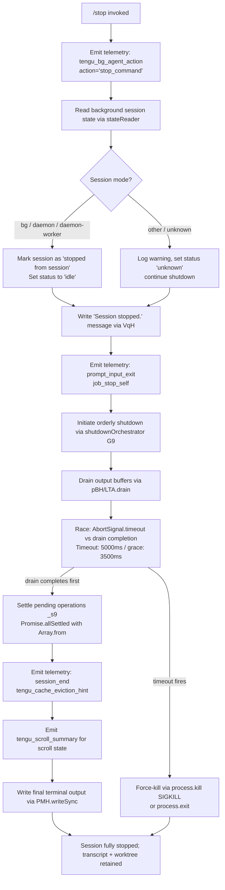

# `/stop`

> Analysis basis: CC v2.1.170 bundle.js (AST extraction + Claude interpretation)
> Minimum version: v2.1.170

---

## Overview

The `/stop` command terminates the current background session, transitioning it to an idle/stopped state while preserving both the session transcript and any associated worktree. It emits a `stop_command` telemetry action, writes final session state, and then triggers an orderly agent shutdown sequence before exiting the process.

---

## Registration

| Field | Value |
|---|---|
| type | `local-jsx` |
| name | `stop` |
| description | `Stop this background session; transcript and worktree are kept` |
| immediate | `true` |
| module_id | `rDK` |
| load_inline | `true` |
| loc_byte | `13258513` |
| loc_byte_end | `13258697` |
| loc_line | `9760` |
| arbor_handler.name | `Fof` |
| arbor_handler.fqn | `claude-2.1.170::Fof` |
| arbor_handler.kind | `AsyncFunction` |
| arbor_handler.resolution_path | `module_id` |
| arbor_handler.n_hits | `0` |

Analysis basis: CC v2.1.170 bundle.js:+13258513

---

## Input Branching

The `/stop` command involves 4+ distinct execution paths based on session state, worktree presence, background session mode, and the process shutdown race. A Mermaid flowchart is used.



---

## Behavioral Spec

### Top-Level Handler: `Fof` (AsyncFunction)

The main command handler is `Fof`, resolved via `module_id` → `rDK`.

```
async function stopCommandHandler(context):
    emit telemetry("tengu_bg_agent_action", { action: "stop_command" })
    // Analysis basis: CC v2.1.170 bundle.js:+13258246

    stateInfo = readBackgroundSessionState()     // via $B8
    // Analysis basis: CC v2.1.170 bundle.js:+13258242

    markSessionStopped(stateInfo)                // set "stopped from session", status → "idle"
    // Analysis basis: CC v2.1.170 bundle.js:+13257846, +13257875

    writeMessage("Session stopped.")             // via VqH
    // Analysis basis: CC v2.1.170 bundle.js:+13258019

    emit telemetry("job_stop_self")              // via SH
    // Analysis basis: CC v2.1.170 bundle.js:+13258050

    emit telemetry("prompt_input_exit")
    // Analysis basis: CC v2.1.170 bundle.js:+13258072

    await runShutdownOrchestrator()              // via G9
    // Analysis basis: CC v2.1.170 bundle.js:+13258067
```

### Background Session State Reader: `$B8`

`$B8` is the background session state reader/writer. It reads session metadata, inspects the session mode, updates the session status, and writes final state to disk.

```
function backgroundSessionStateReader(context):
    // Validate session mode
    mode = readSessionMode()        // via X9 → _wH
    // mode is one of: "bg", "daemon", "daemon-worker"
    // Analysis basis: CC v2.1.170 bundle.js:+2264743, +2264753, +2264767

    sessionState = readTransientState()     // via Wq; emits tengu_bg_state_read_transient
    // Analysis basis: CC v2.1.170 bundle.js:+13257787

    if sessionState.status in ["done","success","failed","failure","stopped"]:
        // Already in a terminal state; mark status fields accordingly
        // Analysis basis: CC v2.1.170 bundle.js:+4220861..+4220923
        pass
    else:
        sessionState.status = "stopped"
        sessionState.stopReason = "stopped from session"
        // Analysis basis: CC v2.1.170 bundle.js:+13257846

    sessionState.idleFlag = "idle"
    // Analysis basis: CC v2.1.170 bundle.js:+13257875

    persistState(sessionState)              // via Sf → AO (atomic write with random hex suffix)
    // AO uses OY_.randomBytes(4, "hex") for atomic rename
    // Analysis basis: CC v2.1.170 bundle.js:+13257812, +2295886, +2295898

    activeSessionCount = getActiveSessions()    // via MO → tv → DAH
    // "active" literal used in state filter
    // Analysis basis: CC v2.1.170 bundle.js:+13257800, +4221042

    emitFeatureOk()     // via SH; emits tengu_feature_ok
    // Analysis basis: CC v2.1.170 bundle.js:+13258047
```

### Transient State Read: `Wq`

`Wq` handles the transient (in-progress) state file for the session. It reads the state JSON, manages caches, and resolves worktree path information.

```
function readTransientState(sessionId, worktreePath):
    fullPath = path.join(baseDir, sessionId)        // Dj.join
    // Analysis basis: CC v2.1.170 bundle.js:+4213958

    stats = await Promise.all([_W.stat(fullPath)])  // check file presence
    // Analysis basis: CC v2.1.170 bundle.js:+4214043, +4214056

    if cache.has(sessionId):
        return cache.get(sessionId)         // xfH.get
        // Analysis basis: CC v2.1.170 bundle.js:+4214367

    raw = await _W.readFile(fullPath, "utf-8")
    // Analysis basis: CC v2.1.170 bundle.js:+4214606, +4214620

    parsed = JSON.parse(raw)                // via Q6
    // Analysis basis: CC v2.1.170 bundle.js:+4214727

    if Number.isFinite(parsed.order) or Number.isFinite(parsed.stateOrder):
        // Order/state-order fields validated
        // Analysis basis: CC v2.1.170 bundle.js:+4213985, +4214006, +4214984

    cache.set(sessionId, parsed)            // xfH.set
    // Analysis basis: CC v2.1.170 bundle.js:+4214872

    emit telemetry("tengu_bg_state_read_transient")
    // Analysis basis: CC v2.1.170 bundle.js:+4214406

    return parsed
```

### Atomic State Persistence: `AO` (via `Sf`)

`AO` performs an atomic write of session state using a temporary file with a random hex suffix, then renames it into place. It respects an internal "never-evict" set.

```
async function atomicWriteState(targetPath, content):
    suffix = OY_.randomBytes(4).toString("hex")     // 4 bytes → 8 hex chars
    // Analysis basis: CC v2.1.170 bundle.js:+2295886, +2295898

    tmpPath = targetPath + "." + suffix
    await m8H.writeFile(tmpPath, content, "utf8")
    // Analysis basis: CC v2.1.170 bundle.js:+2295917, +2295945

    if NE1.has(targetPath):
        // Path is in the copy-protected set; use copyFile instead
        await m8H.copyFile(tmpPath, targetPath)
        // Analysis basis: CC v2.1.170 bundle.js:+2296023, +2296045
    elif IE1.has(targetPath):
        // Path is in the unlink-protected set; delete tmp only
        await m8H.unlink(tmpPath)
        // Analysis basis: CC v2.1.170 bundle.js:+2296075, +2296100
    else:
        await m8H.rename(tmpPath, targetPath)
        // Analysis basis: CC v2.1.170 bundle.js:+2295971

    V8(...)     // internal state store update
    // Analysis basis: CC v2.1.170 bundle.js:+2296002
```

### Shutdown Orchestrator: `G9`

`G9` is the central shutdown coordinator. It drains output, races against a timeout, kills the process if necessary, and finalises telemetry.

```
async function shutdownOrchestrator(context):
    // Step 1: Drain output buffers
    await drainOutputBuffers()          // pBH → LTA.drain
    // Analysis basis: CC v2.1.170 bundle.js:+7340940, +62371

    // Step 2: Race: drain completion vs AbortSignal timeout
    timeoutMs = Math.max(5000, 3500)    // constants at +7340844 / +7340851
    result = await Promise.race([
        settleAllPendingOps(),          // _s9 → Promise.allSettled(Array.from(...))
        AbortSignal.timeout(timeoutMs)  // built-in
    ])
    // Analysis basis: CC v2.1.170 bundle.js:+7340964, +7341129

    // Step 3: Emit scroll summary telemetry
    emitScrollSummary()     // j28; emits tengu_scroll_summary
    // Analysis basis: CC v2.1.170 bundle.js:+7341178, +7340260

    // Step 4: Emit cache eviction hint
    emitCacheEvictionHint()     // via Cf6; emits tengu_cache_eviction_hint
    // Analysis basis: CC v2.1.170 bundle.js:+7341190, +7341203

    // Step 5: Emit session_end telemetry
    emitSessionEnd(context)     // via f6
    // Analysis basis: CC v2.1.170 bundle.js:+7341238, +7341241

    // Step 6: Write final terminal line via PMH.writeSync
    PMH.writeSync(finalLine)
    // Analysis basis: CC v2.1.170 bundle.js:+7341311

    // Step 7: Clear shutdown timer
    clearTimeout(shutdownTimer)
    // Analysis basis: CC v2.1.170 bundle.js:+7341041

    // Step 8: Unreachable guard — process.kill(pid, "SIGKILL") if still alive
    // Analysis basis: CC v2.1.170 bundle.js:+7339116, +7339141, +7339164
```

### Process Kill / Force Exit: `og_`

`og_` is the force-exit fallback called when the process has not exited within the timeout window.

```
function forceExitFallback(pid):
    clearTimeout(shutdownTimer)
    // Analysis basis: CC v2.1.170 bundle.js:+7339010

    jL.get(pid)     // retrieve child-process handle
    // Analysis basis: CC v2.1.170 bundle.js:+7339043

    try:
        process.exit(0)
        // Analysis basis: CC v2.1.170 bundle.js:+7339091
    catch:
        process.kill(pid, "SIGKILL")
        // Analysis basis: CC v2.1.170 bundle.js:+7339116, +7339141
        throw new Error("unreachable")
        // Analysis basis: CC v2.1.170 bundle.js:+7339158, +7339164
```

### Shutdown Render Cleanup: `sRH`

`sRH` cleans up the terminal render layer (Ink/React) before the process exits.

```
function shutdownRenderLayer():
    PMH.writeSync(finalOutput)      // flush remaining render buffer
    // Analysis basis: CC v2.1.170 bundle.js:+7338426

    handle = jL.get(renderId)       // retrieve render handle
    // Analysis basis: CC v2.1.170 bundle.js:+7338453

    handle.unmount()                // unmount Ink component tree
    // Analysis basis: CC v2.1.170 bundle.js:+7338504

    Kb(...)                         // additional cleanup hook
    // Analysis basis: CC v2.1.170 bundle.js:+7338538

    writeTerminalOutput()           // wM8; uses ESC-7 / ESC-8 save/restore cursor sequences
    // Analysis basis: CC v2.1.170 bundle.js:+7338586
```

### Terminal Output Writer: `wM8`

`wM8` handles raw terminal writes, including ANSI cursor-save/restore escape sequences.

```
function writeTerminalOutput(content):
    Ns.writeSync(ESC_SAVE_CURSOR)       // ESC 7  (U+001B 0x37)
    // Analysis basis: CC v2.1.170 bundle.js:+3832152

    // ... write content lines ...

    Ns.writeSync(ESC_RESTORE_CURSOR)    // ESC 8  (U+001B 0x38)
    // Analysis basis: CC v2.1.170 bundle.js:+3832163

    if error condition:
        log("error", ...)
        // Analysis basis: CC v2.1.170 bundle.js:+3832304
```

### Scroll Summary Emitter: `j28`

`j28` captures final scroll/viewport state and emits `tengu_scroll_summary` telemetry. It delegates to `da9` for timestamp and metric computation.

```
function emitScrollSummary(viewportState):
    uT(...)             // retrieve current terminal context
    // Analysis basis: CC v2.1.170 bundle.js:+7340246

    ca9(...)            // capture scroll position snapshot
    // Analysis basis: CC v2.1.170 bundle.js:+7340252

    metrics = computeScrollMetrics(viewportState)   // da9
    // da9 uses: Date.now(), Math.max(), Math.round(), Object.assign()
    // Analysis basis: CC v2.1.170 bundle.js:+7340287, +7336869, +7336937, +7337010, +7337149

    emit telemetry("tengu_scroll_summary", metrics)
    // Analysis basis: CC v2.1.170 bundle.js:+7340260

    Z1(metrics)         // final render-state persistence
    // Analysis basis: CC v2.1.170 bundle.js:+7340304
```

### Session End Telemetry Emission: `eRH`

`eRH` emits the `session_end` event through the standard event pipeline.

```
async function emitSessionEndEvent(context):
    await Promise.resolve()         // yield microtask
    // Analysis basis: CC v2.1.170 bundle.js:+7340377

    w28(context)                    // prepare session-end payload
    // Analysis basis: CC v2.1.170 bundle.js:+7340407

    H(context)                      // dispatch event (also calls Math.random + setTimeout internally)
    // Analysis basis: CC v2.1.170 bundle.js:+7340425, +13939352, +13939366
```

### Startup Profiling / IM6

`IM6` writes a startup profiling mark and emits `tengu_startup_perf` on process end. Invoked as part of the final telemetry flush.

```
function flushStartupProfiling():
    Xa8(...)        // write profiling record (zVA path)
    // Analysis basis: CC v2.1.170 bundle.js:+218294

    LVA(...)        // persist profiling data; marks "mark", emits "Startup profiling report:"
    // LVA uses: $VA, VM6.dirname, n6, VzH, _VA, $u, OVA, JSON.stringify, zVA, K.map, N
    // Analysis basis: CC v2.1.170 bundle.js:+218309, +218495, +218678

    emit telemetry("tengu_startup_perf")
    // Analysis basis: CC v2.1.170 bundle.js:+219980
```

---

## State & Side Effects

| Item | Detail |
|---|---|
| Telemetry: `tengu_bg_agent_action` | Fired at command entry; carries `action: "stop_command"` (bundle.js:+13257648, +13258246) |
| Telemetry: `tengu_bg_state_read_transient` | Fired when transient session state file is read from disk (bundle.js:+4214406) |
| Telemetry: `tengu_feature_ok` | Fired after background session state successfully updated (bundle.js:+1014205) |
| Telemetry: `tengu_daemon_config_reload` | Fired during daemon config reload path touched by shutdown (bundle.js:+16545205) |
| Telemetry: `tengu_startup_perf` | Startup profiling data flushed to disk and emitted during shutdown (bundle.js:+219980) |
| Telemetry: `tengu_scroll_summary` | Scroll/viewport metrics emitted before process exit (bundle.js:+7340260) |
| Telemetry: `tengu_pewter_brook` | Emitted from render/fullscreen detection path (bundle.js:+3490570) |
| Telemetry: `tengu_cache_eviction_hint` | Cache eviction metadata emitted just before exit (bundle.js:+7341203) |
| Session state mutation | Session status set to `"stopped"` / stop reason `"stopped from session"` / idle flag `"idle"` (bundle.js:+13257846, +13257875) |
| State file write | Atomic write via random 4-byte hex suffix + rename (bundle.js:+2295886, +2295917, +2295971) |
| Terminal output | `"Session stopped."` message written via `VqH` (bundle.js:+13258019) |
| Transcript retention | Transcript explicitly preserved; worktree is not deleted |
| Render layer | Ink component tree unmounted via `H.unmount`; cursor save/restore ESC sequences written (bundle.js:+7338504, +3832152, +3832163) |
| Output drain | `LTA.drain` called; race against `AbortSignal.timeout(5000ms)` (bundle.js:+62371, +7340964, +7340844) |
| Force kill | `process.kill(pid, "SIGKILL")` used as final fallback if process does not exit cleanly (bundle.js:+7339116, +7339141) |
| Timeout constants | Shutdown timeout: 5000 ms; grace period: 3500 ms; post-settle wait: 2000 ms (bundle.js:+7340844, +7340851, +7341029) |
| Session mode check | Recognises modes `"bg"`, `"daemon"`, `"daemon-worker"` (bundle.js:+2264743, +2264753, +2264767) |
| Sound | <!-- TODO: not found in depth-2 traversal; needs --depth 4 --> |
| Hook registration | <!-- TODO: not found in depth-2 traversal; needs --depth 4 --> |

---

## Version History

| Version | Change |
|---|---|
| v2.1.170 | Initial analysis |

---

## Common Mistakes

1. **Running `/stop` in a non-background session**: The command is specifically designed for background sessions (modes `bg`, `daemon`, `daemon-worker`). Invoking it in a foreground interactive session will still attempt to stop the session but may produce unexpected state transitions, since the session mode guard in `$B8` will log a warning for unrecognised modes.

2. **Expecting the worktree to be deleted**: The command description explicitly states the worktree is *kept*. Users wishing to clean up the worktree must do so manually after stopping the session.

3. **Expecting an immediate process exit**: The shutdown sequence races against a 5000 ms timeout (`AbortSignal.timeout`). Output buffers are drained first (`LTA.drain`), so there may be a perceptible delay before the process exits.

4. **Confusing `/stop` with an interrupt or SIGINT**: `/stop` performs an *orderly* shutdown with telemetry flush, state persistence, and render-layer cleanup. It is not equivalent to pressing `Ctrl-C`, which would bypass the full shutdown orchestrator sequence.

5. **Assuming the transcript is deleted**: The registration description and the state-persistence path both confirm the transcript survives `/stop`. The session record is kept in the transient state store with status `"stopped"`.

---

## Appendix — Identifier Mapping

> For bundle debugging only. Identifiers change across versions.

| Identifier | Role |
|---|---|
| `Fof` | Main `/stop` command handler (AsyncFunction); entry point resolved via module `rDK` |
| `H` | Event dispatcher / general utility; calls `Math.random` + `setTimeout` for jitter |
| `$B8` | Background session state reader/writer; orchestrates state transition to stopped |
| `d` | Shared utility / logger helper (used in multiple call sites) |
| `f6` | Session-end event emitter; emits `session_end` literal |
| `ff6` | Low-level event dispatch helper called by `f6` and `K6` |
| `K6` | Secondary event channel emitter |
| `v6` | Environment/config accessor |
| `xZ` | Config value resolver |
| `Bof` | Background session auxiliary helper |
| `X9` | Session mode reader |
| `_wH` | Session mode store / registry |
| `Wq` | Transient session state file reader; manages JSON cache and emits `tengu_bg_state_read_transient` |
| `k8` | Cache key builder |
| `V8` | Internal state store updater |
| `N` | Message formatter / log writer |
| `PeK` | Structured log entry builder |
| `CH` | JSON serialiser helper |
| `_` | String utility (`.toUpperCase`, `.trim` call sites) |
| `u4` | Path/string sanitiser; replaces `[REDACTED]` tokens |
| `zFH` | Log level filter / conditional logger |
| `EeK` | Async log persistence writer (uses `Buffer.byteLength`, 1000/100 byte limits) |
| `Qf` | File-stat helper |
| `Q6` | JSON parser wrapper |
| `MO` | Active-session counter |
| `tv` | Session list aggregator |
| `DAH` | Session data store |
| `Sf` | State file persistence orchestrator; delegates atomic write to `AO` |
| `AO` | Atomic file writer (random hex suffix + rename / copyFile / unlink) |
| `wj` | Cache-invalidation helper; calls `xfH.delete` |
| `Q_8` | Session message writer helper |
| `VqH` | Terminal message writer; outputs `"Session stopped."` |
| `SH` | Feature-ok emitter; emits `tengu_feature_ok` |
| `G9` | Shutdown orchestrator; drives drain → race → kill sequence |
| `K` | Render worker mapper; calls `L.map` and `f.padEnd` |
| `L` | Promise-tracked async task wrapper |
| `f` | Stream/channel handle (close, write, map operations) |
| `sRH` | Render-layer shutdown handler; unmounts Ink tree, flushes terminal |
| `Kb` | Post-unmount cleanup hook |
| `wM8` | Raw terminal writer with ESC-7/ESC-8 cursor-save/restore |
| `rg_` | Transcript/path renderer; uses `_.replaceAll`, writes dim text |
| `uT` | Terminal context accessor |
| `qu` | Quote/escape utility |
| `gv6` | Worktree path resolver; calls `q.statSync` |
| `O$` | Path normaliser |
| `la9` | Line formatter for transcript output |
| `og_` | Force-exit fallback; calls `process.exit` then `process.kill(SIGKILL)` |
| `pBH` | Output-buffer drain initiator; calls `LTA.drain` |
| `Y` | Supervisor/heartbeat manager; starts/stops timers |
| `pTH` | Session metrics collector |
| `q` | Output stream / write channel |
| `bzK` | Column-width calculator using `Math.max` and `Object.keys` |
| `T` | Heartbeat timer controller |
| `E` | Rate/interval calculator using `Math.max`/`Math.min` |
| `ccK` | Heartbeat config builder; references `"heartbeat"` literal |
| `V` | Supervisor process controller |
| `_s9` | Pending-operations settler; `Promise.allSettled(Array.from(...))` |
| `IM6` | Startup-profiling flush; emits `tengu_startup_perf` |
| `Xa8` | Profiling record writer |
| `LVA` | Profiling data serialiser; emits `"Startup profiling report:"` |
| `j28` | Scroll-summary emitter; calls `da9` for metric computation |
| `ca9` | Scroll-position snapshot capturer |
| `da9` | Scroll metric computer; uses `Date.now`, `Math.max`, `Math.round`, `Object.assign` |
| `Z1` | Render-state persistence writer; handles fullscreen detection |
| `Cf6` | Cache-eviction hint emitter |
| `eRH` | Session-end event dispatcher; emits `session_end` |
| `w28` | Session-end payload builder |

---

*Note: index built via Arbor fallback; some signals (telemetry, literals) may be missing — see arbor-fallback.js.*