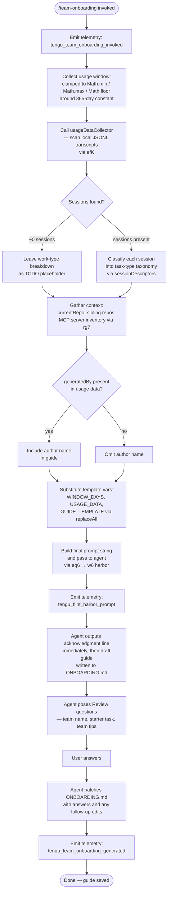

# `/team-onboarding`

> Analysis basis: CC v2.1.174 bundle.js (AST extraction + Claude interpretation)
> Minimum version: v2.1.174

---

## Overview

`/team-onboarding` is a `prompt`-type slash command that analyzes the invoking user's local Claude Code session transcripts (up to 365 days) and co-authors a personalized `ONBOARDING.md` guide for teammates new to Claude Code. The command populates a structured prompt with real usage data — session descriptors, MCP server inventory, and repository context — then drives a two-turn collaborative authoring loop: a concrete first draft followed by targeted review questions, ultimately saving the finished guide to disk.

---

## Registration

| Field | Value |
|---|---|
| type | `prompt` |
| name | `team-onboarding` |
| description | `Help teammates ramp on Claude Code with a guide from your usage` |
| isHidden | `false` |
| handler_method | `getPromptForCommand` |
| handler_method_start (byte) | `12363370` |
| handler_method_end (byte) | `12364080` |
| loc_byte | `12363032` |
| loc_byte_end | `12364081` |
| loc_line | `8555` |
| prompt_body.length | `4539` characters |
| prompt_body.trace | `identifier→$ (local→1 ext vars)` |
| arbor_handler.name | `getPromptForCommand` |
| arbor_handler.kind | `Method` |
| arbor_handler.fqn | `claude-2.1.174::getPromptForCommand` |
| arbor_handler.resolution_path | `direct` |
| arbor_handler.n_hits | `2` |
| `handler_method_start` | `12363370` |
| `handler_method_end` | `12364080` |

Analysis basis: CC v2.1.174 bundle.js:+12363032

---

## Input Branching

The handler has more than three distinct branches (usage-data present/absent, window-day clamping, session count ~0, MCP server enumeration, `generatedBy` present/absent), so a Mermaid flowchart is used.



---

## Behavioral Spec

### 1. Handler Entry and Window Calculation

`getPromptForCommand` is the sole inline handler method on the registration object (Arbor resolution: `direct`, 2 hits). It is the real entry point; the synthetic BFS label `__handler_team-onboarding` is bookkeeping only.

```
function getPromptForCommand(context):
    emit telemetry("tengu_team_onboarding_invoked")

    # Window is clamped; the bundle exposes a 365-day constant
    rawWindow   = context.windowDays ?? DEFAULT_WINDOW
    windowDays  = Math.floor(Math.min(Math.max(rawWindow, 1), 365))
```

Analysis basis: CC v2.1.174 bundle.js:+12363573 (Math.min), +12363582 (Math.max), +12363591 (Math.floor), +12363619 (365 constant)

---

### 2. Usage Data Collection (`usageDataCollector`)

The handler delegates to `usageDataCollector` (bundle ident `efK`) which:

1. Captures `Date.now()` as the scan start time.
2. Reads the Claude projects directory (via `I46.readdir`) looking for `.jsonl` files.
3. Filters entries by file extension (`.jsonl` — bundle.js:+12351983), then calls `I46.stat` / `I46.readFile` concurrently via `Promise.all`.
4. Parses each transcript line-by-line. For each line it:
   - Applies regex `dg7`, `cg7`, `lg7` to extract session metadata.
   - Scans for `"name":"mcp__` patterns (bundle.js:+12352562) to enumerate MCP tool calls per session.
   - Scans for `"content":[` patterns (bundle.js:+12352912) to count content blocks.
   - Applies a limit of 3 content segments per session (bundle.js:+12353015).
   - Records the first user message of each session for downstream classification.
5. Looks back at most `24 * 60` minutes per day (bundle constants: `24` at +12351868, `60` at +12351871) within the rolling window.
6. Returns a structured object including `sessionDescriptors`, `currentRepo`, MCP server list, and optionally `generatedBy`.

```
async function usageDataCollector(windowDays):
    cutoff = Date.now() - windowDays * MS_PER_DAY
    files  = await readdir(PROJECTS_DIR).filter(f => extname(f) == ".jsonl")

    sessions = await Promise.all(files.map(async f =>
        stat = await stat(join(PROJECTS_DIR, f))
        if not stat.isFile(): return null
        raw  = await readFile(join(PROJECTS_DIR, f))
        return parseTranscript(raw, cutoff)
    ))

    return aggregateUsageData(sessions.filter(not null))
```

Analysis basis: CC v2.1.174 bundle.js:+12351855 (Date.now), +12351896 (readdir), +12351966 (.jsonl), +12352002 (Promise.all), +12352067 (stat), +12352239 (readFile)

---

### 3. MCP Server Inventory (`mcpConfigReader`)

Bundle ident `rg7` reads `.mcp.json` (bundle.js:+12354094) from the project root, parses the `mcpServers` key (bundle.js:+12354150), and returns an array of `{ name, urlOrigin? }` entries. The agent uses each entry's `name` and optional `urlOrigin` to explain server purpose and access method in the guide.

```
async function mcpConfigReader(projectRoot):
    path = join(projectRoot, ".mcp.json")
    try:
        raw  = await readFile(path)
        data = JSON.parse(raw)
        return data.mcpServers ?? {}
    catch:
        return {}
```

Analysis basis: CC v2.1.174 bundle.js:+12354094 (.mcp.json), +12354150 (mcpServers)

---

### 4. Git Context Resolution (`gitContextResolver`)

Bundle ident `og7` calls two sub-routines and `p_` (git runner):

- `j_` / `rG` — resolve the current repo path.
- `Uu` / `YI` — resolve the Claude projects directory path (via `ba.join` + `projects` key, bundle.js:+12354714 onward).
- Runs `git config user.name` (bundle.js:+12354733) to populate `generatedBy`.
- Runs `git remote get-url origin` (bundle.js:+12354808) to identify `currentRepo`.
- Uses `lU8.basename` to produce a human-readable repo name.

```
async function gitContextResolver():
    username   = await runGit(["config", "user.name"])
    remoteUrl  = await runGit(["remote", "get-url", "origin"])
    repoName   = basename(remoteUrl)
    return { generatedBy: username, currentRepo: repoName }
```

Analysis basis: CC v2.1.174 bundle.js:+12354717 (git), +12354724 (config), +12354733 (user.name), +12354789 (remote), +12354808 (origin), +12354905 (basename)

---

### 5. Template Variable Substitution and Prompt Assembly

After collecting all data, `getPromptForCommand` uses `_.replaceAll` (bundle.js:+12363817) to substitute three named placeholders into the 4539-character prompt body:

| Placeholder | Substituted with |
|---|---|
| `{{WINDOW_DAYS}}` | Clamped window integer (bundle.js:+12363830) |
| `{{USAGE_DATA}}` | JSON-serialized usage data object (bundle.js:+12363905) |
| `{{GUIDE_TEMPLATE}}` | Guide markdown template string (bundle.js:+12363870) |

The fully substituted prompt is then handed to the harbor dispatcher via `eq6` → `w6` (bundle.js:+12363926, +12363404).

```
function assemblePrompt(templateBody, windowDays, usageData, guideTemplate):
    s = templateBody
    s = s.replaceAll("{{WINDOW_DAYS}}",    String(windowDays))
    s = s.replaceAll("{{USAGE_DATA}}",     JSON.stringify(usageData))
    s = s.replaceAll("{{GUIDE_TEMPLATE}}", guideTemplate)
    return s
```

Analysis basis: CC v2.1.174 bundle.js:+12363817 (replaceAll), +12363848 (String), +12363830, +12363870, +12363905

---

### 6. Agent Behavioral Contract (Prompt-Driven)

The prompt body (4539 chars, trace `identifier→$ (local→1 ext vars)`) instructs the agent with the following ordered contract. **No verbatim quotes beyond short fragments** are provided here.

#### Step 1 — Immediate Acknowledgment

The agent must emit a single acknowledgment line (beginning "Looking at how you've used Claude…") as its **first visible output** before any reasoning, classification, or tool calls. This is an explicit ordering constraint stated in the prompt to eliminate blank-screen latency for the guide creator.

#### Step 2 — Work-Type Classification

The agent reads the `sessionDescriptors` array and classifies each session into one of seven canonical task types:

| Internal key | Display label |
|---|---|
| `build_feature` | Build Feature |
| `debug_fix` | Debug Fix |
| `improve_quality` | Improve Quality |
| `analyze_data` | Analyze Data |
| `plan_design` | Plan Design |
| `prototype` | Prototype |
| `write_docs` | Write Docs |

Classification uses (in priority order): first user message → session title → PR numbers → tool/MCP call counts as a weak hint. The agent picks the top 3–5 categories with rough percentages. If sessions are ~0, the breakdown is left as a `TODO` block.

#### Step 3 — Context Gathering

Repositories: start from `currentRepo`, scan for sibling directories in the workspace. MCP servers: use `name` + `urlOrigin` from the inventory to describe purpose and access. Team Tips and Get Started sections are left as `TODO` placeholders in the first draft.

#### Step 4 — Write `ONBOARDING.md`

The agent writes the guide following the embedded `{{GUIDE_TEMPLATE}}` with:
- Real numbers from usage data (no placeholders left in the output).
- `generatedBy` used as the author name; omitted if missing.
- ASCII bar charts using `█` (filled) and `░` (empty), 20 characters wide.
- An HTML comment instruction preserved verbatim at the bottom of the file.

#### Step 5 — First-Turn Close with Review Questions

After the code-block rendering of the guide, the agent:
1. Adds a `---` horizontal rule and a `**Review**` heading.
2. Asks exactly three numbered questions: team name confirmation, starter task (optional link), and team tips not already in `CLAUDE.md`.
3. After the user responds, patches `ONBOARDING.md` with team name, tips, and starter task.
4. Closes with a fixed unmodified line directing the guide creator to share the file.
5. Applies any subsequent edits requested by the user.

Analysis basis: CC v2.1.174 bundle.js:+12363370–12364080 (handler body range)

---

### 7. Harbor Dispatch (`harborDispatcher` / `eq6`)

`eq6` (bundle.js:+12363926) calls `w6` which is the shared "flint harbor" prompt dispatcher. This is the same infrastructure used by other prompt-type commands. It emits `tengu_flint_harbor_prompt` on entry and `tengu_flint_harbor_share` on completion (bundle.js:+12363407, +10139093).

```
function harborDispatcher(promptText, context):
    emit telemetry("tengu_flint_harbor_prompt")
    sessionId = createNewSession(promptText, context)
    result    = await runAgentSession(sessionId)
    emit telemetry("tengu_flint_harbor_share")
    emit telemetry("tengu_team_onboarding_generated")
    return result
```

Analysis basis: CC v2.1.174 bundle.js:+12363404 (w6 call), +12363926 (eq6 call), +12363407 (tengu_flint_harbor_prompt), +10139093 (tengu_flint_harbor_share), +12363949 (tengu_team_onboarding_generated)

---

## State & Side Effects

| Item | Detail |
|---|---|
| Telemetry: invocation | `tengu_team_onboarding_invoked` (bundle.js:+12363630) — fired at handler entry |
| Telemetry: harbor prompt | `tengu_flint_harbor_prompt` (bundle.js:+12363407) — fired when prompt enters the harbor dispatcher |
| Telemetry: harbor share | `tengu_flint_harbor_share` (bundle.js:+10139093) — fired on harbor session completion |
| Telemetry: guide generated | `tengu_team_onboarding_generated` (bundle.js:+12363949) — fired after agent completes generation |
| Telemetry: config errors | `tengu_config_parse_error` (bundle.js:+3317492) — may fire during config read in the call chain |
| Telemetry: config lock | `tengu_config_lock_contention`, `tengu_config_stale_write`, `tengu_config_auth_loss_prevented` — from config-write path |
| File written | `ONBOARDING.md` — created/overwritten in the working directory by the agent |
| Files read | Local `.jsonl` transcript files under the Claude projects directory |
| Files read | `.mcp.json` in project root (optional; silently skipped if absent) |
| Git subprocess | `git config user.name` and `git remote get-url origin` — run to populate `generatedBy` and `currentRepo` |
| Config access | Global config read via `C7H` / `C6` chain to obtain project state and credentials |
| Window constant | Maximum look-back: **365 days** (bundle.js:+12363619) |
| Session limit | Clamped with `Math.min` / `Math.max` / `Math.floor` (bundle.js:+12363573–12363591) |
| appState changes | No direct UI state mutations observed in depth-2 traversal |
| Sound | None observed in depth-2 traversal |

---

## Version History

| Version | Change |
|---|---|
| v2.1.174 | Initial analysis |

---

## Common Mistakes

1. **Running in a directory with no Claude transcripts.** If the `.jsonl` files are absent or older than the window, `sessionDescriptors` will be empty and the agent will leave the work-type breakdown as a `TODO`. Run the command after accumulating several real Claude Code sessions.
2. **Missing `.mcp.json`.** The MCP inventory will be empty and the guide will omit server setup instructions. This is not an error — the command silently skips the file — but the resulting guide will be incomplete for teams relying on MCP integrations.
3. **Running outside a git repository.** The `git config user.name` and `git remote get-url origin` calls will fail silently; `generatedBy` and `currentRepo` will be absent, so the guide will omit the author name and may mis-identify the repository.
4. **Expecting the command to wait for input before drafting.** The prompt explicitly instructs the agent to generate a full draft first and ask questions afterward. Typing answers to abstract questions before the draft is unnecessary — edit the concrete output instead.
5. **Treating `ONBOARDING.md` as the final artifact without the Review step.** The first draft intentionally leaves Team Tips and Get Started as `TODO` blocks. The guide is only complete after answering the three Review questions the agent poses at the end of the first turn.
6. **Confusing the 365-day window cap with a requirement.** The window is an upper bound; actual data is limited by the transcripts available locally. The window is clamped, not padded.

---

## Appendix — Identifier Mapping

> For bundle debugging only. Identifiers change across versions.

| Identifier | Role |
|---|---|
| `__handler_team-onboarding` | Synthetic BFS entry node for the command handler (not a real bundle symbol; prefer `getPromptForCommand`) |
| `w6` | Harbor prompt dispatcher — routes assembled prompt into a new agent session |
| `t26` | Harbor sub-routine called by dispatcher (depth-1 from w6) |
| `e26` | Harbor sub-routine called by dispatcher (depth-1 from w6) |
| `Vm` | Session context builder called by dispatcher |
| `zm` | Low-level session state initializer |
| `tC` | Session construction helper (calls C24, iO, _NH) |
| `X58` | Session deduplication / registry lookup |
| `KX_` | New session factory (generates UUID, emits GrowthBook event) |
| `chH` | First-party session tagger |
| `HF` | Session ID generator (uses randomBytes, 32-byte hex) |
| `RH` | JSON serialization wrapper |
| `yW4` | Session metadata recorder |
| `OV_` | Session output handler |
| `mm1` | Output sub-handler (depth-1 from OV_) |
| `g_` | Output utility (calls uB) |
| `iA9` | Output sub-routine |
| `y8H` | Output deduplication check (aSf.has) |
| `C6` | Config reader — loads global/project config from disk |
| `r6` | Config path resolver |
| `TV_` | Config schema validator |
| `C7H` | Config file reader (readFileSync, JSON.parse, mkdirSync, copyFileSync) |
| `q` | Filesystem module alias (readFileSync, statSync, etc.) |
| `l6` | JSON.parse wrapper |
| `gu` | Config prefix stripper (startsWith / slice) |
| `V8` | Error constructor helper |
| `M19` | Sibling repo directory scanner |
| `N` | Logging / debug output formatter |
| `c` | Utility / context accessor |
| `ZV_` | Backup directory path builder |
| `D` | Background daemon session manager |
| `em4` | File watcher for config hot-reload |
| `ZF` | Watch-event sub-routine |
| `R9` | Hook registration (qvA.register) |
| `G8` | Usage data aggregator — orchestrates transcript scanning |
| `R58` | Transcript file reader and parser |
| `f` | Async task lifecycle manager |
| `L` | Async task cleanup handler |
| `YN1` | Session record builder (Object.assign) |
| `iD_` | Session record sub-builder |
| `YoH` | Session timestamp helper |
| `A` | General utility (toLowerCase) |
| `V` | Transcript line parser utility |
| `P` | Stream / buffer processor |
| `X` | Stream timeout handler |
| `j` | Process manager (kill, values) |
| `R7` | Stream end handler |
| `YZ5` | Terminal/PTY session manager (large, many responsibilities) |
| `TH` | String conversion utility |
| `E` | Slice/bounds utility (Math.max, Math.min) |
| `W` | SDK connection manager |
| `fw6` | Atomic file write utility (lstat, rename, fsync, fchmod) |
| `O` | Stream / symbolic-link helper |
| `k8` | Error code mapper |
| `H` | Randomized retry delay helper (Math.random, setTimeout) |
| `GJH` | Unknown — depth-1 from G8 |
| `L19` | Object.entries iterator |
| `LW6` | Timestamp formatter (Date.now) |
| `S58` | Config save-with-lock routine |
| `og7` | Usage data collection orchestrator — calls transcript scanner, MCP reader, git context |
| `j_` | Repo path resolver entry |
| `rG` | Repo path resolution sub-routine |
| `Uu` | Projects directory path builder |
| `YI` | Projects path sub-builder |
| `yw` | Path normalization / relative-path formatter |
| `Ixf` | Path distance calculator (Math.abs) |
| `efK` | Transcript JSONL file scanner and parser |
| `Z9` | Error handler for transcript scanning |
| `K` | Filter / pad utility (padEnd) |
| `$` | Top-level prompt template variable holder (contains usage data) |
| `mDK` | Usage data snapshot builder |
| `z` | Background session / daemon utility |
| `kH` | Daemon state helper A |
| `CH` | Daemon state helper B |
| `WS` | Background session enqueuer |
| `dU` | Daemon shutdown / race handler |
| `Y` | Process abort / exit helper |
| `_X` | Forced-shutdown sub-routine |
| `rg7` | MCP config file reader (reads .mcp.json, parses mcpServers) |
| `ig7` | Unknown — depth-1 from og7 |
| `p_` | Git subprocess runner |
| `YNH` | Child process spawner with full lifecycle management |
| `jcA` | Process argument builder (win32 path handling) |
| `PK_` | Process spawn option builder A |
| `WK_` | Process spawn option builder B (wmf) |
| `TK_` | Process spawn option builder C |
| `ZdA` | Numeric argument validator (Number.isFinite) |
| `Mw6` | Process error formatter |
| `XK_` | Reflect.apply wrapper for process calls |
| `tdA` | Process exit-event listener binder |
| `EdA` | Process timeout handler (setTimeout, Promise.race) |
| `VdA` | Process kill-on-promise handler |
| `GdA` | Process data event handler |
| `TdA` | Process SIGKILL sender |
| `adA` | Parallel process promise aggregator |
| `ww6` | Process result accumulator |
| `rdA` | Process pipe connector |
| `odA` | Process stream adder |
| `IdA` | Process stdout/stderr binder |
| `Gmf` | Git output string converter |
| `ZM` | Unknown — depth-1 from p_ |
| `SH` | Shell command executor with error handling |
| `DA` | Error formatter |
| `L6` | String output formatter |
| `_q` | Essential-traffic gate / queue |
| `dbf` | Command queue shift/push manager |
| `XNH` | Git URL parser (trim, match, startsWith, toLowerCase) |
| `rmf` | URL host extractor |
| `Y9` | URL segment slicer (indexOf, slice) |
| `eq6` | Prompt-to-harbor bridge — calls _q (queue gate), nE, then w6 |
| `nE` | Pre-dispatch normalizer (calls z9) |

---

*Note: index built via Arbor fallback; some signals (telemetry, literals) may be missing — see arbor-fallback.js.*