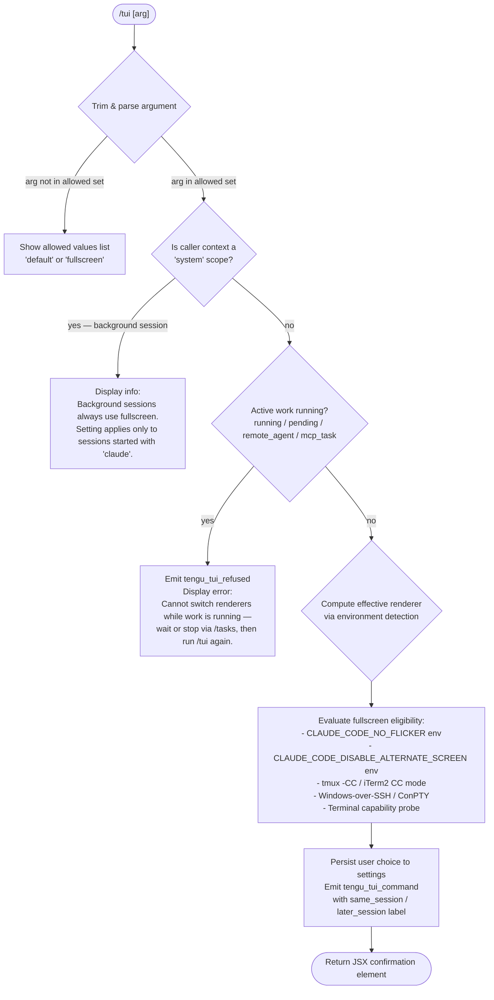

# `/tui`

> Analysis basis: CC v2.1.174 bundle.js (AST extraction + Claude interpretation)
> Minimum version: v2.1.174

---

## Overview

The `/tui` command lets users switch the terminal UI renderer between `default` and `fullscreen` modes at runtime. It validates the current environment and active session state before persisting the renderer choice, and fires telemetry to record both refusals and successful switches.

---

## Registration

| Field | Value |
|---|---|
| type | `local-jsx` |
| name | `tui` |
| description | `Set the terminal UI renderer (default \| fullscreen)` |
| argumentHint | `[default\|fullscreen]` |
| module_id | `TMK` |
| load_inline | `true` |
| loc_byte | `12669239` |
| loc_byte_end | `12669421` |
| loc_line | `8904` |
| arbor_handler.name | `Vn7` |
| arbor_handler.fqn | `claude-2.1.174::Vn7` |
| arbor_handler.kind | `AsyncFunction` |
| arbor_handler.resolution_path | `module_id` |
| arbor_handler.n_hits | `0` |

Analysis basis: CC v2.1.174 bundle.js:+12669239

---

## Input Branching

The command has four or more distinct branches (argument validation, background-session guard, active-work guard, renderer persistence), so a Mermaid flowchart is used.



Analysis basis: CC v2.1.174 bundle.js:+12667002

---

## Behavioral Spec

### 1. Argument Validation

```
function validateTuiArgument(rawArg):
    trimmed = rawArg.trim()
    allowed = getTuiAllowedValues()   // ["default", "fullscreen"]
    if trimmed not in allowed:
        return errorResult(join(allowed, " | "))
    return ok(trimmed)
```

The allowed-values list is sourced from an array joined with `" | "`. The handler calls `A.trim()` on the raw input before comparison.

Analysis basis: CC v2.1.174 bundle.js:+12667002

---

### 2. Background-Session Guard

```
function checkBackgroundSession(context):
    scope = getScopeFromContext(context)  // "system" scope = background/daemon worker
    if scope == "system":
        return infoMessage(
            "Background sessions always use the fullscreen renderer …"
            // ≤30-char fragment: "always use the fullscreen"
        )
    return continue
```

When the command is invoked inside a daemon-worker context (scope `"system"`), it returns an informational message and takes no further action.

Analysis basis: CC v2.1.174 bundle.js:+12667140

---

### 3. Active-Work Guard

```
function checkActiveWork(sessions):
    activeStates = ["running", "pending", "remote_agent", "mcp_task"]
    for session in Object.values(sessions):
        if session.state in activeStates:
            emit("tengu_tui_refused")
            return refusalMessage(
                "Cannot switch renderers while work is running …"
                // ≤30-char fragment: "Cannot switch renderers while"
            )
    return continue
```

The handler inspects all known session objects and refuses the switch if any is in an active state. The `tengu_tui_refused` event is fired on refusal.

Analysis basis: CC v2.1.174 bundle.js:+12667669, +12667797

---

### 4. Environment and Terminal Capability Detection

```
function computeEffectiveRenderer(desiredMode):
    // Environment overrides
    if env("CLAUDE_CODE_NO_FLICKER") is set:
        noFlicker = true
    if env("CLAUDE_CODE_DISABLE_ALTERNATE_SCREEN") is set:
        altScreenDisabled = true
    if env("CLAUDE_CODE_FORCE_FULLSCREEN_UPSELL") is set:
        forceUpsell = true

    // Terminal identity probes
    terminalType = detectTerminalType()
    // Probe result feeds into fullscreen eligibility:
    //   - ghostty >= 1.2.0
    //   - iTerm.app >= 3.6.6
    //   - cursor / vscode
    //   - xterm.js (version range ~1092000–1105000)
    //   - JetBrains IDE terminal

    // Auto-disable reasons
    if tmuxCCModeDetected():
        return disabledResult(
            "fullscreen disabled: tmux -CC (iTerm2 integration mode) detected …"
            // ≤30-char fragment: "fullscreen disabled: tmux -CC"
        )
    if windowsOverSSHDetected():
        return disabledResult(
            "fullscreen disabled: Windows over SSH (ConPTY re-rendering) detected …"
            // ≤30-char fragment: "fullscreen disabled: Windows ov"
        )

    return eligibleResult(desiredMode)
```

Terminal detection uses ANSI escape sequences `\x1b7` / `\x1b8` (save/restore cursor) as capability probes, and checks terminal-multiplexer strings (`tmux`, `screen`).

Analysis basis: CC v2.1.174 bundle.js:+12664355, +3507109, +3507295, +3847053

---

### 5. Renderer Persistence and Telemetry

```
async function persistRendererChoice(choice, context):
    // Load settings from disk via settings pipeline
    settings = await loadSettingsFromDisk()

    // Write the new tui value
    updateUserSettings(settings, { tui: choice })  // "fullscreen" or "default"
    await writeSettingsFile(settings)

    // Determine telemetry label
    if rendererChangeAppliesNow(choice):
        label = "same_session"
    else:
        label = "later_session"

    emit("tengu_tui_command", {
        value: choice,
        timing: label,
        // additional environment signals captured from detection phase
    })

    return confirmationJSX(choice)
```

The timing label `"same_session"` is used when the new renderer mode takes effect immediately; `"later_session"` when it will apply only on the next `claude` invocation.

Analysis basis: CC v2.1.174 bundle.js:+12668270, +12668734, +12668749

---

### 6. Settings Pipeline (sub-graph)

The settings write path calls through several layers:

```
function loadAndWriteSettings(newTuiValue):
    // Layer order: policySettings → flagSettings → userSettings →
    //              projectSettings → localSettings
    rawSettings = readUserSettingsFile(
        // candidates: settings.json, settings.local.json, cowork_settings.json
    )
    merged = mergeSettingLayers(rawSettings)
    merged.tui = newTuiValue
    atomicWrite(merged)        // rename-based atomic write with temp file
    invalidateCaches()         // clear ir8 cache + NQ6 cache
```

Analysis basis: CC v2.1.174 bundle.js:+1296387, +1296723, +27446

---

### 7. Fullscreen Eligibility State Machine (sub-graph for `uJH`)

The fullscreen-eligibility resolver tracks the following named states, which feed into both the command's output message and the `tengu_tui_command` telemetry payload:

| State key | Meaning |
|---|---|
| `bg_forced_on` | Fullscreen forced on by background-session constraint |
| `env_off` | Disabled via environment variable |
| `env_on` | Enabled via environment variable |
| `tmux_cc_auto_off` | Auto-disabled: tmux -CC / iTerm2 integration mode |
| `win_ssh_auto_off` | Auto-disabled: Windows-over-SSH / ConPTY |
| `settings_on` | Enabled by user settings |
| `settings_off` | Disabled by user settings |
| `downsell_on` | Upsell downgrade path active |
| `gb_on` / `gb_off` | Gradual-rollout flag on/off |

Analysis basis: CC v2.1.174 bundle.js:+3507854, +3507884, +3507934, +3508051

---

## State & Side Effects

| Item | Detail |
|---|---|
| Telemetry: `tengu_tui_command` | Fired on every successful renderer change; carries chosen value and `same_session` / `later_session` label (bundle.js:+12668270) |
| Telemetry: `tengu_tui_refused` | Fired when the switch is blocked by active background work (bundle.js:+12667797) |
| Telemetry: `tengu_amber_creek` | Fired from fullscreen-eligibility resolver (bundle.js:+3507626) |
| Telemetry: `tengu_pewter_brook` | Fired from fullscreen-eligibility resolver (bundle.js:+3507534) |
| Settings file write | Persists `tui` key to user `settings.json` via atomic rename |
| Cache invalidation | Clears `ir8` and `NQ6` caches after write (bundle.js:+27446, +27458) |
| appState changes | No direct appState mutation observed at depth 2; change propagates through settings reload on next render cycle |
| Process signals | Handler (`yEH`) removes existing SIGINT/SIGHUP listeners and re-registers them before the relaunch path; not triggered by normal `/tui` invocations (bundle.js:+12662875, +12662904) |
| Sound | None observed |

---

## Version History

| Version | Change |
|---|---|
| v2.1.174 | Initial analysis |

---

## Common Mistakes

1. **Invoking `/tui` while a background task is running** — the command will refuse with a `tengu_tui_refused` event and display an error directing the user to `/tasks`. Wait for background work to complete first.
2. **Expecting `/tui fullscreen` to work inside tmux -CC mode** — the environment-detection layer will override the choice with `tmux_cc_auto_off` unless `CLAUDE_CODE_NO_FLICKER=1` is explicitly set.
3. **Expecting the change to take effect in the current session** — when the runtime conditions do not permit an in-place switch, the label becomes `later_session`, meaning the new renderer applies only the next time `claude` is launched directly (not from a background session).
4. **Running `/tui` inside a daemon-worker session** — background sessions always use fullscreen; the command returns an informational message and ignores the argument.
5. **Omitting the argument entirely** — no default is applied silently; the command displays the allowed list (`default | fullscreen`) and exits without writing settings.

---

## Appendix — Identifier Mapping

> For bundle debugging only. Identifiers change across versions.

| Identifier | Role |
|---|---|
| `Vn7` | Main `/tui` command handler (AsyncFunction, arbor_handler) |
| `cm6` | Top-level command dispatcher / relaunch orchestrator |
| `yEH` | Relaunch / process-handoff function (spawnSync, signal handling, process.exit) |
| `bR` | Claude binary path resolver |
| `nk8` | Version-directory path builder |
| `g$` | Array normalisation helper |
| `QMH` | XDG data path resolver (`.local/share`) |
| `J9H` | User bin-directory path resolver |
| `C28` | Home-directory resolver (wraps `os.homedir`) |
| `Ak` | Application-state accessor |
| `k6` | Logger / reporter constructor |
| `jh6` | Interval-clear wrapper |
| `yl_` | Render-loop teardown (clearInterval) |
| `MbH` | Terminal-unmount / flush orchestrator |
| `Wb` | Alternate-screen restoration helper |
| `Y$8` | Terminal write-sync / restore cursor helper |
| `OkH` | Terminal emulator version checker (ghostty, iTerm) |
| `HkH` | Terminal-capability helper |
| `B0` | tmux / screen escape-sequence handler |
| `ZM` | Utility / misc helper |
| `N` | Logging / debug event emitter |
| `B08` | Scroll-summary capture (`tengu_scroll_summary`) |
| `J0` | JSX render root |
| `u6q` | Scroll-capture sub-helper |
| `c` | Generic constant / config object |
| `x6q` | Timing / frame-rate calculator (Date.now, Math.round) |
| `C6q` | Frame-delta helper |
| `N1` | Fullscreen-eligibility resolver (main) |
| `y8H` | Feature-flag lookup |
| `rv_` | Renderer-mode reader from settings |
| `ls` | Settings layer reader |
| `iv_` | Windows/SSH detection helper |
| `g_` | Generic state getter |
| `AF4` | Eligibility-signal aggregator |
| `w6` | Settings-key writer |
| `k4` | Promise timeout helper (setTimeout / Promise.race) |
| `CZ` | Analytics-client constructor |
| `M4` | Analytics event batcher |
| `R9` | Analytics event registrar |
| `aFH` | Analytics drain / flush |
| `ObH` | Analytics-flush timeout wrapper |
| `p08` | Flush-promise constructor |
| `eOA` | Binary-path resolver (dirname, path join) |
| `j_` | Config-root path helper |
| `Nf` | Path normaliser |
| `DMK` | Native library loader (dlopen, execve, bun:ffi) |
| `L` | Native library handle |
| `A` | Process/library abstraction |
| `q` | Socket / connection object |
| `f` | File-operation set |
| `$` | Spawn-event registry |
| `mDK` | Spawn-event emitter |
| `D` | Daemon session manager |
| `b` | Background-session worker |
| `l8` | Abort/timeout helper |
| `CH` | Feature-flag: ok path reporter (`tengu_feature_ok`) |
| `kH` | Feature-flag: sad path reporter (`tengu_feature_sad`) |
| `vg8` | Low-memory reporter (`tengu_bg_low_mem_mb`) |
| `TG6` | Config-file reader (readFile, Array.isArray) |
| `SH` | Error-log emitter |
| `Q` | Daemon IPC socket handler |
| `PTA` | Daemon claim / spawn client |
| `VTA` | Daemon session lifecycle manager |
| `Y` | Forced-shutdown / process.exit handler |
| `V8` | Version-string helper |
| `A6` | Startup / bootstrap helper |
| `B` | Generic disposable |
| `O` | Background-session context wrapper |
| `x8` | Background-session identifier |
| `M` | MCP connection manager (execve path) |
| `HCH` | MCP server connector |
| `Mi8` | MCP connection result applier |
| `NGA` | MCP roster updater |
| `z` | Daemon-stop orchestrator |
| `WS` | First-party registry helper |
| `dU` | Daemon shutdown race (Promise.race, process.exit) |
| `TH` | String coercion utility |
| `zX` | Relaunch-error file writer |
| `BB8` | CLI argument builder (--add-dir, --allow-dangerously-skip-permissions, --effort, --permission-mode) |
| `WVH` | Argument-array accumulator |
| `jK8` | Argument-validity checker |
| `C6` | Config loader (with backup/restore) |
| `r6` | File-system path helper |
| `TV_` | Config-validation helper |
| `C7H` | Config-file reader (readFileSync, statSync, mkdirSync) |
| `em4` | Config file-watcher |
| `S_` | Session-state extractor (working_directory, allowed_tools, etc.) |
| `eb8` | Session-field reader (working_directory) |
| `D1` | Session-field decoder |
| `Hx8` | Session-field reader (avoid_prompts, bypassPermissions) |
| `Sb` | Disable-permission-mode helper (`tengu_disable_bypass_permissions_mode`) |
| `v$` | App-state model reader (effort, model, max_thinking_tokens) |
| `j9` | Daemon-worker context checker |
| `aDH` | Daemon-worker role identifier |
| `uJH` | Fullscreen-eligibility state-machine writer |
| `fA` | Settings load/write pipeline (main) |
| `u3` | Settings-path builder |
| `IYH` | Settings-file path resolver |
| `us6` | User-settings path helper |
| `ZUf` | Settings-layer L6 accessor |
| `nu` | `.claude` directory path builder |
| `EUf` | Managed-settings path builder |
| `xB` | Settings object builder (all layers) |
| `TM6` | Policy-settings loader |
| `Da8` | Flag-settings loader |
| `PM6` | Project-settings loader |
| `TVH` | Local-settings loader |
| `EVH` | Cowork-settings loader |
| `ZM6` | Settings-merge helper |
| `kYH` | Settings-validation helper |
| `SYH` | Settings-schema checker |
| `D4_` | Settings-default filler |
| `wiA` | Settings-write helper |
| `Ba` | Settings-atomic-write helper |
| `sw6` | WSL / managed-settings path resolver |
| `ef_` | Settings full read-and-parse pipeline |
| `onA` | Settings parse orchestrator |
| `rnA` | Settings file-parse worker |
| `bB` | Settings cache read/write (ir8) |
| `RVA` | Settings cache getter (ir8.get) |
| `bk` | Deep-clone helper (structuredClone) |
| `af_` | Settings JSON parser and validator |
| `CVA` | Settings cache setter (ir8.set) |
| `nnA` | SDK-inline settings parser |
| `u4H` | Settings schema coercion (XUf/WUf/TUf) |
| `LcH` | Settings validation reporter |
| `Q2` | Project-settings context resolver |
| `Ca` | Project-settings file reader |
| `M$` | Real-path resolver (realpathSync) |
| `Ha6` | Settings path-existence helper |
| `_` | Settings object placeholder |
| `_a6` | Settings-key normaliser |
| `k8` | Version-string comparator |
| `Of_` | Settings-cache timestamp writer (sa6.set) |
| `vNH` | Settings path + object builder |
| `fw6` | Atomic file writer (writeFileSync, fchmodSync, fsyncSync, renameSync) |
| `RH` | JSON serialiser (JSON.stringify) |
| `lO` | Cache invalidator (NQ6.clear, ir8.clear) |
| `la6` | File-write pipeline with gitignore handling |
| `b6` | AsyncLocalStorage store accessor |
| `eo6` | Store getter wrapper |
| `lK_` | Lock/lease helper |
| `ca6` | Git-ignore checker |
| `p_` | Git-command runner |
| `amf` | Path-expansion helper (homedir, isAbsolute) |
| `icA` | File-write guard (already_tracked check) |
| `rcA` | File-write audit helper |
| `t6` | Write-feature reporter (`tengu_feature_sad`) |
| `uB` | Settings-load coordinator (loadSettingsFromDisk) |
| `nG` | Load-start marker |
| `Kq` | Memory-usage sampler |
| `Vu` | perf_hooks require |
| `H4_` | Full settings-load pipeline |
| `b8` | Log-file appender |
| `IQ6` | Load-timing helper |
| `aw6` | Watched-path registry |
| `K` | Daemon roster formatter |
| `hQ6` | Load-end marker |
| `eI` | Terminal-type detector |
| `A06` | Terminal-query helper |
| `wY` | Terminal-response parser |
| `dN_` | Terminal DA query sender |
| `Jc4` | Terminal response timeout |
| `qw` | Terminal-response normaliser |
| `Xc4` | xterm.js version parser (parseFloat, Math.min) |
| `cN_` | xterm.js response extractor |
| `zm` | First-party registration helper |
| `tC` | First-party config reader |
| `C24` | First-party data loader (L6) |
| `L6` | String-keyed data store |
| `G4` | Data-entry formatter |
| `iO` | First-party flag reader |
| `_NH` | No-telemetry / essential-traffic flag reader |
| `$gA` | Telemetry consent store (L6-backed) |
| `V9` | User-plan / entitlement resolver |
| `gp1` | Plan data builder |
| `nhH` | Plan probe (enterprise / team detection) |
| `Hb` | Plan object constructor |
| `CJ6` | Plan file reader (readFileSync) |
| `FLH` | Plan-flag checker (allow_product_feedback) |
| `_q` | Telemetry-opt-out checker |
| `CLH` | Plan-tier L6 accessor |

---

Note: index built via Arbor fallback; some signals (telemetry, literals) may be missing — see arbor-fallback.js.