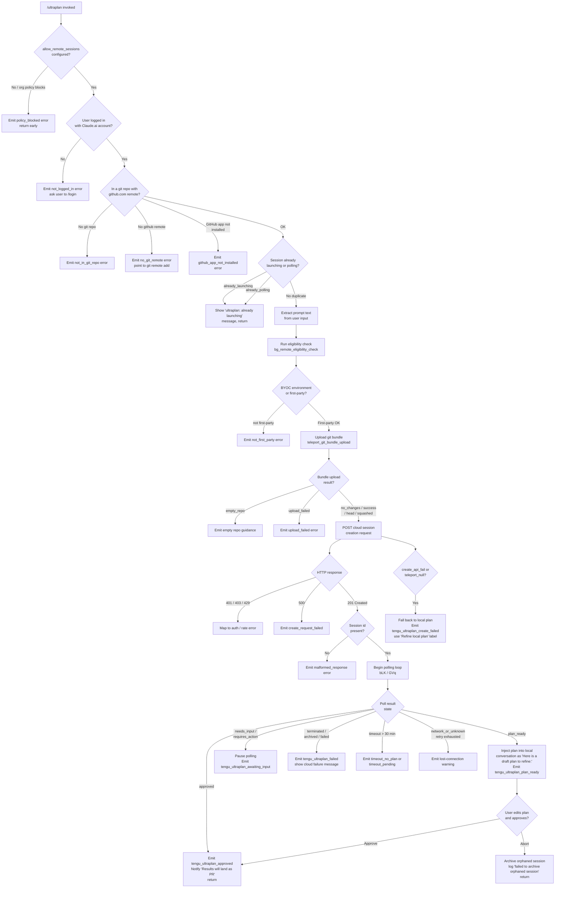

# `/ultraplan`

> Analysis basis: CC v2.1.174 bundle.js (AST extraction + Claude interpretation)
> Minimum version: v2.1.174

---

## Overview

`/ultraplan` drafts an editable plan for a given task by launching a remote cloud session (via the "teleport" subsystem) that runs an orchestrating agent on Anthropic's infrastructure. The cloud agent produces a structured plan which is then returned to the local CLI for the user to review, refine, and approve before execution proceeds. If remote sessions are unavailable or the user is not authenticated with a Claude.ai account, the command falls back to generating a local draft plan instead.

---

## Registration

| Field | Value |
|---|---|
| type | `local-jsx` |
| name | `ultraplan` |
| description | `Draft an editable plan in Claude Code on the web ( … ) · See …` |
| argumentHint | `<prompt>` |
| load_inline | `true` |
| load_ident | `Zc7` |
| loc_byte | `12494929` |
| loc_byte_end | `12495161` |
| loc_line | `8676` |
| arbor_handler.name | `Zc7` |
| arbor_handler.fqn | `claude-2.1.174::Zc7` |
| arbor_handler.kind | `AsyncFunction` |
| arbor_handler.resolution_path | `load_ident` |
| arbor_handler.n_hits | `1` |

Analysis basis: CC v2.1.174 bundle.js:+12494929

---

## Input Branching

The handler contains more than three distinct decision paths (remote-session eligibility, prompt extraction, plan lifecycle states, error conditions). A Mermaid flowchart is used.



Analysis basis: CC v2.1.174 bundle.js:+12493062 (handler entry), +12490287 (create_failed), +12491688 (teleport_null), +12486494 (plan_ready), +12487803 (failed)

---

## Behavioral Spec

### 1. Handler Entry Point (`handlerMain` / bundle: `Zc7`)

```
async function handlerMain(commandInput, appContext):
    userPrompt = extractPrompt(commandInput)        // yx8
    eligibility = checkRemoteEligibility(appContext) // V9

    if eligibility.allow_remote_sessions == false:
        return earlyExit("policy_blocked")

    if not eligibility.loggedIn:
        return earlyExit("not_logged_in",
            "Please run /login and sign in with your Claude.ai account (not Console).")

    currentState = appContext.getAppState()
    if currentState.ultraplanStatus in ["already_polling", "already_launching"]:
        return earlyExit("ultraplan: already launching. Please wait for the session to start.")

    appContext.setAppState({ ultraplanStatus: "system" })

    result = await launchSession(userPrompt, appContext)   // mm6
    if result.error in ["create_api_fail", "teleport_null"]:
        fallbackLocalPlan(userPrompt)                       // Ec7 fallback path

    await planLifecycleLoop(result.sessionId, appContext)  // Ec7 main path
```

Analysis basis: CC v2.1.174 bundle.js:+12493062, +12493397, +12493619

---

### 2. Prompt Extraction (`extractPrompt` / bundle: `yx8`)

```
function extractPrompt(rawInput):
    // Strip the "/ultraplan" command token from the front of the input
    // using a slice of the leading characters (offset 0 based)
    // then apply a regex replace to clean up whitespace / formatting
    // pattern: "$1$2" substitution (global, case-insensitive flag "gi")
    // Truncate to at most 5 trailing context characters if needed
    // Lowercase and normalize via A.replace → L.toLowerCase chain
    stripped = rawInput.slice(commandPrefixLength)
    cleaned  = stripped.replace(normalizationPattern, "$1$2")  // loc +10804284
    return cleaned.slice(0, maxPromptTokens)                   // limit: 5 tokens context loc +10804307
```

The literal `"gi"` (global, case-insensitive) regex flag is applied during prompt tokenization.
Analysis basis: CC v2.1.174 bundle.js:+10804159, +10804258, +10804284

---

### 3. Remote Eligibility Check (`checkRemoteEligibility` / bundle: `V9`)

```
function checkRemoteEligibility(appContext):
    orgConfig = readOrgConfig()                    // Hb → nhH
    tier = orgConfig.tier                          // "firstParty" | "enterprise" | "team"

    if FW4.has(tier):                              // first-party set check
        pass
    else if gW4.has(tier):                         // enterprise / team check
        pass

    telemetryMode = resolveTelemetryMode(_q)       // "essential-traffic" | "no-telemetry" | "default"
    hasProductFeedback = config["allow_product_feedback"]
    hasRemoteSessions  = config["allow_remote_sessions"]   // loc +12493083

    loginStatus = checkLoginStatus(nhH)            // returns {loggedIn, accessToken, orgUuid}
    if not loginStatus.loggedIn:
        return { error: "not_logged_in" }

    if not loginStatus.accessToken:
        return { error: "no_access_token",
                 message: "No access token found for cloud session creation" }

    if not loginStatus.orgUuid:
        return { error: "no_org_uuid",
                 message: "Unable to get organization UUID for cloud session creation" }

    return { ok: true, ...loginStatus }
```

Analysis basis: CC v2.1.174 bundle.js:+2517844, +2517860, +12493083, +9324651, +9324978

---

### 4. Session Launch (`launchSession` / bundle: `mm6`)

```
async function launchSession(prompt, appContext):
    eligibility = checkRemoteEligibility(appContext)   // V9
    if eligibility.error: return { error: eligibility.error }

    appState.ultraplanStatus = "already_launching"     // loc +12490527

    // Upload git bundle (teleport subsystem)
    bundleResult = await uploadGitBundle()             // DB8 → YB8 → w6
    // Possible outcomes: empty_repo, upload_failed, success, head, squashed, fallback_*

    if bundleResult.status == "empty_repo":
        return { error: "empty_repo",
                 message: "Not in a git repository" }

    // POST session creation (teleport phase: POST-sent)
    response = await postSessionCreate({              // Ec7 → Xr → KA.post
        prompt:      prompt,
        bundleMode:  bundleResult.mode,
        orgUuid:     eligibility.orgUuid,
        betaHeader:  "ccr-byoc-2025-07-29",           // loc +9325397
        xOrgHeader:  "x-organization-uuid"            // loc +9325419
    })

    if response.status in [401, 403, 429]:
        return { error: "github_repo_access_denied" }
    if response.status >= 500:
        return { error: "create_request_failed" }
    if response.status == 201 and not response.data.sessionId:
        return { error: "malformed_response",
                 message: "Server returned a malformed session response (no session id)" }

    appState.ultraplanStatus = "already_polling"      // loc +12490509
    return { sessionId: response.data.sessionId }
```

Analysis basis: CC v2.1.174 bundle.js:+12490250, +12490364, +12490509, +9326676, +9326712, +9326781, +9327161

---

### 5. Git Bundle Upload (`uploadGitBundle` / bundle: `d6A`)

```
async function uploadGitBundle():
    if not isGitRepo():
        return { status: "empty_repo", message: "Not in a git repository" }

    // Clean up stale seed refs
    git("update-ref", "-d", "refs/seed/stash")       // loc +9308962, +9308975
    git("update-ref", "-d", "refs/seed/root")        // loc +9308929

    // Check for commits
    refCount = git("for-each-ref", "--count=1", "refs/")  // loc +9309013
    if refCount == 0:
        return { status: "empty_repo",
                 message: "Repository has no commits yet" }

    // Create stash bundle
    stashOid = git("stash", "create")                // loc +9309299, +9309307
    // Write bundle file: ccr-seed.bundle / _source_seed.bundle
    bundlePath = tempDir + "ccr-seed.bundle"         // loc +9310106
    writeBundleFile(bundlePath)

    // Upload via POST to session API
    uploadResult = await postBundleUpload(bundlePath)
    if uploadResult.status != 200:
        return { status: "upload_failed" }

    telemetry("tengu_ccr_bundle_upload")
    return { status: "success", mode: determineBundleMode() }
    // bundle modes: head | fallback_head | squashed | fallback_squashed | explicit_env_bundle | git_repository
```

Analysis basis: CC v2.1.174 bundle.js:+9308810, +9308962, +9309040, +9310106, +9310562, +9310714

---

### 6. Plan Lifecycle Polling Loop (`planLifecycleLoop` / bundle: `Pc7` + `bLK` + `GVq`)

```
async function planLifecycleLoop(sessionId, appContext):
    startTime = Date.now()
    timeoutMs = 5400 * 1000       // 5400 seconds max (90 min) loc +12485816
    pollInterval = 1000           // 1 second base loc +9407473
    maxPollMs = 1800000           // 30 min cloud-session cap loc +9407480
    lostConnRetries = configured  // retry on network_or_unknown

    telemetry("tengu_ultraplan_timeout_seconds", { value: 5400 })
    telemetry("tengu_ultraplan_launched")

    loop:
        if Date.now() - startTime > maxPollMs:
            return timeout("cloud session exceeded 30 minutes")  // loc +9410121

        pollResult = await pollSession(sessionId)    // GVq

        switch pollResult.state:
            case "plan_ready":
                planText = extractPlanText(pollResult)
                injectLocalMessage("Here is a draft plan to refine:\n" + planText) // loc +12486123
                telemetry("tengu_ultraplan_plan_ready")
                waitForUserApproval()               // suspends loop

            case "needs_input" | "requires_action":
                telemetry("tengu_ultraplan_awaiting_input")
                // Pause and surface input request to user

            case "approved":
                telemetry("tengu_ultraplan_approved")
                showMessage("Results will land as a pull request when the cloud session finishes. There is nothing to do here.")
                // loc +12487404
                return success

            case "terminated" | "archived" | "failed":
                telemetry("tengu_ultraplan_failed")
                showMessage("Cloud ultraplan session failed. Wait for the user's next instructions.")
                // loc +12488227
                return

            case "running" | "starting" | "pending":
                await sleep(pollInterval)
                continue

            case "network_or_unknown":
                if retriesExhausted:
                    showWarning("Lost connection to the cloud session after repeated retries — the session may still be running")
                    // loc +12477142
                    return
                await sleep(pollInterval)
                continue

        if Date.now() - startTime > timeoutMs:
            telemetry("tengu_ultraplan_timeout_seconds")
            if planWasSeen:
                return timeout("timeout_pending")     // loc +12478185
            else:
                return timeout("timeout_no_plan")     // loc +12478203
```

Analysis basis: CC v2.1.174 bundle.js:+12485816, +9407473, +9407480, +12486123, +12486494, +12487404, +12488227, +12477142, +12478185, +12478203

---

### 7. Local Plan Fallback (`localPlanFallback` / bundle: `Ec7` fallback path)

```
function localPlanFallback(prompt):
    // When cloud session creation fails (create_api_fail or teleport_null),
    // synthesize a "Refine local plan" task locally
    telemetry("tengu_ultraplan_create_failed")
    label = "Refine local plan"                // loc +12491434
    planType = "plan"                          // loc +12491469
    taskNotification = "task-notification"     // loc +12491278
    origin = "precondition"                    // loc +12491102

    // Dispatch local workflow via NGH → JVq
    dispatchLocalWorkflow({
        prompt: prompt,
        label:  label,
        type:   planType,
        origin: origin
    })
```

Analysis basis: CC v2.1.174 bundle.js:+12491019, +12491102, +12491278, +12491434, +12491469, +12490287

---

### 8. Orphaned Session Cleanup

```
function cleanupOrphanedSession(sessionId):
    try:
        archiveSession(sessionId)    // via qR6 → nK.unlink / WjA
    catch error:
        log("ultraplan: failed to archive orphaned session")  // loc +12492747
    appState.ultraplanStatus = "skip"                          // loc +12493737
```

Analysis basis: CC v2.1.174 bundle.js:+12492747, +12487081, +12493737

---

### 9. Precondition Checks (bundle: `JVq` — `bg_remote_eligibility_check`)

The `bg_remote_eligibility_check` procedure (loc +9398998) performs the following gate checks before any network call:

| Check | Error Code | User-Facing Message |
|---|---|---|
| First-party API only | `not_first_party` | "Cloud sessions are only available on the first-party Anthropic API provider." |
| User logged in | `not_logged_in` | "Please run /login and sign in with your Claude.ai account (not Console)." |
| Git repo present | `not_in_git_repo` | (derived from git check) |
| GitHub remote present | `no_git_remote` | "Cloud agents require a GitHub remote. Add one with `git remote add origin REPO_URL`." |
| GitHub App installed | `github_app_not_installed` | (GitHub App installation check via `zuH`) |
| Org policy allows | `policy_blocked` | "Cloud sessions are disabled by your organization's policy. Contact your organization admin to enable them." |
| Access token present | `no_access_token` | "No access token found for cloud session creation" |
| Org UUID retrievable | `no_org_uuid` | "Unable to get organization UUID for cloud session creation" |
| BYOC check | `byoc` | Only Anthropic first-party environments may be used unless BYOC flag is set |

Analysis basis: CC v2.1.174 bundle.js:+9398928, +9400856, +9400878, +9401091, +9401113, +9401204, +9401358, +9401381, +9324651, +9324978

---

## State & Side Effects

| Item | Detail |
|---|---|
| Telemetry — `tengu_ultraplan_create_failed` | Fired when cloud session POST fails and local fallback is used (loc +12490287) |
| Telemetry — `tengu_ultraplan_prompt_identifier` | Fired at bundle upload time to record the prompt identifier (loc +12485949) |
| Telemetry — `tengu_ultraplan_timeout_seconds` | Records timeout threshold in seconds (loc +12485782) |
| Telemetry — `tengu_ultraplan_launched` | Fired immediately after a successful cloud session POST (loc +12491994) |
| Telemetry — `tengu_ultraplan_awaiting_input` | Fired when the cloud session enters `needs_input` / `requires_action` state (loc +12486426) |
| Telemetry — `tengu_ultraplan_plan_ready` | Fired when the cloud agent delivers the plan text (loc +12486494) |
| Telemetry — `tengu_ultraplan_approved` | Fired when the user approves the plan (loc +12486914) |
| Telemetry — `tengu_ultraplan_failed` | Fired when the cloud session terminates in a failure state (loc +12487803) |
| Telemetry — `tengu_ccr_bundle_upload` | Git bundle upload event (loc +9309103) |
| Telemetry — `tengu_ccr_bundle_seed_enabled` | Records that seed-bundle mode is active (loc +9399401) |
| Telemetry — `tengu_teleport_bundle_mode` | Records the selected bundle transfer mode (loc +9325747) |
| Telemetry — `tengu_ccr_session_link` | Records session hyperlink after creation (loc +9319086) |
| Telemetry — `tengu_teleport_source_decision` | Records which source strategy was chosen for the session (loc +9331223) |
| Telemetry — `tengu_teleport_generate_title` | Title/branch name generation event (loc +9312492) |
| Telemetry — `tengu_config_parse_error` | Fired when reading local config fails (loc +3317492) |
| Telemetry — `tengu_bg_dispatch_sigkill_escalate` | Background session SIGKILL escalation (loc +16858186) |
| Telemetry — `tengu_bg_low_mem_mb` | Low memory warning on macOS (loc +13305660) |
| Telemetry — `tengu_bg_dispatch_low_mem` | Dispatch skipped due to low memory (loc +16858787) |
| Telemetry — `tengu_bg_spare_enable` / `tengu_bg_spare_claim` / `tengu_bg_spare_claim_fail` | Background spare-slot management (loc +16859491, +16859619, +16859885) |
| Telemetry — `tengu_bg_sendclaim_failed` | IPC claim failure (loc +16836979) |
| Telemetry — `tengu_scheduled_task_missed` | Missed background task (loc +16354460) |
| Telemetry — `tengu_feature_ok` / `tengu_feature_bad` | Feature-flag reporting (loc +1016891, +1016958) |
| appState changes | `ultraplanStatus` transitions: `system` → `already_launching` → `already_polling` → `skip` (loc +12493155, +12490527, +12490509, +12493737) |
| Git side effects | Creates and deletes `refs/seed/stash`, `refs/seed/root`; writes temporary `ccr-seed.bundle` / `_source_seed.bundle` files; uploads bundle via HTTP |
| Task injection | On `plan_ready`, injects a message prefixed `"Here is a draft plan to refine:"` into the active conversation (loc +12486123) |
| Task notification | Fires `task-notification` UI event with label `"Ultraplan"` (loc +12492158) and sub-label `"Refine local plan"` on fallback (loc +12491434) |
| PR delivery | On `approved`, the cloud session delivers results as a pull request to the configured GitHub repository; no further local action is required (loc +12487404) |
| Session archival | On abort or error, attempts to archive the remote session via `nK.unlink` (loc +12487081) |
| Sound | <!-- TODO: not found in depth-2 traversal; needs --depth 4 --> |
| Hook registration | `R9` calls `qvA.register` (loc +63875) — registers a task lifecycle hook for background orchestration |

---

## Error Code Reference

| Code | Meaning |
|---|---|
| `not_logged_in` | User not authenticated with Claude.ai |
| `not_in_git_repo` | Working directory is not a git repository |
| `no_git_remote` | Repository has no `github.com` remote |
| `github_app_not_installed` | The Anthropic GitHub App is not installed on the repository |
| `policy_blocked` | Organization policy disables cloud sessions |
| `not_first_party` | API provider is not Anthropic first-party |
| `no_access_token` | OAuth access token is missing |
| `no_org_uuid` | Organization UUID could not be retrieved |
| `already_launching` | A session is already being created; duplicate guard |
| `already_polling` | A session poll is already in progress; duplicate guard |
| `empty_repo` | Repository has no commits |
| `no_git_remote` | No git remote URL found |
| `stash_failed` | Git stash creation failed before bundle upload |
| `upload_failed` | Bundle upload to cloud API failed |
| `create_request_failed` | Session POST returned HTTP 5xx |
| `github_repo_access_denied` | HTTP 401/403/429 returned by session API |
| `malformed_response` | Session created but no session ID in response |
| `no_default_env` | No default cloud environment found |
| `no_environments` | No environments available for session creation |
| `create_api_fail` | Generic API failure; triggers local plan fallback |
| `teleport_null` | Teleport returned null; triggers local plan fallback |
| `timeout_pending` | Session timed out while plan was pending |
| `timeout_no_plan` | Session timed out before any plan was produced |
| `network_or_unknown` | Repeated network failures during polling |
| `unexpected_error` | Unclassified exception during launch (loc +12492414) |
| `monorepo_source_disallowed` | Source repo config not permitted for this environment |
| `invalid_request_error` | API rejected the request as invalid |

---

## Version History

| Version | Change |
|---|---|
| v2.1.174 | Initial analysis |

---

## Common Mistakes

1. **Invoking with an API-key-only session**: `/ultraplan` requires authentication via a Claude.ai account (OAuth), not an Anthropic API key. Users must run `/login` first or the command will return a `not_logged_in` error immediately.
2. **Missing GitHub remote**: The teleport system requires a `github.com` remote to be present on the repository. A locally-only cloned repo (or one without a remote) will fail with `no_git_remote`. Add one with `git remote add origin <REPO_URL>` before using the command.
3. **Repository with no commits**: An empty git repository (initialized but nothing committed) causes an `empty_repo` failure. Run `git add . && git commit -m "initial"` before invoking `/ultraplan`.
4. **Issuing a second `/ultraplan` while one is running**: The `already_launching` / `already_polling` guard prevents concurrent sessions. The CLI will display "ultraplan: already launching. Please wait for the session to start." — there is no need to retry.
5. **Expecting immediate results**: The cloud agent may take several minutes to produce a plan. The session polls on a 1-second interval with a 30-minute cap before the cloud session itself times out, and up to 90 minutes for the full lifecycle. Users should not close the terminal during this window.
6. **Organization policy restrictions**: Enterprise accounts may have `allow_remote_sessions` disabled by an admin. The error `policy_blocked` with the message "Contact your organization admin to enable them" indicates this — it cannot be overridden by the user.
7. **Non-GitHub remotes (GitLab, Bitbucket, etc.)**: The eligibility check specifically tests for `github.com` in the remote URL. Non-GitHub remotes will fail the GitHub App installation check.

---

## Appendix — Identifier Mapping

> For bundle debugging only. Identifiers change across versions.

| Identifier | Role |
|---|---|
| `Zc7` | Main async handler for `/ultraplan` (entry point) |
| `yx8` | Prompt extraction — strips command prefix and normalizes text |
| `Ix8` | Inner prompt tokenization helper |
| `kfA` | Token stream processing / regex match pipeline |
| `V9` | Remote eligibility check — login, token, org UUID, policy |
| `gp1` | Eligibility check orchestrator |
| `nhH` | Login/auth status resolver |
| `Hb` | Organization config reader (firstParty / enterprise / team) |
| `CJ6` | Config file reader (readFileSync, utf-8) |
| `FLH` | Feature-flag / include-list checker |
| `_q` | Telemetry mode resolver |
| `$gA` | Telemetry mode lookup helper |
| `L6` | String conversion utility |
| `CLH` | Config lookup helper |
| `K$H` | App-state key helper |
| `mm6` | Session launch orchestrator |
| `c` | Generic async coordinator / promise wrapper |
| `$6` | JSX / React component factory |
| `S56` | React element creator |
| `f` | Promise lifecycle tracker (add/finally/delete) |
| `gLK` | UI notification helper |
| `DB8` | Git bundle upload dispatcher |
| `YB8` | Bundle upload inner handler |
| `w6` | Filesystem/git state checker with caching |
| `Dc7` | Bundle upload result decoder |
| `Ec7` | Plan lifecycle manager (main session loop coordinator) |
| `NGH` | Background task dispatcher |
| `JVq` | Remote eligibility precondition checker (`bg_remote_eligibility_check`) |
| `g9` | Task record builder |
| `rG` | Unique ID generator |
| `J5` | Timestamp utility |
| `Xc7` | Plan text assembler |
| `Jc7` | Plan chunk formatter |
| `Xr` | Teleport-to-remote core function |
| `b6` | API base-URL resolver |
| `G4` | Home directory resolver |
| `wO` | Token refresh helper |
| `ty8` | Auth header builder |
| `SH` | Error aggregator / logError wrapper |
| `oC` | HTTP response error mapper |
| `C1` | OAuth environment resolver (local / staging / prod) |
| `DD` | HTTP header builder for Anthropic API |
| `d6A` | Git bundle creation and upload implementation |
| `k6` | Random ID generator (short) |
| `N` | Message formatter / display helper |
| `A6` | React state setter wrapper |
| `UC` | Git remote URL extractor (`config --get remote.origin.url`) |
| `mZq` | Session control event builder (`set_permission_mode`, `apply_flag_settings`) |
| `pS6` | Phase logger (`[teleport] phase: *`) |
| `RH` | JSON stringify wrapper |
| `uZq` | Session link builder |
| `py8` | Poll-state classifier |
| `qHH` | Environment list fetcher (`teleport_environments_list`) |
| `R96` | Default environment creator (`teleport_default_environment_create`) |
| `TH` | String coercion wrapper |
| `O` | Background session state map |
| `F77` | Branch / title generator (`teleport_generate_title`) |
| `NS` | Subscription/watch helper with dedup |
| `zuH` | GitHub App installation checker |
| `JI` | Default branch detector (symbolic-ref / show-ref) |
| `_9` | Watcher lifecycle manager |
| `B8H` | Git remote URL parser / classifier |
| `i` | Permission mode state (allow/deny) |
| `DA` | Error stringifier |
| `rz` | Cancellation detector |
| `Zz` | Abort signal helper |
| `xY` | Claude.ai web URL resolver |
| `I_` | Module initializer |
| `Pm_` | Environment URL selector (localhost / staging / prod) |
| `Gc7` | Session cleanup / archive helper |
| `ZuH` | Remote agent session poller bootstrap |
| `by` | Random bytes generator wrapper |
| `E96` | Browser/web session opener |
| `cW` | Session pending state tracker |
| `T57` | Poll result message builder |
| `GVq` | Main cloud session polling loop |
| `Ph` | Background task registry |
| `dJ7` | Task-started record builder |
| `gJ7` | Task-updated record builder |
| `O9A` | Task state machine |
| `cJ7` | Local workflow task dispatcher |
| `lJ7` | Object-keyed task dispatcher |
| `_KH` | Task status classifier (user_typed / active / aborted) |
| `Pc7` | Plan-ready handler (injects plan text, triggers approval UI) |
| `bLK` | Polling retry loop with exponential back-off |
| `wc7` | Session state watcher setup |
| `Tc7` | Task completion handler |
| `qR6` | Orphaned session archiver (unlink) |
| `K` | Column/padding formatter |
| `qU` | Cloud session POST helper |
| `R9` | Hook registrar (`qvA.register`) |
| `Wc7` | Post-launch UI updater |
| `C6` | Config read-with-watch entry point |
| `r6` | Config file path resolver |
| `TV_` | Config schema validator |
| `C7H` | Config file parser (readFileSync + JSON.parse) |
| `l6` | JSON parser wrapper |
| `gu` | CLAUDE.md path normalizer |
| `V8` | Version/build info record |
| `M19` | Directory listing helper for config discovery |
| `ZV_` | Path joiner (backup dir) |
| `$` | Iterator/map utility |
| `D` | Background session daemon manager |
| `b` | PTY/socket session wrapper |
| `l8` | Timeout/abort wrapper |
| `CH` | Feature-flag OK recorder |
| `kH` | Feature-flag bad recorder |
| `vg8` | macOS memory probe |
| `TG6` | Allow-list config reader |
| `Q` | IPC socket manager |
| `PTA` | Socket claim/connect handler |
| `VTA` | Full background session lifecycle manager |
| `Y` | Forced shutdown / exit handler |
| `B` | Socket reconnect handler |
| `em4` | File-watch subscription manager |
| `ZF` | Config change broadcaster |
| `p46` | Parallel eligibility + environment bootstrap |
| `H` | Generic string or data buffer (context-dependent) |
| `L` | Generic map/store (context-dependent) |
| `q` | Generic set or queue (context-dependent) |
| `M` | MCP tool registry accessor |
| `A` | Generic array accumulator (context-dependent) |