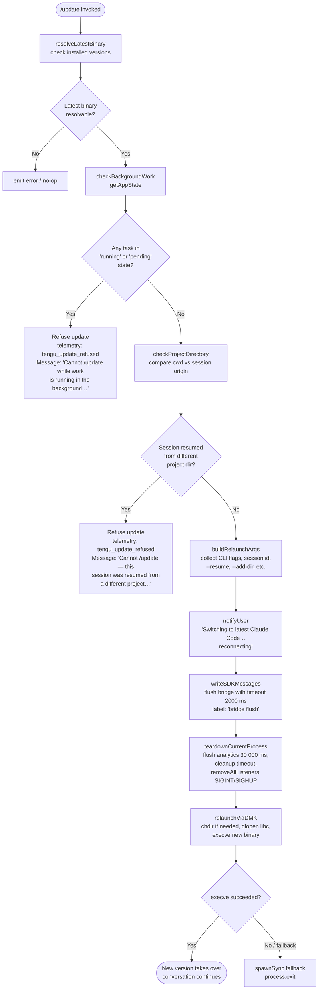

# `/update`

> Analysis basis: CC v2.1.174 bundle.js (AST extraction + Claude interpretation)
> Minimum version: v2.1.174

---

## Overview

The `/update` command switches the running Claude Code CLI to the latest installed version without terminating the current conversation. It performs a series of preflight safety checks, then tears down the current process state and relaunches via `execve` (or `spawnSync`) under the newest binary, carrying the active session forward via `--resume`.

---

## Registration

| Field | Value |
|---|---|
| type | `local` |
| name | `update` |
| description | `Switch to the latest version (conversation continues)` |
| loc_byte | `12943945` |
| loc_byte_end | `12944186` |
| loc_line | `9147` |
| supportsNonInteractive | `false` |
| isHidden | `true` |
| module_id | `BwK` |
| load_inline | `true` |
| arbor_handler.name | `ha7` |
| arbor_handler.fqn | `claude-2.1.174::ha7` |
| arbor_handler.kind | `AsyncFunction` |
| arbor_handler.resolution_path | `module_id` |
| arbor_handler.n_hits | `0` |

Analysis basis: CC v2.1.174 bundle.js:+12943945

---

## Input Branching

The command has more than three distinct execution paths (background-work guard, project-directory guard, normal teardown + relaunch, and error paths), so a Mermaid flowchart is used.



Analysis basis: CC v2.1.174 bundle.js:+12941747 – +12943357

---

## Behavioral Spec

### 1. Resolve Latest Binary (`resolveLatestBinary` / `PF8` → `w3` / `bR`)

```
function resolveLatestBinary():
    claudeExec = which("claude")          # via Bun.which
    if not claudeExec:
        return null

    versionsDir = join(homedir(), ".local", "share", "versions")
    entries = listVersionEntries(versionsDir)       # bR → nk8 → g$
    # entries sorted; index 1 is the latest (0-based, skipping current)
    latestBinDir = join(versionsDir, latestEntry, "bin")
    latestBin    = join(latestBinDir, "claude")
    return latestBin
```

Constants:
- Version store root: `~/.local/share/versions` (bundle.js:+6921413, +6921422)
- Binary subdirectory: `bin` (bundle.js:+6921493)
- Array index `1` used to select latest entry (bundle.js:+9580761)

Analysis basis: CC v2.1.174 bundle.js:+12941747, +12941800

---

### 2. Preflight Guards (`ha7` main handler)

#### 2a. Background-Work Guard

```
function checkBackgroundWorkGuard(appState):
    tasks = Object.values(appState.tasks or {})
    for task in tasks:
        if task.status == "running" or task.status == "pending":
            fire telemetry("tengu_update_refused")
            return Error(
                "Cannot /update while work is running in the background "
                "— wait for it to finish, then try again."
            )
    return OK
```

Error message literal (truncated citation): `"Cannot /update while work is running…"` (bundle.js:+12942211)

Status strings checked: `"running"` (bundle.js:+12942108), `"pending"` (bundle.js:+12942130)

Analysis basis: CC v2.1.174 bundle.js:+12942070

#### 2b. Project-Directory Guard

```
function checkProjectDirectoryGuard(currentSessionOrigin, cwd):
    resolvedOrigin = resolvePathWithFFI(currentSessionOrigin)  # eOA
    if resolvedOrigin != cwd:
        fire telemetry("tengu_update_refused")
        return Error(
            "Cannot /update — this session was resumed from a different "
            "project directory. Restart manually with --resume to "
            "continue on the latest version."
        )
    return OK
```

Error message literal (truncated citation): `"Cannot /update — this session was resumed…"` (bundle.js:+12942455)

Analysis basis: CC v2.1.174 bundle.js:+12942321, +12942337, +12942350

---

### 3. Collect Relaunch Arguments (`buildRelaunchArgs` / `BB8`)

```
function buildRelaunchArgs(originalArgv, sessionId, extraDirs):
    args = Array.from(originalArgv)

    # Carry forward permission and effort flags
    if "--allow-dangerously-skip-permissions" in args: keep it
    if "--effort" in args: keep it
    if "--permission-mode" in args: keep it

    # Inject session resume
    args.push("--resume", sessionId)

    # Inject additional directories
    for dir in extraDirs:
        args.push("--add-dir", dir)

    return args
```

Literals: `"--resume"` (bundle.js:+12662335), `"--add-dir"` (bundle.js:+12663859), `"--allow-dangerously-skip-permissions"` (bundle.js:+12663974), `"--effort"` (bundle.js:+12664116), `"--permission-mode"` (bundle.js:+12664133)

Analysis basis: CC v2.1.174 bundle.js:+12943269

---

### 4. User Notification and Bridge Flush (`ha7` → `pwK` / `O.writeSdkMessages` / `k4`)

```
function notifyAndFlush(outputStream):
    # Generate a UUID for the final assistant message
    msgId = crypto.randomUUID()           # pwK → XF8.randomUUID

    # Write a text message to the SDK output
    writeSDKMessage(outputStream, {
        type: "assistant",
        content: [{ type: "text",
                    text: "Switching to latest Claude Code… reconnecting" }]
    })

    # Flush bridge with 2 000 ms timeout
    await timedFlush(outputStream, timeout=2000, label="bridge flush")
    # O.flush then O.teardown
```

Literal: `"Switching to latest Claude Code… reconnecting"` (bundle.js:+12942967)
Flush timeout: `2000` ms (bundle.js:+12943047)
Flush label: `"bridge flush"` (bundle.js:+12943052)

Analysis basis: CC v2.1.174 bundle.js:+12942943, +12943034, +12943037, +12943088

---

### 5. Process Teardown and Relaunch (`relaunchHandler` / `yEH` → `DMK`)

```
async function relaunchHandler(latestBin, relaunchArgs, workingDir):
    # Stat the binary to confirm it exists
    await fs.stat(latestBin)                          # XMK.stat

    # Stop spinner / TUI
    stopSpinner()                                     # jh6 → yl_ (clearInterval)
    unmountUI()                                       # MbH → H.unmount

    # Wait for parallel cleanup tasks with timeouts
    await Promise.all([
        timedTask(flushAnalytics,  timeout=30000, label="flush timeout (relaunch)"),
        timedTask(cleanupResources, timeout=...,  label="cleanup timeout"),
        timedTask(drainAnalytics,  timeout=...,  label="analytics flush timeout"),
    ])

    # Reassign signal handlers
    process.removeAllListeners("SIGINT")
    process.removeAllListeners("SIGHUP")
    process.on("beforeExit", ...)
    process.on("exit", ...)

    # Change directory if required
    if not path.isAbsolute(workingDir):
        workingDir = path.join(process.cwd(), workingDir)
    process.chdir(workingDir)                         # DMK → process.chdir

    # Attempt execve via FFI (macOS: libSystem.B.dylib / Linux: libc.so.6)
    loadLibC()                                        # DMK → L.dlopen
    # Build argv buffer in UTF-8
    argv = buildArgvBuffer([latestBin] + relaunchArgs)
    # execve replaces the current process image
    execve(latestBin, argv, currentEnv)               # DMK → M.execve

    # Fallback: execve not available or failed
    spawnSync(latestBin, relaunchArgs, { stdio: "inherit" })  # JMK.spawnSync
    process.exit(...)
```

Timeouts: `30000` ms flush (bundle.js:+12662402), cleanup label (bundle.js:+12662464), analytics label (bundle.js:+12662520)
Signal names: `"SIGINT"` (bundle.js:+12662875), `"SIGHUP"` (bundle.js:+12662894)
Spawn stdio: `"inherit"` (bundle.js:+12662996)
macOS libc path: `"/usr/lib/libSystem.B.dylib"` (bundle.js:+12661483)
Linux libc name: `"libc.so.6"` (bundle.js:+12661512)
FFI type descriptors: `"ptr"` (bundle.js:+12661539), `"int"` (bundle.js:+12661566), `"utf8"` (bundle.js:+12661615)

Analysis basis: CC v2.1.174 bundle.js:+12943210, +12662189, +12662961, +12661462, +12661838

---

### 6. Session-State Snapshot (`getSessionSnapshot` / `S_` / `v$`)

Before relaunch the handler reads the current app state to reconstruct session parameters:

```
function getSessionSnapshot(appState):
    lastEntry = appState.messages.findLast(m => m.role == "assistant")
    workingDirectory  = extractField(lastEntry, "working_directory")
    allowedTools      = extractField(lastEntry, "allowed_tools")
    disallowedTools   = extractField(lastEntry, "disallowed_tools")
    avoidPrompts      = extractField(lastEntry, "avoid_prompts")
    permissionMode    = extractField(lastEntry, "permission_mode")
    bypassPermissions = extractField(lastEntry, "bypassPermissions")

    effortLevel       = getAppStateField(appState, "effort")
    model             = getAppStateField(appState, "model")
    maxThinkingTokens = getAppStateField(appState, "max_thinking_tokens")
    flagSettings      = getAppStateField(appState, "flag_settings")

    return { workingDirectory, allowedTools, disallowedTools, avoidPrompts,
             permissionMode, bypassPermissions, effortLevel, model,
             maxThinkingTokens, flagSettings }
```

Field literals: `"working_directory"` (bundle.js:+10707468), `"allowed_tools"` (bundle.js:+10707523), `"disallowed_tools"` (bundle.js:+10707578), `"avoid_prompts"` (bundle.js:+10707639), `"permission_mode"` (bundle.js:+10707741), `"bypassPermissions"` (bundle.js:+10707772), `"effort"` (bundle.js:+10708096), `"model"` (bundle.js:+10708109), `"max_thinking_tokens"` (bundle.js:+10708121), `"flag_settings"` (bundle.js:+10708147)

Analysis basis: CC v2.1.174 bundle.js:+12943273, +12943279, +12943290

---

## State & Side Effects

| Item | Detail |
|---|---|
| Telemetry — `tengu_update_refused` | Fired when either background-work guard or project-directory guard blocks the update (bundle.js:+12941847) |
| Telemetry — `tengu_scroll_summary` | Fired during UI teardown / scroll-save path (bundle.js:+7393669) |
| Telemetry — `tengu_amber_creek` | Fired in fullscreen-mode detection path (bundle.js:+3507626) |
| Telemetry — `tengu_pewter_brook` | Fired in fullscreen-mode detection path (bundle.js:+3507534) |
| Telemetry — `tengu_bg_dispatch_sigkill_escalate` | Fired if background session requires SIGKILL escalation during cleanup (bundle.js:+16858186) |
| Telemetry — `tengu_scheduled_task_missed` | Fired if a scheduled task is dropped during teardown (bundle.js:+16354460) |
| Telemetry — `tengu_feature_bad` / `tengu_feature_ok` | Fired by feature-flag probing during cleanup (bundle.js:+1016958, +1016891) |
| Telemetry — `tengu_bg_low_mem_mb` | Background session low-memory event (bundle.js:+13305660) |
| Telemetry — `tengu_bg_dispatch_low_mem` | Dispatcher low-memory guard (bundle.js:+16858787) |
| Telemetry — `tengu_bg_spare_enable` / `tengu_bg_spare_claim` / `tengu_bg_spare_claim_fail` | Spare-session lifecycle during relaunch orchestration (bundle.js:+16859491, +16859619, +16859885) |
| Telemetry — `tengu_bg_sendclaim_failed` | Claim handshake failure (bundle.js:+16836979) |
| Telemetry — `tengu_daemon_control` | Daemon stop/start event (bundle.js:+16895373) |
| Telemetry — `tengu_config_parse_error` | Config parse failure during reload (bundle.js:+3317492) |
| Telemetry — `tengu_disable_bypass_permissions_mode` | Bypass-permissions mode reset on relaunch (bundle.js:+4269288) |
| appState changes | `_.getAppState` / `_.setAppState` read and patch the running app state before bridge teardown (bundle.js:+12942703, +12942857) |
| SDK message write | `O.writeSdkMessages` emits the "reconnecting" assistant turn to the output stream before process replacement (bundle.js:+12942943) |
| Bridge flush + teardown | `O.flush` (2 000 ms timeout) then `O.teardown` drain all pending SDK messages (bundle.js:+12943037, +12943088) |
| History append | `_.appendEntry` writes `"last-prompt"` entry to conversation history before relaunch (bundle.js:+13473801, literal +13473821) |
| TUI unmount | `H.unmount` + `MbH` tears down the Ink/TTY UI before exec (bundle.js:+7391913) |
| Signal listeners | All `SIGINT` and `SIGHUP` listeners are removed; minimal `beforeExit`/`exit` handlers are re-registered (bundle.js:+12662904, +12662934) |
| Process replacement | `M.execve` (FFI) replaces the process image; `JMK.spawnSync` + `process.exit` used as fallback (bundle.js:+12661838, +12662961) |
| Write-file side effect | `zX` writes a temp file (via `EgH.writeFileSync`) during relaunch-error handling (bundle.js:+196407) |
| Sound | None observed in depth-2 traversal |

---

## Version History

| Version | Change |
|---|---|
| v2.1.174 | Initial analysis |

---

## Common Mistakes

1. **Running `/update` during active background tasks** — the command will be refused with the message "Cannot /update while work is running in the background…". Wait for all background tasks to reach a terminal state before invoking `/update`.

2. **Resuming a session from a different project directory and then running `/update`** — the command will be refused. The safest recovery is to exit and restart manually with `--resume` pointing to the correct project directory.

3. **Expecting `/update` to appear in the help menu** — the command is registered with `isHidden: true` and will not appear in `/help` or autocomplete listings.

4. **Expecting `/update` to work non-interactively** — `supportsNonInteractive: false` means the command is not available in `--print` / pipe mode.

5. **Assuming a clean process exit** — `/update` does not exit cleanly in the traditional sense; it calls `execve` to *replace* the process image. If `execve` fails, a `spawnSync` fallback with `process.exit` is used, which may still terminate unexpectedly. Ensure no critical unsaved state lives only in the current process heap.

6. **Relying on the conversation being seamlessly transferred in all edge cases** — if the binary stat check fails (latest binary not on disk) or the FFI load of libc fails, the relaunch may fall back to `spawnSync`, which can break the terminal state. In those situations a manual restart is required.

---

## Appendix — Identifier Mapping

> For bundle debugging only. Identifiers change across versions.

| Identifier | Role |
|---|---|
| `ha7` | Main async handler for `/update` (Arbor-resolved, `claude-2.1.174::ha7`) |
| `PF8` | Resolve-latest-binary wrapper; calls `w3` (which check) and `bR` (version-dir scan) |
| `w3` | `which`-lookup wrapper for the `claude` executable |
| `rxA` | Thin helper that delegates to `Bun.which` |
| `bR` | Scans the versions directory and returns sorted entries |
| `nk8` | Inner helper: reads version entries array from `~/.local/share/versions` |
| `g$` | `Array.isArray` guard / coerce-to-array helper |
| `QMH` | Builds the versions-directory path (home + `.local/share`) |
| `C28` | Calls `os.homedir()` |
| `J9H` | Builds the per-version `bin/` path |
| `yEH` | Core relaunch orchestrator: stat, teardown TUI, flush, exec |
| `DMK` | Low-level execve wrapper: chdir, FFI dlopen, argv buffer, `M.execve` |
| `BB8` | Builds the `--resume` / `--add-dir` / flag-forwarding argv array |
| `S_` | Reads session snapshot fields from app-state messages |
| `v$` | Reads per-field app-state scalars (effort, model, etc.) |
| `eOA` | Resolves the session's origin project directory path |
| `pwK` | Generates a UUID for the final SDK message (`crypto.randomUUID`) |
| `k4` | Generic timed-promise wrapper (`setTimeout` + `Promise.race` + `clearTimeout`) |
| `MbH` | TUI teardown: `writeSync`, cache lookup, `H.unmount`, bell/visual reset |
| `Y$8` | Terminal-restore helper: saves/restores cursor, handles tmux/iTerm escape sequences |
| `OkH` | Terminal emulator version check (Ghostty ≥ 1.2.0, iTerm ≥ 3.6.6) |
| `B08` | Post-teardown screen-restoration routine |
| `jh6` | Spinner stop helper (delegates to `yl_` / `clearInterval`) |
| `yl_` | Clears the spinner interval |
| `ObH` | Async UI cleanup wrapper (`Promise.resolve`, `H` unmount) |
| `CZ` | Analytics-drain wrapper (`M4`) |
| `aFH` | Queue-drain helper (`qvA.drain`) |
| `zX` | Writes error-context file on relaunch spawn failure |
| `IJ` | Executable path normaliser (`NJ.basename` + `k6`) |
| `GwA` | Appends `"last-prompt"` history entry before relaunch |
| `SH` | Logger / error-formatter utility |
| `TG` | Transition-state helper used before setAppState |
| `cKH` | Checks for `"assistant-"` prefixed message IDs |
| `Y6H` | Checks attachment / hook-success type fields |
| `j9` | Process-type guard (rejects `"bg"`, `"daemon"`, `"daemon-worker"`) |
| `aDH` | Inner process-type string check |
| `mXH` | Converts binary path to string representation |
| `N1` | Render / display helper for the TUI update notification |
| `w6` | React/Ink component registration helper |
| `x6q` | Progress-bar timing calculator (`Date.now`, `Math.max`, `Math.round`) |
| `M4` | Background-session manager entry point |
| `R9` | IPC/socket registration helper (`qvA.register`) |
| `NGA` | MCP-connection updater (Object.entries, filter, `HCH`, `Mi8`) |
| `HCH` | MCP server connection handler |
| `Mi8` | Applies an MCP update to a connection slot |
| `M` | Daemon/background session orchestrator |
| `VTA` | Background-session state machine (spawned → idle → done/failed/crashed) |
| `PTA` | Socket claim/auth handler for daemon sessions |
| `D` | Background-session dispatcher (SIGKILL escalation, low-mem, spare) |
| `vg8` | Low-memory event reporter |
| `TG6` | Reads and parses config file (UTF-8) |
| `z` | Daemon stop sequencer (`daemon_stop`, `daemon_stop_failed`) |
| `dU` | Shutdown race: `Promise.race(all, timeout)` then `process.exit` |
| `WS` | Daemon control event emitter |
| `L6` | String-coercion utility |
| `DA` | Error-string formatter |
| `_q` | Telemetry traffic-class selector (`essential-traffic`, `no-telemetry`, `default`) |
| `$gA` | Inner telemetry class resolver |
| `dbf` | Ring-buffer queue shift/push |
| `Sb` | Permission-mode disabler |
| `dA` | Inner permission flag toggle |
| `eb8` | Session-field extractor (`D1`) |
| `Hx8` | Secondary session-field extractor (`D1`) |
| `D1` | Low-level field-accessor on session record |
| `AF4` | Component factory helper |
| `iv_` | Boolean-coercion guard |
| `ls` | List/display helper (`_F4`) |
| `rv_` | String formatter (`L6`) |
| `y8H` | Feature-set membership check (`aSf.has`) |
| `g_` | UI utility (`uB`) |
| `N` | ANSI / terminal string formatter |
| `C6` | File-watcher / config-loader composite |
| `C7H` | Synchronous config reader (readFileSync, statSync, mkdirSync, copyFileSync) |
| `em4` | Config file-watcher setup (`I58.watchFile` / `I58.unwatchFile`) |
| `jK8` | Config-change event coordinator |
| `WVH` | Argv-forwarding helper |
| `rG` | Low-level async runner / scheduler |
| `Ak` | Path-join utility alias |
| `j_` | Async file helper (`rG`) |
| `Nf` | Secondary async file helper (`rG`) |
| `k6` | Generic async runner (`rG`) |
| `Wb` | Terminal bell / notification emitter |
| `ZM` | Terminal mode toggle |
| `p08` | UI promise resolver |
| `CH` | Feature-flag "ok" probe |
| `kH` | Feature-flag "bad" probe |
| `V8` | Version-string comparator |
| `A6` | Low-level socket/IPC entry point |
| `B` | IPC message encoder |
| `Q` | PTY/socket lifecycle manager (connect, drain, pong, auth, destroy) |
| `l8` | Promise-based timeout/abort helper |
| `b` | Scheduled-task runner |
| `f` | Connection-slot lifecycle (add, finally, delete) |
| `q` | Connection-slot set |
| `$` | FFI handle registry |
| `mDK` | Telemetry event builder (`Date.now`, `c9`, `Dp6`, `RH`) |